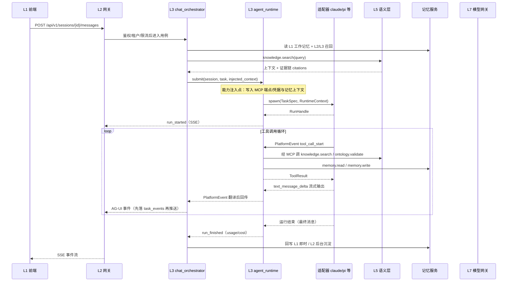
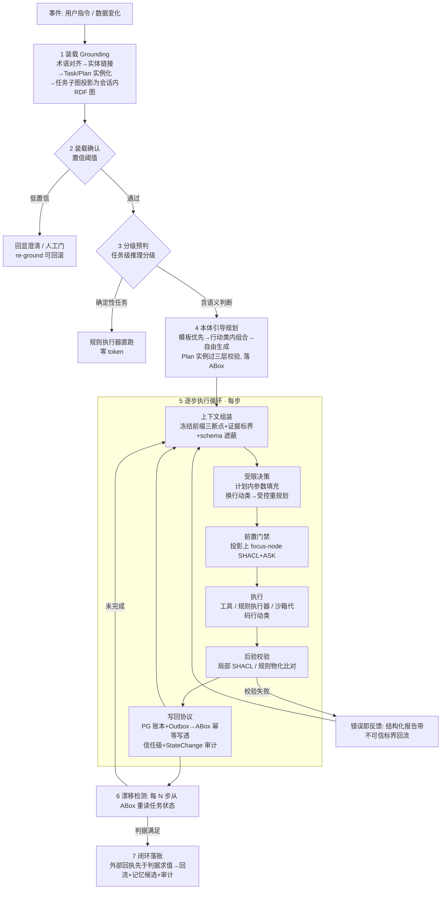

# Agent 服务 - 设计

> 状态：v0.2 | 日期：2026-09-26 | 上游依据：[架构锚点](../architecture/01-总体架构与分层.md)、[研究整理/02-Agent服务与协议](../研究整理/02-Agent服务与协议.md)、[研究整理/01-Agent工具调研](../研究整理/01-Agent工具调研.md)、[02-Agent内核与能力层划分设计](./02-Agent内核与能力层划分设计.md)（**内核机制裁决权威**，2026-09-26 07合入新增 §4.1）、[研究整理/07 §6](../研究整理/07-Harness-Agent解剖与本体骨架.md)（本体原生 agent loop 运行时设计）

Agent 服务是平台托管 agent 工具（nanobot / openclaw / hermes-agent / claude / pi）的运行时：**对下**经模型协议接模型（LiteLLM 统一，Claude 保留直连通道），**对上/对横**以 REST + SSE（AG-UI 蓝本）对接前端、以 MCP 对接工具总线（研究整理 02 篇首语与 §4 结论）。

## 1. 服务职责与边界

四项职责沿用研究整理 02 §1，落到锚点 §4 的代码路径（下文 `services/` 路径以锚点为准，改名待办见 §10）：

| # | 职责 | 说明 | 代码落点 |
| ---- | ---- | ---- | ---- |
| 1 | 托管 agent 工具 | 为五类 agent 工具提供标准运行时插槽：下发任务、回收事件流、注入平台工具（研究整理 01 §7） | `services/business/agent_runtime/` |
| 2 | 会话与任务管理 | 会话生命周期、多租户隔离、任务/运行状态机 | `services/gateway/routers/{agents,sessions}.py`、`services/domain/model/{agent,session,task}/` |
| 3 | 模型接入 | 统一经 L7 模型网关（LiteLLM；Claude 直连通道吃 prompt caching，锚点 §3.3） | 本服务只消费 `services/infra/llm/`，不自建模型客户端 |
| 4 | 平台能力注入 | 把知识检索、本体校验、记忆、业务动作以 MCP 工具形态注入各 agent 工具上下文 | `services/business/agent_runtime/capabilities.py` + `services/infra/mcp_gateway/` |

**边界（不做的事，及归属）**：检索/推理算法实现 → L5 语义层（docs/OntRAG、docs/ontology）；MCP 协议实现与外部 MCP 接入治理 → L7 MCP 网关（docs/MCP）；插件上架与生命周期 → `business/plugin_lifecycle`（docs/Skills）；对话用例编排（检索→校验→生成→回写的顺序决策）→ `business/chat_orchestrator`，本服务是其执行臂（§4）。

**术语约定**：本文"agent 工具"指被托管的第三方 agent（研究整理 01 的五个）；"Agent 服务"指平台本模块；"Agent"指平台内注册的一条 agent 工具实例配置（§2 领域模型）。

## 2. 领域模型

三个聚合根，纯 Python 放 `services/domain/model/`（L4 零框架依赖，锚点 §2）：

| 聚合根 | 包含实体/值对象 | 关键不变式 | 仓储接口（L4 repo） |
| ---- | ---- | ---- | ---- |
| Agent | AgentConfig、AdapterBinding、CapabilityBinding | 一条 Agent 只绑定一种适配器类型；capability_bindings 必须是平台已注册能力；disabled 状态不得被新会话引用 | AgentRepository |
| Session | Message | message.seq 会话内严格递增；同一 Session 同一时刻至多一个活跃 Run | SessionRepository |
| Task | Run、TaskEvent | Run 隶属 Task；task_events.seq 任务内严格递增且先落库后推送；终态不可逆 | TaskRepository |

### 2.1 状态机（2026-09-26 起权威定义在领域层，本篇只引用不复制）

Session 与 Run/Task 的状态机**权威定义在 [04-领域层设计 §3](../architecture/04-领域层设计.md)**，防双源漂移：

- **session**：`created → active ⇄ idle → closed → archived`（idle=静默超时；TTL 到期自动 closed；closed 触发 L1 归档与 L2 沉淀）；
- **run**：`queued → running ⇄ waiting_tool → completed / failed / timeout / cancelled`；**task**：`pending → running → succeeded / failed / cancelled`（attempt_count ≤3，失败可建新 Run）。

> `waiting_tool` 涵盖两种暂停：等工具结果（毫秒~秒级）、等人工审批（`action.invoke` 高风险动作，分钟级，human-in-the-loop 可配置，研究整理 05 §2.2）。waiting_tool 停留超时（默认 24h，策略可配）自动转 cancelled。

**Run attempt 重试参数（2026-09-26 P1 设计补全）**——task 不变式 attempt_count ≤3（04 篇 §2）的执行语义定稿：

| 项 | 定稿 |
| ---- | ---- |
| 触发方 | **编排器**（L3 agent_runtime / chat_orchestrator 读 ChatPolicy 裁决），非模型自述——重放是平台主权动作，模型无权宣布重试（对齐 02 篇 A4「终止只认判据求值与预算耗尽」的同构约束：重启 Run 同样只认编排器） |
| 上限 | attempt_count ≤3 **含首次执行**（至多 2 次重试）；每建新 Run 递增计数并随 RunStarted 事件留痕（先落库后推送） |
| 退避 | 四元组：基数 **5s** × 乘数 2（5s×2ⁿ）× 上限 **60s** × jitter **±20%**（03 篇 §1 退避纪律，缺一即评审打回；Run 级基数 5s 高于平台默认 1s——Run 重建含上下文重组与容器/子进程重启，成本高于普通调用重试） |
| 新 Run 上下文 | **重放**：新 Run 重新消费触发消息，上下文从 **L1（Redis 工作记忆，PG messages 兜底，08 篇 §5 降级路径）+ PG 账本（task_events 步快照）**重建（内核 C1：内核可重启可替换而状态不丢）；**消息 seq 不变**——重放不新写用户消息（messages 只追加不变式不破），失败 Run 的部分输出仅留 task_events 审计流、不进 messages 正史（防污染 L1 上下文与 L2 沉淀输入） |
| 预算联动 | 建新 Run 每次从 `retry_budget_total`（03 篇 §1，默认 N=10）扣 1，Run 内 LLM/工具/队列重投另按各自策略扣减；**余额不足即快速失败**——不建新 Run，task 直接 failed 并下发 RUN_ERROR **5005 RETRY_BUDGET_EXHAUSTED**，`run_retry_budget_exhausted_total` 计数 |
| 可重试范围 | 仅 `run_error.retryable=true`（§6.3）的失败：适配器错误/超时；cancelled、判据已满足的 completed、预算耗尽类失败（内核 A4 / 5005）不触发重试 |

## 3. agent 工具适配层

### 3.1 Adapter 接口（Python Protocol）

落点 `services/business/agent_runtime/base.py`，五个工具各实现一份（研究整理 01 §7.1：首选编程接口而非"包壳 CLI"）：

```python
# services/business/agent_runtime/base.py
from typing import AsyncIterator, Protocol, runtime_checkable

@runtime_checkable
class AgentAdapter(Protocol):
    async def spawn(self, task: TaskSpec, ctx: RuntimeContext) -> RunHandle:
        """启动一次运行：下发任务 + 注入上下文，返回运行句柄。"""
    async def feed(self, handle: RunHandle, message: AgentMessage) -> None:
        """向运行中的 agent 工具续投消息（多轮对话）。"""
    async def cancel(self, handle: RunHandle, reason: str) -> None:
        """取消运行；实现必须幂等，超时 5s 由运行时强杀容器/子进程。"""
    def collect_events(self, handle: RunHandle) -> AsyncIterator[PlatformEvent]:
        """回收事件流，统一翻译为 PlatformEvent（AG-UI 16 事件语义，研究整理 02 §3.3）。"""

class AgentAdapterFactory(Protocol):
    @staticmethod
    def create(agent: Agent, config: AdapterConfig) -> AgentAdapter: ...
```

`RuntimeContext` 携带：tenant_id / user_id / session_id / trace_id、模型接入参数（LiteLLM base_url + 模型别名 + 预算上限）、平台能力 MCP 端点与凭据（§5）、注入的记忆上下文与检索证据（§4）。适配器经 `AgentAdapterFactory` 按注册表创建，注册表以 `adapter_type` 为键（§8 agents 表枚举）。

> **评审修订（能力协商，防适配器地狱）**：`feed` 是**可选能力**——适配器在 Factory 创建时声明是否支持运行中续投（多数 CLI agent 不支持）；不支持者多轮对话按 seq 排队，run 结束后 spawn 下一轮。`collect_events` 同理按能力协商降级为轮询。五类 harness 的恢复/审批/流式语义互不兼容，接口必须允许"部分实现"而不是逼所有适配器假装全能。

### 3.2 五工具接入表

接入方式逐条对应研究整理 01 §7 的平台托管建议：

| agent 工具 | 接入方式 | 运行形态 | 事件回收通道 | 适配器落点 | 依据与要点 |
| ---- | ---- | ---- | ---- | ---- | ---- |
| nanobot（HKUDS） | 进程托管 + API 对接：Docker 拉起 `nanobot gateway`，经 OpenAI 兼容 API 驱动 | 容器进程 | gateway HTTP 回调/轮询 → PlatformEvent | `adapters/nanobot_adapter.py` | 研究整理 01 §7.3：服务型接入首选；偏单用户，多租户会话隔离由平台做 |
| openclaw | 进程托管：容器化整网关，走其 Gateway 接口下达任务 | 容器守护进程 | Gateway 接口（可辅以 `openclaw mcp serve`） | `adapters/openclaw_adapter.py` | §7.4：终端用户产品，容器化整网关，沿用其审批机制 |
| hermes-agent | 进程托管：容器化网关 + 远程终端后端选 Docker | 容器守护进程 | 网关 API | `adapters/hermes_adapter.py` | §7.4：7 种远程终端后端利于沙箱化 |
| claude | SDK 嵌入：Claude Agent SDK（Python 同步提供）驱动子进程 | 子进程 | 流式 JSON 输出 | `adapters/claude_adapter.py` | §7.1：编程接口最干净；仅 Claude 系模型；接入前法务确认专有条款（§7.5） |
| pi | 进程托管 + RPC 模式：平台控制独立 pi 进程 | 子进程 | RPC 事件流（JSON over stdio） | `adapters/pi_adapter.py` | §7.1：非 Claude 模型的默认 harness，MIT + 任意模型；依赖锁定 `@earendil-works/*` 新坐标（§7.6） |

落地顺序（2026-09-26 评审裁决收窄）：**M3 只做 `builtin`（LiteLLM 直驱的最小 agent loop，联调基线）+ `claude` 两个适配器**；pi / nanobot 放 M5；**openclaw / hermes 不自研适配器**——优先评估经 A2A/MCP 标准接入（锚点 §3.3），M5 决策。理由：为长尾 harness 维护五份语义互不兼容的适配器（恢复/审批/流式各不同）是适配器地狱，上游一升级全线崩；标准协议接入是正解。

## 4. 对话编排协作：与 chat_orchestrator 的分工

| 关注点 | 归属（锚点 §3.5 链路位置） |
| ---- | ---- |
| 鉴权 / 限流 / 审计 / SSE 编码 | L2 网关（`gateway/middlewares/`、`gateway/sse/`） |
| 用例编排：读记忆 → 检索 → 校验 → 生成 → 回写 | L3 `chat_orchestrator` |
| agent 工具进程/子进程生命周期、事件翻译、能力注入执行 | L3 `agent_runtime`（本设计核心） |
| 检索与本体校验实现 | L5 语义层 |
| 模型调用与成本追踪 | L7 `infra/llm`（LiteLLM） |

完整时序（锚点 §3.5 链路，从 Agent 服务视角展开）：



三个关键点：

- **能力注入点**：spawn 前由 agent_runtime 把 MCP 端点/凭据、L1 摘要、检索证据写入 RuntimeContext；不做运行中动态注入（重启 Run 才生效）。
- **工具调用循环**：平台工具经 agent_runtime 代理回调（Run 进入 waiting_tool 态），agent 工具自有工具直跑其内部；两类工具在事件流中统一呈现。
- **SSE 事件发出时机**：事件先写 `task_events`（seq 单调）再推送；RETRIEVAL_EVIDENCE 在 knowledge.search 返回后立即发出（引用先行）。

### 4.1 本体原生 agent loop（内核机制，2026-09-26 07合入）

> **裁决权威是 [02-Agent内核与能力层划分设计](./02-Agent内核与能力层划分设计.md)**（下称"02 篇"）：内核/能力层划分过四条测试（T1 安全基线 / T2 状态主权 / T3 循环语义 / T4 普适必要），十二项内核机制（A 循环骨架 / B 安全信任基线 / C 状态账本）不可下放。本节只做承接与落点说明，**引用而非重复**；机制细节以 02 篇与 [研究整理/07 §6](../研究整理/07-Harness-Agent解剖与本体骨架.md) 为准。

本服务的 `agent_runtime`（builtin 适配器，§3.2）即 02 篇裁定的内核骨架宿主：loop 七阶段（02 篇 A1）与 Run/Step 状态机（A2）归内核（T3），循环只认八扩展点接口、不 import 任何具体能力（A3），终止只认判据求值与预算耗尽、不认模型自述（A4）。七阶段全貌（阶段定义以 02 篇 A1 为准，图参照 07 §6.1）：



（"七阶段"计数口径以 02 篇 A1 为准：装载（Grounding+确认）→ 分级预判 → 规划 → 逐步循环（组装→门禁→执行→后验→写回）→ 漂移检测 → 闭环落账。）

**上下文组装器（内核骨架）**：组装器骨架归内核，ContextBlock 内容归 `context.providers` 扩展点（L2/L3，02 篇 §4）。三件内核机制（细节见 07 §6.3）：

| # | 机制 | 要点 |
| ---- | ---- | ---- |
| 1 | 冻结前缀三断点 | 区块按"稳定→易变"排列：①领域宪法+系统提示（~2k，缓存断点 1）②TBox 摘要（装载时冻结为任务级常量，~4k，断点 2）③计划图+行动类 schema（计划期冻结，~6k，断点 3）；**三断点之后才允许易变段**（任务状态/证据/对话余量），证据一律带不可信标界（内核 B3） |
| 2 | 遮蔽式 schema | 工具候选集用 logits 遮蔽 / tool_choice 限定，**不增删 schema 定义**——动前缀即废 KV-cache（07 §3 规律 2） |
| 3 | 绝对 token 预算 | 每步工作集 ~30k（128k 窗口的 23%）为**起步值，需实测调参**（缓存命中率、compaction 分布）后冻结；与 §5 的"绝对 token + 窗口占比"双约束一致 |

**内存纪律（2026-09-26 痛点优化）**：长 Run 的投影图与已消费上下文随步数累积不释放，是内核机制级泄漏源（[11-链路排查与模块痛点台账](../architecture/11-链路排查与模块痛点台账.md) 全模块普查「内核×长 Run 内存泄漏」P1）。组装器处立三条纪律 + 一条验证：

| # | 纪律 | 要点 |
| ---- | ---- | ---- |
| 1 | 已消费证据正文即弃 | 每步结束释放已消费证据**正文**，上下文与账本只留**指针**（doc/chunk id + 引文定位）；后续步骤需要时经外置状态（ABox / PG 账本）按指针重读——与 11 篇 compaction 设计规则 2「保留指针丢正文」同源 |
| 2 | Run 级内存预算（A4 预算扩展） | 内核 A4 预算在 token/步数/时长/成本之外增**内存项**（Run 级驻留内存上限，建议初值 512 MB，实测冻结）；超限即 abort——按失败降级表「预算耗尽」行处置（FailureMode 补偿行动类 + 升级审批中心），宁可中止也不让泄漏 Run 占住 worker |
| 3 | 投影图随任务释放 | 任务子图投影（阶段 1 Grounding 产物，会话内 RDF 图）随 Run 终态释放；漂移检测/崩溃恢复需要时从 ABox 重投影（每 N 步重读本就从 ABox 出发），不常驻进程 |
| 4 | soak 验证 | 内存纪律不可只靠评审：CI 长任务 soak 用例（100 步内存平稳断言）入 [testing/02](../testing/02-测试用例集-核心域.md) TC-CHAT-016 钉死 |

**规划三档 + 三层校验**（07 §6.2-2）：模板匹配（零生成成本，通过率≈1）→ 行动类内组合（LLM 主工作档）→ 自由生成（兜底，每任务至多 1 个）；产物统一为 `task:Plan` 本体实例，过三层校验（节点层 SHACL / 图层 SPARQL 图结构约束 / 语义层 DL 低频一致性）才可执行。**放弃阈值：修复循环 2 轮未过 → 退人工 / 模板**。分工裁决（02 篇 §5 灰区 1）：三档**策略**下放 `planning.strategies` 扩展点（L1/L2），"Plan 是本体实例、过三层校验、可回滚版本化"的**形态归内核**——否则漂移检测（从 ABox 重读计划）与恢复（对账已执行步）失去载体。

**StepState（步级状态机，挂在 Run 之下）**：`planned → gated → executing → waiting_approval → validated → failed(可修复/终态)`（07 §6.4；非法迁移被投影上的 SHACL 拒绝）。状态机**正文以 [04-领域层设计 §3](../architecture/04-领域层设计.md) 为权威登记处**，本篇只引用不复制；StepState 是 Run 聚合之下的步级状态——Run 级 `waiting_tool`（§2.1）涵盖等工具结果与等人工审批两种暂停，`waiting_approval` 即其中等审批一支在步级的落点。**04 篇 §3 现只登记 session/task/run 三个状态机，StepState 登记待回填 04 篇**（已登记本篇 §10 待办，不改 04 篇）。

**写回跨库协议（内核 C1）**：概述——ABox = 任务执行状态的语义主本（判据求值、漂移检测、崩溃恢复读它），PG = 审计与恢复账本（步快照 + 工具原始输出指针 + StateChange 归因），Outbox 幂等写透（幂等键 `(task_id, step_no)`，失败可重放）+ 对象级写意图锁串行化互斥行动类；**内核可重启可替换而状态不丢**（02 篇 §2.3 C1、07 §6.2-3）。分工：**C1 管"状态主本与账本协议"**（内核机制，协议细则以 02 篇 C1 为准）；**对外回写契约**（externalWrite 行动的业务回执、冲正、幂等、台账）以 [MCP/业务回写设计](../MCP/业务回写设计.md) 为权威——两者在"业务回执先写入 ABox（externally_verified）→ 判据求值"处衔接（07 §6.2-6）。

**失败降级（07 §6.5 要点表）**：

| 失败模式 | 处置 |
| ---- | ---- |
| 预算耗尽（token/步数/时长/成本，内核 A4） | 终止只认判据求值与预算耗尽；上限触发 → FailureMode 补偿行动类 → 升级审批中心 |
| 门禁连拒 | 前置门禁拦截给结构化报告（带标界）回流修复，上限 2 轮；仍拒 → FailureMode 补偿 / 受控重规划 |
| 工具不可用 / 执行失败 | 重试有上限 → FailureMode 补偿行动类（回滚路径）；非幂等动作崩溃恢复时复用账本记录结果、不重放（07 §6.2-4） |
| 漂移超阈 / 计划不可行 | 每 N 步（起步 5，失败或分支后强制）从 ABox 重读任务状态；计划被证明走不通 → 受控重规划：子图重过三层校验 → 新 Plan 版本 → 默认审批 |

## 5. 平台能力注入

能力清单沿研究整理 05 §2.1，注入方式 MCP 形态优先（研究整理 01 §7.2：把 MCP 当统一工具总线）：

| 平台能力 | MCP 工具/资源 | 注入方式 | 注入点 |
| ---- | ---- | ---- | ---- |
| 知识检索 | `knowledge.search` | MCP tool + system prompt 使用说明 | spawn 前写入 agent 工具的 MCP server 配置；结果附 evidence（docs/OntRAG §5） |
| 本体校验 | `ontology.validate` / `ontology.reason` | MCP tool | 同上 |
| 记忆 | `memory.read` / `memory.write` | MCP tool + spawn 时预注入 L1 摘要与 L2 相关事实 | spawn 预注入 + 运行中按需调用（docs/memory §5） |
| 业务动作 | `action.invoke` | MCP tool（带本体语义标注） | 高风险动作触发 waiting_tool 人工审批 |
| 本体模式 | resources：TBox 摘要、领域术语表 | MCP resources | initialize 握手后拉取 |

按适配器的注入差异：

| 适配器 | 注入通道 |
| ---- | ---- |
| nanobot / openclaw / hermes / claude（原生 MCP 客户端） | spawn 前把平台 MCP Server（远程 Streamable HTTP）写入其 MCP server 配置/环境变量 |
| pi（无内置 MCP，研究整理 01 §5） | 桥接扩展（TS extension 内调平台 MCP/REST），或评估其 TS 工具 API 直连（§7.2） |
| builtin | 进程内直连语义层接口（绕过 MCP 网关的性能优化通道，研究整理 05 §5"内部直连"） |

上下文注入预算（防超窗，builtin 与托管统一执行）：L4 知识证据 ≤ 30%；L3/L2 记忆 ≤ 15%；L1 工作记忆（滑动窗口）≤ 25%；任务指令与工具说明 ≤ 20%；预留输出 ≥ 10%。

> **评审修订（数字依据化）**：预算为「绝对 token + 窗口占比」**双约束**（如 L4 ≤ 30% 且 ≤ 6k tokens，随模型窗口档位配置化）；上表占比为初始建议值，**M3 实测后冻结**。流式超时按 TTFT 判定（首 token 3~5s 未到即判超时重试），不用整响应超时。

## 6. API 契约

### 6.1 /api/v1/agents（注册 / 列表 / 详情）

| 方法与路径 | 说明 | 要点 |
| ---- | ---- | ---- |
| POST /api/v1/agents | 注册 agent 实例 | body：name、adapter_type、agent_config、model_config、capability_bindings、allowed_tools、scope；201 返回 AgentOut |
| GET /api/v1/agents | 租户内列表 | 分页 page/page_size，status 过滤 |
| GET /api/v1/agents/{agent_id} | 详情 | 含适配器健康状态 |
| PATCH /api/v1/agents/{agent_id} | 更新配置 | 部分字段；改 adapter_type 视为重建 |
| DELETE /api/v1/agents/{agent_id} | 注销 | 软删 status=decommissioned；204 |
| POST /api/v1/agents/{agent_id}/health-check | 适配器探活 | 返回 status、latency_ms |

### 6.2 /api/v1/sessions（创建 / 消息 / SSE 订阅 / 历史）

| 方法与路径 | 说明 |
| ---- | ---- |
| POST /api/v1/sessions | 创建会话（指定 agent_id），返回 SessionOut |
| GET /api/v1/sessions | 当前用户会话列表（分页） |
| GET /api/v1/sessions/{session_id} | 会话详情（状态机 §2.1） |
| GET /api/v1/sessions/{session_id}/messages | 历史消息（before_id 游标分页） |
| POST /api/v1/sessions/{session_id}/messages | 发消息：`Accept: text/event-stream` 时直接返回 SSE 流；否则 202 + {run_id} |
| GET /api/v1/sessions/{session_id}/events | SSE 订阅/重订阅（`Last-Event-ID` 断点续传） |
| POST /api/v1/sessions/{session_id}/close | 关闭会话（触发 L1 归档与 L2 沉淀任务） |
| GET /api/v1/tasks/{task_id} | 任务详情（状态/用量/成本） |
| POST /api/v1/tasks/{task_id}/cancel | 取消运行 |

### 6.3 SSE 事件表（AG-UI 16 事件语义为蓝本，研究整理 02 §4、锚点 §3.3）

> 评审修订：事件分两波——**M3 主干波**（RUN/TEXT/TOOL 三族：run_started / run_finished / run_error + text_message_start/delta/end + tool_call_start/args/end）先行；本表其余（STATE_*、STEP_*、RETRIEVAL_EVIDENCE、GATE_VERDICT）为 **M4+ 扩展**，帧格式不变、协议向前兼容。权威事件集与分波表见 [02-网关层设计 §5](../architecture/02-网关层设计.md)。

| 事件 | AG-UI 对应 | 载荷 | 发出时机 |
| ---- | ---- | ---- | ---- |
| run_started | RUN_STARTED | run_id、task_id、agent_id | 适配器 spawn 成功 |
| text_message_start / delta / end | TEXT_MESSAGE_* | message_id、delta | agent 流式输出 |
| tool_call_start / args / end | TOOL_CALL_* | tool_call_id、tool_name、args_delta | agent 发起工具调用（平台工具与工具自有工具统一呈现） |
| step_started / step_finished | STEP_* | step_name | 编排阶段切换：retrieve → validate → generate → persist |
| state_snapshot / state_delta | STATE_SNAPSHOT / DELTA | 快照或 JSON Patch | 共享任务状态变化（进度、检查点） |
| RETRIEVAL_EVIDENCE（平台扩展） | CUSTOM | citations[]（doc/chunk/quote/score） | knowledge.search 返回后（M3 验收"有引用"） |
| run_finished | RUN_FINISHED | run_id、usage{tokens, cost} | run 正常结束 |
| run_error | RUN_ERROR | code、message、retryable | 失败/超时 |

实现落点 `services/gateway/sse/`（事件流编码器）；自研 vs CopilotKit 组件 PoC 见 §10。

> 事件帧格式、完整事件集（含 `GATE_VERDICT` 等平台扩展）、心跳与断线重连语义以 [02-网关层设计 §5](../architecture/02-网关层设计.md) 为权威；`RETRIEVAL_EVIDENCE` 的协议级载荷为 `{chunks, graph_paths, degraded}`，本表 `citations[]` 是其核心业务字段（消息表 `messages.citations` 与之同构）。

## 7. 多租户与权限

| 主题 | 规则 |
| ---- | ---- |
| 谁可创建 Agent | 租户管理员（role=tenant_admin）经 `/api/v1/agents` 注册；平台管理员可发布跨租户共享模板；普通成员仅可使用被授权 agent |
| 会话隔离 | Session 归属 (tenant_id, user_id)，用户只见本人会话；同租户管理员查看须走审计授权 |
| Agent 能力边界 | 生效能力 = agent.capability_bindings ∩ 用户 scope；MCP annotations 不作授权依据（锚点 §6、研究整理 05 安全红线） |
| 数据隔离 | PG 全表 tenant_id 行级过滤（仓储层强制）；Redis key 带 tenant 前缀；容器化 agent 工具按租户/实例做网络与卷隔离 |
| 审计 | Agent 增删改、发消息、工具调用全留痕（谁/何时/参数/结果/耗时，锚点 §6.3） |

## 8. 数据模型

建表用 SQLAlchemy 2.0 + Alembic（`services/data/orm/`、`services/data/migrations/`）；所有表带 `tenant_id` 与 created_at/updated_at（下表省略）。

**agents**

| 字段 | 类型 | 说明 |
| ---- | ---- | ---- |
| id | UUID PK | |
| name / description | varchar / text | |
| adapter_type | enum | builtin / nanobot / openclaw / hermes / claude / pi |
| agent_config | jsonb | agent 工具侧配置（system prompt、技能、沙箱选项） |
| model_config | jsonb | LiteLLM 模型别名、温度、预算上限 |
| capability_bindings | jsonb | 注入的平台能力清单（§5） |
| allowed_tools | jsonb | 允许的外部工具/插件白名单 |
| scope | jsonb | 声明式授权范围 |
| status | enum | registered / active / disabled / decommissioned |
| created_by | UUID | |

**agent_adapters**

| 字段 | 类型 | 说明 |
| ---- | ---- | ---- |
| id | UUID PK | |
| agent_id | UUID FK 索引 | |
| runtime_form | enum | process_container / sdk_subprocess / builtin |
| endpoint | varchar null | API 对接型适配器地址 |
| container_image | varchar null | 容器型适配器镜像 |
| transport | enum | http / stdio_json / inprocess |
| health_status / last_heartbeat_at | enum / timestamptz | 探活结果 |
| adapter_config | jsonb | 传输层配置（超时、重试、并发上限） |

**sessions**

| 字段 | 类型 | 说明 |
| ---- | ---- | ---- |
| id | UUID PK | |
| agent_id / user_id | UUID 索引 | |
| title | varchar | |
| status | enum | created / active / idle / closed / archived（§2.1） |
| context_digest | text null | L1 摘要（会话压缩产物） |
| idle_timeout_at / ttl_expires_at | timestamptz | 状态机与 TTL |
| last_run_id | UUID null | 当前活跃 Run |

**messages**

| 字段 | 类型 | 说明 |
| ---- | ---- | ---- |
| id | UUID PK | |
| session_id | UUID 索引 | |
| seq | bigint | 会话内严格递增（不变式 §2） |
| role | enum | user / assistant / system / tool |
| content / content_format | text / enum | markdown 或 json |
| run_id | UUID null | 产生的 Run |
| tool_call_id | varchar null | role=tool 时对应调用 |
| citations | jsonb | 与 RETRIEVAL_EVIDENCE 事件一致 |
| token_usage | jsonb | tokens/cost（LiteLLM 回传） |

**tasks**

| 字段 | 类型 | 说明 |
| ---- | ---- | ---- |
| id | UUID PK | |
| session_id / agent_id | UUID 索引 | |
| type | enum | chat / tool_flow / batch |
| input / result / error | jsonb | |
| status | enum | queued / running / waiting_tool / completed / failed / cancelled / timeout（§2.2） |
| usage_total | jsonb | 汇总用量与成本 |
| trace_id | varchar | OTel 贯穿 L1~L7（锚点 §6.7） |
| started_at / finished_at | timestamptz | |

**task_events**

| 字段 | 类型 | 说明 |
| ---- | ---- | ---- |
| id | UUID PK | |
| task_id | UUID 索引 | |
| seq | bigint | 任务内严格递增；SSE `Last-Event-ID` 即此值 |
| event_type | varchar | §6.3 事件名 |
| payload | jsonb | |

关键索引：`task_events(task_id, seq)` 唯一、`messages(session_id, seq)` 唯一、`sessions(tenant_id, user_id, status)`。

## 9. 开发里程碑（M3，对齐锚点 §7）与验收标准

| 子阶段 | 内容 | 出口条件 |
| ---- | ---- | ---- |
| M3.1 | 领域模型 + 六表迁移 + agents CRUD API | 注册一条 Agent 全层贯通 |
| M3.2 | builtin 适配器 + chat_orchestrator 闭环 + SSE 编码器 | 一条消息产生完整事件序列且可回放 |
| M3.3 | claude 适配器（SDK 嵌入；**pi 移 M5**——2026-09-26 评审修复G：对齐 §3.2 落地顺序裁决「M3 仅 builtin+claude」，删除原 pi 交付残留） | 非 builtin harness（claude）可对话，事件语义统一 |
| M3.4 | 记忆 L1/L2 接入 + LiteLLM 成本追踪（**nanobot 适配器移 M5**——2026-09-26 评审修复G：同上，删除原 nanobot 交付残留） | 锚点 M3 验收：可对话、有记忆、有引用 |
| M3.5 | 断线重连、取消、waiting_tool 审批暂停 | 强制断连 10s 内续传不丢事件 |

内核机制交付增补（2026-09-26 07合入，对齐 02 篇 §8——不另立里程碑，把内核机制钉进既有子阶段，机制定义见 §4.1）：

| 里程碑 | 增补内容 |
| ---- | ---- |
| M3 | **内核骨架 A1~A4 + B1/B3 + C2/C3** 随 builtin 适配器交付（挂 M3.2；扩展点分发器先支持 L3 进程内注册）；**判据求值 B2 + 任务级 RDF 投影**（07 §6.2-3 求值载体：focus-node 局部校验毫秒级、全图校验只在规划期与检查点）同步交付 |
| M4 | **C1 写回跨库协议完整版**（随业务回写交付；此前 M3 用 PG 单账本简化版，ABox 主本 + Outbox 幂等写透 + 写意图锁推迟到 M4） |

验收标准（M3 整体）：

- [ ] POST 消息 → SSE 全事件序列 → run_finished，seq 单调无丢失；
- [ ] `Last-Event-ID` 断线重连续传成功；
- [ ] 每条助手消息可关联 citations（RETRIEVAL_EVIDENCE）；
- [ ] cancel 与审批驳回路径的状态机迁移正确；
- [ ] 多租户隔离与越权用例全部 403；
- [ ] LiteLLM 成本落 usage_total，审计留痕完整。

## 10. 待办与开放问题

- [ ] AG-UI 事件流自研 vs 引入 CopilotKit 生态组件 PoC（研究整理 02 §5 沿用）
- [ ] A2A Agent Card 与本体"行动类"映射（研究整理 02 §5 沿用，对外互联属 M4）
- [ ] Claude Agent SDK 专有授权与 2026 计费政策法务确认（研究整理 01 §7.5）
- [ ] openclaw / hermes 容器化托管与沙箱 PoC（M4+，研究整理 01 §7.4）
- [ ] pi 桥接扩展（MCP 注入）的维护成本 vs TS 工具 API 直连的取舍
- [ ] `services/ → services/`、`docs/Agent/ → docs/Agent/` 改名后同步更新本文全部路径（锚点 §7 待办）
- [ ] task_events 全量落库的存储成本评估与高并发采样策略
- [ ] **StepState 回填 04 篇状态机权威表**：04 篇 §3 现只登记 session/task/run，无 StepState；回填后本篇 §4.1 的引用自动生效（2026-09-26 07合入）
- [ ] **八扩展点 Protocol 签名定稿**（承接 02 篇 §10 待办：随 M3 实现，冻结前标 draft；签名变更为破坏性变更须锚点评审）（2026-09-26 07合入）
- [ ] **与 02 篇的子代理 AgentSlot 合并设计**：AgentSlot 协议（结构化 Artifact 回传、窗口隔离）与 A3 扩展点分发器避免两套插槽概念（02 篇 §10）（2026-09-26 07合入）
