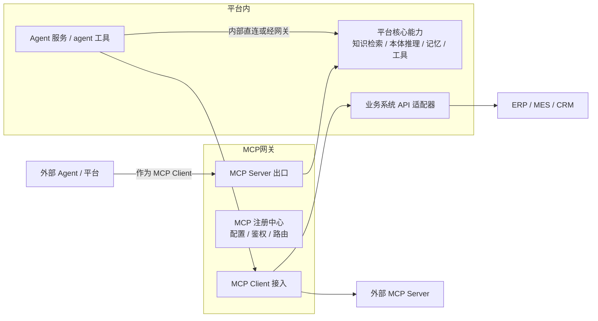
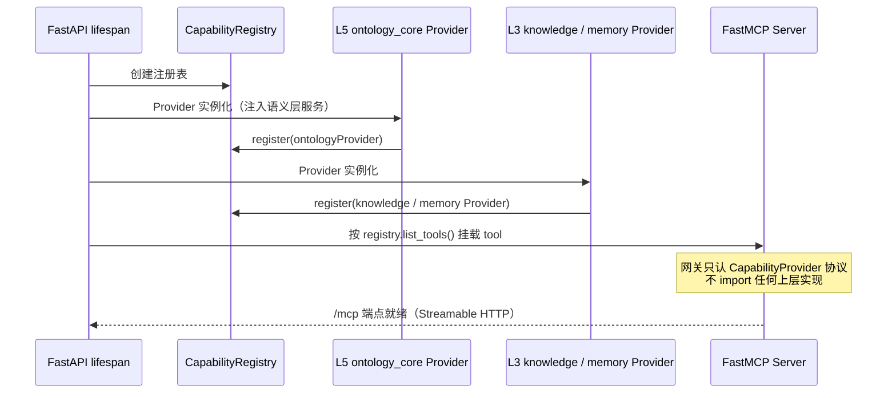
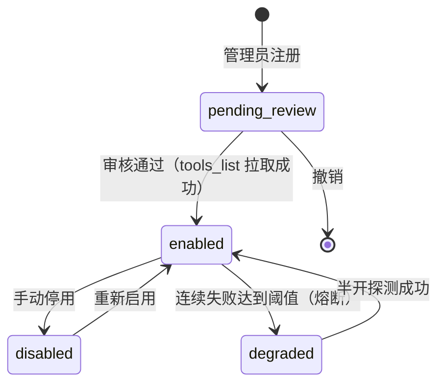
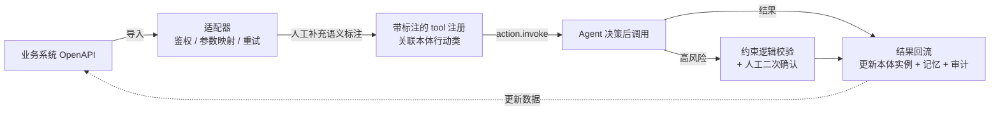
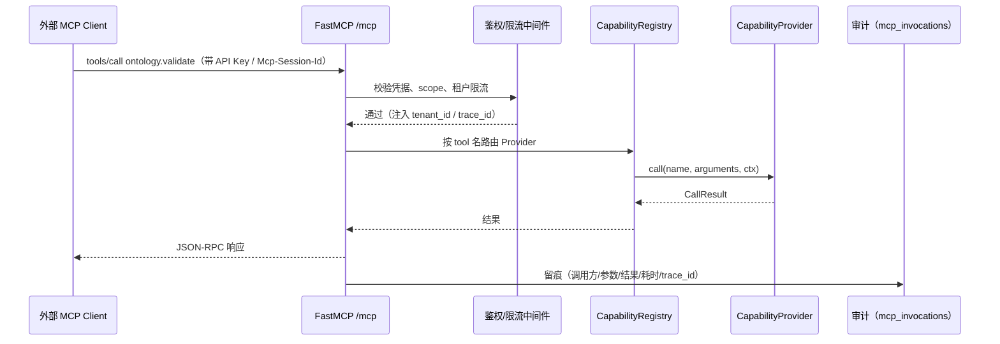

# MCP 网关（mcp_gateway）- 设计

> 状态：v0.1 | 日期：2026-09-26 | 上游依据：[架构锚点：01-总体架构与分层](../architecture/01-总体架构与分层.md)、[研究整理/02-Agent服务与协议](../研究整理/02-Agent服务与协议.md)、[研究整理/05-MCP平台能力](../研究整理/05-MCP平台能力.md)

---

## 1. 定位：双向定位与三形态

MCP 网关是平台的**战略组件而非可选项**：Palantir（Ontology MCP）、微软（Fabric IQ 经 MCP 开放）、Google（全线默认 MCP）已把 MCP 做成本体对外服务的事实互操作接口（研究整理 05）。一句话战略意义：**MCP 是"本体即服务"的对外总线**——外部世界经由它消费平台的语义能力，平台经由它执行业务动作。

| 方向 | 形态 | 说明 |
| ---- | ---- | ---- |
| 能力出口 | 平台作为 MCP Server | 知识检索、本体推理、记忆读写、业务动作封装为 tools / resources / prompts，供平台内 agent 工具与**外部 Agent 系统**调用 |
| 能力接入 | 平台作为 MCP Client / Host | 接入外部 MCP Server（官方注册表或私有部署），扩展平台外能力 |
| 业务系统集成 | 业务 API → MCP tool 映射 | ERP/CRM 接口适配为带语义标注的可执行工具，供 Agent 决策后调用，形成行动闭环 |



代码落点（架构锚点 §4 `services/infra/mcp_gateway/`）：`server/`（出口）、`client/`（外部接入）、`adapter/`（OpenAPI 适配器，本文新增子包）、`registry/`（能力注册表）、`a2a/`（Agent Card）。

```
services/infra/mcp_gateway/
├── server/
│   ├── app.py            # FastMCP Server 工厂、/mcp 端点（Streamable HTTP）、stdio 入口
│   ├── session.py        # Mcp-Session-Id 会话管理（Redis 存储）
│   └── negotiate.py      # initialize 版本协商（2025-11-25 / 2025-06-18）与 Tasks opt-in
├── client/
│   ├── external.py       # 外部 MCP Server 连接（stdio / HTTP）、tools_list 拉取与刷新
│   └── circuit.py        # 熔断降级（连续失败计数、半开探测）
├── adapter/
│   ├── base.py           # BizSystemAdapter 协议（§5）
│   └── openapi.py        # OpenAPI 3.x 导入 → 工具描述生成
├── registry/
│   ├── protocol.py       # CapabilityProvider 协议（§3）
│   └── registry.py       # CapabilityRegistry（注册/路由/租户可见性）
└── a2a/
    └── card.py           # Agent Card 生成（/.well-known/agent-card.json，行动类→skills 映射）
```

## 2. 能力出口：平台 MCP Server

初版能力清单（沿用研究整理 05 §2.1）。关键设计：**每个 tool 必须携带本体语义标注**（对应哪个业务对象 / 行动类 / 规则、需要什么 scope）——平台区别于"裸 MCP 工具堆"的地方，标注放 MCP `_meta.x-ontology` 扩展字段。

| MCP 能力 | inputSchema 概要 | 语义标注要求 | 所需 scope |
| ---- | ---- | ---- | ---- |
| tool `knowledge.search` | `{query, mode: auto\|local\|global\|drift（默认 auto）, top_k, kb_id?, with_evidence?, entity_type_filter?, ontology_version?, max_hops?}` | 关联知识库 ID 与本体领域类（检索按本体过滤/扩展）。2026-09-26 评审修复F：契约统一，权威=docs/OntRAG §5（补 auto 模式与可选过滤器参数） | `kb:read` |
| tool `ontology.reason` | `{ontology_id, type: consistency\|classification\|entailment\|semantic, input?}` | ontology_id + 推理类型对应的规则集/路由 | `ontology:read` |
| tool `ontology.validate` | `{ontology_id?, graph?, shape_version?}` | shapes 版本；候选数据来源 | `ontology:read` |
| tool `ontology.query` | `{ontology_id, sparql, timeout_ms}` | 只读 SPARQL；禁 UPDATE/DELETE 语法 | `ontology:read` |
| tool `memory.read` | `{level: session\|user\|org\|knowledge, query, top_k}` | 记忆层级对应本体对象类 | `memory:read:{level}` |
| tool `memory.write` | `{level, content, ttl?, tags?}` | 写入层级的授权与沉淀策略 | `memory:write:{level}` |
| tool `action.invoke` | `{action_iri, params, confirm_token?}` | **必须为本体行动类**（OB2 Behavior）：携带对象类、守卫规则、事件类、风险等级；回写契约（幂等/凭证/对账/补偿）详见[业务回写设计](./业务回写设计.md)（2026-09-26 评审修订） | `action:invoke` + 业务域 scope |
| resources | `ontology://tbox/{tenant}/{id}`、`ontology://glossary/{tenant}/{id}`、`knowledge://card/{kb}/{id}` | TBox 摘要 / 领域术语表 / 知识卡片（只读） | 对应 read scope |
| prompts | 领域任务模板（"基于本体的思维链：获取对象→提取数据→计算指标"） | 模板引用的行动类/规则 IRI | 无 |

> **memory 层级命名映射（2026-09-26 裁决）**：MCP 对外参数用语义枚举（MCP 标准惯例——工具参数面向外部 Agent 应人类可读），平台内部用 L1~L4（docs/memory）：`session↔L1 会话级`、`user↔L2 用户级`、`org↔L3 组织级`、`knowledge↔L4 知识级`；scope `memory:{action}:{level}` 中的 `{level}` 同样使用对外枚举。两套命名只此一处映射，禁止在别处另造第三套。

`action.invoke` 的 `_meta` 示例：

```json
{ "x-ontology": {
    "action_iri": "http://ontology-agent.local/o/t1/supply#CancelOrder",
    "object_class": "http://ontology-agent.local/o/t1/supply#Order",
    "guard_rules": ["http://ontology-agent.local/o/t1/supply#R007"],
    "event_class": "http://ontology-agent.local/o/t1/supply#OrderCancelled",
    "risk_level": "high",
    "required_scopes": ["action:invoke", "supply:write"] } }
```

## 3. CapabilityProvider 注册机制（依赖倒置实现）

架构锚点 §3.4 例外 2：L7 的 MCP 网关要暴露 L3/L5 能力，但 L7 禁止依赖上层。做法：**L7 定义协议，L3/L5 启动时把实现注册进网关注册表**。

```python
# services/infra/mcp_gateway/registry/protocol.py
from typing import Protocol, runtime_checkable

@runtime_checkable
class CapabilityProvider(Protocol):
    def namespace(self) -> str: ...                     # "ontology" / "knowledge" / "memory"
    def list_tools(self) -> list[dict]: ...             # MCP tool manifest（含 _meta.x-ontology 语义标注）
    def required_scopes(self, name: str) -> list[str]: ...
    async def call(self, name: str, arguments: dict, ctx: "CallContext") -> "CallResult": ...
```

```python
# services/infra/mcp_gateway/registry/registry.py
class CapabilityRegistry:
    def register(self, provider: CapabilityProvider) -> None: ...   # 按命名空间去重，冲突抛错
    def get(self, tool_name: str) -> CapabilityProvider | None: ... # "namespace.tool" 路由
    def list_tools(self, tenant_id: str) -> list[dict]: ...         # 按租户可见性过滤
```



实现要点：SDK 用 FastMCP（与后端同栈，架构锚点 §3.1）；动态挂载在 lifespan 内完成——对每个 provider 的 `list_tools()` 构造 FastMCP tool（函数式包装 `provider.call`），工具名带命名空间前缀（`ontology.validate`）。

## 4. 能力接入：外部 MCP Server 管理

沿用研究整理 05 §3：注册 → 发现 → 审核开启 → 可见性授权 → 失败隔离。

| 环节 | 设计 |
| ---- | ---- |
| 注册 | 管理员配置外部 Server（stdio / Streamable HTTP、连接参数、凭据托管进 `infra/security`，不落明文） |
| 发现 | 自动拉取 `tools/list`（接入成功时 + 定时刷新），工具登记进统一工具注册中心（docs/Skills §2） |
| 审核开启 | 外部工具默认**不可信**，`pending_review` 状态下对 Agent 不可见；审核通过才 `enabled` |
| 可见性授权 | 按 agent 工具 / 用户 / 租户三维授权可见性（`mcp_tools.visibility`） |
| 熔断降级 | 连续失败 ≥N（默认 5）进入 `degraded` 熔断：拒绝调用并提示替代方案，**不阻塞 Agent 主流程**；半开探测成功自动恢复 |



## 5. 业务系统集成（行动闭环）

> **2026-09-26 评审修订**：回写可靠性契约（幂等键 / 确认凭证 / 状态回执 / 超时语义）、对账与补偿**升为一等模块**（锚点 §5 模块地图第 12 行：`business/action_dispatcher` + 本网关 action 通道），权威设计见 [业务回写设计](./业务回写设计.md)。本节仅保留 OpenAPI → tool 映射流程概览，不重复契约细节。



> 「执行结果回流」节点的回写契约（幂等投递 / 受理凭证 / 状态回执 / 对账 / 补偿）详见 [业务回写设计](./业务回写设计.md)（2026-09-26 评审修订）。

- 适配方式：OpenAPI/Swagger 导入自动生成工具描述（GPT Actions/Dify/Coze 惯例），**语义标注人工补充**（对应本体哪个对象/行动类，经 `ontology.query` 校验 IRI 存在性）；
- 高风险动作（支付、冻结、删除类）必须绑定本体"约束逻辑"校验 + 人工审批开关（研究整理 05 §4），确认人记录在 `mcp_invocations.confirm_by`；
- **每个业务工具的调用结果必须回流**：写回本体实例状态（逆向闭环的"更新数据"一环，研究整理 00 §1.2）与记忆服务。

适配器接口（**2026-09-26 评审修订**：完整契约 `check_health / execute / query_status / compensate` 及可靠性职责划分见[业务回写设计 §5](./业务回写设计.md)，下为早期两方法草图，`invoke` 语义已由 `execute`/`query_status` 承接）：

```python
# services/infra/mcp_gateway/adapter/base.py
class BizSystemAdapter(Protocol):
    async def invoke(self, action_iri: str, params: dict) -> "AdapterResult": ...  # 鉴权/参数映射/重试
    def mapping(self) -> list["ToolMapping"]: ...   # OpenAPI operation -> 行动类 IRI + 参数映射表
```

## 6. 安全与治理

| 维度 | 设计（研究整理 05 §2.2 / §6 安全红线） |
| ---- | ---- |
| 鉴权 | 外部调用：API Key / OAuth2（Bearer + scope）；平台内：复用网关 JWT |
| 租户隔离 | 外部 Agent 按 tenant 隔离；注册表按租户过滤工具可见性；`mcp_invocations.tenant_id` 强制 |
| 授权 | 工具级 scope + 数据级（行级/字段级，由 Provider 内部实现）；**权限判断只认平台侧 scope 声明与 ACL** |
| annotations 红线 | `readOnlyHint` / `destructiveHint` 等属**不可信元数据**：仅作 UI 提示字段存储与展示，**不进入授权代码路径** |
| 审计 | 所有 tool 调用留痕：调用方、参数、结果、耗时、trace_id（`mcp_invocations`） |
| 限流配额 | 按租户/工具维度限流（Redis 计数），配额超限返回 429 + 重试提示 |

一次外部调用链路（鉴权 → 路由 → Provider → 审计）：



## 7. 协议实现

| 项 | 决策 |
| ---- | ---- |
| 传输 | 远程 **Streamable HTTP**（`/mcp` 端点，取代旧 HTTP+SSE）；本地 **stdio**（本地插件/工具） |
| 版本协商 | `initialize` 声明支持版本列表 `["2025-11-25", "2025-06-18"]`，取客户端交集最高版（研究整理 05 §6） |
| 会话 | Streamable HTTP 用 `Mcp-Session-Id` 请求头维持会话；会话状态存 Redis |
| Tasks | **opt-in**：默认关闭；仅对显式协商该能力且属长任务的行动类开放（2025-11-25 引入，2026-07-28 起转为 opt-in 扩展，研究整理 02 §3.1） |
| SDK | FastMCP（Python），版本锁定见待办 |

握手示例（initialize）：

```json
--> { "jsonrpc": "2.0", "id": 1, "method": "initialize",
      "params": { "protocolVersion": "2025-06-18",
                  "capabilities": { "roots": {}, "sampling": {} },
                  "clientInfo": { "name": "claude-desktop", "version": "1.0" } } }

<-- { "jsonrpc": "2.0", "id": 1, "result": {
        "protocolVersion": "2025-06-18",
        "capabilities": { "tools": { "listChanged": true },
                          "resources": {}, "prompts": {}, "tasks": null },
        "serverInfo": { "name": "ontology-agent-mcp", "version": "0.1.0" } } }
```

## 8. A2A 支持

- Agent Card 发布于 `/.well-known/agent-card.json`（A2A v1.0，JSON-RPC over HTTP；研究整理 02 §3.2）；
- 与本体的映射（落地研究整理 02 §5 待办第 3 条）：**本体"行动类" → Agent Card `skills[]` 条目**——`id` = 行动类本地名 slug、`name` = label、`description` = definition、`tags` = 所属领域；行动类增删随本体发布自动同步卡片。

```json
{ "name": "ontology-agent", "protocolVersion": "1.0",
  "url": "https://onto.example.cn/a2a",
  "skills": [
    { "id": "cancel-order", "name": "取消订单",
      "description": "取消指定订单并触发 OrderCancelled 事件（源自行动类 CancelOrder）",
      "tags": ["supply"] } ] }
```

## 9. 数据模型（PostgreSQL）

ORM 位于 `services/data/orm/mcp.py`；全部表带 `tenant_id`。

| 表 | 字段 |
| ---- | ---- |
| `mcp_servers` | id PK、tenant_id、name、transport（stdio\|streamable_http）、endpoint_url、command、args jsonb、credentials_ref（指向 security 模块密钥）、protocol_version、status（pending_review\|enabled\|disabled\|degraded）、failure_count、circuit_opened_at、owner_id、last_synced_at、created_at、updated_at |
| `mcp_tools` | id PK、tenant_id、server_id FK nullable（平台原生 tool 为空）、namespace、name、description、input_schema jsonb、annotations jsonb（**不可信，仅展示**）、semantic_annotation jsonb（object_class_iri / action_iri / rule_iris / risk_level / event_class_iri）、required_scopes jsonb、visibility jsonb（agent_ids / user_ids / all）、enabled bool、source（native\|external\|openapi）、created_at、updated_at；UK(tenant_id, namespace, name) |
| `mcp_invocations` | id PK、tenant_id、tool_id FK、caller_type（agent\|external\|cli）、caller_id、arguments jsonb、result_status（ok\|error\|denied\|timeout\|circuit_open）、error_message、latency_ms、trace_id、confirm_by（高风险确认人，nullable）、created_at；索引 (tenant_id, created_at)、(tool_id, created_at) |

## 10. 验收标准

- [ ] **外部 Claude 等客户端经 MCP 调通平台检索与推理**：Claude Desktop / Claude Code 添加平台远程 MCP Server，成功调用 `knowledge.search` 与 `ontology.validate` 并返回语义标注（架构锚点 §7 M4 验收）；
- [ ] 协议兼容：以 2025-06-18 与 2025-11-25 两种客户端版本握手均成功；
- [ ] 依赖倒置成立：`services/infra/` 无任何对 `services/business|semantic|domain` 的 import（CI 静态检查）；
- [ ] 熔断生效：外部 Server 断网时 Agent 主流程不被阻塞，`mcp_invocations` 记录 `circuit_open`；
- [ ] annotations 篡改不影响授权判定（安全用例：把 `readOnlyHint=true` 的工具发破坏性请求，按 scope 正确拒绝）；
- [ ] 高风险 `action.invoke` 无 `confirm_token` 时被拒且记录审计；
- [ ] 结果回流：调用后 ABox 实例状态与记忆均更新（对照调用前后快照）。

## 11. 待办与开放问题

- [ ] 首个业务系统集成目标 = 锚点钦定电力场景（电力停电分析，锚点 §7）；首连接器（电力工单 Mock）与回写契约演练见[业务回写设计 §6](./业务回写设计.md)（2026-09-26 评审修订），OpenAPI 导入随首连接器一并验证
- [ ] FastMCP 版本锁定与 Streamable HTTP 会话恢复语义验证
- [ ] Tasks opt-in 的适用场景清单（哪些行动类属长任务，值得走 Tasks 而非平台任务系统）
- [ ] 签名 Agent Card（A2A v1.0 头号特性）落地与密钥管理
- [ ] 与 MCP 官方 Registry（server.json）互操作（本网关作为 Registry client 的发布同步）
- [ ] 工具规模增长后的 Tool Search 策略与工具注册中心的统一（docs/Skills §2）
