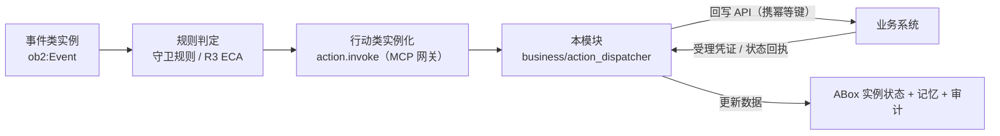
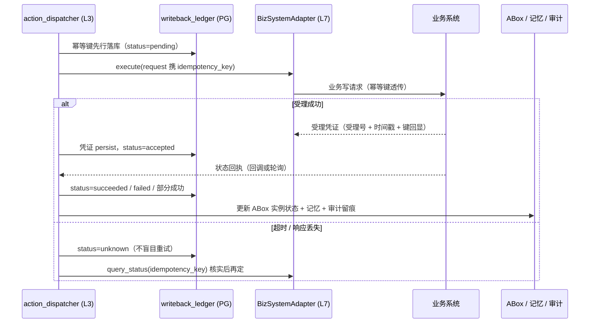
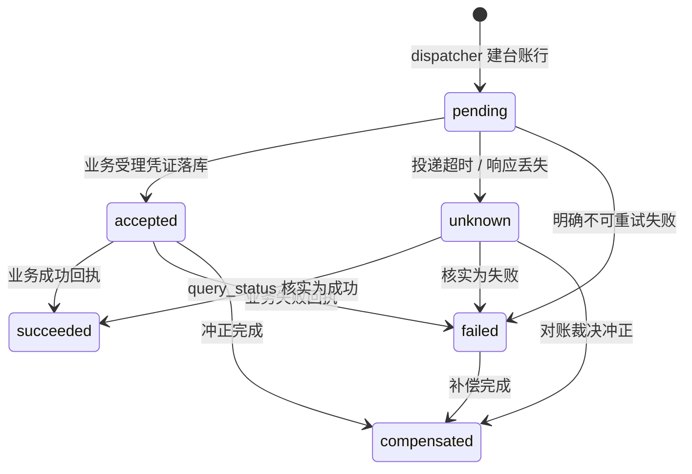
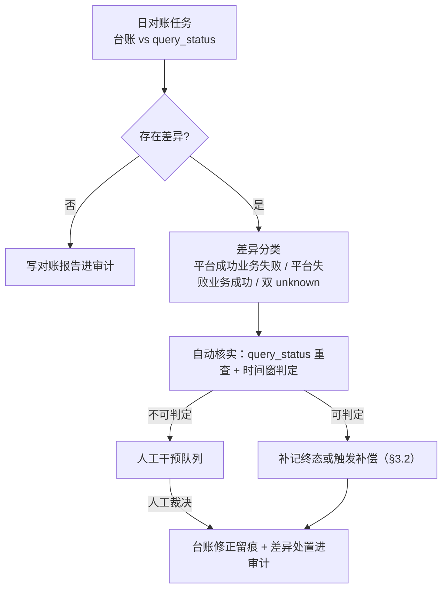

# 业务回写（writeback）- 设计

> 状态：v0.1 | 日期：2026-09-26 | 上游依据：[架构锚点](../architecture/01-总体架构与分层.md)、[研究整理/05](../研究整理/05-MCP平台能力.md)、[评审记录](../architecture/评审-2026-09-26-多专家研讨与行业痛点批判.md)

---

## 1. 定位与边界

### 1.1 行动闭环的最后一公里

OB2 逆向闭环（研究整理 00 §2.2，建模落库见 [docs/ontology §2.4](../ontology/本体核心设计.md)）：`事件 → 规则 → 行动 → 回写API → 更新数据`。前四环在平台内闭环（事件类、守卫规则、行动类、`action.invoke`），**最后一环「回写API → 更新数据」跨出平台边界**：把决策落成业务系统的真实变更，并把结果可靠地接回来——本模块承载这一环：



### 1.2 为什么升为一等模块（评审裁决）

[评审记录](../architecture/评审-2026-09-26-多专家研讨与行业痛点批判.md) §4 专家 D [P1]「最后一公里被画成最细的箭头」：回写闭环被称「平台灵魂」，但业务系统对接在全部文档中只剩 MCP 网关一个箭头——仅熔断，无幂等、对账、补偿、凭证设计；行业痛点是 **Palantir 真护城河恰为 writeback 管道，企业集成占 ToB 交付量 60% 以上**，画成一行适配器等于自欺。裁决（2026-09-26）：回写契约/幂等/对账/补偿**升为一等模块**——锚点 §5 模块地图第 12 行：`business/action_dispatcher` + `infra/mcp_gateway` action 通道；M4 出口条件加入「回写幂等/对账/补偿演练」（锚点 §7）。

### 1.3 与 MCP 网关的分工

| 职责 | MCP 网关（[MCP网关设计](./MCP网关设计.md)） | 本模块（action_dispatcher） |
| ---- | ---- | ---- |
| 协议与路由 | MCP 协议、能力注册、鉴权/限流、熔断降级 | — |
| 回写契约 | — | 幂等键、至少一次投递、受理凭证、状态回执、超时语义 |
| 可靠性 | 熔断（不让调用方被拖死） | 重试/补偿/对账/死信（对已发出的写负责到底） |
| 语义标注 | tool `_meta.x-ontology`（行动类 IRI、风险等级） | 连接器与行动类的绑定声明（§5.2） |

一句话：**网关管「怎么把调用送出去」（协议与路由），本模块管「送出去之后如何负责到底」（契约与可靠性）**。

### 1.4 边界

- **管**：`action.invoke` 触发的业务写操作的投递、凭证、状态回流、对账、补偿；**不管**：动作该不该发生（守卫规则 + 审核工作流门禁，[03 篇 §5](../architecture/03-业务层设计.md)）、MCP/HTTP 协议细节（网关）、ABox 候选数据门禁（`review_workflow`）。

## 2. 回写契约（核心）

### 2.1 幂等键

- `idempotency_key = "{tenant_id}:{action_instance_id}"`，业务侧按该键去重；
- 重试、对账补发、消息重复等一切重复投递**携带相同键**；业务系统必须实现「同键已受理 → 返回首次受理结果」；
- 键在首次投递前先落 `writeback_ledger`（`UK(tenant_id, idempotency_key)`，§8），崩溃恢复后不换键重发。

### 2.2 投递语义：至少一次 + 消费端幂等

平台侧保证**至少一次**投递（复用 Outbox relay 语义，[03 篇 §6.2](../architecture/03-业务层设计.md)：M4 引入）；消费端以幂等键去重。**不承诺恰好一次**——恰好一次只能由两端合力达成。外部调用在事务外（03 篇 §6.1：先短事务落意图，调外部，再短事务落结果）：



### 2.3 确认凭证（受理回执）

- 业务系统**受理即返回受理凭证**（受理号 + 时间戳 + 幂等键回显），dispatcher 原样 persist 到 `writeback_ledger.receipt`；凭证是对账与审计的事实依据：**无凭证的「成功」一律视为 unknown**，不得进 `succeeded`；
- 台账状态只前进不回退，历史凭证随状态迁移留存，全程可追溯（设计宪法 5）。

### 2.4 状态回执回流

- 三态：成功 / 失败 / 部分成功（部分成功仅限业务系统显式声明 partial 语义的行动类，首版电力场景不启用）；
- dispatcher 消费回执后：更新 ABox 实例状态流转属性（行动类的受控状态枚举，[docs/ontology §2.2](../ontology/本体核心设计.md)）→ 更新记忆（L1 即时、L2 沉淀走事件异步）→ 审计留痕；
- 失败回执同样回流：ABox 标记行动实例失败态并附业务侧错误码，供规则引擎判定后续事件（逆向闭环不断裂）。

### 2.5 超时语义（受理未知态）



- 投递超时或响应丢失 = **受理未知态（unknown）**，此时禁止盲目重试——重复创建工单/订单是回写最典型的事故源；
- unknown 处置：先经 `query_status` 按幂等键核实业务侧真实状态，能判定则落终态；不能判定则进入对账队列（§4）；
- unknown 超过对账时限仍无法核实 → 人工干预队列（§3.3）。

## 3. 失败处理与补偿

### 3.1 重试策略（策略可配注入，对齐 03 篇 §1 可执行规则）

重试次数、退避、超时预算一律实现为**可注入的 `WritebackPolicy` 对象**（策略归 L3，编排器读策略、不写死数字）：

```python
# services/business/action_dispatcher/policy.py
@dataclass(frozen=True)
class WritebackPolicy:
    max_attempts: int = 3                    # 指数退避：1s / 2s / 4s（base 可配）
    backoff_base_seconds: float = 1.0
    execute_timeout_seconds: float = 30.0    # execute 超时，超时即 unknown
    unknown_recheck_seconds: int = 300       # unknown 态查询重核间隔
    recon_deadline_hours: int = 24           # 进人工干预前的对账时限
    retryable_codes: frozenset[str] = frozenset({"RATE_LIMITED", "TEMP_UNAVAILABLE", "NETWORK_ERROR"})
```

只有**明确可重试**的失败（网络错误、限流、临时不可用）自动重试；业务性失败（守卫拒绝、参数非法）不重试，直接 `failed` 并回流。

### 3.2 补偿动作（Saga 式逆向）

- 行动类在本体中声明补偿动作（逆向行动类，如 `CancelOrder` 之于 `CreateOrder`）或逆向 changeset；
- 两类补偿：① 平台侧 Saga 逆向 changeset（回滚 ABox 实例状态与派生数据）；② **业务冲正**（调业务系统冲正/撤销接口）；
- 触发条件：对账发现「平台已记成功而业务实际失败」（§4）、上游链式动作需回滚、人工裁决补偿；
- 补偿本身走同一契约（幂等键、凭证、台账记录），补偿失败进死信，不静默。

### 3.3 死信与人工干预队列

- 重试耗尽 / 对账超时 / 补偿失败 → `needs_human=true`，进人工干预队列（复用 `review_workflow` 工单壳，`target_type=writeback_incident`，[03 篇 §5](../architecture/03-业务层设计.md)）；
- 人工处置动作：重发（新 attempt，同幂等键）/ 标记冲正 / 关闭（附理由），全部留审计。

### 3.4 高风险动作二次确认（human-in-the-loop）

- 高风险行动类（本体 `risk_level=high`）执行前必须人工确认：Run 进入 `waiting_tool` 态（[Agent 篇 §2 状态机](../Agent/Agent服务设计.md)，审批等待超时默认 24h 可配），确认人记录 `mcp_invocations.confirm_by`；
- 与审核工作流的关系：审核工作流管「**候选数据**的发布门禁」，二次确认管「**已批准动作**执行前的最后一道人工闸」——前者审数据，后者审动作，不互相替代。

## 4. 对账

### 4.1 日对账任务

- 每日（策略可配）比对：平台 `writeback_ledger` 当日全部非终态与终态记录 vs 业务系统状态查询接口（`query_status`，按幂等键/受理号）；
- 比对维度：受理是否一致、终态是否一致、时间线是否合理（如业务完成时间早于平台投递时间即异常）。

### 4.2 差异处理流程与报告



每次对账产出报告（比对总数、差异清单、处置结果），写 `audit_logs` 执行类事件（[08 篇 §3](../architecture/08-横切关注点与工程规范.md)）；差异记录保留至处置闭环，不允许直接改写历史台账行。

## 5. 适配器 SDK 与连接器规范

### 5.1 BizSystemAdapter 契约接口

本契约细化并取代 [MCP 篇 §5](./MCP网关设计.md) 的两方法草图（原 `invoke` 语义由 `execute`/`query_status` 承接）：

```python
# services/infra/mcp_gateway/adapter/base.py（L7）——连接器实现本协议；
# action_dispatcher（L3）经 L4 port 调用（依赖倒置，锚点 §3.4 例外 3）
from typing import Protocol, runtime_checkable

@runtime_checkable
class BizSystemAdapter(Protocol):
    def check_health(self) -> "HealthReport": ...                                       # 连通性/鉴权预检；网关熔断探测复用
    async def execute(self, req: "WritebackRequest") -> "WritebackReceipt": ...         # 携幂等键执行业务写；受理即回凭证，超时转 unknown
    async def query_status(self, idempotency_key: str) -> "BizStatusResult": ...        # 按幂等键查业务侧真实状态；unknown 核实与对账（§4）依赖
    async def compensate(self, req: "CompensationRequest") -> "WritebackReceipt": ...   # 业务冲正/撤销；同走幂等键与凭证契约
```

- 连接器是**无状态薄层**：只做鉴权、参数映射、幂等键透传；重试/对账/台账等可靠性逻辑一律在 action_dispatcher，连接器内不得重复实现；
- `mapping()`（OpenAPI operation → 行动类 IRI 参数映射）保留在适配器元数据侧，见下节。

### 5.2 连接器元数据

- OpenAPI 3.x 导入自动生成工具描述（MCP 篇 §5 惯例），**语义标注人工补充**：绑定本体行动类 IRI，经 `ontology.query` 校验 IRI 存在性（行动类必须反向引用触发事件与守卫规则，docs/ontology §2.4 建模约束）；
- 每个连接器注册时必须声明：绑定的行动类 IRI、风险等级、是否支持 `query_status` / `compensate`、幂等键透传方式。

### 5.3 新连接器接入清单（四项必答）

| # | 必答项 | 要求 | 不满足时的处置 |
| ---- | ---- | ---- | ---- |
| 1 | 鉴权 | 凭据进 `infra/security` 托管，不落明文（MCP 篇 §4） | 阻断接入 |
| 2 | 脏数据 | 业务侧 4xx 语义映射为**不可重试**失败码 | 阻断接入 |
| 3 | 幂等 | 业务侧能否按幂等键去重？不能则给出替代（业务单号查询兜底）并标**弱幂等** | 弱幂等需降级演练并评审 |
| 4 | 限流 | 业务侧限流策略与配额，映射为可重试码 `RATE_LIMITED` | 未声明按不可重试处理 |

## 6. 首个连接器：电力工单系统 Mock（M4 出口条件）

锚点 §7 钦定首个行业场景为**电力配电网停电分析**，M4 出口条件含「业务回写契约与首个连接器（电力工单 Mock）」。Mock 是契约演练的**第一验收对象**，不是玩具：演练不过，M4 不放行。

### 6.1 Mock 最小接口集

| 接口 | 语义 | 幂等 / 回执 |
| ---- | ---- | ---- |
| `create_order` | 创建停电检修/抢修工单 | 幂等键去重；受理即回受理号凭证 |
| `query_order` | 按受理号/幂等键查工单状态 | 状态机 `created → dispatched → done / cancelled` |
| `cancel_order` | 撤销工单（补偿动作） | 幂等；终态（done）不可撤，返回业务失败码 |

Mock 内置可注入故障：超时、限流、脏数据、重复投递、状态不一致（供对账演练），由演练脚本按用例开启。

### 6.2 演练脚本（M4 三类用例）

1. **幂等重复投递**：同一行动实例投递两次（模拟重试）→ 业务侧只创建一张工单、两次返回同一受理号、台账无重复行；
2. **对账差异**：Mock 注入「平台记成功、业务实际失败」→ 日对账发现差异 → `query_status` 核实 → 业务冲正（`cancel_order`）→ 台账修正留痕；
3. **补偿撤销**：`create_order` 成功后触发补偿 → `cancel_order` 撤单 + 平台侧逆向 changeset 回滚 ABox 实例状态 → 审计留痕。

## 7. 与治理档位关系

治理档位定义与权限矩阵权威在 [08 篇](../architecture/08-横切关注点与工程规范.md)（锚点 §6.8：`solo / team / enterprise`）。回写侧的分档差异：

| 档位 | 回写策略 |
| ---- | ---- |
| solo | **高风险类回写默认关闭**；低风险默认放行、全程审计留痕、可回滚（高置信自动通道底线不破） |
| team | 单审批人：高风险动作一次人工确认（`waiting_tool`）；连接器接入走一次审核 |
| enterprise | 双审 + 二次确认：连接器接入双负责人审核；高风险动作执行前四眼确认 |

三档共同底线：台账、凭证、审计**不可关闭**（设计宪法 5：全程可追溯）。

## 8. 数据模型（PostgreSQL）

ORM 落 `services/data/orm/`（M4 迁移）；全部行带 `tenant_id`，状态只前进不回退。

```sql
CREATE TABLE writeback_ledger (
    id                 UUID PRIMARY KEY,            -- UUIDv7
    tenant_id          VARCHAR(64)  NOT NULL,
    action_instance_id UUID         NOT NULL,       -- 本体行动类实例 ID
    connector_id       UUID         NOT NULL,       -- 关联 mcp_tools / 连接器注册
    idempotency_key    VARCHAR(128) NOT NULL,       -- "{tenant_id}:{action_instance_id}"
    request_payload    JSONB        NOT NULL,       -- 高风险动作按 08 篇 §3 信封加密存全量快照
    receipt            JSONB        NULL,           -- 业务受理凭证（受理号 + 时间戳 + 键回显）
    status             VARCHAR(16)  NOT NULL DEFAULT 'pending',
                       -- pending | accepted | succeeded | failed | compensated | unknown
    attempts           SMALLINT     NOT NULL DEFAULT 0,
    last_error         TEXT         NULL,
    needs_human        BOOLEAN      NOT NULL DEFAULT false,   -- 人工干预队列标记
    created_at         TIMESTAMPTZ  NOT NULL DEFAULT now(),
    updated_at         TIMESTAMPTZ  NOT NULL DEFAULT now(),
    CONSTRAINT uq_writeback_idem UNIQUE (tenant_id, idempotency_key)
);
CREATE INDEX idx_writeback_recon ON writeback_ledger (tenant_id, status, updated_at);
```

对账差异表 `writeback_recon_diff`（**可选**，M4 演练后按实际差异类型收敛定稿）：`ledger_id FK、diff_type、biz_status_snapshot、disposition、disposed_by、resolved_at`。

## 9. 验收标准

- [ ] **M4 演练三类用例全过**（§6.2：幂等重复投递 / 对账差异 / 补偿撤销，锚点 §7 M4 出口条件）；
- [ ] 台账与 ABox 状态一致：抽样核对 `succeeded/failed/compensated` 记录与 ABox 实例状态流转属性一致率 100%；
- [ ] **凭证留存率 100%**：`status ∈ {accepted, succeeded, failed, compensated}` 的记录 `receipt` 均非空；
- [ ] unknown 态不盲目重试：断网/超时演练中 Mock 工单无重复创建（业务侧无重复副作用）；
- [ ] 高风险 `action.invoke` 无 `confirm_token` 被拒且留审计（与 [MCP 篇 §10](./MCP网关设计.md) 共用用例）；
- [ ] 分层合规：`action_dispatcher` 不 import L7 内部模块（经 L4 port，import-linter 静态检查）。

## 10. 待办与开放问题

- [ ] `WritebackPolicy` 默认值实测后冻结（03 篇 §1 策略注入清单的回写部分）；
- [ ] 部分成功（partial）语义的行动类清单与回执格式（首版电力场景暂不启用）；
- [ ] `writeback_recon_diff` 表结构定稿（M4 演练后收敛）；
- [ ] Outbox relay 与回写投递通道的复用关系（03 篇 §6.2：M4 引入 Outbox 时统一投递语义）；
- [ ] 连接器 SDK 脚手架与 Mock 之外的第二连接器（延后至 M5+，按场景需要，不预建）；
- [ ] 开放问题：业务系统不支持幂等键时的**弱幂等兜底**（业务单号查询 + 时间窗去重）是否进 v1 契约，待首连接器演练后裁决。
