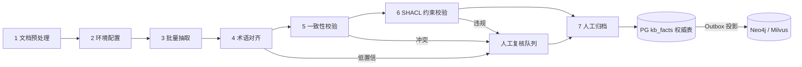
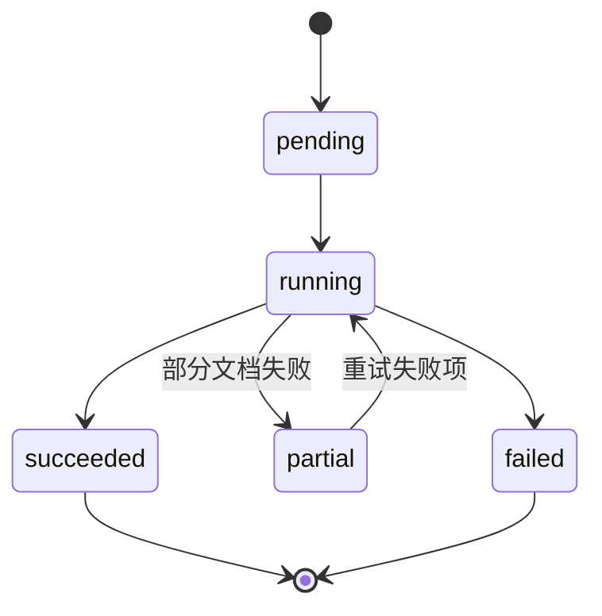
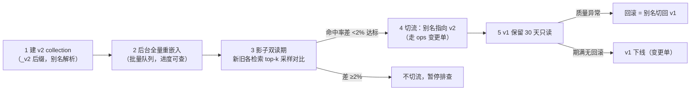

# 知识库 graphrag-ontology - 设计

> 状态：v0.2（2026-09-26 评审修订） | 日期：2026-09-26 | 上游依据：[架构锚点](../architecture/01-总体架构与分层.md)、[研究整理/03-知识库与本体核心](../研究整理/03-知识库与本体核心.md)、[评审记录 2026-09-26](../architecture/评审-2026-09-26-多专家研讨与行业痛点批判.md)
>
> **2026-09-26 评审修订**：本文按[评审记录](../architecture/评审-2026-09-26-多专家研讨与行业痛点批判.md) §3/§5/§6 落实知识库模块批判——检索默认档改造（§3/§4.0，C-P0 GraphRAG 索引成本）、人工终审吞吐模型（§7.1，C-P0 无工时模型）、治理档位钩子（§7，D-P1）、首个行业场景落地（§2，D-P0）、无依据数字标注（全文「示例值/待实测」，C-P2）。各处修订均以「2026-09-26 评审修订」标注。
>
> **2026-09-26 旧稿合入**：新增 §8 知识治理——冲突分诊四型四处置、bi-temporal 时间机器（落地为 knowledge.search 时间参数扩展）、六路召回融合要点（登记待办不强改）、nightly 保鲜例程、易变知识只存指针，摘录自旧稿[架构设计/04-知识库设计与知识治理](../架构设计/04-知识库设计与知识治理.md)的栈无关增量；原 §8~§10 顺延为 §9~§11。
>
> **2026-09-27 权威裁决与 v0.2 同步（用户委托"按推荐方案执行"）**：04 篇 v0.2 经知识工程/存储架构/产品最小够用三方独立评审（裁决均"有条件通过"）后，裁决**本文为知识库模块唯一权威**，04 篇转为设计依据存档（其 §11 分期表与验收场景作完整论证保留）。v0.2 修正增量已合入本文：①T2 冲突 v1 全人工裁决、评分仅参考分（§8.1）；②**事实权威落 PG `kb_facts` + 代际激活切换**（§2.7/§6/§8.2）；③封口时间=继任事实业务生效时间、as-of 谓词补全（§8.2）；④chunk 级不设 is_current、as-of 不进向量库（§8.2）；⑤失效分边 SUPERSEDES/OUTRANKED_BY/INVALIDATED_BY（§8.2）；⑥分诊固定顺序 + scope 硬门禁 + 承接判定失败兜底（§8.1）；⑦nightly 例程 v1 收缩与工程纪律（§8.4）；⑧召回口径改四路+出处反查、时间线为显式模式（§8.3）；⑨SimHash 分期 v1.5（§8.0）。

服务规范名**知识库 graphrag-ontology**（锚点 §5 模块 #3）。代码落点：`services/semantic/knowledge/`（extract / graphrag / retrieve）与 `services/business/kb_pipeline/`（流水线编排）。

## 1. 服务边界：ABox vs TBox 分工

沿研究整理 03 §1：本体核心管 **TBox**（术语层：类、属性、公理、规则）；本服务管 **ABox**（实例层）——文档 → 实例 → 检索。

```
文档/数据/专家经验
     │
     ▼
知识库服务 graphrag-ontology（本设计）
  文档预处理 → LLM 批量抽取 → 术语对齐 → 校验 → 人工归档
  GraphRAG 检索：实体/关系图谱 + 社区摘要 + 本体约束
     │
     ▼
本体核心（TBox 建模 / OWL 存储 / SHACL / 推理，见 docs/ontology）
```

| 关注点 | 归属 |
| ---- | ---- |
| TBox（类/属性/公理/规则、版本治理） | 本体核心（docs/ontology） |
| ABox（从文档抽取的实体/关系实例） | 本服务 |
| 检索（GraphRAG local/global/drift + 向量混合；**2026-09-26 评审修订：默认档 = 向量+BM25 基线 + LazyGraphRAG**，见 §4.0） | 本服务 |
| SHACL 实例校验的执行 | 本服务调用本体核心校验接口（Neo4j 不是推理机，校验必须走语义层推理引擎，锚点 §3.2 注） |
| 候选 → 权威的门禁 | `business/review_workflow`（§7） |

对 Agent 而言：检索走本服务（给上下文），校验/推导走本体核心（给约束），二者均经 MCP/工具集暴露（研究整理 03 §1）。

## 2. 七步抽取流水线（机器粗加工 + 人工终审）

流水线（研究整理 03 §3.1 全部沿用）：`文档预处理 → 环境配置 → 批量抽取 → 术语对齐 → 一致性校验 → 约束校验 → 人工归档`。

> **2026-09-26 评审修订（首个行业场景落地，锚点 §7）**：首个行业场景已钦定为**电力配电网停电分析**（研究整理 00 §4 行业案例）。**种子本体 = 该场景 20~50 类精简 OB2 模型；种子本体 + 样例数据集是 M2 出口条件**——平台不允许空工作台冷启动（评审 D-P0）。本流水线的抽取策略与分类型提示词（§2.3 表 1）的**第一验收对象即该场景样例数据集**：先在单一场景打穿「建本体 → 抽取 → 检索」，再横向泛化到其他领域。golden QA 检索评估集在该样例数据集上**按检索模式分层构建**（local/global/drift 各层独立取样，呼应锚点 §6.9 评估驱动，验收见 §10）。



**四大国标底线 = 流水线硬门禁**（研究整理 03 §3.1，防幻觉）：

| 底线 | 落在哪一步 | 工程含义 |
| ---- | ---- | ---- |
| 1 候选非成品 | 步骤 7 | LLM 产物一律 status=candidate，人工终审转 authoritative 后才可被检索/被 Agent 使用 |
| 2 术语唯一性 | 步骤 4 | 一个概念只有一个名字；近义词进 aliases，不新建实体类型 |
| 3 规则人工把关 | 步骤 3 + 7 | 动作/公理/约束规则强制人工确认；规则类（risk_flag=true）**三档治理档位下均无自动通过通道**（2026-09-26 评审修订：非规则类候选的自动通道按治理档位另行约束，见 §7 治理档位钩子；四大国标底线的权威定义见 [08 篇](../architecture/08-横切关注点与工程规范.md) §4） |
| 4 实例合规性 | 步骤 6 | 入权威库前 100% 过 SHACL，0 例外 |

### 2.1 步骤 1：文档预处理

| 项 | 内容 |
| ---- | ---- |
| 输入 | MinIO 原始文档（Word/PDF/图片/Excel，key 规范见 §6） |
| 输出 | 统一 Markdown 切片（chunks），每片带原文出处指针（minio_key + span） |
| 实现要点 | 按下表分类型处理；分块策略见下方「分块策略」小节（2026-09-26 痛点优化：默认语义分块，目标 512±128 token、重叠 10%；上游避坑：控制分片长度与并发量） |
| 失败处理 | 解析/OCR 失败 → 文档置 preprocess_failed 并通知上传者；不阻塞同批次其他文档 |
| 门禁 | 无原文出处指针的 chunk 不得进入步骤 3（结果可追溯底线） |

文档预处理方法（照搬上游）：

| 文档类型 | 预处理方法 |
| ---- | ---- |
| Word / 纯文本 | 转 Markdown，按章节分片 |
| 可复制 PDF | 提取纯文本，剔除冗余 |
| 扫描件 / 图片 | OCR 提取（关键术语人工复核） |
| 复杂流程图 | 多模态大模型直接解析 |
| Excel / 表格 | 拆分合并单元格→标准表格，跨表关联人工梳理 |

#### 分块策略（2026-09-26 痛点优化）

默认**语义分块**：按标题层级 + 段落边界切分，绝不在句中硬切；目标 **512±128 token**、相邻块**重叠 10%**（防边界事实两头丢失）。固定窗口滑切仅作无结构信号文档的兜底。

**特殊块规则**：

| 块类型 | 规则 |
| ---- | ---- |
| 表格 | **整块不切**；超长表格按行组切分且**每段重复表头**（含关键列上下文），保证每块脱离原文仍自解释 |
| 代码块 | **不切**（围栏整体保留）；超字符预算的整块入库并告警，不硬拆 |

**父子块检索（small-to-big）**：向量索引与命中用**子块**（对齐上述目标尺寸，保检索精度）；生成阶段取子块所属**父块**（按标题层级聚合的完整小节，子块存 `parent_chunk_id` 指针）供模型（保上下文完整）——小块召回、大块生成，兼得检准与证据完整。

**尺寸 × 质量 × 延迟权衡表**：块大→召回粗但上下文完整、重嵌入成本高；块小→命中准但证据碎、父子拼装与重叠冗余上升。512±128 / 10% 是**起点值而非结论**，权衡表（尺寸档位 × 检索质量 × 索引/重嵌入延迟成本）随 **PoC ③（索引成本标定）** 实测冻结（§10、§11）。

**文档类型差异化**（挂 `kb_collections.chunk_defaults`，可按库覆写，[database/01 §3.3](../database/01-数据库详细设计.md)）：

| 文档类型 | 差异化分块 |
| ---- | ---- |
| 合同 | 条款编号为边界，按条切、绝不跨条；金额/期限等关键数字保持单块完整 |
| 手册 | 标题层级优先（章→节），父块按小节聚合 |
| 工单 | 单工单不分块（短文档整块）；批量工单按单切，工单号入 chunk meta |

### 2.2 步骤 2：环境配置

| 项 | 内容 |
| ---- | ---- |
| 输入 | 指定本体版本（MinIO 的 OWL/Turtle 权威制品）、领域术语表、抽取模型配置 |
| 输出 | 流水线运行上下文：本体 schema 映射（类/对象属性 → 提示词约束）、术语表快照、提示词模板、模型路由（经 L7 LiteLLM） |
| 实现要点 | 本体引导抽取准备（deepsense.ai ontology-driven 实践与 Neo4j `neo4j-graphrag`，上游 §3.2） |
| 失败处理 | TBox 版本缺失或非 authoritative → 流水线拒绝启动 |
| 门禁 | 全部产物绑定 ontology_version，可按版本追溯与重跑 |

### 2.3 步骤 3：批量抽取

| 项 | 内容 |
| ---- | ---- |
| 输入 | chunks + 本体 schema 映射 |
| 输出 | 候选实体/关系/实例（jsonb），逐条附原文引用与 confidence，status=candidate |
| 实现要点 | 按知识类型分策略（下表 1）；LLM 经模型网关调用并记成本；工具链（下表 2） |
| 失败处理 | 单 chunk 重试 3 次仍失败 → 死信队列人工介入，批次继续（partial） |
| 门禁 | 时序流程型产出的动作/约束规则强制进人工确认通道（底线 3）；提示词约束"禁止凭空创造" |

表 1：分类型抽取策略（照搬上游）：

| 知识类型 | 抽取目标 | 提示词要点 |
| ---- | ---- | ---- |
| 文本知识型 | 概念、属性、对象、关系 | 固定输出结构 + 附原文定义，禁止凭空创造 |
| 数据型 | 实例、属性、值域约束 | 针对表格输出实例属性和值域 |
| 时序流程型 | 动作、前置条件、状态流转、互斥规则 | 生成动作控制属性（为 Agent 提供素材） |
| 图片/流程图 | 关键实体与关系 | 多模态提示词，禁止脑补 |

表 2：工具链参考（照搬上游）：

| 工具 | 用途 |
| ---- | ---- |
| ONTO GPT | 本体抽取，快速上手 |
| Protégé | 本体编辑、可视化、推理机校验（人工终审工具） |
| Tesseract / TADOC | OCR |
| Python rdflib + pySHACL | 批量本体处理、约束校验 |
| LangChain / LlamaIndex | 自定义抽取流水线编排 |

### 2.4 步骤 4：术语对齐

| 项 | 内容 |
| ---- | ---- |
| 输入 | 候选实体 + 术语表快照 |
| 输出 | 归一映射 canonical_name + aliases[]、对齐决策记录 |
| 实现要点 | 三级策略：术语表精确匹配 → 嵌入相似度（阈值 0.92 起步）→ LLM 判定（输出仍过规则校验，锚点 §6.4） |
| 失败处理 | 低置信对齐对 → 人工复核队列 |
| 门禁 | 底线 2：对齐国标"相同实体类型的近义词不应表示为多个实体类型" |

### 2.5 步骤 5：一致性校验

| 项 | 内容 |
| ---- | ---- |
| 输入 | 对齐后候选实例 + TBox 公理/规则 |
| 输出 | 一致性报告：逻辑矛盾、冗余命中、意外结论 |
| 实现要点 | 推理分级（上游 §2.3）：确定逻辑走规则引擎/描述逻辑推理（rdflib 起步）；LLM 语义判断仅低频兜底且输出过规则校验 |
| 失败处理 | 冲突实例打 conflict 标记进人工队列 |
| 门禁 | 存在未解决冲突 = 阻塞，不得进入步骤 6 |

### 2.6 步骤 6：约束校验（SHACL）

| 项 | 内容 |
| ---- | ---- |
| 输入 | 候选实例 + TBox 对应 SHACL shapes（来自本体核心，docs/ontology） |
| 输出 | 校验报告：格式/枚举/区间/基数违规项 + 可自动修复项的修复建议 |
| 实现要点 | pySHACL 批量校验（工具链表 2） |
| 失败处理 | 违规 → 回步骤 3 重抽或人工修订 |
| 门禁 | 底线 4：SHACL 不通过不得入库 |

### 2.7 步骤 7：人工归档（终审）

| 项 | 内容 |
| ---- | ---- |
| 输入 | 全部候选产物 + 证据链（§7 单据） |
| 输出 | status=authoritative 的实例/关系/术语/规则写入 **PG `kb_facts` 权威注册表**（同事务写 Outbox 事件——2026-09-27 同步 04 篇 v0.2：事实权威在 PG，Neo4j/Milvus 为投影，§6/§8.2），投影完成后代际激活并触发索引增量更新（§3） |
| 实现要点 | review_workflow 单据化（§7）；知识工程师可用 Protégé 核校 |
| 失败处理 | 驳回 → 单据关闭并回流水线；候选产物永不物理删除（审计） |
| 门禁 | 底线 1 与底线 3 的最终关口 |

## 3. GraphRAG 索引管线

机制沿研究整理 03 §3.2：实体/关系抽取 → 知识图谱 → 层次化 Leiden 社区 → 每社区 LLM 摘要（community report，多粒度）。

> **2026-09-26 评审修订（检索默认档裁决，对应锚点 §7 M2 与 PoC ③）**：本章四阶段中，**阶段 2（Leiden 层次社区）与阶段 3（community report）属于「完整 GraphRAG 索引」，降级为可选档，默认不执行**——逐层 LLM 摘要令索引成本随社区层级再放大，「索引费远超查询费」是社区弃坑首因（评审 C-P0）。默认档只建阶段 1（实体关系图，供查询时遍历）与阶段 4（chunks/实体描述向量）；完整档仅对试点标定 ROI 成立的高价值子集开启，**开关策略由 PoC ③（索引成本标定）在 M2 冻结**（锚点 §7 PoC 表）。冻结前涉及完整档的成本/延迟数字一律视为示例值。

| 阶段 | 输入 | 输出 | 实现要点 |
| ---- | ---- | ---- | ---- |
| 实体关系抽取 | 权威 chunks | Entity / Relation / MENTION 边 | 复用步骤 3 抽取结果；实体描述由 LLM 生成并绑定本体类 IRI |
| Leiden 层次社区 | 实体关系图 | Community 节点 L0~L2 层级树 | leidenalg / graspologic；分辨率参数进配置 |
| community report | 每个社区节点 | 逐层 title + summary + findings | 多粒度：L0 细粒度 → L2 全库概览，global 检索的 map-reduce 底料 |
| 向量化 | chunks / reports / 实体描述 | Milvus 向量 | 混合检索底座（§4.2） |

索引任务化：`kb_index_tasks` 表（§6），支持全量重跑与增量。增量策略：文档 content_hash / chunk text_hash 未变则跳过；受影响叶社区重算、上层社区按需重算。



## 4. 检索设计

> **2026-09-26 评审裁决（检索默认档，对应锚点 §7 M2 wedge 与 PoC ③）**：默认路径 = **向量 + BM25 混合基线 + LazyGraphRAG**（查询时图遍历，索引成本约为完整 GraphRAG 的 0.1%）；完整 GraphRAG（Leiden 层次社区 + 多粒度 community report）改为**按试点 ROI 开关的可选档**，其开关策略由 PoC ③（索引成本标定）在 M2 冻结。评审 C-P0 结论：GraphRAG 全家桶对零代码起步是过度工程，M2 先交向量+BM25 基线。详见 §4.0。

### 4.0 检索默认档与可选完整档（2026-09-26 评审新增）

| | 默认档（基线） | 完整档（可选，按试点 ROI 开） |
| ---- | ---- | ---- |
| 索引物 | 实体关系图 + chunks/实体描述向量（§3 阶段 1/4） | 叠加 Leiden 层次社区 + 多粒度 community report（§3 阶段 2/3） |
| 检索机制 | 向量+BM25 混合召回 + **LazyGraphRAG 式查询时图遍历**（相关实体邻域按需扩展，不预建社区） | 叠加预生成社区摘要 map-reduce / 先社区后实体 |
| 索引成本 | 约为完整 GraphRAG 的 0.1%（微软公开参考值，**待 PoC ③ 实测冻结**） | 数百万 token/小时级每「一本书」量级，随社区层级放大（微软实测口径，示例值/待实测） |
| 交付时点 | M2 默认交付（锚点 §7 M2 wedge） | 开关策略由 PoC ③ 在 M2 冻结，仅对高价值试点子集开启 |

local/global/drift 三模式保留（路由 §4.1 不变），但实现随档位变化：

- **local**：实体描述向量锚定 → 查询时邻域图遍历（max_hops）→ 关联 chunks + 关系；完整档再叠加关联社区报告。
- **global：默认档下降级为「社区摘要未构建时用地图谱聚合」**——对查询时遍历所得子图做实体/关系类型分布聚合与要点归纳（规则聚合为主、轻 LLM 兜底），不依赖预生成社区报告；完整档才恢复预生成社区摘要 map-reduce。
- **drift**：默认档 = 子图多跳展开 → 实体级细化；完整档 = 先社区摘要后实体展开。
- auto 路由器需感知当前档位（community report 是否已构建）以决定 global/drift 走哪条实现路径。

### 4.1 模式路由（local / global / drift，研究整理 03 §3.2）

| 问题类型 | 示例 | 模式 | 机制 |
| ---- | ---- | ---- | ---- |
| 具体实体/局部事实 | "A 标准对 X 对象的约束条款" | local | 相关实体 + 关系 + 关联文本单元 + 社区报告，结合向量索引 |
| 全库主题/总结 | "知识库覆盖哪些合规主题" | global | 完整档：预生成社区摘要 map-reduce，不遍历原始图，token 高效；**默认档降级为地图谱聚合**（§4.0，2026-09-26 评审修订） |
| 多跳/因果/全局+细节混合 | "为什么 A 流程会导致 B 结果" | drift | 先社区摘要后实体展开，质量/成本折中 |
| 未知（默认 auto） | — | 路由器判定 | 规则（问句类型/实体命中率）优先，LLM 分类兜底 |

**2026-09-26 评审修订**：LazyGraphRAG（延迟索引，索引成本约为完整 GraphRAG 的 0.1%——微软公开参考值，待 PoC ③ 实测冻结）已从「成本敏感场景待评估项」升格为**默认检索路径的组成部分**（§4.0），§11 对应待办项关闭。

### 4.2 与 Milvus 的混合检索（RRF 融合）

两路召回：图检索（local 子图扩展 / global 摘要 / drift 遍历）× 向量检索（Milvus：chunks + community reports + entities）。

融合公式（Reciprocal Rank Fusion）：

```
score(d) = Σ_{s ∈ S} w_s · 1 / (k + rank_s(d))    k = 60
```

| 参数 | 默认 | 说明 |
| ---- | ---- | ---- |
| k | 60 | 平滑常数 |
| w_s | 图 0.6 / 向量 0.4 | 按模式调整：global 时社区摘要向量权重上调 |
| rerank | bge-reranker 类 | 融合取 top 50 → rerank → 输出 top_k |

> **2026-09-26 评审修订**：RRF 公式保留；k=60、图 0.6/向量 0.4、top 50 均为**初始建议值（示例值/待实测）**，非实测结论。参数在 **PoC ③ 期间**以按检索模式分层的 golden QA 集（§10）调参后冻结，各模式 w_s 同步标定。

### 4.3 本体增强四点（graphrag-ontology 差异点，上游 §3.2）

| # | 增强点 | 落点 |
| ---- | ---- | ---- |
| 1 | schema 约束抽取：本体做实体类型映射与抽取引导 | 流水线步骤 2/3 |
| 2 | 术语对齐：消除概念混淆与同义实体 | 步骤 4 |
| 3 | 查询扩展与过滤：同义/上下位扩展 query、按本体类过滤 | 检索入口 query rewrite |
| 4 | 图谱路径证据链：回答附图谱路径 | 返回 schema 的 evidence（§5） |

### 4.3 检索 ACL 预过滤（2026-09-26 痛点优化，P1）

企业数据泄漏头号路径=检索层忽略文档 ACL（权限旁路）。规则：**检索是授权步骤**——召回前按请求者 scope 预过滤：documents 增 `acl_tags jsonb`（默认继承租户全员；敏感文档标注部门/角色标签，随上传与终审登记）；Neo4j/Milvus 召回以 acl 标签过滤（Milvus 用标量过滤字段、Neo4j 属性谓词），**先过滤后排序**（不是召回后再剔除——防 top-k 被无权文档占位挤掉有权结果）；引用出处带 ACL 审计行（谁、以何 scope、命中哪些 acl 命中文档）；Playground debug 视图显式展示过滤前后差集。与租户隔离正交叠加。

- **图遍历护栏（2026-09-26 P2）**：邻域/路径查询深度>3 或候选集>上限时改分批迭代遍历（APOC 式批处理）+查询超时熔断（防无界遍历 heap 耗尽/OOM）。

## 5. 检索 API 契约：knowledge.search

REST 与 MCP 双形态（MCP 清单沿研究整理 05 §2.1）：

```
POST /api/v1/knowledge/search            # REST，经 L2 网关
MCP tool: knowledge.search(...)          # 经 L7 MCP 网关暴露给 agent 工具
```

签名（两形态同参）：

```python
async def knowledge_search(
    query: str,
    *,
    mode: Literal["auto", "local", "global", "drift"] = "auto",
    top_k: int = 8,
    with_evidence: bool = True,
    entity_type_filter: list[str] | None = None,   # 本体类 IRI 过滤
    ontology_version: str | None = None,           # 缺省 = 当前发布版
    max_hops: int = 2,                             # local/drift 图扩展跳数
    tenant_scope: TenantScope,                     # 网关注入，调用方不可篡改
) -> KnowledgeSearchResult
```

返回示例（含 evidence：图谱路径 + 原文引用 + 置信度）：

```json
{
  "query": "电池系统的验收约束有哪些",
  "mode": "drift",
  "ontology_version": "v1.3.0",
  "answers": [{
    "summary": "……基于社区报告与实例的综合结论……",
    "confidence": 0.87,
    "evidence": {
      "graph_paths": [{
        "nodes": [
          {"iri": "http://example.org/std#BatterySystem", "name": "电池系统", "type": "http://example.org/std#StandardObject"},
          {"iri": "http://example.org/std#AcceptanceTest", "name": "验收测试", "type": "http://example.org/std#Action"}
        ],
        "rels": [{"type": "http://example.org/std#constrainsObject", "weight": 0.9}]
      }],
      "citations": [{
        "chunk_id": "ck_01H…", "doc_id": "dc_01H…", "doc_name": "GB/T 31486-2024",
        "minio_key": "kb/t1/dc_01H…/source.pdf", "quote": "……原文引用……",
        "span": [120, 356], "score": 0.91
      }],
      "community_reports": [{"community_id": "cm_77", "level": 1, "title": "电池验收约束"}]
    }
  }],
  "usage": {"latency_ms": 1830, "llm_calls": 4, "tokens": 12400}
}
```

要点：confidence 由图得分、向量得分、rerank 分加权合成；citations 供前端引用展示与 Agent 服务 kb_evidence 事件复用（docs/Agent §6.3）；只返回 status=authoritative 数据（底线 1）。示例 JSON 中的 confidence / score / weight / latency_ms / tokens 等数字均为**示例值/待实测**（2026-09-26 评审修订），不构成性能承诺；检索延迟与 token 预算随 PoC ③ 标定后冻结。

## 6. 数据落库（与锚点 §3.2 存储职责划分一致）

**Neo4j 节点/关系模型**：

| 元素 | 属性 | 说明 |
| ---- | ---- | ---- |
| (:Entity {uuid}) | tenant_id、name、type（本体类 IRI）、aliases[]、description、confidence、status、first_seen_at、last_seen_at | ABox 实体 |
| (:Community {uuid}) | level、title、summary、rank | Leiden 层次社区 |
| (:Chunk {uuid}) | doc_id、idx、text_hash、minio_key、span | 文本单元 |
| [:REL {type}] | 本体对象属性 IRI、weight、evidence_chunk_ids[]、status | 实体关系，type 必须是 TBox 已定义对象属性 |
| [:MENTIONS] / [:IN_COMMUNITY] / [:PARENT_OF] | — | 结构边 |

隔离：节点/边带 tenant_id 属性；规模化后按租户拆 database 或 label 前缀。TBox 经 n10s 物化进图，只读。

**Milvus collections**：

| collection | 标量字段 | 向量 |
| ---- | ---- | ---- |
| kb_chunks_{tenant} | chunk_id、doc_id、tenant_id、text、span、doc_generation、doc_lifecycle（2026-09-27 同步：三级时效解耦 §8.2——**不设 is_current / valid 区间**，旧文档切片默认视图降权不过滤） | dense（bge-m3 类）+ sparse（BM25） |
| kb_community_reports_{tenant} | community_id、level、title、summary | dense |
| kb_entities_{tenant} | entity_uuid、name、description、generation（随事实代际投影） | dense（local 检索锚点） |

**PG 表**：

| 表 | 关键字段 |
| ---- | ---- |
| documents | id、tenant_id、name、doc_type、minio_key、content_hash、ontology_version、status（processing/indexed/failed）、uploaded_by |
| chunks | id、doc_id、tenant_id、idx、text、text_hash、minio_key、span、status |
| kb_facts | **事实权威注册表**（2026-09-27 同步 04 篇 v0.2，公理「主事实在 PG」）：id、tenant_id、kb_collection_id、fact_iri、subject_iri、predicate_iri、object_ref、generation、state（current/superseded/needs_review/archived）、valid_from、valid_to、effective_date_known、transaction_time（=created_at）、confidence、source_ref（jsonb）、scope（jsonb）、ontology_version、checked_at；索引 `(source_doc_id)`、`(valid_to)`、`(ontology_version)`——承接判定/冲突检测/as-of 均在此表索引执行，Neo4j/Milvus 为投影；**代际激活指针 `kb_collections.active_generation` 列**（切换唯一原子点，§8.2）同步落 database/01（§11 待办） |
| kb_index_tasks | id、tenant_id、type（full/incremental）、scope、status（§3 状态机）、stats、error |

**MinIO key 规范**：

```
kb/{tenant_id}/{doc_id}/source.{ext}              # 原始文档
kb/{tenant_id}/{doc_id}/preprocess/chunks.jsonl   # 预处理产物
kb/{tenant_id}/{doc_id}/extract/batch_{n}.json    # 抽取中间产物
ontologies/{tenant_id}/{version}/ontology.ttl     # TBox 权威制品（本服务只读引用）
```

## 7. 人工终审工作台对接

候选实例 → review_workflow（锚点 §5 模块 #8）单据字段：

| 字段 | 类型 | 说明 |
| ---- | ---- | ---- |
| id / tenant_id | UUID | |
| batch_id | UUID | 一次流水线批次 |
| subject_type | enum | entity / relation / term_alignment / rule |
| payload | jsonb | 候选内容（三元组/对齐映射/规则条文） |
| evidence | jsonb | 源 chunk 引用（quote + span + minio_key，可追溯） |
| confidence | float | 模型置信度 |
| risk_flag | bool | 规则类 = true（底线 3，逐条必审） |
| status | enum | pending / approved / rejected / edited |
| reviewer_id / review_comment | — | 终审人与意见 |

> **2026-09-26 评审修订（回应评审 C-P0：LLM 自报置信度校准极差）**：下列阈值与抽样率为**设计目标**——必须先经锚点 **PoC ②**（金标集 ≥500 条标定 LLM 自报置信度校准曲线）**冻结**后才可作为生产门禁执行，冻结前仅用于联调演示（直接拿未校准的自报置信度划全审/抽检分界等于静默放水）。设计目标：confidence ≥ 0.9 且非规则类 → 抽检 10%；低于阈值 → 全审；规则类（risk_flag=true）100% 全审（三档治理一致，底线 3）。

批量审核交互：按 batch 拉列表 → 表格勾选 → 批量通过/驳回/修改提交 → 终审通过后翻转权威库 status 并触发 §3 索引增量更新。前端工作台页面属 L1 范围（docs/frontend），本服务只提供单据 API。

**治理档位钩子（2026-09-26 评审增补，锚点 §6.8；档位定义与权限矩阵权威在 [08 篇](../architecture/08-横切关注点与工程规范.md) §4）**：审核门禁强度随租户治理档位 `governance_tier` 分级——**solo** 档：非规则类高置信候选（阈值经 PoC ② 冻结）可自动通过，但必须**留痕（生成 review 单据并记录自动裁决依据）、可回滚、可追溯**；**team** 档：单审批人；**enterprise** 档：维持本节全审规则（按 08 篇场景矩阵双负责人/四眼）。三档共同底线：**四大国标底线一条不破**（权威定义见 [08 篇](../architecture/08-横切关注点与工程规范.md) §4 与本文 §2）——底线 1 候选非成品在新口径下指「候选必须经门禁（人工终审或留痕自动通道）方可成为权威，且全程可审计、可回滚」，底线 3 规则类 100% 人工三档一致。

### 7.1 人工终审吞吐模型（2026-09-26 评审新增，回应评审 C-P0「人工终审无工时模型，万页规模不可运行」）

估算公式（PoC ② 试点实测前，各参数均为示例值/待实测）：

```
候选总量   N = C × r                        # C = chunk 总数；r = 每 chunk 平均候选数
人工处理量 H = N·p_rule + N·(1 − p_high) + N·p_high·s
                                            # 规则类全审 + 低置信全审 + 高置信抽检（s = 抽样率）
人工工时   T ≈ H / ρ                        # ρ = 终审吞吐（条/人时），由 PoC ② 试点实测标定
```

万页规模示例（示例值/待实测）：1 万页 ≈ **2 万 chunk × 每 chunk 约 10 候选 ≈ 20 万条候选**。即使按设计目标阈值高置信占 50%、规则类占 5%、高置信抽检 10% 估算，仍需人工处理约 12 万条；按每条约 20 秒折算 ≈ **660 人时**（评审原口径：半数高置信仍余 10 万条 × 20 秒 ≈ 550 人时）——单人/小团队不可运行，此即「万页规模不可运行」批判的量化含义。

据此两条裁决：

1. **置信度先校准、再定阈值**：LLM 自报置信度校准极差（自报 0.9 的候选真实正确率可能显著低于 0.9），直接以自报值划分全审/抽检等于静默放水。阈值与抽样率必须先经锚点 **PoC ②**（金标集 ≥500 条标定校准曲线，把自报置信映射到真实正确率）**冻结**；冻结前本文所有阈值/抽样率均标注「设计目标」（见 §7 审核策略）。
2. **审核单元聚合为文档/实体批次，而非单条**：终审以「文档批」为单元——同一文档的候选按实体/主题分组推送，一次呈现证据链上下文与同类候选，摊薄每条的上下文重建与切换成本；批量通过/驳回走 §7 批量审核交互，单据仍逐条留痕（可追溯不破）。批次粒度对 ρ 的影响由 PoC ② 一并实测（锚点 §7 PoC 表：终审吞吐模型，条/人时）。

## 8. 知识治理（2026-09-26 旧稿合入）

> **2026-09-26 旧稿合入**：本章摘录自旧稿[架构设计/04-知识库设计与知识治理](../架构设计/04-知识库设计与知识治理.md)的栈无关增量，并已对齐本文现行口径（§7 review_workflow 状态机、§4.0 检索默认档、四大国标底线、示例值/待实测纪律）；旧稿中前端相关内容（三态徽标、时间线 UI 等消费端设计）未合入。
>
> **记忆边界**：本章治理对象是知识库（L4 组织级语义资产）；会话/用户/组织层记忆（L1~L3）的新旧冲突走 memory 篇沉淀判定，不复用本章冲突工单——但 L2/L3 沉淀中发现的领域事实级矛盾可发候选进入本管线分诊。

### 8.0 同源检测与文档版本链（T1 的判定入口，2026-09-26 二轮合入）

§8.1 T1 判定依据"两事实 source_ref 在同一文档版本链上"——版本链的建立发生在**入库预处理步**，三级同源检测（旧稿 §3.1）：

| 级 | 检测 | 命中处置 |
| ---- | ---- | ---- |
| ① 精确重复 | 内容 SHA-256 相同 | 拒收并幂等返回既有文档（`uk_documents_checksum` 已承载） |
| ② 身份命中 | **文档身份键**（规范化编号/标题，如 `GB/T 31486` → `identity_key` + `doc_version`） | 走版本更新路径：新版 `supersedes_id` 指向旧版建链，各版本均为独立 Raw 资产，随后触发 §8.1 事实级承接判定 |
| ③ 近似同源 | n-gram SimHash 相似度 ≥ 0.9（初值） | 人工确认三选一：版本更新 / 独立文档 / 拒收。**分期 v1.5**（2026-09-27 同步 04 篇 v0.2：v1 仅 ①② 两级，漏检场景由 T2 冲突工单兜底——改写文档中冲突的事实会以工单形式暴露；阈值随真实语料校准） |

- `identity_key` 解析规则随源类型配置（标准编号 / 合同号 / 图号模式），解析不出则视为无身份（仅走 ①③ 两级）；
- `lifecycle`（draft/current/superseded/archived）与 `status`（流水线八态）**分立两字段**：status 管流水线进度，lifecycle 管版本生命周期，互不混用；
- 存储增量见 [database/01 §3.3](../database/01-数据库详细设计.md) documents 表（identity_key / doc_version / lifecycle / supersedes_id / simhash 五列 + `(tenant_id, kb_collection_id, identity_key, doc_version)` 唯一索引）。

### 8.1 冲突分诊：四型四处置

触发时机：步骤 5 一致性校验（候选终审前与既有当前有效权威事实比对）+ §8.4 nightly 例程补扫。比对键 = `subject IRI + predicate IRI`（对象属性类冲突再比 object）。

| 类型 | 特征 | 处置 | 例子 |
| ---- | ---- | ---- | ---- |
| **T1 版本演进（过时）** | 两事实的 source_ref 在同一文档版本链上（或源文档间有取代关系） | 不是冲突：自动建立事实级 SUPERSEDES 边，新版遮蔽旧版（§8.2 时间线），无需人工 | GB/T 31486-2024 修改 2015 版的容量限值 |
| **T2 真矛盾** | 无版本关系，语义互斥 | **v1 全部进冲突工单人工裁决**；评分公式仅作工单内参考排序分，不触发自动动作（2026-09-27 同步 04 篇 v0.2：自动裁决=机器替人终审，与底线 1 硬门禁相抵；v1.5 用积累的人工裁决数据经 PoC ② 标定后再开自动档，见下） | 文档 A 说审批上限 50 万，文档 B 说 100 万 |
| **T3 限定差异** | 表面矛盾，适用 scope（时间/地域/产品线/法规域）不同 | 两事实都保留为有效，各标 scope；检索按查询上下文匹配 | 京沪地标 vs 国标对同一指标的不同要求 |
| **T4 多源重复** | 主谓宾全同，来源不同 | 合并佐证：一条事实挂多 source_ref，置信度上调，来源列表保留 | 三个文档都确认同一参数 |

T3 触发还要求命中 T4 前置——**分诊按固定顺序执行**（2026-09-27 同步 04 篇 v0.2，先廉价确定性判定、后语义判定）：`T1 版本链命中？→ T4 主谓宾全同？→ T3 双方 scope 均有源文 span 落地且键不相交？→ 否则 T2`。

**scope 结构与硬门禁（2026-09-27 同步）**：scope 为封闭枚举键值 map——`temporal`（区间）/ `region`（行政区划码）/ `product_line`（IRI）/ `regulatory_domain`（IRI）；**作为 T3 判定依据的 scope 值必须回指源文 span（原文中确实出现限定语）**，LLM 推断的 scope 只能作工单参考信息、不得自动生效——防 T2 真矛盾被误判 T3 后以「都有效」长期共存且无人知晓（§8.4 nightly 抽样复核兜底）。

T2 裁决评分（**仅作冲突工单 UI 的参考排序分，v1 不触发任何自动动作**；权重与阈值为初始建议值/待实测，v1.5 自动档开启前须随 PoC ② 置信度校准一并冻结——§7.1 同款纪律，未校准的 LLM 自报置信度不得直接作裁决依据）：

```
score = 0.35·来源权威(文档类型/机构分级) + 0.25·时效(新近者得分)
      + 0.20·佐证数(独立 source_ref 数) + 0.20·出处质量(span 指向条款原文 > 转述)
```

- v1：全部人工裁决——工单并排两条事实 + 各自原文出处 + 参考评分明细，人工点选胜者 / 判定 T3 限定共存（人工填 scope）/ 判定待定；
- v1.5（自动档，开启前置两条件：v1 人工裁决数据积累达标 + 阈值经 PoC ② 标定冻结）：`|Δscore| ≥ 阈值（初值 0.25）`高分者胜，败者自动封口并连 **OUTRANKED_BY** 边（非 SUPERSEDES——机器裁决结果不混入版本演变史，§8.2 边语义）+ 裁决说明写入冲突记录（可审计）；低于阈值转人工。

**对齐现行 review_workflow 状态机（2026-09-26 旧稿合入）**：冲突工单复用 §7 单据机制——status 沿用 `pending / approved / rejected / edited` 四态，步骤 5 的 `conflict` 标记即工单入口；工单 payload 并排携带两条事实 + 各自原文出处 + 评分明细，人工点选胜者 / 判定 T3 限定共存 / 判定待定；批量审核交互同 §7。`subject_type` 需增设 `conflict` 枚举值并回填审核域清单（§11 待办）。

事实级承接判定（版本更新路径的配套；核心原则：**文档被替代 ≠ 其派生事实全部作废**——新版通常只改写部分内容，逐条判定，不整链推翻。2026-09-27 同步：判定在 PG `kb_facts` 上执行——按 `source_doc_id` 索引反查旧版事实、subject+predicate 分组哈希连接，单文档数千事实为毫秒~秒级）：

```
新版文档终审通过
  → 取旧版派生的全部当前事实（kb_facts 按 source_doc_id 反查，subject + predicate 对齐分组）：
      a) 新版有同主谓新事实 → 旧事实标 superseded：封口（valid_to = 继任事实业务生效时间，§8.2 封口规则）
         + SUPERSEDES 边；新版把一条拆为多条时允许组级边（边上记 cardinality=split）
      b) 新版未重现的旧事实 → 先做【定向复查抽】：用旧事实宾语值 + 术语对新版 chunks 检索式复查（§8.3 词法路）
         → 命中：判「疑似漏抽」加急工单；未命中：判「确认删除」，转 needs_review
         （默认可见但带待复核标注，随新代激活可见，不直接删除）
      c) 新版明确否定（矛盾） → 走冲突分诊（本节 T1~T4）
```

- **顺序依赖**：若本体同期发生 MAJOR 变更，先完成本体核心侧 IRI 迁移，再执行承接判定（对齐键依赖 IRI 稳定）；
- **谓词白名单前置**：候选谓词必须映射到 TBox 属性，映射失败单独进「候选属性」工单、不得静默跳过——否则承接比对与冲突检测的比对键直接失效（2026-09-27 同步 04 篇 v0.2 §3.2）。

**scope 扩展第 5 键 `source_system`（2026-09-27，[多源接入姊妹篇](./多源接入与连接器设计.md) §5 同步）**：`{source_system: <源系统注册表 IRI>}`。其 T3 依据资格**豁免 span 落地要求**——取值来自连接器信封的确定性元数据（非 LLM 推断），满足本门禁防误判之本意；豁免后仍受**谓词级声明制**约束：仅 TBox 属性标记 `systemRelative`（值语义本为各系统本地口径，如 `localStatus`/`localCategory`）的谓词，跨系统同主谓异值方可自动判 T3 共存；未标记谓词跨系统异值仍走 T2 工单，工单裁决项增设「判定映射缺陷→退映射评审拆谓词」「判定数据质量缺陷→生成 DQ 告警记录（只读，不回写业务库）」。取值注册表**只增不改**（废弃源系统置 `retired`，历史 scope 值继续可解析），随表准入评审/映射 changeset 一并评审。

**结构化源的 T1 判定扩展（2026-09-27，多源接入同步）**：数据库行更新不构成文档版本链——**同 `source_system` + 同 `external_id`（信封三元组锚）+ `occurred_at` 单调递增的行事件链视同版本链**，命中 T1 自动建 SUPERSEDES 边（旧值 `valid_to` = 新值 `occurred_at`），无需人工；否则每个 CDC/轮询行更新都会生成人工冲突工单，终审队列不可运行（§7.1 同款批判）。

### 8.2 bi-temporal 时间机器（双时间线）+ 代际激活（2026-09-27 同步 04 篇 v0.2）

| 时间维 | 含义 | 例 |
| ---- | ---- | ---- |
| `valid_time`（valid_from / valid_to） | 业务有效时间：这条事实描述的世界状态何时成立/失效 | 容量限值 100Ah 自 2024-03-01（新版实施日）失效——即使 2026-09 才入库 |
| `transaction_time`（入库事务时间） | 我们何时知道并入库；PG 侧由 `created_at` 承担 | 2024-05-10 上传 2024 版标准并终审 |

**封口规则（v0.2 修正，勿混双时间线）**：旧事实 `valid_to = 继任事实的 valid_from`（业务生效时间），**不是处理时刻**——处理动作时刻只进 `transaction_time`；源文档无明确生效日期时才回退为处置时刻，并记 `effective_date_known=false` 供审计区分（否则 as-of 查询会同时命中新旧两条矛盾答案）。失效 = 封口 + 取代边，**不物理删除**（§2.7「候选产物永不物理删除」同款纪律在权威态的延伸）。PG `documents` / `document_chunks` 双时间线列已按本节设计补入 [database/01 §3.3](../database/01-数据库详细设计.md)（标「本篇补充」）；**facts 侧权威表 `kb_facts` 见 §6**（2026-09-27 同步），Neo4j/Milvus 投影字段见 §11 待办。

**失效分边承载（三种边不复用，机器裁决结果不混入版本演变史）**：

| 边 | 语义 | 使用场景 |
| ---- | ---- | ---- |
| `[:SUPERSEDES]` | 存在替代版本的更替（版本承接语义；时间线/演变史通道只遍历此链） | T1 承接判定、文档版本链 |
| `[:OUTRANKED_BY {conflict_id, score, decided_by}]` | 裁决淘汰（无版本关系的矛盾，人工裁决出胜负） | T2 工单裁决 |
| `[:INVALIDATED_BY]` | 无替代的撤回/作废 | 工单裁决废弃、T3 scope 撤销、错误入库撤回 |

`OUTRANKED_BY` / `INVALIDATED_BY` 在「失效说明」面板呈现，不进时间线。

**事实权威与代际激活切换（v0.2 P0 修正。背景：直接对 Neo4j/Milvus/PG 三存储做"状态字段翻转"在 Outbox 异步投影下不成立——先写新后封旧会出现"双 current 窗口"：图谱路已见新事实、向量路仍回旧事实，RRF 去重因 IRI 不同失效，矛盾上下文注入 LLM；先封旧后写新则出现"零 current 窗口"，默认检索该主谓直接空结果）**：

1. **PG 单事务**：写新代事实（`generation = active + 1`：新版事实 + 承接判定保留的 needs_review 事实）+ 旧代事实封口（valid_to、superseded、取代边关系数据）+ 写 Outbox 事件（同事务，锚点既有约定）；
2. **Outbox 中继投影**：新旧事实（均带 generation 标记）幂等投影 Neo4j / Milvus；按事件序单调推进，失败重试、超限死信（锚点既有纪律）；
3. **激活**：投影追平后 `UPDATE kb_collections SET active_generation = active + 1`——**全流程唯一原子点（PG 单行）**；
4. **善后**：受影响对象标脏（`kb.community.dirty`，完整档）+ 旧文档 lifecycle → superseded（Raw 层文件原封不动）。

窗口期语义（明示）：激活前检索见旧代（数据一致、只是未更新），激活后全量切新代，**不存在新旧混杂窗口**；新事实激活延迟 SLO < 5 分钟（示例值，投影滞后告警沿用既有纪律）。幂等键 `(tenant_id, kb_collection_id, old_doc_id, new_doc_id, step)`，各步可安全重放。

检索三态（与现行 §5 knowledge.search 不冲突——现行签名无时间参数，本节作为**时间参数扩展**落地）：

| 模式 | 参数扩展 | 语义 | 过滤实现 |
| ---- | ---- | ---- | ---- |
| 当前有效（默认） | 无（维持现状） | 只返回当前代（generation = active）权威事实 | 统一 `generation = active_generation`（PG/图/向量同条件）；图侧叠加 `valid_to IS NULL`；仍只返回 authoritative（底线 1 不破） |
| 时间点 as-of | `as_of: datetime \| None` | 返回该时刻有效的知识（审计/合规：「当时的规定是什么」） | **PG `kb_facts` 索引 + Neo4j 时间线执行，不在向量库做**（as-of 是集合检索，高选择性范围过滤令 ANN 退化近暴力扫描）；完整谓词 `valid_from ≤ as_of AND (valid_to IS NULL OR as_of < valid_to) AND transaction_time ≤ as_of` |
| 全量含旧 | `include_superseded: bool = False` | 被取代知识一并返回，**必须带显著标注**（「已于 X 时被 Y 取代」+ 取代链入口） | 不过滤，结果分组 current / superseded |

**三级时效解耦（v0.2 修正，勿互相推导）**：事实级三态过滤只作用于 `kb_facts` / 图事实 / `kb_entities`（标量 `generation`，随事实封口事件聚合投影）；**chunk 级不设 is_current / valid 区间**——若 chunk 的 current 随文档 lifecycle 翻转，旧文档中未被取代的仍有效事实将从向量路整体消失，§8.1 needs_review「默认可见」落空；chunk 只挂 `doc_generation` + `doc_lifecycle` 标量，旧文档切片在默认视图**降权不过滤**。社区摘要切换后到重编译前服务旧内容（可接受，标脏事件保证最终刷新——设计决定）。

遮蔽而非消失：superseded 知识在 as-of 查询、supersedes 链遍历（「这条结论的演变史」）、出处反查（从原文切片找它派生过的知识）三条通道中永远可达。

### 8.3 六路召回融合要点（登记待办，不强改现行 RRF）

现行 §4.2 为两路召回（图检索 × 向量混合）RRF 融合。旧稿六路并行召回超出该口径，**本节仅登记设计参考，不修改 §4.2**：

| # | 通道 | 最擅长命中 | 现行覆盖情况 |
| ---- | ---- | ---- | ---- |
| 1 | 向量语义路 | 换说法的语义匹配 | 已有（Milvus dense） |
| 2 | 词法精确路（BM25 + pg_trgm） | 编号、代码、专有名词字面（向量会偏） | 部分已有（Milvus sparse 在向量路内，未独立成路） |
| 3 | 图结构路（local） | 关系型问题、多跳 | 已有（§4.0 默认档 LazyGraphRAG 式查询时图遍历） |
| 4 | 社区摘要路（global） | 全局主题/总结类问题 | 完整档才有（§4.0：默认档降级为地图谱聚合） |
| 5 | 时间线路（supersedes 链 + bi-temporal） | as-of 查询、演变史、「最新版改了什么」 | 依赖 §8.2；**2026-09-27 同步 v0.2 裁定：不作为并行召回路**——as-of/演变史是用户意图明确的显式检索模式（入口直接路由 §8.2 时间参数），做成并行路会在用户未问历史时把旧知识混进融合排序、反而需要抑制逻辑；是否并行化随 PoC ③ 再评估 |
| 6 | 出处反查路（source_ref 反向索引） | 从答案/实体回原文切片；从文档找它派生的知识（审计溯源与 §8.1 承接判定） | 未独立成路 |

融合要点（供扩展评估时参考；2026-09-27 按 04 篇 v0.2 口径更新）：各路**检索前**下推硬过滤（tenant_id、kb_collection_id、ACL §4.3、generation——必须在 top-k 截断**之前**，否则各路候选被无权/过期结果挤占）→ RRF 粗排 → **generation 校验以 PG `kb_facts` 权威状态为准**（防投影滞后窗口下双端不一致）→ 去重聚合（同一事实多路命中只留一条，合并命中路数，路数越多越靠前）→ v1.5 叠加软加权：置信度 + 陈旧度 `λ·(now − checked_at)`（**只罚「久未核验」不罚「老而有效」**——2015 版标准未被取代仍 current，不因老降权）+ T3 scope 匹配。是否扩展、扩展哪几路随 PoC ③ 一并裁决（§11 待办）。

### 8.4 nightly 保鲜例程（周期巡检的具体化）

L3 定时任务 `kb_nightly_maintenance`（与 [database/01 §6](../database/01-数据库详细设计.md) 清理任务同款实现口径；租户级可配频率），**只处理增量，不全量重建**：

1. **增量重编译**：消费上次运行以来的事件（新终审事实、取代边、标脏社区），只重算受影响对象——默认档为受影响 chunk / 实体描述向量（§4.0），完整档开启的试点子集才含社区摘要；
2. **知识 lint 巡检**：悬空出处（source_ref 指向不存在的文档/切片）→ 告警；孤儿实体（无任何关系与事实）→ 候选清理工单（人工确认后转 archived）；陈旧声明按 `checked_at` 最老优先重验（对照原文重新校验，LLM 抽查 + 结构校验），过期未验者降权并标记 `stale`；失效未封口（needs_review 超时未复核）→ 催办；
3. **冲突补扫**：对 T2 抽样复检（本体/规则更新后，旧裁决可能失效）。

**分期收缩（2026-09-27 同步 04 篇 v0.2）**：v1 = 增量重编译（事件驱动为主、夜间兜底）+ needs_review 催办（14 天催办、**30 天未复核自动转 archived**——保留可溯、不再占队列；聚合复核单位 = 按 subject/主题分组，呼应 §7.1 批次纪律）+ 悬空出处告警（纯 SQL 廉价项）；陈旧重验（`checked_at` 按事实类别分 TTL）、孤儿实体清理、冲突补扫（依赖 T2 自动档，随 §8.1 v1.5 开启）为 v1.5。

**例程工程纪律（v1 即生效，防失控——2026-09-27 同步 04 篇 v0.2）**：

1. **预算上限**：每次运行硬上限三项 `max_communities_recompiled / max_facts_reverified / token_budget`，超限顺延次夜并告警；LLM 成本经模型网关按任务类型分账（docs/memory §5.5 空闲闸门/预算分账同款纪律）；
2. **增量游标**：checkpoint 落 PG `kb_maintenance_runs`（记 watermark / last_event_id），重编译以 `(community_id, input_hash)` 幂等——防 at-least-once 重复消费烧钱；
3. **调度互斥**：Redis 锁 `lock:kb_nightly`（TTL + 心跳续期）防多 worker 双跑；例程走独立队列 `arq:queue:kb_batch`（worker 并发 1），与在线抽取任务隔离；
4. **结构漂移**：社区成员变化率超阈值（初值 30%，示例值）时人工确认重跑 Leiden，不自动重分区。

与本体核心周期巡检（[本体核心设计 §6.4](../ontology/本体核心设计.md)）错位互补：TBox 一致性（consistency_check，每日）、实例合规抽检（instance_conflict，每日）、术语唯一性（term_uniqueness，每周）、用量统计（usage_stats，每月）归本体核心例行；本例程承接知识库侧重验与图谱 lint。`instance_conflict` 巡检发现的问题回流 §8.1 冲突分诊，频率口径对齐该巡检表（每日/每周档）。

### 8.5 易变知识只存指针

价格、库存、实时状态、外部系统权限类**易变声明不作为知识入库**——知识库只存「该去哪查」的工具/接口指针（挂本体行动类，经 MCP 工具实时取数）。理由：保鲜成本过高的知识，正确的处理是不让它变成知识（上游教训：lint 天天验证通过，矛盾却藏在知识库从不读的实时数据里）。存量知识条目带 `checked_at`，由 §8.4 陈旧重验承接。

- **语料投毒校验（2026-09-26 P2）**：外部语料的实体合并/术语对齐必过规则引擎+本体约束（防 LogicPoison 型"类型保持替换"静默污染多跳推理）；合并动作留 diff 可回滚，来源不可信语料标注 provenance。
- **向量-源一致性巡检（P2）**：nightly 对账 Milvus chunk_id ↔ PG document_chunks（孤儿向量清理、源删向量残留告警 `vector_orphan_total`）。
- **索引中间工件版本号（P2）**：text units/社区摘要等中间工件统一挂 `(kb_id, ontology_version, index_version)` 单一版本键、可整体重建（防工件 sprawl 失控）。

### 8.6 增量重索引（2026-09-26 痛点优化）

文档更新**不触发全量重建**，走 chunk 级增量重索引（复用 §3 `kb_index_tasks` 的 `type=incremental` 任务模型）：

```
文档新版本终审通过
  → 新旧版本 chunk 级 content_hash diff（文本 + 归一化 span 入哈希）
  → 未变块：跳过（零成本）
  → 变更/新增块：重嵌入 + 派生重算（实体描述 / MENTION 边）
  → 删除块：向量按 chunk_id 删除传播（Milvus 按 PK delete；Neo4j Chunk 节点封口不物理删，§8.2 纪律）
  → 父块边界变化（分块策略父块重划）：受影响父块**局部重建**，其子块向量随之重建
```

要点：

- **删除传播以 chunk_id 为主键**（Milvus `kb_chunks` 主键即 chunk_id，database/01 §7.2）——按 PK 删除，杜绝孤儿向量；
- 与 §8.1 事实级承接判定衔接：chunk 变更只触发其派生事实的逐条承接判定（supersede / needs_review / 冲突分诊），不整链推翻；
- **重嵌入成本预算**：单文档重嵌入 chunk 数计入 `kb_index_tasks.stats` 与租户成本报表；变更块占比过高（示例阈值 >50%，随 PoC ③ 标定）时增量比全量贵，直接转全量重跑；
- 指标：`kb_reembed_chunks_total`（重嵌入 chunk 计数，按租户/kb 维度）——增量重索引成本与效率的总账。

**验收修复（2026-09-26 专家验收）**：迁移窗口写路径=**v1 主写 + v2 追平**（增量同步任务把窗口期新写/更新/删除按 chunk 同步投递到 v2，含 memory_facts 复用场景）；影子对比样本口径=**仅取两库共有 chunk_id 的同 query top-k 命中对比**（新增 chunk 不入判据）；窗口容量与追平延迟进 ops 日检（`reembed_lag_chunks`）。

### 8.7 向量重建双写切换（2026-09-26 P1 设计补全）

换 embedding 模型（如 bge-m3 → 新模型，含维度变更）**不得原地覆写**——07 篇 §2.4 维度契约：改 embedding 配置必须重建 collection（ops/02 §8 容量触发表同款依据）。定稿五步流程「**建新 → 全量重嵌 → 影子双读 → 切流 → 可回滚**」：



| 步 | 设计 |
| ---- | ---- |
| 1 新 collection | `_v2` 后缀新建：`kb_chunks_{tenant}_v2` / `kb_entities_{tenant}_v2` / `kb_community_reports_{tenant}_v2`（含 dense 的三张整体迁建；sparse/BM25 与 embedding 模型无关，随迁重建以保 collection 内一致）；检索入口经 **Milvus 别名**（lite 档 pgvector 为配置项）解析物理名，业务代码不感知版本 |
| 2 全量重嵌入 | 复用 `kb_index_tasks` 任务模型（type=full、scope=reembed，§3 状态机与断点续跑）；走 kb 域批量队列 `kb:queue:{tenant_id}`（07 篇 §5.3，租户内并发默认 3）并按空闲闸门让路（docs/memory §9.1 同款纪律——不与对话路径抢嵌入与存储）；**进度可查**：`reembed_progress{tenant}`（gauge，已完成 chunk 占比 0~1）+ `kb_index_tasks.stats`（完成/总数/ETA） |
| 3 影子双读 | 线上响应仍出自 v1；对**采样流量**（默认在线 10% + golden QA 全量，示例值/待实测）影子读 v2，新旧模型各检索 top-k 比命中率——**08 篇 §7.4 embedding 漂移巡检同款机制与阈值**；**切换判据 = 采样命中率差 <2%**（连续达标窗口默认 3 日，示例值随 PoC ③ 冻结）；差 ≥2% 不切流，排查分块/模型/参数；非采样请求零额外开销 |
| 4 切流 | 别名原子切至 v2（秒级生效）；切流后 08 篇 §7.4 漂移巡检接力（7 天每日基线对比）；切流动作走 ops/02 §9 变更单 |
| 5 保留与回滚 | **v1 保留 30 天只读**（不写入；影子对比、审计、回滚可读）；**回滚 = 别名切回 v1**（v1 数据全程未动，秒级生效；切流后 7 天巡检命中率差 >2% 或检索质量大盘异常即触发）；期满未回滚经变更单下线删除 |

**全量重嵌入成本预算表**（各参数均为示例值/待实测，随 PoC ③ 冻结——与 §4.0/§7.1 同款纪律）：

| 项 | 估算口径 | 示例值（1 万页 ≈ 2 万 chunk，§7.1 口径） |
| ---- | ---- | ---- |
| 输入 token | chunk 总数 × 平均 chunk token（§2.1 分块目标 512±128，取 512） | 2 万 × 512 ≈ **1.0×10⁷ token**（一次性） |
| 实体描述向量 | authoritative 实体总数 × 平均描述 token | 随抽取密度实测（PoC ③ 一并标定） |
| 时长 | chunk 总数 ÷（租户并发 3 × 批大小 64）× 单批耗时 | 单批 10s（示例）≈ 17 min；单批 60s（示例）≈ 104 min |
| 存储增量 | v2 ≈ v1 同规模 | 双 collection 并存期向量磁盘 ×2（影子期容量预警纳入 ops 日检） |
| 计量 | 重嵌入 token 计入 `kb_index_tasks.stats` 与租户成本报表（08 篇 §6 同源） | — |

- 记忆嵌入 collection（`memory_facts_{tenant}`，docs/memory §7）换型**复用本节同套流程与判据**（同 embedding profile，07 篇 §2.2）；
- 指标总账：`reembed_progress`（步骤 2）+ 既有 `kb_reembed_chunks_total`（§8.6）合计覆盖重建与增量两类重嵌入。

## 9. 与前端检索 Playground 的联调接口

`POST /api/v1/knowledge/playground/search`（debug 形态，权限：知识库管理员/知识工程师）。请求在 §5 签名基础上增加 `debug: true`，响应追加 `trace`：

| trace 字段 | 内容 |
| ---- | ---- |
| mode_decision | auto 路由依据（规则命中项 / LLM 分类分数） |
| query_expansion | 本体扩展后的查询（同义词、上下位词） |
| recalls | 图检索结果与 Milvus 各 collection 召回明细（分数） |
| rrf_detail | 每候选文档在两路的排名与 RRF 得分 |
| rerank_detail | rerank 前后排序与分数 |
| timings | 各阶段耗时 |

Playground 页面（L1）据此渲染检索全过程与证据链；§10 的质量抽检也走此通道取样。

## 10. 验收标准

- [ ] 七步流水线端到端：上传 Word、扫描件、Excel 样例各一（**2026-09-26 评审修订**：以首个行业场景——电力配电网停电分析——的样例数据集为准，种子本体即该场景精简 OB2 模型）→ 权威库可检索、回答带引用；
- [ ] 四大国标底线用例：未终审候选不出现在检索结果；近义术语被合并（aliases）；规则类产物 100% 有人工确认记录；SHACL 不通过实例 0 入库；
- [ ] 抽取质量抽检：人工标注 200 chunk 测试集（取自电力停电样例数据集），实体抽取 precision ≥ 0.85、recall ≥ 0.75（首版目标，示例值/待实测，随试点调整；2026-09-26 评审修订）；
- [ ] 检索引用率：Playground 抽样 50 问，答案附 citations 比例 ≥ 95%（示例值/待实测，50 问为初始规模；2026-09-26 评审修订）；
- [ ] 混合检索消融：图 only / 向量 only / RRF 混合三组对比，混合不劣于任一单路（在按检索模式分层的 golden QA 集上执行）；
- [ ] golden QA 评估集（**2026-09-26 评审修订**，锚点 §6.9 评估驱动）：在电力停电分析样例数据集上按检索模式分层构建（local/global/drift 各层独立取样，条数随 PoC ③ 冻结），作为检索调参与任何模型/本体/参数变更强制回归的基准；
- [ ] 增量索引（**2026-09-26 评审修订**，随检索默认档调整）：单文档更新 → 默认档（chunk/实体描述向量重建 + 图增量写入）完成 ≤ 5 分钟（样例规模，示例值/待实测）；完整档开启的试点子集才追加「受影响社区重算 ≤ 5 分钟」子项；
- [ ] trace_id 贯穿，Playground trace 完整且可导出。

## 11. 待办与开放问题

- [ ] **多路召回扩展评估（2026-09-26 旧稿合入登记，不强改 §4.2；2026-09-27 口径更新）**：扩展评估对象 = §8.3 第 2/6 路（独立词法精确路、出处反查路）——**时间线路已裁定为显式 as-of 检索模式、不再作为并行召回路**（§8.3）；随 PoC ③ 一并裁决
- [ ] **冲突工单 `subject_type=conflict` 枚举扩展（2026-09-26 旧稿合入登记）**：回填本文 §7 单据枚举与 [database/01 §3.5](../database/01-数据库详细设计.md) review_tickets.target_type，并同步 06 篇表清单
- [ ] **bi-temporal 图/向量侧落库（2026-09-26 旧稿合入登记；2026-09-27 按 04 篇 v0.2 口径修订）**：**PG 新表 `kb_facts`（事实权威注册表，字段见 §6）+ `kb_collections.active_generation` 列**落 [database/01](../database/01-数据库详细设计.md)（待同步，DB owner 认领）；Neo4j 投影属性（valid_from / valid_to / generation / `SUPERSEDES`·`OUTRANKED_BY`·`INVALIDATED_BY` 三种边 / T3 的 scope 属性）与 Milvus/pgvector 标量（**chunk 级不设 is_current / valid 区间**——只加 `doc_generation` / `doc_lifecycle`，§8.2 三级时效解耦；`kb_entities` 加 `generation`）；as-of 查询在 PG/图侧实现、不进向量库；facts 侧 `checked_at`（§8.4 陈旧重验依赖）一并落库
- [ ] **knowledge.search 时间参数定稿（2026-09-26 旧稿合入登记）**：`as_of` / `include_superseded` 的 API 形态与 MCP 工具参数设计（联动 §5 与网关层契约）
- [ ] **T2 自动裁决阈值校准（2026-09-26 旧稿合入登记；2026-09-27 口径修订）**：**v1 全人工裁决，评分仅作工单参考分、不触发动作（§8.1）**；v1.5 自动档开启前置两条件 = v1 人工裁决数据积累达标 + 权重/分差阈值（初值 0.25）随 PoC ② 置信度校准冻结
- [ ] **kb_nightly_maintenance 例程排期（2026-09-26 旧稿合入登记）**：与本体核心 §6.4 巡检的调度协同与事件回流打通——消费的四个事件先定名登记：`kb.document.superseded` / `kb.fact.superseded` / `kb.community.dirty` / `kb.conflict.raised`（§8.4 例程的事件输入，07 篇 msg 信封承载）
- [ ] GraphRAG 实现路线 PoC：自研管线 vs 定制 microsoft/graphrag vs neo4j-graphrag（上游 §4 待办延续；2026-09-26 评审修订：路线验证须覆盖默认档要求的 LazyGraphRAG 式查询时图遍历）
- [ ] OWL 推理引擎选型：rdflib+pySHACL vs 外挂 Jena Fuseki/GraphDB（锚点 §7 待办沿用）
- [ ] **PoC ② 抽取置信度校准（本模块出口条件，M2；2026-09-26 评审修订登记）**：金标集 ≥500 条标定 LLM 自报置信度校准曲线 → 冻结人工终审阈值与抽样率、标定终审吞吐 ρ（条/人时）；完成前 §7 全部阈值仅为设计目标（锚点 §7 PoC 表）
- [ ] **PoC ③ 索引成本标定（本模块出口条件，M2；2026-09-26 评审修订登记）**：LazyGraphRAG vs 完整 GraphRAG 的 token/时间实测 → 冻结检索默认档与完整索引开关策略（§4.0）；RRF k/w_s 与 golden QA 分层集同步调参冻结（锚点 §7 PoC 表）
- [ ] Leiden 分辨率/层数与 community report 的 token 预算标定（2026-09-26 评审修订：仅完整档开启的试点子集需要，随 PoC ③ 开关策略一并裁决）
- [x] ~~LazyGraphRAG 式延迟索引是否引入（成本敏感租户场景）~~（**2026-09-26 评审裁决关闭**：已定为默认检索路径组成部分，转正式设计 §4.0）
- [x] ~~首个行业本体试点领域选择（上游 §4 待办沿用）~~（**2026-09-26 评审裁决关闭**：钦定电力配电网停电分析，种子本体 + 样例数据集为 M2 出口条件，见 §2）
- [ ] Milvus collection 按租户预建 vs 动态创建的运维策略
- [ ] **向量重建双写切换两回填（2026-09-26 P1 设计补全，§8.7）**：全量重嵌入成本（token/时长/实体向量量）实测冻结随 PoC ③；`reembed_progress` 指标回填 07 篇 §6 清单
- [ ] `services/ → services/`、`docs/OntRAG/ → docs/OntRAG/` 改名后同步更新本文路径（锚点 §7 待办）
- [ ] **PoC ④ 语义映射与跨系统消歧标定（2026-09-27 多源接入登记，随 M3）**：用电力工单库 schema 测映射候选正确率与同词异义清单召回率；无真实客户 schema 时用行业公开资料+模拟 schema（标注「模拟/待真实客户校准」，获得后重跑标定）
- [ ] **多源接入配套落库（2026-09-27 登记，DB owner 认领）**：`kb_connector_cursors` / `kb_connector_events`（长期保留=追溯锚，最小快照+payload 哈希）落 [database/01](../database/01-数据库详细设计.md)
- [ ] **§2.1 结构化数据源映射通道正文落地（2026-09-27 登记）**：头部注记已有、正文待落；映射 DSL 能力表与边界判据先驻[多源接入姊妹篇 §5.3](./多源接入与连接器设计.md)，落正文时迁入；`knowledge.search` 的 `source_context` 参数与分组返回 schema 随之回写本文 §5
