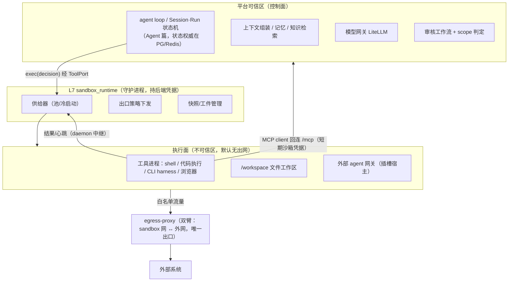
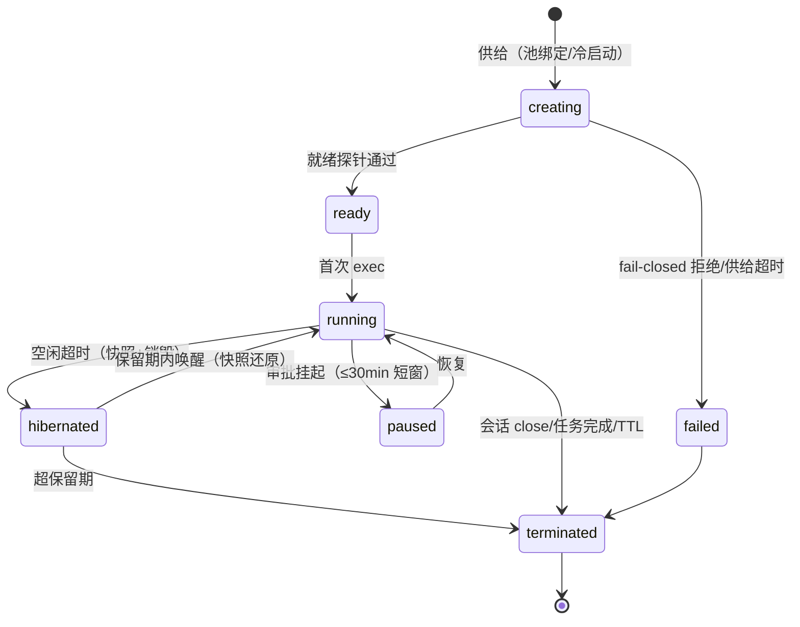

# 沙箱与执行环境设计（Sandbox Runtime）

> 状态：v0.1 | 日期：2026-09-26 | 上游依据：[架构锚点 01](../architecture/01-总体架构与分层.md) §3.4/§5/§7（M5 沙箱位）、[architecture/07 基础层](../architecture/07-基础层设计.md) §4、[研究整理/07 §7](../研究整理/07-Harness-Agent解剖与本体骨架.md)（execution.backends 扩展点）、[DSec 技术报告](../Dsec/DSec-技术报告.md)（四后端/可组合环境层/双组件状态外置/默认拒绝出口/reward hacking 案例库）、[Agent/Agent服务设计](../Agent/Agent服务设计.md) §2/§6、[Skills §5](../Skills/技能与插件设计.md)
>
> 定稿七件事：沙箱定位（agent 执行底座，非仅插件隔离设施）、控制面/执行面分离、六场景 × 四信任级 + fail-closed、统一抽象与后端协议、**会话沙箱运行时（agent 启动即用的默认执行底座，本文核心增量）**、出口控制与容量核算、生命周期与对抗检查位。

---

## 1. 定位与边界

**沙箱是平台的统一执行底座**：agent 每次启动干活时"手脚"所在的地方，也是插件隔离、流水线执行、评测回放与训练 rollout 的同一套设施。一个抽象管全部场景，禁止各场景各养一套（策略漂移的根治）。

**管**：沙箱供给/隔离/出口/生命周期/快照的统一运行时（L7 `infra/sandbox_runtime/`）与领域模型（L4 `domain/model/sandbox/`）。
**不管**：插件生命周期与审核（Skills 篇，本模块只供给其沙箱）、审批裁决（architecture/08 审核工作流）、模型接入（architecture/07 §2）、RSI 改进项生产（权威篇 = [architecture/09](../architecture/09-平台自进化RSI设计.md)，本模块只提供其 S4/S5 环境，消费契约见 09 §12.6）。

**为什么独立成模块**（原为 Skills §5 一节，2026-09-26 升格）：消费方已有四类——agent 会话（§5）、插件（Skills §5）、知识流水线（OntRAG 抽取执行位）、评测/训练（RSI，待建篇）；归在插件名下会颠倒主从。

## 2. 总体架构：控制面 / 执行面分离

DSec 双组件模式的移植：**agent 的"脑"在平台可信区，"手"在沙箱**。策略永远不交给模型，也不交给沙箱内进程。



| 组件 | 位置 | 理由 |
| ---- | ---- | ---- |
| agent loop 状态机、Task/Step 状态 | 平台（PG/Redis） | 单一事实源；内核可重启、沙箱可销毁，状态不丢（DSec"重连续跑替代日志重放"） |
| 上下文组装、记忆、知识检索 | 平台 | 需要可信数据访问与租户过滤 |
| 模型调用 | 平台模型网关 | 记账/预算/trace 贯穿（锚点 §6.7） |
| 工具进程、文件工作区、外部 harness | 沙箱 | 不可信执行；prompt injection 可能驱动 agent 执行任意代码，隔离不因"自家 agent"放松 |
| 审批/授权判定 | 平台 | 沙箱内进程身份不参与授权（AppArmor"root 也受限"教训，DSec §6.5） |

## 3. 场景矩阵与信任级

### 3.1 六场景

| 场景 | 内容 | 载荷 | 默认信任级 | 消费方 |
| ---- | ---- | ---- | ---- | ---- |
| **S0 会话沙箱** | agent 会话的默认执行底座：工具执行、文件工作区、产物落盘（§5） | LLM 生成的代码/命令、注入内容 | T2 | Agent（M5，可提前，见 §13） |
| S1 插件沙箱 | 外置插件 MCP server、CLI-harness 执行位 | 市场第三方代码（过五关门禁） | T1/T2 | Skills §5 |
| S2 流水线沙箱 | 抽取流水线的短时无状态执行（文档解析、批处理） | 平台任务 + 外部文档 | T2 | OntRAG |
| S3 插槽宿主 | 外部 agent 网关整容器化托管 | 第三方 harness 及其工具生态 | T2 | Agent §3 |
| S4 评测回放沙箱 | RSI 评估的轨迹回放、影子运行环境 | 平台候选改进项 | T2 | RSI 篇（待建） |
| S5 训练 rollout 沙箱 | 权重轨训练的轨迹采集环境 | 训练框架 + 任意探索行为 | T3 | RSI 篇 v2 |

### 3.2 信任级与 fail-closed 铁律

| 级 | 定义 | 后端要求 | v1 可达 |
| ---- | ---- | ---- | ---- |
| T0 可信内置 | 平台进程内 core 能力 | 无沙箱 | ✅ |
| T1 官方认证外置 | 平台方签名外置件 | docker + 只读根 + 白名单 | ✅ |
| T2 市场普通/会话 | 第三方上架件；LLM 生成执行 | docker + cgroups + 白名单；`sensitive` 类目要求 gVisor/microVM | docker ✅ / **gVisor ❌（v1 单机不具备）** |
| T3 对抗性 | 假定主动攻击沙箱本身 | microVM（Firecracker）或独立宿主 | ❌（v2） |

**fail-closed 铁律**（采纳归档评审裁决）：信任级要求的后端在当前部署不可达时，**拒绝供给并显式报错**，禁止静默降级——v1 装 sensitive 插件 = 明确拒绝 + 提示迁 full 档独立 Linux 宿主；T3 评测/训练在 v1 不可用即不可用。映射表平台内置（场景 + 数据分级 → 信任级），租户只能收紧。

## 4. 统一抽象与后端

### 4.1 领域模型（L4 `domain/model/sandbox/`，权威在 04 篇风格）

- `SandboxProfile`：隔离需求声明——场景、信任级、资源配额、网络策略引用、环境层引用（§8）、QoS 类。
- `SandboxInstance`：运行实体——状态机（§9）、归属（session_id / plugin_version / pipeline_job_id / eval_run_id 四选一）、用量、凭据 jti。
- `EgressPolicy`：出口白名单规则集（域名:端口:协议），版本化、可审计（§6）。
- `Snapshot`：可写层增量快照，可还原或导出为环境工件（§8.2）。

### 4.2 执行后端协议（研究整理/07 §7.2-7 `execution.backends` 落位）

```python
# services/infra/sandbox_runtime/backend.py
class SandboxBackend(Protocol):
    async def create(self, profile: SandboxProfile) -> SandboxHandle: ...
    async def exec(self, handle: SandboxHandle, cmd: ExecCommand) -> ExecResult: ...
    async def snapshot(self, handle: SandboxHandle) -> SnapshotRef: ...
    async def destroy(self, handle: SandboxHandle) -> None: ...
```

| 后端 | 对标 DSec | v1 | 适用 |
| ---- | ---- | ---- | ---- |
| `docker` | Container | ✅（deploy compose） | T1/T2 全场景默认 |
| `fncall`（预热池） | FnCall | ✅ | S2 短执行；S0 冷启动加速 |
| `microvm`（Firecracker） | MicroVM | v2 | T3、T2 sensitive |
| `remote`（独立宿主/云） | 云突发 | v2 | 本地容量不足、敏感负载外置 |

### 4.3 sandbox_runtime 守护进程与 plugin-daemon 的关系

`sandbox_runtime` 是**沙箱供给的唯一权威**（持 Docker/后端凭据，独立容器，接入 `sandbox` internal 网 + `backend` 网双臂）；Skills 篇的 plugin-daemon 保留**插件生命周期管理**（安装/启停/升级/心跳），其沙箱需求改为调用 sandbox_runtime——07 篇 §4 的"沙箱"一行由本模块承接。daemon 自身高攻击面（解析不可信 profile），与 Docker socket 的隔离（socket-proxy / rootless）为 PoC 前置项（§14）。

## 5. 会话沙箱运行时（核心增量）

### 5.0 能力暴露形态：内置工具组，非插件非技能

沙箱在平台三资产模型（Skills 篇 §1：tool / skill / plugin）中的位置必须先裁决——**沙箱运行时本身不是能力资产，是执行环境（L7 基础设施）**；agent 感知到它的唯一形态是**一组内置工具 `exec.*`（core-exec）**，注册在工具注册中心（provider_type=native，`execution_plane=sandbox`）：

| 判定 | 结论 | 理由 |
| ---- | ---- | ---- |
| 是 plugin 吗 | **否** | 双重不成立：①插件本身就需要沙箱隔离（Skills §5 plugin-daemon），沙箱若为插件即循环依赖；②插件是市场第三方可发布的商品，执行底座可被第三方替换/投毒 = 隔离承诺整体失效。执行底座必须内置（随平台发版、平台签名） |
| 是 tool 吗 | **运行时不是；入口是** | agent 调用的是工具（`exec.run` 等），沙箱只是这些工具的执行位——如同 agent 经 `knowledge.search` 用数据库，但数据库不是工具 |
| 是 skill 吗 | **否** | 技能是提示层程序记忆、无代码；但 SKILL.md 可以教 agent 怎么用好 `exec.*`（技能是使用说明书，说明书不是手） |
| 反方向成立 | **插件装进沙箱** | 市场件（CLI harness、领域工具包）作为 toolkit 层注入沙箱 `/toolkit`（§8.1）——插件是沙箱的内容物，不是容器 |

**core-exec 内置工具组**（首批）：`exec.run`（shell 命令）、`exec.file.read / exec.file.write`（workspace 文件）、`exec.code.run`（Python 执行）；v2 增 `exec.browser`。scope 统一 `sandbox:exec`（租户可整体禁用——合规客户可完全关闭执行能力）；语义标注挂平台任务本体的通用执行行动类（研究整理/07 任务本体合入后的落点）。agent 经 AgentConfig 的 CapabilityBinding 授权这组工具即"拥有沙箱能力"——不新增绑定机制。

**治理边界**：信任级/容量/出口策略是平台与租户治理面的独占决策，agent 与插件只能消费不能选择（§3.2 映射表内置；agent 若能选沙箱配置，注入即可降级隔离）。

### 5.1 供给时机：惰性供给

**不随 Session 创建自动供给**（纯问答会话不占池——最小够用）：会话内**首个沙箱类工具调用**（代码执行/文件读写/CLI/浏览器，按工具注册中心的执行位标注）触发供给；后续调用复用同一实例。Session 的 `idle_timeout_at` 联动休眠（§5.5），`close` 触发归档与回收（§5.4）。

### 5.2 启动路径与时延预算

```
工具调用判定需沙箱 → profile 组装（场景 S0 + agent 配置的 toolkit 声明 + 租户配额收紧）
  → 池命中？→ 绑定（注入 toolkit 卷 + 沙箱凭据 + 就绪探针）        P95 < 2s
  → 未命中 → 冷启动（base 镜像常驻本机，docker create/start）      P95 < 10s
  → 池耗尽 → 排队 + 告警（容量规则见 §7.2）
```

池化两种：**session 池**（默认 2，裸 base + 挂载占位，会话绑定时装配 toolkit）与 **fncall 池**（默认 4，服务 S2/S0 内短执行，用后重置）。重置 = 容器销毁重建（非原地清理），池化不跨任务复用可写层——防残留泄漏（归档评审裁决）。

### 5.3 workspace 布局与产物回流

| 路径 | 语义 | 权限 |
| ---- | ---- | ---- |
| `/workspace` | 任务工作区（草稿、中间文件） | 可写，随会话 |
| `/workspace/artifacts` | 任务产物 | 可写，会话结束归档 |
| `/toolkit` | 能力包注入（agent 配置声明的工具集） | 只读 |
| `/data` | 任务输入（上传文档等） | 只读挂载 |
| `/tmp` | 易失 | 可写，不进快照 |

**产物回流**：Session close（或 Run 终态）→ `artifacts` 归档 MinIO → 登记出处指针（doc/对象 key）供证据链与记忆沉淀引用 → L1 会话档案更新（Agent §6.2 close 语义）。workspace 是**易失工作记忆，不是平台记忆**——沉淀走 memory 篇管线，边界不混。

### 5.4 沙箱内 MCP 回连（能力获取的唯一通道）

沙箱内工具进程/外部 harness 需要平台能力（检索/记忆/行动）时，**以 MCP client 身份回连平台 `/mcp`**（Streamable HTTP），不直连任何存储（锚点模块 1 铁律）：

- 凭据：`SandboxCredential`（JWT，`aud=mcp`、`sub=sandbox:{id}`、绑定 tenant/session/agent 配置，TTL = 沙箱生命周期 + 5min 宽限）；销毁即入 Redis 吊销名单，宽限内失效。
- 平台侧由沙箱凭据恢复 `CallContext`（tenant/trace/session）→ 能力可见性 = 该 agent 配置授权的工具子集 → 审计与成本归因挂 session。
- 收益：沙箱内生态（CLI 工具、外部 harness 自带工具）统一经平台能力出口，伪造内部通信无目标（DSec §6.4 案例的封堵原理）。

### 5.5 空闲休眠、唤醒与恢复语义

- **休眠**：会话空闲超 `idle_timeout`（默认 30min）→ 快照可写层 → 销毁容器释放资源；快照保留 72h（可配）。
- **唤醒**：保留期内回访 → 快照还原 + 起新容器（预算 P95 < 45s，PoC 验证）；超期 → 快照清理，下次冷启动。
- **恢复语义定稿**（采纳归档评审裁决）：**快照 + 销毁重建是唯一的长时恢复路径**；`docker pause` 仅允许 ≤30min 短窗（审批挂起常见窗），且 paused 态心跳由 daemon 代理标记（冻结进程不发心跳，原状态机矛盾在此修正）。任务状态权威始终在平台侧（§2 分账表），恢复 = 状态重载 + 环境还原，不重放命令（非幂等副作用风险，DSec V4.1 教训）。

## 6. 出口控制（默认拒绝）

- **默认全拒**：沙箱接入 `sandbox` internal 网，无外网路由；唯一出口 `egress-proxy`（**双臂**：sandbox 网 ↔ 外网；部署编排须保证其自身有外网臂，此为归档评审发现的编排缺陷，deploy 侧修复项）。
- **授权链三分**（调和"客户要能放宽"与"注入不能扩权"）：**租户管理员经审核工作流可放宽**白名单（留痕、可回滚）；**agent/任务参数一律不可**作为白名单来源（prompt injection 防线）；**平台内置映射只能收紧**。
- **DNS 同治**：沙箱不直发 DNS，解析在代理侧完成（防 DNS 隧道）。
- **v1 可见性边界（诚实声明）**：v1 为域名级白名单（Squid 类），**TLS 内容不可见**——白名单域内的参数编码外带、包管理器拉取行为只有域名级信号；此限制同步约束 RSI 评测"不正当通过"判定的效力（S4 对抗检查位按域名级取证，MITM 升级后增强）。MITM（私有 CA + 内容审计）为 v2 升级位，策略模型不变。
- **东西向**：沙箱间不可互访；对平台内网仅两条受控通道——daemon 中继（结果回传）与 `/mcp` 回连（§5.4）。

## 7. 隔离基线与容量核算

### 7.1 隔离矩阵（T2 常规 / sensitive|T3 加强）

| 维度 | 基线 | 加强 | 对应 DSec 案例 |
| ---- | ---- | ---- | ---- |
| 计算 | cgroups：小档 0.5 核/0.5G、中档 1 核/1G（默认小档）；pids 上限 | gVisor/Firecracker（fail-closed，§3.2） | 资源耗尽 |
| 文件 | 根只读；workspace 独立卷；禁符号链接逃逸 + 路径规范化（runner 统一兜底） | `/proc`（非 self）/`/sys` 黑名单 | 递归 /proc 崩机、覆盖 /bin/bash |
| 输出 | 单命令 64KB 截断 + 标记；任务级累计 10MB | 落盘配额强制 | `yes` 撑爆存储 |
| 网络 | §6 | 全量审计 | 翻日志/借包管理器找答案 |
| secrets | env 注入不落盘不进日志；销毁即吊销（§5.4） | KMS | 凭据外带 |
| IPC | 沙箱内不持平台长期凭据；daemon 通道单向 | seccomp 默认拒 + 最小 cap + no-new-privileges | 伪造内部 RPC |

### 7.2 容量核算表（v1 不超卖；超分/复用留 v2）

**铁律：沙箱配额之和 ≤（总内存 − 常驻服务 − OS 预留 2G）× 80%；触顶排队 + 告警。**

| 档 | 机型 | 常驻估算 | 沙箱池余量 | 并发（含池） |
| ---- | ---- | ---- | ---- | ---- |
| lite（默认） | 8G | ~5G（backend 1 + worker 1 + daemon 0.5 + egress 0.3 + PG 1.5 + Redis 0.3 + MinIO 0.5 + nginx 0.2） | ~0.8G | 小档 ×2（池 1） |
| lite | 16G | ~7G（PG 2、worker 拆在线/idle 1.5） | ~5.6G | 小档 ×11（session 池 2 + fncall 池 4） |
| full | 32G | ~13G（+Neo4j 2G + Milvus 2.5G + relay） | ~13.6G | 小档 ×27 / 中档 ×13 / 大档(2G) ×6 |

> 此表修正归档版"32 并发 × 2GB"的算术错误（16G 机型不成立）；数字为设计预算，M5 前以实测压测校准并冻结。

## 8. 环境供给与快照

### 8.1 逻辑三层（v1）

`base`（平台运行时底座镜像）→ `workspace`（任务卷）→ `toolkit`（agent 配置声明的能力注入）。v1 为**逻辑装配**（镜像 + 卷 + 能力包文件注入），不做文件系统级层叠——单机、镜像数 <50 的规模下 EROFS 层叠是过度设计；升级触发条件：评测/训练批量负载（S4/S5）出现真实组合爆炸时引入 DSec 式可组合层。

### 8.2 快照与环境工件化

- 快照 = 可写层增量（v1：`docker diff` + workspace 卷打包 → MinIO）；v2 评估块级增量。
- 用途：休眠/唤醒（§5.5）、长任务检查点、**环境工件化**（一次会话装好的环境固化为可复用工件，供 S4/S5 批量还原——DSec pack_diff 模式）。
- 两段式治理（DSec §6.1 直接移植）：构建与运行**账号隔离**；打包前**残留清理**（凭据/参考答案/构建痕迹），清理断言进验收而非人工自觉。

## 9. 生命周期与调度



TTL 分档：S0 会话期（含休眠保留 72h）；S1 插件常驻（随启停）；S2 单任务 ≤30min；S3 宿主会话期；**S4 任务持有模式（跟随 eval_run 生命周期，上限 6h，空闲回收照旧）**——修正归档版 S4 TTL 2h 与评估超时 4h 的矛盾。调度纪律：daemon 本地准入仲裁（容量不足即拒并让调用方排队）；心跳 30s（paused 态由 daemon 代理标记），连续 3 次缺失 → failed + 回收 + 工单。

## 10. 可观测与对抗检查位

- 指标（入 07 篇 §6 清单）：`sandbox_create_latency_seconds`、`sandbox_active_count`、`sandbox_hibernate_wake_latency_seconds`、`sandbox_egress_denied_total`、`sandbox_quota_exceeded_total`（标签 tenant/scenario/backend）。出口拒绝激增 = 探测行为信号 → 告警。
- 行为基线：出口目标/调用量/资源滑动基线，偏离 → 自动停用 + 工单（对齐 Skills §4 运行期监测）。
- **对抗检查位**（供 RSI S4 评测可信度与安全审计消费；v1 域名级可见性边界见 §6）：

| 检查位 | 判定 | 数据源 |
| ---- | ---- | ---- |
| 出口审计比对 | 白名单外访问、与任务无关的包管理器域名拉取 | egress-proxy 日志 |
| 文件完整性 | 受保护文件哈希监测；快照残留清理二次断言 | daemon 巡检 |
| 通信面核查 | 沙箱内无平台长期凭据、内部端点不可达 | 逃逸演练常驻用例 |
| 输出异常 | 无界输出、遍历型命令模式 | exec 审计流 |

## 11. 与平台集成点

| 集成 | 方式 |
| ---- | ---- |
| Agent（agent 服务） | 沙箱类工具调用经 `ToolPort`（锚点 §3.4 第三处倒置）路由到 sandbox_runtime；Session idle/close 联动休眠/归档；SSE 不受影响（事件流在平台侧） |
| Skills（插件） | plugin-daemon 的沙箱供给改调本模块（07 篇 §4 对账）；T1/T2 信任级由市场 sensitivity 映射 |
| OntRAG（知识流水线） | S2 短执行（文档解析等），fncall 池 |
| MCP 网关 | 沙箱回连凭据走 `/mcp` 鉴权链；吊销名单 Redis 共享 |
| 审核工作流 | 白名单放宽（租户管理员发起）与敏感操作挂审核档位（锚点 §6.8 solo/team/enterprise） |
| RSI（待建模块篇） | S4/S5 环境物化、快照工件导出、对抗检查位报告 |
| 可观测/审计 | `sandbox_events` 专表（供给/休眠/销毁/出口拒绝）+ trace_id 贯穿 |

## 12. API 契约与数据模型

管理面 REST（端点登记册为准，本篇为需求来源，登记进 docs/api/01）：

```
GET  /api/v1/sandboxes                     # 列表 + 用量（管理角色）
GET  /api/v1/sandboxes/{id}                # 详情（状态/用量/归属）
POST /api/v1/sandboxes/{id}/stop           # 停止（管理）
GET  /api/v1/sandboxes/{id}/audit          # 执行与出口审计
GET/PUT /api/v1/sandbox-config             # 池/配额/信任级映射（平台管理员；租户只读+可收紧项）
```

数据模型（PG，DDL 展开归 docs/database，变更走 06 篇契约流程）：`sandbox_profiles`（模板）、`sandbox_instances`（状态/归属/用量/凭据 jti/心跳）、`sandbox_snapshots`（MinIO key/保留期/清理状态）、`egress_policies`（规则集 JSONB/版本/审批单号）、`sandbox_events`（生命周期与出口审计）。全部带 `tenant_id` 与 `trace_id`。

## 13. 里程碑对齐与验收

锚点 §7 M5 已含"插件市场 + 沙箱"——本模块整体随 M5 交付，**S0 会话沙箱列为 M5 首位场景**；提前触发条件登记：M3/M4 期间首个代码执行类工具上架时，评估 S0 最小版（docker + session 池 1 + 默认全拒）提前插入（登记进代办任务，不擅自改锚点）。

验收标准（对应 testing/ 用例集登记）：

1. **逃逸演练套件**（常驻安全用例）：白名单外出网全拒（含 DNS 隧道样例）、文件越界/符号链接逃逸全拒、资源超限被杀不伤邻、无界输出截断、`/proc` 黑名单生效、伪造内部 RPC 不可达；
2. **启动时延**：lite 16G 档实测——池命中 P95 < 2s、冷启动 < 10s、唤醒 < 45s；
3. **休眠唤醒**：休眠后保留期内回访，workspace 文件与 toolkit 环境一致；超期快照清理可断言；
4. **fail-closed**：sensitive 插件在无 gVisor 后端时安装被拒且报错明确（非静默 docker）；
5. **容量**：超配额排队不 OOM；人为打爆单个沙箱，常驻服务无感；
6. **回连凭据**：沙箱销毁后 token 5min 内失效；越权 tools/call 被拒并留痕；
7. **残留清理**：预埋 marker 文件的会话，其快照/池复用实例中不可见。

## 14. 决策记录与待办

| # | 决策 | 替代方案（为何不选） |
| ---- | ---- | ---- |
| SBX-1 | 沙箱升格为统一执行底座（第 13 号模块），S0 会话沙箱惰性供给 | 各场景各养沙箱（策略漂移）；随 Session 创建即供给（纯问答白占池） |
| SBX-2 | fail-closed：后端不可达即拒绝，禁止静默降级 | 降级 + 告警（矩阵可信度崩塌，客户安全评审一票否决） |
| SBX-3 | 快照 + 销毁重建为唯一长时恢复；pause 仅 ≤30min 短窗且 daemon 代理心跳 | pause + memory.reclaim 续跑（匿名页回收未证成、TCP 断连、心跳矛盾——归档评审三连否） |
| SBX-4 | 出口授权链三分：租户管理员可放宽（过审核）、agent/任务参数不可、平台映射只能收紧 | 任务参数优先（注入扩权）；租户完全不可放宽（内网闭环跑不通） |
| SBX-5 | v1 域名级出口可见性（诚实声明效力边界），MITM 留 v2 升级位 | v1 即 MITM（私有 CA 运维成本与合规复杂度超前） |
| SBX-6 | v1 容量不超卖，lite/full 分档核算表 | 按申请量超分（DSec 90% 沙箱 CPU ≤5% 的前提是万级规模，v1 不成立） |
| SBX-7 | plugin-daemon 保留插件生命周期，沙箱供给统一收归 sandbox_runtime | 并入 plugin-daemon（会话/流水线/评测负载耦合进插件模块，主从颠倒） |
| SBX-8 | 能力暴露形态 = 内置工具组 core-exec（`exec.*`，native + execution_plane=sandbox）；沙箱运行时本身为 L7 基础设施，不作插件/技能上架；插件作为 toolkit 内容物进沙箱 | 做成市场插件（循环依赖：插件需沙箱隔离；且执行底座第三方可替换=投毒面）；裸暴露沙箱 API 给 agent（跳过工具注册中心的 scope/语义标注/Tool Search 管线） |

**待办**：

- [ ] docs/api/01 端点登记册增补 §12 五端点；docs/database 增补五表 DDL；
- [ ] deploy compose：`sandbox-runtime` 与 `egress-proxy`（双臂）服务位 + `sandbox` internal 网语义核验（Windows/WSL2 差异清单：internal/DNS 行为 ≠ Linux 原生，验收以 Linux 环境为准）；
- [ ] sandbox_runtime 与 docker.sock 隔离方案 PoC（socket-proxy / rootless）——高攻击面守护进程的前置项；
- [ ] 快照还原时延 PoC（45s 预算验证）；池绑定 2s 预算验证；
- [ ] S0 提前触发条件评估（首个代码执行类工具上架时，M3/M4 插入最小版）；
- [x] ~~RSI 模块篇（S4/S5 消费契约：环境工件导入、对抗检查位报告格式）~~（2026-09-26 落定：RSI 权威篇 = [architecture/09](../architecture/09-平台自进化RSI设计.md)（模块 14，非独立模块目录——并行会话已落档，二轮增补见其 §12）；S4/S5 消费契约 = 09 §12.6：对抗检查位报告 JSON 契约 + 域名级可见性标注，环境工件导入 = evalRun 声明 Snapshot 引用批量还原 S4）；
- [ ] egress-proxy 实现选型（Squid per-sandbox ACL 按源 IP vs iptables 脚本）；
- [ ] MITM 内容审计（v2）与 T3 microVM 后端（v2）的触发条件量化。
