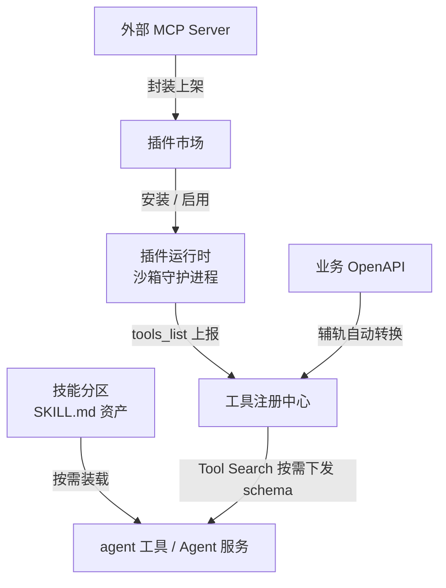
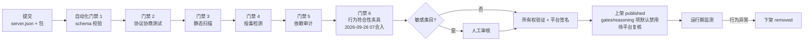
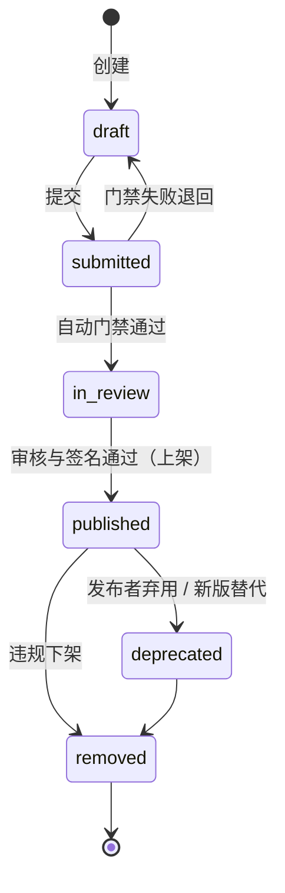
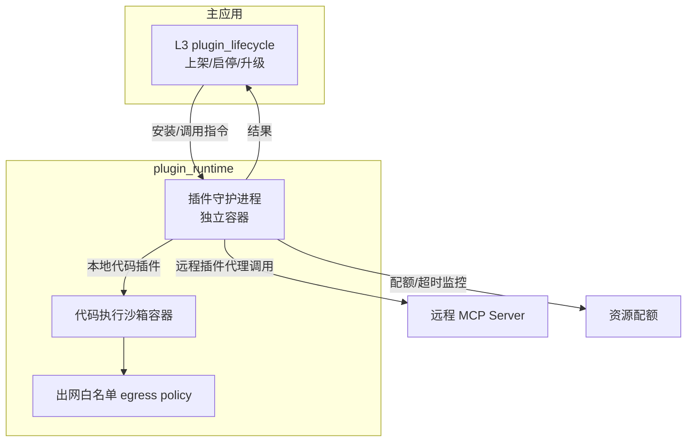
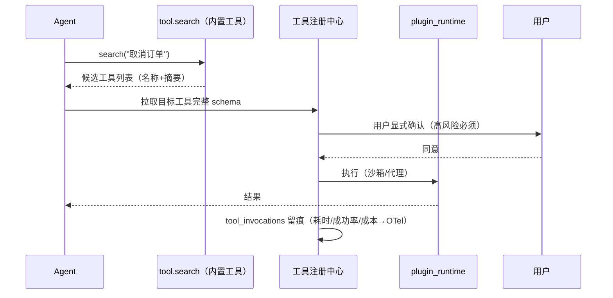

# 技能与插件（Skills & Plugins）- 设计

> 状态：v0.1 | 日期：2026-09-26 | 上游依据：[架构锚点：01-总体架构与分层](../architecture/01-总体架构与分层.md)、[研究整理/01-Agent工具调研](../研究整理/01-Agent工具调研.md)、[研究整理/05-MCP平台能力](../研究整理/05-MCP平台能力.md)、[研究整理/06-插件与工具集](../研究整理/06-插件与工具集.md)、[研究整理/07-Harness-Agent解剖与本体骨架 §7](../研究整理/07-Harness-Agent解剖与本体骨架.md)、[Agent/02-Agent内核与能力层划分设计](../Agent/02-Agent内核与能力层划分设计.md)（2026-09-26 07合入增补）、[架构设计/10-插件运行时与技能市场详细设计](../架构设计/10-插件运行时与技能市场详细设计.md)、[架构设计/20-Agent沙箱与执行隔离设计](../架构设计/20-Agent沙箱与执行隔离设计.md)（2026-09-26 旧稿合入）

---

## 1. 概念厘清与三资产模型

平台对外交换的"能力资产"分三类，边界必须清楚（工具集服务管"单件"，插件服务管"商品"，研究整理 06 §1）：

| 资产 | 定义 | 形态 | 归属管理 |
| ---- | ---- | ---- | ---- |
| **tool** | 单件工具：agent 可调用的最小能力单元 | function calling schema / MCP tool manifest | 工具注册中心（§2） |
| **skill** | 技能：SKILL.md 描述的 prompt / 流程资产，是 agent 的**程序记忆** | SKILL.md（含 frontmatter 元数据） | 市场技能分区（LangChain Hub 式） |
| **plugin** | 插件：MCP Server 打包的**商品**（可含多 tools / resources / prompts） | server.json + 代码包 | 插件市场全生命周期（§4） |



流转要点：**plugin 安装后其 tools 进注册中心**（agent 侧视图统一）；skill 是独立分区的 prompt/流程资产，不产生可执行 tool；外部 MCP Server 可封装为 plugin 上架（研究整理 05 §5 与 06 的衔接点）。

代码落点（架构锚点 §5 模块 6）：`services/business/plugin_lifecycle/`（上架审核/启停/升级）、`services/domain/model/{plugin,tool}`、`services/infra/plugin_runtime/`（守护进程 + 沙箱）。

```
services/business/plugin_lifecycle/
├── submission.py     # 提交受理、server.json 校验入口
├── gates.py          # 五关自动化门禁编排（schema/协商/扫描/投毒/依赖）
├── review.py         # 敏感类目人工审核工单对接（review_workflow）
├── signing.py        # 所有权验证 + 平台签名（ed25519）
└── lifecycle.py      # 启停/升级/弃用/下架状态迁移
services/infra/plugin_runtime/
├── daemon.py         # 插件守护进程（独立容器入口）
├── sandbox.py        # 沙箱容器管理（创建/配额/超时/回收）
├── egress.py         # 出网白名单策略下发
└── proxy.py          # 远程插件的代理调用与配额控制
```

## 2. 工具注册中心

统一元数据模型 = **function calling schema**（OpenAI 风格 `name + description + parameters`）+ **MCP tool manifest**（`inputSchema` / `annotations`）+ **平台扩展**（提供方 / 语义标注 / 版本 / 所需 scope）：

| 字段组 | 内容 | 来源 |
| ---- | ---- | ---- |
| 基础 | `name`、`namespace`、`description` | 提交 |
| 调用契约 | `input_schema` / `output_schema`（JSON Schema） | 提交 / OpenAPI 转换 / `tools/list` |
| 提供方 | `provider_type`（native\|plugin\|external_mcp\|openapi\|agent）、`provider_id` | 注册 |
| 执行位 | `execution_plane`（in-process \| sandbox）——sandbox 表示该工具在统一沙箱（[docs/Sandbox](../Sandbox/README.md)）内执行，首个调用触发会话沙箱惰性供给；内置 core-exec 工具组（`exec.run / exec.file.* / exec.code.run`，scope `sandbox:exec`）即此形态，见 Sandbox 篇 §5.0 | 注册 / 标注 |
| 语义标注 | 关联本体行动类/对象类/规则 IRI——平台区别于裸工具堆的关键（研究整理 05 §2.1） | 人工标注 + 存在性校验（`ontology.query`） |
| 权限 | `required_scopes`（**授权唯一依据**）、`annotations`（不可信，仅 UI 提示） | 提交 |
| 版本与观测 | `version`、`changelog`、`enabled`、调用统计 | 市场流水线 / OTel |

注册中心里一个工具的完整 manifest 示例（平台原生工具）：

```json
{ "name": "supply.cancel_order", "namespace": "supply", "version": "1.0.0",
  "description": "取消指定订单（对应本体行动类 CancelOrder）",
  "provider_type": "native", "provider_id": "mcp-gateway",
  "input_schema": { "type": "object",
    "properties": { "order_id": { "type": "string" } }, "required": ["order_id"] },
  "semantic_annotation": {
    "action_iri": "http://ontology-agent.local/o/t1/supply#CancelOrder",
    "object_class": "...#Order", "rule_iris": ["...#R007"], "risk_level": "high" },
  "required_scopes": ["action:invoke", "supply:write"],
  "annotations": { "readOnlyHint": false, "destructiveHint": true } }
```

**Tool Search 按需加载**（研究整理 06 §3 工程问题：12 个 MCP server ≈ 14k tokens 上下文）：

- 全部工具的 name + 一句话描述做 embedding 入 Milvus；
- 会话开始只下发"工具目录"（名称 + 摘要）；agent 经内置工具 `tool.search(query, top_k)` 按任务按需拉取完整 schema；
- 按租户/用户可见性过滤目录（与 MCP 网关 `mcp_tools.visibility` 同源）。

## 3. 插件格式

### 3.1 主轨：MCP server.json + 平台扩展字段

对齐官方 MCP Registry 的 `server.json` 规范（研究整理 06 §4.1），平台扩展收敛在 `x-platform` 下：

```json
{
  "name": "io.ontology-agent/weather",
  "display_name": "天气查询",
  "version": "1.2.0",
  "description": "按城市与日期查询天气",
  "transport": { "type": "streamable_http", "url": "https://weather.example.com/mcp" },
  "x-platform": {
    "category": "data-tools",
    "tags": ["weather", "query"],
    "changelog": "1.2.0: 支持未来 7 天预报",
    "required_scopes": ["weather:read"],
    "compatible_protocol_versions": ["2025-06-18", "2025-11-25"],
    "signature": "platform-ed25519:...",
    "runtime": "remote"
  }
}
```

### 3.2 辅轨：OpenAPI 3.x 自动转工具

提交 OpenAPI 3.x 文档 + 鉴权方案（API Key / OAuth2 配置），平台自动把每个 operation 转为 MCP 工具 / function calling schema（继承 GPT Actions / Dify / Coze 惯例）；转换后必须人工补充语义标注才可上架。

### 3.3 技能分区：SKILL.md

SKILL.md（frontmatter：`name` / `description` / `version` / `required_tools`）+ 正文流程说明；LangChain Hub 式程序化上传 / 拉取；格式与主流 agent 工具（nanobot / openclaw / claude 等）的技能体系兼容（研究整理 06 §4.1、01 篇）。

### 3.4 四通道能力层（2026-09-26 07合入）

> 上游依据：[研究整理/07 §7.3-7.5](../研究整理/07-Harness-Agent解剖与本体骨架.md)（四通道 / 能力清单 / 扩展点契约 / 组装与出口控制）。**内核与能力层的划分裁决权威是 [Agent/02-Agent内核与能力层划分设计](../Agent/02-Agent内核与能力层划分设计.md)**——本节是能力侧细则，两文冲突以它为准。

#### 3.4.1 四条接入通道（由轻到重）

| 通道 | 载体 | 适合 | 信任要求 |
| ---- | ---- | ---- | ---- |
| **L0 MCP 工具** | 独立 MCP Server | 纯工具能力 | 审核注册（§4 门禁） |
| **L1 SKILL.md 技能** | SKILL.md（§3.3） | 程序性知识（纯提示层、无代码） | 审核上架 + 判据/状态机交互专项审核 |
| **L2 能力包 Capability Pack** | server.json 扩展格式（§3.4.2）：一个包捆绑工具 + 规则包 + 上下文供给器 + 校验器 + 技能 | 复合领域能力（如"冷链合规包"） | 市场全门禁 + 行为符合性夹具（§3.4.3）+ 运行期沙箱隔离 + 出口白名单；**gates/reasoning 项默认禁用待平台复核** |
| **L3 内置扩展点** | 平台原生 Python 扩展 API（`register_tool / register_gate / register_context_provider / on(event)`，对标 pi extensions） | 高性能、深集成的能力 | 平台开发者，随版本发布 |

L0/L1 已在架构内（§2 注册中心、§3.3 技能分区、§4 上架流水线即其治理）；**L2 能力包是本节核心增量**——市场只卖单件工具太薄，领域能力天然成套；**L3 保证平台自身演进时内核不腐化**（内核只认扩展点接口、不 import 任何具体能力）。某机制下放哪条通道、内核保留什么的逐项裁决见 Agent/02 篇 §3-§4。

#### 3.4.2 L2 能力包清单（server.json 扩展）

server.json 由"插件商品清单"扩展为**能力包清单**：`x-platform` 下新增五个数组字段，一个包可捆绑 `tools[]` + `rule_packs[]`（gates **增量**——基线门禁平台所有，包 gate 只增不替，07 §7.4 铁律 1）+ `context_providers[]` + `validators[]` + `skills[]`。**每一项强制本体语义标注**（绑定的行动类 / 规则类 / 概念类 IRI，存在性经 `ontology.query` 校验）——无语义标注不上架（07 §7.4 铁律 2）。

| 字段 | 内容 | 挂载扩展点 | 上架默认状态 |
| ---- | ---- | ---- | ---- |
| `tools[]` | 工具实现（字段同 §2 注册中心 manifest） | `tools.bindings` | 随包启用 |
| `rule_packs[]` | 规则 / SHACL shape 包（增量 gate） | `gates.pre` / `gates.post` | **禁用，待平台复核启用** |
| `context_providers[]` | 外部数据源 / 专用召回供给器 | `context.providers` | 随包启用 |
| `validators[]` | 自定义后验校验器（结构化错误回流） | `gates.post` | **禁用，待平台复核启用** |
| `skills[]` | 包内 SKILL.md 引用 | 提示层注入 | 随包启用 |

能力包清单示例（冷链合规包：2 工具 + 1 规则包 + 1 供给器）：

```json
{
  "name": "io.ontology-agent/coldchain-compliance",
  "display_name": "冷链合规包",
  "version": "1.0.0",
  "description": "冷链运输温度合规成套能力：温度记录查询、温控规则校验、IoT 数据供给",
  "package_type": "capability_pack",
  "transport": { "type": "streamable_http", "url": "https://coldchain.example.com/mcp" },
  "x-platform": {
    "schema_version": "1",
    "category": "compliance",
    "tags": ["coldchain", "compliance"],
    "required_scopes": ["action:invoke", "coldchain:read"],
    "signature": "platform-ed25519:...",
    "tools": [
      {
        "name": "coldchain.get_temp_records",
        "description": "查询运输段全程温度记录",
        "input_schema": { "type": "object",
          "properties": { "shipment_id": { "type": "string" } }, "required": ["shipment_id"] },
        "semantic_annotation": {
          "action_iri": "http://ontology-agent.local/o/t1/coldchain#QueryTempRecords",
          "object_class": "...#Shipment", "rule_iris": ["...#R-COLD-01"], "risk_level": "low" },
        "required_scopes": ["coldchain:read"]
      },
      {
        "name": "coldchain.submit_compliance_report",
        "description": "提交冷链合规报告（产物为候选实例，进审核队列）",
        "semantic_annotation": {
          "action_iri": "http://ontology-agent.local/o/t1/coldchain#SubmitComplianceReport",
          "object_class": "...#ComplianceReport", "rule_iris": ["...#R-COLD-07"], "risk_level": "high" },
        "required_scopes": ["coldchain:write"]
      }
    ],
    "rule_packs": [
      {
        "name": "coldchain.temp_rules.v1",
        "artifact": "rules/coldchain.shacl.ttl",
        "mount": ["gates.pre", "gates.post"],
        "default_enabled": false,
        "semantic_annotation": {
          "rule_iris": ["http://ontology-agent.local/o/t1/coldchain#R-COLD-01",
                        "http://ontology-agent.local/o/t1/coldchain#R-COLD-02"],
          "applies_to": "...#Shipment" }
      }
    ],
    "context_providers": [
      {
        "name": "coldchain.iot_feed",
        "artifact": "providers/iot_feed.py",
        "mount": "context.providers",
        "semantic_annotation": { "concept_iris": ["...#Shipment", "...#TemperatureReading"] }
      }
    ],
    "validators": [],
    "skills": [ { "ref": "skills/coldchain-sop/SKILL.md" } ]
  }
}
```

（`validators` 留空表示本包不含后验校验器；`skills` 引用包内 SKILL.md，随包走 §3.3 技能分区上架。）

**schema 定稿（2026-09-26 设计定稿）**：能力包清单 schema v1 定稿如下，含三件——`schema_version` 字段、必填/可选字段表、JSON Schema 片段（含 `required` 列表）。

**① schema 自身版本字段**：`x-platform.schema_version`（字符串）——**pack 清单 schema 自身的版本**，区别于顶层 `version`（包语义版本，semver）。本节定稿值 `"1"`；演进规则：向后兼容加字段 → 次版本 +1（如 `"1.1"`），破坏性变更（删字段/改语义）→ 主版本 +1 且市场双版本并行一个发布周期。门禁 1（schema 校验）按该字段选择校验分支，未知版本拒绝（3001）。

**② 必填/可选字段表**（「提交态必填」指提交上架时；「上架态必填」由发布流水线写入）：

| 字段 | 必填性 | 说明 |
| ---- | ---- | ---- |
| 顶层 `name` | 必填 | 反向域名包名（`io.ontology-agent/*`），全平台唯一 |
| 顶层 `display_name` / `description` | 必填 | 展示名 / 一句话用途 |
| 顶层 `version` | 必填 | 包语义版本（semver） |
| 顶层 `package_type` | 必填 | 固定 `capability_pack`（普通插件省略此字段，即退化特例 §3.4.6） |
| 顶层 `transport` | 必填 | 与官方 server.json 一致 |
| `x-platform.schema_version` | 必填 | pack schema 自身版本，定稿 `"1"` |
| `x-platform.category` | 必填 | 市场类目 |
| `x-platform.required_scopes` | 必填 | 至少一项（授权唯一依据，§6） |
| `x-platform.signature` | 提交态省略，上架态必填 | 平台签名（两级签名 §5.1：发布者签 + 平台签） |
| `x-platform.tags` / `changelog` / `compatible_protocol_versions` / `runtime` | 可选 | 元数据 |
| `x-platform.tools[]` | 五数组各自可选，**合计至少一项非空** | 项内必填：`name`、`description`、`input_schema`、`semantic_annotation`、`required_scopes`（同 §2 manifest） |
| `x-platform.rule_packs[]` | 同上 | 项内必填：`name`、`artifact`、`mount`、`semantic_annotation`；`default_enabled` 平台强制 `false`（提交值忽略——禁用待复核，§4） |
| `x-platform.context_providers[]` | 同上 | 项内必填：`name`、`artifact`、`mount`、`semantic_annotation` |
| `x-platform.validators[]` | 同上 | 项内必填：`name`、`artifact`、`semantic_annotation`（mount 固定 `gates.post`） |
| `x-platform.skills[]` | 同上 | 项内必填：`ref`（包内 SKILL.md 路径） |

**③ JSON Schema 片段（含 required 列表；完整 schema 随门禁 1 实现入库）**：

```json
{
  "$schema": "https://json-schema.org/draft/2020-12/schema",
  "$id": "https://ontology-agent.local/schemas/capability-pack-1.json",
  "title": "L2 能力包清单 server.json（pack schema v1）",
  "type": "object",
  "required": ["name", "display_name", "version", "description",
               "package_type", "transport", "x-platform"],
  "properties": {
    "package_type": { "const": "capability_pack" },
    "x-platform": {
      "type": "object",
      "required": ["schema_version", "category", "required_scopes"],
      "properties": {
        "schema_version": { "const": "1" },
        "category": { "type": "string" },
        "required_scopes": { "type": "array", "items": { "type": "string" }, "minItems": 1 },
        "tags": { "type": "array", "items": { "type": "string" } },
        "changelog": { "type": "string" },
        "compatible_protocol_versions": { "type": "array", "items": { "type": "string" } },
        "runtime": { "type": "string" },
        "tools": { "type": "array", "items": { "$ref": "#/$defs/toolItem" } },
        "rule_packs": { "type": "array", "items": { "$ref": "#/$defs/rulePackItem" } },
        "context_providers": { "type": "array", "items": { "$ref": "#/$defs/providerItem" } },
        "validators": { "type": "array", "items": { "$ref": "#/$defs/validatorItem" } },
        "skills": { "type": "array", "items": { "type": "object",
          "required": ["ref"], "properties": { "ref": { "type": "string" } } } }
      },
      "anyOf": [ { "required": ["tools"] }, { "required": ["rule_packs"] },
                 { "required": ["context_providers"] }, { "required": ["validators"] },
                 { "required": ["skills"] } ]
    }
  },
  "$defs": {
    "semanticAnnotation": { "type": "object",
      "description": "本体语义标注：action_iri / rule_iris / concept_iris / object_class 至少其一，存在性经 ontology.query 校验" },
    "toolItem": { "type": "object",
      "required": ["name", "description", "input_schema", "semantic_annotation", "required_scopes"] },
    "rulePackItem": { "type": "object",
      "required": ["name", "artifact", "mount", "semantic_annotation"],
      "properties": { "default_enabled": { "const": false } } },
    "providerItem": { "type": "object",
      "required": ["name", "artifact", "mount", "semantic_annotation"] },
    "validatorItem": { "type": "object",
      "required": ["name", "artifact", "semantic_annotation"] }
  }
}
```

（`anyOf` 五分支即「五数组合计至少一项非空」的机器表达；`signature` 不在校验片段必填列——发布流水线在上架态回填后再验。）

#### 3.4.3 行为符合性夹具（上架强制关）

标注正确性不靠人眼（07 §7.4 铁律 2）：上架门禁跑**行为符合性夹具**——由本体公理**自动生成正反例**（如"温控超阈值必触发 R-COLD-01"为正例、"未超阈值不得触发"为反例），在任务级投影上验证规则包 / gate / 供给器的行为与其本体语义标注一致；**夹具不过不发签名**。夹具生成器本身是内核资产（Agent/02 §7 反腐化保障第 2 条）。本关作为 §4 审核流水线的第 6 关，对 L2 能力包及一切含 gate / 规则项的提交强制。

#### 3.4.4 组装模型（能力层栈与版本 pin）

- **能力层栈**（DSec 可组合环境层的逻辑装配版）：`agent 内核（base）→ 平台标准能力层（任务本体、内置工具、语义层能力）→ 租户能力层（市场安装的能力包）→ 任务级 toolkit（Task 实例按本体引用声明的能力集）`；组装时机在任务装载阶段。
- **装载时解析并 pin 全部能力包版本**：运行中任务不受市场升级 / 禁用影响（禁用仅对新任务生效）。
- 同一行动类出现多个实现时，按**优先级 + 审批**裁决，不允许静默遮蔽。
- 与 DSec 的差异声明：层叠是**逻辑装配**（注册表视图 + 按需 schema 下发 + 容器编排），不动容器运行时；真实镜像层叠加（评测 / 训练负载的环境物化）列 v2 评估。
- **L2 能力包市场开放的前置门禁 = 出口白名单代理机制就绪**（机制就绪前，L2 通道只对平台方签名的包开放）。

#### 3.4.5 出口控制（v1 降级承诺）

L0/L2 不可信容器（07 §7.5；运行时权威细则见 [docs/Sandbox §6](../Sandbox/沙箱与执行环境设计.md)，内核侧裁决见 Agent/02 篇 B4）：

- **默认完全无网**（`network: none`），无任何外网路由；
- 数据经**宿主侧白名单代理**显式传递；确需出网的包**逐个人工放行静态 IP / 域名**；
- eBPF 级"任务级、可动态变更、默认拒绝"语义列 **v2**；
- **权限判定只认平台 scope + ACL，与容器内进程身份无关**（AppArmor 对沙箱内 root 同样生效的教训）。

#### 3.4.6 与三资产模型（§1）的关系

能力包 = plugin 的**超集形态**：plugin（server.json + 代码包）是能力包只填 `tools[]` 一个字段的退化特例。市场同时接受**单品**（tool / skill / plugin 照旧走 §2-§4 流水线）与**成套包**（capability pack）两种提交；能力包上架时其 tools 拆解入工具注册中心、rule_packs / validators / context_providers 入扩展点注册表、skills 入技能分区。L0/L1 通道不受影响——外部 MCP Server 与 SKILL.md 仍是门槛最低的接入方式。

#### 3.4.7 治理三档联动：L2 学习循环的受控吸收

Hermes 学习循环模式（自动技能创建 / 自改进）**受控吸收**（Agent/02 §6）：自动直通上架任何档位禁止——经验沉淀一律走「记忆候选 → 审核 → 技能上架」（候选非成品宪法）。档位联动按 [08 篇 §2.4](../architecture/08-横切关注点与工程规范.md)（治理档位全平台权威定义）：

| 档位 | L2 自动创建的技能 / 能力包项的处理 |
| ---- | ---- |
| solo | 提交人即审批人：高置信**留痕自动通过**（audit_logs 记录自动判定依据与置信度，等同一笔审批决策可查、可回滚） |
| team | 单审批人人工审 |
| enterprise | 人工审核（双负责人 + 四眼原则，抽样率按 PoC 校准结果配置） |

共同底线：自动通过必须留痕、可回滚、全程可追溯；置信度阈值未按 PoC 校准冻结前，solo 档也不开自动通道（08 §2.4）。

## 4. 插件市场：审核流水线与生命周期



自动化门禁五关（研究整理 06 §4.4）+ 两道增补关（2026-09-26 07合入，能力包及含 gate/规则项的提交强制）：

| 关 | 内容 |
| ---- | ---- |
| schema 校验 | server.json 合法性、x-platform 扩展字段完整性 |
| 协议协商测试 | 沙箱内 `initialize` 握手 + `tools/list` 试跑，声明协议版本区间必须真实可用 |
| 静态扫描 | 工具描述 / 参数默认值的注入模式检测 |
| 投毒检测 | 工具描述 prompt injection 检测（攻击面：arXiv《When MCP Servers Attack》2025-09） |
| 依赖审计 | SBOM 生成 + 已知漏洞库比对 |
| 行为符合性夹具（2026-09-26 07合入） | 由本体公理自动生成正反例，验证规则包 / gate 语义与其本体语义标注一致；**夹具不过不发签名**（07 §7.4 铁律 2，细则见 §3.4.3） |
| gates/reasoning 项复核（2026-09-26 07合入） | 含 `rule_packs` / `validators` / reasoning 相关清单项的提交，上架后这些项**默认禁用（enabled=false）**，待平台复核（人工终审）逐项启用——「候选非成品」在能力层的落点 |

生命周期状态机：



所有权验证 + 平台签名参考 Smithery 与 A2A 签名卡思路；平台内部 Registry 兼容官方 `server.json` 规范，保留互操作能力。签名机制两级化（发布者签名 → 平台签）定稿见 §5「两级签名」（2026-09-26 旧稿合入）。

## 5. 运行时隔离（Dify plugin-daemon 模式）

> **2026-09-26 对账**：沙箱供给已升格为平台统一设施（[docs/Sandbox](../Sandbox/README.md)，模块 13）——本节 plugin-daemon 保留**插件生命周期管理**，其沙箱供给、出网白名单执行、隔离矩阵与 fail-closed 信任级映射统一走 `infra/sandbox_runtime`；插件即沙箱六场景中的 S1。下图与要点为插件视角的分工描述，隔离/出口/容量权威以 Sandbox 篇为准。

依据研究整理 06 §4.2：



- 插件运行时与主应用**解耦为独立守护进程**（`services/infra/plugin_runtime/`，独立容器部署），主应用只经 HTTP/消息与守护进程通信；
- 代码执行型插件进独立**沙箱容器**；远程插件在守护进程内做代理调用与配额控制；
- **出网白名单**：默认拒绝，按 `required_scopes` 对应的域名放行（egress policy）；
- **资源配额**：CPU / 内存 / 执行超时限制，超限杀进程并记录；
- 高安全要求可升级 gVisor / Firecracker 级隔离（威胁模型决定，见 §10 待办）。

### 5.1 两级签名（2026-09-26 旧稿合入）

§4「所有权验证 + 平台签名」的两级化定稿（算法 **Ed25519**）：

- **发布者签名**（对内容签名）：发布者以 publisher key 对 **manifest 摘要 + 包摘要** 签名——证明"包内容是我发布的、未被篡改"；
- **平台签**（对包签名）：审核通过后，平台对「**发布者签名 + 清单**」整体再签——即认证背书，市场"官方认证"标识即来源于此；
- **验证顺序**：安装时与**每次启动时**（plugin-daemon 验签通过后才拉起进程）先验**平台签**（背书与清单完整）→ 再验**发布者签**（包内容完整）；任一失败 → **拒启 + 告警 + 状态置 `suspended`**；
- **密钥轮换**：publisher `keyId` 支持多钥并存，轮换窗口期内旧钥验签仍通过。

### 5.2 内置 core-* 插件的寄居模式（2026-09-26 旧稿合入）

**裁决：平台核心能力插件（`core-knowledge` / `core-ontology` / `core-memory` / `core-action`，`provider_type=core`）以进程内实现寄居，不作为独立网络服务、也不进沙箱**——同一张工具注册表、同样带语义标注与 scopes，**对 agent 视角与外置插件无差别**。沙箱内进程要使用这些能力，一律经 `/mcp` 回连（[Sandbox 篇 §5.4](../Sandbox/沙箱与执行环境设计.md)），core-\* 本身不落沙箱。与外置件的差异仅三处：免签名免市场流程、随平台发版、不可卸载（可按租户停用）；`plugins` 表以 `is_official` 标记存在，供管理界面统一展示。

**适用条件**：仅限「需要随平台发版、依赖内核内部接口」的平台核心能力——凡可独立发版或第三方可发布的一律外置走市场（内置/外置判定权威：[旧稿 05 篇 §5.4](../架构设计/05-对外服务协议与插件边界.md) 灰色地带裁定原则）。

### 5.3 运行期对抗检查位（2026-09-26 旧稿合入）

§4 流水线末位「运行期监测」的检查点清单（沙箱逃逸 / 资源滥用 / 评测作弊的运行期判定输入），**权威定义在 [Sandbox 篇 §10](../Sandbox/沙箱与执行环境设计.md)**，插件场景（S1）消费同一清单，不另养一套：

| 检查位 | 判定 | 数据源 |
| ---- | ---- | ---- |
| 出口审计比对 | 白名单外访问、包管理器拉取与任务无关实现 | egress-proxy 日志 |
| 文件完整性 | 受保护文件（校验器/参考答案）哈希监测；workspace 残留扫描 | daemon 完整性巡检 |
| 通信面核查 | 沙箱内无平台长期凭据、内部端点不可达（逃逸演练常驻用例） | Sandbox 篇 §13 验收 1 |
| 输出异常 | 无界输出、遍历型命令模式偏离基线 | exec 审计流 |

任一偏离基线 → 自动 `suspended` + 工单（§4 状态机 `published → suspended` 的触发依据）。

## 6. 权限模型

| 机制 | 设计 |
| ---- | ---- |
| 声明式 scope | 插件在 `x-platform.required_scopes` 声明；租户管理员启用时逐项授权 |
| 调用时用户确认 | 宿主在调用任意工具前获得**显式同意**（研究整理 06 §4.3）；`tool_invocations.user_confirmed` 留痕 |
| 高风险动作 | 走 MCP 网关二次确认策略（docs/MCP §5） |
| annotations 红线 | `readOnlyHint` / `destructiveHint` 等仅 UI 提示，**不作授权判断**（MCP 官方安全原则） |

scope 命名规范（与平台 RBAC 的声明式 scope 对齐，架构锚点 §6-2）：

| scope 模式 | 示例 | 含义 |
| ---- | ---- | ---- |
| `{domain}:{action}` | `supply:read` / `supply:write` | 业务域读写 |
| `action:invoke` | — | 调用业务动作类工具的总闸 |
| `kb:read` / `ontology:read` | — | 平台能力读取 |
| `memory:read:{level}` | `memory:write:org` | 按记忆层级的细粒度授权 |
| `plugin:{slug}:{action}` | `plugin:weather:enable` | 插件管理动作 |

一次工具调用的完整链路（含确认与观测回流）：



## 7. 数据模型（PostgreSQL）

ORM 位于 `services/data/orm/plugin.py`；全部表带 `tenant_id`（平台官方插件 tenant_id 为空 + `is_official`）。

| 表 | 字段 |
| ---- | ---- |
| `plugins` | id PK、tenant_id nullable、slug、name、category、tags jsonb、description、publisher_id、ownership_verified bool、signature、status（draft\|submitted\|in_review\|published\|deprecated\|removed）、latest_version_id FK、install_count、is_official、created_at、updated_at；UK(tenant_id, slug) |
| `plugin_versions` | id PK、plugin_id FK、version、changelog、server_json jsonb、artifact_uri（MinIO 包制品）、compatible_protocol_versions jsonb、required_scopes jsonb、audit_report jsonb（五关门禁结果）、signature、published_at、deprecated_at；UK(plugin_id, version) |
| `tools` | id PK、tenant_id、namespace、name、description、provider_type（native\|plugin\|external_mcp\|openapi\|agent）、provider_id、version、input_schema jsonb、output_schema jsonb、semantic_annotation jsonb、required_scopes jsonb、annotations jsonb（不可信，仅展示）、enabled bool、created_at、updated_at；UK(tenant_id, namespace, name) |
| `tool_invocations` | id PK、tenant_id、tool_id FK、agent_id、user_id、arguments jsonb、result_status（ok\|error\|denied\|timeout）、error_message、latency_ms、user_confirmed bool、trace_id、created_at；索引 (tenant_id, created_at)、(tool_id, created_at) |

> 向量索引：`tools` 的描述 embedding 存 Milvus（collection `tools_{tenant}`），PG 只存 `embed_ref`；工具描述更新后重建向量。

## 8. 与平台各服务的关系

| 服务 | 关系 |
| ---- | ---- |
| Agent 服务 | agent 工具消费注册中心的工具：目录注入 + `tool.search` 按需拉 schema |
| MCP 网关 | 外部 MCP Server 可封装上架（研究整理 05 §5 衔接）；平台原生能力也可打包为官方插件 |
| 本体核心 | 工具语义标注关联本体行动类；标注存在性经 `ontology.query` 校验；行动类变更（deprecated）触发工具联动下架检查 |
| 观测（OTel） | `tool_invocations` 统计（成功率 / 延迟 / 成本归因）**反哺市场排序与下架决策**（研究整理 06 §4.5） |

## 9. 验收标准

- [ ] 插件从提交 → 五关门禁 → 审核签名 → 上架 → 安装 → 调用 → 运行期监测全流程走通（架构锚点 §7 M4 最小闭环）；
- [ ] OpenAPI 3.x 导入自动生成可调用工具，且带语义标注占位（未标注不可上架）；
- [ ] 沙箱逃逸用例：白名单外网络访问被拒、CPU/内存超限被杀并记录；
- [ ] 安全用例：annotations 与 scope 冲突时按 scope 判定（`readOnlyHint=true` 的破坏性调用被拒）；
- [ ] Tool Search：注册 50+ 工具时，会话系统提示词中工具部分增量 ≤ 2k tokens；
- [ ] SKILL.md 上传/拉取可用，frontmatter 校验生效。

## 10. 待办与开放问题

- [ ] 沙箱选型：Docker 网络策略 vs gVisor / Firecracker——威胁模型分析后定稿（研究整理 06 待办）
- [ ] 投毒检测双轨 PoC：静态规则 + LLM 审查的召回/误报评估（研究整理 06 待办）
- [ ] `server.json` 的 `x-platform` 扩展字段定稿评审（研究整理 06 待办）
- [ ] SKILL.md 与各 agent 工具技能体系的兼容矩阵（结合研究整理 01 调研）
- [ ] 插件计费 / 配额模型（是否引入商业分发能力）
- [ ] 工具语义标注联动：本体行动类 deprecated 时的自动化下架检查流程
- [ ] 与 [Agent/02 篇](../Agent/02-Agent内核与能力层划分设计.md)联合定稿**八扩展点注册 API**（`register_tool / register_gate / register_context_provider / on(event)` 等 Protocol 签名，冻结前标 draft）（2026-09-26 07合入）
- [ ] **行为符合性夹具生成器**实现排期（本体公理→正反例生成，内核资产，随 M5 能力包通道交付）（2026-09-26 07合入）
- [x] ~~**server.json 能力包清单 schema**（§3.4.2 字段集：tools / rule_packs / context_providers / validators / skills）定稿评审（2026-09-26 07合入）~~（2026-09-26 设计定稿：pack schema v1 落 §3.4.2——`x-platform.schema_version` 版本字段、必填/可选字段表与 JSON Schema required 列表均已定稿；后续字段演进按 schema_version 版本规则，破坏性变更走评审）；
- [ ] publisher `keyId` 多钥并存与轮换窗口期的实施策略（吊销名单 / 窗口时长）（2026-09-26 旧稿合入）


### 渐进式加载（Progressive Disclosure，2026-09-26 增补）

技能全量注入会撑爆上下文——采用两级披露（与 Tool Search 同款防爆炸机制）：

1. **元数据层常驻**：SKILL.md 头部（name/one-line description/触发词 trigger）进系统提示的技能目录，预算 ≤0.5k tokens/全部技能；
2. **触发加载全文**：满足任一——用户意图命中触发词（术语对齐判定）、当前步骤的行动类绑定该技能、模型显式请求——才把正文注入本次上下文，带单技能预算上限（≤2k）与总量上限（同时激活 ≤3 个）；
3. **与能力层组装联动**：装载时只 pin 技能目录，全文按需拉取（任务级 toolkit 的惰性形态）；加载即留痕（trace 记录触发的技能与理由，可审计可评估）。
