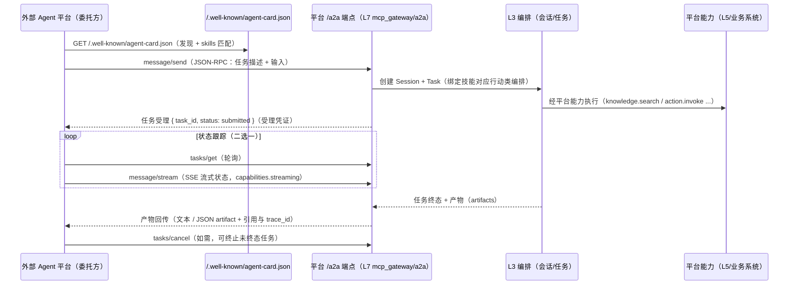

# 04 - A2A 协议（Agent 间发现与任务委托）

> 状态：v0.1 | 日期：2026-09-26 | 上游依据：[MCP/MCP网关设计 §8](../MCP/MCP网关设计.md)（Agent Card 发布与行动类映射的权威上游）、[architecture/01-总体架构与分层 §3.3](../architecture/01-总体架构与分层.md)（协议栈：A2A v1.0 落点 L7 `mcp_gateway/a2a`）、[architecture/01 §7](../architecture/01-总体架构与分层.md)（M5 里程碑）、[Agent/Agent服务设计 §3.2](../Agent/Agent服务设计.md)（openclaw / hermes 经 A2A/MCP 标准接入评估）
>
> 本篇是对外发布的 A2A 设计契约。**当前为设计契约（v0.1），M5 里程碑才启用实现**；与 MCP 出口的分工：MCP = 工具调用面（能力粒度），A2A = 任务委托面（agent 粒度）。

## 1. 定位

- **协议**：A2A（Agent-to-Agent）**v1.0**（Linux Foundation 治理），JSON-RPC 2.0 over HTTP，用于**异构 Agent 平台之间**的能力发现与任务委托；
- **平台角色（双向）**：
  - **被委托方**：平台以 MCP Server 出口能力（03 篇）之外，同时发布 Agent Card，供外部 Agent 平台按「委托一个任务」的粒度（而非单工具调用）使用平台；
  - **委托方**：平台内 agent 工具可经 A2A 委托任务给外部 Agent 平台（M5+，openclaw / hermes 不自研适配器、优先标准协议接入的裁决依据，Agent §3.2）；
- **与 MCP 的边界**：一次工具调用（tools/call）走 MCP；一次「把整件事交给对方 agent 做、跟踪状态、收产物」走 A2A 任务。

## 2. Agent Card 发布

- 发布地址：`/.well-known/agent-card.json`（A2A v1.0 惯例，无需鉴权的发现入口）；任务端点：`/a2a`（JSON-RPC over HTTP POST）；
- **平台 MCP Server 与 A2A 同源发布**：Card 由 `infra/mcp_gateway/a2a/card.py` 生成，skills 来自本体行动类（§3），与 `mcp_tools` 注册表同源——工具与技能两个视图不会各自漂移（锚点 §3.3：A2A 落点 `mcp_gateway/a2a`）；
- 卡片字段表（核心字段，A2A v1.0）：

| 字段 | 类型 | 说明 |
| ---- | ---- | ---- |
| `name` / `description` | string | 平台名与能力描述 |
| `url` | string | 任务端点（如 `https://onto.example.cn/a2a`） |
| `protocolVersion` | string | `1.0` |
| `capabilities` | object | `streaming`（SSE 流式状态）、`pushNotifications`、`stateTransitionHistory` 等能力开关 |
| `skills[]` | array | 技能条目，由本体行动类映射（§3） |
| `provider` | object | 提供方（企业 / 部门） |
| `authentication` | object | 认证方案声明（§5） |
| `defaultInputModes` / `defaultOutputModes` | string[] | 默认 `["text/plain"]`，可含 `application/json` |
| 签名卡 | — | v1.0 头号特性：卡片签名防篡改（**待办**，MCP 篇 §11） |

卡片示例（MCP 篇 §8 原样）：

```json
{ "name": "ontology-agent", "protocolVersion": "1.0",
  "url": "https://onto.example.cn/a2a",
  "skills": [
    { "id": "cancel-order", "name": "取消订单",
      "description": "取消指定订单并触发 OrderCancelled 事件（源自行动类 CancelOrder）",
      "tags": ["supply"] } ] }
```

完整字段示例（含能力与认证声明；skills 由本体发布流水线自动生成，非手写）：

```json
{ "name": "ontology-agent",
  "description": "以本体为语义基座的智能体平台：知识检索、本体推理、记忆与业务行动闭环",
  "protocolVersion": "1.0",
  "url": "https://onto.example.cn/a2a",
  "capabilities": { "streaming": true, "pushNotifications": false, "stateTransitionHistory": true },
  "defaultInputModes": ["text/plain", "application/json"],
  "defaultOutputModes": ["text/plain", "application/json"],
  "skills": [
    { "id": "create-outage-ticket", "name": "创建停电检修工单",
      "description": "为指定馈线创建停电检修/抢修工单（源自行动类 CreateOutageTicket，触发事件类 TicketCreated）",
      "tags": ["power"] },
    { "id": "cancel-order", "name": "取消订单",
      "description": "取消指定订单并触发 OrderCancelled 事件（源自行动类 CancelOrder）",
      "tags": ["supply"] } ],
  "provider": { "organization": "ontology-agent", "url": "https://onto.example.cn" },
  "authentication": { "schemes": ["oauth2"] } }
```

## 3. 本体行动类 → skills[] 映射规则

落地研究整理 02 §5 待办第 3 条（MCP 篇 §8 为权威）：

| Agent Card 字段 | 来源（OB2 本体） |
| ---- | ---- |
| `skills[].id` | 行动类本地名 slug（如 `CancelOrder` → `cancel-order`） |
| `skills[].name` | 行动类 label（rdfs:label） |
| `skills[].description` | 行动类 definition（含触发的事件类说明） |
| `skills[].tags` | 所属业务域（命名空间 / 领域标签，如 `supply`、`power`） |

同步规则：**行动类增删随本体发布自动同步卡片**——changeset publish 流水线（01 篇 §6.4）在版本发布后触发卡片重生成；行动类 `deprecated` 时对应 skill 下线（与工具语义标注联动同源，Skills 篇 §8）。

## 4. 任务委托流



- 委托的消息体（A2A `Message`）映射为平台一次会话的首条用户消息；平台按 Card skill 对应的行动类编排（检索 → 校验 → 生成 → 回写）；
- 状态模型：A2A Task 状态（submitted / working / input-required / completed / failed / canceled）由平台 Run/Task 状态机映射：`queued|running → working`、`waiting_tool（人工审批）→ input-required`、`completed → completed`、`failed|timeout → failed`、`cancelled → canceled`；
- 产物（artifacts）回传附引用（citations）与 trace_id，与 SSE 事件流同源（02 篇）。

方法与平台行为映射（A2A v1.0 方法集）：

| A2A 方法 | 平台行为 |
| ---- | ---- |
| `message/send` | 创建 Session + Task，消息入队，返回受理（task_id + status=submitted，受理凭证语义） |
| `message/stream` | 同上，但以 SSE 流式返回任务状态与中间产物（复用 02 篇帧格式语义） |
| `tasks/get` | 查询任务状态、历史消息与 artifacts |
| `tasks/cancel` | 取消未终态任务（映射 `POST /tasks/{task_id}/cancel`，01 篇 §5.2） |
| `tasks/resubscribe` | 断线后重订阅流式任务（Last-Event-ID 语义与 02 篇 §4 一致） |

报文示例：

```json
--> POST /a2a   （message/send，委托创建停电工单）
{ "jsonrpc": "2.0", "id": 11, "method": "message/send",
  "params": { "message": { "role": "user",
      "parts": [{ "kind": "text", "text": "为城东馈线 F12 创建抢修工单，优先级高" }],
      "skillId": "create-outage-ticket" } } }

<-- { "jsonrpc": "2.0", "id": 11, "result": {
        "task": { "id": "t_01Q7", "status": { "state": "submitted" },
                  "createdAt": "2026-09-26T08:31:02Z" } } }

--> POST /a2a   （tasks/get，轮询状态）
{ "jsonrpc": "2.0", "id": 12, "method": "tasks/get", "params": { "taskId": "t_01Q7" } }

<-- { "jsonrpc": "2.0", "id": 12, "result": {
        "task": { "id": "t_01Q7", "status": { "state": "completed" },
                  "artifacts": [{ "artifactId": "a_01",
                    "parts": [{ "kind": "text", "text": "工单 GD-2026-0918 已创建…" }],
                    "metadata": { "citations": ["d_01/c_017"], "trace_id": "req_01J9X7" } }] } } }
```

## 5. 认证

| 项 | 契约 |
| ---- | ---- |
| 方案 | **OAuth 2.0 / OIDC 委托**：委托方按 Card `authentication` 字段声明的方案取令牌，`Authorization: Bearer` 访问 `/a2a` |
| 平台侧映射 | 令牌换取平台侧调用身份（对应 08 篇 §2.0 机器通道：API Key / OAuth2），绑定 tenant 与 scopes |
| 授权粒度 | 委托任务可触达的平台能力 = skill 对应行动类的 `required_scopes`（`action:invoke` + 业务域 scope，03 篇 §3.7）∩ 委托方被授予的 scopes |
| 高风险动作 | 同样走 confirm_token 二次确认（03 篇 §7）；A2A `input-required` 状态承载人工审批等待 |
| 审计 | 每次委托 / 状态查询 / 取消留痕（调用方、task_id、trace_id，`mcp_invocations.caller_type=external` 同款台账） |

## 6. 与平台内部关系

- **里程碑**：A2A 属 **M5 平台化扩展**（锚点 §7：插件市场 + 沙箱、A2A、pi/nanobot 适配器……）——**本篇当前为设计契约，无实现承诺**；M4 只交付 MCP 出口（03 篇）；
- **代码落点**：`services/infra/mcp_gateway/a2a/`（L7，与 MCP Server 同网关进程，复用 CapabilityRegistry 与鉴权 / 限流 / 审计中间件）；
- **对内复用**：A2A 任务委托进入平台后与 REST 发消息同一条编排链路（chat_orchestrator / agent_runtime），不另建执行通路；
- **openclaw / hermes 接入**：作为 A2A 委托方接入平台是备选路径（不自研适配器的裁决，Agent §3.2），M5 决策。

## 7. 待办与开放问题

- [ ] 签名 Agent Card 落地与密钥管理（A2A v1.0 头号特性，MCP 篇 §11 待办沿用）；
- [ ] `/a2a` 端点与网关 `/api/v1` 的关系（同进程不同前缀 or 独立监听）——随 M5 实现裁决；
- [ ] A2A Task 状态 ↔ 平台 Run/Task 状态机映射表评审（§4 映射为本篇补充，待回填 Agent 篇 §2.1）；
- [ ] pushNotifications（webhook 回调）通道的鉴权与重试契约（capabilities 声明后须补）；
- [ ] 委托方（平台作为 A2A client）侧的 Card 信任评估：签名验证 + 首次接入审批流；
- [ ] 与 A2A 官方 schema 的字段级对齐验证（v1.0 规范演进跟踪）。
