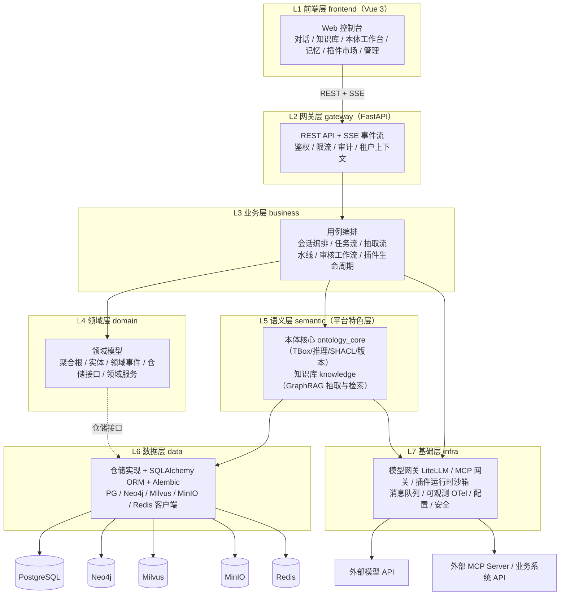
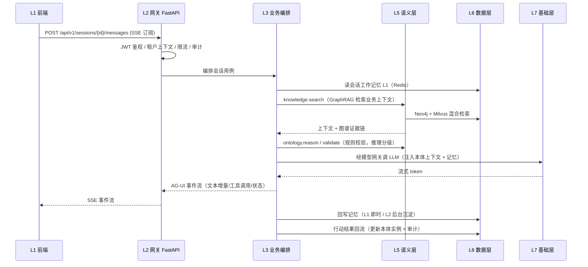

# 01 - 总体架构与分层（平台架构锚点文档）

> 状态：v1.0 定稿 | 定稿日期：2026-09-26
> 上游依据：[研究整理/00-平台总体架构](../研究整理/00-平台总体架构.md)、[02-Agent服务与协议](../研究整理/02-Agent服务与协议.md)、[03-知识库与本体核心](../研究整理/03-知识库与本体核心.md)、[04-多层记忆](../研究整理/04-多层记忆.md)、[05-MCP平台能力](../研究整理/05-MCP平台能力.md)、[06-插件与工具集](../研究整理/06-插件与工具集.md)
>
> **本文是全平台架构的唯一锚点（Single Source of Truth）**：分层名称、模块地图、目录路径、技术选型均以本文为准。
> 其他设计文档、代码目录 README 若与本文冲突，以本文为准；要改架构先改本文。

---

## 1. 架构总览

平台以**本体为语义基座**（见研究整理 00），工程上采用**前后端分离 + 模块化单体后端**的分层架构：

- 前后端分离：前端独立工程，经 REST + SSE 与后端通信；
- 后端起步为**模块化单体**（Modular Monolith）：一个 FastAPI 应用，内部按层严格分包，模块边界清晰，后续可按边界拆分为独立服务（Agent 服务 / 语义服务 / MCP 网关优先拆出）；
- 依赖严格单向：**上层只能依赖下层，禁止逆向依赖**（例外用接口倒置，见 §3.4）。



### 1.1 用户指定的分层 → 平台落层的对应与调整说明

| 用户原始表述 | 平台分层 | 调整说明 |
| ---- | ---- | ---- |
| （未提） | **L1 前端层** | 补充：前后端分离，前端独立工程 |
| 网关层 FastAPI | **L2 网关层** | FastAPI 承担：路由 + 中间件（鉴权/限流/审计）+ SSE 事件流出口 |
| 业务层 | **L3 业务层** | 用例编排（application services），不含业务规则本身 |
| 领域层 | **L4 领域层** | 核心域模型与规则，纯 Python、不依赖任何框架 |
| 语义层 | **L5 语义层** | 平台特色层：本体核心 + 知识库（GraphRAG）。位置从"领域层之上"调整为"领域层之下、数据层之上"——它本质是**被业务层调用的能力层**，且自身要落存储、调模型 |
| 数据层 ORM + pg/milvus/minio/neo4j | **L6 数据层** | 按用户指定五存储，另补 **Redis**（会话热数据/缓存/限流/队列） |
| 基础层 | **L7 基础层** | 收拢横切能力：模型网关、MCP 网关、插件运行时、可观测、配置、安全 |

---

## 2. 各层职责与禁令

| 层 | 职责 | 允许依赖 | 禁止 |
| ---- | ---- | ---- | ---- |
| L1 前端层 | 页面渲染、交互、状态管理、SSE 消费、图谱可视化 | 仅经网关 API 访问后端 | 直连数据库；直连模型 API；绕过网关调内部服务 |
| L2 网关层 | 协议适配（REST/SSE）、认证鉴权、限流、审计、租户上下文注入、DTO 校验（pydantic） | L3 | 写业务规则；直接访问存储 |
| L3 业务层 | 用例编排、事务边界、跨模块流程（抽取流水线、审核工作流）、领域事件发布 | L4（含 ports 接口）、L5、L7（仅经 L4 ports 接口调用） | 实现 HTTP 细节；写 SQL；把 L4 不变式抄一份进编排器 |
| L4 领域层 | 聚合根/实体/值对象、业务不变式、领域事件、**仓储接口**（仅接口）、领域服务接口 | 无（纯 Python + pydantic） | import FastAPI/SQLAlchemy/任何存储客户端 |
| L5 语义层 | 本体核心（TBox、推理、SHACL、版本治理）、知识库（抽取、GraphRAG 检索）、术语对齐 | L6、L7、L4 接口 | 处理会话/权限等非语义事务 |
| L6 数据层 | 仓储接口实现、ORM 模型、迁移、多存储引擎客户端、Unit of Work | L7 | 包含业务规则 |
| L7 基础层 | 模型网关、MCP 网关、插件运行时/沙箱、消息、可观测、配置、密钥 | 外部系统 | 依赖 L1~L6 任何模块（依赖倒置见 §3.4） |

---

## 3. 关键架构决策（ADR 摘要）

### 3.1 技术栈总表

| 端 | 选型 | 理由 |
| ---- | ---- | ---- |
| 前端框架 | **React + TypeScript + Tailwind + shadcn/ui**（2026-09-26 混合终裁；Apple 液态玻璃设计系统=docs/架构设计/03 + frontend/src/design-system 样式库；信息架构/页面清单沿用 docs/frontend/02，栈无关） | 并行线已有 15 页画板/组件库/样式库成品，直接复用 |
| UI 组件库 | **Element Plus**（主题定制） | 组件全、中文文档、CSS 变量主题化容易，配自研设计令牌 |
| 图可视化 | **AntV G6 5**（图谱浏览）+ **AntV X6**（本体建模画布） | 图编辑/图分析场景最成熟 |
| 后端框架 | **FastAPI**（Python ≥3.11，本地 3.13） | 用户指定；异步原生、SSE 友好、pydantic v2 校验、OpenAPI 免费得 |
| ORM | **SQLAlchemy 2.0 + Alembic** | 异步支持、类型提示好、迁移标准 |
| 模型网关 | **LiteLLM** | 研究整理 02 结论：生产级首选，多提供商/预算/兜底/成本追踪 |
| MCP | **FastMCP**（Python，与后端同栈） | 研究整理 05 待办结论：MCP Server 与 Agent 服务同栈 |
| 图库 | **Neo4j**（社区版起步，n10s 导入本体） | 研究整理 03 结论：GraphRAG/Agent 生态集成最多 |
| 向量库 | **Milvus**（用户指定） | 文本切片/社区摘要/记忆嵌入的语义检索 |
| 关系库 | **PostgreSQL** | 业务元数据、工单、版本、审计、记忆底座 |
| 对象存储 | **MinIO** | 原始文档、图片、插件包、本体制品 |
| 缓存/队列 | **Redis** | 会话热数据、限流、轻量任务队列（重任务后续引 broker 再议） |
| 部署 | **Docker Compose 起步 → K8s** | 五存储 + 后端 + 前端一键起 |

### 3.2 存储职责划分（什么数据放哪里）

| 存储 | 放什么 | 不放什么 |
| ---- | ---- | ---- |
| PostgreSQL | 用户/租户/权限、会话与任务元数据、审核工单、本体版本与变更单、插件/工具注册元数据、审计日志、记忆 L1/L2 结构化底座 | 大文本原文（进 MinIO，PG 只存指针） |
| Neo4j | ABox 知识图谱（实体/关系/社区）、本体 TBox 的属性图物化（经 n10s）、组织级记忆 L3 时序图 | 权威 TBox（权威在 rdflib/文件制品，Neo4j 是物化视图） |
| Milvus | 文档切片向量、GraphRAG 社区摘要向量、记忆嵌入 | 结构化查询（那是 PG/Neo4j 的事） |
| MinIO | 原始文档（Word/PDF/图片）、抽取中间产物、插件包、OWL/Turtle 本体文件制品 | 需要事务/关联查询的数据 |
| Redis | 会话工作记忆（L1 热数据）、分布式锁、限流计数、任务队列 | 任何需要持久审计的数据（落 PG） |

> OWL 严格推理：起步用 **rdflib + pySHACL**（轻量方案，研究整理 03 结论）；需要重描述逻辑推理时外挂 GraphDB / Apache Jena Fuseki，结果物化回 Neo4j。**Neo4j 不是推理机**，一致性校验必须走语义层的推理引擎。

**部署分档**（2026-09-26 评审裁决：默认档必须让个人/小团队跑得起来，见[评审记录](./评审-2026-09-26-多专家研讨与行业痛点批判.md)）：

- **lite 档（默认）**：PostgreSQL（含 pgvector）+ Redis + MinIO。语义层功能等效降级：图遍历用 PG 递归 CTE 替代、向量检索用 pgvector 替代 Milvus——功能验收标准不降，性能档不同；
- **full 档（生产/规模化）**：PG + Neo4j + Milvus + MinIO + Redis 全量；
- ⚠ **Neo4j 社区版（GPLv3）不支持多 database 与 RBAC**：多租户只能走属性级隔离，商用分发边界需法务确认；出现「多库隔离/企业特性」需求即触发企业版采购或迁 NebulaGraph/TuGraph 的评估点（见 §7 拆分触发条件）。

### 3.3 协议栈（研究整理 02 结论落地）

| 方向 | 协议 | 落点 |
| ---- | ---- | ---- |
| 前端 ↔ 网关 | REST（管理/CRUD）+ **SSE 事件流**（对话与任务，AG-UI 16 事件语义为蓝本） | L2 `routers/` + `sse/` |
| 平台 ↔ 模型 | OpenAI Chat Completions 兼容（LiteLLM 统一），Claude 保留直连通道吃 prompt caching | L7 `llm/` |
| 平台 ↔ 工具/外部 Agent | **MCP**（远程 Streamable HTTP，本地 stdio），兼容 2025-06-18 / 2025-11-25 协商 | L7 `mcp_gateway/` |
| 平台 ↔ 外部 Agent 平台 | **A2A v1.0**（Agent Card 发现 + 任务委托） | L7 `mcp_gateway/a2a` |
| agent 工具托管 | 平台托管运行时插槽（下发任务/回收事件流/注入平台工具） | L3 `agent_runtime` + docs/Agent |

### 3.4 依赖倒置的三处例外（唯一允许的"向上"，2026-09-26 验收评审修正标题）

1. **仓储接口**：L4 定义接口，L6 实现——L4 永不 import L6；
2. **MCP 能力注册**：L7 的 MCP 网关要暴露语义层/业务层能力，但 L7 禁止依赖上层。做法：L7 定义 `CapabilityProvider` 协议，L3/L5 启动时把能力实现**注册**进网关的注册表。网关只认协议，不认实现。
3. **技术能力端口**（2026-09-26 评审增补）：L3/L5 对 L7 的技术调用（模型、工具执行、检索、记忆存储）一律经 `domain/ports/` 定义的接口（`ModelPort` / `ToolPort` / `KnowledgeRetriever` / `MemoryStore`），由 L5/L7 提供实现——更换模型供应商或 MCP 执行通道时业务代码零改动。业务裁决类领域服务（如 OntologyGate）则在 `domain/services/`，与端口分开（见 04 篇 §5）。

### 3.5 一次完整请求链路（对话示例）



核心闭环（研究整理 00 §2.2）在各层的落点：**知识感知**=L5 检索，**推理决策**=L5 推理 + L7 模型，**执行反馈**=L7 MCP 网关调业务系统，**知识更新**=L6/L5 回写 + L3 审核工作流门禁。

---

## 4. Monorepo 目录结构（定稿）

```
ontology-agent-mian/
├── frontend/                      # L1 前端工程（Vue 3 + TS + Vite，本期先设计后编码）
│   └── README.md                  # 前端工程 spec（技术栈/目录/规范）
├── services/                      # L2~L7 后端（模块化单体；⚠ 目录名建议尽早改名 services/，见 §7）
│   ├── README.md
│   ├── gateway/                   # L2 网关层
│   ├── business/                  # L3 业务层
│   ├── domain/                    # L4 领域层
│   ├── semantic/                  # L5 语义层（ontology_core + knowledge）
│   ├── data/                      # L6 数据层
│   └── infra/                     # L7 基础层
├── cli/                           # 平台 CLI（开发者/运维入口，调网关 API）
├── deploy/                        # docker-compose、初始化脚本、（后续）k8s
├── docs/                          # 全部设计文档
│   ├── README.md                  # 文档总索引
│   ├── architecture/              # ★ 系统架构（本目录）
│   ├── frontend/                  # ★ 前端设计（主题/页面/工程）
│   ├── Agent/                    # Agent 服务设计（⚠ 拼写建议改 Agent/）
│   ├── ontology/                  # 本体核心设计
│   ├── OntRAG/                   # 知识库 GraphRAG 设计（⚠ 拼写建议改 OntRAG/）
│   ├── memory/                   # 多层记忆设计（⚠ 拼写建议改 memory/）
│   ├── MCP/                       # MCP 网关设计
│   ├── Skills/                    # 技能与插件设计
│   ├── Sandbox/                   # 沙箱与执行环境设计（模块 13）
│   ├── cli/                       # CLI 设计
│   ├── Dsec/                      # DSec 论文研究（已有成果）
│   ├── 研究整理/                   # 00~06 调研结论（设计文档的上游依据）
│   ├── 研究资料/                   # 原始研究资料（PDF/笔记）
│   └── 代办任务/                   # 任务清单
├── tools/                         # 研究性工具（jev-local 本地 GLiNER、onto-train 等，不入平台运行时）
├── resrch-pj/                      # 研究性子项目（DSec-demo、JEV 归档），不入平台运行时
├── tests/                         # 跨层集成测试（各层单测在各层包内）
├── main.py                        # 临时入口（后续改为 uvicorn 启动 gateway.app）
└── requirements.txt
```

**后端各层内部分包**（模块轴 × 层轴）：

```
services/
├── gateway/            # L2
│   ├── app.py          # FastAPI 应用工厂、生命周期
│   ├── deps.py         # 依赖注入（当前用户/租户/会话）
│   ├── middlewares/    # auth / ratelimit / audit / tenant / logging
│   ├── schemas/        # pydantic DTO（请求/响应，与领域模型严格分离）
│   ├── sse/            # AG-UI 蓝本事件流编码器
│   └── routers/        # agents / sessions / ontology / kb / memory / plugins / mcp / admin
├── business/           # L3
│   ├── chat_orchestrator.py    # 对话编排（检索→校验→生成→回写）
│   ├── agent_runtime/          # agent 工具托管运行时插槽
│   ├── kb_pipeline/            # 抽取流水线（七步，见 docs/OntRAG）
│   ├── review_workflow/        # 人工终审工作流（候选非成品门禁，横切）
│   ├── memory_service/         # 记忆读写/沉淀编排
│   ├── plugin_lifecycle/       # 插件上架审核/启停/升级
│   └── events/                 # 领域事件发布
├── domain/             # L4（纯 Python，零框架依赖）
│   ├── model/          # 聚合根：agent / session / task / ontology / document / memory / plugin / tool / review
│   ├── repo/           # 仓储接口（Protocol）
│   ├── events/         # 领域事件定义
│   └── services/       # 领域服务接口（本体校验门禁等）
├── semantic/           # L5
│   ├── ontology_core/  # tbox / reasoning / shacl / versioning / align（见 docs/ontology）
│   └── knowledge/      # extract / graphrag / retrieve（见 docs/OntRAG）
├── data/               # L6
│   ├── orm/            # SQLAlchemy 模型
│   ├── repo_impl/      # 仓储实现
│   ├── clients/        # pg / neo4j / milvus / minio / redis
│   ├── migrations/     # Alembic
│   └── uow.py          # Unit of Work
└── infra/              # L7
    ├── llm/            # LiteLLM 网关封装、prompt caching 策略
    ├── mcp_gateway/    # server 出口 / client 接入 / registry / a2a
    ├── plugin_runtime/ # 插件守护进程（生命周期；沙箱供给统一走 sandbox_runtime）
    ├── sandbox_runtime/ # 统一沙箱运行时（会话/插件/流水线/评测训练，docs/Sandbox）
    ├── msg/            # 队列封装
    ├── observability/  # OTel traces/metrics/logs
    ├── config/         # 配置加载（环境分层）
    └── security/       # 密钥、scope、ACL
```

---

## 5. 服务模块地图（模块 × 层 × 文档 × 上游研究）

| # | 模块 | 主要落层（代码路径） | 设计文档 | 上游研究 |
| ---- | ---- | ---- | ---- | ---- |
| 1 | Agent 服务（托管运行时/会话/任务） | gateway/routers/agents、business/chat_orchestrator、business/agent_runtime、business/agent_runtime/kernel/（内核/能力层划分见 [docs/Agent/02](../Agent/02-Agent内核与能力层划分设计.md)，2026-09-26 07合入）、domain/model/{agent,session,task} | [docs/Agent](../Agent/README.md) | 研究整理 01、02 |
| 2 | 本体核心（TBox/推理/SHACL/版本） | semantic/ontology_core、domain/model/ontology | [docs/ontology](../ontology/README.md) | 研究整理 03、研究资料 GB/T 48000.3、本地建模 |
| 3 | 知识库 graphrag-ontology | semantic/knowledge、business/kb_pipeline | [docs/OntRAG](../OntRAG/README.md) | 研究整理 03 |
| 4 | 多层记忆 | business/memory_service、domain/model/memory、data（Redis/PG/Milvus/Neo4j） | [docs/memory](../memory/README.md) | 研究整理 04 |
| 5 | MCP 网关 | infra/mcp_gateway | [docs/MCP](../MCP/README.md) | 研究整理 05 |
| 6 | 插件市场 + 工具集 + 技能 | business/plugin_lifecycle、domain/model/{plugin,tool}、infra/plugin_runtime | [docs/Skills](../Skills/README.md) | 研究整理 06 |
| 7 | 模型网关 | infra/llm | [docs/architecture/07](./07-基础层设计.md) | 研究整理 02 |
| 8 | 审核工作流（人工终审门禁） | business/review_workflow、domain/model/review | [docs/architecture/08](./08-横切关注点与工程规范.md) | 研究整理 03（四大国标底线） |
| 9 | 租户/权限/审计 | gateway/middlewares、infra/security | [docs/architecture/08](./08-横切关注点与工程规范.md) | 研究整理 05（安全红线） |
| 10 | CLI | cli/ | [docs/cli](../cli/README.md) | — |
| 11 | 前端控制台 | frontend/ | [docs/frontend](../frontend/README.md) | — |
| 12 | 业务回写（writeback：回写契约/幂等/对账/补偿，评审后升为一等模块） | business/action_dispatcher、infra/mcp_gateway（action 通道） | [docs/MCP/业务回写设计](../MCP/业务回写设计.md) | 研究整理 05 §4 |
| 13 | 沙箱与执行环境（agent 会话底座/插件隔离/评测训练环境，2026-09-26 升格） | business/sandbox_service、domain/model/sandbox、infra/sandbox_runtime | [docs/Sandbox](../Sandbox/README.md) | DSec 技术报告、研究整理 07 §7 |
| 14 | 平台自进化 RSI（自改进闭环：双轨触发/五类白名单/三级门禁/晋级灰度，**M5+ 启动**，2026-09-26 落档） | business/rsi_service、domain/model/rsi | [docs/architecture/09](./09-平台自进化RSI设计.md) | 旧稿 21 合入（2026-09-26） |

---

## 6. 横切约束（全层强制）

1. **多租户**：所有数据带 `tenant_id`；仓储层强制租户过滤；Redis key / Milvus collection / Neo4j 按 tenant 隔离命名。
2. **权限**：JWT + RBAC + 声明式 scope；MCP `annotations` 仅作 UI 提示，**不作授权依据**（研究整理 05 安全红线）。
3. **审计**：写操作与工具调用全留痕（谁、何时、参数、结果、耗时）。
4. **推理分级**（平台宪法，研究整理 00）：确定性强的高频逻辑走规则引擎/SHACL；低频复杂语义才走 LLM；LLM 输出必须过规则校验。
5. **候选非成品**：LLM 产物（候选本体/实例/记忆/插件）一律进审核工作流，人工终审后才能成为权威数据。
6. **文档规范（2026-09-26 评审减负）**：每个目录必须有 `README.md`（文档目录=索引；代码目录=模块 spec 六段式，**随开发随更，不要求前置全量编写**）；**锚点只锁三类不变量——层名与依赖规则、顶层目录路径、存储与协议选型**，其余细节下放各分篇；分篇之间冲突时以更具体的模块文档为准，并回改锚点引用。
7. **可观测**：统一 trace_id 贯穿 L1→L7；每次 LLM/MCP/工具调用记录成本与延迟。
8. **治理档位**（2026-09-26 评审增补）：审核门禁强度按租户治理档位分级 `governance_tier ∈ {solo, team, enterprise}`——solo：提交人即审批人（全程审计留痕，高置信度可自动通过、可回滚）；team：单审批人；enterprise：双负责人 + 四眼原则。档位定义与权限矩阵的权威在 [08 篇](./08-横切关注点与工程规范.md)；「候选非成品」底线三档都不破——自动通过必须留痕、可回滚、可追溯。
9. **评估驱动**（2026-09-26 评审增补）：检索质量（golden QA 集，按检索模式分层）、Agent 任务成功率、抽取精确率必须有持续评估基准；任何模型/本体/检索参数变更强制回归（见 08 篇 §7）。没有度量就没有优化。

---

## 7. 演进路线与待办

| 里程碑 | 内容 | 出口条件（验收） |
| ---- | ---- | ---- |
| M0 骨架 | 目录 + **核心 README spec（仅 gateway/business 两份前置验收，其余随开发补）** + docker-compose **lite 档**（PG+Redis+MinIO） | compose up 全绿；CI 升 Python 3.11+ |
| M1 网关+数据 | FastAPI 骨架、鉴权/租户/审计中间件、PG ORM + 迁移（**第一批表**：租户/用户/会话/任务/文档/本体版本，其余分期）、一条实体走通全层 | 一条实体从路由到 PG 全层贯通 |
| M2 语义层 wedge | **种子本体（电力停电分析精简版）** + 本体 CRUD + SHACL + **向量基线检索（默认 LazyGraphRAG/向量+BM25，完整 GraphRAG 索引按试点 ROI 开关）** + 抽取流水线最小版 | 建模→抽取→检索 demo 跑通；**PoC ①②③ 完成并冻结结论**；任务本体九类落 Turtle+SHACL；门禁投影 PoC（focus-node<10ms 目标，即 PoC⑥）通过（2026-09-26 07合入） |
| M3 Agent+记忆 | 对话编排（SSE **主干波事件 11 个**：RUN/TEXT/TOOL 三族 + RETRIEVAL_EVIDENCE + TOOL_CALL_RESULT——2026-09-26 验收评审裁决提前入主干波（M3 出口要求「有引用」），分波权威表见 02 篇 §5）、LiteLLM 接入、适配器仅 **builtin + claude**、L1 + 结构化 L2 记忆 | 可对话、有记忆、有引用；**SSE 多副本验证通过**；**PoC ④⑤ 完成并裁决** |
| M4 MCP+回写 | MCP Server 出口（含 action.invoke）+ 外部 MCP 接入 + **业务回写契约与首个连接器（电力工单 Mock）** + Outbox 引入 | 外部 Agent 经 MCP 调平台能力；回写幂等/对账/补偿演练通过；任务以 Task 实例装载（含装载确认）、计划过三层校验、写回跨库一致可演示、漂移检测与崩溃恢复可演示、首轮计划通过率/修复轮数/门禁延迟实测数入验收报告（2026-09-26 07合入） |
| M5 平台化扩展 | 插件市场 + 沙箱、A2A、pi/nanobot 适配器、L3 记忆（Graphiti）、治理 enterprise 档、前端全量 | 按 docs/frontend 设计稿验收；治理三档全开；能力层四通道开放（L2 能力包市场，前置=出口白名单机制就绪）（2026-09-26 07合入） |

> 2026-09-26 评审裁决（依据：[评审记录](./评审-2026-09-26-多专家研讨与行业痛点批判.md) §5/§6）：范围按 **wedge 竖线**重排——先在**单租户、单行业场景**上打穿「建本体 → 抽取 → 检索 → MCP 出口 → 业务回写」一条线并拿到可演示、可收集反馈的成品，再横向铺平台能力。插件市场/A2A/沙箱/审计冷归档**延后不砍**。

**首个行业场景（钦定）**：电力配电网停电分析（研究整理 00 §4 行业案例）。**种子本体（20~50 类精简 OB2 模型）+ 样例数据集是 M2 出口条件**——平台不允许「空工作台冷启动」；抽取策略、回写连接器、检索评估集都以该场景为第一验收对象。

**PoC 出口条件**（对应里程碑不完成不放行；未 PoC 前相关设计段落标「待裁决」）：

| # | PoC | 裁决什么 | 出口里程碑 |
| ---- | ---- | ---- | ---- |
| ① | OWL 推理基准：rdflib+owlrl 在 1 万/10 万三元组的耗时与内存，对照外挂 Jena Fuseki | 推理 SLA 数字冻结；外挂触发阈值 | M2 |
| ② | 抽取置信度校准：金标集（≥500 条）标定 LLM 自报置信度校准曲线 | 人工终审阈值与抽样率；终审吞吐模型（条/人时） | M2 |
| ③ | 索引成本标定：LazyGraphRAG vs 完整 GraphRAG 的 token/时间 | 检索默认档；完整索引开关策略 | M2 |
| ④ | L2 记忆引擎：mem0 vs Graphiti（质量/延迟/成本 + Graphiti×Neo4j 社区版兼容确认） | L2/L3 引擎选型 | M3 |
| ⑤ | LLM structured-output 兼容矩阵：主模型 + 2 个 fallback 过 JSON Schema 抽取 | fallback 模型名单 | M3 |
| ⑥ | 重型本体基准（2026-09-26 增）：任务级 RDF 投影构建/focus-node 求值 P99、投影缓存命中率、增量物化等价性——设计见 [docs/ontology/02-重型本体优化设计](../ontology/02-重型本体优化设计.md) §8 | 投影/物化 SLA 冻结；PoC① 矩阵同步扩维 | M3 |

**模块级拆分触发条件**（模块化单体 → 独立服务；满足其一才拆，拆分序：MCP 网关 → 语义层 → Agent 服务）：

| 触发条件 | 度量 |
| ---- | ---- |
| 独立发布节奏 | 该模块发布频率 ≥ 3× 平台均值且互相阻塞 |
| 资源画像冲突 | 该模块 CPU/内存画像与主体显著异构（如推理批处理） |
| 故障隔离需求 | 该模块故障 30 天内 ≥ 2 次拖垮主链路 |
| 多副本/吞吐上限 | SSE 长连接数或推理吞吐超出单实例容量 |

**待办（按优先级）**：
- [x] ~~目录改名四件套~~（2026-09-26 已执行：services/、docs/Agent/、docs/memory/、docs/OntRAG/，56 文件引用同步，719 链接验证全绿）。
- [x] ~~架构路线裁决~~（2026-09-26 全量验收评审裁决：留本锚点，旧套整体归档至 `docs/archive/架构设计-React路线-2026-09/`（25 篇+设计稿+前端 CSS 资产），AGENTS.md 已重定向；B 类增量合入清单登记于 docs/代办任务/）。
- [x] ~~RSI 与模型部署篇已落档（M5+/随时）~~（2026-09-26：新增 [09-平台自进化RSI设计](./09-平台自进化RSI设计.md)——旧稿 21 栈无关核心合入，模块 14、M5+ 启动；新增 [ops/03-模型部署与推理服务](../ops/03-模型部署与推理服务.md)——单轨 Ollama 终裁落档并与旧稿 14 §9 vLLM 提案对账；两篇详待办见各篇 §10/§6）。
- [ ] CI（Gitee Go）Python 3.9 → 3.11+，并加前端构建阶段。
- [ ] OWL 推理引擎 PoC：rdflib+pySHACL vs 外挂 Jena Fuseki（研究整理 03 待办）。
- [ ] L2/L3 记忆引擎 PoC：mem0 vs Graphiti（研究整理 04 待办）。
