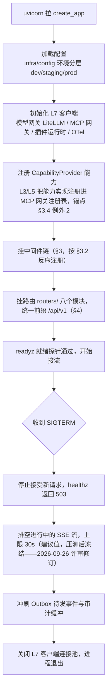

# 02 - 网关层设计（L2 gateway）

> 状态：v0.2（含 2026-09-26 评审修订） | 日期：2026-09-26 | 上游依据：[锚点](./01-总体架构与分层.md)、[研究整理/02](../研究整理/02-Agent服务与协议.md)、[研究整理/05](../研究整理/05-MCP平台能力.md)、[评审记录 2026-09-26](./评审-2026-09-26-多专家研讨与行业痛点批判.md)

---

## 1. 职责与边界

L2 网关层是平台唯一对外入口（L1 前端、CLI、外部系统一律经此访问）。锚点 §2 的职责展开为六项：

| 职责 | 落点 | 说明 |
| ---- | ---- | ---- |
| 协议适配 | `routers/` + `sse/` | REST（管理/CRUD）+ SSE 事件流（对话与任务）；SSE 以 AG-UI 16 事件语义为蓝本（研究整理 02 §3.3） |
| 认证鉴权 | `middlewares/auth.py` + `deps.py` | JWT 校验 + RBAC + 声明式 scope；MCP `annotations` 仅作 UI 提示，不作授权依据（研究整理 05 安全红线） |
| 限流 | `middlewares/ratelimit.py` | Redis 滑动窗口，按租户/用户/路由三维配额 |
| 审计 | `middlewares/audit.py` | 写操作与工具调用全留痕：谁、何时、参数、结果、耗时（锚点 §6.3） |
| 租户上下文 | `middlewares/tenant.py` | 从 JWT 提取 `tenant_id` 写入 contextvar，全链路透传 |
| DTO 校验 | `schemas/` | pydantic v2 请求/响应模型，与 L4 领域模型严格分离（§6） |

**禁令**（锚点 §2，违反即架构缺陷）：

- 不写业务规则——用例编排归 L3，业务不变式归 L4；网关只做协议转换与转发；
- 不直接访问任何存储（PG/Neo4j/Milvus/MinIO/Redis 客户端只存在于 L6/L7）、不拼 SQL、不 import SQLAlchemy；
- 不在路由/中间件里做领域判断（如"会话能否关闭"），一律调用 L3 用例；
- 除本层外不新增对外协议出口（MCP 出口归 L7 `mcp_gateway/`，锚点 §4）。

代码范围：`services/gateway/{app.py, deps.py, middlewares/, schemas/, sse/, routers/}`。

## 2. 应用工厂与生命周期

入口为应用工厂 `create_app()`，由 `uvicorn services.gateway.app:create_app` 启动。启动用 FastAPI `lifespan` 完成，任一步失败即拒绝启动（fail-fast）：



健康探针约定：`GET /api/v1/healthz`（liveness，不查依赖）、`GET /api/v1/readyz`（readiness，检查 PG/Redis/L7 客户端握手，任一不可用返回 503）。

## 3. 中间件链

**运行时顺序（请求方向，定稿不可调换）**：

CORS → RequestID/trace → JWT 认证 → 租户上下文 → 限流 → 审计日志 → 全局异常处理（最内层）

Starlette 的 `add_middleware` 后注册者先执行，故代码按相反顺序注册：

```python
# services/gateway/app.py —— 代码注册顺序（与运行顺序相反）
app.add_middleware(GlobalExceptionMiddleware)   # ⑦ 最内层
app.add_middleware(AuditLogMiddleware)          # ⑥
app.add_middleware(RateLimitMiddleware)         # ⑤
app.add_middleware(TenantContextMiddleware)     # ④
app.add_middleware(JWTAuthMiddleware)           # ③
app.add_middleware(RequestIDMiddleware)         # ②
app.add_middleware(CORSMiddleware)              # ① 最外层
```

各中间件规格（职责 / 配置项 / 失败行为）：

| # | 中间件 | 职责 | 关键配置项 | 失败行为 |
| ---- | ---- | ---- | ---- | ---- |
| ① | CORS | 预检与 CORS 响应头；置于最外层保证错误响应同样携带头 | `ALLOWED_ORIGINS`、`ALLOW_METHODS`、`ALLOW_HEADERS`、`EXPOSE_HEADERS=X-Request-ID,X-Trace-ID`、`MAX_AGE=600` | 非白名单 Origin 不附加 CORS 头（由浏览器拦截），服务端不中断处理 |
| ② | RequestID/trace | 取/生成 `X-Request-ID`，启动 OTel span，绑定结构化日志上下文（锚点 §6.7 trace_id 贯穿） | header 名、OTel `sample_ratio` | 永不失败（生成异常回退 uuid4） |
| ③ | JWT 认证 | RS256 验签、exp/iss/aud 校验；SSE 路由允许 `?access_token=` 兜底（EventSource 无法自定义 header） | `JWKS_URL`（缓存 5min）、`ISSUER`、`AUDIENCE`、匿名白名单：`/healthz`、`/readyz`、`/auth/login` | 401 + 1001/1002/1003，请求不进入下游 |
| ④ | 租户上下文 | 读 JWT `tenant_id` claim 写入 `TenantContext` contextvar；校验请求体/路径中的租户参数与 claim 一致 | 租户状态 Redis 缓存（TTL 60s） | 403 + 2003 TENANT_MISMATCH 或 2004 TENANT_DISABLED |
| ⑤ | 限流 | Redis 滑动窗口；维度 = 租户 + 用户 + 路由模板（按模板聚合，防路径参数打穿计数） | 用户 60 req/min、租户 600 req/min、SSE 并发 20 流/用户；支持按租户覆盖 | 429 + 2005 + `Retry-After`；Redis 不可用时 fail-open 放行并告警（可用性优先，写审计） |
| ⑥ | 审计日志 | 非读方法与工具调用记录：主体/时间/路由/参数摘要/结果码/耗时；内存缓冲异步批量落 PG | 读操作采样率（默认 1%）、缓冲大小 | 写失败不阻塞主流程（ERROR 日志 + 告警）；admin 写路由审计失败则 fail-closed 拒绝 |
| ⑦ | 全局异常处理 | 兜底更内层（路由、L3 以下）的未捕获异常并转统一错误体：领域异常映射 4xxx、依赖异常映射 5xxx、未知映射 5999 | 调试模式堆栈开关（prod 关闭） | 任何异常不再冒泡为裸 500 |

约定：③④⑤ 的拒绝响应与 ⑦ 的兜底响应共用同一个构造函数 `error_response()`（§7），保证错误体全局同构。

## 4. 路由清单

统一前缀 `/api/v1`；scope 命名 `{资源}:{动作}`；全部端点进 OpenAPI 并标注所需 scope（前端/CLI 据此生成客户端）。`routers/` 八个文件，每个模块的端点如下：

> **端点登记册（2026-09-26 裁决）**：本表为**代表性端点**；全量端点登记册的权威是 [docs/api/01-REST-API契约](../api/01-REST-API契约.md)（80 端点，含 ★ 补充项），本篇保留协议机制（认证/分页/错误码/SSE）的权威。两处不一致时：端点清单以 docs/api/01 为准，协议机制以本篇为准。

| 模块（routers/） | 方法 | 路径 | 用途 | 所需 scope |
| ---- | ---- | ---- | ---- | ---- |
| agents.py | POST | /agents | 创建 agent | agent:write |
| agents.py | GET | /agents | 列表（分页/按启用筛选） | agent:read |
| agents.py | GET | /agents/{agent_id} | 详情（模型配置/绑定工具） | agent:read |
| agents.py | PATCH | /agents/{agent_id} | 更新模型/提示词/温度等配置 | agent:write |
| agents.py | DELETE | /agents/{agent_id} | 删除（存在 running task 时 409） | agent:write |
| agents.py | PUT | /agents/{agent_id}/tools | 绑定/解绑工具 | agent:write |
| sessions.py | POST | /sessions | 创建会话（绑定 agent） | session:write |
| sessions.py | GET | /sessions | 当前用户会话列表 | session:read |
| sessions.py | GET | /sessions/{id} | 会话详情与状态 | session:read |
| sessions.py | POST | /sessions/{id}/close | 关闭会话（状态迁移：触发 L1 归档与 L2 沉淀；会话所有者可用。2026-09-26 裁决：状态动作用 POST，参照 OpenAI Threads 惯例） | session:write |
| sessions.py | DELETE | /sessions/{id} | 管理员软删已归档会话（清理语义，非状态迁移；参照 OpenAI `DELETE /v1/threads/{id}` 的删除语义） | session:admin |
| sessions.py | GET | /sessions/{id}/messages | 历史消息（分页） | session:read |
| sessions.py | POST | /sessions/{id}/messages | 发送消息，响应为 SSE 事件流（§5） | session:chat |
| sessions.py | GET | /sessions/{id}/events | SSE 订阅/断线重连（Last-Event-ID） | session:chat |
| sessions.py | POST | /sessions/{id}/cancel | 取消运行中任务 | session:write |
| ontology.py | POST | /ontologies | 创建本体（draft） | ontology:write |
| ontology.py | GET | /ontologies | 列表（含当前发布版本） | ontology:read |
| ontology.py | GET | /ontologies/{id} | 详情与版本历史（版本不可变） | ontology:read |
| ontology.py | POST | /ontologies/{id}/changesets | 新建变更单 | ontology:write |
| ontology.py | POST | /ontologies/{id}/changesets/{cid}/submit | 提交变更单进终审（2026-09-26 裁决：动词子资源与聚合方法一一对应，替代原 submit-review 单动词） | review:submit |
| ontology.py | POST | /ontologies/{id}/changesets/{cid}/approve | 终审通过（enterprise 档双负责人会签） | review:approve:ontology |
| ontology.py | POST | /ontologies/{id}/changesets/{cid}/reject | 驳回（必附理由） | review:approve:ontology |
| ontology.py | POST | /ontologies/{id}/changesets/{cid}/publish | 发布（聚合 `publish(gate_report, approvals)` 断言后推进 head_version） | ontology:publish |
| ontology.py | POST | /ontologies/{id}/changesets/{cid}/rollback | 回滚（生成逆向 changeset 重新发布） | ontology:publish |
| ontology.py | POST | /ontologies/{id}/validate | SHACL/一致性试校验 | ontology:read |
| kb.py | POST | /kb/documents | 登记文档（返回 MinIO 预签名上传地址） | kb:write |
| kb.py | GET | /kb/documents | 文档列表（含流水线状态） | kb:read |
| kb.py | GET | /kb/documents/{id} | 详情 | kb:read |
| kb.py | POST | /kb/documents/{id}/pipeline/start | 启动七步抽取流水线 | kb:write |
| kb.py | GET | /kb/documents/{id}/pipeline | 流水线进度与 checkpoint | kb:read |
| kb.py | POST | /kb/documents/{id}/pipeline/retry | 失败后从断点重跑 | kb:write |
| kb.py | POST | /kb/search | GraphRAG 检索（local/global/drift） | kb:read |
| memory.py | GET | /memory | 读记忆（按 layer/key 过滤） | memory:read |
| memory.py | POST | /memory/search | 语义检索（向量） | memory:read |
| memory.py | POST | /memory | 写入记忆（按层授权） | memory:write |
| memory.py | POST | /memory/facts/{id}/invalidate | 失效标记（2026-09-26 裁决：墓碑式软删替代 DELETE——「全程不物理删除、可审计回放」为平台底线，与 memory 篇对齐） | memory:write |
| memory.py | POST | /memory/consolidate | 触发 L1 到 L2 沉淀 | memory:write |
| memory.py | GET | /memory/context | 组装会话上下文记忆 | memory:read |
| plugins.py | GET | /plugins | 市场列表 | plugin:read |
| plugins.py | GET | /plugins/{id} | 详情（含版本树） | plugin:read |
| plugins.py | POST | /plugins | 上传插件包（验签后登记） | plugin:write |
| plugins.py | POST | /plugins/{id}/submit | 提交上架审核 | review:submit |
| plugins.py | POST | /plugins/{id}/install | 安装已发布版本 | plugin:install |
| plugins.py | POST | /plugins/{id}/enable | 启用 | plugin:admin |
| plugins.py | POST | /plugins/{id}/disable | 停用 | plugin:admin |
| mcp.py | GET | /mcp/servers | 外部 MCP Server 列表 | mcp:read |
| mcp.py | POST | /mcp/servers | 注册外部 Server（stdio/HTTP） | mcp:write |
| mcp.py | POST | /mcp/servers/{id}/refresh | 拉取 tools/list 更新工具清单 | mcp:write |
| mcp.py | GET | /mcp/servers/{id}/tools | 该 Server 的工具清单 | mcp:read |
| mcp.py | POST | /mcp/tools/{tool_id}/enable | 审核开启外部工具（默认不可信） | mcp:write |
| mcp.py | POST | /mcp/invocations | 经 L7 MCP 网关发起一次工具调用 | mcp:invoke |
| mcp.py | GET | /mcp/capabilities | 平台能力出口清单（CapabilityProvider 注册表视图） | mcp:read |
| admin.py | POST | /admin/tenants | 创建租户 | admin:write |
| admin.py | GET | /admin/audit-logs | 审计日志查询 | admin:read |
| admin.py | GET | /admin/reviews | 审核工单列表 | review:read |
| admin.py | POST | /admin/reviews/{id}/decision | 审批裁决（通过/驳回附理由） | review:approve |
| admin.py | GET | /admin/quota/{tenant_id} | 配额查询 | admin:read |
| admin.py | PUT | /admin/quota/{tenant_id} | 配额调整 | admin:write |
| admin.py | GET | /admin/stats | 平台统计（调用量/成本/延迟） | admin:read |

## 5. SSE 事件流设计

以 AG-UI 16 事件语义为蓝本（研究整理 02 §3.3），平台采用以下子集（未列事件暂不实现，留待前端阶段评估）：

> **2026-09-26 评审修订（SSE 事件分波）**：事件分两波交付——**M3 主干波**：`run_started / run_finished / run_error / text_message_start / text_message_delta / text_message_end / tool_call_start / tool_call_args / tool_call_end`（锚点 §7 M3「SSE 主干 8 事件」）；其余（TOOL_CALL_RESULT、STATE_*、MESSAGES_SNAPSHOT、RETRIEVAL_EVIDENCE、GATE_VERDICT 等平台扩展）为 **M4+ 扩展波**。两波帧格式不变、协议向前兼容：M3 网关不外发扩展波事件，前端对未知 event 名一律忽略即可，后补不改协议。锚点口径为「8 事件」，但 `tool_call_args` 在本表单列成行（`text_message_delta` 即本表 `TEXT_MESSAGE_CONTENT`），**主干波以表内实际行为准，为 9 行**（见下表「波次」列）。

| 事件名 | 触发时机 | data 载荷（JSON） | 波次 |
| ---- | ---- | ---- | ---- |
| RUN_STARTED | 编排器受理消息、task 置 running | `{run_id, session_id, task_id, agent_id}` | M3 主干 |
| TEXT_MESSAGE_START | 一条新助手消息开始输出 | `{message_id}` | M3 主干 |
| TEXT_MESSAGE_CONTENT | 每个文本增量 | `{message_id, delta}` | M3 主干 |
| TEXT_MESSAGE_END | 该消息输出完毕 | `{message_id, finish_reason}` | M3 主干 |
| TOOL_CALL_START | 编排器决定调用工具 | `{tool_call_id, tool_name}` | M3 主干 |
| TOOL_CALL_ARGS | 工具参数增量 | `{tool_call_id, delta}` | M3 主干 |
| TOOL_CALL_END | 参数收集完成、开始执行 | `{tool_call_id}` | M3 主干 |
| TOOL_CALL_RESULT | 工具执行完成 | `{tool_call_id, ok, summary, cost_ms}` | M4+ 扩展 |
| STATE_SNAPSHOT | 共享状态全量下发（重连/开始） | `{snapshot}` | M4+ 扩展 |
| STATE_DELTA | 共享状态增量（JSON Patch） | `{patch}` | M4+ 扩展 |
| MESSAGES_SNAPSHOT | 会话消息全量校正 | `{messages}` | M4+ 扩展 |
| RETRIEVAL_EVIDENCE | 检索完成（平台扩展事件） | `{chunks, graph_paths, degraded}` | M4+ 扩展 |
| GATE_VERDICT | 本体校验完成（平台扩展事件） | `{ok, violations, ontology_version}` | M4+ 扩展 |
| RUN_FINISHED | task 成功终态 | `{run_id, usage}` | M3 主干 |
| RUN_ERROR | task 失败终态 | `{run_id, code(平台错误码), message, retryable}` | M3 主干 |

帧格式（每帧以空行结尾）：

```
id: 1739
event: TEXT_MESSAGE_CONTENT
data: {"message_id":"m_01J9","delta":"本体的"}

```

- `id`：即该会话当前任务的 `task_events.seq`（先落库后推送，04 篇不变式；跨任务重连时 Redis Stream 回放窗口承担定位——2026-09-26 评审修复G 钦定唯一 id 源，消除「Redis INCR 自增序列」与 task_events.seq 的双源）；心跳为每 15s 一条注释帧 `: ping\n\n`（15s 为**建议值，压测后冻结**——2026-09-26 评审修订），防代理层空闲断连，不计入事件序列；
- **写入与推送分离（2026-09-26 评审修订·多副本无状态化）**：事件统一写入 Redis Stream `sse:{tenant_id}:{session_id}`（MAXLEN 1000、TTL 10min，均为建议值，压测后冻结）；SSE 推送**一律从 Redis Stream 消费后转发**，网关进程内不缓冲事件状态——**任意网关副本可服务任意会话**，会话不绑副本，水平扩容无需会话粘性（评审记录 §1 架构师 P1：推送绑进程内状态会锁死水平扩容）；
- **慢消费者背压（2026-09-26 痛点优化）**：每连接维护写缓冲，**上限默认 256KB（建议值，压测后冻结）**——客户端读得慢（挂起标签页/弱网）时事件在连接写缓冲堆积，无限等待即拖死 worker（长连接系统头号事故）；与上条「进程内不缓冲事件状态」不冲突（写缓冲是连接级传输缓冲，非会话事件状态）。处置**先告警后断开**：水位达上限 80% 先告警，达上限即由服务端主动断开该连接，客户端凭下条回放窗口重连补齐错过的帧（超出回放窗口按 4301 语义拉全量历史）——宁可断开重连，不让一个慢消费者占住 worker；水位指标 `sse_write_buffer_bytes`（gauge）入 [07 篇 §6 指标清单](./07-基础层设计.md)，断开计入 `sse_reconnect_total{reason="buffer_overflow"}`；
- 断线重连：客户端重连带 `Last-Event-ID` 头（或 `?last_event_id=`），由**任意副本**从 Stream 中该 id 之后回放历史帧，再无缝切实时消费；超出回放窗口返回错误码 4301 SSE_REPLAY_EXPIRED，客户端拉全量历史后重新订阅；
- **多副本出口条件（2026-09-26 评审升级：原「多副本方案挂起」作废）**：M3 出口含**双副本压测**——同一会话两个连接分别落在两个网关副本时，Last-Event-ID 跨副本断线重连正确、事件不重不漏；验收项见 §8（锚点 §7 M3「SSE 多副本验证通过」）；
- 响应头固定：`Content-Type: text/event-stream`、`Cache-Control: no-cache`、`X-Accel-Buffering: no`。
- **流尾完整性 sentinel（2026-09-26 P2）**：跨进程/代理转发以 `TEXT_MESSAGE_END`/`RUN_FINISHED` 为帧流完整性标记，消费侧收到流断但缺 sentinel 即告警 `stream_tail_lost_total`（防末 token 跨边界静默丢失）。

## 6. DTO 规范

- `schemas/` 与 L4 领域模型严格分离：DTO 只有数据与校验、无行为；领域模型不出现序列化别名等传输关注点；
- pydantic v2；统一 `model_config = ConfigDict(extra="forbid")`，未知字段一律拒绝；字段命名 snake_case 与 API JSON 一致；
- 转换函数 `to_domain() / from_domain()` 独立定义在 schema 同文件，路由层只与 DTO 打交道。

```python
# services/gateway/schemas/session.py
from datetime import datetime
from uuid import UUID
from pydantic import BaseModel, ConfigDict, Field

class ChatMessageRequest(BaseModel):
    model_config = ConfigDict(extra="forbid")
    content: str = Field(min_length=1, max_length=32000)
    agent_id: UUID | None = None      # 缺省用会话绑定的 agent

class MessageResponse(BaseModel):
    id: UUID
    role: str
    content: str
    created_at: datetime
```

请求失败示例（HTTP 422，错误码见 §7）：`{"code": 3001, "message": "参数校验失败", "detail": [{"field": "content", "issue": "String should have at least 1 character"}], "trace_id": "req_01J9X7"}`。

## 7. 统一错误码规范

错误体固定四字段：`{code, message, detail, trace_id}`。`code` 为平台错误码（数字分段）；`detail` 为结构化上下文（对象/数组，可为 null）；`trace_id` 即 `X-Request-ID`，用于全链路检索。

| 分段 | 域 | 默认 HTTP | 已定义码（示例） |
| ---- | ---- | ---- | ---- |
| 1xxx | 认证 | 401 | 1001 TOKEN_MISSING、1002 TOKEN_INVALID、1003 TOKEN_EXPIRED |
| 2xxx | 权限/租户/配额 | 403 / 429 | 2001 SCOPE_INSUFFICIENT、2002 ROLE_FORBIDDEN、2003 TENANT_MISMATCH、2004 TENANT_DISABLED、2005 RATE_LIMITED |
| 3xxx | 请求校验 | 400 / 422 | 3001 PARAM_INVALID、3002 BODY_MALFORMED、3003 VERSION_CONFLICT（乐观锁）、3004 UNSUPPORTED_MEDIA_TYPE |
| 4xxx | 业务规则 | 404 / 409 / 422 | 按模块再分百位：40xx agent、41xx session（4101 SESSION_CLOSED、4102 TASK_ALREADY_RUNNING）、42xx ontology（4201 VERSION_IMMUTABLE）、43xx kb（4301 SSE_REPLAY_EXPIRED）、44xx memory、45xx plugin、46xx mcp、47xx review（4701 OBJECT_ALREADY_IN_REVIEW） |
| 5xxx | 依赖服务/内部 | 502 / 503 / 500 | 5001 LLM_TIMEOUT、5002 LLM_UNAVAILABLE、5003 MCP_TARGET_UNAVAILABLE、5004 STORAGE_UNAVAILABLE、5999 INTERNAL_ERROR |

约定：新增错误码必须先在本文登记分段归属；`message` 面向开发者（中文），`detail` 机器可读；4xxx/5xxx 由 L3 抛出的异常映射产生，1xxx~3xxx 由网关中间件与 DTO 校验产生。

## 8. 验收标准

- [ ] `uvicorn services.gateway.app:create_app` 启动成功，`/api/v1/healthz` 返回 200；任一 L7 客户端不可用则启动失败并给出明确报错；
- [ ] 中间件顺序有自动化测试断言（构造请求穿透七层探针，顺序与 §3 一致）；
- [ ] 无 token、scope 不足、超限三种请求分别返回 1xxx/2001/2005，错误体四字段齐全且格式一致；
- [ ] 八个 routers 全部端点出现在 OpenAPI 且标注 scope；
- [ ] SSE：curl 订阅可见 15s 心跳；断开重连带 Last-Event-ID 后事件不重不漏；超窗口返回 4301；M3 只外发主干波 9 事件（2026-09-26 评审修订：事件分波，扩展波 M4+ 才实现）；
- [ ] **双副本压测（2026-09-26 评审升级为 M3 出口条件，锚点 §7 M3「SSE 多副本验证通过」）**：同一会话两个连接分别落在两个网关副本，Last-Event-ID 跨副本断线重连不重不漏、实时事件不丢；
- [ ] 注入测试异常，全局异常处理器输出 5999 错误体而非裸 500；DTO `extra="forbid"`：多传未知字段返回 3001。

## 9. 待办与开放问题

- [ ] `/auth/login` 与 JWT 签发服务归属（并入 admin 路由还是独立 auth router）——待 docs/architecture/08 横切关注点定稿；
- [ ] SSE 回放窗口（10min/1000 条，建议值，压测后冻结）的 Redis 内存预算（2026-09-26 评审修订：原条目中「多副本 Stream 共享方案」已裁决关闭——推送统一从 Redis Stream 消费、副本无状态，压测项移入 §8 M3 出口条件）；
- [ ] 双副本压测执行与压测环境搭建（M3 出口条件，2026-09-26 评审升级；结论回填 §8）；
- [ ] 限流是否补充 IP 维度（公网部署阶段再评估）；
- [ ] 事件子集与 AG-UI 官方 schema 对齐 PoC（承接研究整理 02 待办：自研 vs 引入 CopilotKit 组件；2026-09-26 评审修订：M3 仅对齐主干波 9 事件，扩展波随 M4+ 实现逐个对齐）；
- [ ] `services/ → services/` 改名落地后同步本文所有路径（锚点 §7 待办）。
