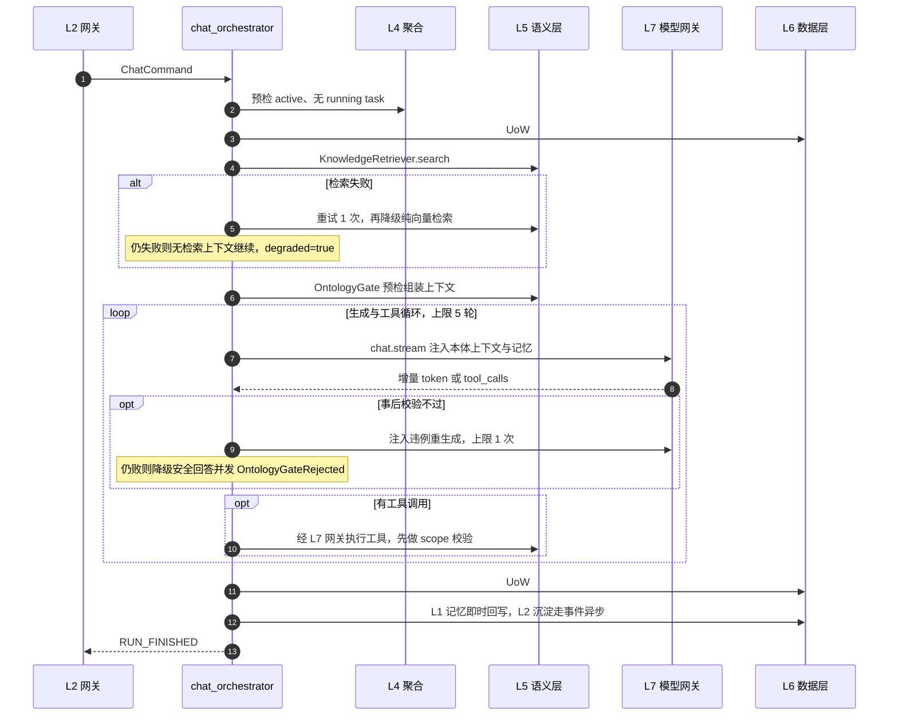
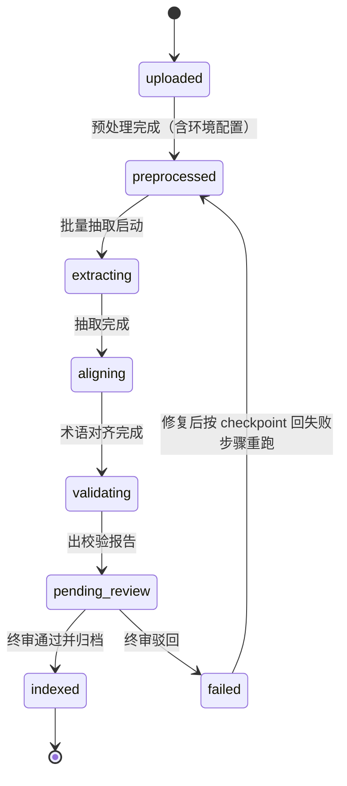
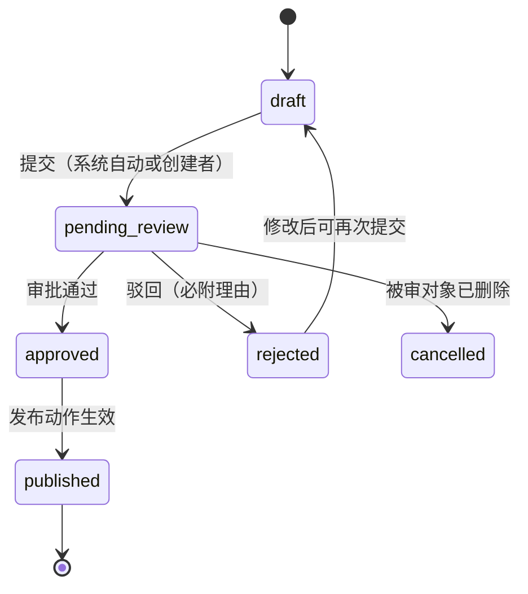

# 03 - 业务层设计（L3 business）

> 状态：v0.1 | 日期：2026-09-26 | 上游依据：[锚点](./01-总体架构与分层.md)、[研究整理/02](../研究整理/02-Agent服务与协议.md)、[研究整理/03](../研究整理/03-知识库与本体核心.md)、[研究整理/05](../研究整理/05-MCP平台能力.md)

---

## 1. 职责与边界

L3 业务层只做三件事（锚点 §2），每件事都有明确的反例禁区：

| 职责 | 说明 | 禁止的反例 |
| ---- | ---- | ---- |
| 用例编排 | 组合 L4 聚合操作、L5 能力（经 L4 端口/领域服务接口）、L7（经 L4 ports），完成一个完整用例 | 把 L4 不变式抄一份进编排器再判一次（如重复校验"无活跃 Run"）——不变式只在聚合方法内断言一次 |
| 事务边界 | 决定哪些写操作在一个 Unit of Work 内原子提交（§6） | 一个用例开多个事务各提交一半；把 LLM 调用包进数据库事务 |
| 领域事件发布 | 聚合产生的事件可靠发布（§6.2） | 绕过事件机制直接向 Redis/MQ 发事件 |

补充禁令：不实现 HTTP 细节（DTO/状态码归 L2）；不写 SQL、不 import ORM（持久化只走 L4 仓储接口，由 L6 实现）；不 import L2/L6 的内部模块。

**L3/L4 边界的可执行规则**（2026-09-26 评审裁决，替代"编排器禁写业务规则"这一不可检查的表述）：

- **归 L3（策略，注入式表达）**：重试次数、降级路径、超时预算、循环上限、并发度——一律实现为可注入的 Policy 对象（`ChatPolicy`、`PipelinePolicy`），编排器读策略、不写死数字；
- **归 L4（不变式）**：任何「必须成立才能继续」的业务断言（唯一性、状态合法迁移、审批前提）——只在聚合方法内断言一次；
- **机械检查**：import-linter 禁 L3 import L2/L6 内部模块；评审清单两条——编排器出现魔法数字（重试/上限/阈值）即打回；不变式在 L3 出现第二份拷贝即打回。

## 2. 编排器清单总表

| 编排器 | 代码路径 | 职责 | 主要协作者 | 详见 |
| ---- | ---- | ---- | ---- | ---- |
| chat_orchestrator | `business/chat_orchestrator.py` | 对话用例：预检→检索→校验→生成→工具→回写 | session/task 聚合、OntologyGate、KnowledgeRetriever（L4 接口）、L7 llm、memory_service | §3 |
| agent_runtime | `business/agent_runtime/` | 托管 agent 工具的运行时插槽：任务下发、事件流回收、平台工具注入 | agent/task 聚合、L7 mcp_gateway、L7 plugin_runtime | [docs/Agenrt/Agent服务设计](../Agenrt/Agent服务设计.md) |
| kb_pipeline | `business/kb_pipeline/` | 七步抽取流水线：状态推进/调度/重试/并发/断点续跑 | document 聚合、L5 knowledge、review_workflow | §4 |
| review_workflow | `business/review_workflow/` | 人工终审横切门禁：工单生命周期与裁决分发 | review 聚合、各聚合的发布动作 | §5 |
| memory_service | `business/memory_service/` | 记忆读写编排、L1→L2 沉淀触发 | memory 聚合、MemoryPolicy（L4 services）、MemoryStore（L4 ports） | [docs/memorry/多层记忆设计](../memorry/多层记忆设计.md) |
| plugin_lifecycle | `business/plugin_lifecycle/` | 插件上架/启停/升级用例 | plugin/tool 聚合、review_workflow、L7 plugin_runtime | [docs/Skills/技能与插件设计](../Skills/技能与插件设计.md) |
| events | `business/events/` | Outbox relay：把聚合事件可靠发布到事件总线 | L6 uow、L7 msg | §6.2 |

## 3. chat_orchestrator

展开锚点 §3.5 对话链路中业务层内部的步骤与失败分支：



步骤与失败分支明细：

| 步骤 | 做什么 | 失败分支 |
| ---- | ---- | ---- |
| 0 读记忆 | 读 L1 工作记忆（Redis）+ L2/L3 相关事实召回，作为生成上下文组装输入（2026-09-26 评审修复G 补列：编排链路此前漏列此步，docs/Agenrt §4 时序与其他文档均已有；编号 0 不占用既有八步编号） | L1 Redis 不可用 → 降级 PG messages 直读最近 N 条（08 篇 §5）；召回失败不阻断对话，无记忆上下文继续并在回答中标注 degraded |
| 1 预检 | session=active、agent=enabled、无 running task（session 聚合不变式） | 违反即终止，SSE 下发 RUN_ERROR：4101 SESSION_CLOSED 或 4102 TASK_ALREADY_RUNNING |
| 2 建任务 | task 置 running，发 TaskStarted 事件 | — |
| 3 检索 | L5 混合检索（Neo4j+Milvus）取 top_k 证据链 | 自动重试 1 次 → 降级 Milvus 纯向量 → 仍败：无检索上下文继续生成，RETRIEVAL_EVIDENCE.degraded=true（降级不阻断对话） |
| 4 事前校验 | OntologyGate 校验组装的本体上下文与实体引用 | 违例片段剔除后继续（信息性门禁，不阻断） |
| 5 生成 | L7 模型网关流式调用（Claude 走直连吃 prompt caching，锚点 §3.3） | 超时指数退避 1s/2s，最多重试 2 次；总预算 60s 耗尽 → RUN_ERROR 5001 LLM_TIMEOUT |
| 6 工具调用 | 解析 tool_calls → scope 校验 → L7 mcp_gateway/plugin_runtime 执行 | 单工具失败把错误信息回喂 LLM 让其自行决策，最多 2 次；循环上限 5 轮防失控；外部 MCP 不可用按研究整理 05 熔断降级，不阻塞主流程 |
| 7 事后校验 | LLM 输出与工具写回实例过 SHACL/规则（锚点 §6.4：LLM 输出必须过规则校验） | 注入违例重新生成 ≤1 次；仍败 → 降级为"仅引用检索证据"的安全回答，GATE_VERDICT.ok=false，发 OntologyGateRejected 事件进审计 |
| 8 回写 | UoW#2：消息落库 + task 终态 + outbox；L1 记忆即时写 Redis；TaskSucceeded | 提交失败 → RUN_ERROR 5004，不回写部分状态（UoW 保证原子） |

## 4. kb_pipeline

编排视角的文档状态机（算法细节归 L5，见 docs/Otghrag；本层只管状态推进与调度）：



七步流水线（研究整理 03 §3.1）与状态、执行方的映射：

| 流水线步骤 | 状态迁移 | 执行方 |
| ---- | ---- | ---- |
| 文档预处理（统一输入格式） | uploaded → preprocessed | L5 knowledge.preprocess |
| 环境配置（模型/提示词模板选择） | 并入预处理 | L3 提供调度参数 |
| 批量抽取（分类型策略） | preprocessed → extracting | L5 knowledge.extract |
| 术语对齐（术语唯一性） | extracting → aligning | L5 knowledge.align |
| 一致性校验 + 约束校验（SHACL） | aligning → validating | L5 ontology_core |
| 人工归档（候选非成品门禁） | validating → pending_review → indexed | review_workflow + L5 入库 |

编排关注点：

| 关注点 | 设计 |
| ---- | ---- |
| 调度 | 每租户 Redis 队列 `kb:queue:{tenant_id}`；租户内并发默认 3，平台总并发默认 50 |
| 幂等与断点续跑 | 每步完成即写 checkpoint（PG 表 `kb_pipeline_step`：document_id/step/status/checkpoint_uri/error/started_at/finished_at）；抽取中间产物落 MinIO；重跑自动跳过已完成步骤 |
| 重试 | 步内自动重试 ≤3 次（指数退避，起点 30s）；耗尽后置 failed 并挂告警，人工修复后经 `pipeline/retry` 从断点步骤继续 |
| 超时预算 | 预处理 10min / 抽取 60min / 对齐 20min / 校验 10min，超时按失败处理 |
| 校验语义 | SHACL 违例不清零也进 pending_review（附带报告），由知识工程师裁决修复重跑或驳回——但 indexed 的前置条件是终审 approved（研究整理 03 四大国标底线：实例必须过校验并人工把关） |

## 5. review_workflow

人工终审横切门禁，覆盖一切"LLM 产物候选非成品"（锚点 §6.5）。工单状态机：



角色矩阵（谁能提交、审什么）：

| 角色 | 关键 scope | 可提交 | 审什么 | 依据 |
| ---- | ---- | ---- | ---- | ---- |
| 知识工程师 | kb:write、ontology:write、review:submit、review:approve:ontology | 本体变更单、抽取候选 | 本体候选（类/属性/公理草案）与 ABox 实例候选 | 研究整理 03 底线 1/2/4 |
| 业务专家 | review:submit、review:approve:rule | 规则/动作变更 | 公理、约束规则、行动类（业务正确性） | 研究整理 03 底线 3 |
| 平台管理员 | plugin:admin、review:approve:plugin | — | 插件上架 | 锚点 §5 模块 8 |
| 平台管理员（writeback 侧） | review:approve:writeback | —（系统自动建单） | **回写事件工单（target_type=writeback_incident）**：死信/对账差异人工处置（重试耗尽、对账超时、补偿失败进人工干预队列） | [MCP/业务回写设计 §3.3](../MCP/业务回写设计.md)——2026-09-26 评审修复G 补行，裁决人=admin |
| 系统自动 | — | 流水线完成后自动建工单 | — | kb_pipeline 触发 |

门禁规则：approved 不等于生效——只有 published 才生效（本体：物化进 Neo4j 并更新权威制品；插件：上架市场可安装）；四眼原则（enterprise 档），决策人不得等于提交人；同一对象同时只能有一个 open 工单（review 聚合不变式，见 04-领域层设计）。

**与 changeset 的关系（2026-09-26 评审裁决：唯一流程头）**：本体类变更只有**一个**审批权威——changeset 是被审对象的权威状态（draft/in_review/published，见 docs/ontology §6.1），工单是流程壳（谁审、何时审、裁决记录）。二者在同一事务内联动（豁免清单②，§6.1）：`工单 approved ⇒ changeset 迁移 in_review→published`，由 ontology 聚合的 `publish(gate_report, approvals)` 断言，禁止两边各持一套状态机。文档/插件/记忆类对象仍走通用工单状态机。治理档位（solo/team/enterprise）对审批链的差异见 08 篇。

## 6. 事务与一致性

### 6.1 UoW 边界原则

- 一个用例 = 一个 UoW；**一个 UoW = 一个一致性边界**（2026-09-26 评审裁决：不机械限定「只改一个聚合」——事务边界由一致性需求决定，不由聚合计数决定）。默认跨聚合协调靠领域事件最终一致；确需同事务强一致的组合走**显式豁免清单**（随代码评审维护），已知豁免：① 消息落库 + task 终态（§3 UoW#2）；② 工单裁决 + changeset 状态迁移（§5）；③ 业务表 + outbox 同写（§6.2）；
- UoW 在 L3 打开、由 L6 `uow.py` 提交/回滚；仓储实例必须从 UoW 获取（`uow.for_tenant()`，租户构造期绑定，见 04 篇 §4），保证同事务连接；
- 外部调用（LLM/MCP/MinIO）一律在事务外：先开短事务落意图（如 task=running），调外部，再开短事务落结果（§3 的 UoW#1/UoW#2 即此模式）；
- SSE 长流程全程不持事务。

### 6.2 领域事件发布与 Outbox（2026-09-26 评审裁决：Outbox 推迟到 M4 引入）

**分阶段**：M1~M3 没有真实外部消费者，事件用「同事务写事件表 + 进程内发布」即可（fanout 到进程内订阅者 + SSE）；**M4 出现外部消费者（MCP 出口、业务回写）时引入 Outbox relay**。但表结构现在就按可跨进程设计（带版本、带聚合标识），避免返工：

```sql
CREATE TABLE outbox_events (
    id              UUID PRIMARY KEY,              -- 事件ID，UUIDv7
    tenant_id       VARCHAR(64)  NOT NULL,
    aggregate_type  VARCHAR(64)  NOT NULL,         -- 如 ontology（04 篇 §6.1 消费映射的保序键）
    aggregate_id    UUID         NOT NULL,
    event_type      VARCHAR(128) NOT NULL,         -- 如 ontology.published
    event_version   SMALLINT     NOT NULL DEFAULT 1,   -- 事件结构版本（跨进程演进）
    payload         JSONB         NOT NULL,        -- 领域事件载荷（L4 事件序列化）
    created_at      TIMESTAMPTZ   NOT NULL DEFAULT now(),
    published_at    TIMESTAMPTZ   NULL             -- NULL 即待发布
);
CREATE INDEX idx_outbox_unpublished ON outbox_events (created_at) WHERE published_at IS NULL;
CREATE INDEX idx_outbox_aggregate ON outbox_events (tenant_id, aggregate_type, aggregate_id, id);
```

relay 机制（`business/events/`，M4 起）：进程内后台任务每 1s 拉取 `published_at IS NULL` 的最早 100 条 → 发布到事件总线（Redis Stream `events:{tenant_id}`）→ 回写 `published_at`。投递语义为至少一次，消费方按 `event_id` 幂等去重；**同一聚合的事件按 id 保序投递**（`aggregate_type+aggregate_id` 分区）；多实例部署时 relay 以 Redis 锁选主（单 worker），防重复投递放大；连续失败进死信告警，不阻塞业务主流程。

## 7. 验收标准

- [ ] chat 主链路端到端跑通，且 §3 表中三条降级路径（检索失败/LLM 超时/校验不过）各有单测；
- [ ] 流水线任意步骤 kill -9 后重跑，能从 checkpoint 步骤继续且产物不重复；
- [ ] 工单 published 之前，候选数据对 kb/search 与 ontology 查询不可见（候选隔离验证）；
- [ ] 同事务写业务表 + outbox：故意抛异常验证两者同滚；relay 宕机恢复后补发事件且消费端按 event_id 幂等；
- [ ] UoW 内出现 LLM 调用即 CI 报错（静态检查或代码评审清单项）；
- [ ] 全部编排器不 import L2/L6 内部模块、无裸 SQL（import-linter 契约）。

## 8. 待办与开放问题

- [ ] `kb_pipeline_step` 表结构与 Alembic 迁移细化（随 docs/Otghrag 设计定稿）；
- [ ] ChatPolicy/PipelinePolicy 的字段清单与默认值定稿（编排策略注入，§1 可执行规则）；
- [ ] 事件总线选型：Redis Stream 的容量上限评估，何时引入消息 broker（锚点 §7 后期议题）；
- [ ] review 驳回后的修复责任人与时限 SLA 流程；
- [ ] memory_service 的 L1→L2 沉淀触发阈值与策略——阈值归 08 篇治理档位配置 + 04 篇 MemoryPolicy，本层只预留 consolidate 触发点。
