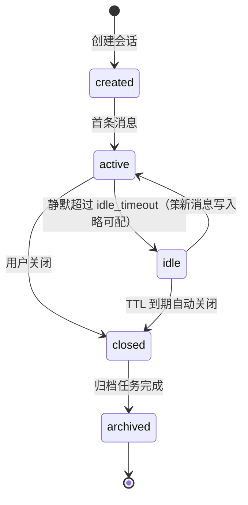
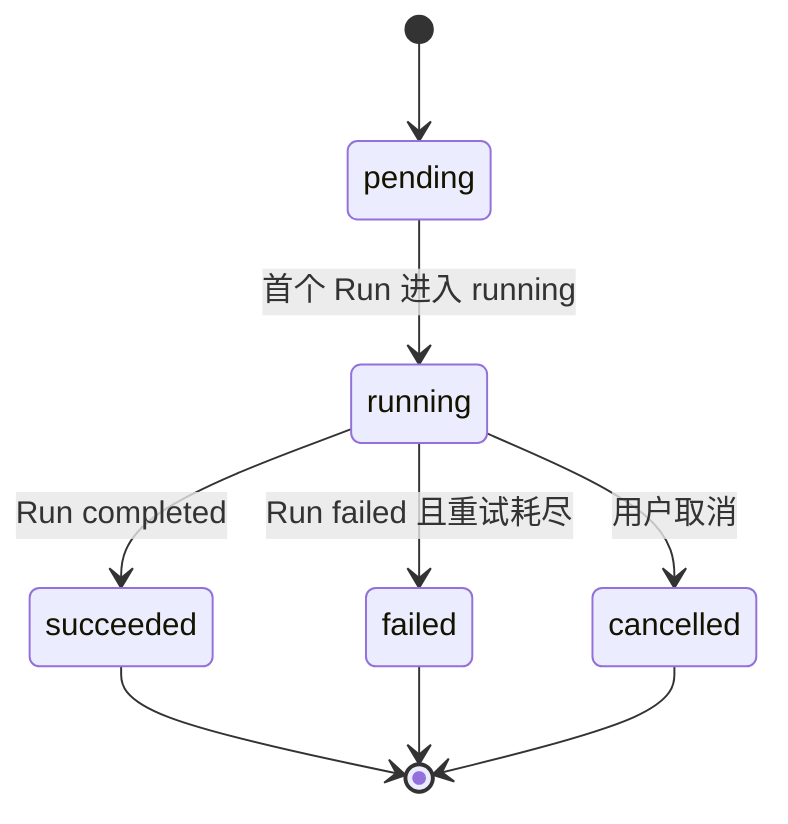
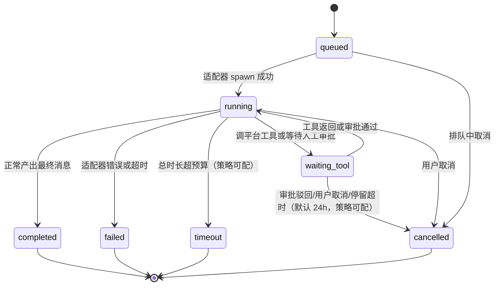
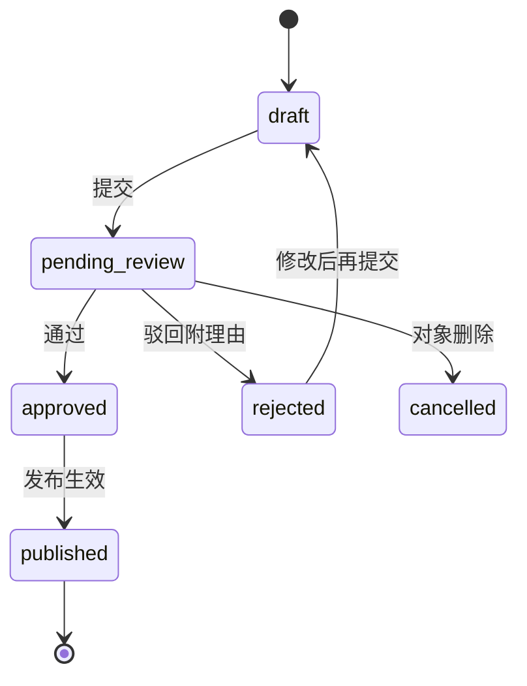
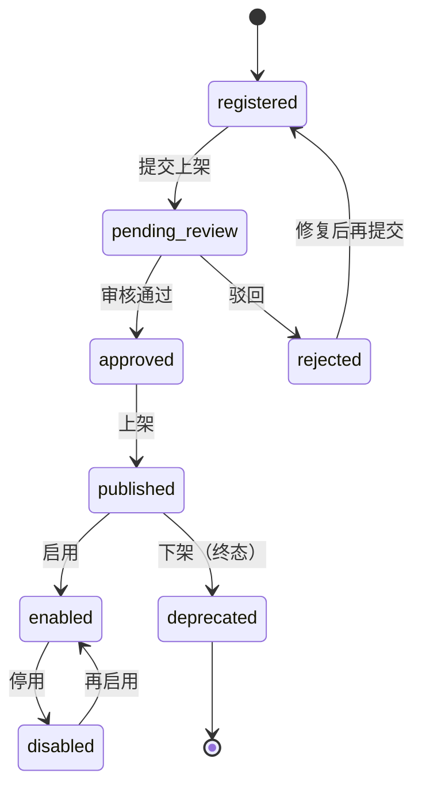

# 04 - 领域层设计（L4 domain）

> 状态：v0.1 | 日期：2026-09-26 | 上游依据：[锚点](./01-总体架构与分层.md)、[研究整理/02](../研究整理/02-Agent服务与协议.md)、[研究整理/03](../研究整理/03-知识库与本体核心.md)、[研究整理/05](../研究整理/05-MCP平台能力.md)

---

## 1. 定位与依赖规则

L4 采用 DDD-lite：聚合根 + 实体 + 值对象 + 领域事件 + 仓储接口 + 领域服务接口。不做完整 DDD（application service 归 L3，仓储实现归 L6）。

- **技术形态**：纯 Python（≥3.11）+ pydantic，仅用于模型定义与校验；
- **pydantic 聚合纪律**（2026-09-26 评审裁决）：聚合根 `model_config = ConfigDict(validate_assignment=True)`——绕过方法直接改属性会触发校验而非静默生效；值对象一律 frozen；实体（Message、Run、TaskEvent）按 `id` 重写 `__eq__`/`__hash__`（pydantic 默认按字段结构相等，会冒充实体的标识相等）；validator 只做形状校验（类型/长度/格式），**业务不变式只写在聚合方法里**——禁止把规则藏进 `@field_validator`；
- **零框架依赖**：禁止 import FastAPI/SQLAlchemy/任何存储或 HTTP 客户端（锚点 §2）；
- **唯一例外**：`repo/` 下的仓储接口用 `typing.Protocol` 定义、由 L6 实现——这是锚点 §3.4 例外 1（依赖倒置），L4 永不 import L6；
- **强制手段**：CI 用 import-linter 契约禁止 domain import gateway/business/semantic/data/infra，违规即构建失败。

代码范围：`sevices/domain/{model/, repo/, events/, services/}`。

## 2. 聚合根清单总表

九个聚合根（锚点 §4）。不变式即业务规则，违反时聚合方法抛 `DomainError`（含平台错误码，见 02-网关层设计 §7）：

| 聚合 | 关键属性 | 不变式（业务规则） | 领域事件 |
| ---- | ---- | ---- | ---- |
| agent | name、model_config、tool_ids、enabled、tenant_id | 名称租户内唯一；enabled=false 不可被会话引用；tool_ids 引用的工具必须存在且 enabled；存在 running task 时禁止删除 | AgentCreated、AgentUpdated、AgentDeleted |
| session | agent_id、user_id、status、summary（messages 为聚合内**只追加实体**，不走全量 save，见 §4） | 同一会话同时至多一个活跃 Run；`message.seq` 会话内严格递增且**先落库后推送**；消息只追加不可修改；closed 后拒绝新消息；上下文超限（>32k tokens）必须先摘要压缩再继续 | SessionCreated、MessageAppended、ContextCompacted、SessionClosed |
| task（含 Run、TaskEvent 实体） | session_id、type、attempt_count、usage；run 状态、run.seq | 状态只能单向迁移至终态，终态不可逆；attempt_count ≤3；`run.seq` 与 `task_events.seq` 严格递增且**先落库后推送**；每个 tool_call 必须闭合（有 result 或 error）才可进终态 | TaskCreated、RunStarted、RunWaitingTool、RunCompleted、RunFailed、RunCancelled |
| ontology | iri_namespace、**head_version（OntologyVersionRef 值对象：version / artifact_uri / checksum）**、active_changeset、status | 发布版本不可变，任何修改必须产生新 changeset；**聚合不持有 TBox 内容**——类/属性/公理/规则是发布版本的读模型（PG 结构化索引，见 docs/ontology §9），编辑期内存图归 L5 应用态；发布=聚合方法 `publish(gate_report, approvals)` 内断言门禁与审批（enterprise 档需双负责人双批准）；术语唯一性——一个概念只有一个规范名（近义词登记为别名）；发布后 IRI 不可变；回滚=把旧版本发布为新版本，不改写历史 | OntologyDrafted、ChangesetProposed、OntologyPublished、OntologyRolledBack |
| document | kb_id、source_uri（MinIO 指针）、status、checkpoint、review_id | 原文指针不可变（换文件=新文档）；状态沿状态机单向前进，仅 failed 可按 checkpoint 回退重跑；抽取产物一律候选态，必须挂 review 工单且 approved 才能 indexed | DocumentUploaded、DocumentIndexed、DocumentFailed |
| memory | layer（L1~L4）、content_ref、source、importance、expires_at | 每条记忆必须带可追溯来源（source 指向 message/task/document，不可为空）；层级写入按授权（L3 组织级仅系统写入）；L1 必须带 TTL；层间升降只能由沉淀任务执行 | MemoryWritten、MemoryConsolidated、MemoryExpired |
| plugin | name、versions（不可变制品）、status、signature | 版本号唯一且发布后不可覆盖；上架必须存在 approved 的 review 工单；包验签失败不得进审核；同一时刻仅一个版本处于 enabled | PluginRegistered、PluginSubmitted、PluginPublished、PluginEnabled、PluginDisabled |
| tool | name、source（builtin/mcp/plugin）、scope_required、annotations、enabled | 名称租户内唯一；scope_required 必填，授权判断只认 scope 声明、不认 MCP annotations（研究整理 05 安全红线）；mcp 来源工具默认 enabled=false（外部默认不可信） | ToolRegistered、ToolEnabled、ToolRevoked |
| review | object_type、object_id、status、submitter、decisions | 同一对象同时只能有一个 open 工单；approved 后不可改判（要改就建新工单）；rejected 必须附理由；决策人不得等于提交人（四眼原则，enterprise 档）；**本体类被审对象：工单是流程壳，changeset 状态为权威状态**（裁决见 §2.1 与 docs/ontology §6.1） | ReviewSubmitted、ReviewApproved、ReviewRejected、ReviewPublished、ReviewCancelled |

### 2.1 不变式的强制机制与测试分层（2026-09-26 评审裁决）

不变式分两类，强制机制不同——并发型不变式放在聚合内存断言里防不住 check-then-act 竞态：

| 类别 | 例 | 强制机制 | 测试层 |
| ---- | ---- | ---- | ---- |
| 迁移/形状类 | 终态不可逆、closed 拒新消息、术语唯一、发布后 IRI 不可变 | 聚合方法内断言（抛 `DomainError`） | L4 纯单测 |
| 并发/唯一类 | 同一会话至多一个活跃 Run；同对象唯一 open 工单；存在 running task 禁删 agent；enterprise 档双负责人双批准 | PG 部分唯一索引（如 `UNIQUE (tenant_id, session_id) WHERE status='running'`）+ 事务隔离级别；审批数校验在聚合方法内 | L6 集成测试（并发用例） |

## 3. 关键状态机

**session**：



**task / run**（task=业务任务，attempt_count ≤3 允许重试建新 Run；run=一次执行尝试）：





> **状态机权威在本篇**（2026-09-26 评审裁决：唯一版本，防双源漂移）。模块文档 docs/Agenrt 只引用不复制。

**review**：



**plugin**：



其余聚合文字说明：

- **agent**：无复杂状态机，仅 enabled/disabled 布尔开关 + 逻辑删除（删除前置条件见 §2 不变式）；
- **ontology**：draft（含活跃 changeset）→ published（head_version 指针推进，版本不可变），版本历史线性，回滚产生新版本；TBox 内容不入聚合（§2 ontology 行裁决）；
- **document**：uploaded→preprocessed→extracting→aligning→validating→pending_review→indexed（状态机图见 03-业务层设计 §4，归属 document 聚合）；
- **memory**：无状态机，生命周期由 TTL（L1）与沉淀任务（升层）驱动；
- **tool**：enabled/disabled 开关，mcp 来源默认 disabled。

## 4. 仓储接口

约定（2026-09-26 评审修订）：

- **租户作用域在构造期绑定**：仓储实例由 `uow.for_tenant(tenant_id)` 创建（L6 实现注入 TenantContext），方法级**不再传 tenant_id**——少一个参数就少一处漏过滤的机会；
- `get` 未命中返回 None 不抛异常；`save` 全量保存聚合**标量状态**；**只追加实体（Message、TaskEvent）走专用 append 方法**，避免每次追加全量重写聚合（O(n) 反模式）；
- 查询方法**按用例定制**，不强制同构九件套：事件消费方要什么查什么（如 `find_open_by_object`、`find_by_review_id`）；
- `save`/`append` 必须在 UoW 事务内调用；实现归 L6 `repo_impl/`。

```python
# sevices/domain/repo/ontology_repo.py
from typing import Protocol
from uuid import UUID

from sevices.domain.model.ontology import Ontology
from sevices.domain.model.value_objects import OntologyStatus

class OntologyRepository(Protocol):
    async def get(self, ontology_id: UUID) -> Ontology | None: ...
    async def save(self, ontology: Ontology) -> None: ...
    async def list(
        self, *, status: OntologyStatus | None = None, offset: int = 0, limit: int = 20
    ) -> list[Ontology]: ...
```

```python
# sevices/domain/repo/session_repo.py
from typing import Protocol
from uuid import UUID

from sevices.domain.model.session import Session
from sevices.domain.model.session import Message

class SessionRepository(Protocol):
    async def get(self, session_id: UUID) -> Session | None: ...
    async def save_meta(self, session: Session) -> None: ...    # 仅标量字段（status/summary）
    async def append_message(self, session_id: UUID, message: Message) -> int: ...  # 返回递增 seq
    async def list_for_user(self, user_id: str, *, offset: int = 0, limit: int = 20) -> list[Session]: ...
```

其余七个聚合按各自用例定制查询方法，不逐一罗列。

## 5. 领域服务接口与技术能力端口（2026-09-26 评审修订：二者分开）

跨聚合的**业务裁决逻辑**定义在 `domain/services/`；**技术能力端口**定义在 `domain/ports/`（锚点 §3.4 例外 3）——端口不进 services，防「端口垃圾抽屉」让 L4 分层名存实亡。均为 Protocol，租户作用域经构造期绑定（§4 同款）：

```python
# sevices/domain/services/gate.py —— 业务裁决，L5 实现
class OntologyGate(Protocol):
    """语义校验门禁，L5 ontology_core 实现（SHACL + 一致性，研究整理 03 §2.3）。"""
    async def validate_changeset(self, changeset: Changeset) -> GateReport: ...
    async def validate_instance(self, ontology_id: UUID, instance_ref: str) -> GateReport: ...
    async def check_term_uniqueness(self, terms: Sequence[Term]) -> list[TermConflict]: ...

# sevices/domain/services/memory_policy.py —— 纯策略（无 IO），沉淀阈值/升降层/遗忘参数
class MemoryPolicy(Protocol):
    """沉淀判定策略（阈值来自 08 篇治理档位配置），L3 memory_service 与 L5 共用。"""
    def judge(self, candidate: MemoryCandidate, ctx: ConsolidationContext) -> ConsolidationDecision: ...

# sevices/domain/ports/retrieval.py —— 技术端口，L5 knowledge 实现
class KnowledgeRetriever(Protocol):
    """GraphRAG 检索（local/global/drift 三模式，研究整理 03 §3.2）。"""
    async def search(self, query: str, *, mode: RetrievalMode, top_k: int = 5) -> RetrievalResult: ...

# sevices/domain/ports/model.py —— 技术端口，L7 llm（LiteLLM）实现
class ModelPort(Protocol):
    """模型调用——更换供应商不动业务代码。"""
    def stream(self, request: ChatRequest) -> AsyncIterator[ChatChunk]: ...
    async def embed(self, texts: Sequence[str]) -> list[list[float]]: ...

# sevices/domain/ports/tool.py —— 技术端口，L7 mcp_gateway/plugin_runtime 实现
class ToolPort(Protocol):
    """工具执行（scope 校验后经此通道）。"""
    async def invoke(self, call: ToolCall) -> ToolResult: ...

# sevices/domain/ports/memory_store.py —— 技术端口，L5+L6 组合实现
class MemoryStore(Protocol):
    """记忆存取（引擎随 PoC ④ 裁决，docs/memorry）。"""
    async def write(self, memory: Memory) -> None: ...
    async def search(self, query: str, *, layers: Sequence[MemoryLayer], top_k: int = 5) -> list[MemoryHit]: ...
```

约定：`GateReport(ok, violations, ontology_version)`、`RetrievalResult` 等返回值为值对象；`Violation` 必须带原文出处指针（研究整理 03 避坑要求：结果可追溯）。

## 6. 领域事件

事件基类（`events/base.py`）：

```python
from datetime import datetime, timezone
from uuid import UUID, uuid4

from pydantic import BaseModel, ConfigDict, Field

class DomainEvent(BaseModel):
    model_config = ConfigDict(frozen=True)      # 事件不可变
    event_id: UUID = Field(default_factory=uuid4)
    tenant_id: str
    aggregate_type: str                         # 如 "ontology"
    aggregate_id: UUID
    occurred_at: datetime = Field(default_factory=lambda: datetime.now(timezone.utc))
    event_type: str                             # 如 "ontology.published"
```

- **命名规范**：Python 类名用过去式 PascalCase——`OntologyPublished`、`ExtractionCompleted`、`ReviewRejected`、`TaskFailed`；`event_type` 字符串用 `{聚合名}.{过去式 snake_case}`（`ontology.published`），由基类从类名自动派生；
- **载荷原则**：只含聚合标识与必要的快照摘要字段，不嵌套完整聚合；全部字段可 JSON 序列化（直接进 Outbox payload）；事件结构只增不改（向后兼容）；不含函数、对象引用或连接资源。

### 6.1 事件 → 消费者 → 失败语义（2026-09-26 评审补齐）

只定义事件不定义消费者，最终一致性会静默断链。已知映射如下，**新增事件必须登记本表**（Outbox 表带 `aggregate_type`/`aggregate_id` 列并按聚合保序投递，见 03 篇 §6.2）：

| 事件 | 生产者 | 消费者 | 失败语义/补偿 |
| ---- | ---- | ---- | ---- |
| review.published | review 聚合 | kb_pipeline（触发 indexed 入库）；本体发布流水线（n10s 物化） | 至少一次投递 + 消费端按 event_id 幂等；失败进死信告警 |
| document 中段事件（extraction_completed / alignment_completed） | kb_pipeline | 告警 + checkpoint 表更新 | 告警即可，无需补偿 |
| session.closed | session 聚合 | memory_service（触发 L2 沉淀任务） | 丢失由定时对账补偿（扫描 closed 未沉淀的会话补发） |
| ontology.gate_rejected | chat_orchestrator（L3 编排事件，非聚合事件） | 审计 sink + SSE `GATE_VERDICT` | 只追加审计，无补偿 |
| run.failed / run.cancelled | task 聚合 | 计量汇总（usage/cost）、前端通知 | 幂等重投 |
| memory.consolidated | memory_service | 记忆 L2→L3 升级审核建单 | 建单失败进死信，人工补建 |

## 7. 测试策略

- **100% 纯单元测试**：不连 PG/Redis/Neo4j/Milvus/MinIO，也不 mock 存储——领域层根本不 import 这些客户端，无桩可打；
- **不变式即测试**：§2 每条不变式至少合法+非法各一个用例（如 session 双任务并发创建必须抛 4102）；
- **状态机穷举**：每个状态机的全部非法迁移用参数化测试断言抛错；
- **事件断言**：事件类型名、event_type 派生、payload 可被 `model_dump_json()` 序列化；
- 覆盖率门槛 90%，随 import-linter 契约一起在 CI 强制；
- 文件组织：`sevices/domain/tests/test_<聚合名>.py`。

## 8. 验收标准

- [ ] import-linter 契约通过：domain 包无任何对 FastAPI/SQLAlchemy/存储客户端/L2/L3/L5/L6/L7 的 import；
- [ ] 九个聚合根全部落位 `model/`，每条 §2 不变式有对应单测且通过；
- [ ] 四个状态机（session/task/review/plugin）非法迁移全部被拒绝并有测试；
- [ ] 仓储接口 Protocol 可被 L6 实现类 `isinstance` 运行时检查（`runtime_checkable`）；
- [ ] 领域服务接口仅有签名无实现，实现类位于 L5 且通过类型检查器契约校验；
- [ ] 全部领域事件可 JSON 序列化并能写入 Outbox 表 payload 字段。

## 9. 待办与开放问题

- [x] ~~ontology 聚合与 rdflib Graph 的关系~~（2026-09-26 裁决：聚合不持有内存 Graph，仅存制品指针 `OntologyVersionRef`；编辑期内存图归 L5 应用态）；
- [x] ~~MemoryCoordinator 的归属边界~~（2026-09-26 裁决：拆为 `services/MemoryPolicy`（纯策略）+ `ports/MemoryStore`（存取），引擎随 PoC ④ 裁决）；
- [ ] `uuid7` 的引入方式（标准库提案 vs 第三方 `uuid7` 包）；
- [ ] document 聚合 checkpoint 的归属（聚合内值对象还是独立表）与 L6 实现对齐；
- [ ] 领域异常 `DomainError` 的错误码到 4xxx 分段的完整映射表（与 02-网关层设计 §7 联动维护）。
