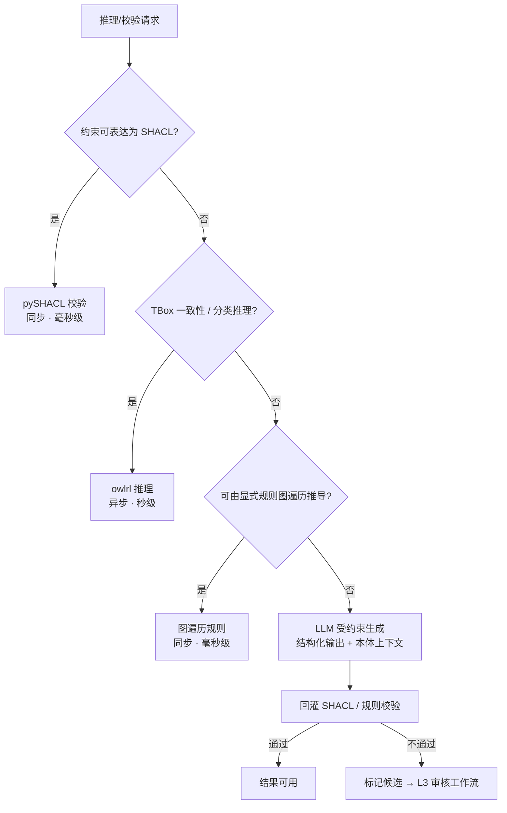

# 05 - 语义层设计

> 状态：v0.1 | 日期：2026-09-26 | 上游依据：[锚点：01-总体架构与分层](./01-总体架构与分层.md)、[研究整理/03-知识库与本体核心](../研究整理/03-知识库与本体核心.md)、[研究整理/00-平台总体架构](../研究整理/00-平台总体架构.md)

---

## 1. 定位与边界

L5 语义层是平台的**特色层**（锚点 §1.1：从"领域层之上"调整为"被业务层调用的能力层"），由两个子域构成：

| 子域 | 管什么 | 回答什么问题 | 权威存储 |
| ---- | ---- | ---- | ---- |
| `ontology_core`（本体核心） | **TBox**：类、属性、公理、规则 + 推理 + SHACL + 版本治理 + 术语对齐 | 知识长什么样、怎么推理 | rdflib Graph + MinIO 制品（Turtle/JSON-LD）；PG 只存元数据与版本 |
| `knowledge`（知识库） | **ABox**：实体/关系实例 + 社区 + GraphRAG 检索 + 抽取 | 知识从哪来、怎么检索 | Neo4j（图）+ Milvus（向量）；PG 存文档/切片元数据 |

三条铁律（依据锚点 §3.2、§6.4、§6.5 与研究整理 03）：

1. **TBox 权威不在 Neo4j**：Neo4j 中的本体是经 n10s 物化的**只读派生视图**；一致性校验必须走语义层推理引擎，Neo4j 不是推理机。
2. **候选非成品**：LLM 产物（候选本体/实例/对齐结果）一律不直接落权威库，必须经审核工作流人工终审。
3. **推理分级**：确定性优先，LLM 兜底且输出必过规则校验（本文 §3）。

本文只写**层级约束、对外接口契约、推理分级路由器**；建模方法论、抽取流水线与检索算法细节归 [docs/ontology](../ontology/README.md)（本体核心详设）与 [docs/OntRAG](../OntRAG/README.md)（GraphRAG 详设）。

## 2. 对外能力接口总表（全平台语义 API 契约）

### 2.1 签名定义

落点 `services/semantic/ontology_core/api.py` 与 `services/semantic/knowledge/api.py`。所有接口以关键字参数携带 `tenant_id`（多租户铁律，锚点 §6.1）。

```python
# ── ontology_core：TBox 权威与推理 ─────────────────────────────────────
def validate(
    ontology_id: UUID,
    data_graph: str | None,              # Turtle/JSON-LD 序列化的 ABox；None=只校验 TBox 自身
    version: str | None = None,          # None=当前已发布版本
    profile: Literal["core", "full"] = "core",
    *, tenant_id: UUID,
) -> ValidationReport:
    """SHACL 校验。校验不通过是【结果】，不是异常。"""

@dataclass
class ValidationReport:
    conforms: bool
    violations: list[Violation]          # focus_node / path / message / severity
    version_used: str
    trace_id: str | None = None

def reason(
    ontology_id: UUID,
    tasks: list[ReasonTask],             # consistency | classification | entailment(graph_pattern)
    version: str | None = None,
    *, tenant_id: UUID, async_if_slow: bool = True,
) -> ReasoningResult:                    # 预估超同步 SLA 时返回 TaskHandle 转异步

def query(
    ontology_id: UUID,
    sparql: str,
    *, tenant_id: UUID, timeout_ms: int = 3_000, limit: int = 100,
) -> SparqlResult:                       # rows + truncated 标记

def search(
    q: str,                              # 自然语言或 IRI 片段
    *, tenant_id: UUID,
    scope: Literal["tbox", "abox", "all"] = "all",
    top_k: int = 10,
) -> list[OntologyHit]:                  # iri / label / ontology_id / score / source

# ── knowledge：ABox 与 GraphRAG ────────────────────────────────────────
# 2026-09-26 评审修复F：契约统一，权威=docs/OntRAG §5（knowledge.search 唯一权威签名）；
# 本层签名对齐：mode 补 auto（默认）、新增可选过滤器 entity_type_filter / ontology_version / max_hops，
# kb_id 与 with_evidence 保留为本层可选参数；完整契约以 docs/OntRAG §5 为权威。
def search(
    kb_id: UUID,
    query: str,
    mode: Literal["auto", "local", "global", "drift"] = "auto",
    top_k: int = 8,
    with_evidence: bool = True,                     # 可选：是否返回图谱路径证据链
    entity_type_filter: list[str] | None = None,    # 可选：本体类 IRI 过滤
    ontology_version: str | None = None,            # 可选：缺省 = 当前发布版
    max_hops: int = 2,                              # local/drift 图扩展跳数
    *, tenant_id: UUID,
) -> RetrievalResult: ...

@dataclass
class RetrievalResult:
    answers: list[Answer]                # summary / confidence / evidence(graph_paths + citations)
    hits: list[RetrievalHit]             # text / entities / community_path / score
    evidence: list[GraphEvidence]        # 图谱路径证据链（with_evidence=True 时）
    mode_used: str
    degraded: bool = False               # True=发生存储降级，调用方必须在回答中标注

def extract(
    doc_ref: DocumentRef,                # MinIO 指针 + 文档元数据（PG documents 行）
    ontology_id: UUID | None,            # None=通用抽取；给定=本体引导抽取
    strategy: Literal["text", "data", "process", "figure"],
    *, tenant_id: UUID,
) -> ExtractJob:                         # 异步任务句柄；进度经 L3 task_events 发布

def align_terms(
    candidates: list[TermCandidate],     # name / definition / source_span
    ontology_id: UUID,
    *, tenant_id: UUID, auto_threshold: float = 0.92,
) -> AlignmentReport:                    # auto_merged / to_review / conflicts
```

### 2.2 接口契约表

| 接口 | 用途 | 被谁调用 | 失败语义 |
| ---- | ---- | ---- | ---- |
| `ontology.validate` | SHACL 实例合规校验（四大国标底线的"实例合规性"门禁） | L3 review_workflow / kb_pipeline；L7 MCP tool `ontology.validate`；CLI | 不通过=正常结果；`OntologyNotFound`(404)；引擎故障 `SemanticEngineError`(500，幂等可重试) |
| `ontology.reason` | 一致性检验、分类推理、隐含关系推导 | L3 chat_orchestrator / review_workflow；L7 MCP tool `ontology.reason`；CLI | 同上；预估超同步 SLA 返回 TaskHandle 转异步 |
| `ontology.query` | SPARQL 查询 TBox/ABox | L3（本体工作台后端）；L7 MCP tool `ontology.query`；CLI | 语法错 400；超时/超限截断并置 `truncated` |
| `ontology.search` | 术语/类/属性检索（对话时注入本体上下文） | L3 chat_orchestrator；CLI | 空结果非失败；索引不可用置 `degraded` |
| `knowledge.search` | GraphRAG auto/local/global/drift 模式检索（契约权威=docs/OntRAG §5，2026-09-26 评审修复F） | L3 chat_orchestrator；L7 MCP tool `knowledge.search`；CLI | Neo4j 故障→纯向量降级 `degraded=True`；全故障 `RetrievalUnavailable`(503)，由 L3 决定跳过上下文并标注 |
| `knowledge.extract` | 七步抽取流水线入口（异步） | L3 kb_pipeline；CLI | 提交即返 `ExtractJob`；执行失败写 `tasks.error`，进度经 task_events 发布 |
| `knowledge.align_terms` | 术语对齐（"术语唯一性"门禁） | L3 kb_pipeline / review_workflow；CLI | 高置信（≥阈值）自动合并，其余进 review_tickets；本体缺失 404 |

调用方共三类：**L3 业务编排**（chat_orchestrator / kb_pipeline / review_workflow / memory_service）、**L7 MCP 网关**（经 CapabilityProvider 注册为 MCP tools，能力清单见研究整理 05 §2.1）、**CLI**（运维与批量任务）。

## 3. 推理分级路由器（平台宪法的技术落点）

依据锚点 §6.4 与研究整理 00 §1.2（"别把确定的事丢给大模型做概率推理"）。路由器是 `ontology_core/reasoning/` 的**唯一入口**，所有校验/推理请求必须经它分派，调用方禁止自选引擎。

| 输入特征 | 路由 | 引擎与落点 | SLA |
| ---- | ---- | ---- | ---- |
| 约束可表达为 SHACL（格式/枚举/区间/基数/唯一值） | 规则校验 | pySHACL（`shacl/`） | **同步毫秒级**：1 万三元组内 P99 ≤ 100ms |
| 隐含关系可由显式规则/图模式推导（审批路径、replaces 替代链） | 图遍历规则 | Cypher / rdflib 遍历（`reasoning/`） | **同步毫秒级**：P99 ≤ 200ms |
| TBox 逻辑一致性、分类推理、公理矛盾检测 | OWL 推理 | **rdflib + owlrl 起步**；重描述逻辑外挂 GraphDB / Jena Fuseki，结果物化回 Neo4j | **异步秒级**：P95 ≤ 5s |
| 复杂语义判断（候选三元组生成、术语映射、歧义消解） | LLM 受约束生成 | L7 模型网关：结构化输出 + 本体上下文注入 | **异步秒级~分钟级**（批量） |
| 上述 LLM 的任意输出 | **强制回灌校验** | 复用 SHACL/图遍历路由；不通过→标记候选进审核工作流 | 复用上两行 SLA |



**毫秒级与秒级的 SLA 分界**：毫秒级路径允许在请求链路内同步等待；秒级路径一律立即返回 `TaskHandle`，进度经 `task_events` 发布，禁止阻塞对话主链路。

```python
def route(req: ReasoningRequest) -> ReasoningPlan:
    """确定性优先 → 规则/SHACL；低频复杂语义 → LLM 受约束生成；
    LLM 输出一律回灌校验，不通过即候选。"""
```

## 4. 层内模块结构

`services/semantic/` 子包职责表（目录骨架以锚点 §4 为准）：

| 子包 | 职责 | 关键对外符号 |
| ---- | ---- | ---- |
| `ontology_core/tbox/` | TBox 读写与编译、IRI/命名空间管理、权威制品落 MinIO + PG 版本元数据 | `TBoxStore`（load / current_version / artifact） |
| `ontology_core/reasoning/` | 分级路由器（§3）、owlrl 封装、图遍历规则执行器 | `route()`、`OwlReasoner` |
| `ontology_core/shacl/` | pySHACL 封装、约束模板库（格式/枚举/区间/基数）、Violation 模型 | `ShaclValidator` |
| `ontology_core/versioning/` | 版本发布/回滚/变更单状态机，对接 PG `ontology_versions` / `ontology_changesets` | `publish_version()` |
| `ontology_core/align/` | 术语对齐：向量相似 + 别名词典 + 冲突仲裁工单 | `align()` |
| `knowledge/extract/` | 四类抽取策略提示词、七步流水线编排（预处理→抽取→对齐→一致性/约束双校验→归档候选） | `ExtractPipeline` |
| `knowledge/graphrag/` | 实体/关系图构建、层次化 Leiden 社区检测、community report 生成与向量索引 | `CommunityIndexer` |
| `knowledge/retrieve/` | local/global/drift 三模式检索、证据链组装、跨存储降级编排 | `Retriever.search()` |

## 5. 与 L4 / L6 / L7 的交互边界

| 交互对象 | 语义层依赖它什么 | 语义层绝不做什么 |
| ---- | ---- | ---- |
| L4 领域层 | `domain/repo/` 仓储接口 Protocol、`domain/model/` 的本体与文档聚合定义；消费领域事件 | 不实现仓储（那是 L6 的事）；不反向定义领域模型；绕过聚合直改数据 |
| L6 数据层 | `clients/` 的 Neo4j、Milvus 客户端；经 L3 编排的 uow 参与事务 | 不写 SQL / ORM 模型；不经仓储直连 PG；不在数据层放语义规则 |
| L7 基础层 | 模型网关（抽取/摘要/嵌入/受约束生成）、OTel 上报 | 不直接 import 任何模型 SDK；不依赖 MCP 网关实现——方向相反：L7 经 `CapabilityProvider` 注册 L5 能力（锚点 §3.4，见 [07 篇](./07-基础层设计.md)） |
| L3 业务层 | （被 L3 调用，见 §2.2 调用方） | 不处理会话、权限、审核状态机等非语义事务（研究整理 03 §1：语义层只管语义） |

## 6. 验收标准

1. 七个接口签名冻结：Protocol/pydantic 定义入库，契约测试全绿，且与 L7 MCP 暴露的 tools 一一映射。
2. 推理分级路由器分支全覆盖单测；集成测试断言"LLM 输出未经 SHACL 复验不可能写入权威库"。
3. 毫秒级路径基准：1 万三元组 SHACL 校验 P99 ≤ 100ms，图遍历 P99 ≤ 200ms（CI 基准门禁）。
4. Neo4j TBox 物化只读性：对物化节点的业务写路径有监控告警。
5. `knowledge.search` 降级路径注入测试（分别停 Neo4j / 停 Milvus）可复现 `degraded=True`，回答侧带降级标注。

## 7. 待办与开放问题

- [ ] 七接口契约冻结评审（pydantic schema + 契约测试入库后再开放 L7 注册）
- [ ] owlrl 推理性能基线实测 = **PoC① 扩维**（引擎×规模×四类成本矩阵，重型本体规模化设计见 [docs/ontology/02](../ontology/02-重型本体优化设计.md) §8；focus-node/投影基准 = PoC⑥）
- [ ] `drift` 模式检索实现排期（M2 先交付 local/global，drift 随 GraphRAG 索引管线二期）
- [ ] `align_terms` 默认阈值 0.92 的标定实验（用 GB/T 48000.3 附录 D 实例做金标）
- [ ] `docs/ontology` 与 `docs/OntRAG` 详设文档补齐后回链复核本文引用
