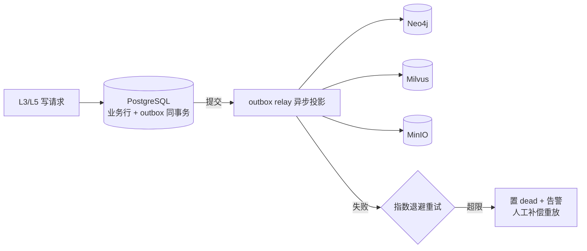

# 06 - 数据层设计

> 状态：v0.1 | 日期：2026-09-26 | 上游依据：[锚点：01-总体架构与分层](./01-总体架构与分层.md)、[研究整理/03-知识库与本体核心](../研究整理/03-知识库与本体核心.md)、[研究整理/04-多层记忆](../研究整理/04-多层记忆.md)

---

## 1. 职责与组织

L6 数据层是**领域层 Protocol 的实现侧**（依赖倒置第一处，锚点 §3.4）：L4 `domain/repo/` 定义接口，本层 `repo_impl/` 实现。存储职责划分以锚点 §3.2 为准（PG=权威业务数据 / Neo4j=ABox 图与记忆 L3 / Milvus=向量 / MinIO=对象 / Redis=热数据）。

| 子包/文件 | 职责 | 禁止 |
| ---- | ---- | ---- |
| `orm/` | SQLAlchemy 2.0 模型（与 `domain/model` 聚合一一映射，含转换器） | 出现业务规则；被 L4 及以上 import |
| `repo_impl/` | 实现各仓储接口；强制携带 `tenant_id` 过滤（横切约束，锚点 §6.1） | 暴露 ORM 对象给上层；返回未过滤租户的结果 |
| `clients/` | pg（async engine + session 工厂）、neo4j（AsyncDriver + Cypher 安全拼装）、milvus、minio、redis 五个客户端封装 | 客户端里写任何领域词汇 |
| `migrations/` | Alembic 版本脚本（见 §7 纪律） | 手改已应用迁移 |
| `uow.py` | Unit of Work：一个事务边界内聚合 PG 仓储 + outbox 写入；对 Neo4j/Milvus 只投递"待投影事件" | 跨存储分布式事务（用 §8 补偿替代） |

**层内禁令**（锚点 §2）：不包含业务规则；不含 HTTP 细节；L7 之外谁也不许 import `clients/` 直连存储。

Unit of Work 的对外契约（`services/data/uow.py`，供 L3 编排器与 L5 使用）：

```python
class UnitOfWork(Protocol):
    async def __aenter__(self) -> "UnitOfWork": ...   # 开启 PG 事务 + 各仓储绑定同一 session
    async def __aexit__(self, *exc) -> None: ...      # 异常即回滚；正常则提交并派发 outbox 事件
    # 仓储以属性暴露，类型为 domain/repo 的 Protocol 实现：
    sessions: SessionRepository
    documents: DocumentRepository
    ontologies: OntologyRepository
    review: ReviewRepository
    ...
    def enqueue_projection(self, event_type: str, aggregate_id: UUID, payload: dict) -> None:
        """业务行与 outbox 事件同一事务落库（§8 跨存储一致性的入口）。"""
```

### 1.1 公共字段约定（除注明外适用于全部 PG 业务表）

| 字段 | 类型 | 说明 |
| ---- | ---- | ---- |
| `id` | `UUID PK` | 建议 UUIDv7（时间有序利于索引）；默认 `gen_random_uuid()` |
| `tenant_id` | `UUID NOT NULL REFERENCES tenants(id)` | 多租户行级隔离；唯一索引一律含 `tenant_id` 列 |
| `created_at` / `updated_at` | `TIMESTAMPTZ NOT NULL DEFAULT now()` | `updated_at` 由应用层维护（不用触发器） |

平台级表（无 `tenant_id`，豁免租户列）：`tenants`、`roles`、`plugins`、`plugin_versions`、`agent_adapters`——它们是平台目录数据，不属于任何租户（2026-09-26 评审修复G：补登 `plugins`，与 database/01 §1.2 平台级清单对齐）。

## 2. PostgreSQL 核心表清单

共 32 张表，按域分组；"关键字段"列给出公共字段之外的建表粒度（名称/类型/说明）。其中 5 张为 2026-09-26 评审修复G 补登（`runs`〔§2.3〕、`kb_pipeline_step`〔§2.4〕、`writeback_ledger`/`evaluation_runs`/`evaluation_results`〔§2.10〕），均**以 [database/01](../database/01-数据库详细设计.md) 为 DDL 展开**（字段类型、CHECK、索引以该篇为准）。

### 2.1 身份与访问

| 表 | 用途 | 关键字段（公共字段之外） | 索引/约束要点 |
| ---- | ---- | ---- | ---- |
| `tenants` | 租户主表（平台级） | `name VARCHAR(128)`；`slug VARCHAR(64)`；`plan VARCHAR(32)`（free/pro/ent）；`status VARCHAR(16)`（active/suspended）；`settings JSONB` | `UNIQUE(slug)` |
| `users` | 用户 | `email VARCHAR(256)`；`username VARCHAR(64)`；`password_hash VARCHAR(256)`；`display_name VARCHAR(128)`；`status VARCHAR(16)`；`last_login_at TIMESTAMPTZ` | `UNIQUE(tenant_id, email)` |
| `roles` | 角色定义（平台级） | `code VARCHAR(32)`（admin/ontologist/curator/member/guest，另有平台级保留角色 super_admin——2026-09-26 评审修复G：以 [08 篇 §2.2](./08-横切关注点与工程规范.md) 英文码为权威，旧称 knowledge_engineer/business_expert/developer 作废）；`name VARCHAR(64)`；`scopes TEXT[]` | `UNIQUE(code)`；scope 命名见 [08 篇](./08-横切关注点与工程规范.md) |
| `user_roles` | 用户-角色绑定 | `user_id UUID`；`role_id UUID` | `UNIQUE(user_id, role_id)`；双外键 |
| `api_keys` | API 密钥（供外部 Agent 经 MCP 调用） | `name VARCHAR(128)`；`key_hash VARCHAR(128)`（仅存哈希）；`key_prefix VARCHAR(16)`（展示用）；`owner_user_id UUID`；`scopes TEXT[]`；`expires_at TIMESTAMPTZ`；`revoked_at TIMESTAMPTZ`；`last_used_at TIMESTAMPTZ` | `UNIQUE(key_prefix)`；`INDEX(tenant_id, owner_user_id)` |

### 2.2 Agent 与会话

| 表 | 用途 | 关键字段 | 索引/约束要点 |
| ---- | ---- | ---- | ---- |
| `agents` | Agent 配置（托管 nanobot/openclaw/hermes/claude/piagent 等） | `name VARCHAR(128)`；`agent_tool VARCHAR(32)`；`adapter_id UUID`；`system_prompt TEXT`；`config JSONB`（模型 profile/工具白名单）；`status VARCHAR(16)` | `UNIQUE(tenant_id, name)`；`INDEX(agent_tool)` |
| `agent_adapters` | agent 工具接入适配器定义（平台级） | `agent_tool VARCHAR(32)`；`version VARCHAR(32)`；`runtime_spec JSONB`（启动参数/传输/能力声明）；`health_endpoint VARCHAR(256)` | `UNIQUE(agent_tool, version)` |
| `sessions` | 会话 | `agent_id UUID`；`user_id UUID`；`title VARCHAR(256)`；`channel VARCHAR(32)`（web/api/cli）；`status VARCHAR(16)`（created/active/idle/closed/archived，五态——2026-09-26 评审修复G：对齐 04 篇 §3 状态机权威，原 active/archived 两态作废）；`last_message_at TIMESTAMPTZ`；`token_usage JSONB` | `INDEX(tenant_id, user_id, last_message_at DESC)` |
| `messages` | 消息 | `session_id UUID`；`seq INT`（会话内严格递增、先落库后推送——2026-09-26 评审修复G 补列，04 篇 §2 不变式）；`role VARCHAR(16)`（user/assistant/tool/system）；`content TEXT`；`content_type VARCHAR(32)`；`ag_ui_events JSONB`（AG-UI 事件序列）；`model VARCHAR(64)`；`token_in INT`；`token_out INT`；`latency_ms INT` | `UNIQUE(session_id, seq)`；`INDEX(session_id, created_at)`；分区候选（见 §9）；只追加 |

### 2.3 任务

| 表 | 用途 | 关键字段 | 索引/约束要点 |
| ---- | ---- | ---- | ---- |
| `tasks` | 异步任务（抽取/索引/推理/审核转发） | `type VARCHAR(32)`；`status VARCHAR(16)`（pending/running/succeeded/failed/cancelled）；`agent_id UUID`；`session_id UUID`；`attempt_count INT`（重试计数，≤3——2026-09-26 评审修复G 补列）；`active_run_id UUID NULL`（当前活跃 Run 指针，不设 FK 防循环——2026-09-26 评审修复G 补列）；`payload JSONB`；`result JSONB`；`error TEXT`；`priority SMALLINT`；`idempotency_key VARCHAR(128)`；`started_at/finished_at TIMESTAMPTZ` | `UNIQUE(tenant_id, idempotency_key)`；`INDEX(status, priority, created_at)`；部分唯一 `(tenant_id, session_id) WHERE status='running'`（同会话至多一个 running task，04 篇 §2.1） |
| `runs` | 一次执行尝试（task=业务任务，attempt≤3 可重试建新 Run；2026-09-26 评审修复G 新增，以 database/01 §3.2 为 DDL 展开） | `task_id UUID FK`；`seq_start INT`（本 Run 的 task_events.seq 起始，事件 seq 跨 Run 连续递增）；`status VARCHAR(16)` 七态（queued/running/waiting_tool/completed/failed/timeout/cancelled，状态机权威=04 篇 §3）；`started_at/ended_at TIMESTAMPTZ`；`usage JSONB`；`error JSONB` | 部分唯一 `(tenant_id, task_id) WHERE status IN ('queued','running','waiting_tool')`（每任务至多一个活跃 Run，04 篇 §2.1 并发不变式由 PG 强制） |
| `task_events` | 任务事件流（AG-UI 语义，SSE 转发源） | `task_id UUID`；`seq INT`；`event_type VARCHAR(32)`；`data JSONB` | `UNIQUE(task_id, seq)` |

### 2.4 知识库与文档

| 表 | 用途 | 关键字段 | 索引/约束要点 |
| ---- | ---- | ---- | ---- |
| `kb_collections` | 知识库 | `name VARCHAR(128)`；`description TEXT`；`ontology_id UUID`（本体引导，可空）；`embedding_model VARCHAR(64)`；`chunk_defaults JSONB`；`status VARCHAR(16)` | `UNIQUE(tenant_id, name)` |
| `documents` | 文档元数据（原文在 MinIO） | `kb_collection_id UUID`；`title VARCHAR(512)`；`source_type VARCHAR(16)`（upload/api）；`mime_type VARCHAR(128)`；`size_bytes BIGINT`；`minio_key VARCHAR(512)`；`checksum_sha256 CHAR(64)`；`status VARCHAR(16)` 八态（uploaded/preprocessed/extracting/aligning/validating/pending_review/indexed/failed——2026-09-26 评审修复G：原 `parse_status` 三态作废，对齐 04 篇 document 聚合与 03 篇 §4 状态机）；`meta JSONB` | `UNIQUE(tenant_id, kb_collection_id, checksum_sha256)`；`INDEX(status)` |
| `document_chunks` | 文档切片（切片文本存 PG，≤8KB，权威副本） | `document_id UUID`；`seq INT`；`content TEXT`；`token_count INT`；`page_no INT`；`meta JSONB` | `UNIQUE(document_id, seq)`；向量副本在 Milvus `kb_chunks` |
| `kb_pipeline_step` | 抽取流水线断点续跑 checkpoint（03 篇 §4；2026-09-26 评审修复G 补登，以 database/01 §3.3 为 DDL 展开） | `document_id UUID`；`step VARCHAR(32)`（preprocess/extract/align/validate/archive）；`status VARCHAR(16)`（pending/running/done/failed）；`checkpoint_uri VARCHAR(512)`；`attempt SMALLINT`（步内重试 ≤3）；`error TEXT`；`started_at/finished_at TIMESTAMPTZ` | `UNIQUE(document_id, step)` |

### 2.5 本体

| 表 | 用途 | 关键字段 | 索引/约束要点 |
| ---- | ---- | ---- | ---- |
| `ontologies` | 本体注册 | `iri_base VARCHAR(256)`；`name VARCHAR(128)`；`current_version_id UUID`；`status VARCHAR(16)`（draft/published/deprecated）；`format VARCHAR(16)`（turtle/json-ld） | `UNIQUE(tenant_id, iri_base)` |
| `ontology_versions` | 版本存档（TBox 制品在 MinIO） | `ontology_id UUID`；`version VARCHAR(32)`（semver）；`artifact_key VARCHAR(512)`；`checksum CHAR(64)`；`changelog TEXT`；`parent_version_id UUID`；`published_by UUID`；`published_at TIMESTAMPTZ` | `UNIQUE(ontology_id, version)` |
| `ontology_changesets` | 变更单（申请→评审→发布→回滚） | `ontology_id UUID`；`from_version_id UUID`；`to_version_id UUID`；`diff JSONB`（增/删/改三元组摘要）；`impact_report JSONB`；`status VARCHAR(16)` 五态（draft/in_review/published/rejected/rolled_back——2026-09-26 评审修复G：对齐 docs/ontology §6.1 权威，原 proposed/approved/rejected/applied/rolled_back 旧码作废）；`applicant_id UUID`；`reviewer_id UUID` | `INDEX(ontology_id, status)`；状态机见 [docs/ontology §6.1](../ontology/本体核心设计.md)；工单是流程壳（03 篇 §5） |

### 2.6 审核

| 表 | 用途 | 关键字段 | 索引/约束要点 |
| ---- | ---- | ---- | ---- |
| `review_tickets` | 人工终审工单（候选非成品门禁 + 回写人工处置，统一入口） | `target_type VARCHAR(32)`（ontology_candidate/knowledge_instance/memory_l2_upgrade/plugin_listing/writeback_incident——2026-09-26 评审修复G：补 writeback_incident，回写死信/对账差异人工处置，MCP §3.3）；`target_id UUID`；`payload JSONB`；`submitter_id UUID`；`reviewer_id UUID`；`status VARCHAR(16)` 六态（draft/pending_review/approved/rejected/published/cancelled——2026-09-26 评审修复G：对齐 03 篇 §5 状态机权威，原 pending/approved/rejected/withdrawn 四态作废）；`decision_note TEXT`；`sla_deadline TIMESTAMPTZ` | `INDEX(tenant_id, status, created_at)`；部分唯一 `(tenant_id, target_type, target_id) WHERE status IN ('draft','pending_review')`（同对象唯一 open 工单，04 篇 §2）；流程见 [08 篇 §4](./08-横切关注点与工程规范.md) |

### 2.7 插件与工具

| 表 | 用途 | 关键字段 | 索引/约束要点 |
| ---- | ---- | ---- | ---- |
| `plugins` | 插件目录（平台级，"商品"） | `slug VARCHAR(128)`；`name VARCHAR(128)`；`kind VARCHAR(16)`（mcp_server/rest_api/skill/prompt）；`publisher_id UUID`；`latest_version VARCHAR(32)`；`signature VARCHAR(512)`；`status VARCHAR(16)` | `UNIQUE(slug)` |
| `plugin_versions` | 插件版本（平台级） | `plugin_id UUID`；`version VARCHAR(32)`；`server_json JSONB`（server.json 扩展）；`artifact_key VARCHAR(512)`；`checksum CHAR(64)`；`scope_required TEXT[]`；`compat_mcp VARCHAR(64)`；`scan_report JSONB`；`status VARCHAR(16)`（submitted/scan_passed/published/delisted） | `UNIQUE(plugin_id, version)` |
| `tools` | 工具注册中心（"单件"，统一 MCP/本地/业务适配工具视图） | `name VARCHAR(128)`；`kind VARCHAR(16)`（builtin/mcp_remote/rest_adapter/plugin）；`provider_ref JSONB`（plugin_id 或外部 server 标识）；`input_schema JSONB`；`annotations JSONB`（**仅 UI 提示，不作授权**）；`ontology_action_iri VARCHAR(256)`（关联本体行动类）；`scope_required TEXT[]`；`enabled BOOLEAN` | `UNIQUE(tenant_id, name)` |
| `tool_invocations` | 工具调用留痕（审计+成本归因） | `tool_id UUID`；`session_id UUID`；`task_id UUID`；`caller JSONB`（user/agent/外部）；`input_digest JSONB`（脱敏摘要）；`output_digest JSONB`；`status VARCHAR(16)`；`latency_ms INT`；`error TEXT` | `INDEX(tenant_id, created_at)`；`INDEX(tool_id, created_at)` |

### 2.8 记忆

| 表 | 用途 | 关键字段 | 索引/约束要点 |
| ---- | ---- | ---- | ---- |
| `memory_l2_facts` | 用户级记忆事实（L2 底座，研究整理 04） | `user_id UUID`；`content TEXT`；`embedding_ref VARCHAR(64)`（Milvus 主键）；`confidence NUMERIC(4,3)`；`source_session_id UUID`；`valid_from/valid_to TIMESTAMPTZ`；`status VARCHAR(16)`（active/superseded/expired）；`keywords TEXT[]` | `INDEX(tenant_id, user_id, status)`；向量在 Milvus `memory_embeddings` |
| `memory_l3_edges`（可选） | 组织级记忆时序边的 PG 权威账本（Neo4j invalidation 边的账本镜像） | `subject_iri VARCHAR(256)`；`predicate VARCHAR(128)`；`object_iri VARCHAR(256)`；`valid_from/valid_to TIMESTAMPTZ`；`source_ticket_id UUID`（L2→L3 审核工单） | `INDEX(tenant_id, subject_iri)`；不物理删除（研究整理 04 §3.3） |

### 2.9 平台运维

| 表 | 用途 | 关键字段 | 索引/约束要点 |
| ---- | ---- | ---- | ---- |
| `audit_logs` | 审计日志（只追加） | `actor_type VARCHAR(16)`（user/api_key/agent/system）；`actor_id UUID`；`action VARCHAR(64)`；`resource_type VARCHAR(32)`；`resource_id VARCHAR(64)`；`params_digest JSONB`（脱敏参数摘要）；`result VARCHAR(16)`；`ip INET`；`latency_ms INT`；`trace_id VARCHAR(64)` | `INDEX(tenant_id, created_at)`；只插不改删；保留策略见 08 篇 |
| `outbox` | 事务性发件箱（跨存储投影驱动，§8） | `aggregate_type VARCHAR(32)`；`aggregate_id UUID`；`event_type VARCHAR(64)`；`payload JSONB`；`status VARCHAR(16)`（pending/published/failed/dead）；`retry_count SMALLINT`；`published_at TIMESTAMPTZ` | `INDEX(status, created_at)`；与业务行同事务写入 |
| `llm_calls` | LLM 调用成本明细（[07 篇](./07-基础层设计.md) 模型网关落点） | `provider VARCHAR(32)`；`model VARCHAR(64)`；`kind VARCHAR(16)`（complete/stream/embed）；`token_in INT`；`token_out INT`；`cache_read_tokens INT`；`cost_usd NUMERIC(12,6)`；`latency_ms INT`；`status VARCHAR(16)`；`session_id UUID`；`task_id UUID`；`trace_id VARCHAR(64)` | `INDEX(tenant_id, created_at)`；成本治理报表数据源 |

### 2.10 回写与评估（2026-09-26 评审修复G 补登，以 database/01 §3.8/§3.9 为 DDL 展开）

| 表 | 用途 | 关键字段 | 索引/约束要点 |
| ---- | ---- | ---- | ---- |
| `writeback_ledger` | 业务动作回写台账（状态只前进不回退；[MCP/业务回写设计 §8](../MCP/业务回写设计.md)） | `action_instance_id UUID`；`connector_id UUID`；`idempotency_key VARCHAR(128)`；`request_payload JSONB`（高风险信封加密快照）；`receipt JSONB`；`status VARCHAR(16)`（pending/accepted/succeeded/failed/compensated/unknown）；`attempts SMALLINT`；`last_error TEXT`；`needs_human BOOLEAN` | `UNIQUE(tenant_id, idempotency_key)`；对账扫描 `INDEX(tenant_id, status, updated_at)`；永久保留（对账与审计事实依据） |
| `evaluation_runs` | 评估运行（08 篇 §7.3 评估结果落库；baseline 自引） | `benchmark_type VARCHAR(32)`（retrieval_qa/agent_task/extraction_precision）；`benchmark_version VARCHAR(32)`；`trigger_ref JSONB`；`baseline_run_id UUID`；`metrics JSONB`；`delta JSONB`；`passed BOOLEAN`；`started_by UUID` | `INDEX(tenant_id, benchmark_type, created_at DESC)` |
| `evaluation_results` | 评估结果明细（只追加） | `run_id UUID FK`；`case_id VARCHAR(64)`；`metrics JSONB`；`verdict VARCHAR(16)`（pass/fail/skip）；`detail JSONB` | `UNIQUE(run_id, case_id)` |

## 3. Neo4j 图模型

只放 ABox 知识图谱、本体 TBox 物化（只读）与组织级记忆 L3 时序图（锚点 §3.2）。

### 3.1 节点标签

| 标签 | 用途 | 关键属性 | 约束/索引 |
| ---- | ---- | ---- | ---- |
| `Entity` | ABox 实体（本体类的实例）；记忆 L3 亦复用（带 `valid_from/valid_to` 双时态属性） | `uuid`、`tenant_id`、`kb_id`、`onto_class`（本体类 IRI）、`name`、`name_normalized`、`summary`、`confidence` | `CONSTRAINT entity_uuid UNIQUE(uuid)`；`INDEX (tenant_id, kb_id, onto_class)` |
| `Community` | Leiden 层次社区（含 LLM 摘要） | `uuid`、`tenant_id`、`kb_id`、`level INT`、`title`、`summary`、`rank` | `INDEX (tenant_id, kb_id, level)` |
| `Chunk` | 文档切片节点（GraphRAG text unit，权威文本在 PG） | `uuid`、`tenant_id`、`kb_id`、`document_id`、`seq` | `CONSTRAINT chunk_uuid UNIQUE(uuid)` |
| `DocumentRef` | 文档影子节点（轻量指针，权威在 PG documents） | `uuid`、`tenant_id`、`document_id`、`title`、`minio_key` | `UNIQUE(tenant_id, document_id)` |
| （n10s 物化节点） | TBox 物化视图，统一带 `materialized_from JSONB`（ontology_id+version） | 按 n10s 映射规则生成 | 只读：业务代码禁止写；发布流水线全量重建 |

### 3.2 关系类型命名规范

统一 `UPPER_SNAKE_CASE`，来源两类：

1. **本体对象属性**：取 IRI 本地名转大写下划线，如 `imposesConstraint` → `IMPOSES_CONSTRAINT`、`adopts` → `ADOPTS`；
2. **结构关系（平台保留字）**：`MENTIONED_IN`（Entity→Chunk）、`PART_OF`（Chunk→DocumentRef）、`IN_COMMUNITY`（Entity→Community）、`SUBCOMMUNITY_OF`（Community→Community）、`SUPERSEDED_BY`（记忆/事实失效边，Graphiti 式软删，研究整理 04 §2）。

### 3.3 tenant 隔离策略

**单库 + `tenant_id` 属性隔离**。理由：Neo4j 社区版（起步选型，锚点 §3.1）多数据库能力受限；属性过滤 + 复合索引在中小规模（≤ 数千万节点）足够；所有 Cypher 由 `clients/neo4j.py` 的查询构建器生成，**强制**携带 `WHERE n.tenant_id = $tenant_id`，杜绝手写裸查询。

**database-per-tenant 演进触发条件**（满足其一即立项）：单库节点 > 5 亿或关系 > 20 亿；出现合规要求的物理隔离租户；租户间负载互相干扰（noisy neighbor）无法用资源配额解决。届时迁 Neo4j 多 database 或 Fabric 分片。

## 4. Milvus collection 设计

| collection | 字段（名称/类型/说明） | 维度 | 度量 | 索引 |
| ---- | ---- | ---- | ---- | ---- |
| `kb_chunks` | `chunk_id VARCHAR(64) PK`=PG切片id；`tenant_id VARCHAR(36) partition_key`；`kb_id VARCHAR(36)` 标量过滤；`document_id VARCHAR(36)`；`embedding FLOAT_VECTOR`；`text VARCHAR(8192)` 检索直读（权威在PG） | **1024**（默认 bge-m3；按租户 embedding 模型定，换模型=重建 collection） | **COSINE** | HNSW（M=16, efConstruction=200） |
| `graph_communities` | `community_id VARCHAR(64) PK`；`tenant_id VARCHAR(36) partition_key`；`kb_id VARCHAR(36)`；`level INT`；`embedding FLOAT_VECTOR`（community report 摘要向量）；`title VARCHAR(512)`；`summary TEXT` | 1024 | **COSINE** | HNSW 同上 |
| `memory_embeddings` | `memory_id VARCHAR(64) PK`=PG记忆id；`tenant_id VARCHAR(36) partition_key`；`user_id VARCHAR(36)`（L2 检索过滤）；`embedding FLOAT_VECTOR`；`content TEXT`；`layer VARCHAR(8)`（预留 l2/l3） | 1024 | **COSINE** | HNSW 同上 |

规则：**partition key = tenant_id**（物理分区级隔离，配合标量过滤双保险）；collection 创建脚本属 `deploy/init-milvus/`（§7）；`embedding_model` 是 collection 契约一部分，记录在 `kb_collections.embedding_model`。

## 5. MinIO bucket 设计

| bucket | 对象 key 规范 | 生命周期策略 |
| ---- | ---- | ---- |
| `raw-docs` | `{tenant_id}/{kb_id}/{document_id}/{filename}` | 版本控制开启；180 天后转低频存储；**不删除**（审计与可追溯，研究整理 03"结果可追溯"） |
| `extracts` | `{tenant_id}/{kb_id}/{document_id}/extract/{job_id}.jsonl`（抽取中间产物） | **30 天过期自动删除**（可由任务参数重算再生） |
| `ontology-artifacts` | `{tenant_id}/{ontology_id}/{version}.ttl` + `{version}.shacl.ttl` + `{version}.diff.json` | **永久保留**；版本治理与回滚的权威制品（TBox 权威在此，05 篇 §1） |
| `plugin-packages` | `plugins/{plugin_id}/{version}/package.zip` + `signature.sig` | **永久保留**；市场分发与完整性校验；下架版本只改 PG status 不删对象 |

规则：读走预签名 URL（按 key 前缀授权，见 08 篇 §1）；写入只经 L6 `clients/minio.py`，bucket 建在 `deploy/init-minio/`。

## 6. Redis key 规范

| key 模式 | 类型 | TTL | 用途 |
| ---- | ---- | ---- | ---- |
| `wm:{tenant_id}:{session_id}` | Hash/List | 24h 滑动 | 会话工作记忆 L1（热数据，研究整理 04；权威日志在 PG messages） |
| `wm:{tenant_id}:{session_id}:lock` | String | 10s | 会话写锁（自编辑记忆块并发保护） |
| `rl:{tenant_id}:{subject}:{window}` | String 计数 | 窗口长（60s/1h） | 限流计数（L2 中间件，subject=user_id/api_key/tool_id） |
| `lock:{resource}:{id}` | String | 30s | 分布式锁（本体发布、社区索引重建等互斥） |
| `q:tasks:{priority}` | List | 无 TTL | 轻量任务队列（消费方为 L3 任务 worker；重任务后续引 broker 再议，锚点 §3.1） |
| `cache:tbox:{tenant_id}:{ontology_id}:{version}` | String(JSON) | 1h | TBox 编译缓存（推理分级路由器加速，05 篇 §3） |
| `idem:{tenant_id}:{key}` | String | 24h | 写接口幂等键 |

规则：key 一律由 `clients/redis.py` 统一拼装（含 `{tenant_id}` 前缀），业务代码禁止手拼；Redis 不放任何需要持久审计的数据（锚点 §3.2）。

## 7. 迁移与初始化纪律

**Alembic 规则**：

1. **迁移只增不改**：已合入 develop 的迁移文件视为不可变；修订一律新增迁移；
2. 每个迁移必须有可执行的 `downgrade()`；数据迁移与结构迁移分开文件；
3. `alembic autogenerate` 产物必须人工评审后入库，禁止直连生产执行；
4. 分支合并后 `alembic heads` 必须单头，多头用 `alembic merge` 收敛。

**deploy/ 初始化脚本分工**（M0 验收：compose up 全绿）：

| 脚本 | 职责 |
| ---- | ---- |
| `docker-compose.yml` | 五存储（PG/Neo4j/Milvus/MinIO/Redis）+ 后端一键起 |
| `init-pg/` | 只建库、建扩展（pgcrypto）与权限；**角色/管理员种子唯一走 Alembic 数据迁移（`m1_seed_roles_and_admin`，database/01 §8）**（2026-09-26 评审修复G：统一种子时序，init-pg 不再承担种子） |
| `init-neo4j/` | 约束与索引（§3.1）、n10s 插件配置 |
| `init-milvus/` | 三个 collection 的创建脚本（§4 即其 DDL） |
| `init-minio/` | 四个 bucket 创建 + 生命周期规则（§5） |
| `.env.example` | 环境变量样例（密钥托管原则见 07 篇 §6） |

## 8. 多存储一致性

1. **PG 是唯一权威**（TBox 权威=MinIO 制品 + PG 版本元数据）；Neo4j / Milvus 是**投影**，MinIO 是制品库；
2. **写顺序**：先 PG（业务行 + outbox 事件同一事务）→ 提交后 outbox relay 异步投影图/向量/对象存储；
3. **失败补偿**：投影失败 `retry_count` 递增指数退避，超阈值置 `dead` 并告警，人工触发补偿任务（幂等重放）；
4. **读侧容忍最终一致**：检索命中先过 PG 存在性校验，PG 已删而图/向量未删的结果一律过滤；
5. **对账**：每日巡检任务比对 PG 行数与 Neo4j 节点数、Milvus 实体数，差异超阈值自动重建投影；
6. **审计兜底**：每次跨存储写入的最终结果落 `audit_logs`；工具类写入另落 `tool_invocations`。

outbox 投影事件清单（`event_type` 契约，relay 据此路由；幂等键=`aggregate_id + event_type + seq`）：

| event_type | payload 要点 | 投影目标 | 投影动作 |
| ---- | ---- | ---- | ---- |
| `document.created` | document_id、minio_key、checksum | Neo4j `DocumentRef` | 建影子节点 |
| `document.chunks_indexed` | document_id、chunk_ids（含文本与向量） | Milvus `kb_chunks`、Neo4j `Chunk`+`MENTIONED_IN` | upsert（按幂等键覆盖写） |
| `kb.community_built` | kb_id、community_id、level、摘要文本与向量 | Neo4j `Community`、Milvus `graph_communities` | upsert |
| `ontology.published` | ontology_id、version、artifact_key | Neo4j TBox 物化（n10s 全量重建）、Redis TBox 缓存失效 | 重建 + 失效 |
| `memory.l2_written` | fact_id、content、向量 | Milvus `memory_embeddings` | upsert |
| `memory.l3_upgraded` | edge_id、三元组、valid_from | Neo4j 时序边、PG `memory_l3_edges` | 追加（不物理删除） |
| `plugin.version_published` | plugin_id、version、checksum | MinIO 包 + `tools` 注册行 | 校验签名后登记 |



## 9. 验收标准

1. `alembic upgrade head` 从空库一键到最新，`downgrade base` 可回退；
2. 建表脚本与本文 §2 逐表对照评审通过（字段名/类型/索引一致）；
3. `docker-compose up` + `deploy/init-*` 全绿（锚点 M0 验收）；
4. outbox 注入演练：停 Neo4j 后上传文档，恢复后投影自动补齐、超限进 dead 并告警；
5. 多租户隔离抽查集成测试：以租户 A 身份构造查询，断言零返回租户 B 数据（覆盖五存储）。

## 10. 待办与开放问题

- [ ] PG 行级安全（RLS）启用评估：应用层过滤为第一道防线，RLS 作兜底（性能损耗实测后定）
- [ ] Milvus 稀疏向量（bge-m3 sparse）混合检索 PoC（稠密+稀疏 RRF 融合）
- [ ] `messages` / `task_events` / `audit_logs` 按月分区（pg_partman）引入时点
- [ ] `memory_l3_edges` 与 Graphiti schema 的对齐（联动研究整理 04 待办）
- [ ] database-per-tenant 触发阈值（§3.3）用真实规模数据校准
- [ ] 五存储集成测试基座选型：testcontainers vs docker-compose 固定环境
