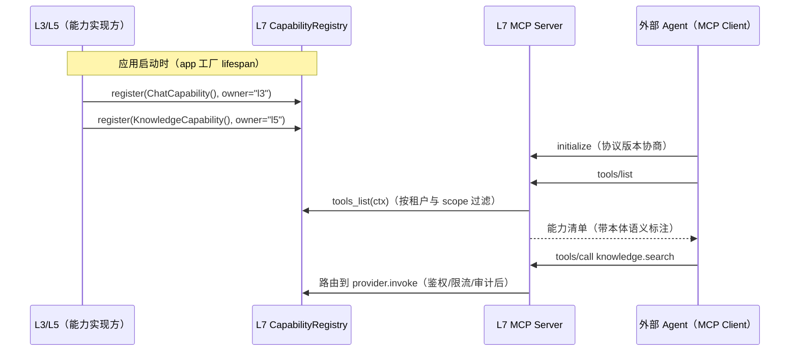

# 07 - 基础层设计

> 状态：v0.1 | 日期：2026-09-26 | 上游依据：[锚点：01-总体架构与分层](./01-总体架构与分层.md)、[研究整理/02-Agent服务与协议](../研究整理/02-Agent服务与协议.md)、[研究整理/05-MCP平台能力](../研究整理/05-MCP平台能力.md)、[研究整理/06-插件与工具集](../研究整理/06-插件与工具集.md)、[架构设计/20-Agent沙箱与执行隔离设计](../架构设计/20-Agent沙箱与执行隔离设计.md)（2026-09-26 旧稿合入）

---

## 1. 职责与依赖禁令

L7 基础层收拢平台全部横切技术能力：模型网关（`llm/`）、MCP 网关（`mcp_gateway/`）、插件运行时（`plugin_runtime/`）、消息（`msg/`）、可观测（`observability/`）、配置（`config/`）、安全（`security/`）。

**依赖禁令**（锚点 §2）：L7 只依赖外部系统，**禁止 import L1~L6 任何模块**。唯一例外是依赖倒置第二处——**MCP 能力注册**（锚点 §3.4）：L7 的 MCP 网关要对外暴露语义层/业务层能力，但方向必须倒置——L7 定义 `CapabilityProvider` 协议，L3/L5 启动时把能力实现**注册**进网关注册表，网关只认协议不认实现。

子模块总览（目录名以锚点 §4 为准）：

| 子模块 | 一句话职责 | 详设章节 |
| ---- | ---- | ---- |
| `llm/` | LiteLLM 封装：complete/stream/embed + 路由 fallback + 预算限流 + 成本落库 | §2 |
| `mcp_gateway/` | server 出口 / client 接入 / 能力注册表 / A2A Agent Card | §3 |
| `plugin_runtime/` | 插件守护进程 + 出网白名单 + 资源配额 | §4 |
| `sandbox_runtime/` | 统一沙箱运行时：agent 会话沙箱 / 插件 / 流水线 / 评测训练环境的供给、隔离与快箱（详设归 [docs/Sandbox](../Sandbox/README.md)，模块 13） | §4 末 |
| `msg/` | 轻量队列封装（Redis 起步，broker 可替换） | §5 |
| `observability/` | OTel traces/metrics/logs + trace 贯穿 + 指标清单 | §6 |
| `config/` | 配置分层加载与校验 | §7 |
| `security/` | 密钥托管、scope、ACL 原语 | §7 |

```python
# services/infra/mcp_gateway/registry.py
@runtime_checkable
class CapabilityProvider(Protocol):
    def capabilities(self) -> list[CapabilityDescriptor]:
        """声明能力：name / description / input_schema / scope_required / 语义标注。"""
    async def invoke(self, name: str, params: dict[str, Any], ctx: CallContext) -> CapabilityResult:
        """执行能力调用；ctx 携带 tenant_id / trace_id / 调用方身份。"""

class CapabilityRegistry:
    def register(self, provider: CapabilityProvider, *, owner: Literal["l3", "l5"]) -> None: ...
    def tools_list(self, ctx: CallContext) -> list[CapabilityDescriptor]:  # 按租户/授权过滤
        ...
```



## 2. 模型网关 infra/llm/

基于 **LiteLLM** 封装（研究整理 02 结论：生产级首选）。内部统一 OpenAI Chat Completions 兼容口径；为 Claude 保留**直连通道**吃 prompt caching。

### 2.1 统一接口

```python
# services/infra/llm/gateway.py
class ModelGateway(Protocol):
    async def complete(self, req: CompletionRequest) -> CompletionResponse: ...
    async def stream(self, req: CompletionRequest) -> AsyncIterator[CompletionChunk]: ...
    async def embed(self, texts: list[str], *, profile: str | None = None) -> list[list[float]]: ...

@dataclass
class CompletionRequest:
    messages: list[Message]
    profile: str = "balanced"            # 路由 profile，见 deploy/config/llm.yaml
    tools: list[ToolSchema] | None = None
    response_format: JsonSchema | None = None   # 受约束生成（L5 抽取/对齐依赖）
    max_retries: int = 2
    tenant_id: UUID | None = None        # 预算/限流归因
```

### 2.2 路由与 fallback 策略

| 场景 | profile | 首选 | fallback | 触发条件 |
| ---- | ---- | ---- | ---- | ---- |
| 对话生成（默认） | `balanced` | 租户配置主模型 | 次级模型 | 超时 60s / 429 限流 / 5xx，重试 2 次后切换 |
| 高质量推理（本体候选、抽取、审核摘要） | `reasoning` | Claude 直连（prompt caching） | 主模型 | 同上 |
| 嵌入 | `embedding` | bge-m3 | —（不允许静默换模型） | 维度入 collection 契约（06 篇 §4） |
| 轻任务（分类、对齐判别、摘要） | `light` | 小模型 | — | 成本优先 |

### 2.3 预算、限流与 Claude 直连 prompt caching

- **预算**：按租户双口径（日 tokens / 日美元）计量；80% 预警、100% 自动降级到 `light`、超限拒绝并在响应中提示（可按租户配置放宽）。
- **限流**：按租户 × profile 维度 RPM/TPM，计数在 Redis `rl:*`（06 篇 §6）。
- **prompt caching 策略**（研究整理 02：Claude 系缓存读取折扣计价）：`system` 消息与注入的**本体上下文（TBox 摘要）**打 `cache_control` 断点——这两段在会话内高度稳定，缓存命中率最高；缓存命中量记入 `llm_calls.cache_read_tokens`。
- **成本落库**：每次调用（含失败）写 PG `llm_calls` 表（06 篇 §2.9），字段含 token 双向、缓存读取、成本、延迟、trace_id。

### 2.4 模型配置示例

```yaml
# deploy/config/llm.yaml
default_profile: balanced
profiles:
  balanced:
    primary: openai/glm-4.7
    fallback: [openai/deepseek-v3.2]
    budget: { daily_usd: 50, daily_tokens: 20000000 }
  reasoning:
    primary: anthropic/claude-sonnet-4.6   # 直连通道
    cache_control: [system, ontology_context]   # prompt caching 断点
    fallback: [openai/glm-4.7]
  light:
    primary: openai/glm-4.7-air
embedding:
  model: bge-m3
  dim: 1024          # 改此值必须同步重建 Milvus collection（06 篇 §4）
```

## 3. MCP 网关 infra/mcp_gateway/

四个子模块：`server/`（能力出口）、`client/`（外部接入）、`registry/`（§1 能力注册表）、`a2a/`（Agent Card）。方向性设计依据研究整理 05；能力清单（tools/resources/prompts 全集、语义标注规范）归 [docs/MCP](../MCP/README.md) 设计文档，本文只定工程骨架。

| 子模块 | 职责 | 关键规则 |
| ---- | ---- | ---- |
| `server/` | 平台作为一个 MCP Server 对外（FastMCP 实现，锚点 §3.1） | 能力来自 CapabilityRegistry；动作类 tool 必须带本体语义标注（研究整理 05 §2.1）；所有调用留痕 `tool_invocations` |
| `client/` | 平台作为 Host 接入外部 MCP Server | 注册（stdio/HTTP 参数与凭据托管）→ 发现（`tools/list` 自动拉取）→ 审核（外部工具默认不可信）→ 授权可见性；**熔断降级**：连续失败 5 次或错误率 >50% 开路 30s，半开探测恢复；外部 MCP 不可用不阻塞 Agent 主流程 |
| `registry/` | §1 的 CapabilityProvider 注册表 + 外部 server 元数据 | tools 与本地工具统一进 `tools` 表视图（研究整理 06 §4.5） |
| `a2a/` | A2A v1.0 Agent Card 发布（研究整理 02 §3.2） | `/.well-known/agent-card.json`；skills 映射本体"行动类"实体；支持签名卡 |

**传输与协议版本**：远程 **Streamable HTTP**（`Mcp-Session-Id` 维持会话）、本地 **stdio** 双传输；能力协商兼容 **2025-06-18 / 2025-11-25** 两版规范（Tasks 能力按 2025-11-25 提供、对旧版客户端隐藏），依据研究整理 02/05。

**MCP tool 命名与语义标注规范**：tool 名与 L5 接口同名映射（`{domain}.{action}`：`knowledge.search` / `ontology.validate` / `ontology.reason` / `ontology.query` / `memory.read` / `memory.write` / `action.invoke`，契约见 [05 篇 §2](./05-语义层设计.md)）；resources 用 URI 模板 `onto://{tenant_id}/{ontology_id}/tbox`；动作类 tool 的描述中必须附本体语义标注（对应业务对象、触发规则、所需 scope），这是"可理解、可校验的业务算子"与裸 HTTP 工具的差异点（研究整理 05 §2.1）。

## 4. 插件运行时 infra/plugin_runtime/

采用 **Dify plugin-daemon 模式**（研究整理 06 §4.2）：插件运行时与主应用解耦为**独立守护进程/容器**，是"应用与外部世界的安全桥梁"。

| 机制 | 设计 |
| ---- | ---- |
| 进程形态 | `plugin-daemon` 独立进程（容器化部署时独立 container），主应用与它只走网络/队列，不共享进程空间 |
| 通信协议 | **HTTP**（主应用 → daemon：`POST /invoke/{plugin}` 同步调用，信封携带 tenant_id/trace_id/用户身份）+ **队列**（Redis `q:tasks:*`：异步任务下发与事件回收流，SSE 转发出口在 L2） |
| 沙箱 | **统一经 `infra/sandbox_runtime`（[docs/Sandbox](../Sandbox/README.md)）供给**：插件是沙箱的首批场景之一（S1），会话沙箱（S0，agent 启动即用的执行底座）与评测/训练环境共用同一抽象与 fail-closed 信任级映射 |
| 出网白名单 | 插件清单声明 `network_allowlist`（域名/IP+端口），daemon 出口代理强制校验，默认全禁 |
| 资源配额 | 每插件 CPU/内存/并发/单次调用超时（默认 30s）限额，超限终止并上报 `tool_invocations.status=quota_exceeded` |
| 安装流程 | 上架审核（研究整理 06 §4.4：自动门禁→人工审核→签名）通过后由 L3 `plugin_lifecycle` 经 daemon 拉起/停用 |

主应用与 daemon 的调用信封（HTTP body 契约，队列异步调用复用同一结构）：

```json
{
  "invoke_id": "uuid",
  "tenant_id": "uuid",
  "trace_id": "w3c-trace-id",
  "plugin": "jira-adapter@1.2.0",
  "tool": "create_issue",
  "params": {},
  "identity": { "user_id": "uuid", "scopes": ["tool:invoke"] },
  "deadline_ms": 30000
}
```

### 4.1 执行后端与出口控制（2026-09-26 07合入）

> 上游依据：[研究整理/07 §7.5](../研究整理/07-Harness-Agent解剖与本体骨架.md)、[Agent/02-Agent内核与能力层划分设计](../Agent/02-Agent内核与能力层划分设计.md)（内核/能力层划分裁决权威）、[Skills 篇 §3.4 四通道能力层](../Skills/技能与插件设计.md)（能力侧细则）。

- **`execution.backends` 是八循环扩展点之一，走 L3 内置扩展点通道**（平台原生 Python API、随版本发布）：沙箱后端实现可插拔替换，但**出口控制（Agent/02 B4）与审批路由（B5）是内核机制，不随后端走**。后端协议（`SandboxBackend` Protocol）与候选矩阵详设见 [docs/Sandbox §4.2](../Sandbox/沙箱与执行环境设计.md)。
- **v1 仅 Docker Compose 后端**（deploy compose）；DSec 四后端（docker / fncall 预热池 / microVM / remote 云突发）与微 VM（Firecracker）按任务选型列 **v2 评估**——参照研究整理 07 §7.5 与 Hermes 7 终端后端调研（local / Docker / SSH / Modal / Daytona / Vercel 等，Agent/02 §6 参照表）。
- **出口控制三原则**（细则引 Skills 篇 §3.4 / §5；运行时权威为 [docs/Sandbox §6](../Sandbox/沙箱与执行环境设计.md)）：
  1. **默认无网**：L0/L2 不可信容器 `network: none`，无外网路由，数据不经容器自行出站；
  2. **宿主白名单代理**：数据经宿主侧出口代理显式传递，确需出网的包逐个人工放行静态 IP/域名（eBPF 级"任务级、可动态变更、默认拒绝"语义列 v2）；
  3. **权限与进程身份解耦**：权限判定只认平台 scope + ACL，与容器内进程身份（uid、是否 root）无关（AppArmor 教训）。
- **沙箱代码行动类（executionMode=code）**：执行走**最严出口**（默认无网 + 白名单代理）且**产物过 shape 校验**后方可写回——裁决权威见 Agent/02 篇 §3 表末行。
- **环境快照工件化（v2 评估位登记，2026-09-26 旧稿合入）**：任务环境的可写层 diff 固化为**版本化工件**、可批量还原为新沙箱（pack_diff 精神；配套两段式治理——构建/运行账号隔离 + 打包前残留清理）。细则见 [docs/Sandbox §8.2](../Sandbox/沙箱与执行环境设计.md)——v1 随休眠/检查点用 `docker diff` 粒度，块级增量与工件目录列 **v2 评估**（对齐本节既有 v2 位）。
- **`cli-harness-runner` 后端候选登记（2026-09-26 旧稿合入）**：旧稿定稿的通用执行器——CLI 驱动外部 harness（CLI-hub 件等 cli-harness 三轨插件）在沙箱内执行，内置命令分级审批路由与输出归一（强制 JSON + 64KB 截断）。v1 作为 plugin-daemon 内执行器跑在 docker 后端之上（非独立后端）；**登记为 `execution.backends` 扩展位候选**，是否随 cli-harness 负载升格为独立后端列 v2 评估。

## 5. 消息与队列 infra/msg/

| 机制 | 设计 |
| ---- | ---- |
| 起步实现 | Redis List（`q:tasks:{priority}`，06 篇 §6）+ pub/sub（事件广播） |
| 投递语义 | at-least-once：消费方必须幂等（任务以 `tasks.idempotency_key` 去重） |
| 统一 API | `enqueue(queue, payload, *, priority, idempotency_key, trace_id)` / `consume(queue, handler)`；payload 信封必带 `tenant_id` 与 `trace_id` |
| 演进 | 接口按 broker 抽象（Protocol），后续引入 RabbitMQ/Kafka 只换实现不改调用方（锚点 §3.1：重任务后续引 broker 再议） |
| 与 outbox 的关系 | outbox relay 是"PG 权威→外部投影"的通道（06 篇 §8）；`msg/` 是运行期任务通道——二者不混用，投影不走任务队列 |

### 5.1 事件信封 schema（2026-09-26 旧稿合入）

Outbox relay 发布到 Redis Stream（`events:{tenant_id}`，03 篇 §6.2）时的**跨进程线格式**（wire format）：

```json
{
  "event_id": "0197c7a2-8f3e-7d10-9a2b-3c5d6e7f8091",
  "tenant_id": "0197b100-4a55-7c21-8d90-1e2f3a4b5c6d",
  "event_type": "ontology.published",
  "event_version": 1,
  "aggregate_type": "ontology",
  "aggregate_id": "0197c700-ab12-7c34-9de0-11a22b33c4d5",
  "occurred_at": "2026-09-26T08:30:00Z",
  "trace_id": "7bf3a1e0c2d94e5f8a6b7c8d9e0f1a2b",
  "payload": { "ontology_id": "kb-001", "version": 3 }
}
```

- 字段与 [04 篇 §6](./04-领域层设计.md) `DomainEvent`（event_id / tenant_id / aggregate_type / aggregate_id / occurred_at / event_type）逐一对齐；信封在此之上补跨进程三件：`event_version`（事件结构版本，03 篇 §6.2 outbox 列）、`trace_id`（贯穿，§6）、`payload`（L4 事件序列化）；
- `event_id` 用 **UUIDv7**（时间有序，03 篇 §6.2），是消费端幂等去重与 relay 投影去重的唯一依据；
- 事件结构只增不改（04 篇 §6 载荷原则），信封同规。

### 5.2 Outbox relay 实现参数默认值（2026-09-26 旧稿合入）

框架与表结构以 [03 篇 §6.2](./03-业务层设计.md) 为权威（**M4 引入**：进程内后台任务轮询 `published_at IS NULL` → 发布 → 回写），此处只补实现参数**默认值（初值，均可配）**：

| 参数 | 默认值 | 说明 |
| ---- | ---- | ---- |
| 轮询间隔 | 1000ms | 空转走部分索引，开销可忽略 |
| 单批投递量 | 100 条 | 走 `idx_outbox_unpublished`（03 篇 §6.2） |
| 选主锁 | Redis 锁，TTL 30s、持锁续期 | 多实例时单 worker 投递防重（03 篇 §6.2 已裁决选主）；键模式对齐 06 篇 §6 `lock:{resource}:{id}`；锁丢失即退避避让，不抢投 |
| 投递失败重试 | 5 次，指数退避 | 耗尽 → 死信 + 告警（对齐 08 篇 §5「outbox 投影」行） |
| 幂等回写 | 投递成功才回写 `published_at` | 回写前崩溃 → 事件重投，由**消费端按 event_id 去重**兜底（at-least-once，03 篇 §6.2） |
| 保序 | 同一 `aggregate_type + aggregate_id` 按 id 保序 | 03 篇 §6.2 分区投递 |

铁律不变：**绝不因投递失败回滚主事实**（03 篇 §6.2、06 篇 §8）；存储投影 relay（Neo4j / Milvus / MinIO，06 篇 §8）复用同一套参数与幂等策略。

### 5.3 任务注册表与队列命名规范（2026-09-26 旧稿合入）

- **统一注册**：一切后台任务在注册表登记——任务名 / 队列 / 触发 / 超时 / 重试 / 幂等键；新任务不登记不入队（对齐 04 篇 §6.1「新增事件必须登记」的同一纪律）。任务体仍在 L3 业务编排层实现，`msg/` 只管注册与装配（§1 依赖禁令）；
- **队列命名对齐既有约定，不另起键空间**：平台级轻任务用 `q:tasks:{priority}`（06 篇 §6），priority 取 **online / idle 两档**（对话路径 vs 可延迟后台，空闲闸门调度策略见 [docs/memory §9](../memory/多层记忆设计.md)）；域级流水线队列按 `{域}:queue:{tenant_id}` 命名（kb 先行：`kb:queue:{tenant_id}`，03 篇 §4——租户内并发默认 3、平台总并发默认 50）；
- **任务框架选型（登记）**：旧稿《12-基础层详细设计》定稿 ARQ（async 原生、基于 Redis；Celery 同步模型与 FastAPI 混用不取）——合入为 Redis 阶段 worker 框架候选；引入时只作为 `msg/` 内部实现替换（统一 enqueue/consume API 与 06 篇 §6 键空间不变，调用方零改动），上表「演进」行的 broker 抽象（Protocol）位不变；
- **通用规则**：重试耗尽 → 失败事件 + 通知；可延迟任务带 deadline，到期未执行升入 online 档（docs/memory §9.1）；消费方幂等（`tasks.idempotency_key` + Redis `idem:*` 双落，08 篇 §5）。

初版任务注册表（随实现增补）：

| 任务 | 队列 | 触发 | 超时 | 幂等键 |
| ---- | ---- | ---- | ---- | ---- |
| kb 流水线各步（预处理/抽取/对齐/校验） | `kb:queue:{tenant_id}` | 上一步完成（03 篇 §4） | 10 / 60 / 20 / 10 min（03 篇 §4 超时预算） | document_id + step（checkpoint 断点续跑，03 篇 §4） |
| memory 沉淀三步（抽取→冲突判定→分级写入） | `q:tasks:idle` | session.closed（04 篇 §6.1） | 30 min/步（初值） | session_id + 任务类型（docs/memory §9.1） |
| memory 衰减扫描 | `q:tasks:idle` | cron 定时 | 10 min（初值） | 扫描窗口起止 |
| outbox relay | 进程内常驻后台任务（不走任务队列） | M4 起常驻 | —— | event_id（§5.2） |

### 5.4 队列确认语义（2026-09-26 管线审计 P0 修复）

`q:tasks:*` 与 `kb:queue:*` 的 worker 取任务一律走 **BRPOPLPUSH 到 `{queue}:pending:{worker}`**（或升级为 Redis Stream 消费组 XACK），配套三条纪律：

- **心跳租约**：worker 每 30s 刷新 pending 项的 lease；lease 过期（默认 120s）由回收任务重投原队列，计数重投次数；
- **显式确认**：处理成功才 LREM 删除 pending 项；失败按步级重试策略处理，耗尽进死信 `{queue}:dead`；
- **可见性**：pending 队列深度与 dead 深度进 §6 指标（`queue_pending_depth`/`queue_dead_depth`）——解决"worker 弹出即失联任务丢失"的地基缺口。

**llm_calls 批量写（2026-09-26 痛点优化，P1）**：LiteLLM 逐请求直写 spend/审计表是官方自认瓶颈（≈1k rps 打满 PG）。本平台 llm_calls 改**内存聚合+异步批量落库**（缓冲 1s 或 100 条先到者 flush；进程崩溃容忍 ≤1s 计费明细丢失，由 LiteLLM 侧成功回调幂等补偿）；预算/限流判断走 Redis 计数器热路径，PG 只做冷账本；月分区已有。

## 6. observability/

> **2026-09-26 观测审计修复**：本节指标清单按 SLO 闭环与业务可观测补齐（Prometheus 命名，`_seconds` 直方图 / `_total` 计数 / gauge）。**SLO 埋点三件**：`http_server_request_duration_seconds{route,status,tenant}`（L2 ASGI 中间件）、`chat_ttft_seconds{tenant,model}`（SSE 编码器首 token 时刻）、`sse_connections_active`+`sse_reconnect_total{reason}`+`sse_write_buffer_bytes`（L2 sse/；末项为每连接写缓冲水位 gauge，慢消费者背压观测位——超限先告警后断开策略见 [02 篇 §5](./02-网关层设计.md)，2026-09-26 痛点优化）。**北极星采集**：写回 succeeded + ABox 更新 + 回流校验通过时发领域事件 `task.loop_closed`（登记入 04 篇 §6.1 事件表），Outbox 侧计数 `closedloop_task_completed_total{tenant,outcome}`=周活跃闭环任务数。**管线过程指标**：`agent_step_duration_seconds{phase}`（kernel 状态机迁移点）、`gate_latency_seconds{gate}`、`approval_wait_seconds{risk_level,tier}`、`review_queue_depth`+`review_wait_seconds{target_type}`、`writeback_ledger_rows{status}`+`writeback_unknown_age_seconds`+`writeback_recon_diff_total{diff_type}`、`outbox_pending`+`queue_pending_depth`+`queue_dead_depth`、`retrieval_answer_with_evidence_total`、`kb_pending_documents{tenant}`（待索引文档数）、`plugin_runtime_failures_total{plugin}`/`plugin_latency_p99{plugin}`（市场运行期评分）、`rag_no_evidence_answer_rate` 等在线 RAG 四率（定义见 08 篇 §7.4）、派生四项（`ontology_closure_size_triples`/`materialize_duration_seconds`/`projection_cache_hit_ratio`/`focus_node_eval_seconds`，兑现 ontology/02 §6）。**指标基数防护（P2）**：标签禁用高基维度（user_id/message_id/session_id 一律不入指标标签，只进日志/trace）；单指标基数 >1k 告警、>10k 拒绝采集（防 Prometheus 崩溃）。

**Logs 小节（新增纪律）**：结构化 JSON（ts/level/tenant/trace_id/msg/kv），级别策略 DEBUG(仅 dev)/INFO/WARN/ERROR；**脱敏红线**：运行日志中的 LLM prompt 与工具入参一律截断 200 字符 + `params_digest` 哈希（同 08 篇 §3 audit 口径），禁止整段落盘；保留：热 14 天/冷 90 天。**Traces 补充**：最小 span 集=chat_run/retrieve/gate/llm_call/tool_call/outbox_relay，SSE 断线重连续原 trace（traceparent 随重连带回）；对话全量采样仅 dev，生产按 10% 起步（采样率待实测冻结）。


OTel 三件套（traces/metrics/logs）统一接 OpenTelemetry SDK；后端导出 OTLP（本地起步可导出到文件/Jaeger，生产观测后端以 ops/02 §2.4 选型为准（Prometheus+Grafana+Alertmanager，不引入商业 APM））。

**trace_id 贯穿 L1→L7 的传递机制**：L1 前端生成 W3C `traceparent` 头 → REST/SSE 请求带出 → L2 中间件解析（无则新建 root span）→ 存入 `TraceContext`（ContextVar）→ 各层透传：L7 调外部模型/外部 MCP 时写入出站 HTTP 头；投递插件 daemon 时写入调用信封；任务异步链路写入 `tasks.payload.trace_id` 并在 worker 侧恢复为父 span。日志统一带 `trace_id`/`tenant_id` 字段，一条请求可全链检索。

**指标清单**（命名按 OTel 语义约定）：

| 类别 | 指标 | 标签 |
| ---- | ---- | ---- |
| LLM 成本 | `llm_calls_total`、`llm_tokens_total`、`llm_cost_usd_total`、`llm_latency_seconds`（histogram）、`llm_cache_hit_ratio` | tenant、model、profile、kind、status |
| MCP 调用 | `mcp_tool_calls_total`、`mcp_tool_latency_seconds`、`mcp_circuit_state`（0=closed/1=open/2=half-open） | tenant、tool、direction（out/in）、status |
| 检索降级 | `kb_retrieval_latency_seconds`、`degraded_retrievals_total` | tenant、mode、degraded |
| 任务 | `task_duration_seconds`、`task_retry_total`、`outbox_dead_total` | task_type、status |
| 插件 | `plugin_invoke_total`、`plugin_quota_exceeded_total` | plugin_id、tenant |

## 7. config/ 与 security/

**配置分层**（优先级从低到高）：代码默认值（pydantic-settings Field default）→ 环境变量（统一前缀 `OA_`，如 `OA_DATABASE_URL`）→ `.env` 文件（gitignore，仅本地开发）。所有配置项集中在 `infra/config/settings.py` 的 pydantic Settings 类，启动时校验，缺关键配置 fail-fast。

**密钥托管原则**：密钥（模型 API Key、数据库口令、插件凭据、JWT 签名密钥）一律**不落代码库**；本地开发用 `.env`（不入库）；生产经 secret 管理系统（Vault / 云 KMS / 部署平台密钥注入）下发到进程环境；外部 MCP 与插件的凭据托管在 `security/` 提供的加密存储（信封加密，主密钥来自 secret 管理）。`deploy/.env.example` 只含变量名与占位符。

## 8. 验收标准

1. 架构守护测试（import-linter）断言：`infra` 包零 import `gateway/business/domain/semantic/data`；
2. CapabilityProvider 契约测试：L3/L5 注册的能力经 MCP `tools/list` 可见、`tools/call` 可达，且按租户 scope 过滤正确；
3. 模型网关：fallback 注入演练（首选模型 429）自动切换；每次调用 `llm_calls` 落库含缓存读取量；
4. MCP client 熔断演练：外部 server 连续失败进入 open 态，主对话流程不受阻塞，恢复后半开探测通过；
5. 插件沙箱：白名单外出网被拒、配额超限被终止，两者均留 `tool_invocations` 痕迹；
6. trace 贯穿：从 L1 发起的一次对话，L7 出站调用头中 `traceparent` 与 L1 生成值同 trace_id。

## 9. 待办与开放问题

- [ ] import-linter / 依赖守护工具选型落地（CI 强制 L7 零向上依赖）
- [ ] LiteLLM vs 直连 SDK 的封装边界评审（Responses API 跟进策略，研究整理 02 待办联动）
- [ ] A2A Agent Card 与本体"行动类"的映射规范（研究整理 02 待办联动，归 docs/MCP）
- [x] ~~沙箱威胁模型分析：Docker 网络策略 vs gVisor/Firecracker~~（2026-09-26 升格为模块 13 统一沙箱运行时：fail-closed 信任级映射 + 隔离矩阵 + 容量核算，见 [docs/Sandbox](../Sandbox/README.md)；gVisor/microVM 定为 v2 后端，不可达即拒绝）
- [ ] secret 管理系统选型（Vault vs 部署平台内置密钥管理）
- [ ] 语义缓存（相同检索问题复用 LLM 结果）的成本收益评估
