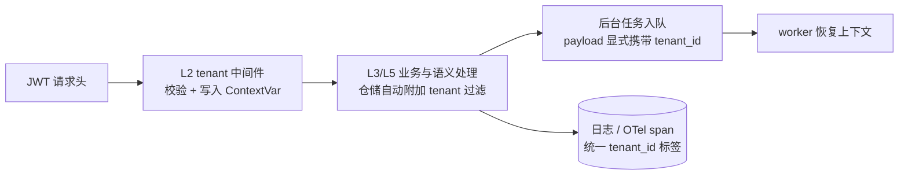
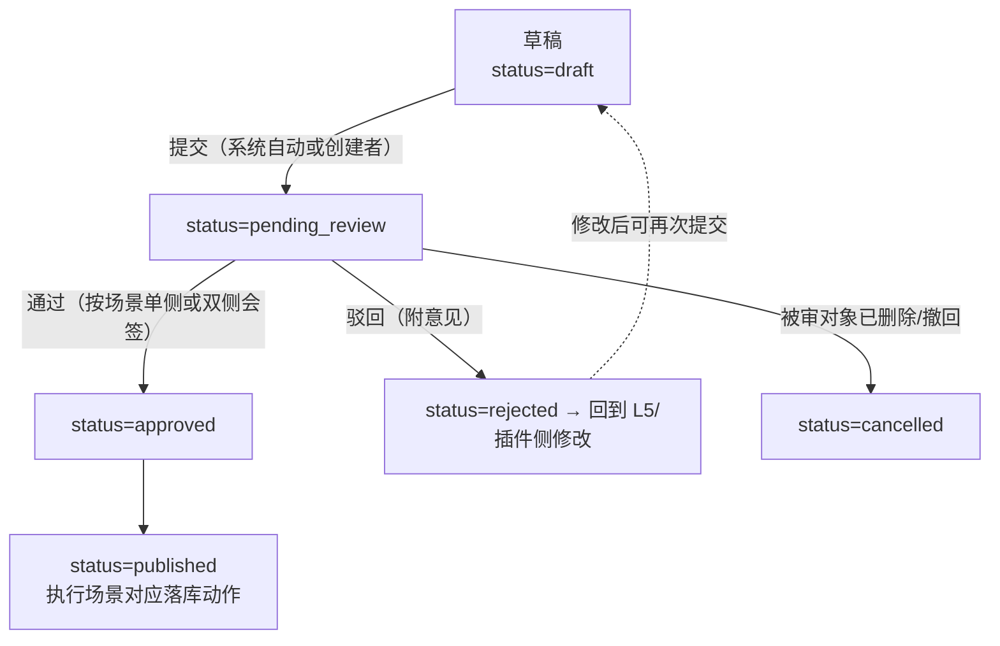

# 08 - 横切关注点与工程规范

> 状态：v0.2（含 2026-09-26 评审修订） | 日期：2026-09-26 | 上游依据：[锚点：01-总体架构与分层](./01-总体架构与分层.md)、[研究整理/05-MCP平台能力](../研究整理/05-MCP平台能力.md)、[研究整理/03-知识库与本体核心](../研究整理/03-知识库与本体核心.md)、[研究整理/06-插件与工具集](../研究整理/06-插件与工具集.md)、[评审记录 2026-09-26](./评审-2026-09-26-多专家研讨与行业痛点批判.md)

---

## 1. 多租户

隔离级别总表（存储职责见 [06 篇](./06-数据层设计.md)）：

| 存储 | 隔离机制 | 强制点 |
| ---- | ---- | ---- |
| PostgreSQL | 行级 `tenant_id` 列；仓储层强制过滤；RLS 作兜底（待评估，06 篇待办） | `repo_impl` 一切查询带 `tenant_id`；业务表唯一索引含 `tenant_id` |
| Neo4j | 单库 + 节点/关系 `tenant_id` 属性 + 复合索引 | Cypher 由客户端构建器生成，强制 `WHERE n.tenant_id = $tenant_id` |
| Milvus | partition key = `tenant_id` + 标量过滤双保险 | 检索表达式必须含租户过滤 |
| MinIO | bucket 内 key 前缀 `{tenant_id}/` | 预签名 URL 按 key 前缀授权 |
| Redis | key 内嵌 `{tenant_id}` 前缀 | 客户端封装统一拼装，业务代码禁止手拼 key |

**租户上下文的注入与传播**：JWT（含 `tenant_id` claim）→ L2 中间件校验后写入 `TenantContext`（`contextvars.ContextVar`）→ L3/L4/L5/L6 从上下文读取，仓储自动附加过滤 → 后台任务（抽取/索引/审核）在入队时把 `tenant_id` 显式写进 payload，worker 侧恢复上下文 → 日志与 OTel span 统一带 `tenant_id` 标签。



## 2. 认证与授权

### 2.0 认证通道

| 通道 | 主体 | 凭据 |
| ---- | ---- | ---- |
| 前端/CLI | 用户 | JWT（access + refresh，§2.1） |
| 外部 Agent / 平台外系统 | 机器 | API Key（`api_keys` 表，仅存哈希；经 MCP 网关调用） |
| agent 工具 ↔ 后端 | 平台托管运行时 | 内部短时 JWT（网关签发，TTL ≤ 5min） |

### 2.1 JWT claims 设计

| claim | 类型 | 说明 |
| ---- | ---- | ---- |
| `sub` | UUID | 用户 id |
| `tenant_id` | UUID | 租户 id（租户上下文唯一来源） |
| `roles` | string[] | 角色码（admin / ontologist / curator / member / guest——2026-09-26 评审修复G：与 §2.2 权威定义一致，旧码 knowledge_engineer/business_expert/developer 作废；平台级保留角色 super_admin 另行签发） |
| `scopes` | string[] | 展平后的权限集（§2.3），网关据此做声明式鉴权 |
| `typ` | string | `access` / `refresh` |
| `jti` | UUID | 令牌唯一 id（吊销黑名单在 Redis，TTL=剩余有效期） |
| `iat` / `exp` | int | access 默认 2h，refresh 默认 14d |

### 2.2 RBAC 角色矩阵

R=读 C=建 U=改 D=删 A=审核（approve/reject）P=发布。空格=无权限。

| 资源 \ 角色 | admin（租户管理员） | ontologist（知识工程师） | curator（业务专家） | member（开发者） | guest（访客） |
| ---- | ---- | ---- | ---- | ---- | ---- |
| 租户/用户/密钥管理 | R C U D | — | — | — | — |
| Agent 配置 | R C U D | — | R | R C U D | — |
| 会话与对话 | R D | R | R | R C U D | R（仅公开入口） |
| 知识库与文档 | R C U D | R C U D | R C（提交） | R | R（经检索工具） |
| 本体建模与版本 | R C U D | R C U（提交变更单） | R A（业务评审） | R | — |
| 审核工单 | R A | R A（规则侧） | R A（业务侧） | — | — |
| 记忆 | R D | R | R | R C U D（本人） | — |
| 插件市场 | R C U D A P | R | R | R C（发布者提交） | R |
| 工具与外部 MCP 配置 | R C U D | R | — | R C U（本人接入） | — |
| LLM 预算与成本报表 | R | — | — | — | — |


**角色标识（权威定义）**：角色码统用英文 id，前后端与 JWT `roles` claim 一致；本表中文称呼为别名。`admin`=租户管理员、`ontologist`=知识工程师、`curator`=业务专家、`member`=开发者、`guest`=访客（仅公开入口）。另有平台级保留角色 `super_admin`（跨租户运维：租户生命周期、全局模型网关），不进本矩阵、拥有全部 scope。前端路由守卫按同一套 id 判断（见 docs/frontend/02 篇路由表）。

规则：知识工程师与业务专家构成研究整理 03 §2.4 的**双负责人**机制（变更单两侧都要签；此为 **enterprise 档审批链行为**，team/solo 档差异见 §2.4 治理档位——2026-09-26 评审修订）；角色只给粗粒度边界，精确控制靠 scope。**角色决定资源权限，审批流程强度由治理档位决定，二者正交**（§2.4）。

落库映射：矩阵评审通过后直接转为 `roles.scopes` 种子数据——**种子唯一走 Alembic 数据迁移（`m1_seed_roles_and_admin`，2026-09-26 评审修复G：统一种子时序，不走 deploy/init-pg）**，角色码与本表一致；新增资源时先增 scope、再改本矩阵，禁止在代码里硬编码角色判断。

### 2.3 声明式 scope 模型

命名 `resource:action`，action 取固定集合：`read / write / delete / invoke / publish / approve / admin`。

匹配规则：精确匹配、不支持通配符（避免权限扩散）；**deny-by-default**（未声明即拒绝）；API Key 的 scopes 必须是其 owner 用户 scopes 的子集。

| scope 示例 | 授予 |
| ---- | ---- |
| `kb:read` / `kb:write` | 知识库读写 |
| `ontology:write` / `ontology:publish` | 本体修改（进变更单）/ 版本发布 |
| `review:approve` | 审核决策权 |
| `memory:read_l2` / `memory:write_l2` | 记忆按层授权（研究整理 05 `memory.read/write`） |
| `tool:invoke` / `tool:admin` | 工具调用 / 外部 MCP 管理 |
| `plugin:install` / `plugin:publish` | 插件安装 / 发布 |
| `action:invoke` | 业务动作回写（高风险动作叠加二次确认，研究整理 05 §2.2） |

**安全红线**：MCP tool 的 `annotations`（readOnlyHint / destructiveHint 等）属**不可信元数据**，仅作前端 UI 提示（如红标危险按钮），**一律不作为授权判断依据**——授权只认平台侧 scope 与 ACL（研究整理 05/06 明确引 MCP 官方安全原则；`tools.annotations` 字段在 06 篇表结构中已注明）。

### 2.4 治理档位（governance_tier，全平台权威定义）

> **2026-09-26 评审修订**（锚点 §6.8；评审记录 §5.2 F2、§6 P1「治理档位设计」）：审核门禁强度按租户治理档位分级。**本节是全平台权威定义**——03 篇审核工作流、docs/ontology、docs/Otghrag、docs/memorry 等一律引用本节，不在各自文档重复定义。

**档位取值**：`governance_tier ∈ {solo, team, enterprise}`，**租户级配置**（存 `tenants.settings`，仅 admin 可改；配置变更本身进审计日志，见 §3）。

三档审批链差异：

| 档位 | 审批链 | 高置信候选处理 | 适用租户 |
| ---- | ---- | ---- | ---- |
| solo | 提交人即审批人 | 高置信度**自动通过**（必须留痕、可回滚，见共同底线） | 个人/小团队 |
| team | 单审批人 | 人工审批 | 团队 |
| enterprise | 双负责人 + 四眼原则 | 人工审批（抽样率按锚点 PoC ② 校准结果配置） | 企业组织 |

**共同底线（三档都不破，「候选非成品」门禁锚点 §6.5 三档等效）**：

1. **自动通过必须留痕**：`audit_logs` 记录自动判定依据（命中规则/模板）与置信度，等同一笔审批决策可查（§3）；
2. **自动通过必须可回滚**：自动生效的候选与人工批准的候选同回滚范围（如本体变更单回滚）；
3. **全程可追溯**：档位配置变更、自动判定、人工审批全部落审计；
4. **OntologyGate 类硬门禁任何档位不可跳过**：确定性校验（SHACL/一致性/不变式，落 L4 `domain/services`）是正确性底线——档位只调节**审批链强度**，不调节确定性校验。

**自动通道的开放条件**：自动通过的置信度阈值 = **各模块 PoC 校准后冻结**（本体/抽取阈值由锚点 PoC ② 抽取置信度校准产出）；**未冻结前 solo 档也不开自动通道**（防未校准置信度「静默放水」，评审记录 §3 C-P0）。

**与 RBAC 的关系**：档位决定**流程强度**（审批链层级、是否允许自动通过），角色决定**资源权限**（§2.2 矩阵），二者正交；scope 模型（§2.3）不变——`review:approve` 等 scope 的授予不随档位变化：solo 档下提交人持有该 scope 即可自审，team/enterprise 档由流程约束审批人资格。

## 3. 审计

必须审计的事件清单：

1. 认证类：登录成功/失败、登出、API Key 签发/吊销、权限与角色变更；
2. 治理类：本体变更单状态流转、版本发布/回滚、审核工单决策（谁批了什么）、治理档位自动通道的自动判定（依据与置信度，§2.4——2026-09-26 评审修订）；
3. 执行类：**所有工具调用**（含外部 MCP 与插件）、业务动作 `action.invoke`、高风险动作的人工确认记录；
4. 数据类：文档上传/删除、原始文档下载/导出、记忆 L2→L3 升级、插件上架/下架/启停、配置变更。

表结构：PG `audit_logs`（字段见 [06 篇 §2.9](./06-数据层设计.md)），**只追加**，无更新/删除接口。

脱敏规则：`params_digest` 存参数摘要而非原文；密码、token、密钥类字段只存哈希与长度；一般工具入参存键名 + 值截断；高风险动作（`action:invoke` 类）按合规要求存全量参数快照（信封加密，密钥在 `infra/security/`）。

保留策略：在线热数据 90 天，之后转冷归档（对象存储导出）保存 ≥3 年；合规要求更高的租户可在 `tenants.settings` 调整，不允许调低。

## 4. 审核工作流横切（候选非成品门禁）

平台宪法之一（锚点 §6.5）：LLM 产物一律候选，人工终审后才是权威数据。统一由 L3 `business/review_workflow` 承载（流程状态机详设归 [03 篇](./03-业务层设计.md)），工单模型为 PG `review_tickets`（06 篇 §2.6）。

四处场景共用同一个状态机与同一张工单表，只按 `target_type` 区分：



> 2026-09-26 评审修复G：状态机图与下表状态口径统一对齐 [03 篇 §5](./03-业务层设计.md) 六态权威（draft/pending_review/approved/rejected/published/cancelled）——原 `withdrawn`（撤回）并入 cancelled、`applied`（已执行）由 published 取代；**approved 不等于生效，只有 published 才生效**。

| 场景 | 候选来源 | 通过后动作 | 审核人（依据 §2.2 矩阵） |
| ---- | ---- | ---- | ---- |
| 本体候选 | L5 抽取/LLM 生成的类、属性、公理（`ontology_changesets.status=in_review`，changeset 状态为权威、工单是流程壳） | 工单 `published`（同事务联动 changeset in_review→published，03 篇 §5 豁免②）→ 版本发布流水线（n10s 重建物化） | 知识工程师 + 业务专家（双负责人） |
| 知识实例 | 抽取流水线的候选三元组 | 工单 `published` → ABox 写入 Neo4j + 向量入库 | 知识工程师 |
| 记忆 L2→L3 升级 | 用户级记忆的共享候选（默认不自动升级，研究整理 04 §3.1） | 工单 `published` → 写入组织级时序图 + `memory_l3_edges` 账本 | 业务专家（或团队管理员） |
| 插件上架 | 发布者提交（server.json + 包 + 扫描报告） | 工单 `published` → `plugin_versions.status=published` → 工具注册 | admin（敏感类目）+ 自动门禁前置 |

> **2026-09-26 评审修订（与治理档位对齐）**：上表「审核人」列与状态机中「单侧或双侧会签」描述的是 **enterprise 档行为**；team（单审批人）与 solo（提交人即审批人，高置信自动通过）档的审批链差异见 §2.4 治理档位。三档共用本状态机与同一张工单表，仅审批人解析规则不同；OntologyGate 等硬门禁与「自动通过留痕/可回滚/可追溯」底线任何档位一致。

## 5. 错误处理与降级矩阵

| 依赖 | 失败模式 | 平台行为 | 用户感知 | 观测 |
| ---- | ---- | ---- | ---- | ---- |
| LLM（经模型网关） | 超时 / 429 / 5xx | 自动重试 2 次 → fallback 降级模型（07 篇 §2.2）；预算超限降级 `light` | 回答延迟升高或模型切换提示 | `llm_calls.status`、fallback 计数 |
| 检索（Neo4j 不可用） | 图查询失败 | `knowledge.search` 降级为纯向量检索，`degraded=True` | 回答附"证据链暂缺"标注 | `degraded_retrievals_total` |
| 检索（Milvus 不可用） | 向量检索失败 | 退化为纯图检索（实体邻域 + 社区摘要）；全不可用→跳过上下文并在回答中标注 | 回答质量下降且有提示 | 同上 |
| 外部 MCP / 插件 | 连续失败 / 超时 | 熔断开路 30s（07 篇 §3），工具置不可用；**不阻塞主流程**，Agent 收到工具失败事件可换路 | 该工具暂时不可用 | `mcp_circuit_state` |
| Redis | 不可用 | L1 工作记忆退化为 PG messages 直读（降级窗口内只保留最近 N 条）；限流退化为进程内计数 | 会话记忆召回变短 | 告警 |
| MinIO | 不可用 | 上传/附件功能拒绝（503）；本体制品读取走 Redis 缓存兜底 | 文件类操作暂不可用 | 告警 |
| outbox 投影 | 持续失败 | 指数退避 → `dead` + 告警，人工补偿重放（06 篇 §8） | 图/向量数据短暂滞后 | `outbox_dead_total` |

原则：**主对话链路永不因辅助依赖失败而中断**；一切降级必须在响应/回答中显式标注，禁止静默降级。

通用降级纪律：

1. 所有重试在请求 deadline 内进行（**对话总预算 60s**，策略可配，ChatPolicy 注入；**TTFT 3~5s 判超时**——对齐 03 篇 §3。2026-09-26 评审修复G 统一口径，原 30s 作废），禁止无限重试；
2. 可重试的写操作必须幂等（携带 `idempotency_key`，PG `tasks` 与 Redis `idem:*` 双落）；
3. 每次降级产生三件套：日志、指标（`degraded_*`）、回答/响应中的显式标注；
4. 熔断与降级状态变更经 L2 SSE 事件通知前端展示（AG-UI 事件语义）。

## 6. 可观测与成本治理

指标清单见 [07 篇 §6](./07-基础层设计.md)。成本治理规则：

| 规则 | 阈值/动作 |
| ---- | ---- |
| 日预算预警 | 达 80% 通知租户管理员 |
| 日预算触顶 | 自动降级 `light` 模型；超限拒绝新调用（可配置放行） |
| 月度成本归因 | 按 租户 / agent / 工具 / profile 维度出报表（数据源 `llm_calls` + `tool_invocations`） |
| 异常检测 | 单租户 token 消耗环比 >3x 触发人工核查（防滥用/注入攻击放大） |

告警分级：

| 级别 | 触发示例 | 通知方式 |
| ---- | ---- | ---- |
| P0 | 五存储任一不可用、outbox dead 积压 >100 | 值班电话/短信 |
| P1 | 租户预算触顶、MCP 熔断 open、降级事件率突增 | IM 群机器人 |
| P2 | 降级事件汇总、慢查询、配额接近 | 日报邮件 |

## 7. 评估体系（评估驱动）

> **2026-09-26 评审修订**（锚点 §6.9；评审记录 §3 C-P1「全平台缺端到端评估基准」、§5.1 C4）：没有度量就没有优化。模型/本体/检索/提示词的任何调优必须有评估基线支撑，禁止「凭感觉回归」。

### 7.1 评估基准（三类）

| 基准 | 构成 | 指标 |
| ---- | ---- | ---- |
| 检索质量 golden QA 集 | 按检索模式（local / global / drift）**分层**构建问题—金标答案—金标证据；种子场景 = **电力停电分析**（锚点 §7 钦定首个行业场景），随场景扩展逐模式补齐 | 引用率、答案忠实度、检索命中率 |
| Agent 任务成功率基准 | 按任务类型登记：任务类型 × 成功判据（可自动判定：脚本断言或判定模型 + 人工抽检）× 基线通过率 | 任务成功率（对比基线） |
| 抽取精确率抽检 | 金标集 **≥500 条**（与锚点 PoC ② 抽取置信度校准**共用同一金标集**），按置信度分桶抽检 | 各置信度桶的精确率/召回率 |

### 7.2 变更强制回归（合并门禁）

**模型 / 本体版本 / 检索参数 / 提示词任何变更**，合并前必须跑评估集并对比基线；退化超阈值即阻断合并。初始建议阈值：**主指标退化 -2% 即阻断**（建议值，实测后冻结，与锚点「数字实测后冻结」裁决一致）。回归作为 CI 独立阶段追加在 §8.1 门禁顺序之后，仅触及上述变更的 PR 触发。

### 7.3 评估结果落库与评估集版本化

评估运行结果（指标值、对比基线的 delta、触发变更标识、评估集版本）落 PostgreSQL；表结构复用/扩展 [06 篇](./06-数据层设计.md) 设计（登记 §10 待办联动，不强行改 06 篇表清单）。评估集本身版本化、条目变更可追溯，保证跨次回归可比。

## 8. 工程规范

### 8.1 Python 与质量门禁

- Python ≥3.11（锚点 §3.1；本地 3.13），依赖清单入 `pyproject.toml`；
- **ruff**（lint + format）、**mypy**（`domain/` 与 `semantic/` 必须 strict 通过）、**pytest**（`domain/` 覆盖率 **≥90%**——2026-09-26 裁决：与 04 篇 §7 取更严者统一；其余层 ≥80%）；
- CI 门禁顺序：lint → typecheck → 单测 → 集成测试 → 契约测试（Gitee Go，触发条件见根 README）。

本地与 CI 的门禁命令：

```bash
ruff check sevices tests && ruff format --check .
mypy sevices/domain sevices/semantic          # strict 配置在 pyproject.toml
pytest tests -m "not integration"             # 纯单测（秒级）
pytest tests/integration                      # testcontainers 起真实存储
```

### 8.2 测试金字塔

| 层级 | 对象 | 手段 | 数量级 |
| ---- | ---- | ---- | ---- |
| 领域单测 | L4 聚合/领域服务、L5 推理路由 | 纯内存，无 IO，毫秒级 | 最多 |
| 仓储集成 | L6 仓储 + 五存储 | testcontainers / compose 固定环境 | 中 |
| 契约测试 | L2 FastAPI（OpenAPI schema）、L7 MCP tools、L5 接口签名 | TestClient + schema 快照断言 | 中 |
| E2E | 关键闭环：建模→抽取→检索→对话→回写（锚点 §3.5 链路） | compose 全栈起 | 少量冒烟 |

测试数据纪律：fixture 用工厂函数（factory 模式）构造，不用静态 JSON；集成测试每用例自建租户与数据、结束自清理；契约测试的 schema 快照变更必须在 PR 中显式确认（防接口悄悄漂移）。

### 8.3 Git 分支模型与提交规范

- 分支：`master`（可发布）/ `develop`（日常）/ `feature/*`（功能），定义见根 README「分支策略」；
- 提交：**Conventional Commits，中文描述**。示例：`feat(kb): 文档切片支持按章节分片`、`fix(ontology): 修复变更单回滚未失效缓存`、`chore(deploy): Milvus collection 初始化脚本`；
- 合并：feature → develop 用 squash；develop → master 打 tag 发布。

## 9. 文档规范（用户铁律）

1. **每个目录必须有 README.md**；
2. **代码目录 README = 模块 spec，六段式**：`职责与边界` / `目录结构` / `核心机制` / `接口契约` / `数据模型` / `开发指南与验收标准`——写到 agent 读完即可开发；
3. **文档目录 README = 索引**：文档清单 + 阅读顺序 + 状态；
4. **架构变更必须先改 [01 锚点](./01-总体架构与分层.md)**，评审通过后按同步清单落地：更新受影响分篇（05~08）→ 更新各模块 README spec → 目录改名/新增时一并修订根 README 的项目结构；
5. 术语规范：简体中文行文，TBox / ABox / SHACL / GraphRAG / MCP / OTel 等技术名词保留英文。

## 10. 待办与开放问题

- [ ] RBAC 矩阵（§2.2）与业务方评审签字，落 `roles.scopes` 种子数据
- [ ] JWT 吊销黑名单与 refresh 轮换策略定稿
- [ ] 审计冷归档落地形式（MinIO 导出 vs 独立归档库）
- [ ] 审核工作流状态机详设（03 篇）完成后回填 §4 的流程链接
- [ ] 降级矩阵（§5）各行的注入测试纳入 CI 冒烟
- [ ] 预算触顶"放行"策略的租户级配置项设计
- [ ] RLS 启用评估结论回填 §1
- [ ] **治理档位配置落地（2026-09-26 评审新增）**：`tenants.settings` 增加 `governance_tier` 字段与档位变更审计，表结构变更登记 06 篇
- [ ] **治理档位引用回填（2026-09-26 评审新增）**：docs/ontology、03 篇 §5、docs/Otghrag、docs/memorry 的档位相关段落统一指向 §2.4（权威定义），避免各篇重复定义漂移
- [ ] **三档审批链分支实现（2026-09-26 评审新增）**：03 篇审核工作流状态机支持 solo（自审）/ team（单审批人）/ enterprise（双负责人四眼）三档审批人解析
- [ ] **自动通过置信度阈值（2026-09-26 评审新增）**：待锚点 PoC ② 校准结论冻结；冻结前 solo 档不开自动通道（§2.4）
- [ ] **评估集建设排期（2026-09-26 评审新增）**：golden QA 集（按 local/global/drift 分层，种子场景=电力停电分析）、Agent 任务成功率基准、抽取金标集 ≥500 条（与 PoC ② 共用），随 M2 种子场景启动
- [ ] **评估结果表设计（2026-09-26 评审新增）**：复用/扩展 06 篇表结构（登记 06 篇联动待办），结论回填 §7.3
- [ ] **回归阻断阈值冻结（2026-09-26 评审新增）**：主指标 -2% 为初始建议值，实测后冻结（§7.2）
