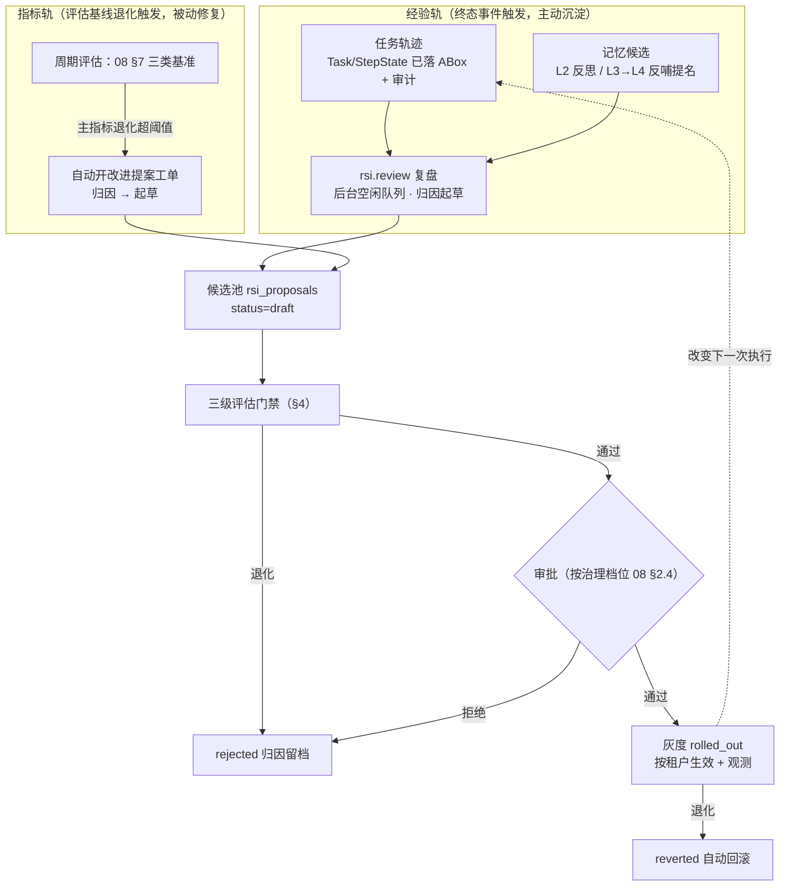

# 09 - 平台自进化 RSI 设计

> 状态：v0.1（旧稿合入落档，待评审） | 日期：2026-09-26
> 来源：旧稿 [架构设计/21-RSI自进化与训练机制设计](../架构设计/21-RSI自进化与训练机制设计.md)（v1.0，2026-09-26）的**栈无关核心**合入——登记行：[代办任务/2026-09-26-架构路线裁决与合并](../代办任务/2026-09-26-架构路线裁决与合并.md) §2「RSI 自进化」P1 项；合入时对齐现行体系：治理档位与评估体系（[08](./08-横切关注点与工程规范.md) §2.4/§7）、候选非成品宪法（[锚点](./01-总体架构与分层.md) §6.5）、记忆四层（[docs/memory](../memory/多层记忆设计.md)）、内核不可下放（[docs/Agent/02](../Agent/02-Agent内核与能力层划分设计.md)）。
> 旧稿 21 §8 权重训练轨不复述，收敛为本文 §9 v2 开放项（与 [ops/03 微调闭环](../ops/03-模型部署与推理服务.md)衔接）；旧稿 §11 端点/CLI 清单随阶段 B 详设再落。

---

## 1. 定位与边界

（来源：旧稿 21 §1/§2，2026-09-26 合入）

**RSI（Recursive Self-Improvement）本平台定义**：平台**从自身运行经验中系统性产出改进项，经确定性评估门禁与审核后安全生效，使后续任务表现可度量提升**的受控闭环。「递归」指改进项作用于平台的能力供给层（提示词模板/计划模板/策略参数/工具描述，§3 白名单），从而改变下一次执行；**不是**让 agent 自由修改自己的代码、内核或公理。

三条宪法级约束（设计宪法在自进化域的延伸，来源：旧稿 21 §2）：

1. **候选非成品适用于一切自产出**（锚点 §6.5）：RSI 产出的一切改进项先进候选区（§7 `rsi_proposals`），**无一生效豁免，禁止任何「自动直通生效」通道**——自改进恰恰是最不能豁免的场景；
2. **推理分级约束 RSI 自身**（锚点 §6.4）：改进是否有效只用确定性信号判定（评估集通过率/任务成功率/步数/成本/门禁拦截率）；LLM 只做归因分析与改进项起草，产物过 JSON Schema/SHACL 校验；
3. **全程可追溯**（锚点 §6.3/§6.7）：每个生效改进项可回链 来源 trace_id → 评估运行 → 审批记录 → 灰度观测，可一键回滚。

**管**：经验采集与归因、改进项候选生命周期、三级评估门禁、晋级灰度与回滚。
**不管**：记忆日常沉淀管线（docs/memory——RSI 是其产物的消费方）、审核工作流承载（08 §4 / [03](./03-业务层设计.md)——复用工单机制不自建）、沙箱供给（[docs/Sandbox](../Sandbox/README.md)，模块 13）、模型接入（[07](./07-基础层设计.md) §2 模型网关）。

## 2. 双轨触发

（来源：旧稿 21 §3/§4 经验轨；**指标轨为 2026-09-26 合入新增**——现行 08 §7 评估体系提供了旧稿成稿时不存在的退化触发信号）

**经验轨**：

- 触发：任务终态事件（`succeeded` 抽样 + `failed`/升级人工 全量）+ 周期巡检；执行挂后台空闲队列（低优先级，LLM 预算分账归因 `module=rsi`）；
- 归因分类复用执行侧失效模式表（研究整理 07 §6.5 同词汇）：成功且成本达标→可复用模式（候选计划/提示词模板）；反复同型失败→候选提示词输出约束；循环不收敛→候选记忆/检索策略参数；高频确定链路仍走 LLM→候选检索参数或模板固化（下次零 token）；
- 记忆侧输入：L2 反思候选与 L3→L4 反哺提名（docs/memory §2/§5）作为复盘线索进入归因，**不改变记忆自身门禁**；
- 产出统一信封：`{type, target, patch|content, source_trace_ids, expected_gain, risk_level, eval_plan}`——LLM 起草、结构化字段过 JSON Schema（来源：旧稿 21 §4.2）。

**指标轨**：08 §7 三类评估基准（检索 golden QA 集 / Agent 任务成功率 / 抽取精确率抽检）按周期跑分；任一基准主指标较基线退化超阈值（初始 -2%，与 08 §7.2 回归阻断阈值同源，实测后统一冻结）→ 自动开改进提案工单：定位退化样本→归因→起草候选进同一候选池。**双轨汇合于同一候选池、同一评估门禁、同一晋级管线，不建第二套通道。**

**变更预算**（来源：旧稿 21 §7）：每周期（默认 7 天）进入灰度的改进项 ≤5 项、复盘 LLM 预算封顶——防自进化流量淹没平台、防不可归因的复合变更。

## 3. 五类改进白名单

（来源：旧稿 21 §5；**载体清单按现行体系重定义（2026-09-26）**——旧稿的候选技能/规则/本体概念三类移出白名单：技能走 Skills 库既有上架通道、规则与公理走本体版本治理（docs/ontology ChangeRequest）、本体概念走记忆 L3→L4 反哺通道——防「改规则让自己通过」）

| # | 类型 | 载体与生效位置 | 现行对齐点 |
| ---- | ---- | ---- | ---- |
| 1 | 提示词模板 | 提示词版本库（patch 语义），含四类抽取模板等既有模板 | 提示词版本库随对账清单 P1「提示词治理」合入落位（OntRAG/memory 模板节 + standards） |
| 2 | 计划模板 | 规划「模板档」策略的模板库（Plan 仍为本体实例、过三层校验、可回滚版本化） | docs/Agent 规划三档：策略可下放（模板即技能），规划**阶段**与三层校验归内核 |
| 3 | 记忆策略参数 | 记忆四层召回权重/半衰期/升级阈值等参数版本 | docs/memory §3 召回配比与 §2 门禁参数 |
| 4 | 检索参数 | 检索模式配比、top-k、融合权重等参数版本 | docs/OntRAG；任何变更强制回归（08 §7.2） |
| 5 | 工具描述 | 平台能力/tool 的描述文本与语义标注（不改行为实现与授权） | docs/MCP 能力注册表；`annotations` 仅 UI 提示、不作授权依据（锚点 §6.2） |

**清单校验铁律**（「递归有界」的机械执行点，不依赖模型自觉）：`type ∉ 五类`，或 `target` 指向**内核代码/扩展点契约/本体公理与 SHACL 基线/权限/审批/沙箱策略/评估器** → **直接拒绝并记安全审计**。

**不含内核代码与公理**（对齐 [docs/Agent/02](../Agent/02-Agent内核与能力层划分设计.md)「内核不可下放」）：内核 A/B/C 十二项机制——尤其 **B 类安全与信任基线**（权限校验/门禁/信任级/出口控制/审批路由）——硬编码于内核、能力只能叠加不能替换，RSI 同样**零改动**；公理/TBox 属本体版本治理，RSI 只能经反哺通道「提名」，不能直接改。

## 4. 三级评估门禁

（来源：旧稿 21 §6 三级门禁重排；**第②级金标回归对齐 08 §7 评估体系（2026-09-26）**）

前置硬门槛（0 级，毫秒级）：清单校验（§3 铁律）+ 改动内容过 JSON Schema/SHACL 静态检查，不过即拒。

| 级 | 名称 | 机制 | 判定 |
| ---- | ---- | ---- | ---- |
| ① | 沙箱回放 | 抽样历史任务轨迹在评测沙箱（docs/Sandbox 评测训练环境）以候选改进重放——Task/StepState 全程可回放（锚点 §7 M4 验收地基）；断言 SuccessCriterion，对比步数/token/门禁拦截率；对抗检查位（出口审计异常/完整性破坏/答案泄漏）任一命中即判「不正当通过」，评估作废 + 安全事件 | 通过率不低于基线；单项退化 >5% 即拒（初始建议，实测冻结） |
| ② | 金标回归 | 08 §7 三类评估基准全量跑分对比基线（检索 golden QA / 任务成功率 / 抽取金标 ≥500 条）；**评测集版本冻结、人工维护，与被评估改进项不同源、不同审批人**（防「自己出题自己考」） | 主指标退化超阈值（初始 -2%，与 08 §7.2 同源）即拒 |
| ③ | 灰度对比 | 高风险类（提示词/计划模板、工具描述）灰度期对新到任务对比观测：观测期默认 7 天或 ≥100 任务；指标口径同①（成功率/步数/成本/拦截率） | 指标不劣于现行方可晋升；退化自动回滚 |

评估运行是资源型任务：批量回放走低峰调度；灰度叠加的推理成本按预算分账归因 `module=rsi`（07 §2.3 口径）。

## 5. 晋级与灰度（对齐治理档位）

（来源：旧稿 21 §7 状态机；**审批链强度按 08 §2.4 治理档位重定义（2026-09-26）**——旧稿「高危类必须人工不可配置豁免」收敛为档位差异化）

状态机（权威定义在 §7 表，此处主链）：`draft →（提交评估）→ evaluated →（审批）→ approved →（版本切换）→ rolled_out →（退化回滚）→ reverted`；任一门禁/审批拒绝进终态 `rejected`（归因留档）。

| 治理档位（08 §2.4） | RSI 改进项审批链 |
| ---- | ---- |
| solo | 提交人即审批人；**低危类（记忆/检索参数）高置信可自动通过**，但必须留痕、可回滚、可追溯（08 §2.4 共同底线）；模板/描述类仍人工 |
| team | 单审批人 |
| enterprise | 双负责人 + 四眼原则 |

- **三档共同底线**：三级评估门禁（§4）是硬门禁，**任何档位不可跳过**——档位只调节审批链强度，不调节确定性评估（08 §2.4 底线第 4 条同款语义）；自动通过通道在评估阈值冻结前不开放；
- **版本与回滚**：五类载体全部版本化，`rolled_out` = 把工具注册/上下文组装/召回装配的指向切到新版本；`reverted` = 指向切回，**秒级、不动数据**（与 docs/ontology 版本治理同款语义）；
- **灰度单位**：v1 按租户（平台自有租户先吃狗粮），流量比例灰度列 v2。

## 6. 安全红线

（来源：旧稿 21 §9；第 2/4 条按 Agent/02 内核划分收敛措辞，2026-09-26）

| # | 红线 | 机械执行点 |
| ---- | ---- | ---- |
| 1 | 改进项不得触碰权限、审批路由、沙箱策略、出口白名单 | §3 清单校验拒绝 + 安全审计（**内核 B 类机制零改动**，Agent/02 §2.2） |
| 2 | 改进项不得修改平台代码、扩展点契约、本体公理 | 白名单仅五类非代码资产；内核包 import 白名单 CI 断言（Agent/02 §7）双向防 |
| 3 | **评估器隔离**：评估集、评估逻辑、对抗检查位不在 RSI 可写范围；评测集变更与改进项变更**不同源、不同审批人** | 评测集作为独立审批对象 + 仓库级权限隔离 |
| 4 | **门禁基线与信任级不可降**：SHACL 基线、fail-closed 信任级映射、OntologyGate 类硬门禁不在白名单 | §3 铁律 + 红线 2 同款机械执行 |
| 5 | 递归深度有界：改进项只能生产「下一轮执行的输入」，不能生产「改进机制本身的修改」 | 白名单即闭环定义 |
| 6 | 全局 kill switch：平台级 RSI 开关，关闭即停止起草与灰度推进（已 rolled_out 项需人工回滚） | 配置分层（07 §7）+ 管理端点 |
| 7 | **RSI 自身动作全审计**：起草、评估、审批、灰度、回滚每步落 `audit_logs`（08 §3）；LLM 调用经模型网关记账归因 | 只追加审计表 + `llm_calls` 成本归因 |

与记忆投毒防线的关系（来源：旧稿 21 §9 末段）：RSI 输入含记忆与轨迹，上游被投毒会被放大——**归因输入只取经 SHACL 门禁入库的结构化数据 + 审计原始事实，不取自由文本记忆**；候选模板若经 Skills 通道上架，仍走其投毒检测（docs/memory 两道防线的第三道应用）。

## 7. 数据模型要点

（来源：旧稿 21 §4.2 信封 + §7 状态机；**表结构详设登记 database 待办回填**，不在本篇强行改表清单——对齐 08 §7.3 联动纪律）

PG 表 `rsi_proposals`（要点，非 DDL）：

| 字段组 | 要点 |
| ---- | ---- |
| 标识 | `id`、`tenant_id`、`type`（五类枚举）、`target`（载体标识 + 基线版本号）、`trigger`（experience/metric——双轨来源） |
| 改动内容 | 统一信封（§2）：`patch|content`、`expected_gain`、`risk_level`、`eval_plan` |
| 证据链 | `source_trace_ids[]`（来源轨迹）→ `review_run_id`（复盘运行）→ `eval_run_id`（评估运行）——逐环可回链 |
| 评估报告 | `eval_report`（JSON）：三级门禁结论、基线 delta、评估集版本、对抗检查位结果 |
| 状态机 | `status ∈ {draft, evaluated, approved, rolled_out, reverted, rejected}`；迁移合法性与审批人记录落审计（08 §3） |
| 版本与回滚 | 生效版本指针在载体侧（提示词版本库/参数版本表）；本表只记账，`reverted` 不删数据 |

> 登记待办：`rsi_proposals` 与评估运行表 DDL 详设回填 [docs/database/01](../database/01-数据库详细设计.md)（见 §10）。

## 8. 与现行体系的集成点

（来源：旧稿 21 §10 集成表按现行文档树重映射，2026-09-26）

| 集成 | 方式 |
| ---- | ---- |
| Agent 运行时（docs/Agent） | 只读任务轨迹与审计；生效模板/参数经内核扩展点与上下文组装器装载——**只动策略层，不动内核骨架**（Agent/02 §3 裁决表） |
| 记忆（docs/memory） | 消费 L2 反思候选与反哺提名；复盘任务挂后台空闲队列，预算分账同口径 |
| 知识库（docs/OntRAG） | 检索参数版本与 08 §7.2 强制回归联动；抽取模板改进复用提示词治理通道 |
| 本体核心（docs/ontology） | 公理/SHACL 不在白名单；改进若需新概念仅能提反哺提名（memory L3→L4 通道） |
| 沙箱（docs/Sandbox） | 沙箱回放/灰度对比环境由模块 13 供给；对抗检查位消费其出口审计 |
| 审核工作流（08 §4 / 03 篇） | 复用 `review_workflow` 工单，新增 `target_type=rsi_proposal`；审批人解析按治理档位 |
| 模型网关（07 §2） | 复盘 LLM 调用记账归因 `module=rsi`；kill switch 挂配置分层；v2 适配器/微调模型经渠道变体挂载（ops/03 §3） |

## 9. 里程碑挂载与验收

（来源：旧稿 21 §12 M5/M6 两档改挂现行 **M5+**，2026-09-26——不改既定 M1~M5，随锚点 §7 待办登记「RSI 与模型部署篇已落档（M5+/随时）」）

| 阶段 | 交付 | 验收标准 |
| ---- | ---- | ---- |
| A（M5 随既有） | 复盘雏形：失败轨迹复盘 → 候选提示词/计划模板进候选池 → 人工采纳生效 | 一条真实失败轨迹产出一条候选并被人工采纳；来源 trace 可回链；全程审计可查 |
| B（M5+ 按需启动） | 完整闭环：五类载体 → 三级评估（沙箱回放 + 金标回归 + 灰度对比）→ 档位化审批 → 灰度 → 回滚；kill switch；评测集冻结治理 | 参数类改进项经回放 + 金标回归证明「同型任务步数/成本下降且回归集零退化」后灰度生效；**人为注入退化改进项被自动回滚**；solo 档自动通过留痕完整可查 |
| v2（远期开放） | 权重轨：高分轨迹飞轮 → LLaMA-Factory QLoRA 微调（[ops/03 §3](../ops/03-模型部署与推理服务.md) 闭环）→ 导入 Ollama 现役渠道 → **走本篇同一晋级管线**，不设「训练直通上线」通道 | 触发条件（满足其二再立项）：程序性 RSI 连续两周期收益递减；可验证成功轨迹 ≥1 万条（来源：旧稿 21 §8） |

## 10. 待办与开放问题

- [ ] `rsi_proposals` 与评估运行表 DDL 回填 [docs/database/01](../database/01-数据库详细设计.md)（§7 登记）
- [ ] 提示词版本库落位后回填 §3 载体路径（依赖对账清单 P1「提示词治理」合入）
- [ ] 复盘归因失效模式表与 docs/Agent / 研究整理 07 §6.5 词汇对齐校验
- [ ] 沙箱回放退化阈值（-5%）与金标回归阈值（-2%）实测后统一冻结（与 08 §7.2 联动）
- [ ] 灰度观测样本量下限（指标置信度）
- [ ] v2 权重轨触发条件复评与 ops/03 微调闭环的衔接协议
- [ ] 端点与 CLI 命令组（`/api/v1/rsi/*`、`oa rsi …`）随阶段 B 详设，登记 docs/api 查漏（旧稿 21 §11 清单作参考不作约束）

> 旧稿 21 §13 的 ADR-20/21/22 决策语义已分别收敛进本文 §2（双轨）、§4（确定性评估 + 评估器隔离）、§5（统一晋级管线），不再单列 ADR；其开放问题存货已并入上表。

## 11. 人工点自动化：agent 预审 + 人裁决（2026-09-26 增补，挂本篇因其同属"自我运营"）

全工程人工点盘点与自动化路径（模式统一为 **AI 预审员生成建议/分级分流 → 人只裁决分歧与高危**；预审员=能力层 L3 内置能力 `review.assistant`，亦可 L2 市场包；自动化程度由治理档位控制）：

| 人工点 | 自动化路径 | 人保留 |
| ---- | ---- | ---- |
| 抽取候选终审 | 校准置信自动通过（solo 已有）→ 高危/低置信 AI 预审摘要+建议 | 批量抽检+分歧裁决 |
| 本体 changeset 评审 | lint/夹具/diff 影响分析（已有）+ AI 评审意见（对齐国标清单逐条） | 批准/否决（enterprise 双签） |
| 术语对齐/记忆升级/插件敏感审核 | 三级自动判定已有；AI 静态审查+风险评分分流 | 仅敏感类目终审 |
| 对账差异/死信处置 | agent 按 runbook 生成诊断+处置建议 | 批准执行 |
| 运维告警 | agent 关联指标/日志给根因假设与 runbook 步骤 | 执行确认 |
| 评估集金标标注 | LLM 预标注+一致性过滤，人只校抽检样本 | 金标准本身 |

**不可自动化（安全底线，对应内核 B 类）**：高风险回写二次确认、终审生效权（published 的最后一击）、宪法/门禁基线修改、跨租户管理动作——AI 只能给建议，按钮永远在人（或人显式授权的 agent 代理=API Key + scope 白名单，全程审计）。待办：review.assistant 能力规格（输入=工单+证据，输出=建议+风险分+依据链）随 M4 评审工作台细化。
