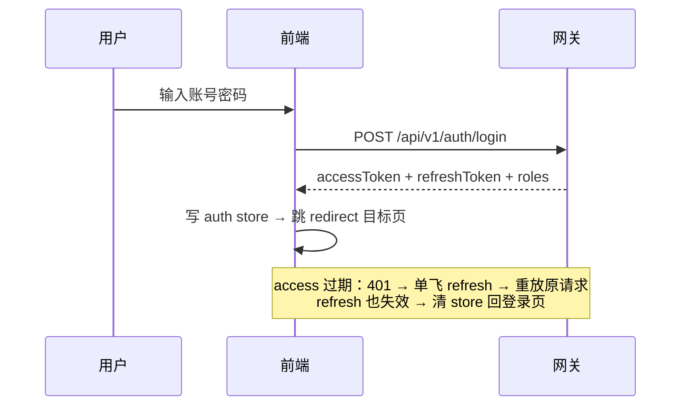
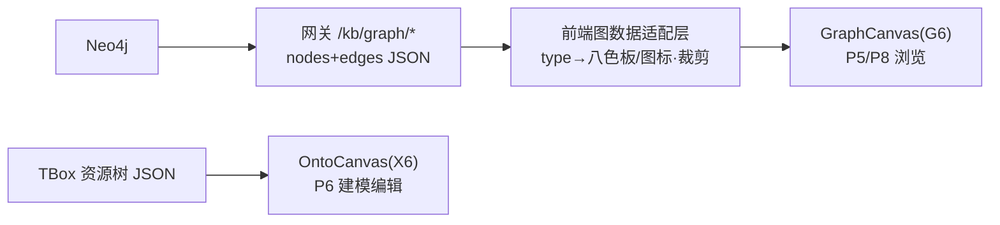

# 03 - 前端工程架构

> 状态：v0.1 | 日期：2026-09-26 | 上游依据：[架构锚点](../architecture/01-总体架构与分层.md)、[01-主题与设计系统](./01-主题与设计系统.md)、[02-信息架构与页面设计](./02-信息架构与页面设计.md)

---

## 1. 技术栈与版本

| 类别 | 选型 | 版本基线 | 说明 |
| ---- | ---- | ---- | ---- |
| 框架 | Vue 3 + TypeScript | Vue ≥3.5、TS ≥5.6 | Composition API + `<script setup>`，全量 TS |
| 构建 | Vite | ≥6.0 | 按需预构建、代理联调（§8） |
| 状态 | Pinia | ≥2.3 | setup store 写法 |
| 路由 | Vue Router | ≥4.4 | 集中式路由表 + 守卫（§6） |
| 组件库 | Element Plus | ≥2.9 | 主题经 `--el-*` → `--onto-*` 映射（01 篇 §3） |
| 图可视化 | AntV G6 / AntV X6 | G6 5.x / X6 2.x | 浏览用 G6、建模编辑用 X6（§7） |
| 图表 | ECharts | ≥5.5 | 仅系统管理成本看板 |
| HTTP | axios | ≥1.7 | 统一封装（§4） |
| SSE | 原生 EventSource / fetch-stream | — | `useEventStream` composable（§5） |
| 规范 | ESLint + Prettier + vue-tsc | — | 提交前强制（§10） |

## 2. 工程目录规划

```text
frontend/
├── index.html
├── vite.config.ts              # 插件、代理、按需加载
├── .env.development / .env.production
└── src/
    ├── main.ts                 # 入口：装 pinia/router/EP/主题初始化
    ├── App.vue
    ├── api/                    # 接口层（唯一发请求处，按网关 router 分文件）
    │   ├── http.ts             # axios 实例与拦截器
    │   ├── sessions.ts  tasks.ts  kb.ts  ontology.ts
    │   ├── memory.ts  agents.ts  plugins.ts  mcp.ts  admin.ts
    ├── stores/                 # Pinia（§5）
    │   ├── auth.ts  ui.ts  session.ts  ontology.ts  kb.ts  memory.ts  plugin.ts
    ├── router/
    │   ├── index.ts            # createRouter + 守卫
    │   └── routes.ts           # 与 docs/frontend/02 §2 路由表一一对应（含 meta.roles）
    ├── views/                  # 页面（对齐 02 篇 §3，P1~P12）
    │   ├── login/  chat/  tasks/  kb/{documents,review,playground}/
    │   ├── ontology/{workbench,versions,explorer}/
    │   ├── memory/  agents/  extensions/{tools,market,mcp}/
    │   ├── system/{tenants,users,roles,models,audit}/
    │   └── error/{403.vue 404.vue}
    ├── components/             # ★ 全局复用组件（02 篇 §4 清单）
    │   ├── layout/{AppLayout.vue SideNav.vue AppHeader.vue UserMenu.vue}
    │   ├── graph/{GraphCanvas.vue OntoCanvas.vue graphPalette.ts}
    │   ├── chat/{ChatStream.vue EvidenceCard.vue}
    │   ├── review/{ReviewTable.vue DiffViewer.vue}
    │   └── common/{StatusBadge.vue JsonSchemaForm.vue PipelineSteps.vue SearchCommand.vue}
    ├── composables/
    │   ├── useEventStream.ts   # SSE 消费（§5）
    │   ├── useTheme.ts         # 亮/暗切换与持久化
    │   └── usePermission.ts    # 角色判断 v-permission 指令
    ├── styles/
    │   ├── tokens.scss         # ★ --onto-* 唯一定义处（亮/暗两态）
    │   ├── element-overrides.scss  # --el-* → --onto-* 唯一映射处
    │   └── global.scss         # reset、滚动条、工具类（.onto-card 等）
    ├── utils/                  # trace、格式化、下载等纯函数
    └── assets/icons/           # 自定义 SVG（图谱八类型 + Logo）
```

## 3. 与后端的边界

- 前端是 L1，**只经网关（`/api/v1`，默认 `:8000`）以 REST + SSE 通信**，禁止直连任何存储或模型 API（锚点 §2 禁令）。
- 全部请求带 `Authorization: Bearer <JWT>` 与 `X-Tenant-Id`；后端错误体统一 `{code, message, trace_id}`，前端把 `trace_id` 展示在错误 Toast 与审计页，实现 L1→L7 链路追踪闭环（锚点 §6.7）。

## 4. API client 规范（api/http.ts）

- 单例 axios 实例，`baseURL = import.meta.env.VITE_API_BASE`；请求拦截器注入 JWT（来自 auth store）、`X-Tenant-Id`、`X-Client: ontology-console/{版本}`。
- 响应拦截器：2xx 直接返回 `data.data`；非 2xx 解析统一错误体 → 抛 `ApiError{code,message,trace_id}`；401 清会话跳 `/login?redirect=`；403 提示无权限。
- 方法命名 `listX/getX/createX/updateX/deleteX`；每个 `api/*.ts` 文件对应网关一个 `routers/` 模块，函数注释里写死路径，与 OpenAPI 导出核对。

**API 模块 ↔ 网关路由对照**（2026-09-26 评审修复F：**以 [api/01](../api/01-REST-API契约.md) 为唯一事实源，本表仅模块归属映射**，路径口径已对齐 api/01 现行端点——/ontologies 复数、tasks 端点；端点增删以 api/01 §5 为准，禁止在本表另行定义）

| api 文件 | 网关 routers/ | 端点前缀（主要，引 api/01 §5 对应组） |
| ---- | ---- | ---- |
| `sessions.ts` | sessions | `/sessions`、`/sessions/{id}/messages`（SSE）——api/01 §5.2 |
| `tasks.ts` | sessions（tasks 聚合，api/01 §5.2 归 routers/sessions.py） | `/tasks`、`/tasks/{task_id}`、`/tasks/{task_id}/events`（SSE/时间线）、`/tasks/{task_id}/cancel` |
| `kb.ts` | kb | `/kb/documents`（含 `{id}/chunks`、`{id}/review/*`）、`/kb/review/candidates/{cid}/decision`、`/kb/search`、`/kb/graph/*`——api/01 §5.4 |
| `ontology.ts` | ontology | `/ontologies`（**复数**）、`/ontologies/{id}/classes\|properties\|axioms\|rules`、`/ontologies/{id}/changesets/{cid}/submit\|approve\|reject\|publish\|rollback`、`/ontologies/search`——api/01 §5.3 |
| `memory.ts` | memory | `/memory`、`/memory/facts`（含 `{id}/timeline`）、`/memory/promotions`——api/01 §5.5 |
| `agents.ts` | agents | `/agents`、`/agents/{agent_id}/tools`、`/agents/{agent_id}/health-check`——api/01 §5.1（adapter / runs 端点待 api/01 登记后接入） |
| `plugins.ts` / `mcp.ts` | plugins / mcp | `/plugins`、`/tools`、`/mcp/servers`——api/01 §5.6 / §5.7 |
| `admin.ts` | admin | `/admin/tenants\|quota\|models\|costs\|stats\|audit-logs\|writeback`——api/01 §5.8 |

```ts
// 请求拦截器示意
http.interceptors.request.use((config) => {
  const auth = useAuthStore();
  config.headers.Authorization = `Bearer ${auth.accessToken}`;
  config.headers['X-Tenant-Id'] = auth.tenantId;
  return config;
});
```

## 5. SSE 消费封装（useEventStream）

- 对话与任务事件流统一走该 composable：自动重连带 `Last-Event-ID`、心跳超时判定（30s 无事件判死重连）、事件分发到 store。

```ts
export function useEventStream(url: string, handlers: Record<string, EventHandler>) {
  const status = ref<'idle' | 'open' | 'retry'>('idle');
  let es: EventSource | null = null;
  let retry = 0;
  const connect = () => {
    es = new EventSource(withToken(url));          // 网关支持 query 传 token（EventSource 不能设 header）
    es.onopen = () => { status.value = 'open'; retry = 0; };
    es.onmessage = (e) => {
      lastHeartbeat = Date.now();
      const evt = JSON.parse(e.data) as AgUiEvent; // AG-UI 蓝本事件语义
      handlers[evt.type]?.(evt);                   // RUN_STARTED / 文本增量 / TOOL_CALL_* …
    };
    es.onerror = () => {                            // 指数退避 1s/2s/4s，封顶 15s
      es?.close(); status.value = 'retry';
      if (retry++ < 6) setTimeout(connect, Math.min(1000 * 2 ** retry, 15000));
    };
  };
  // 心跳看门狗：30s 无事件主动重建连接
  const timer = setInterval(() => { if (Date.now() - lastHeartbeat > 30000) { es?.close(); connect(); } }, 5000);
  onUnmounted(() => { es?.close(); clearInterval(timer); });
  return { status, connect, close: () => es?.close() };
}
```

- 事件分发约定：ChatStream 组件不直接解析协议，只订阅 session store 暴露的渲染态；store 内做事件归并（文本增量拼接、工具调用开合状态机）。

## 6. 状态管理设计（stores 清单）

| Store | 职责 | 关键 state |
| ---- | ---- | ---- |
| `auth` | 登录态与身份 | `accessToken`、`refreshToken`、`user`、`roles`、`tenantId` |
| `ui` | 全局外观与布局 | `theme: 'light'\|'dark'`、`sideNavCollapsed`、`commandPaletteOpen` |
| `session` | 对话域 | `sessions[]`、`currentSessionId`、`messages[]`、`streamingState`（含工具调用时间线）、`agentId` |
| `ontology` | 本体建模域 | `ontologyList`、`currentVersion`、`resourceTree`、`canvasSelection`、`draftChangeset`、`validationResults`（SHACL/推理） |
| `kb` | 知识库域 | `documents[]`、`candidates[]`、`reviewSelection`、`searchResult{answer,evidences,subgraph}` |
| `memory` | 记忆域 | `activeLayer`、`memoryItems`、`promotionQueue` |
| `plugin` | 扩展域 | `tools[]`、`plugins[]`、`mcpServers[]`、`installTasks` |

原则：服务端数据不冗余进 store 的部分（如长表格原始行）留在页面局部状态；store 只承载跨页共享与流式状态。持久化仅 `ui.theme` 与 `auth`（内存 + refresh token，见 §6.5 待办）。

## 7. 路由与权限守卫

- `routes.ts` 与 02 篇 §2 路由表逐条对应，每条带 `meta: { title, roles[], icon, hidden }`。
- 全局守卫 `router.beforeEach`：① `/login` 白名单直通；② 无 token → 跳登录带 `redirect`；③ `to.meta.roles` 与 `auth.roles` 求交为空 → `/403`；④ 动态菜单 = 全量路由按 roles 过滤后交给 SideNav。
- 按钮/操作级权限用 `v-permission` 指令（如「发布版本」仅 curator/admin 可见），与路由角色同源配置。
- 登录与令牌续期流程：



## 8. 图谱可视化方案

- **分工**：浏览分析（P5 证据链、P8 图谱浏览器）用 **G6 5**——布局/交互/大数据量开箱即用；建模编辑（P6 画布）用 **X6**——节点编辑、连线校验、框选对齐等编辑原语完整。两者共用 `graphPalette.ts`（读 01 篇 §4 八色板 token）。
- **数据流**：后端返回统一图数据 `{nodes:[{id,label,type,props}], edges:[{id,source,target,label}]}`（网关从 Neo4j 查询结果适配），前端**适配层**（`components/graph/`）只做两件事：`type → token 色/图标` 映射、按画布量级裁剪（默认首屏 ≤200 节点，超出转分页/按社区折叠）。



## 9. 主题接入工程化

- `styles/tokens.scss` 是 `--onto-*` 唯一来源：`:root` 亮色 + `html.theme-dark` 暗色，编译进关键 CSS 首屏内联。
- 切换：`useTheme()` 改 `document.documentElement.classList`（同时维护 `theme-dark` 与 EP 需要的 `dark`），写 `localStorage('onto-theme')`，默认跟随 `prefers-color-scheme`。
- Element Plus **按需自动导入**（`unplugin-vue-components` + `ElementPlusResolver`），样式经 `element-overrides.scss` 统一映射；ECharts 主题由 token 生成（注册 `onto-light`/`onto-dark` 两套 registerTheme）。

## 10. 构建与联调

- `vite.config.ts`：`server.proxy['/api'] → http://localhost:8000`（网关），SSE 代理需关闭缓冲（`proxy: { '/api': { configure: (p) => p.on('proxyRes', preventBuffering) } }` 或直接配 `headers: { 'X-Accel-Buffering': 'no' }` 同理在 dev 侧验证）。
- 环境变量：`VITE_API_BASE`（生产指向网关域名）、`VITE_APP_VERSION`（注入审计 `X-Client`）。
- 产物：`dist/` 静态化，由网关或 Nginx 托管；构建产物做 gzip + 路由级代码分割（每页面一个 chunk）。

```nginx
# Nginx 托管片段：SSE 路径必须关缓冲，否则事件流被攒包、前端表现为「卡住不出字」
location /api/ {
    proxy_pass http://gateway:8000;
    proxy_buffering off;
    proxy_read_timeout 300s;
}
location / { try_files $uri $uri/ /index.html; }   # history 路由回退
```

## 11. 代码规范

- ESLint（`eslint-plugin-vue` recommended + `@typescript-eslint`）+ Prettier（单引号、无尾分号、100 列）+ `vue-tsc --noEmit` 三件套进 CI。
- 命名：组件 PascalCase 双词以上（`ReviewTable.vue`）；views 以页面目录组织、入口 `index.vue`；composables `useXxx.ts`；stores `useXxxStore`；token 使用必须 `var(--onto-*)`（lint 自定义规则，见 01 篇验收）。
- 提交：Conventional Commits（`feat(chat): …`），PR 必须附对应页面截图（亮/暗两态）。

## 12. 验收清单

- [ ] `pnpm dev` 一条命令起前端，代理到本地网关联调全链路通。
- [ ] 12 个页面路由全部可达，权限外路由 403、菜单按角色过滤正确。
- [ ] 对话页 SSE：断网 5s 内自动重连并续传，工具调用时间线与证据卡片渲染正确。
- [ ] 亮/暗切换全站无裸色残留；tokens.scss 是全仓库唯一定义色值处。
- [ ] G6 浏览与 X6 建模两画布同实体同色；节点量 200+ 时交互不掉帧（Chrome 性能面板抽查）。
- [ ] CI：lint + vue-tsc + build 三步全绿。

## 13. 待办与开放问题

- [ ] auth 刷新 token 方案定稿（localStorage vs HttpOnly Cookie，需网关 CORS 配合）。
- [ ] SSE 鉴权传递方式与网关对齐（query token 仅限 dev，生产倾向网关签发一次性 stream ticket）。
- [ ] OpenAPI 类型自动生成（`openapi-typescript`）是否引入，取决于网关 OpenAPI 稳定性。
- [ ] 大表格虚拟滚动选型（`vue-virtual-scroller` vs EP `virtualized table`）。
- [ ] i18n 骨架是否本期搭建（当前中文单语，文案集中 `src/locales/zh-CN.ts` 预留）。
