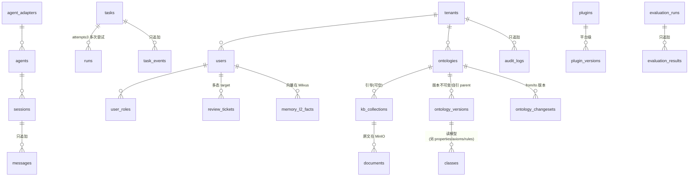

# 01 - 数据库详细设计（DDL 级）

> 状态：v0.1 | 日期：2026-09-26 | 上游依据：[06-数据层设计](../architecture/06-数据层设计.md)（数据契约权威）、[01-总体架构与分层](../architecture/01-总体架构与分层.md)、[03-业务层设计](../architecture/03-业务层设计.md) §4/§6、[08-横切关注点与工程规范](../architecture/08-横切关注点与工程规范.md)、[本体核心设计 §9](../ontology/本体核心设计.md)、[业务回写设计 §8](../MCP/业务回写设计.md)、[04-知识库设计与知识治理](../架构设计/04-知识库设计与知识治理.md)（旧稿，§3.3 双时间线列摘录源——2026-09-26 旧稿合入）

---

## 1. 设计总则

### 1.1 权威关系声明

| 文档 | 职责 | 冲突时 |
| ---- | ---- | ---- |
| [06-数据层设计](../architecture/06-数据层设计.md) | **表清单与职责权威**（27 张表、Neo4j/Milvus/MinIO/Redis 设计、Alembic 纪律） | 以 06 篇为准 |
| 本篇 | 06 篇的 **DDL 级展开**：字段类型、约束、索引、分区、分期建表 | 不得与 06 篇冲突 |
| 领域分篇（docs/ontology §9、03 篇 §4/§6.2、MCP §8） | 字段级补充来源，凡采纳处标「**本篇补充**」；落地脚本在 `deploy/init-*` | 冲突以 06 篇为准并登记待办 |

改表流程（顺序不可反）：**06 篇契约 → 本篇 DDL → Alembic 迁移**（见 [docs/database/README](./README.md)）。

### 1.2 公共字段约定（06 篇 §1.1 展开）

| 字段 | 类型与约束 | 说明 |
| ---- | ---- | ---- |
| `id` | `UUID PRIMARY KEY DEFAULT gen_random_uuid()` | 应用层生成 **UUIDv7**（时间有序）注入；`gen_random_uuid()`（v4）兜底 |
| `tenant_id` | `UUID NOT NULL REFERENCES tenants(id)` | 行级多租户隔离；**唯一索引一律含 `tenant_id`** |
| `created_at` / `updated_at` | `TIMESTAMPTZ NOT NULL DEFAULT now()` | `updated_at` 应用层维护，不用触发器 |

平台级表（无 `tenant_id`）：`tenants`、`roles`、`agent_adapters`、`plugins`、`plugin_versions`。
只追加表（无 `updated_at`，本篇补充约定）：`messages`、`task_events`、`document_chunks`、`audit_logs`、`llm_calls`、`tool_invocations`、`outbox_events`、`evaluation_results`、`memory_l3_edges`。

### 1.3 命名规范

| 对象 | 规范 | 示例 |
| ---- | ---- | ---- |
| 表/列 | 表复数 snake_case；列 snake_case | `review_tickets.sla_deadline` |
| 索引 / 唯一约束 | `idx_{表}_{语义}` / `uk_{表}_{语义}`；外键 `fk_{表}_{语义}`（行内省略名时用 PG 默认名）；状态列一律 `CHECK (col IN (...))`（本篇补充） | `idx_tasks_queue`；MCP §8 `uq_writeback_idem` 统一为 `uk_writeback_idem` |

---

## 2. ER 总览

九域与 §3 对应；连线只画主要外键，多态引用（审核工单 target、outbox 聚合、writeback 行动实例）不入线。



---

## 3. 分域 DDL

共 **35 张核心表 + 2 张可选表** = 06 篇 32 张表清单中的 31 张（`outbox` 与 03 篇 `outbox_events` 合并为一张；`memory_l3_edges` 转可选）+ 4 张领域展开（`classes/properties/axioms/rules`〔docs/ontology §9〕）。06 篇表清单已含 2026-09-26 评审修复G 补登的 `kb_pipeline_step`、`writeback_ledger`、`evaluation_runs/evaluation_results` 与新增 `runs` 表（以本篇为 DDL 展开）。

### 3.1 域① 租户与身份（5 表 | M1）
```sql
CREATE TABLE tenants (                          -- 平台级
    id UUID PRIMARY KEY DEFAULT gen_random_uuid(), name VARCHAR(128) NOT NULL, slug VARCHAR(64) NOT NULL,
    plan VARCHAR(32) NOT NULL DEFAULT 'free' CHECK (plan IN ('free','pro','ent')), settings JSONB NOT NULL DEFAULT '{}',  -- 含 governance_tier（08 篇 §2.4）
    status VARCHAR(16) NOT NULL DEFAULT 'active' CHECK (status IN ('active','suspended')), created_at TIMESTAMPTZ NOT NULL DEFAULT now(), updated_at TIMESTAMPTZ NOT NULL DEFAULT now(),
    CONSTRAINT uk_tenants_slug UNIQUE (slug));
CREATE TABLE users (
    id UUID PRIMARY KEY DEFAULT gen_random_uuid(), tenant_id UUID NOT NULL REFERENCES tenants(id),
    email VARCHAR(256) NOT NULL, username VARCHAR(64), password_hash VARCHAR(256) NOT NULL,
    display_name VARCHAR(128), last_login_at TIMESTAMPTZ, status VARCHAR(16) NOT NULL DEFAULT 'active' CHECK (status IN ('active','disabled')),
    created_at TIMESTAMPTZ NOT NULL DEFAULT now(), updated_at TIMESTAMPTZ NOT NULL DEFAULT now(),
    CONSTRAINT uk_users_tenant_email UNIQUE (tenant_id, email));
CREATE INDEX idx_users_tenant ON users (tenant_id);
CREATE TABLE roles (                            -- 平台级；种子唯一走 Alembic 数据迁移 m1_seed_roles_and_admin（§8；2026-09-26 评审修复G：init-pg 只建库/扩展/权限，不写种子）
    id UUID PRIMARY KEY DEFAULT gen_random_uuid(), code VARCHAR(32) NOT NULL, name VARCHAR(64) NOT NULL,
    scopes TEXT[] NOT NULL DEFAULT '{}', created_at TIMESTAMPTZ NOT NULL DEFAULT now(),
    updated_at TIMESTAMPTZ NOT NULL DEFAULT now(), CONSTRAINT uk_roles_code UNIQUE (code));
-- 角色码以 08 篇 §2.2 权威定义为准（admin/ontologist/curator/member/guest+super_admin）；06 篇 §2.1 旧称→ontologist/curator/member，登记 §9 待办回改 06 篇。
CREATE TABLE user_roles (
    id UUID PRIMARY KEY DEFAULT gen_random_uuid(), tenant_id UUID NOT NULL REFERENCES tenants(id),
    user_id UUID NOT NULL REFERENCES users(id), role_id UUID NOT NULL REFERENCES roles(id),
    created_at TIMESTAMPTZ NOT NULL DEFAULT now(), CONSTRAINT uk_user_roles UNIQUE (user_id, role_id));
CREATE INDEX idx_user_roles_tenant ON user_roles (tenant_id);
CREATE TABLE api_keys (
    id UUID PRIMARY KEY DEFAULT gen_random_uuid(), tenant_id UUID NOT NULL REFERENCES tenants(id),
    name VARCHAR(128) NOT NULL, key_hash VARCHAR(128) NOT NULL, key_prefix VARCHAR(16) NOT NULL,
    owner_user_id UUID NOT NULL REFERENCES users(id), scopes TEXT[] NOT NULL DEFAULT '{}',  -- owner scopes 子集
    expires_at TIMESTAMPTZ, revoked_at TIMESTAMPTZ, last_used_at TIMESTAMPTZ,
    created_at TIMESTAMPTZ NOT NULL DEFAULT now(), updated_at TIMESTAMPTZ NOT NULL DEFAULT now(),
    CONSTRAINT uk_api_keys_prefix UNIQUE (key_prefix));
CREATE INDEX idx_api_keys_tenant_owner ON api_keys (tenant_id, owner_user_id);
```

### 3.2 域② Agent 与会话（7 表 | M1）
```sql
CREATE TABLE agent_adapters (                   -- 平台级；先建（agents.adapter_id 依赖）
    id UUID PRIMARY KEY DEFAULT gen_random_uuid(), agent_tool VARCHAR(32) NOT NULL, version VARCHAR(32) NOT NULL,
    runtime_spec JSONB NOT NULL DEFAULT '{}', health_endpoint VARCHAR(256),
    created_at TIMESTAMPTZ NOT NULL DEFAULT now(), updated_at TIMESTAMPTZ NOT NULL DEFAULT now(),
    CONSTRAINT uk_agent_adapters UNIQUE (agent_tool, version));
CREATE TABLE agents (
    id UUID PRIMARY KEY DEFAULT gen_random_uuid(), tenant_id UUID NOT NULL REFERENCES tenants(id),
    name VARCHAR(128) NOT NULL, agent_tool VARCHAR(32) NOT NULL, system_prompt TEXT,
    adapter_id UUID NOT NULL REFERENCES agent_adapters(id), config JSONB NOT NULL DEFAULT '{}',  -- 模型 profile/工具白名单
    status VARCHAR(16) NOT NULL DEFAULT 'enabled' CHECK (status IN ('enabled','disabled')), created_at TIMESTAMPTZ NOT NULL DEFAULT now(), updated_at TIMESTAMPTZ NOT NULL DEFAULT now(),
    CONSTRAINT uk_agents_tenant_name UNIQUE (tenant_id, name));
CREATE INDEX idx_agents_agent_tool ON agents (agent_tool);
CREATE TABLE sessions (
    id UUID PRIMARY KEY DEFAULT gen_random_uuid(), tenant_id UUID NOT NULL REFERENCES tenants(id),
    agent_id UUID NOT NULL REFERENCES agents(id), user_id UUID NOT NULL REFERENCES users(id),
    title VARCHAR(256), channel VARCHAR(32) NOT NULL DEFAULT 'web' CHECK (channel IN ('web','api','cli')),
    status VARCHAR(16) NOT NULL DEFAULT 'created' CHECK (status IN ('created','active','idle','closed','archived')),  -- 状态机见 04 篇 §3
    last_message_at TIMESTAMPTZ, token_usage JSONB NOT NULL DEFAULT '{}', created_at TIMESTAMPTZ NOT NULL DEFAULT now(), updated_at TIMESTAMPTZ NOT NULL DEFAULT now());
CREATE INDEX idx_sessions_tenant_user_recent ON sessions (tenant_id, user_id, last_message_at DESC);
CREATE TABLE messages (                         -- 只追加；先落库后推送（04 篇 §2）
    id UUID PRIMARY KEY DEFAULT gen_random_uuid(), tenant_id UUID NOT NULL REFERENCES tenants(id),
    session_id UUID NOT NULL REFERENCES sessions(id), seq INT NOT NULL,   -- 本篇补充：会话内严格递增
    role VARCHAR(16) NOT NULL CHECK (role IN ('user','assistant','tool','system')),
    content TEXT NOT NULL DEFAULT '', content_type VARCHAR(32) NOT NULL DEFAULT 'text',
    ag_ui_events JSONB, model VARCHAR(64), token_in INT, token_out INT, latency_ms INT,
    created_at TIMESTAMPTZ NOT NULL DEFAULT now(), CONSTRAINT uk_messages_session_seq UNIQUE (session_id, seq));
CREATE INDEX idx_messages_session_created ON messages (session_id, created_at);
CREATE TABLE tasks (
    id UUID PRIMARY KEY DEFAULT gen_random_uuid(), tenant_id UUID NOT NULL REFERENCES tenants(id),
    type VARCHAR(32) NOT NULL,                  -- extract/index/reason/review_forward…
    status VARCHAR(16) NOT NULL DEFAULT 'pending' CHECK (status IN ('pending','running','succeeded','failed','cancelled')),
    agent_id UUID REFERENCES agents(id), session_id UUID REFERENCES sessions(id),
    attempt_count INT NOT NULL DEFAULT 0,       -- 2026-09-26 评审修复G 补列：重试计数（≤3，04 篇 §2 task 不变式；失败可建新 Run）
    active_run_id UUID,                         -- 2026-09-26 评审修复G 补列：当前活跃 Run 指针（指向 runs.id；不设 FK，防 tasks↔runs 循环引用）
    payload JSONB, result JSONB, error TEXT, priority SMALLINT NOT NULL DEFAULT 5,
    idempotency_key VARCHAR(128), started_at TIMESTAMPTZ, finished_at TIMESTAMPTZ,
    created_at TIMESTAMPTZ NOT NULL DEFAULT now(), updated_at TIMESTAMPTZ NOT NULL DEFAULT now(),
    CONSTRAINT uk_tasks_idem UNIQUE (tenant_id, idempotency_key));
CREATE INDEX idx_tasks_queue ON tasks (status, priority, created_at);
CREATE INDEX idx_tasks_tenant_session ON tasks (tenant_id, session_id);  -- 本篇补充
CREATE UNIQUE INDEX uk_tasks_one_active_run ON tasks (tenant_id, session_id) WHERE status = 'running';  -- 本篇补充：至多一个活跃 Run（04 篇 §2.1）
CREATE TABLE runs (                             -- 2026-09-26 评审修复G 新增：一次执行尝试（task=业务任务，run=一次执行；状态机权威=04 篇 §3）
    id UUID PRIMARY KEY DEFAULT gen_random_uuid(), tenant_id UUID NOT NULL REFERENCES tenants(id),
    task_id UUID NOT NULL REFERENCES tasks(id),
    seq_start INT NOT NULL,                     -- 本 Run 的 task_events.seq 起始值（事件 seq 跨 Run 连续递增，04 篇 §2）
    status VARCHAR(16) NOT NULL DEFAULT 'queued' CHECK (status IN ('queued','running','waiting_tool','completed','failed','timeout','cancelled')),  -- 七态，与 04 篇 §3 run 状态机一致
    started_at TIMESTAMPTZ, ended_at TIMESTAMPTZ,
    usage JSONB NOT NULL DEFAULT '{}',          -- 本次 Run 的 tokens/cost 汇总（LiteLLM 回传）
    error JSONB,                                -- 结构化失败信息（code/message/retryable）
    created_at TIMESTAMPTZ NOT NULL DEFAULT now(), updated_at TIMESTAMPTZ NOT NULL DEFAULT now());
CREATE INDEX idx_runs_task ON runs (task_id, created_at);
CREATE UNIQUE INDEX uk_runs_one_active ON runs (tenant_id, task_id) WHERE status IN ('queued','running','waiting_tool');  -- 每任务至多一个活跃 Run（04 篇 §2.1 并发不变式，PG 强制）
CREATE TABLE task_events (                      -- 只追加；SSE 转发源
    id UUID PRIMARY KEY DEFAULT gen_random_uuid(), tenant_id UUID NOT NULL REFERENCES tenants(id),
    task_id UUID NOT NULL REFERENCES tasks(id), seq INT NOT NULL, event_type VARCHAR(32) NOT NULL,
    data JSONB NOT NULL DEFAULT '{}', created_at TIMESTAMPTZ NOT NULL DEFAULT now(),
    CONSTRAINT uk_task_events_seq UNIQUE (task_id, seq));
```

### 3.3 域③ 知识库（4 表 | M1 + M2）
```sql
CREATE TABLE kb_collections (
    id UUID PRIMARY KEY DEFAULT gen_random_uuid(), tenant_id UUID NOT NULL REFERENCES tenants(id),
    name VARCHAR(128) NOT NULL, description TEXT,
    ontology_id UUID REFERENCES ontologies(id), -- 本体引导，可空（M1 已建 ontologies，见 §4）
    embedding_model VARCHAR(64) NOT NULL,       -- Milvus collection 契约一部分（06 篇 §4）
    chunk_defaults JSONB NOT NULL DEFAULT '{}', status VARCHAR(16) NOT NULL DEFAULT 'active' CHECK (status IN ('active','archived')),
    created_at TIMESTAMPTZ NOT NULL DEFAULT now(), updated_at TIMESTAMPTZ NOT NULL DEFAULT now(),
    CONSTRAINT uk_kb_collections UNIQUE (tenant_id, name));
CREATE TABLE documents (                        -- 原文在 MinIO，本表只存指针
    id UUID PRIMARY KEY DEFAULT gen_random_uuid(), tenant_id UUID NOT NULL REFERENCES tenants(id),
    kb_collection_id UUID NOT NULL REFERENCES kb_collections(id), title VARCHAR(512) NOT NULL,
    source_type VARCHAR(16) NOT NULL DEFAULT 'upload' CHECK (source_type IN ('upload','api')),
    mime_type VARCHAR(128), size_bytes BIGINT, minio_key VARCHAR(512) NOT NULL,  -- raw-docs/{tenant}/{kb}/{doc}/
    checksum_sha256 CHAR(64) NOT NULL, meta JSONB NOT NULL DEFAULT '{}',
    valid_from TIMESTAMPTZ, valid_to TIMESTAMPTZ,   -- 双时间线·业务有效时间（valid_time）闭区间，失效=封口不删除；transaction_time 由 created_at 承担（本篇补充，2026-09-26 旧稿合入：[04 旧稿](../架构设计/04-知识库设计与知识治理.md) §6.1/§9，检索三态见 [OntRAG §8.2](../OntRAG/知识库GraphRAG设计.md)）
    status VARCHAR(16) NOT NULL DEFAULT 'uploaded' CHECK (status IN ('uploaded','preprocessed','extracting','aligning','validating','pending_review','indexed','failed')),  -- 2026-09-26 评审修复G：原 parse_status 三态（pending/parsed/failed）作废，改 status 八态（04 篇 document 聚合 / 03 篇 §4 状态机；枚举扩展不改变分期）
    created_at TIMESTAMPTZ NOT NULL DEFAULT now(), updated_at TIMESTAMPTZ NOT NULL DEFAULT now(),
    CONSTRAINT uk_documents_checksum UNIQUE (tenant_id, kb_collection_id, checksum_sha256));
CREATE INDEX idx_documents_status ON documents (status);
CREATE INDEX idx_documents_current ON documents (tenant_id, kb_collection_id) WHERE valid_to IS NULL;  -- 本篇补充（2026-09-26 旧稿合入）：当前有效文档视图（bi-temporal 默认态查询）
CREATE TABLE document_chunks (                  -- 只追加；文本 ≤8KB 权威副本，向量在 Milvus kb_chunks
    id UUID PRIMARY KEY DEFAULT gen_random_uuid(), tenant_id UUID NOT NULL REFERENCES tenants(id),
    document_id UUID NOT NULL REFERENCES documents(id), seq INT NOT NULL,
    content TEXT NOT NULL, token_count INT, page_no INT, meta JSONB NOT NULL DEFAULT '{}',
    valid_from TIMESTAMPTZ, valid_to TIMESTAMPTZ,   -- 双时间线·业务有效时间（本篇补充，2026-09-26 旧稿合入：[04 旧稿](../架构设计/04-知识库设计与知识治理.md) §6.1/§9——只追加纪律不变，失效=封口不物理删除；transaction_time 由 created_at 承担）
    created_at TIMESTAMPTZ NOT NULL DEFAULT now(), CONSTRAINT uk_document_chunks_seq UNIQUE (document_id, seq));
CREATE TABLE kb_pipeline_step (                 -- 断点续跑 checkpoint（字段清单=03 篇 §4，本篇 DDL 化）
    id UUID PRIMARY KEY DEFAULT gen_random_uuid(), tenant_id UUID NOT NULL REFERENCES tenants(id),
    document_id UUID NOT NULL REFERENCES documents(id),
    step VARCHAR(32) NOT NULL CHECK (step IN ('preprocess','env_setup','extract','align','validate','archive','review')),   -- 2026-09-26 管线审计：对齐七步（环境配置并入 preprocess 由编排参数承担、review=终审归档步；原五枚举缺环）
    status VARCHAR(16) NOT NULL DEFAULT 'pending' CHECK (status IN ('pending','running','done','failed')),
    checkpoint_uri VARCHAR(512), attempt SMALLINT NOT NULL DEFAULT 0,   -- MinIO key / 步内重试计数≤3（本篇补充）
    worker_lease UUID, lease_expires_at TIMESTAMPTZ,   -- 2026-09-26 管线审计：worker 租约心跳；过期由回收任务置 failed 可重跑（替代纯超时回收）
    error TEXT, started_at TIMESTAMPTZ, finished_at TIMESTAMPTZ,
    created_at TIMESTAMPTZ NOT NULL DEFAULT now(), updated_at TIMESTAMPTZ NOT NULL DEFAULT now(),
    CONSTRAINT uk_kb_pipeline_step UNIQUE (document_id, step));
```

### 3.4 域④ 本体（7 表 | M1 骨架 + M2 全量）

字段合并自 06 篇 §2.5 与 docs/ontology §9（后者标「本篇补充」）；后四表是**发布版本的读模型**（编辑期权威在 changeset 的 rdflib 内存图）。
```sql
CREATE TABLE ontologies (
    id UUID PRIMARY KEY DEFAULT gen_random_uuid(), tenant_id UUID NOT NULL REFERENCES tenants(id),
    iri_base VARCHAR(256) NOT NULL, name VARCHAR(128) NOT NULL, description TEXT,
    scheme_tier VARCHAR(16) NOT NULL DEFAULT 'light_graph' CHECK (scheme_tier IN ('glossary','light_graph','heavy')),
    status VARCHAR(16) NOT NULL DEFAULT 'draft' CHECK (status IN ('draft','published','deprecated')),
    format VARCHAR(16) NOT NULL DEFAULT 'turtle' CHECK (format IN ('turtle','json-ld')),
    owner_business UUID REFERENCES users(id), owner_engineer UUID REFERENCES users(id), current_version_id UUID,  -- 双负责人本篇补充（docs/ontology §6.3）
    created_at TIMESTAMPTZ NOT NULL DEFAULT now(), updated_at TIMESTAMPTZ NOT NULL DEFAULT now(),
    CONSTRAINT uk_ontologies_tenant_iri UNIQUE (tenant_id, iri_base));   -- iri_base=默认命名空间（docs/ontology §4.1）
CREATE TABLE ontology_versions (                -- 版本不可变；制品在 MinIO ontology-artifacts
    id UUID PRIMARY KEY DEFAULT gen_random_uuid(), tenant_id UUID NOT NULL REFERENCES tenants(id),
    ontology_id UUID NOT NULL REFERENCES ontologies(id),
    version VARCHAR(32) NOT NULL, version_no INT NOT NULL,   -- semver / 递增序号（本篇补充）
    artifact_key VARCHAR(512) NOT NULL, checksum CHAR(64) NOT NULL,  -- SHA-256，三方一致（docs/ontology §4）
    triple_count INT, changelog TEXT, parent_version_id UUID REFERENCES ontology_versions(id),  -- triple_count 本篇补充
    published_by UUID REFERENCES users(id), published_at TIMESTAMPTZ, created_at TIMESTAMPTZ NOT NULL DEFAULT now(),
    CONSTRAINT uk_ontology_versions UNIQUE (ontology_id, version),
    CONSTRAINT uk_ontology_versions_no UNIQUE (ontology_id, version_no));  -- 本篇补充
CREATE INDEX idx_ontology_versions_ontology ON ontology_versions (ontology_id);
ALTER TABLE ontologies ADD CONSTRAINT fk_ontologies_current_version
    FOREIGN KEY (current_version_id) REFERENCES ontology_versions(id) DEFERRABLE INITIALLY DEFERRED;  -- FK 后置添加（循环引用）
CREATE TABLE ontology_changesets (              -- 状态机=docs/ontology §6.1；工单是流程壳（03 篇 §5）
    id UUID PRIMARY KEY DEFAULT gen_random_uuid(), tenant_id UUID NOT NULL REFERENCES tenants(id),
    ontology_id UUID NOT NULL REFERENCES ontologies(id),
    from_version_id UUID REFERENCES ontology_versions(id), to_version_id UUID REFERENCES ontology_versions(id),
    title VARCHAR(256), description TEXT, diff JSONB, impact_report JSONB,   -- title/description 本篇补充；diff=三元组摘要；impact=核心变动影响（docs/ontology §6.3）
    status VARCHAR(16) NOT NULL DEFAULT 'draft' CHECK (status IN ('draft','in_review','published','rejected','rolled_back')),  -- 2026-09-26 裁决：以 docs/ontology §6.1 五态为权威（动词与端点五动词 submit/approve/reject/publish/rollback 对应）
    applicant_id UUID REFERENCES users(id), reviewer_id UUID REFERENCES users(id),
    reviewer_business UUID REFERENCES users(id), reviewer_engineer UUID REFERENCES users(id),  -- 本篇补充：双签
    review_comment TEXT, submitted_at TIMESTAMPTZ, published_at TIMESTAMPTZ,  -- 本篇补充
    created_at TIMESTAMPTZ NOT NULL DEFAULT now(), updated_at TIMESTAMPTZ NOT NULL DEFAULT now());
CREATE INDEX idx_changesets_ontology_status ON ontology_changesets (ontology_id, status);
CREATE UNIQUE INDEX uk_changesets_one_active ON ontology_changesets (tenant_id, ontology_id) WHERE status IN ('draft','in_review');  -- 2026-09-26 痛点优化：同本体单活跃 changeset（docs/ontology §6.1；04 篇 §2.1 并发型不变式，PG 强制）
-- 2026-09-26 裁决：changeset 与 review 工单是两个工件、两套状态机，非漂移——changeset 五态=docs/ontology §6.1（权威）；review_tickets 状态机=03 篇 §5（权威）。
CREATE TABLE classes (
    id UUID PRIMARY KEY DEFAULT gen_random_uuid(), tenant_id UUID NOT NULL REFERENCES tenants(id),
    ontology_id UUID NOT NULL REFERENCES ontologies(id), version_id UUID NOT NULL REFERENCES ontology_versions(id),
    iri VARCHAR(256) NOT NULL, name VARCHAR(128) NOT NULL, label VARCHAR(256), definition TEXT,
    subclass_of JSONB NOT NULL DEFAULT '[]', equivalent_class JSONB NOT NULL DEFAULT '[]',
    is_behavior BOOLEAN NOT NULL DEFAULT false, state_attribute JSONB,   -- OB2 行动类 / 状态流转属性
    metadata JSONB NOT NULL DEFAULT '{}', changeset_id UUID REFERENCES ontology_changesets(id),  -- metadata=国标附录 A 8 项
    created_at TIMESTAMPTZ NOT NULL DEFAULT now(), CONSTRAINT uk_classes_version_iri UNIQUE (version_id, iri));
CREATE INDEX idx_classes_tenant_ontology ON classes (tenant_id, ontology_id);
CREATE TABLE properties (
    id UUID PRIMARY KEY DEFAULT gen_random_uuid(), tenant_id UUID NOT NULL REFERENCES tenants(id),
    ontology_id UUID NOT NULL REFERENCES ontologies(id), version_id UUID NOT NULL REFERENCES ontology_versions(id),
    iri VARCHAR(256) NOT NULL, kind VARCHAR(16) NOT NULL CHECK (kind IN ('datatype','object')),
    name VARCHAR(128) NOT NULL, label VARCHAR(256), definition TEXT,
    domain_iri VARCHAR(256), range_iri VARCHAR(256), type_of_terms VARCHAR(64),   -- ob2:termType
    functional BOOLEAN NOT NULL DEFAULT false, constraints JSONB NOT NULL DEFAULT '{}',  -- min/max/in/pattern…
    metadata JSONB NOT NULL DEFAULT '{}',       -- 国标附录 A 10 项
    changeset_id UUID REFERENCES ontology_changesets(id), created_at TIMESTAMPTZ NOT NULL DEFAULT now(),
    CONSTRAINT uk_properties_version_iri UNIQUE (version_id, iri));
CREATE TABLE axioms (
    id UUID PRIMARY KEY DEFAULT gen_random_uuid(), tenant_id UUID NOT NULL REFERENCES tenants(id),
    ontology_id UUID NOT NULL REFERENCES ontologies(id), version_id UUID NOT NULL REFERENCES ontology_versions(id),
    kind VARCHAR(32) NOT NULL, subject_iri VARCHAR(256) NOT NULL, object_iri VARCHAR(256), expression TEXT NOT NULL,  -- kind=subClassOf/disjointWith/…；expression=OWL 2 函数式语法
    source VARCHAR(16) NOT NULL DEFAULT 'manual' CHECK (source IN ('manual','llm_candidate')), review_state VARCHAR(16),
    changeset_id UUID REFERENCES ontology_changesets(id), created_at TIMESTAMPTZ NOT NULL DEFAULT now());
CREATE INDEX idx_axioms_version_kind ON axioms (version_id, kind);
CREATE TABLE rules (                            -- 三路由，同一规则只允许一个路由（docs/ontology §2.3）
    id UUID PRIMARY KEY DEFAULT gen_random_uuid(), tenant_id UUID NOT NULL REFERENCES tenants(id),
    ontology_id UUID NOT NULL REFERENCES ontologies(id), version_id UUID NOT NULL REFERENCES ontology_versions(id),
    route VARCHAR(16) NOT NULL CHECK (route IN ('owl_axiom','shacl','engine')),
    name VARCHAR(128) NOT NULL, description TEXT, event_class_iri VARCHAR(256),   -- name=R007 式编号（docs/ontology §4.1）；event=ECA 事件类（engine 路由）
    condition TEXT, action_ref VARCHAR(256), severity VARCHAR(8) NOT NULL DEFAULT 'error' CHECK (severity IN ('error','warn')),
    enabled BOOLEAN NOT NULL DEFAULT true, source VARCHAR(16) NOT NULL DEFAULT 'manual', review_state VARCHAR(16),
    changeset_id UUID REFERENCES ontology_changesets(id), created_at TIMESTAMPTZ NOT NULL DEFAULT now(),
    CONSTRAINT uk_rules_version_name UNIQUE (version_id, name));  -- 本篇补充
```

### 3.5 域⑤ 审核（1 表 | M2）
```sql
CREATE TABLE review_tickets (                   -- 候选非成品门禁，多场景统一入口（08 篇 §4）
    id UUID PRIMARY KEY DEFAULT gen_random_uuid(), tenant_id UUID NOT NULL REFERENCES tenants(id),
    target_type VARCHAR(32) NOT NULL CHECK (target_type IN ('ontology_candidate','knowledge_instance','memory_l2_upgrade','plugin_listing','writeback_incident')),  -- writeback_incident 本篇补充（MCP §3.3）
    target_id UUID NOT NULL,                    -- 多态引用：changeset/文档/插件版本/台账行
    payload JSONB NOT NULL DEFAULT '{}', submitter_id UUID REFERENCES users(id), reviewer_id UUID REFERENCES users(id),
    status VARCHAR(16) NOT NULL DEFAULT 'draft' CHECK (status IN ('draft','pending_review','approved','rejected','published','cancelled')),  -- 2026-09-26 裁决：对齐 03 篇 §5 六态状态机（原 pending/approved/rejected/withdrawn 四态作废）
    decision_note TEXT, sla_deadline TIMESTAMPTZ,
    created_at TIMESTAMPTZ NOT NULL DEFAULT now(), updated_at TIMESTAMPTZ NOT NULL DEFAULT now());
CREATE INDEX idx_review_queue ON review_tickets (tenant_id, status, created_at);
CREATE UNIQUE INDEX uk_review_one_open ON review_tickets (tenant_id, target_type, target_id) WHERE status IN ('draft','pending_review');  -- 本篇补充：同对象唯一 open 工单（04 篇 §2）
```

### 3.6 域⑥ 插件与工具（4 表 | M5）

M4 期间外部 MCP/工具调用审计由 `audit_logs` 承接（08 篇 §3）；本域四表 M5 随插件市场建齐。`tools.enabled` 对 `mcp_remote` 来源默认 false（外部默认不可信，04 篇）。
```sql
CREATE TABLE plugins (                          -- 平台级（"商品"）
    id UUID PRIMARY KEY DEFAULT gen_random_uuid(), slug VARCHAR(128) NOT NULL, name VARCHAR(128) NOT NULL,
    kind VARCHAR(16) NOT NULL CHECK (kind IN ('mcp_server','rest_api','skill','prompt')),
    publisher_id UUID REFERENCES users(id), latest_version VARCHAR(32), signature VARCHAR(512),
    status VARCHAR(16) NOT NULL DEFAULT 'draft' CHECK (status IN ('draft','published','delisted')),
    created_at TIMESTAMPTZ NOT NULL DEFAULT now(), updated_at TIMESTAMPTZ NOT NULL DEFAULT now(),
    CONSTRAINT uk_plugins_slug UNIQUE (slug));
CREATE TABLE plugin_versions (                  -- 平台级；版本发布后不可覆盖（04 篇 plugin 不变式）
    id UUID PRIMARY KEY DEFAULT gen_random_uuid(), plugin_id UUID NOT NULL REFERENCES plugins(id),
    version VARCHAR(32) NOT NULL, server_json JSONB NOT NULL DEFAULT '{}', compat_mcp VARCHAR(64), artifact_key VARCHAR(512) NOT NULL, checksum CHAR(64) NOT NULL,  -- plugin-packages/{id}/{ver}/package.zip
    scope_required TEXT[] NOT NULL DEFAULT '{}', scan_report JSONB,
    status VARCHAR(16) NOT NULL DEFAULT 'submitted' CHECK (status IN ('submitted','scan_passed','published','delisted')),
    created_at TIMESTAMPTZ NOT NULL DEFAULT now(), updated_at TIMESTAMPTZ NOT NULL DEFAULT now(),
    CONSTRAINT uk_plugin_versions UNIQUE (plugin_id, version));
CREATE TABLE tools (                            -- 统一工具视图（"单件"）
    id UUID PRIMARY KEY DEFAULT gen_random_uuid(), tenant_id UUID NOT NULL REFERENCES tenants(id),
    name VARCHAR(128) NOT NULL, kind VARCHAR(16) NOT NULL CHECK (kind IN ('builtin','mcp_remote','rest_adapter','plugin')),
    provider_ref JSONB,                         -- plugin_id 或外部 server 标识
    input_schema JSONB NOT NULL DEFAULT '{}', annotations JSONB,   -- 仅 UI 提示，不作授权（08 篇 §2.3 红线）
    ontology_action_iri VARCHAR(256),           -- 关联本体行动类（writeback 连接器绑定声明）
    scope_required TEXT[] NOT NULL DEFAULT '{}', enabled BOOLEAN NOT NULL DEFAULT false,
    created_at TIMESTAMPTZ NOT NULL DEFAULT now(), updated_at TIMESTAMPTZ NOT NULL DEFAULT now(),
    CONSTRAINT uk_tools_tenant_name UNIQUE (tenant_id, name));
CREATE TABLE tool_invocations (                 -- 只追加；审计 + 成本归因
    id UUID PRIMARY KEY DEFAULT gen_random_uuid(), tenant_id UUID NOT NULL REFERENCES tenants(id),
    tool_id UUID NOT NULL REFERENCES tools(id), session_id UUID REFERENCES sessions(id), task_id UUID REFERENCES tasks(id),
    caller JSONB NOT NULL DEFAULT '{}',         -- user/agent/外部调用方
    input_digest JSONB, output_digest JSONB,    -- 脱敏摘要（08 篇 §3）
    status VARCHAR(16) NOT NULL, latency_ms INT, error TEXT, created_at TIMESTAMPTZ NOT NULL DEFAULT now());
CREATE INDEX idx_tool_invocations_tenant ON tool_invocations (tenant_id, created_at);
CREATE INDEX idx_tool_invocations_tool ON tool_invocations (tool_id, created_at);
```

### 3.7 域⑦ 记忆（1 表 | M3；可选 memory_l3_edges | M5）
```sql
CREATE TABLE memory_l2_facts (                  -- 用户级记忆事实；向量副本在 Milvus memory_embeddings
    id UUID PRIMARY KEY DEFAULT gen_random_uuid(), tenant_id UUID NOT NULL REFERENCES tenants(id),
    user_id UUID NOT NULL REFERENCES users(id), content TEXT NOT NULL,
    embedding_ref VARCHAR(64),                  -- Milvus 主键
    confidence NUMERIC(4,3), source_session_id UUID REFERENCES sessions(id),
    valid_from TIMESTAMPTZ, valid_to TIMESTAMPTZ, keywords TEXT[] NOT NULL DEFAULT '{}',
    status VARCHAR(16) NOT NULL DEFAULT 'active' CHECK (status IN ('active','superseded','expired')),
    created_at TIMESTAMPTZ NOT NULL DEFAULT now(), updated_at TIMESTAMPTZ NOT NULL DEFAULT now());
CREATE INDEX idx_memory_l2_lookup ON memory_l2_facts (tenant_id, user_id, status);
CREATE TABLE memory_l3_edges (                  -- 可选（06 篇 §2.8）；M5 随 L3 启用；不物理删除
    id UUID PRIMARY KEY DEFAULT gen_random_uuid(), tenant_id UUID NOT NULL REFERENCES tenants(id),
    subject_iri VARCHAR(256) NOT NULL, predicate VARCHAR(128) NOT NULL, object_iri VARCHAR(256) NOT NULL,
    valid_from TIMESTAMPTZ, valid_to TIMESTAMPTZ, source_ticket_id UUID REFERENCES review_tickets(id),  -- 软删闭区间；source_ticket=L2→L3 审核工单
    created_at TIMESTAMPTZ NOT NULL DEFAULT now());
CREATE INDEX idx_memory_l3_subject ON memory_l3_edges (tenant_id, subject_iri);
```

### 3.8 域⑧ 回写与事件（2 表 | M4）
```sql
CREATE TABLE outbox_events (                    -- 事务性发件箱；与业务行同事务写入（06 篇 §8）
    id UUID PRIMARY KEY DEFAULT gen_random_uuid(), tenant_id UUID NOT NULL REFERENCES tenants(id),
    aggregate_type VARCHAR(64) NOT NULL, aggregate_id UUID NOT NULL,   -- 同聚合保序键（relay 分区投递）
    event_type VARCHAR(128) NOT NULL, event_version SMALLINT NOT NULL DEFAULT 1, payload JSONB NOT NULL,  -- event_type 契约=06 篇 §8 投影事件清单
    status VARCHAR(16) NOT NULL DEFAULT 'pending' CHECK (status IN ('pending','published','failed','dead')),
    retry_count SMALLINT NOT NULL DEFAULT 0, last_error TEXT,   -- last_error 本篇补充：死信诊断
    created_at TIMESTAMPTZ NOT NULL DEFAULT now(), published_at TIMESTAMPTZ);  -- published_at NULL 即待发布
CREATE INDEX idx_outbox_status ON outbox_events (status, created_at);
CREATE INDEX idx_outbox_unpublished ON outbox_events (created_at) WHERE published_at IS NULL;
CREATE INDEX idx_outbox_aggregate ON outbox_events (tenant_id, aggregate_type, aggregate_id, id);
-- 合并注记：字段=03 篇 §6.2（事件版本/聚合保序）+ 06 篇 §2.9（status/retry_count）；表名取 03 篇；两篇原文 tenant_id 为 VARCHAR(64)，本篇按 06 篇 §1.1 统一为 UUID FK（登记 §9 待办回改）。
CREATE TABLE writeback_ledger (                 -- 回写台账；状态只前进不回退（MCP §8）
    id UUID PRIMARY KEY DEFAULT gen_random_uuid(), tenant_id UUID NOT NULL REFERENCES tenants(id),
    action_instance_id UUID NOT NULL,           -- 本体行动类实例（Neo4j ABox）
    connector_id UUID NOT NULL,                 -- 连接器注册（M4 暂指向 tools.provider_ref，不设 FK）
    idempotency_key VARCHAR(128) NOT NULL,      -- "{tenant_id}:{action_instance_id}"
    request_payload JSONB NOT NULL, receipt JSONB,   -- 高风险信封加密快照（08 篇 §3）/ 受理凭证（accepted 起必非空）
    status VARCHAR(16) NOT NULL DEFAULT 'pending' CHECK (status IN ('pending','accepted','succeeded','failed','compensated','unknown')),
    attempts SMALLINT NOT NULL DEFAULT 0, last_error TEXT, needs_human BOOLEAN NOT NULL DEFAULT false,
    created_at TIMESTAMPTZ NOT NULL DEFAULT now(), updated_at TIMESTAMPTZ NOT NULL DEFAULT now(),
    CONSTRAINT uk_writeback_idem UNIQUE (tenant_id, idempotency_key));
CREATE INDEX idx_writeback_recon ON writeback_ledger (tenant_id, status, updated_at);
-- 可选表 writeback_recon_diff（MCP §8）：ledger_id FK、diff_type、biz_status_snapshot、disposition、disposed_by、resolved_at——M4 演练后收敛定稿，不在本篇展开。
```

### 3.9 域⑨ 观测与评估（4 表 | audit=M1，evaluation=M2，llm=M3）
```sql
CREATE TABLE audit_logs (                       -- 只追加；无 update/delete 接口（08 篇 §3）
    id UUID PRIMARY KEY DEFAULT gen_random_uuid(), tenant_id UUID NOT NULL REFERENCES tenants(id),
    actor_type VARCHAR(16) NOT NULL CHECK (actor_type IN ('user','api_key','agent','system')), actor_id UUID,
    action VARCHAR(64) NOT NULL,                -- 如 ontology.publish / action.invoke
    resource_type VARCHAR(32), resource_id VARCHAR(64), params_digest JSONB,   -- 脱敏摘要；高风险信封加密全量
    result VARCHAR(16) NOT NULL DEFAULT 'success', ip INET, latency_ms INT, trace_id VARCHAR(64),
    created_at TIMESTAMPTZ NOT NULL DEFAULT now());
CREATE INDEX idx_audit_tenant_time ON audit_logs (tenant_id, created_at);
CREATE INDEX idx_audit_trace ON audit_logs (trace_id);                      -- 本篇补充
CREATE INDEX idx_audit_resource ON audit_logs (resource_type, resource_id); -- 本篇补充：溯源
CREATE TABLE llm_calls (                        -- 只追加；成本治理报表数据源（08 篇 §6）
    id UUID PRIMARY KEY DEFAULT gen_random_uuid(), tenant_id UUID NOT NULL REFERENCES tenants(id),
    provider VARCHAR(32) NOT NULL, model VARCHAR(64) NOT NULL,
    kind VARCHAR(16) NOT NULL CHECK (kind IN ('complete','stream','embed')),
    token_in INT NOT NULL DEFAULT 0, token_out INT NOT NULL DEFAULT 0, cache_read_tokens INT NOT NULL DEFAULT 0,
    cost_usd NUMERIC(12,6) NOT NULL DEFAULT 0, latency_ms INT, status VARCHAR(16) NOT NULL,
    session_id UUID, task_id UUID, trace_id VARCHAR(64), created_at TIMESTAMPTZ NOT NULL DEFAULT now());
CREATE INDEX idx_llm_calls_tenant_time ON llm_calls (tenant_id, created_at);
CREATE TABLE evaluation_runs (                  -- 本篇补充（08 篇 §7.3 评估结果落库）
    id UUID PRIMARY KEY DEFAULT gen_random_uuid(), tenant_id UUID NOT NULL REFERENCES tenants(id),
    benchmark_type VARCHAR(32) NOT NULL CHECK (benchmark_type IN ('retrieval_qa','agent_task','extraction_precision')),
    benchmark_version VARCHAR(32) NOT NULL,     -- 评估集版本（跨次回归可比）
    trigger_ref JSONB, baseline_run_id UUID REFERENCES evaluation_runs(id),  -- 触发变更标识（PR/commit/参数快照）
    metrics JSONB NOT NULL DEFAULT '{}', delta JSONB,   -- 主指标+分层指标 / 对基线 delta（-2% 阻断，08 篇 §7.2）
    passed BOOLEAN NOT NULL DEFAULT true, started_by UUID REFERENCES users(id), created_at TIMESTAMPTZ NOT NULL DEFAULT now());
CREATE INDEX idx_eval_runs ON evaluation_runs (tenant_id, benchmark_type, created_at DESC);
CREATE TABLE evaluation_results (               -- 本篇补充；只追加
    id UUID PRIMARY KEY DEFAULT gen_random_uuid(), tenant_id UUID NOT NULL REFERENCES tenants(id),
    run_id UUID NOT NULL REFERENCES evaluation_runs(id), case_id VARCHAR(64) NOT NULL,  -- 评估集条目 id
    metrics JSONB NOT NULL DEFAULT '{}', verdict VARCHAR(16) NOT NULL CHECK (verdict IN ('pass','fail','skip')),
    detail JSONB, created_at TIMESTAMPTZ NOT NULL DEFAULT now(),
    CONSTRAINT uk_eval_results UNIQUE (run_id, case_id));
```

---

## 4. 里程碑分期建表计划

对齐[锚点 §7](../architecture/01-总体架构与分层.md)：M1 按其「第一批表」口径含 `ontologies/ontology_versions` 骨架（`kb_collections.ontology_id` 外键亦依赖）；域④其余随 M2。

| 里程碑 | 新建表（域） | 累计 | 出口对应（锚点 §7） |
| ---- | ---- | ---- | ---- |
| **M1** 网关+数据 | 域①全部 5；域②全部 7（**含 runs——2026-09-26 评审修复G：runs 并入 M1**）；kb_collections、documents（域③部分）；ontologies、ontology_versions（域④骨架）；audit_logs（域⑨） | 17 | 一条实体从路由到 PG 全层贯通 |
| **M2** 语义层 wedge | ontology_changesets + classes/properties/axioms/rules（域④余量）；review_tickets（域⑤）；document_chunks、kb_pipeline_step（域③余量）；evaluation_runs/evaluation_results（域⑨） | 27 | 建模→抽取→检索 demo；PoC ①②③ 冻结 |
| **M3** Agent+记忆 | memory_l2_facts（域⑦）；llm_calls（域⑨）；Milvus memory_embeddings 与 Redis `wm:*` 启用 | 29 | 可对话、有记忆、有引用；PoC ④⑤ |
| **M4** MCP+回写 | writeback_ledger、outbox_events（域⑧），**outbox relay 启用**（03 篇 §6.2）；writeback_recon_diff 演练后定稿 | 31 | 回写幂等/对账/补偿演练通过 |
| **M5** 平台化扩展 | plugins/plugin_versions/tools/tool_invocations（域⑥）；可选 memory_l3_edges（L3 记忆） | 35（+2 可选） | 插件市场/沙箱、L3、enterprise 档 |

域×里程碑速查（表数）：①5=M1；②7=M1（含 runs，2026-09-26 评审修复G）；③2=M1+2=M2；④2=M1+5=M2；⑤1=M2；⑥4=M5；⑦1=M3（可选 1=M5）；⑧2=M4；⑨audit=M1、evaluation×2=M2、llm=M3。每里程碑一个 Alembic 批次（§8 命名）。documents 八态化（§3.3）仅枚举扩展，不改变分期。

---

## 5. 索引与性能

### 5.1 高频查询模式 → 索引设计

| 查询模式 | 表 | 索引 | 出处 |
| ---- | ---- | ---- | ---- |
| 用户会话列表（最近优先） | sessions | `idx_sessions_tenant_user_recent` | 06 篇 |
| 会话消息翻页 | messages | `idx_messages_session_created` + UK(seq) | 06 篇 |
| 任务队列轮询（worker） | tasks | `idx_tasks_queue (status,priority,created_at)` | 06 篇 |
| 写接口幂等去重 | tasks / writeback_ledger / Redis `idem:*` | `uk_tasks_idem`、`uk_writeback_idem` | 06 篇 / MCP §8 |
| 待审工单队列 | review_tickets | `idx_review_queue` + 部分唯一 `uk_review_one_open` | 06 篇 / 本篇补充 |
| outbox relay 拉取（每 1s） | outbox_events | 部分索引 `idx_outbox_unpublished` | 03 篇 §6.2 |
| 对账扫描（非终态台账） | writeback_ledger | `idx_writeback_recon` | MCP §8 |
| 本体资源检索/画布加载 | classes/properties | `uk_*_version_iri (version_id,iri)` | docs/ontology §9 |
| 审计/成本报表（时间窗） | audit_logs / llm_calls | `idx_*_tenant_time` + 月分区（§5.2） | 06 篇 |
| 全链路追溯 | audit_logs | `idx_audit_trace` / `idx_audit_resource`；并发不变式见 §3.2/§3.4/§3.5 部分唯一索引（04 篇 §2.1） | 本篇补充 |

### 5.2 分区策略（06 篇 §9 待办的落地口径）

| 表 | 策略 | 说明 |
| ---- | ---- | ---- |
| `audit_logs`、`llm_calls` | **按月 RANGE 分区**（`created_at`），pg_partman 或原生分区 | 只追加+时间窗查询，分区最划算；初始单表起步，写入量实测后引入（M3 前冻结） |
| `messages`、`task_events` | 分区候选 | 12 个月滚动；引入时点随 M3 会话量实测 |
| `outbox_events` | 不分区 | 已发布行按月清理（§6）控制表体量 |

```sql
CREATE TABLE audit_logs (...) PARTITION BY RANGE (created_at);   -- 存量单表转分区走专门迁移，禁在线改
CREATE TABLE audit_logs_2026_10 PARTITION OF audit_logs FOR VALUES FROM ('2026-10-01') TO ('2026-11-01');
```

---

## 6. 数据保留与清理

| 数据 | 在线热保留 | 冷归档/清理 | 依据 |
| ---- | ---- | ---- | ---- |
| audit_logs | 90 天 | 转冷（对象存储导出）≥3 年；租户可在 `tenants.settings` 调高不许调低 | 08 篇 §3 |
| llm_calls | 13 个月（成本月/年报窗口） | 分区到期 detach 后随 audit 冷存 | 本篇补充 |
| outbox_events | 已发布保留 30 天 | 清理任务按月删除 `published_at < now()-30d`；dead 不清理（人工补偿闭环后） | 06 篇 §8 + 本篇补充量化 |
| writeback_ledger | **永久** | 不清理（对账与审计事实依据，设计宪法 5） | MCP §8 |
| messages / task_events | 12 个月分区滚动 | 到期分区随会话归档导出 | 本篇补充（建议值） |
| **L1 工作记忆** | Redis `wm:*` TTL 24h 滑动 | **不建 L1 归档表**——权威日志在 PG `messages`，Redis 仅热缓存；会话 closed/archived 后 L1 过期即弃，重开从 messages 重建 | 06 篇 §6 |
| extracts bucket（MinIO） | — | 30 天过期自动删除（可重算再生） | 06 篇 §5 |
| raw-docs / ontology-artifacts / plugin-packages | — | 永久（版本控制/不删除） | 06 篇 §5 |

清理任务实现为 L3 定时任务（Redis 队列），每次清理本身写 `audit_logs`（数据类事件）。

---

## 7. 非 PG 存储 DDL 等价物（速查）

### 7.1 Neo4j 约束与索引（Cypher，deploy/init-neo4j）

```cypher
CREATE CONSTRAINT entity_uuid IF NOT EXISTS FOR (e:Entity)      REQUIRE e.uuid IS UNIQUE;
CREATE CONSTRAINT chunk_uuid  IF NOT EXISTS FOR (c:Chunk)       REQUIRE c.uuid IS UNIQUE;
CREATE CONSTRAINT docref_uniq IF NOT EXISTS FOR (d:DocumentRef) REQUIRE (d.tenant_id, d.document_id) IS UNIQUE;
CREATE INDEX entity_tenant_kb_class  IF NOT EXISTS FOR (e:Entity)    ON (e.tenant_id, e.kb_id, e.onto_class);
CREATE INDEX community_tenant_kb_lvl IF NOT EXISTS FOR (c:Community) ON (c.tenant_id, c.kb_id, c.level);
```

铁律：Cypher 一律由 `clients/neo4j.py` 构建器生成，强制 `WHERE n.tenant_id = $tenant_id`；关系类型 UPPER_SNAKE_CASE（对象属性转写 + 保留字 `MENTIONED_IN/PART_OF/IN_COMMUNITY/SUBCOMMUNITY_OF/SUPERSEDED_BY`）；TBox 物化节点只读（06 篇 §3）。

### 7.2 Milvus collection 定义（JSON，deploy/init-milvus）

partition key 一律 `tenant_id`；检索表达式必须含租户过滤（08 篇 §1）；**换 embedding 模型 = 重建 collection**（`kb_collections.embedding_model` 是契约）。`kb_chunks` 全量定义：

```json
{
  "collection": "kb_chunks",
  "fields": [
    {"name": "chunk_id", "dataType": "VarChar", "maxLength": 64, "isPrimary": true},
    {"name": "tenant_id", "dataType": "VarChar", "maxLength": 36, "isPartitionKey": true},
    {"name": "kb_id", "dataType": "VarChar", "maxLength": 36}, {"name": "document_id", "dataType": "VarChar", "maxLength": 36},
    {"name": "embedding", "dataType": "FloatVector", "dim": 1024}, {"name": "text", "dataType": "VarChar", "maxLength": 8192}
  ],
  "index": {"field": "embedding", "type": "HNSW", "params": {"M": 16, "efConstruction": 200}},
  "metric": "COSINE"
}
```

| collection | 与 kb_chunks 的差异 | 维度/度量 |
| ---- | ---- | ---- |
| `graph_communities` | PK=`community_id`；增 `level INT`、`title VARCHAR(512)`、`summary TEXT`；无 document_id/text | 1024 / COSINE |
| `memory_embeddings` | PK=`memory_id`；`user_id` 替代 kb/document 维度；增 `content TEXT`、`layer VARCHAR(8)`（预留 l2/l3） | 1024 / COSINE |

### 7.3 Redis key 总表（汇编 06 篇 §6）

| key 模式 | 类型 | TTL | 用途 |
| ---- | ---- | ---- | ---- |
| `wm:{tenant_id}:{session_id}` | Hash/List | 24h 滑动 | 会话工作记忆 L1（权威在 PG messages） |
| `wm:{tenant_id}:{session_id}:lock` | String | 10s | 会话写锁 |
| `rl:{tenant_id}:{subject}:{window}` | String 计数 | 窗口长 | 限流（subject=user/api_key/tool） |
| `lock:{resource}:{id}` | String | 30s | 分布式锁（本体发布/索引重建/relay 选主） |
| `q:tasks:{priority}` | List | 无 | 轻量任务队列（L3 worker 消费） |
| `cache:tbox:{tenant_id}:{ontology_id}:{version}` | String(JSON) | 1h | TBox 编译缓存 |
| `idem:{tenant_id}:{key}` | String | 24h | 写接口幂等键 |
| `events:{tenant_id}` | Stream | — | 事件总线（relay 发布，03 篇 §6.2；本篇补充） |

铁律：key 一律由 `clients/redis.py` 统一拼装（含 `{tenant_id}` 前缀），业务代码禁止手拼；Redis 不放任何需要持久审计的数据。

---

## 8. 迁移纪律（Alembic 四条重申 + 命名）

06 篇 §7 四条纪律：①**迁移只增不改**（已合入 develop 即不可变，修订一律新增）；②每个迁移必须有可执行 `downgrade()`，**数据迁移与结构迁移分开文件**；③`autogenerate` 产物必须人工评审后入库，禁止直连生产执行；④分支合并后 `alembic heads` 必须单头，多头用 `alembic merge` 收敛。补充约定（本篇）：每张新表必须先出现在 06 篇契约与本篇 §3，再写迁移——顺序不可反；`alembic upgrade head` 空库一键到最新、`downgrade base` 可回退是 06 篇 §9 验收项。迁移文件命名（`file_template=%%(year)d%%(month).2d%%(day).2d_%%(rev)s_%%(slug)s`；slug 英文 snake_case 并带里程碑前缀）：

```text
services/data/migrations/versions/
├── 20261010_a1b2c3d4_m1_identity_and_sessions.py   # 结构
├── 20261010_b5c6d7e8_m1_seed_roles_and_admin.py    # 数据（与结构分离）
└── ...
```

---

## 9. 待办

- [ ] 重型本体配套列回填（[docs/ontology/02 §10](./../ontology/02-重型本体优化设计.md)）：`ontologies.profile`、`ontology_versions.closure_uri/closure_checksum`、闭包制品 MinIO key 规范
- [ ] `outbox`（06 篇）与 `outbox_events`（03 篇）表名/字段合并结论回改 06 篇 §2.9，消除双源
- [x] ~~`ontology_changesets.status` 枚举统一~~（2026-09-26 裁决：以 docs/ontology §6.1 五态为权威，本篇 DDL 已改；06 篇回填同上）
- [x] ~~`review_tickets.status` 映射~~（2026-09-26 裁决：以 03 篇 §5 六态为权威，本篇 DDL 已改；06 篇回填同上）
- [x] ~~角色码、`messages.seq`、部分唯一索引补进 06 篇表清单~~（2026-09-26 评审修复G：06 篇 §2.1/§2.2/§2.3/§2.6 已回填——英文角色码、messages.seq、uk_tasks_one_active_run/uk_review_one_open；§1.1 平台级清单补 plugins）
- [x] ~~runs 表与 tasks 增列回填 06 篇表清单~~（2026-09-26 评审修复G：06 篇 §2.3 已补 runs 行与 attempt_count/active_run_id，标注以本篇为 DDL 展开）
- [ ] `documents` / `document_chunks` 双时间线列（valid_from / valid_to，§3.3）**回填 06 篇表清单**（本篇补充，2026-09-26 旧稿合入自 [04 旧稿](../架构设计/04-知识库设计与知识治理.md) §6.1/§9：valid_time 业务有效闭区间、transaction_time 以 created_at 承担；检索三态 as_of/latest/all 的消费侧见 [OntRAG §8.2](../OntRAG/知识库GraphRAG设计.md)，Neo4j/Milvus 侧等价落库由该篇 §11 待办承接）
- [ ] `writeback_recon_diff` 定稿（M4 演练后，MCP §10）；`kb_pipeline_step` 定稿后回填 03 篇 §8 待办（对照本篇 §3.3）
- [ ] pg_partman 引入时点与 messages/task_events/audit/llm_calls 分区冻结（M3 写入量实测；单表转分区走专项迁移）
- [ ] evaluation_runs/results 契约冻结后回填 08 篇 §7.3 与 06 篇联动待办
