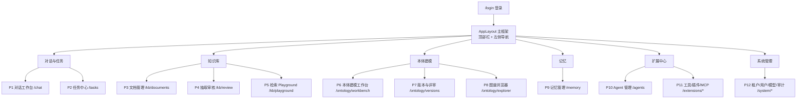
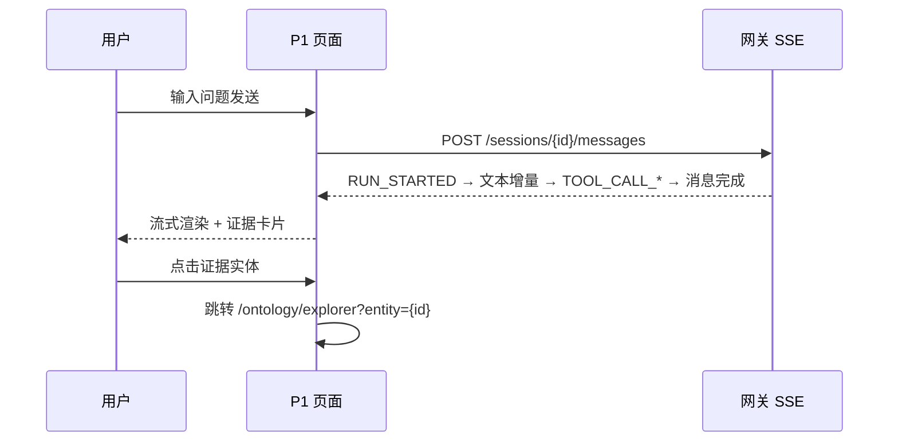
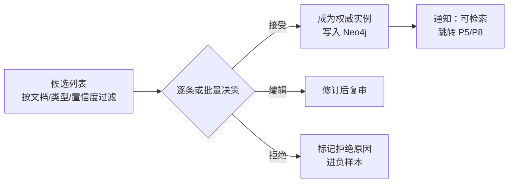
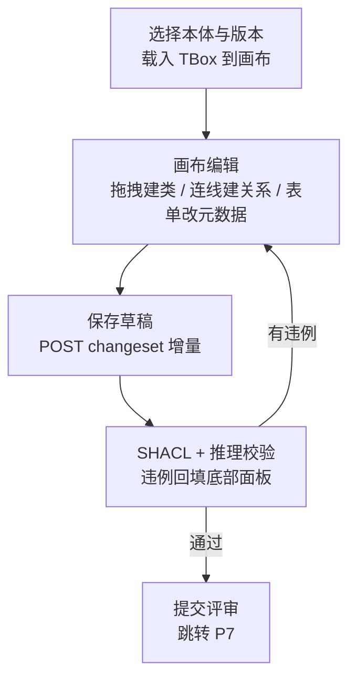
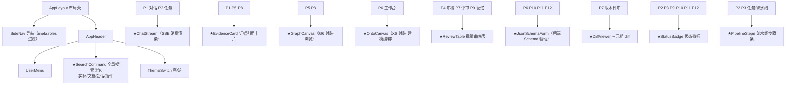
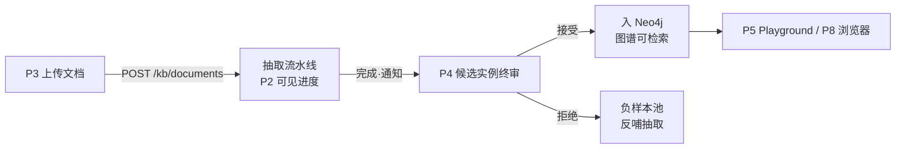
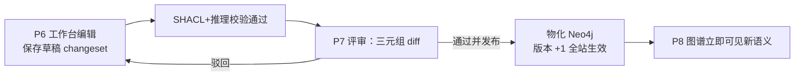
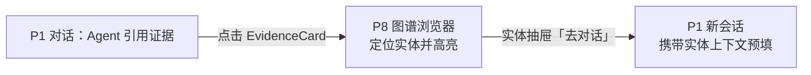

# 02 - 信息架构与页面设计


> ⚠ **2026-09-26 混合路线终裁**：本文为**信息架构权威（栈无关）**——页面清单/路由/角色/组件关联/跳转流继续有效且被 PRD、api/01、用户手册引用；视觉与前端工程栈以 [docs/架构设计/03](../架构设计/03-前端架构与UI设计规范.md)（React+Apple）与 16/22 篇为准；文中 Vue 专属组件实现（Pinia stores/G6 封装等）按 React 等价物重读。

> 状态：v0.1 | 日期：2026-09-26 | 上游依据：[架构锚点](../architecture/01-总体架构与分层.md)、[01-主题与设计系统](./01-主题与设计系统.md)

---

## 1. 信息架构总览

### 1.1 角色（路由表与页面权限的依据）

| 角色 | 说明 |
| ---- | ---- |
| `super_admin` | 平台超级管理员：租户管理、全局模型网关 |
| `admin` | 租户管理员：用户/角色、模型渠道与成本、审计 |
| `ontologist` | 本体建模员：工作台编辑、变更提交 |
| `curator` | 知识审核员：抽取终审、记忆升级审核、变更评审 |
| `member` | 普通成员：对话、检索、图谱浏览、查看任务 |

> 角色模型的权威定义在 [08-横切关注点与工程规范 §2.2](../architecture/08-横切关注点与工程规范.md)：`ontologist`=知识工程师、`curator`=业务专家、`member`=开发者、`admin`=租户管理员、`super_admin`=平台级保留角色；另有 `guest`（访客）仅开放公开入口只读，JWT `roles` claim 与本表使用同一套 id。

### 1.2 站点地图



### 1.3 主框架布局（AppLayout）

```text
┌────────────────────────────────────────────────────────────────┐
│ AppHeader 56px: Logo | SearchCommand(⌘K) |          主题切换 ● │
│                             通知铃铛 | UserMenu▾               │
├──────────┬─────────────────────────────────────────────────────┤
│ SideNav  │  <router-view> 页面内容区（bg-page，内边距 24px）     │
│ 220px    │  ┌───────────────────────────────────────────────┐  │
│ 对话与任务│  │  页面标题 + 操作区（display 字号 + Primary）    │  │
│ 知识库    │  ├───────────────────────────────────────────────┤  │
│ 本体建模  │  │  页面主体（卡片 bg-card / radius-card）        │  │
│ 记忆      │  │                                               │  │
│ 扩展中心  │  └───────────────────────────────────────────────┘  │
│ 系统管理  │                                                     │
└──────────┴─────────────────────────────────────────────────────┘
```

## 2. 路由表

| Path | 页面 | 菜单层级 | 所需角色 |
| ---- | ---- | ---- | ---- |
| `/login` | 登录 | 独立（无框架） | 公开 |
| `/` | 重定向 → `/chat` | — | 登录即可 |
| `/chat` | P1 对话工作台 | 一级·对话与任务 | 全部角色 |
| `/tasks` | P2 任务中心 | 一级·对话与任务 | 全部角色 |
| `/tasks/:taskId` | 任务详情（页内抽屉承载，可深链） | 二级·隐藏菜单 | 全部角色 |
| `/kb/documents` | P3 文档管理 | 二级·知识库 | member+（写入需 curator） |
| `/kb/review` | P4 抽取审核 | 二级·知识库 | curator、admin |
| `/kb/playground` | P5 检索 Playground | 二级·知识库 | 全部角色 |
| `/ontology/workbench` | P6 本体建模工作台 | 二级·本体建模 | ontologist、admin（只读另议） |
| `/ontology/versions` | P7 版本与评审 | 二级·本体建模 | ontologist、curator、admin |
| `/ontology/explorer` | P8 图谱浏览器 | 二级·本体建模 | 全部角色 |
| `/memory` | P9 记忆管理 | 一级·记忆 | member 查看；L2→L3 审核需 curator/admin |
| `/agents` | P10 Agent 管理 | 一级·扩展中心 | member（自己的）、admin |
| `/agents/:agentId` | Agent 详情/运行历史 | 二级·隐藏菜单 | 同上 |
| `/extensions/tools` | 工具注册中心 | 二级·扩展中心 | admin（查看 member） |
| `/extensions/market` | 插件市场 | 二级·扩展中心 | 全部角色（安装需 admin） |
| `/extensions/mcp` | 外部 MCP Server 管理 | 二级·扩展中心 | admin |
| `/system/tenants` | 租户管理 | 二级·系统管理 | super_admin |
| `/system/users` | 用户管理 | 二级·系统管理 | admin、super_admin |
| `/system/roles` | 角色权限 | 二级·系统管理 | admin、super_admin |
| `/system/groups` | 用户组管理（P12 分区，2026-09-26 对标补齐） | 二级·系统管理 | admin、super_admin |
| `/system/models` | 模型网关与成本 | 二级·系统管理 | admin、super_admin |
| `/system/audit` | 审计日志 | 二级·系统管理 | admin（只读）、super_admin |
| `/settings` | P13 个人设置（画框 27，逐页节待补，见 §6） | 头像下拉·独立页 | 登录即可 |
| `/chat/group/:sessionId` | P14 Agent 群聊（2026-09-26 新增，权威设计=[27 篇](../架构设计/27-Agent群聊与工作流编排设计.md)） | 一级·对话与任务 | 全部角色（建群受 Agent ACL 约束） |
| `/workflows` | P15 工作流编排·列表（2026-09-26 新增，权威设计=[27 篇](../架构设计/27-Agent群聊与工作流编排设计.md)） | 二级·扩展中心 | admin、ontologist（运行受工作流 ACL） |
| `/workflows/:workflowId` | P15 工作流编排·编辑器 | 二级·隐藏菜单 | 同上 |

> 菜单按 `meta.roles` 过滤后动态渲染；无权限路由直接 403 页，不隐藏 URL。

## 3. 逐页设计

> 每页给出：目的与角色 / ASCII 线框 / 核心组件（★ = 全局复用组件，见 §4）/ 交互流 / 依赖 API。
>
> 2026-09-26 评审修复F 去双源：原逐页复制的 API 行已删除，改为每页一句指向 [api/01](../api/01-REST-API契约.md) 对应分组的引用——**api/01 是端点唯一事实源**，本篇只保留页面编号锚点（P1~P12）与交互语义。

### P1 对话工作台 `/chat`

**目的**：与 Agent 对话；SSE 流式渲染、工具调用可视化、证据引用。角色：全部。

```text
┌──────────┬───────────────────────────────────────────────────┐
│ 会话列表  │ [Agent▾ nanobot] 会话标题  [🕶临时][🔗分享] [＋新对话]│
│ (260px)  ├───────────────────────────────────────────────────┤
│ 🔍 过滤   │  ┌ ChatStream 消息流 ──────────────────────────┐  │
│ 📌 置顶A  │  │ 🧑 帮我梳理设备故障类目   hover:[✎][↻][⧉][👍]  │  │
│ ▾ 项目A   │  │ 🤖 正在检索知识库…                           │  │
│  ○会话 B  │  │ ⚙ 工具调用时间线（折叠）                      │  │
│ ○会话 C   │  │   ✓ kb.search      1.2s                     │  │
│ ──────── │  │   ✓ ontology.reason 0.3s                    │  │
│          │  │ 🤖 根据图谱…█（流式光标） ‹分支 1/2›           │  │
│          │  │ 📎 [EvidenceCard ×3：来源文档/三元组/置信度]   │  │
│          │  │ 📄 [设备手册.pdf · chip · 预览/转存知识库]      │  │
│          │  └─────────────────────────────────────────────┘  │
│          │ [＋附件][🌐搜索⦿][🧠档位▾][输入框… / ⧉ @ ＃][模型▾] │
│          │ [发送][⏹停止]  ▓▓▓▓▓▓░░░░ ContextMeter 上下文 62%  │
└──────────┴───────────────────────────────────────────────────┘
```

- **组件**：★ChatStream（SSE 消费渲染）、★EvidenceCard、★StatusBadge、ToolCallTimeline（页内）、SessionList（页内）、MessageInput（页内，扩为输入栏五件套）、MessageActions / FileUploadButton + AttachmentChip + FilePreviewDrawer / ReasoningEffortPicker / MentionMenu / SlashCommandMenu / ContextMeter / ShareDialog（页内，组件规格统一见 [24 篇 §3.8](../架构设计/24-前端组件库扩充与外部样式借鉴.md)）。
- **交互流**：



- **回写二次确认**（FR-WB-06 承接，2026-09-26 评审修复F 补）：Agent 触发高风险 `action.invoke` 时弹出**二次确认弹窗**——展示动作名 / 参数快照 / 风险等级与守护规则，用户确认（生成 `confirm_token`）后继续执行，取消则该工具调用终止并留审计；MCP annotations 仅作 UI 提示、不作授权。
- **输入栏五件套与对话控制**（2026-09-26 对标补齐，来源 [25 篇](../架构设计/25-前端页面功能缺口对标与任务清单.md) F-01/F-02/F-04~F-09）：从左至右 ① `＋附件`（图片/PDF/Office/文本，按钮+拖拽双入口，AttachmentChip 行内预览；附件**两路**——默认临时附件仅随消息存 MinIO 供本会话引用、不进抽取流水线，显式"转存知识库"才走 P3 七步流水线与审核队列，绝不绕审直入库）；② 工具开关组（联网搜索等 ToolToggleGroup）；③ 思考档位 ReasoningEffortPicker（关闭/低/中/高，随会话记忆，**只调 LLM 推理预算、不影响规则/SHACL 确定性路径**，档位变化入审计）；④ 文本框三触发符：`/` 斜杠命令（提示词库）、`@` 提及（知识库/工具/文件）、`#` 挂载知识库（与会话级知识库挂载同源）；⑤ 模型/Agent 选择器（既有）。输入栏底部 ContextMeter 上下文水位条（并入 24 篇 TokenUsageMeter 规格，>80% 预警）。
- **消息操作组**（25 篇 F-03，P0）：消息 hover 显示 复制/编辑/重新生成/赞踩；**编辑用户消息 = 从该点分叉**（复用 BranchSwitcher 与轨迹页"从此分叉"机制，非原地改写，保全程可追溯），重生成产生新分支以 BranchSwitcher 切换。
- **临时会话**（25 篇 F-06，P1）：顶栏入口，标记 `ephemeral`——不进历史检索、不产生 L2 候选沉淀、不写 L1 个性化；**仍全量写审计与 trace_id**。
- **会话组织**（25 篇 F-04，P1）：会话列表 hover/右键菜单：置顶、标签、重命名、归档；文件夹（Projects 形态）与"项目指令"待与 memory 域裁决后立（F-04b）。
- **分享与导出**（25 篇 F-07，P1）：ShareDialog 生成只读快照链接（有效期/水印策略），导出 Markdown/JSON；快照路由独立于会话权限体系，过期即失效。
- **API**：见 [api/01](../api/01-REST-API契约.md) §5.2「sessions 与 tasks」对应组；附件/分享/分支/挂载/提示词库等新增端点见同篇 §5.2 新增行与 §5.10（2026-09-26 预登记）。

### P2 任务中心 `/tasks`

**目的**：异步任务（抽取流水线、批量导入、插件安装）的列表、详情与状态时间线。角色：全部。

```text
┌────────────────────────────────────────────────────┐
│ 任务中心      [状态▾] [类型▾] [时间范围]   [刷新]     │
├────────────────────────────────────────────────────┤
│ 名称          类型      状态★       进度   创建时间    │
│ 设备手册.docx  kb抽取   ●抽取中      ▓▓▓░60% 10:21    │
│ 本体导入.ttl   导入     ✓已完成      100%   09:40    │
└────────────────────────────────────────────────────┘
```

- **组件**：★StatusBadge、★PipelineSteps、TaskTable（页内）、TaskDetailDrawer（页内）。
- **交互流**：列表过滤 → 点击行开抽屉 → 抽屉内 SSE 订阅 `tasks/{id}/events` 实时推进时间线 → 失败任务「查看日志」→ 抽取类任务完成给「去审核」按钮跳 P4。
- **API**：见 [api/01](../api/01-REST-API契约.md) §5.2「sessions 与 tasks」对应组（/tasks 列表与 /tasks/{id}/events 时间线）。

### P3 知识库-文档管理 `/kb/documents`

**目的**：文档上传、解析/抽取流水线状态、分片预览。角色：member 上传、curator 管理。

```text
┌─────────────────────────────────────────────────────┐
│ 文档管理   [搜索] [类型▾] [状态▾]        [⬆ 上传文档]  │
├─────────────────────────────────────────────────────┤
│ 名称            大小   状态★        流水线      操作    │
│ 设备手册.pdf    12MB  ✓已入库      七步全绿    预览 删除 │
│ 故障记录.xlsx   3MB   ●抽取中      ▓▓▓░░ 4/7  预览    │
│ 会议纪要.docx   1MB   ⚠待抽取      未开始      抽取    │
└─────────────────────────────────────────────────────┘
  「预览」→ 抽屉：分片列表（左侧）+ 分片原文/元数据（右侧）
```

- **组件**：★StatusBadge、★PipelineSteps、UploadDialog（页内，el-upload 拖拽）、ChunkPreviewDrawer（页内）。
- **交互流**：上传 → 建抽取任务 → 列表流水线进度（轮询+SSE）→ 完成后通知中心 + 行内「去审核」跳 P4。
- **API**：见 [api/01](../api/01-REST-API契约.md) §5.4「kb」对应组（documents 登记与 /chunks 分片预览）。

### P4 知识库-抽取审核 `/kb/review`

**目的**：候选实例**人工终审**（候选非成品门禁，锚点 §6.5），对接后端 `review_workflow`。角色：curator、admin。

```text
┌─────────────────────────────────────────────────────────────┐
│ 抽取审核   [文档▾] [类型▾] [置信度▾]   已选 12 [✓批量通过][✕拒绝]│
├──────────────────────────┬──────────────────────────────────┤
│ 候选列表 ReviewTable      │ 原文对照（选中候选的来源上下文）      │
│ ☑ (故障,发生于,部件A) 0.92│ 「……3 号机组停机后，部件 A 出现   │
│ ☐ (故障,locatedIn,车间2)│  过热报警……」（命中句高亮）          │
│ ☑ (部件A,isa,设备)    0.88│ ────────────────────────────────  │
│ …                        │ [✓接受] [✎编辑后接受] [✕拒绝] [跳过] │
└──────────────────────────┴──────────────────────────────────┘
```

- **组件**：★ReviewTable（批量勾选 + 快捷键 J/K/N 通过/拒绝/跳过）、★StatusBadge、SourceComparePanel（页内，命中句高亮）、EditTripleDialog（页内，编辑谓词/宾语后入审）。
- **交互流**：



- **API**：见 [api/01](../api/01-REST-API契约.md) §5.4「kb」对应组（review candidates / decision / batch-decision）。

### P5 知识库-检索 Playground `/kb/playground`

**目的**：GraphRAG 检索调试：local/global/drift 三模式对比，结果 + 图谱证据链。角色：全部。

```text
┌───────────────────────────────────────────────────────┐
│ ⌘ 检索 Playground                                      │
│ [输入问题………………………………………] [模式: local|global|drift] [检索] │
├───────────────────────────┬───────────────────────────┤
│ 检索结果                   │ 图谱证据链（★GraphCanvas）   │
│ ┌ 答案摘要（LLM）────────┐ │   ●实体──▶●实体             │
│ │ ……引用 [1][2]          │ │        ▶社区◎(global)      │
│ └────────────────────────┘ │  [图例：八色板]             │
│ [1] 文档·分片  得分0.91    │  点击节点 → 跳 P8 定位       │
│ [2] 社区摘要    得分0.87    │                            │
└───────────────────────────┴───────────────────────────┘
```

- **组件**：★GraphCanvas（G6）、★EvidenceCard、ModeSegmented（页内，local=实体邻域 / global=社区摘要 / drift=混合）、AnswerPanel（页内，引用角标悬停预览）。
- **交互流**：输入 → 选模式 → 检索（loading 骨架）→ 左结果右证据链联动（hover 引用高亮对应节点）→ 节点点击跳 P8。
- **API**：见 [api/01](../api/01-REST-API契约.md) §5.4「kb」对应组（/kb/search；参数与返回契约权威=docs/OntRAG §5）。

### P6 本体建模工作台 `/ontology/workbench`（★最核心页面）

**目的**：类/属性/公理/规则的可视化建模与治理：图谱画布编辑 + SHACL/推理校验 + 版本操作。角色：ontologist。

```text
┌────────────────────────────────────────────────────────────────────┐
│ 版本操作栏: [本体:设备运维▾ v3.2]  状态:●草稿  [保存草稿][提交评审→P7][对比] │
├──────────────┬──────────────────────────────────┬──────────────────┤
│ 左树 260px    │  中央画布 ★OntoCanvas (X6)        │ 右侧属性表单 320px │
│ [类|属性|公理|│  ┌───────────────────────────┐   │ JsonSchemaForm    │
│  规则] Tab    │  │   ◻设备────▶◻部件          │   │ 名称: [故障     ]  │
│ 🔍搜索类      │  │   │isa      │partOf        │   │ 父类: [设备     ▾] │
│ ▾设备运维     │  │   ▽      ◇约束(SHACL)      │   │ 属性: + 添加       │
│   ▪设备       │  │   ◻故障传感器               │   │ 描述: [……     ]    │
│   ▪部件       │  │  (拖拽新建/连线/框选/缩放)    │   │ ────────────────  │
│ ▸故障域      │  └───────────────────────────┘   │ [应用修改]         │
├──────────────┴──────────────────────────────────┴──────────────────┤
│ 校验结果面板（可折叠 220px）: [SHACL 违例 3 | 推理结果 12 | 变更预览]     │
│ ⛔ 故障.发生时间: 基数违规 minCount=1   [定位]  ← 点击定位画布并高亮      │
└────────────────────────────────────────────────────────────────────┘
```

- **组件**：★OntoCanvas（X6：节点=类/属性/规则/约束四型，样式见 01 篇 §4）、★JsonSchemaForm（元数据表单由后端 JSON Schema 驱动，含 GB/T 48000.3 必填校验）、★StatusBadge、OntoTree（页内：四 Tab 资源树，支持拖入画布）、ValidationPanel（页内：SHACL/推理/变更预览三 Tab，点击违例「定位」闪烁对应节点）。
- **交互流**：



- **API**：见 [api/01](../api/01-REST-API契约.md) §5.3「ontology」对应组（/ontologies 复数前缀、changesets 五动词）。

### P7 本体版本与评审 `/ontology/versions`

**目的**：changeset 列表、三元组级 diff、评审流操作（发布/驳回/回滚）。角色：ontologist 提交，curator/admin 评审。

```text
┌───────────────────────────────────────────────────────────────┐
│ 版本与评审   v3.1(已发布) ← v3.2(评审中)              [回滚…▾]   │
├───────────────────────────────────────────────────────────────┤
│ Changeset 列表: 编号   提交人    状态★     时间     操作         │
│                 CS-41  张三     ⚠评审中   10:00   [评审]        │
│                 CS-40  李四     ✓已发布   昨天    [对比]        │
├─ 进入 CS-41 ──────────────────────────────────────────────────┤
│ DiffViewer（三元组级）:  + (故障,subClassOf,设备事件)  [接受][拒绝] │
│                         − (部件,partOf,车间)         [拒绝]     │
│ 评审操作: [✓通过并发布] [✕驳回(附意见)]   发布后物化 Neo4j→全站生效 │
└───────────────────────────────────────────────────────────────┘
```

- **组件**：★DiffViewer（三元组增删改三色标注：+success 底 / −danger 底 / ~warning 底）、★ReviewTable（复用批量决策交互）、★StatusBadge、RollbackDialog（页内，回滚需二次确认 + 审计理由）。
- **交互流**：列表 → 进入 changeset → 逐条/批量审 diff → 通过并发布（进度：物化 Neo4j → 通知）或驳回（回 P6 修改）；版本时间线支持任意已发布版本回滚。
- **API**：见 [api/01](../api/01-REST-API契约.md) §5.3「ontology」对应组（changesets submit/approve/reject/publish/rollback 五动词与 diff）。

### P8 图谱浏览器 `/ontology/explorer`

**目的**：全局 ABox 实体搜索、邻域展开、路径查询。角色：全部。

```text
┌───────────────────────────────────────────────────────┐
│ [🔍 SearchCommand 全局实体搜索 ⌘K]   [两实体路径查询]     │
├───────────────────────────────────────────────────────┤
│ ★GraphCanvas (G6) 全屏画布                              │
│   ●部件A ──▶ ◻设备 ──▶ ◎社区                            │
│   双击节点 → 邻域展开（按关系类型过滤 ▾）                  │
├───────────────────────────────────────────────────────┤
│ 右侧详情抽屉 380px：实体属性 / 来源文档 / 关联证据 → P1 追问 │
└───────────────────────────────────────────────────────┘
```

- **组件**：★GraphCanvas（G6）、★SearchCommand、EntityDrawer（页内：属性表 + 「去对话」携带实体上下文跳 P1）、PathQueryDialog（页内：起止实体 + 最大跳数）。
- **交互流**：搜索/点选实体 → 渲染邻域 → 逐层展开 → 路径查询两实体关系链 → 实体抽屉跳转 P1（预填问题）或 P5。
- **API**：见 [api/01](../api/01-REST-API契约.md) §5.4「kb」对应组（/kb/graph/search、/kb/graph/neighborhood、/kb/graph/path）。

### P9 记忆管理 `/memory`

**目的**：L1~L4 四层记忆浏览与治理；L2→L3 升级审核。角色：member 查看，curator 审核。

```text
┌─────────────────────────────────────────────────────────┐
│ 记忆管理   [L1 工作记忆|L2 会话摘要|L3 组织图谱|L4 长期知识] │
├──────────────────────────┬──────────────────────────────┤
│ 记忆条目列表              │ 时间线（该记忆的沉淀轨迹）        │
│ 来源会话  摘要   状态★    │ 10:21 会话#88 产生              │
│ #88 设备巡检规范 ⚠候选L3  │ 11:02 L2 摘要生成               │
│ #87 温度阈值   ✓已入L3   │ 14:00 [升级审核] → ✓通过入 L3    │
└──────────────────────────┴──────────────────────────────┘
```

- **组件**：★ReviewTable（L2→L3 升级审核队列，复用批量决策）、★StatusBadge、MemoryTimeline（页内）、LayerTabs（页内，L1 只读展示 Redis 热数据，L3 提供图谱缩略视图）。
- **交互流**：切层 → 过滤 → 候选记忆「升级审核」→ 对照原文通过/拒绝 → 通过后写入 L3（Neo4j 时序图）→ 时间线留痕。
- **API**：见 [api/01](../api/01-REST-API契约.md) §5.5「memory」对应组（facts 查询与 /memory/facts/{id}/timeline）。

### P10 Agent 管理 `/agents`

**目的**：托管 agent 的注册、适配器配置、平台工具注入与运行历史。角色：member 管自己的，admin 全量。

```text
┌──────────────────────────────────────────────────────┐
│ Agent 管理                                [＋注册 Agent]│
├──────────────────────────────────────────────────────┤
│ [nanobot 卡片] [openclaw 卡片] [hermes 卡片] [＋]       │
│   状态★运行中    状态★已停止     状态★异常              │
└─ 详情 /agents/{agentId} ─────────────────────────────┤
│ Tab: 基本信息 | 工具配置 | 适配器 | 运行历史             │
│ 工具配置: ☑kb.search ☑ontology.reason ☐mcp·crm.query  │
│ 运行历史: 会话列表（跳 P1 续聊）/ 任务列表（跳 P2）       │
└──────────────────────────────────────────────────────┘
```

- **组件**：★JsonSchemaForm（适配器接入参数）、★StatusBadge、ToolPicker（页内：平台工具 + 已注册 MCP 工具树勾选）、RunHistoryTable（页内）。
- **交互流**：注册 → 选适配器类型与参数 → 勾选托管工具 → 启动运行时插槽 → 运行历史可回放并跳 P1。
- **API**：见 [api/01](../api/01-REST-API契约.md) §5.1「agents」对应组。

### P11 扩展中心 `/extensions/*`

**目的**：工具注册中心、插件市场、外部 MCP Server 管理。角色：admin 为主，市场全员可浏览。

```text
┌ Tab: 工具注册中心 ─────────────────────────────────────┐
│ 工具列表（名称/来源(内置|MCP|插件)/scope/状态★/启停开关）  │
│  详情抽屉: 输入输出 Schema(JsonSchemaForm 预览)+调用统计  │
├ Tab: 插件市场 ────────────────────────────────────────┤
│ [插件卡片×N：图标/名称/评分/权限 scope 数]  [搜索][分类▾] │
│  详情页: README/版本/权限清单 → [安装] → 安装向导(3 步)：  │
│   ①选择版本 ②scope 确认(高危项 danger) ③安装(任务→P2)   │
│   上架新插件需走 review_workflow 审核                     │
├ Tab: 外部 MCP Server ─────────────────────────────────┤
│ Server 列表: 名称/传输(Streamable HTTP|stdio)/健康★/工具数│
│  接入向导: URL+鉴权 → 连接测试 → 发现工具清单勾选纳管      │
└────────────────────────────────────────────────────────┘
```

- **组件**：★StatusBadge、★JsonSchemaForm、ScopeConfirm（页内：scope 逐项确认，高危项 danger 标红）、PluginCard（页内）、McpConnectWizard（页内：步骤条）。
- **交互流**：注册工具/接入 MCP Server → 发现能力 → 纳管进工具注册中心 → P10 可勾选注入 Agent；插件安装走任务化流水线（scope 确认是强制步骤，不过不能下一步）。
- **API**：见 [api/01](../api/01-REST-API契约.md) §5.6「plugins 与 tools」与 §5.7「mcp」对应组。

### P12 系统管理 `/system/*`

**目的**：租户/用户/角色、模型网关配置与成本、审计日志。角色：admin、super_admin。

```text
┌ Tab: 租户(super_admin) / 用户 / 用户组 / 角色 ──────────┐
│ 用户表: 账号/姓名/角色Tag/状态★/最后登录   [＋邀请成员]    │
│ 用户组: 建组/成员入组/组权限（RBAC 之上的批量授权单元）     │
│ 角色: RBAC 矩阵（角色 × 权限点勾选，对齐 §2 路由角色）     │
├ Tab: 模型网关 ────────────────────────────────────────┤
│ 渠道表: 提供商/模型/优先级/预算/状态★      [＋接入渠道]     │
│ 成本看板(ECharts): 近30天 Token/费用趋势 + 按模型占比环形图│
├ Tab: 审计日志 ────────────────────────────────────────┤
│ 筛选: 操作者/动作/对象/时间   列表: 谁·何时·做了什么·结果   │
│ trace_id 点击 → 展开本次请求全链路（关联工具调用与成本）    │
└────────────────────────────────────────────────────────┘
```

- **组件**：★StatusBadge、★JsonSchemaForm（渠道配置）、CostDashboard（页内，ECharts + 主题 token 定制）、AuditTable（页内，trace_id 可展开）、RbacMatrix（页内）、UserGroupForm / GroupMemberPicker / AclEditorDialog（页内，规格见 [24 篇 §3.8](../架构设计/24-前端组件库扩充与外部样式借鉴.md)）。
- **交互流**：角色矩阵变更即时生效于菜单/路由；渠道增删走连通性测试；审计日志只读，导出走任务中心。
- **用户组与资源 ACL**（2026-09-26 对标补齐，来源 [25 篇](../架构设计/25-前端页面功能缺口对标与任务清单.md) F-10/F-11，P1）：用户组 Groups=批量授权单元（角色 RBAC 之上、资源 ACL 的授权对象）；资源级 ACL 覆盖**知识库/Agent/模型渠道**三类资源（per 组 / per 人 授 可读/可用/可写，AclEditorDialog 承载）；补默认新用户权限模板与注册开关（邀请制）；模型渠道"可用人选"限定组，与成本看板预算降级策略联动（触顶切本地档按组判断）。治理档位映射：solo 不暴露组/ACL UI，team 启用组+库级 ACL，enterprise 全量+SSO。**权限申请=审批中心第六类对象**（权威落点 11 篇 §6，经协调项 X7），403 状态页"申请权限"入口由此闭环：申请（理由/目标资源/申请权限）→ 审批 → 自动授权并审计。
- **API**：见 [api/01](../api/01-REST-API契约.md) §5.8「admin 与 writeback 台账」对应组（/admin/models、/admin/costs、/admin/audit-logs）。

### P14 Agent 群聊 `/chat/group/:sessionId`（2026-09-26 新增）

**目的**：一个会话内用户与多个 Agent 插槽实例协作（例：停电分析群=调度+设备+报告三 Agent）。角色：全部。**线框与完整交互语义 = [27 篇 §2](../架构设计/27-Agent群聊与工作流编排设计.md)（去双源，本篇只留锚点与交互语义）**。

- **组件**：复用 P1 全套（★ChatStream/输入栏五件套/★EvidenceCard/ActionConfirmCard）；新增 AgentAvatar/MemberPanel/MemberPickerDialog/RoutingModePicker/ResponseGroup（规格见 [24 篇 §3.10](../架构设计/24-前端组件库扩充与外部样式借鉴.md)）；MentionMenu 的 `@` 对象扩展为群内成员 Agent。
- **交互语义**：发言编排四模式——@点名/轮询/多答对比=确定性路由，协调者=唯一 LLM 路由且写审计（消息流系统行展示"协调者→成员（原因摘要）"）；每条 Agent 消息带归属（头像+名称+模型徽标+分类色）；高风险动作仍走二次确认（confirm_token）；群聊不写个性化 L1，L2 候选标注参与者；多答对比 >3 成员发送前二次确认预算。
- **API**：见 [api/01](../api/01-REST-API契约.md) §5.2（`type=group`/`members`/`routing` 字段与 members 两端点，2026-09-26 预登记）。

### P15 工作流编排 `/workflows`、`/workflows/:workflowId`（2026-09-26 新增）

**目的**：把 Agent 插槽/工具/知识检索/审批编排为可版本化、可试运行的有向图。角色：admin、ontologist（运行受工作流 ACL）。**线框、节点类型与断点语义 = [27 篇 §3](../架构设计/27-Agent群聊与工作流编排设计.md)**。

- **组件**：WorkflowNode 八类节点卡/NodeLibraryPanel/WorkflowInspector/TestRunDrawer/BreakpointChip（规格见 [24 篇 §3.10](../架构设计/24-前端组件库扩充与外部样式借鉴.md)）；画布走 React Flow（★OntoCanvas 同族，[24 篇 §4.11](../架构设计/24-前端组件库扩充与外部样式借鉴.md) 规范）。
- **交互语义**：三栏=节点库|画布|检查器；条件路由节点仅确定性表达式（LLM 不做隐藏分支）；草稿→试运行→提交发布生成不可变版本（team/enterprise 档走 `workflow_publish` 审批，第七类对象候选挂账 11 篇）；节点断点命中即暂停，查轨迹跳画框 21（TrajectoryView 复用）；运行历史落任务中心（type=`workflow_run`/`workflow_test`）。
- **API**：见 [api/01](../api/01-REST-API契约.md) §5.11（workflows 端点组，2026-09-26 预登记）。

## 4. 全局组件关联图



- 复用组件统一放 `src/components/`，页面私有组件放各 `views/**/components/`；组件只吃 props + token，不发请求（请求在页面/composables 层）。

## 5. 关键页面跳转流

### 5.1 知识流：上传 → 抽取 → 终审 → 可检索



### 5.2 治理流：建模变更 → 评审 → 发布



### 5.3 对话证据闭环：对话 → 证据 → 图谱 → 回对话



> 跳转一律带查询参数深链（如 `/ontology/explorer?entity=eq-123`、`/kb/review?doc=doc-9`），目标页负责还原过滤态；跨页通知统一走 AppHeader 通知中心 + 任务中心。

## 6. 待办与开放问题

- [ ] P6 画布与右树双向选中/滚动的联动细节（树展开定位到画布节点）需要原型验证。
- [ ] P4 快捷键方案（J/K/N）与输入框冲突处理；批量上限（暂定 200 条/批）待与 review_workflow 对齐。
- [ ] SSE 断线重连期间的消息补偿策略（Last-Event-ID 续传 or 快照拉齐）需网关侧确认。
- [ ] P12 成本看板聚合粒度（日/小时）与 `admin/costs` 返回结构对齐。
- [ ] 插件市场卡片信息密度与真实插件元数据字段对齐（待 docs/Skills 定稿）。
- [ ] P9 L1 工作记忆是否对 member 开放可见（含他人会话时需脱敏），待权限矩阵评审。
- [ ] 403/404/500 全局错误页与空态设计稿补充。
- [ ] **P13 个人设置页 `/settings` 缺页补齐**（2026-09-26 对标发现）：设计稿画框 27 已有完整设计（资料/安全 2FA/API Keys/通知偏好/外观语言），本篇逐页设计缺对应节；补节时纳入记忆开关区与默认对话参数偏好（[25 篇](../架构设计/25-前端页面功能缺口对标与任务清单.md) F-13）。
- [ ] **P14/P15 设计稿实装挂账**（2026-09-26，[27 篇](../架构设计/27-Agent群聊与工作流编排设计.md) F-18b）：ui-pages 画框 28（群聊）/ 29（工作流编排）；interactions 层 IX 编号随 26 篇矩阵扩展（与其权威会话会审后定）。
- [ ] 2026-09-26 对标缺口落点核对：P1 输入栏五件套/消息操作/临时会话/分享与本篇 P12 用户组+ACL 已入正文；分支/用量水位 SSE 事件登记待 02-SSE 协议篇（X3/X8）。
