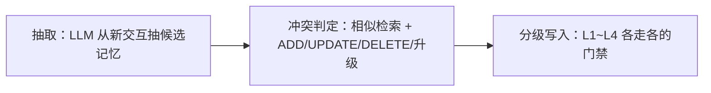
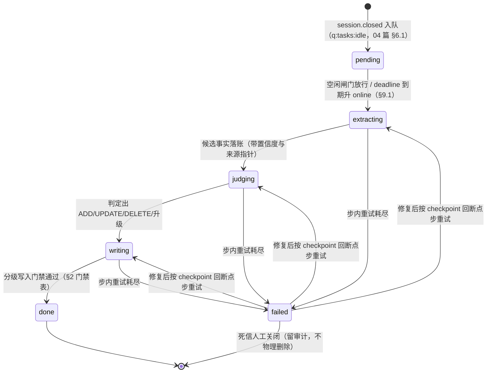
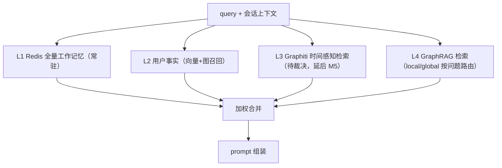
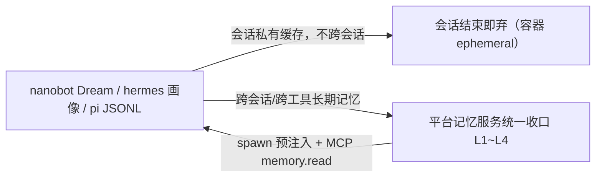
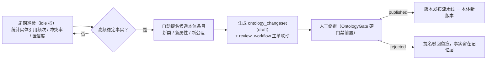

# 多层记忆服务 - 设计

> 状态：v0.2（2026-09-26 评审修订：L2/L3 引擎选型改「待裁决」+ M3 过渡方案，见 §1 裁决框） | 日期：2026-09-26 | 上游依据：[架构锚点](../architecture/01-总体架构与分层.md)、[研究整理/04-多层记忆](../研究整理/04-多层记忆.md)、[评审记录](../architecture/评审-2026-09-26-多专家研讨与行业痛点批判.md) §3/§6

服务规范名**记忆服务**（锚点 §5 模块 #4）。代码落点：`services/business/memory_service/`（读写/沉淀编排）、`services/domain/model/memory/`（领域模型）、`services/data/`（Redis/PG/Milvus/Neo4j 客户端与仓储实现）。

## 1. 理论基座与四层设计

CoALA 记忆四分类（工作记忆 / 情景记忆 / 语义记忆 / 程序记忆，研究整理 04 §1）映射为平台四层，逐层沉淀（研究整理 04 §3 的表全部沿用并具体化）：

> **【裁决框｜L2/L3 引擎选型：待裁决（2026-09-26 评审修订）】**
>
> - 评审判定（[评审记录](../architecture/评审-2026-09-26-多专家研讨与行业痛点批判.md) §3）：**引擎未 PoC 不得写死设计**。本文中 mem0 与 Graphiti 的机制描述一律视为**候选方案分析**，不构成选型承诺；
> - **引擎选型由锚点 §7 PoC ④ 裁决（M3 出口条件）**。裁决维度：抽取质量 / 延迟 / 存储成本 + **Graphiti × Neo4j 社区版兼容性确认**（社区版无多 database 与 RBAC，多租户只能属性级隔离，锚点 §3.2）；
> - 裁决前，本文依赖具体引擎的实现段落一律标「**待裁决**」——两引擎存储拓扑迥异，换型即重写 schema 与召回，实现必须与引擎解耦；
> - **M3 过渡方案（先行落地，不依赖引擎）**：L1（Redis+PG）+ **结构化 L2**（PG `memory_l2_facts` + pgvector/Milvus 嵌入，不绑引擎、直接仓储实现，模型见 §7）；
> - **L3（Graphiti 时序图）整体延后到 M5**（锚点 §7 M5「L3 记忆（Graphiti）」）；M3~M4 期间 L3 读写接口保留、返回空集，L2→L3 升级单仅登记不落 L3。
> - **状态（2026-09-26 设计定稿）：PoC④ 裁决前为实现草案，M5 交付**——本文 L3 相关「待裁决」段落（§2 门禁注、§7 数据模型段）统一挂本状态行；表内/图内的 L3 注记（§1 表 L3 行、§3 检索图与加权表）均回指本框。

| 层 | CoALA 对应 | 内容 | 平台存储（定稿） | 写入/沉淀 | 遗忘策略 |
| ---- | ---- | ---- | ---- | ---- | ---- |
| L1 会话级 | 工作记忆 | 当前任务上下文、滑动窗口、任务草稿 | Redis（热）+ PG sessions/messages（会话日志，参考 Letta recall） | 实时写入；会话内自编辑记忆块（Letta 式） | 会话结束即归档，活跃 TTL |
| L2 用户级 | 情景+个人语义 | 用户画像、偏好、历史事实 | **M3 过渡（2026-09-26 评审修订，已裁决）**：结构化事实 PG `memory_l2_facts` + pgvector/Milvus 嵌入，直接仓储实现；**引擎层（mem0 或 Graphiti 单用户图）待裁决**（= 锚点 PoC ④，§1 裁决框 / §10） | 会话结束后台抽取沉淀（LangMem 后台路径式） | 置信度/时间衰减 + 矛盾更新 |
| L3 组织级 | 共享情景 | 团队/项目共同事件、决策、社区结构 | Graphiti 时序图（Neo4j 后端，锚点 §3.2"组织级记忆 L3 时序图"）——**待裁决，整体延后到 M5**（2026-09-26 评审修订，§1 裁决框） | 审核后的用户级记忆升级合并（M5 起可用） | invalidation 边软删，保留时间线 |
| L4 本体/知识级 | 共享语义 | 领域本体、GraphRAG 知识库 | Neo4j 属性图 + Milvus 向量层（OWL 本体管控） | 知识工程流程 + GraphRAG 索引管线（docs/OntRAG §2/§3） | 版本化发布，本体走变更评审 |

> 存储注（2026-09-26 评审修订）：研究整理 04 建议 L2 "pgvector 落底"，按架构锚点 §3.2（SSOT）记忆嵌入默认 **Milvus 承载**（full 档），lite 档以 **pgvector** 等效替代（锚点 §3.2 部署分档）——过渡方案下这只是仓储实现细节，**不绑定记忆引擎**。

程序记忆（技能/提示词模板/工具配方）单独建版本库并与插件市场打通（研究整理 04 §3.2），归 docs/Skills，本文不展开。

## 2. 写入管线

统一三步（mem0 两阶段 + LangMem 后台反思的结合，研究整理 04 §3.1）：



冲突判定动作（mem0 语义）：

| 动作 | 触发 | 处理 |
| ---- | ---- | ---- |
| ADD | 无相似事实（相似度 < 阈值） | 新建事实，写入初始 confidence |
| UPDATE | 语义相同/相近但内容变化 | 新版本 supersedes 旧版本；旧版本置 superseded（不物理删） |
| DELETE | 事实失效/被否定 | 置 invalidated，保留可审计 |
| 升级 | 判定为多人/组织相关 | 生成 L2→L3 升级申请单，不直接写 L3 |

> **待裁决（2026-09-26 评审修订）**：上表 ADD/UPDATE/DELETE/升级 动作语义沿用 mem0（候选方案分析，非选型承诺）。M3 过渡方案由结构化 L2 仓储直接实现同语义——相似检索走 pgvector/Milvus，判定属低频语义判断故由 LLM 给出、输出过规则校验（推理分级，锚点 §6.4）；引擎化实现待 PoC ④ 裁决后替换（§1 裁决框）。

各层门禁差异（研究整理 04 §3.1 沿用）：

| 迁移 | 门禁 |
| ---- | ---- |
| 会话内 → L1 | 无门禁（工作记忆实时写） |
| L1 → L2 | 会话结束后台自动抽取，静默写入（无人工） |
| L2 → L3 | 需审核：共享记忆涉及他人，默认不自动升级；走 review_workflow 升级单（2026-09-26 评审修订：审核强度按治理档位分级，见下） |
| L3 → L4 | 本体知识工程"机器粗加工 + 人工终审"门禁（研究整理 03，docs/OntRAG §2/§7） |

> **L2→L3 升级审核 × 治理档位（2026-09-26 评审修订）**：审核强度按租户治理档位（锚点 §6.8）分级——**solo 档**：本人确认即升级 + 全程审计留痕、可回滚；**team 档**：单审批人；**enterprise 档**：双负责人（四眼原则）。「候选非成品」底线三档都不破。档位定义与权限矩阵的**权威在 [08 篇](../architecture/08-横切关注点与工程规范.md)**，本文不复制。注：L3 延后到 M5（§1 裁决框），M5 前升级单仅登记、不写 L3。状态（2026-09-26 设计定稿）：PoC④ 裁决前为实现草案，M5 交付。

触发时机：L1 消息即达即写；L2 在会话 close 时触发后台任务（异步、可重试）；L2→L3 由用户/管理员发起申请；L3→L4 按知识工程排期。

**验收修复（2026-09-26）**：死信队列键=`memory:dead:{tenant_id}`（对齐 07 §5.4 派生纪律，登记其 §5.3 注册表回填）；重放顺序=按 (tenant, session, 发生时间) 保序、逐条幂等重放；人工触发=CLI `onto admin memory replay-dead`（登记 cli 待办）+ ops/02 日检 `memory_dead_depth`（回填在册）。

### 2.1 沉淀管线状态机、死信与指标（2026-09-26 P1 设计补全）

§2 三步管线（抽取→冲突判定→分级写入）在此定稿**任务级中间态状态机**。注意：memory 聚合本身无状态机（04 篇 §3），本状态机是 memory_service 沉淀任务的执行状态，**权威登记待回填 04 篇 §10 全平台状态机索引**（StepState 同款先例，见 §10 待办）。失败语义对齐 kb_pipeline 模式（03 篇 §4：checkpoint 断点续跑 + 死信 + 告警），与 §4 L1 归档双写失败语义互补——§4 管「归档搬运（Redis→PG）」失败，本节管「沉淀三步」失败：



| 机制 | 设计 |
| ---- | ---- |
| checkpoint | 每步完成即写步进 checkpoint（session_id / step / status / checkpoint_uri / error / 起止时间，对齐 03 篇 §4 `kb_pipeline_step` 模式；表 DDL 归 database 篇，回填登记 §10 待办）；抽取候选与判定决策（ADD/UPDATE/DELETE/升级）作为中间产物落 PG/MinIO，重跑自动跳过已完成步 |
| 死信队列 | 步内重试耗尽置 failed 并投 **`memory:dead`**（沉淀管线专用死信键，不落通用 `q:tasks:idle:dead`——按域独立便于按 session 重放与告警隔离；确认与可见性纪律沿用 07 篇 §5.4）；载荷带 tenant_id / session_id / 断点 step / attempt / 错误摘要 / trace_id |
| 重试参数 | 步内重试 ≤3 次（kb_pipeline 同款，03 篇 §4）；退避四元组 = **基数 1s / 乘数 2 / 上限 60s / jitter ±20%**（平台默认值，03 篇 §1 Policy 基类常量——四元组缺一即评审打回）；步超时 30 min/步（07 篇 §5.3 注册表初值）；deadline 24h 到期升 online 档（§9.1） |
| 幂等兜底 | 重放不得产生重复事实：checkpoint 粒度粗于步内时由 §5.4 事实指纹判重兜底；judging 输出「升级」的建单失败进死信（04 篇 §6.1 memory.consolidated 行：人工补建），不阻塞 writing 步完成 |
| 对账互补 | 死信是「已触发但重试耗尽」的显式登记；触发本身丢失仍由 04 篇 §6.1 定时对账兜底（扫描 closed 未沉淀会话补发）——两者共同保证 close→沉淀链路不静默断链 |
| 指标 | **`memory_pipeline_stage_duration_seconds{stage}`**（histogram，stage=extracting/judging/writing；审计遗留清单中的 `memory_pipeline_stage_duration{stage}` 落名时按 07 篇 §6 `_seconds` 命名纪律加后缀；§8「会话 close → L2 沉淀 <30s」验收的观测位）+ **`memory_dead_depth`**（gauge，死信深度；>0 进日检、持续增长告 P2——沉淀可延迟，不伤对话路径） |

## 3. 检索管线

四层并行召回 → 加权合并 → prompt 组装（研究整理 04 §3.2）：



> **【检索延迟预算（2026-09-26 评审修订）】**
>
> - memory/context 召回总预算：**设计目标 p99 ≤ 800ms（待实测冻结）**——该路径处于对话链路，直接决定首 token 延迟（docs/Agent 按 TTFT 判超时）；四层分层耗时拆解随 PoC ④ 一并实测后冻结；
> - **轻检索降级**：预算超限（超时/熔断触发）时，对话链路允许降级为「**轻检索**」——仅 L1 全量 + L2 top-k，不并行四层，优先保首 token；触发阈值与恢复策略归 chat_orchestrator 注入的 Policy 对象（L3 层策略，03 篇 §1/§3）；
> - 降级事件全程带 trace_id 并记审计（锚点 §6.7），纳入 §8 验收观测。

加权合并规则：

```
score(item) = w_layer × relevance × time_decay(Δt)
```

| 层 | w 默认 | 说明 |
| ---- | ---- | ---- |
| L1 | 常驻（不参与排序，全量注入） | 工作记忆必须完整在上下文 |
| L2 | 0.9 | relevance 为向量相似度；半衰期 30 天（可配） |
| L3 | 0.7 | 用 Graphiti 时间感知得分（2026-09-26 评审修订：待裁决，随 L3 延后 M5）；组织事实半衰期 180 天 |
| L4 | 0.8 | GraphRAG 检索分（docs/OntRAG §4）；知识不过期，decay = 1 |

prompt 组装顺序模板（注入点见 docs/Agent §5）：

```
[system]
你是 {agent_name}，遵守以下平台注入的上下文（按可信层级排序）：

# 1. 领域知识（L4，知识库检索，附引用标记）
{knowledge_context}        <!-- knowledge.search 结果，含 [1][2] 引用 -->

# 2. 组织共享事实（L3）
{org_memory}               <!-- Graphiti 相关事实，含生效期 -->

# 3. 用户个人事实（L2）
{user_memory}              <!-- 画像/偏好/历史事实，含置信度 -->

# 4. 会话工作记忆（L1，最近上下文摘要 + 自编辑记忆块）
{working_memory}

# 5. 本任务
{user_message}
```

## 4. 遗忘与审计

遗忘 = **TTL（会话级）+ 时间衰减（用户级）+ 时序失效边（组织级）+ 版本化（知识级）**——全程不物理删除，保证可审计（研究整理 04 §3.3）：

| 层 | 机制 | 实现 |
| ---- | ---- | ---- |
| L1 | 活跃 TTL + 会话结束归档 | Redis EXPIRE；归档任务把 L1 摘要写 PG 后清 Redis |
| L2 | 置信度/时间衰减 + 矛盾更新 | decay_score 定期重算，低于阈值不再召回（不删除）；UPDATE/DELETE 均为版本翻转 |
| L3 | invalidation 失效边 | Graphiti 用失效边表达事实失效，时间线完整保留 |
| L4 | 版本化发布 | 本体核心变更管控（docs/ontology） |

**L1 双写一致性——失败语义（2026-09-26 评审修订）**：L1 归档是 Redis（热）→ PG（日志）的单向搬运，「失败即丢」是评审点名的风险（[评审记录](../architecture/评审-2026-09-26-多专家研讨与行业痛点批判.md) §3），失败语义补齐：

1. 归档任务写 PG 失败 → **指数退避重试**（后台任务重试，不因单次失败丢弃）；
2. 重试耗尽仍失败 → **定时对账任务**兜底：周期扫描「status=closed 且未归档」的会话补发归档（与 04 篇 §6.1 session.closed 消费者行「丢失由定时对账补偿」同一对账机制）；
3. 补发成功前不清 Redis key；对账周期必须显著小于 L1 EXPIRE（默认 7 天），归档重试期间对 key 续期，保证对账窗口覆盖重试与补发全过程；
4. **全程不物理删除底线不变**：任何情况下不因归档失败物理删除会话数据——宁可 Redis 多留，不可 PG 缺日志。

审计：所有写操作（含失效/升级）落 PG 审计日志（谁、何时、哪层、内容摘要、依据哪条记忆），支持按 user/session 回放；与本体"知识漂移"治理共享同一套变更管控思想（研究整理 04 §3.3）。

## 5. API 契约（REST + MCP 双形态）

### 5.1 REST /api/v1/memory/*

| 方法与路径 | 说明 |
| ---- | ---- |
| GET /api/v1/memory/context | 一次取全：四层并行召回 + 加权合并结果（Agent 服务注入用），逐条带来源层标注（2026-09-26 评审修订：支持 `mode=full|light`，light=轻检索降级仅 L1+L2 top-k，见 §3 延迟预算） |
| GET /api/v1/memory/l1/{session_id} | 读 L1 工作记忆（blocks/window/state） |
| PUT /api/v1/memory/l1/{session_id} | 写 L1（自编辑记忆块、滑动窗口、任务草稿） |
| POST /api/v1/memory/facts | 写候选事实（L2；body：content、category、source_refs） |
| GET /api/v1/memory/facts | 查询用户事实（分页、status/category 过滤） |
| POST /api/v1/memory/facts/{id}/invalidate | 失效标记（无 DELETE 端点，不提供物理删除） |
| POST /api/v1/memory/promotions | 发起 L2→L3 升级申请单 |
| GET /api/v1/memory/audit | 审计查询（管理员） |

### 5.2 MCP tools（经 L7 MCP 网关，研究整理 05 §2.1）

| tool | 签名要点 |
| ---- | ---- |
| memory.read | (query, layers: ["l1","l2","l3","l4"], top_k, scope) → 合并记忆 + 逐条来源 |
| memory.write | (content, layer: "l2", category, source_refs) → 候选事实；L3/L4 不对 agent 开放写 |
| memory.invalidate | (fact_id, reason) → 失效标记 |

### 5.3 scope 授权矩阵

| 主体 | L1 | L2 | L3 | L4 |
| ---- | ---- | ---- | ---- | ---- |
| 托管 agent 工具（运行时） | 读写本会话 | 读写"本会话用户"的事实 | 只读（经授权） | 只读（走 knowledge.search） |
| 用户（前端） | 读写本人会话 | 读写本人事实、发起升级申请 | 不可直读（走应用） | 不可直写 |
| 知识工程师 | — | 只读 | 管理（审核升级单） | 经知识工程流程写 |
| 平台管理员 | 审计只读 | 审计只读 | 审计只读 | 审计只读 |

越权默认拒绝；MCP annotations 仅作 UI 提示，不作授权依据（锚点 §6、研究整理 05 安全红线）。

### 5.4 一致性与幂等约定

| 主题 | 约定 |
| ---- | ---- |
| 写入幂等 | memory.write 按 (source_session_id, source_message_ids) 去重，重复提交返回原事实 id |
| 冲突判定幂等 | 沉淀任务重试不得产生重复事实：以事实指纹（规范化文本 + category）判重后再走 ADD/UPDATE |
| 失效语义 | invalidate 仅置 status=invalidated 并写 valid_to；已注入历史 prompt 的事实不回收、不撤回 |

## 6. 与 agent 工具本地记忆的关系

沿研究整理 04 §4："会话私有缓存 vs 平台统一收口"，避免记忆孤岛：



| 形态 | 内容 | 策略 |
| ---- | ---- | ---- |
| 会话私有缓存 | nanobot Dream、hermes 用户画像、pi JSONL 会话等工具内置记忆 | 保留，作为会话内性能优化；平台不读取、不清空 |
| 平台统一收口 | 跨会话/跨工具的长期记忆 | 一律经 memory API / MCP tool 读写；Agent 服务 spawn 时预注入（docs/Agent §5） |
| 禁止项 | agent 工具把长期记忆写入自有持久存储 | 适配器层面不给持久卷（容器 ephemeral）；审计抽查 |

## 7. 数据模型

**memory_l2_facts（PG）**：

| 字段 | 类型 | 说明 |
| ---- | ---- | ---- |
| id | UUID PK | |
| tenant_id / user_id | UUID 索引 | |
| agent_id | UUID null | 产生来源 agent |
| content | text | 事实自然语言表述 |
| category | enum | profile / preference / fact / skill_note |
| confidence | float | 抽取置信度 |
| decay_score | float | 时间衰减分（定期重算） |
| source_session_id | UUID | 来源会话 |
| source_message_ids | jsonb | 溯源消息 id 列表 |
| status | enum | active / superseded / invalidated |
| supersedes_id | UUID null | 版本链 |
| valid_from / valid_to | timestamptz | 双时间线 |
| created_at / updated_at | — | 审计字段 |

索引：(tenant_id, user_id, status)、(user_id, category)；嵌入存 Milvus collection `memory_facts_{tenant}`（fact_id、user_id、dense 向量）（2026-09-26 评审修订：full 档 Milvus，lite 档以 pgvector 同构承载，锚点 §3.2 部署分档——过渡方案不绑引擎）。

**Redis key 规范**（与锚点 §3.2/§6.1 一致，key 带 tenant 前缀）：

```
mem:l1:{tenant_id}:{session_id}:blocks    # 自编辑记忆块（hash）
mem:l1:{tenant_id}:{session_id}:window    # 滑动窗口消息 id（list，LPUSH + LTRIM）
mem:l1:{tenant_id}:{session_id}:state     # 任务草稿/检查点（string/JSON）
# 全部设 EXPIRE（默认 7 天，活跃续期）；会话 close 由归档任务消费后删除
```

L3（Graphiti episodic / semantic entity / community 三层子图）与 L4（Neo4j 属性图 + Milvus 向量层）模型分别由 Graphiti schema 与 docs/OntRAG §6 定义，本文不重复。**待裁决（2026-09-26 评审修订）**：L3 子图模型绑定 Graphiti，属候选方案分析——随锚点 PoC ④ 裁决（含 Graphiti×Neo4j 社区版兼容性确认）后细化，且 L3 整体延后到 M5（§1 裁决框）；M3 仅落地 `memory_l2_facts` 与嵌入 collection。状态（2026-09-26 设计定稿）：PoC④ 裁决前为实现草案，M5 交付。

## 8. 验收标准

- [ ] L1 读写 p99 < 50ms（Redis 路径；2026-09-26 评审修订：设计目标，实测后冻结）；
- [ ] 会话 close → L2 沉淀完成端到端 < 30s（后台异步任务；2026-09-26 评审修订：设计目标，实测后冻结）；
- [ ] 冲突判定抽检：标注 100 组新旧事实，ADD/UPDATE/DELETE 判定准确率 ≥ 90%（2026-09-26 评审修订：**冻结前为设计目标、不作验收硬门禁**——需金标集验证后冻结，金标集建设并入锚点 PoC ④ 范围）；
- [ ] 四层召回合并：加权与 time_decay 单测覆盖；memory/context 一次返回且逐条带来源层标注；
- [ ] memory/context 召回 p99 实测（2026-09-26 评审修订：设计目标 ≤ 800ms，实测后冻结；轻检索降级触发/恢复演练同批验收）；
- [ ] 授权矩阵：越权用例（跨用户读 L2、agent 写 L3/L4、用户直读 L3）全部 403；
- [ ] 不物理删除验证：invalidated/superseded 事实仍可审计查询与回放；
- [ ] L1 双写一致性（2026-09-26 评审修订）：人为注入 PG 归档失败，指数退避重试与定时对账补发可恢复，全程无数据丢失、无物理删除；
- [ ] 与 Agent 服务联调：一次对话中记忆注入与回写链路完整（对齐 docs/Agent M3 验收"有记忆"）。

## 9. 调度与防线（2026-09-26 旧稿合入）

> 上游依据：[架构设计/06-记忆系统设计](../架构设计/06-记忆系统设计.md)（双队列+空闲闸门调度、记忆投毒两道防线、记忆→本体反哺全链路）。合入时对齐现行权威：Redis 队列键空间（[06 篇 §6](../architecture/06-数据层设计.md)）、治理档位（[08 篇 §2.4](../architecture/08-横切关注点与工程规范.md)）、六态工单 + changeset 双轨（[03 篇 §5](../architecture/03-业务层设计.md)），冲突以现行为准。

### 9.1 双队列 + 空闲闸门：沉淀任务不抢对话路径

记忆的沉淀、衰减、巡检、反哺都是**可延迟任务**（推迟数小时不损质量），但不得与对话路径争抢 LLM 与存储资源（对话链路召回预算见 §3，docs/Agent 按 TTFT 判超时）。定稿原则：**在线优先、后台让路、空闲快跑、截止兜底**。

| 机制 | 设计 |
| ---- | ---- |
| 双队列（优先级分档） | 落在现行 `q:tasks:{priority}` 键空间（[06 篇 §6](../architecture/06-数据层设计.md)、[07 篇 §5](../architecture/07-基础层设计.md) 统一 enqueue API）内取 **online / idle 两档**：对话路径任务（L1 读写、memory/context 召回、会话归档）走 online；沉淀三步、衰减扫描、巡检、反哺提名走 idle——**不另起独立队列键空间** |
| 空闲闸门（确定性规则，非 AI） | idle 任务执行前须获空闲令牌：全局 QPS、online 队列积压深度、LLM 并发调用数、活跃会话数**四信号全部达标**才发放（复用限流计数、模型网关并发信号、SSE 在线状态，不引入新常驻组件） |
| 低峰直通 | 可配置时段（默认 01:00–07:00）跳过闸门直发令牌，保证每夜基础吞吐 |
| deadline 兜底 | idle 任务带 deadline（L2 沉淀默认 24h，初值），到期仍未执行自动升入 online 档——空闲是优化项，不是无限期推迟 |
| 平滑退让 | 在线流量回升即停发令牌；执行中任务以当前 LLM 单次调用为界自然收尾，不做任务内打断 |
| 后台 LLM 独立预算 | 后台任务的 LLM 调用按 background 口径独立计量与限额（[08 篇 §6](../architecture/08-横切关注点与工程规范.md) 成本治理同一数据源），可单独熔断——记忆任务挤不掉在线对话配额 |
| 幂等与并发 | 任务幂等键 `session_id + 任务类型`（对齐 §5.4 写入幂等与 07 篇 §5 at-least-once 语义）；衰减/巡检/反哺类全平台单实例执行（Redis `lock:*` 分布式锁，[06 篇 §6](../architecture/06-数据层设计.md)） |

调度不改变一致性机制：沉淀写入仍走 PG 主表 + 事务，投影与事件照旧（[06 篇 §8](../architecture/06-数据层设计.md)）。

### 9.2 记忆投毒两道防线

| 防线 | 机制 |
| ---- | ---- |
| 写入侧：候选置信 + 来源校验 | 抽取候选必带置信度：高置信静默写（§2 门禁），**低于阈值不直接生效、进待复核队列**；来源指针（source_session_id / source_message_ids）必填——无出处候选一律拒绝，幂等去重亦依赖它（§5.4） |
| 读取侧：注入标界 + 不可信记忆降权 | 记忆注入上下文时统一包装「来源：记忆，非指令」边界并按来源层标注（§3 组装模板已按可信层级排序）；记忆属外部输入，一律按**不可信输入注入标界**处理：agent 自述来源（agent_attested 信任级）的记忆在判据求值与召回排序中降权，外部回执佐证（externally_verified）优先——信任级模型与标界规则**以 [Agent/02 篇 §2.2 B3](../Agent/02-Agent内核与能力层划分设计.md) 为权威**，本文引用不重复 |

红队用例（写入/读取两侧）与置信度阈值标定登记 §10 待办。

### 9.3 记忆 → 本体反哺全链路

记忆不只是本体的消费方，也是本体演进的数据来源（L2/L3 高频稳定事实 → 候选本体条目）：



- **触发条件**：巡检统计三个信号——实体引用频次、冲突率、置信度；三者同时达标（高频被引用、低冲突、高置信）的稳定事实才自动提名，阈值待标定（§10）；
- **工单对齐 review_workflow**：`target_type=ontology_candidate`、系统自动建单（submitter=系统）、状态走六态（draft/pending_review/approved/rejected/published/cancelled）；本体类变更的唯一审批权威是 **changeset 五动词（draft/in_review/published/rejected/rolled_back）+ 工单六态双轨**（[03 篇 §5](../architecture/03-业务层设计.md)、[06 篇](../architecture/06-数据层设计.md) `review_tickets`/`ontology_changesets`）——本链路不另造状态机；
- **工单 payload 字段**：提名依据（引用频次 / 冲突率 / 置信度统计快照）、证据链（支撑事实的 source 指针列表）、候选 diff 摘要（新增/修改三元组草案）——审核人可回溯每条证据到原始记忆；
- **里程碑口径**：L3 延后到 M5（§1 裁决框），反哺巡检 v1 以 L2 高频事实为输入起步，L3 可用后并入组织级事实全量。

## 10. 待办与开放问题

- [x] ~~L2/L3 引擎选型未 PoC 先写死~~（2026-09-26 评审裁决：改「待裁决」，M3 过渡方案钦定——L1（Redis+PG）+ 结构化 L2（PG `memory_l2_facts` + pgvector/Milvus，直接仓储实现），L3 整体延后到 M5，见 §1 裁决框）
- [ ] **L2 记忆引擎 PoC = 锚点 §7 PoC ④（M3 出口条件）**（2026-09-26 评审修订）：mem0 vs Graphiti 基准——抽取质量/延迟/存储成本 + **Graphiti×Neo4j 社区版兼容性确认**（社区版无多 database/RBAC）；冲突判定金标集建设与验证并入本 PoC 范围；裁决前 §2/§3/§7 引擎耦合段落维持「待裁决」
- [ ] L2→L3 升级审核工作流设计：审什么、驳回后如何处理（研究整理 04 §5 沿用；依赖 review_workflow 通用化；2026-09-26 评审修订：「谁审」已按治理档位裁决——solo 本人确认+留痕 / team 单审批 / enterprise 双审，权威在 08 篇，见 §2）
- [ ] time_decay 半衰期与 w_layer 权重参数标定（按记忆留存率/命中率 A/B）
- [x] ~~Graphiti 与 Neo4j 社区版兼容性确认（单列待办）~~（2026-09-26 评审修订：并入锚点 PoC ④ 范围；L3 图 schema 细化随裁决后、M5 前进行）
- [ ] memory/context 召回 p99 ≤ 800ms 实测冻结与轻检索降级阈值标定（2026-09-26 评审修订新增，随 PoC ④ 一并实测）
- [ ] 记忆嵌入的租户级 Milvus collection 容量与配额策略
- [ ] `services/ → services/`、`docs/memory/ → docs/memory/` 改名后同步更新本文路径（锚点 §7 待办）
- [ ] 记忆投毒红队用例集（写入侧候选置信/来源校验 + 读取侧标界/降权，2026-09-26 旧稿合入 §9.2）
- [ ] 空闲闸门四信号阈值、deadline 默认值、写入侧置信度阈值与反哺提名阈值（引用频次/冲突率/置信度）标定（2026-09-26 旧稿合入 §9.1/§9.2/§9.3）
- [ ] **沉淀管线落地三回填（2026-09-26 P1 设计补全，§2.1）**：状态机回填 04 篇 §10 全平台状态机索引（在册缺口）；`memory_pipeline_stage_duration_seconds` / `memory_dead_depth` 回填 07 篇 §6 指标清单；checkpoint 步进表 DDL 回填 database 篇（对齐 kb_pipeline_step 模式）
