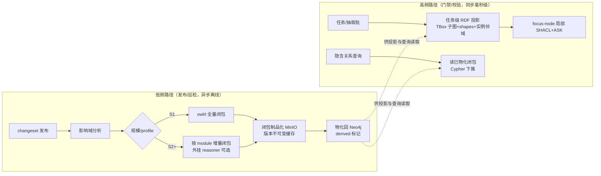

# 重型本体优化设计（heavyweight ontology scaling）

> 状态：v0.1 | 日期：2026-09-26 | 上游依据：[本体核心设计](./本体核心设计.md)、[05-语义层设计](../architecture/05-语义层设计.md)、[研究整理/03 §2.3](../研究整理/03-知识库与本体核心.md)、[研究整理/07 §6](../研究整理/07-Harness-Agent解剖与本体骨架.md)、[评审记录](../architecture/评审-2026-09-26-多专家研讨与行业痛点批判.md)（rdflib/owlrl 性能批判）
>
> 本文回答一个问题：**当本体走向重型（高风险强推理场景、三元组规模增长）时，平台的推理/校验/查询如何不被拖死**。它是本体核心设计 §5（推理引擎）的规模化补充，冲突时以本体核心设计为准。

---

## 1. 问题定义：重型本体的四类成本与三个规模档

重型本体是建模三步法的第三档（高风险强推理场景，研究整理 03 §2.1）。它的工程代价集中在四类操作：

| 成本类 | 操作 | 触发频率 | 已知风险（评审证据） |
| ---- | ---- | ---- | ---- |
| **C1 一致性检验 / 分类推理** | OWL 推理机对 TBox 求闭包、检测矛盾 | 发布时 + 巡检 | rdflib+owlrl 在 10 万三元组级 OWL 2 RL 闭包可能**分钟级且内存膨胀**（语义网共识仅原型可用）；SLA 已标待 PoC① 冻结 |
| **C2 隐含关系推导物化** | 前向链推导三元组并物化回 Neo4j | 发布时 / 变更时 | 物化全量重算 = 每次发布 O(全图)；REMOVE 三元组引发级联失效，朴素做法只能全量重建 |
| **C3 SHACL 约束校验** | ABox 实例过 shapes（门禁语义） | **高频**（抽取流水线每批、agent 每步后验） | pySHACL 对全 data graph 校验，1 万三元组 P99 ≤ 100ms 的 SLA 未实测；实例量增长后线性变慢 |
| **C4 语义查询 / 判据求值** | SPARQL ASK / CONSTRUCT（门禁、隐含关系查询） | **高频**（每步门禁） | Neo4j 无 SPARQL（非推理机，锚点 §3.2）；无载体则门禁无法毫秒级求值 |

规模三档（与锚点 PoC① 基准规模一致）：

| 档 | TBox+ABox 三元组 | 典型场景 | 策略基调 |
| ---- | ---- | ---- | ---- |
| **S1** | < 1 万 | 起步 / 种子本体（电力 wedge 20~50 类） | 单机 rdflib 全套 |
| **S2** | 1 万 ~ 50 万 | 单行业生产 | profile 分级 + 增量推理 + 投影求值 + 外挂 reasoner |
| **S3** | > 50 万 | 多行业合并 / 企业级 | 模块化强制 + 闭包制品化 + 专用推理集群评估 |

## 2. 优化总原则（四条防线，全篇纲领）

1. **能不推理就不推理**：推理分级是宪法（锚点 §6.4）——C1/C2 是低频发布期成本，**绝不允许出现在请求路径**；高频路径（C3/C4）只做局部校验与已物化闭包查询；任务级先做推理分级预判（07 §6.2-1），确定性任务走规则执行器零推理。
2. **要推理就增量推理**：一切重算以 **changeset 影响域**为边界（本体核心 §6.2 影响分析已给出受影响类清单），增量算法见 §4.2。
3. **推理结果物化复用**：published 版本不可变 ⇒ 其推理闭包可**制品化缓存**（同版本永不重算），查询永远读物化结果不做在线推理。
4. **查询求值走投影不走全图**：门禁/判据在**任务级 RDF 投影**（会话内 rdflib 图）上求值，规模 = 任务邻域（百~千级三元组），与全库规模解耦（吸收研究整理 07 §6.2-3 机制，作为 C4 的正解）。

## 3. 本体工程层优化（源头减量：让本体本身便宜）

### 3.1 OWL 2 Profile 分级（建模期声明，lint 强制）

本体创建时必须声明 `profile ∈ {el, rl, dl}`（`ontologies` 表增列，DDL 待回填 database/01），对应 OWL 2 三个可判定子语言，推理复杂度天差地别：

| Profile | 复杂度 | 允许的公理模式 | 推理引擎路由 | 适用 |
| ---- | ---- | ---- | ---- | ---- |
| **EL** | 多项式 | 概念包含、存在量词、基本role | ELK 类（EL 算法）或 owlrl 兼容子集 | 大规模类层级（行业术语本体） |
| **RL** | 多项式（Datalog） | 属性链、值域/定义域、类合取 | rdflib + owlrl | 规则型业务本体（平台默认） |
| **DL** | NEXPTIME 级 | 否定、任意嵌套、nominals | **仅外挂**（Jena Fuseki / GraphDB），本地引擎直接拒绝 | 高风险强推理（金融合规等） |

**lint 强制**（tbox/lint 增规则）：公理模式与声明的 profile 不匹配即报错——DL 公理出现在 rl 本体里在编辑期就被拦截，而不是发布推理时爆炸。

### 3.2 公理成本分级（高成本模式黑名单）

lint 对以下高成本模式默认拒绝，changeset 显式声明 `heavy_axiom=true` 并过评审（enterprise 档双签）才放行：

| 级别 | 模式 | 成本原因 |
| ---- | ---- | ---- |
| 红 | 任意嵌套匿名类（anonymous class nesting > 2 层）；全属性上的否定（negation over universal）；无界属性链循环（cyclic property chains）；大 nominals 枚举（>100 个体） | 闭包规模不可控 / 死循环风险 |
| 黄 | 多重相交/并类的深组合（>5）；disjoint 覆盖大子树；对称+传递复合 | 闭包膨胀 O(depth×breadth) |
| 绿 | 其余常规公理 | — |

配套**结构预算告警**：`subClassOf` 层深 > 12 或宽度 > 500、单类约束公理数 > 50 → lint 警告（闭包规模经验上随深度乘性增长）。

### 3.3 模块化本体（S2+ 强制）

- 按领域拆 `module`（如电力本体 = 设备 / 拓扑 / 工单 / 停电分析 四 module），module 间只经 **imports 边**显式依赖（国标第 9 章扩展原则的工程化）；
- **一致性检验局部化**：单 module 变更只做「本 module + 直接 imports 的边界闭包」检验，全量一致性降为每周巡检 + 发布时强制（每日全量巡检在 S2+ 成本不可接受）；
- 增量物化以 module 为单位并行（§4.2）；
- module 边界即**推理隔离边界**：跨 module 的隐含关系必须显式建模为桥接公理，禁止隐式穿透（否则局部性失效）。

## 4. 推理执行层优化（C1/C2）

### 4.1 推理时机三级（禁止查询期全图推理）

| 时机 | 内容 | 同步性 | 允许的引擎 |
| ---- | ---- | ---- | ---- |
| **发布时** | 全量一致性 + 分类推理 + 闭包物化 | 异步离线任务（队列隔离，不占请求路径）；发布状态机：`in_review → published` 前置 `gate_report`，闭包物化可后置但**物化完成前检索标记 degraded** | 按 profile 路由（§3.1） |
| **变更时** | changeset 影响域内增量闭包重算（§4.2） | 异步，随发布流水线 | 同上 |
| **查询时** | **只读已物化闭包 + 投影上局部推导**；禁止在线全图推理（路由器硬规则，违反即 CI 契约测试失败） | 同步 | Cypher 下推 / rdflib 投影局部 |

### 4.2 增量物化算法（要点）

- **ADD 传播**：changeset diff 的 ADD 三元组 → 计算受影响谓词/类的**前向链激活集**（由 RL 规则依赖图预计算，发布时随闭包一起制品化）→ 仅在激活集内推导新增，合并入闭包；
- **REMOVE 处理**：删除三元组引发推导失效，不做全量重算——物化三元组带**支撑集（support / justification）指针**，REMOVE 时按支撑集做删除传播（delete propagation）；支撑集损坏或环形时回退到「受影响 module 全量重算」（低频、可接受）；
- **版本不可变缓存**：published 版本的闭包作为制品存 MinIO（`ontologies/{tenant}/{id}/closures/{version}.ttl`，随 `ontology_versions.checksum` 校验）；同版本任何组件（巡检/投影/物化刷新）**直接读缓存，永不重算**；回滚 = 指回旧版本缓存（回滚零推理成本——这使「回滚=发布旧版本」的聚合裁决真正廉价）；
- **资源治理**：推理任务进 `kb:queue` 同款队列（租户并发配额独立），单任务内存预算 + module 逐批；超时降级语义沿用本体核心 §5（TIMEOUT → 建议外挂引擎）。

### 4.3 引擎路由扩展（挂接 05 篇路由器）

在 05 篇路由表第 3 行（OWL 推理）下细化：

| 条件 | 引擎 | 说明 |
| ---- | ---- | ---- |
| profile=el（任意规模） | EL 算法实现（ELK 式）起步可由 owlrl 兼容子集顶替 | 多项式，S3 也可本地 |
| profile=rl 且 S1 | rdflib + owlrl 本地 | 现行默认 |
| profile=rl 且 S2+ / 任何 dl | **外挂 Jena Fuseki**（`ExternalReasonerAdapter`，按 module 并行提交） | 配置开关已设计（本体核心 §5.1）；S3 评估 GraphDB 集群 |
| 任一条件下 | LLM 不参与 C1/C2 | 推理分级宪法：LLM 只进低频语义判断且输出回灌校验 |

## 5. 查询与校验执行层优化（C3/C4 高频路径）

### 5.1 任务级 RDF 投影（C4 正解，吸收研究整理 07 §6.2-3）

- **构建**：任务装载（Grounding）时，按任务涉及的类/实例，从**已物化闭包 + TBox 制品**抽取子图：相关 owl:Class 层级 + 关联 shapes + R3 规则模板 + 涉及 ABox 实体的 k 跳邻域（默认 k=2），构建**会话内 rdflib 投影图**（内存态，任务结束释放）；
- **求值**：所有门禁/判据（前置 precondition 的 SPARQL ASK、后验 SHACL）在投影上以 **focus-node 局部求值**——只校验焦点节点的 shape 闭包，不对全 data graph 跑 pySHACL；
- **预算目标**：投影构建 ≤ 50ms（S2，命中投影缓存则 <5ms）、focus-node 求值 < 10ms（**待 PoC⑥ 冻结**，07 篇原目标）；
- **缓存**：投影按 (task 模式, 涉及类集) 缓存复用；任务内增量维护（写回的新实例追加进投影）；
- **信任级联动**（07 §5.2）：投影内 ABox 事实带 `externally_verified / agent_attested` 标记，外部回执未到的事实不参与判据求值——防止「判据自证」。

### 5.2 SHACL 增量校验（C3）

- **focus-node 闭包裁剪**：校验前从 shapes 图推导该 focus-node 的 targetClass 继承链上**实际命中的 shapes 子集**（多数实例只命中全量 shapes 的 5~10%），只编译执行该子集；
- **热点下沉**：高频 R2 规则（状态枚举、格式、区间）在发布时**编译为 Neo4j 属性约束/索引或 Cypher 断言**（`constraints` 编译器，reasoning 包新增），实例写入时数据库层直接拦截——毫秒级零引擎开销；SHACL 引擎只兜底复杂形状；
- **批量校验分片**：抽取流水线的实例批按 focus-node 哈希分片并行，单批超时（默认 30s）标 failed 不阻塞整批（kb_pipeline 断点续跑已支持）。

### 5.3 隐含关系查询下推

- 已物化闭包直接以 Cypher 查询 Neo4j（`derived=true` 标记的物化边）；R3 规则模板在发布时生成 **SPARQL CONSTRUCT + 等价 Cypher 双形态**（投影上用 SPARQL、库上用 Cypher，同一规则单一来源生成，防双源）；
- lite 档（锚点 §3.2）：图遍历由 PG 递归 CTE 承接，闭包仍制品化缓存于 MinIO。

## 6. 存储层配套

| 项 | 设计 |
| ---- | ---- |
| 闭包制品 | MinIO `ontologies/{tenant}/{id}/closures/{version}.ttl`，checksum 入 `ontology_versions`（增列 `closure_uri/closure_checksum`，DDL 待回填） |
| Neo4j 物化分层 | TBox 闭包物化（只读）与 ABox 派生边（`derived=true` + `support_ref`）分开标记；派生边可整体重算而原始边不受影响 |
| 巡检降频 | 每日增量巡检（当日变更影响域）+ 每周全量（S1）/发布时强制全量（S2+）；巡检读闭包缓存不重算 |
| 派生指标 | 闭包规模、物化耗时、投影命中率、focus-node P99 进 07 篇 §6 指标清单（可观测） |

## 7. 规模分档策略矩阵（总表；SLA 数字均为目标，待 PoC①⑥ 冻结）

| 成本×规模 | S1（<1万） | S2（1~50万） | S3（>50万） |
| ---- | ---- | ---- | ---- |
| C1 一致性/分类 | owlrl 本地，发布时全量（P95 ≤ 5s 目标） | profile 路由：EL 本地 / RL·DL 外挂 Fuseki 按 module 并行 | 外挂集群评估（GraphDB）；模块化强制 |
| C2 物化 | 发布全量物化 | 增量物化（激活集 + 支撑集删除传播）+ 闭包制品化 | 同 S2 + module 级并行度提升 |
| C3 SHACL | pySHACL 全量可接受（P99 ≤ 100ms 目标） | focus-node 闭包裁剪 + 热点下沉 Neo4j + 分片并行 | 下沉为主，SHACL 引擎只兜底 |
| C4 查询/判据 | 直接 Neo4j Cypher | 任务级 RDF 投影 + focus-node <10ms 目标（PoC⑥） | 投影 + 闭包缓存命中率为核心指标（目标 ≥ 90%） |

## 8. 与 PoC / 里程碑对接

- **PoC① 扩维**（M2 出口，锚点 §7 已登记）：基准矩阵扩为「引擎（owlrl / ELK 式 / 外挂 Fuseki）× 规模（1万/10万/100万）× 四类成本（C1~C4 采样）」，产出：profile 路由阈值表冻结 + §7 矩阵 SLA 冻结 + 外挂引入时点裁决；
- **新增 PoC⑥**（M3 出口）：投影构建耗时 / focus-node 求值 P99 / 投影缓存命中率 / 支撑集删除传播正确性（增量物化与全量重算结果等价性金标集）——锚点 PoC 表增补第 ⑥ 项；
- 里程碑挂载：profile 声明与 lint 黑名单 = M2（随本体 CRUD）；投影与 focus-node = M3（随 agent loop）；增量物化与闭包制品化 = M4（随发布流水线成熟）；外挂引擎 = PoC① 裁决后按需。

## 9. 验收标准

- [ ] lint 拦截测试：DL 公理入 rl 本体、红级黑名单公理、>2 层匿名嵌套均被编辑期拒绝（单测）；
- [ ] 增量物化等价性：预置 20 组 changeset，增量闭包与全量重算结果图同构（isomorphic）100% 一致（含 REMOVE 级联场景）；
- [ ] 闭包缓存：同版本第二次任何推理/巡检/投影构建零推理耗时（缓存命中断言）；
- [ ] focus-node 增量校验：命中 shapes 子集结果与全量校验一致（金标 500 实例）；热点下沉规则在写入路径被数据库层拦截（注入测试）；
- [ ] 请求路径纯净性：CI 契约测试断言 C1/C2 引擎调用不出现在同步请求代码路径（import/调用图静态检查）；
- [ ] 投影求值：PoC⑥ 基准报告落档，SLA 冻结。

## 10. 待办与开放问题

- [ ] `ontologies.profile`、`ontology_versions.closure_uri/closure_checksum` 列回填 database/01 与 06 篇；
- [ ] RL 规则依赖图与激活集预计算的算法规格（随 M4 增量物化实现细化）；
- [ ] ELK 式 EL 推理器选型（Python 生态薄，评估 owlrl 兼容子集 vs 经 Fuseki 统一）；
- [ ] 支撑集（justification）在 owlrl 推导中的提取可行性——不可行则 S2 退化为「module 级全量重算」并登记风险；
- [ ] 模块化本体的 imports 边界语义细则（对齐国标第 9 章扩展原则）；
- [ ] 投影内存预算与任务邻域 k 值自适应（大邻域任务的投影裁剪策略）。
