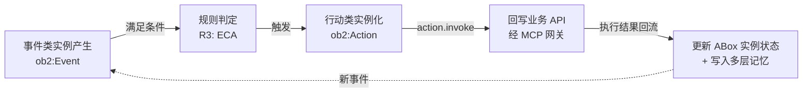
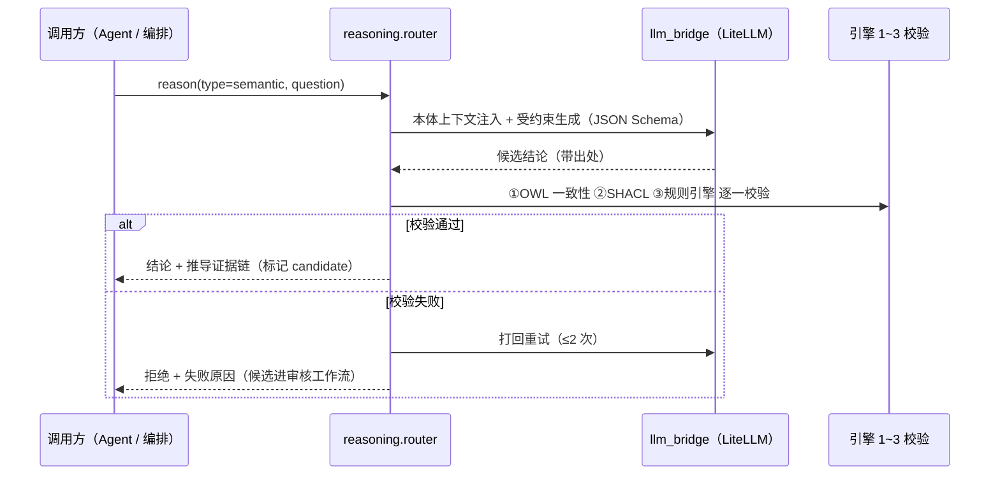
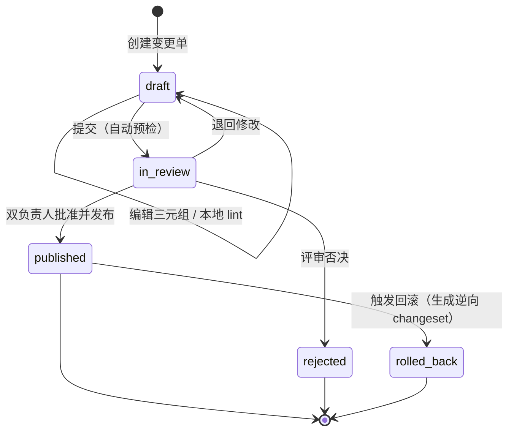

# 本体核心（ontology_core）- 设计

> 状态：v0.1 | 日期：2026-09-26 | 上游依据：[架构锚点：01-总体架构与分层](../architecture/01-总体架构与分层.md)、[研究整理/00-平台总体架构](../研究整理/00-平台总体架构.md)、[研究整理/03-知识库与本体核心](../研究整理/03-知识库与本体核心.md)、[研究资料/本地建模](../研究资料/本地建模.md)

---

## 1. 定位与边界

本体核心是平台语义基座的 **TBox（术语层/模式层）权威管理者**：负责类（对象/行动/事件）、属性、公理、规则的定义、存储、推理与版本治理，对外提供校验（validate）、推理（reason）、查询（query）与语义检索（search）能力。代码落点为架构锚点 §4 的 `services/semantic/ontology_core/`（分包：tbox / reasoning / shacl / versioning / align）。

### 1.1 与知识库服务（ABox）的分工

依据研究整理 03 §1 的服务边界：

| 维度 | 本体核心（本模块） | 知识库服务 graphrag-ontology |
| ---- | ---- | ---- |
| 管辖层 | **TBox**：类、属性、公理、规则 | **ABox**：从文档/数据抽取的实体/关系实例 |
| 权威数据 | 本体制品（Turtle/JSON-LD）+ PG 版本/变更表 | Neo4j 知识图谱 + Milvus 向量 |
| 对 Agent 的输出 | 约束与推导（validate / reason / query） | 上下文（GraphRAG 检索） |
| 一句话 | 知识"长什么样、怎么推理" | 知识"从哪来、怎么检索" |

边界纪律（依据架构锚点 §2/§3.2）：

- 实例数据（Individual）不入本模块权威制品；本模块只持有"实例必须满足的形状"（SHACL shapes），并对知识库实例执行校验；
- 权威 TBox 不放 Neo4j——Neo4j 里的 TBox 属性图是**只读物化视图**；
- 会话、权限等非语义事务不属于本模块（L5 层职责禁令）；
- **ABox 事实信任级（2026-09-26 07合入）**：影响完成判据的 ABox 事实分两级——`externally_verified`（业务系统回执/回调/双向核对写入，写入主体非 agent 循环）与 `agent_attested`（agent 从工具结果转写的中间状态）；**外部回执先于判据求值写入**——防判据自证（agent 写"合法"状态骗过判据），SuccessCriterion 只认 externally_verified 事实（SHACL 强制）。判据/门禁的**求值载体 = 任务级 RDF 投影**（会话内 rdflib 内存图，focus-node 局部求值）——投影构建、预算目标与信任级联动设计见 [02-重型本体优化设计](./02-重型本体优化设计.md) §5.1，此处不重复。

## 2. OB2 建模法落库

OB2 是平台宪法级建模方法（研究整理 00 §1.2，源自《本地建模》笔记）：**对象（第一性）— 行为（改变对象状态）— 规则（不变式、独立定义）**，经**事件**串联成逆向闭环 `事件 → 规则 → 行为 → 回写API → 更新数据`。

| OB2 要素 | RDF/OWL 落库形态 | 平台扩展 |
| ---- | ---- | ---- |
| 对象 Object | `owl:Class`（`rdfs:subClassOf` 层级） | 必填国标 8 项元数据（§3.2） |
| 行为 Behavior | 行动类：`ob2:Action` 的子类 + 前置条件属性 + 效果属性 + **状态流转属性**（受控词表，SHACL 枚举约束） | 行动类是 MCP `action.invoke` 的注册来源（docs/MCP §2） |
| 规则 Rule | 三路由：OWL 公理 / SHACL 约束 / 规则引擎（§2.3） | `rules.route` 标注路由，双源禁止 |
| 事件 Event | 事件类：`ob2:Event` 子类，触发条件即守卫规则的条件部分 | 行动类反向引用 `triggeredByEvent` / `guardedByRule` |

### 平台标准本体模块：任务本体九类（2026-09-26 07合入）

业务本体回答"**业务世界**"长什么样（对象/行为/规则，研究整理 03）；harness 运行时还需要"**任务世界**"的形式化——任务本体（Task Ontology）以下列九类定义，作为**平台标准本体模块随语义层交付（M2 出口）**，不随行业变（研究整理 07 §5.2~5.3）：

| 类 | 关键属性/关系（要点） | 对应 harness 机制 |
| ---- | ---- | ---- |
| `task:Task` | 目标（CQ 形式）、输入、状态、预算（max_steps / max_tokens / deadline——判据含 SLA 就必须有期限属性）、所属会话 | 任务状态机、漂移检测的锚点 |
| `task:Plan` | 版本、状态（active / superseded）、失效语义、模板来源（沿用/组合/自由生成） | 计划可版本化、可整体校验、重规划后旧计划归属明确 |
| `task:Step` | **dependsOn**（对象属性，构成 DAG 而非线性序）、绑定行动类、输入/输出产物、状态、序 | 规划单元；并行派发依据；subagent 派发单元 |
| `task:Precondition` / `task:Postcondition` | SPARQL ASK（打在会话投影上）/ SHACL shape 引用（**带版本号**，本体升级可迁移） | 事前门禁 / 事后校验 |
| `task:SuccessCriterion` | 终止谓词；**只认外部回执**——schema 级强制：只能引用 externally_verified 事实（§1.1 信任级） | 终止判定由 harness 求值，不由模型宣称 |
| `task:Artifact` | 产物本体实例 + 出处指针（doc_id + chunk_id + span）+ 信任级 | 可追溯；对齐"候选非成品 + 出处指针"底线 |
| `task:FailureMode` | 失败类型、重试计数、**补偿行动类绑定**（重试超限后的回滚路径） | 失败降级；补偿闭环 |
| `task:StateChange` | 审计元类：主体类型（model / rule_engine / human）+ 主体 ID + 决策 ID + 能力包版本 + 时间——**每次 ABox 变更带归因** | 回放调试的元数据 |
| `task:Executor` | 执行者绑定：平台循环 / subagent / 规则执行器 / 审批人 / 能力包——**关联执行通道** | 并行派发与人工接管的执行语义 |

命名空间与治理：

- **独立命名空间 `https://ontology-agent.dev/ns/task#`（前缀 `task:`）**，与业务本体（`.../o/{tenant_id}/{ontology_slug}#`）分命名空间隔离、互不污染（对齐 §4.1 命名空间规范：与平台顶类 `ob2:` 同级的平台级命名空间，国标第 9 章扩展原则）；`task:` 命名空间对平台 MCP 出口只读，写路径仅任务循环写回（防旁路写，研究整理 07 §6.7-5）；
- **元数据表单沿用国标附录 A + 任务域自建 delta**：附录 A 八/十项是标准域表单模板（落点见 §3.2，项列表不在此重复）；查询文本、shape 版本引用、状态机公理等执行语义元数据国标无对应，任务域自建（表述依据研究整理 03 §2.2、07 §5.2——"沿用 + delta"，不是"同构"）；
- **租户不可删改、只能扩展**：作为平台标准本体模块的强约束版本；Turtle 底稿与 SHACL shapes 为 M2 交付物（登记于 §11 待办）。

### 2.1 对象 Object → owl:Class

按建模三步法（划边界 → 定档次 → 选工具，研究整理 03 §2.1）确认需要"重型本体"档次的领域才启用公理推理；类层级只关注**相对稳定的对象与关系**，不建易变流程。

### 2.2 行为 Behavior → 行动类 + 状态流转属性

- 行动类挂三组属性：前置条件（`hasPrecondition`，SPARQL ASK 表达式）、效果（`hasEffect`，状态断言）、状态流转属性（如 `Order.hasStatus`，值域为受控枚举，SHACL `sh:in` 约束）；
- 知识库"时序流程型"抽取产物（动作、前置条件、状态流转、互斥规则，研究整理 03 §3.1）分别落为：行动类定义、前置条件属性、状态流转属性、R3 规则；
- 高风险行动类必须绑定"约束逻辑"实体，供 MCP 网关二次确认策略使用（研究整理 05 §4）；
- **行动类安全与路由标注（2026-09-26 07合入）**：行动类必须带 **`executionMode ∈ {readOnly, stateful, externalWrite, code}`** 与 **`deterministic`** 标注——是**门禁强度**（readOnly 步零审批、externalWrite 步强制过审批路径）与**步级推理分级路由**的判定依据（误路由率纳入语义层巡检，标注质量进本体建模评审）；**工具 = 行动类的实现绑定**：先有行动类（业务语义：退款、冻结、派单），再绑定工具实现（业务 API / MCP tool）——工具下线换实现，行动类不变（研究整理 07 §5.1）。

### 2.3 规则 Rule → 三路由

规则是独立定义的不变式，不内嵌在类里；按可判定形态路由到三种引擎载体（对应研究整理 03 §2.2 国标第 8 章公理与规则）：

| 路由 | 适用规则形态（国标示例） | 载体 |
| ---- | ---- | ---- |
| R1 `owl_axiom` | 互斥类型、函数性、唯一值约束、层次约束、版本替代（废止必须指向替代标准） | OWL 2 DL 子集公理 |
| R2 `shacl` | 格式 / 枚举 / 区间 / 基数校验（如编号格式、实施日期 ≥ 发布日期、状态枚举） | SHACL `sh:NodeShape`（发布时从规则声明生成） |
| R3 `engine` | 跨对象业务规则、事件-条件-动作（ECA）："事件 E 且条件 C → 触发行动 A" | 规则引擎（SPARQL ASK 条件 + 行动类绑定） |

路由判据：能被 OWL 推理机消费的进 R1；仅数据形状校验的进 R2；需触发动作或跨图计算的进 R3。**同一规则只允许一个路由**，避免双源失配。

### 2.4 事件串联的模型表达（逆向闭环）



建模约束：每个行动类必须反向引用其触发事件与守卫规则，否则 lint 报错——保证"分析→执行"闭环在本体层面可追溯（研究整理 00 §2.2 核心闭环）。

## 3. 元模型设计

### 3.1 元模型类图

```mermaid
classDiagram
    class Ontology {
        +UUID id
        +str slug
        +IRI namespace_iri
        +str scheme_tier
    }
    class Class {
        +IRI iri
        +str label
        +str definition
        +bool is_behavior
    }
    class DatatypeProperty {
        +IRI iri
        +IRI domain
        +str range_xsd
    }
    class ObjectProperty {
        +IRI iri
        +IRI domain
        +IRI range
    }
    class Axiom {
        +str kind
        +str expression_owl2fs
    }
    class Rule {
        +str route
        +str condition
        +IRI action_ref
    }
    class Individual {
        +IRI iri
        +IRI rdf_type
    }
    class Changeset {
        +UUID id
        +str status
    }
    Ontology "1" --> "*" Class : 声明
    Ontology "1" --> "*" DatatypeProperty
    Ontology "1" --> "*" ObjectProperty
    Ontology "1" --> "*" Axiom
    Ontology "1" --> "*" Rule
    Ontology "1" --> "*" Changeset : 版本化单元
    Class --> Class : rdfs:subClassOf
    ObjectProperty --> Class : domain / range
    Rule --> Class : 约束对象类或行动类
    Class "1" --> "*" Individual : 实例化，ABox 归知识库
```

设计要点：Ontology 是聚合根；**任何 TBox 写操作必须发生在某个 Changeset 内**（§6）；Individual 进元模型仅作类型引用与校验目标，权威实例归知识库（§1.1）；Axiom 同时存 OWL 2 函数式语法字符串与结构化主体/客体 IRI，兼顾可读与可执行。

> **聚合形态裁决（2026-09-26 评审，与 [04 篇 §2](../architecture/04-领域层设计.md) 对齐）**：**聚合不持有 TBox 内容**——Class/Property/Axiom/Rule 的结构化索引（§9 的 PG 表）是**发布版本的读模型**，编辑期 rdflib 内存图是 L5 应用态；聚合状态收缩为 `head_version（OntologyVersionRef 值对象：version / artifact_uri / checksum）+ active_changeset 状态`。发布动作 = 聚合方法 `publish(gate_report, approvals)`：在方法内断言「门禁通过（OntologyGate）+ 审批齐备（按治理档位，§6.3）」后推进 head_version，编排器不得代行裁决；发布后 IRI 不可变为聚合不变式。

### 3.2 GB/T 48000.3 附录 A 元数据映射

国标附录 A 规定实体类型 8 项、属性 10 项元数据（研究整理 03 §2.2）。建模工作台表单与 PG 字段逐项落地：

**实体类型 8 项**：

| # | 国标元数据项 | RDF 落点 | PG 字段（classes 表） |
| ---- | ---- | ---- | ---- |
| 1 | IRI | 类 IRI（§4.4 命名规范） | `iri` |
| 2 | Name | 本地标识符 | `name` |
| 3 | Label | `rdfs:label` | `label` |
| 4 | Definition | `skos:definition` | `definition` |
| 5 | 属性集 | 该类关联的属性集合 | `metadata->attribute_set`（派生自 properties.domain） |
| 6 | SubclassOf | `rdfs:subClassOf` | `subclass_of`（jsonb） |
| 7 | HasSubclass | SubclassOf 的逆关系 | 查询派生，不落库 |
| 8 | EquivalentClass | `owl:equivalentClass` | `equivalent_class`（jsonb） |

**属性 10 项**：

| # | 国标元数据项 | RDF 落点 | PG 字段（properties 表） |
| ---- | ---- | ---- | ---- |
| 1 | IRI | 属性 IRI | `iri` |
| 2 | Name | 本地标识符 | `name` |
| 3 | Label | `rdfs:label` | `label` |
| 4 | Definition | `skos:definition` | `definition` |
| 5 | Domain（定义域） | `rdfs:domain` | `domain_iri` |
| 6 | Range（值域） | `rdfs:range`（XSD 类型或类 IRI） | `range_iri` |
| 7 | TypeOfTerms（术语类型） | 平台注解 `ob2:termType` | `type_of_terms` |
| 8~10 | 其余项 | 以国标附录 A 原文为准，逐项入 metadata | `metadata`（jsonb） |

> 注：研究整理 03 §2.2 明确列出属性 10 项中的 Domain / Range / TypeOfTerms；全量 10 项实现时以国标原文逐项铺开进表单与 `properties.metadata`，不臆造项名。

## 4. 存储设计

三种存储各司其职（架构锚点 §3.2 存储职责划分）：

| 存储 | 角色 | 内容 | 写入方 |
| ---- | ---- | ---- | ---- |
| MinIO | **权威制品库** | 已发布版本的 Turtle（默认）/ JSON-LD 制品：`ontologies/{tenant_id}/{ontology_id}/{version}.ttl` | 发布流程（§6.1） |
| PostgreSQL | **版本与元数据权威** | ontologies / ontology_versions / ontology_changesets / classes / properties / axioms / rules（§9） | changeset 发布时同事务 |
| rdflib（内存） | **会话级编辑图** | changeset 草稿期的 TBox 图：编辑 → lint → 提交 | tbox.graph |
| Neo4j | **只读物化视图** | TBox 属性图（经 n10s 导入），供 Agent / GraphRAG 图查询 | 发布后异步刷新，禁止业务回写 |

一致性不变式：`ontology_versions.checksum_sha256 == MinIO 制品哈希 == Neo4j 物化源版本标记`；每日巡检核对三方，不一致时告警并以 MinIO 制品为准重建 Neo4j 物化。

### 4.1 IRI 与命名空间规范

国标要求 `IRI = XML 命名空间 + 本地标识符`，扩展须用新命名空间且不修改核心定义（研究整理 03 §2.2，国标第 9 章）：

| 项 | 规范 |
| ---- | ---- |
| 本体默认命名空间 | `http://ontology-agent.local/o/{tenant_id}/{ontology_slug}#`（生产替换平台域名，如 `https://onto.example.cn/o/{tenant_id}/{slug}#`） |
| 平台顶类命名空间 | `https://ontology-agent.dev/ns/ob2#`（`ob2:Object` / `ob2:Action` / `ob2:Event` / `ob2:Rule`） |
| 行业扩展 | 独立命名空间 `.../ext/{industry}#`；禁止改写默认命名空间内已有定义 |
| 本地标识符 | 类 PascalCase（`Device`）；属性 camelCase（`hasStatus`）；实例 UPPER_SNAKE（`DEVICE_001`）；规则 `R` + 三位编号（`R007`） |
| 禁止 | IRI 含中文/空格；发布后修改已有 IRI（只能 deprecated + 新建） |

## 5. 推理引擎（推理分级落地）

推理分级是平台宪法（研究整理 00 §1.2）：**确定性强的高频逻辑走规则引擎/SHACL；低频复杂语义才走 LLM；LLM 输出必须过确定性校验**。本模块按四类推理路由到四个引擎：

| # | 推理类型 | 引擎 | 输入 | 输出 | SLA（起步规模） | 失败语义 |
| ---- | ---- | ---- | ---- | ---- | ---- | ---- |
| 1 | 一致性检验 / 分类推理（TBox） | rdflib + owlrl 起步；重场景外挂 Jena Fuseki / GraphDB | 当前版本图或 changeset 候选图 | `ConsistencyReport {consistent, contradictions[], elapsed_ms}` | 5k 三元组 P95 ≤ 3s；超时 10s | 超时返回 `TIMEOUT` 并建议外挂引擎；引擎异常降级为"仅 SHACL"并告警 |
| 2 | 约束验证（shapes） | pySHACL | 数据图 + shapes 图 | `ValidationReport {conforms, results[]}` | 1k 三元组 P95 ≤ 500ms | **门禁语义**：失败即拒绝入库（国标底线"实例合规性"） |
| 3 | 隐含关系推导 | 图遍历 + 规则引擎（传递/对称/逆属性、ECA） | 图 + 规则集 | 新增推导三元组（物化）+ 推导路径 | 10k 边 P95 ≤ 1s | 失败不物化；任务幂等可重试 |
| 4 | 语义判断 | LLM（LiteLLM，本体上下文注入 + 受约束生成） | 问题 + 相关类/属性/规则上下文 | 候选结论（JSON Schema 约束，带出处） | P95 ≤ 8s（依赖模型） | **输出必须过引擎 1~3 校验**；不过则重试 ≤2 次后拒绝，候选进审核工作流 |

### 5.1 OWL 推理

起步用 rdflib + owlrl（纯 Python，OWL 2 RL 子集）；需要重描述逻辑推理时外挂 Apache Jena Fuseki / GraphDB（架构锚点 §3.2、研究整理 03 §2.3/§3.3），经 `reasoning/owl_reasoner.py` 的 `ExternalReasonerAdapter` 接入，推理结果物化回 Neo4j。路由开关：配置项 `ontology.reasoning.external_engine_url` 存在即优先外挂，否则本地 owlrl。

> **规模化配套（2026-09-26 新增）**：重型本体（大三元组/强推理场景）的性能优化设计——OWL 2 profile 分级、公理成本黑名单、模块化、增量物化与闭包制品化、任务级 RDF 投影（focus-node 求值）——独立成篇：[02-重型本体优化设计](./02-重型本体优化设计.md)，其 §8 与 PoC① 扩维对接。

> **SLA 依据化裁决（2026-09-26 评审）**：§5 表中 SLA 数字为**设计目标而非承诺**——行业共识是 rdflib/owlrl 在 10 万三元组级做 OWL 2 RL 闭包可能达分钟级且内存膨胀。锚点 **PoC ①（M2 出口条件）**：以 1 万/10 万三元组基准实测 rdflib+owlrl vs Jena Fuseki 的耗时/内存，**实测后冻结 SLA 与外挂触发阈值**；冻结前 SLA 不写入 CI 门禁。

### 5.2 SHACL 约束验证

pySHACL；shapes 图由 R2 路由规则在发布时自动生成，随版本制品存档。校验是**门禁**而非提示：抽取流水线（docs/OntRAG）的"实例合规性"底线由本引擎承担。

### 5.3 图遍历 + 规则引擎

属性级蕴含（传递/对称/逆）用图遍历推导并物化；ECA 规则在 Redis 轻量任务队列上执行（架构锚点 §3.1），条件用 SPARQL ASK 求值，动作绑定行动类 → MCP `action.invoke`。

### 5.4 LLM 语义判断（受约束生成 + 确定性校验兜底）



红线：LLM 结论**永不直接成为权威数据**——通过引擎 1~3 校验后作为推导结果，否则作为候选进审核工作流（架构锚点 §6 横切约束 4/5）。

## 6. 版本与治理

### 6.1 Changeset 工作流

一切 TBox 写操作必须挂在 changeset 上，状态机如下：



| 状态 | 进入条件 | 允许操作 |
| ---- | ---- | ---- |
| draft | 创建变更单 | 编辑三元组、本地 lint |
| in_review | 提交（自动预检：lint + SHACL + 一致性全绿） | 审批 / 退回 / 否决 |
| published | 双负责人批准 | 只读；可触发回滚 |
| rejected / rolled_back | 否决 / 回滚完成 | 只读归档 |

**同本体并发 changeset：单活跃裁决（2026-09-26 痛点优化）**。两人同开 changeset、后发布者覆盖前者语义是本体编辑的企业通病（[台账](../architecture/11-链路排查与模块痛点台账.md)「本体×编辑」P1）。裁决：同一本体至多一个**活跃 changeset**（draft / in_review），由 PG 部分唯一索引强制（并发型不变式归存储，04 篇 §2.1）：

```sql
CREATE UNIQUE INDEX uk_changesets_one_active ON ontology_changesets (tenant_id, ontology_id) WHERE status IN ('draft','in_review');
```

（DDL 已补 [database/01 §3.4](../database/01-数据库详细设计.md)。）并发开启第二个 changeset 被索引直接拒绝，API 提示**「先发布或废弃当前变更单」**；**v1 不做 rebase**（最小够用：并发编辑排队走「先终态、后开新单」），基于新 head 重算 diff 的 rebase 机制登记 §11 待办。

### 6.2 三元组级 diff 算法要点

1. **规范化**：新旧版本图各做 RDF 规范化（RDFC-1.0，空白节点规范化；rdflib `to_canonical_graph` / pyld）；
2. **集合差**：以规范化三元组为粒度，`ADD = 新 − 旧`、`REMOVE = 旧 − 新`（哈希集合，O(n)）；
3. **语义分组**：diff 结果按 OB2 要素归类（类 / 属性 / 公理 / 规则 / 实例影响），供评审界面分块展示；
4. **影响分析**：被 REMOVE/修改的类在 Neo4j ABox 有实例 → 标记"影响实例 N 条"；破坏互斥/函数性公理 → 预检失败退回。

### 6.3 双负责人机制（按治理档位分级）

依据研究整理 03 §2.4：`ontologies.owner_business`（业务负责人）与 `owner_engineer`（知识工程师）**双批准**才能 `in_review → published`。删除类、修改 IRI、修改公理属"核心概念变动"，changeset 必须填写业务影响评估（`impact_assessment`），否则提交被拒。

> **治理档位钩子（2026-09-26 评审增补；档位权威定义见 [08 篇](../architecture/08-横切关注点与工程规范.md)）**：`enterprise` 档执行完整双负责人 + 四眼原则；`team` 档单审批人（负责人之一）；`solo` 档提交人即审批人（全程审计留痕，发布可回滚）。三档共同底线：`publish()` 的门禁断言（OntologyGate）**任何档位不可跳过**；solo 档影响评估可留空，但审计必须保留完整 diff。

### 6.4 周期巡检

| 巡检任务 | 频率 | 内容 | 依据 |
| ---- | ---- | ---- | ---- |
| consistency_check | 每日 | 全量 TBox 一致性（引擎 1） | 研究整理 03 §2.4 |
| instance_conflict | 每日 | ABox 实例与当前 TBox 的 SHACL 抽检 | 国标底线·实例合规性 |
| term_uniqueness | 每周 | 同概念近义名检测（术语唯一性） | 国标底线·术语唯一性 |
| usage_stats | 每月 | 调用频次与决策支撑效果 → 反哺迭代 | 研究整理 03 §2.4 |

## 7. API 契约

### 7.1 REST 端点（L2 网关 `routers/ontology.py`）

| 方法 | 路径 | 用途 |
| ---- | ---- | ---- |
| POST | `/api/v1/ontologies` | 创建本体（命名空间、档次、双负责人） |
| GET | `/api/v1/ontologies` | 租户内分页列表 |
| GET / PUT / DELETE | `/api/v1/ontologies/{id}` | 详情 / 元信息更新 / 弃用（软删） |
| POST/GET/PUT/DELETE | `/api/v1/ontologies/{id}/classes|properties|axioms|rules` | 元素 CRUD（写入必须携带 `changeset_id`） |
| POST | `/api/v1/ontologies/{id}/changesets` | 创建变更单 |
| POST | `/api/v1/ontologies/{id}/changesets/{cid}/submit|approve|reject|publish|rollback` | 状态迁移 |
| GET | `/api/v1/ontologies/{id}/diff?base=&target=` | 版本 / 变更单 diff |

### 7.2 语义能力端点

| 方法 | 路径 | 用途 | 请求体要点 |
| ---- | ---- | ---- | ---- |
| POST | `/api/v1/ontology/validate` | SHACL 校验 | `{ontology_id?, graph?, data_graph_uri?, shape_version?}` |
| POST | `/api/v1/ontology/reason` | 推理 | `{ontology_id, type: consistency|classification|entailment|semantic, input?}` |
| POST | `/api/v1/ontology/query` | SPARQL 查询（TBox，可联 ABox 物化） | `{ontology_id, sparql, timeout_ms}` |
| POST | `/api/v1/ontology/search` | 语义检索类/属性/规则（Milvus 向量） | `{query, top_k, kind?}` |

JSON 示例（validate）：

```json
POST /api/v1/ontology/validate
{ "ontology_id": "0f2c...", "data_graph_uri": "neo4j://kb/orders-2026-09", "shape_version": "current" }

200 OK
{ "conforms": false, "stats": { "triples": 48210, "elapsed_ms": 387 },
  "results": [{ "focus": "http://ontology-agent.local/o/t1/orders#DEVICE_001",
    "path": "...#hasStatus", "value": "flying", "constraint": "sh:in", "severity": "Violation",
    "message": "状态不在枚举 [created, paid, shipped, closed]", "source_shape": "...#R012-shape" }] }
```

JSON 示例（reason，语义判断被守卫规则拦截）：

```json
POST /api/v1/ontology/reason
{ "ontology_id": "0f2c...", "type": "semantic", "input": { "question": "订单 O-100 能否执行发货动作？" } }

202 Accepted
{ "verdict": "candidate", "answer": "不可发货：守卫规则 R007 不满足（支付状态未到 paid）",
  "evidence": ["...#R007", "...#hasStatus", "...#O-100"],
  "validation": { "owl": true, "shacl": true, "rules": false } }
```

### 7.3 与 MCP 暴露的映射

详见 [docs/MCP/MCP网关设计.md](../MCP/MCP网关设计.md) §2：

| 本模块 API | MCP 形态 | 说明 |
| ---- | ---- | ---- |
| `/api/v1/ontology/validate` | tool `ontology.validate` | 外部 Agent 校验候选实例/本体 |
| `/api/v1/ontology/reason` | tool `ontology.reason` | 一致性 / 推导 / 语义判断 |
| `/api/v1/ontology/query` | tool `ontology.query` | SPARQL 查询 |
| TBox 摘要 / 术语表 | resources `ontology://tbox/{id}`、`ontology://glossary/{id}` | 只读资源 |
| 领域任务模板 | prompts（基于本体的思维链） | 获取对象 → 提取数据 → 计算指标 |

## 8. GB/T 48000.3 合规清单

| 国标要求（章节） | 要求 | 本设计落点 |
| ---- | ---- | ---- |
| 第 5/6 章 形式化 | W3C 语言 RDF/RDFS/OWL；Turtle / JSON-LD 序列化 | §2、§4 |
| SHACL 约束验证 | 编号格式等格式校验 | §5.2 引擎 2 |
| 命名 | IRI = XML 命名空间 + 本地标识符 | §4.1 |
| 本体三要素 | 实体类型 + 属性（数据/对象）+ 公理 | §3 元模型 |
| 附录 A 元数据 | 实体类型 8 项、属性 10 项 | §3.2 映射表 + §9 字段 |
| 第 8 章 公理与规则 | 互斥、唯一值、日期有效性、枚举、函数性、版本替代、层次约束 | §2.3 三路由 |
| 第 9 章 扩展原则 | 新命名空间扩展、不矛盾、不改核心定义、模块化 | §4.1 + changeset lint 预检 |
| 附录 D 实例化 | Turtle 三元组实例化示例 | 抽取目标格式（docs/OntRAG 引用本模块 shapes） |

## 9. 数据模型（PostgreSQL）

ORM 位于 `services/data/orm/ontology.py`，Alembic 迁移位于 `services/data/migrations/`；全部表带 `tenant_id`（架构锚点 §6 横切约束 1）。

| 表 | 字段 |
| ---- | ---- |
| `ontologies` | id UUID PK、tenant_id、slug、name、description、namespace_iri、scheme_tier（glossary\|light_graph\|heavy）、status（active\|deprecated）、owner_business、owner_engineer、current_version_id FK、created_at、updated_at；UK(tenant_id, slug) |
| `ontology_versions` | id PK、ontology_id FK、version_no INT 递增、artifact_uri（MinIO）、format（turtle\|json_ld）、triple_count、checksum_sha256、changelog、published_by、published_at、is_current；UK(ontology_id, version_no) |
| `ontology_changesets` | id PK、ontology_id FK、base_version_id FK、title、description、impact_assessment、status（draft\|in_review\|published\|rejected\|rolled_back）、author_id、reviewer_business、reviewer_engineer、review_comment、diff_summary jsonb、created_at、submitted_at、published_at |
| `classes` | id PK、ontology_id FK、version_id FK、iri、name、label、definition、subclass_of jsonb、equivalent_class jsonb、is_behavior bool、state_attribute jsonb、metadata jsonb（附录 A 8 项）、changeset_id FK、created_at；UK(version_id, iri) |
| `properties` | id PK、ontology_id、version_id、iri、kind（datatype\|object）、name、label、definition、domain_iri、range_iri、type_of_terms、functional bool、constraints jsonb（min/max/in/pattern/cardinality）、metadata jsonb（附录 A 10 项）、changeset_id；UK(version_id, iri) |
| `axioms` | id PK、ontology_id、version_id、kind（subClassOf\|equivalentClass\|disjointWith\|functionalProperty\|cardinality\|domain\|range\|version_replacement 等）、subject_iri、object_iri、expression（OWL 2 函数式语法）、source（manual\|llm_candidate）、review_state、changeset_id |
| `rules` | id PK、ontology_id、version_id、route（owl_axiom\|shacl\|engine）、name、description、event_class_iri、condition（SPARQL ASK / shape 引用）、action_ref（行动类 IRI 或 axiom/shape 引用）、severity（error\|warn）、enabled、source、review_state、changeset_id |

> 说明：`classes/properties/axioms/rules` 是**当前发布版本的结构化索引**（支撑工作台表单、diff 分组与向量化），编辑期权威在 changeset 的 rdflib 内存图；发布期在同一事务边界写入这四张表 + 版本表 + MinIO 制品（对象存储写成功后提交 PG，失败则整体回滚并清理孤儿对象）。

## 10. 验收标准

功能：

- [ ] 创建本体 → 建模（类/属性/公理/规则）→ changeset 评审 → 发布全流程走通，MinIO / PG / Neo4j 三方一致；
- [ ] 国标附录 A 表单字段齐全（实体类型 8 项、属性 10 项）；
- [ ] IRI 校验生效：非法 IRI、发布后修改 IRI 被拒；
- [ ] 行动类缺少 `triggeredByEvent` / `guardedByRule` 时 lint 报错。

推理正确性基准（golden test 集，CI 常驻）：

- [ ] 基准集 ≥ 30 例：TBox 一致性矛盾 10 例（检出率 100%）、SHACL 违规 10 例（检出 100%、误报 0）、隐含关系推导 10 例（与人工标注一致 ≥ 99%）；
- [ ] round-trip：Turtle → JSON-LD → Turtle 图同构（isomorphic）；
- [ ] diff 正确性：预置变更集的 ADD / REMOVE 与预期完全一致；
- [ ] LLM 语义判断：输出 100% 经过引擎 1~3 校验（代码审查无绕过路径）。

性能：

- [ ] §5 引擎表 SLA 达标（**以 PoC ① 实测冻结值为准**，冻结前按设计目标验证）；
- [ ] 发布后 Neo4j 物化刷新 P95 ≤ 5s（异步）。

## 11. 待办与开放问题

- [ ] 推理引擎 PoC = **锚点 PoC ①（M2 出口条件）**：rdflib + owlrl vs Jena Fuseki / GraphDB——1 万/10 万三元组基准，实测后冻结 SLA 与外挂阈值（上游待办：研究整理 03 §4）
- [ ] R3 规则表达式语言定稿（SPARQL ASK + SHACL-SPARQL 起步；是否需要 Drools 类重引擎再评估）
- [ ] n10s 物化映射细则（类 → 节点标签、对象属性 → 关系、数据属性 → 节点属性）
- [ ] `align` 术语对齐模块与知识库抽取流水线的接口细化（docs/OntRAG）
- [x] ~~首个行业本体试点领域选择~~（2026-09-26 锚点钦定：**电力配电网停电分析**，种子本体为 M2 出口条件）
- [ ] 概念漂移检测算法（使用数据 + 巡检结果的时间序列分析）
- [ ] 并发 changeset 的 rebase 机制（基于新 head 重算 diff；v1 以「单活跃 changeset + 先发布或废弃」简化替代——2026-09-26 痛点优化登记，见 §6.1）
- [ ] 任务本体九类 **Turtle 底稿与 SHACL shapes**（M2 交付物；九类清单、`task:` 命名空间与信任级 schema 强制见 §2「平台标准本体模块」小节——2026-09-26 07合入登记，上游待办：研究整理 07 §10）
