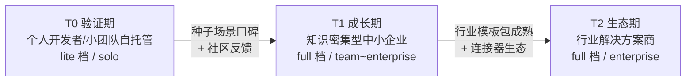

# 01 - BRD：商业需求文档（ontology-agent 平台）

> 状态：v0.1 | 日期：2026-09-26 | 上游依据：[研究整理/00-平台总体架构](../研究整理/00-平台总体架构.md)（三痛点/产业参照/核心闭环）、[架构锚点 01](../architecture/01-总体架构与分层.md)（里程碑/部署分档/治理档位）、[评审记录 2026-09-26](../architecture/评审-2026-09-26-多专家研讨与行业痛点批判.md) §4/§5（行业落地批判与裁决）

---

## 1. 项目背景与机会

### 1.1 AI Agent 平台的三个结构性痛点

来自行业共识（[研究整理/00 §1.1](../研究整理/00-平台总体架构.md)），是本平台立项的原始动机：

| 痛点 | 传统方案的表现 | 本平台方案 |
| ---- | ---- | ---- |
| 业务执行与数据分析割裂 | BI 只出结论，落不了地 | 本体行动层：事件驱动，回写业务 API |
| 业务规则「隐形化」 | 规则硬编码在代码里，改规则=改系统 | 规则成为本体一等公民（公理/约束逻辑） |
| 专家经验「游离化」 | 经验随人走，人离开即流失 | 经验沉淀为本体规则 + 多层记忆 |

在此之上叠加 LLM 固有的幻觉问题：通用 Agent 平台普遍缺一层「可信业务上下文 + 可校验逻辑约束」，导致回答无出处、动作无门禁、结果不回流。本体智能的产业定位正是**大模型与业务系统之间的语义中间层**（研究整理 00 §1）。

### 1.2 机会窗口

[研究整理/00 §4](../研究整理/00-平台总体架构.md) 归纳的产业趋势给出明确窗口：

1. **轻形式化的工程化路线是共识**——本体价值锚点从纯逻辑推理转向「Agent 的可信上下文供给」，不做重学术本体；
2. **本体从静态知识表示演进为可执行语义层**——规则与动作纳入本体（OB2 行为/规则）；
3. **MCP 正成为本体对外服务的事实互操作接口**——Palantir Ontology MCP、微软 Fabric IQ、Google 全线默认 MCP；
4. **人工建模与 AI 自动生成收敛于人机协同**——机器粗加工 + 人工终审。

**空白点**：本体路线被头部封闭产品占据（Palantir / Fabric IQ），开源侧无人做；而编排层（Dify/Coze）与检索层（RagFlow）已内卷成红海。「开源的语义层 + 行动闭环」是当前生态的空位（评审 §4 专家 D 判断：真差异只有本体语义层 + MCP 出口）。

### 1.3 产业验证：行业落地参照

本体 + Agent 的组合已有可引的产业先例（[研究整理/00 §4](../研究整理/00-平台总体架构.md)）：

| 案例 | 要点 |
| ---- | ---- |
| 电力配电网停电分析（本体思维链） | 本平台钦定的首个 wedge 场景（锚点 §7） |
| 电信宽带退单 | 准确率 65% → 90%+，语义约束直接换来业务指标 |
| 空客 A350 供应链（Palantir） | 本体语义层 + writeback 管道的规模化先例 |
| 银行反洗钱合规 | 强监管场景：治理与审计是第一需求 |

共性成功要素：**围绕具体业务痛点、本体建模紧密贴合行业、形成分析→执行闭环**——这三点分别对应本平台的 wedge 策略、种子本体、MCP 回写。

## 2. 产品愿景与定位

### 2.1 愿景

让知识密集型团队把专家经验建模为**可推理、可校验、可回写**的本体资产，使 Agent 的每个回答有证据、每个动作有门禁、每次执行回流业务系统——即平台的灵魂闭环：**知识感知 → 推理决策 → 执行反馈 → 知识更新**（研究整理 00 §2.2）。

### 2.2 一句话定位（elevator pitch）

> **ontology-agent 是开源的本体语义基座智能体平台：用本体给 Agent 可信的知识与规则，用 MCP 把决策执行回业务系统，用治理档位让一个人和一个企业都能用。**

### 2.3 对标格局

| 玩家 | 路线 | 格局判断（引[评审 §4](../architecture/评审-2026-09-26-多专家研讨与行业痛点批判.md)） | 与本平台关系 |
| ---- | ---- | ---- | ---- |
| Dify / Coze | 应用编排层 | 编排层内卷，生态位已被占死 | 不正面竞争：本平台不是编排器；可经 MCP/A2A 互通共存 |
| RagFlow 系 | RAG 检索 | 检索是被做烂的 commodity | 检索只做基线（LazyGraphRAG/向量+BM25），完整索引按试点 ROI 开关；差异化不押在检索 |
| Palantir Foundry / 微软 Fabric IQ | 本体语义层 | 路线被验证，但封闭昂贵，冷启动靠驻场专家团队 | 路线同向；本平台以开源 + 轻形式化 + 种子本体冷启动切其覆盖不到的市场 |
| **ontology-agent** | **开源本体语义层 + MCP 行动闭环** | 空位 | — |

### 2.4 定位边界（不做什么）

- 不做通用 workflow 编排器（不与 Dify/Coze 争夺陪跑模块，评审 §4 D-P1）；
- 不做模型训练/微调托管；
- 不做重学术本体推理（OWL 严格推理按需外挂，锚点 §3.2）；
- MVP 不做 SaaS 多租户运营（多租户横切设计保留，单租户验证）。

## 3. 目标市场与用户画像

### 3.1 三级市场阶梯

| 阶段 | 市场 | 形态 | 商业动作 | 对应部署/治理档 | 演进触发条件 |
| ---- | ---- | ---- | ---- | ---- |
| ---- | ---- | ---- | ---- | ---- | ---- |
| T0 验证期（当前） | 个人开发者 / 小团队自托管 | lite 档 compose 一键起（PG+pgvector+Redis+MinIO） | 开源免费，换取反馈与种子贡献者 | lite / solo | — |
| T1 成长期 | 知识密集型中小企业 | 自托管 full 档或轻托管 | 企业版订阅（enterprise 治理档、审计冷归档、回写连接器定制） | full / team~enterprise | 种子场景口碑 + 具名试点客户 |
| T2 生态期 | 行业解决方案商 | 行业模板包 + 连接器生态 | 模板包授权、联合交付分润 | full / enterprise | 第二个行业模板包完成 |

> 开发主体现实：个人开发者（liuyizai）主导、单人 + AI 协作开发（评审 §4 D-P0 对此有直接批判，MVP 策略即为其裁决结果——wedge 竖线）。

### 3.2 用户画像表

角色对齐 [frontend/02 §1.1](../frontend/02-信息架构与页面设计.md) 与 [08 篇 §2.2](../architecture/08-横切关注点与工程规范.md) 权威定义：

| 画像 | 对应角色 | 核心痛点 | 付费意愿 |
| ---- | ---- | ---- | ---- |
| 个人开发者 | super_admin/admin 一人全兼 | 现有平台无语义层，个人知识资产散落；重平台装不起 | v1 前为零（自用）；稳定后可付托管费 |
| 知识工程师 | ontologist | 建模工具链割碎、抽取质量不可控、版本治理缺失 | 企业版核心买单人 |
| 业务专家 | curator | 怕 AI 瞎写瞎做，要求可审、可控、可追责 | 决策者/否决者（治理档位是卖点） |
| 开发者 | member | Agent 接业务系统难，最后一公里没人管 | 使用者与布道者 |
| 行业解决方案商 | —（跨角色） | 每次交付重复造轮子，无资产沉淀 | 模板包授权/定制开发费 |

## 4. 商业目标与成功指标

### 4.1 北极星指标（建议）

**周活跃闭环任务数**：一周内完整跑通「知识感知 → 推理决策 → 执行反馈 → 知识更新」四段（[研究整理/00 §2.2](../研究整理/00-平台总体架构.md)）的任务数。

选择理由：

1. 同时约束知识质量（检索有证据）、推理纪律（决策过 SHACL/规则校验）、执行落地（MCP 回写成功）、知识更新（回流生效）——**无法靠刷对话量注水**；
2. 直接度量平台的差异化主张（闭环），编排/检索类竞品无法用同一口径比较；
3. 口径与 v0.5（M4 回写上线）起可测；此前用 leading 指标过渡（见 4.2）。

### 4.2 Leading 指标表

| 指标 | 定义 | 可测起点 | 对应里程碑 |
| ---- | ---- | ---- | ---- |
| lite 档一键部署成功率 | compose up 到平台可用 ≤ 30 分钟 | v0.1 | M0 |
| 终审吞吐 | 审核条数/人时（PoC ② 校准产出） | v0.3 | M2 |
| 种子场景评估通过率 | golden QA / 任务成功率基准 vs 基线（08 篇 §7.1） | v0.3 | M2 |
| 周活跃证据对话数 | 回答带 ≥1 条可溯源证据的对话数 | v0.4 | M3 |
| 回写成功率 / 对账差异数 | action.invoke 成功率、对账差异计数 | v0.5 | M4 |
| 周活跃闭环任务数（北极星） | 见 4.1 | v0.5 | M4 |

### 4.3 反指标（防止优化跑偏）

- 对话总量、token 消耗量不作为成功指标（可被滥用放大，且与差异化无关）；
- 不以「入库候选数」考核抽取（候选非成品，未经终审的候选无价值，锚点 §6.5）。

### 4.4 护栏指标（guardrail）

北极星改善不得以牺牲以下指标为代价：

| 护栏 | 阈值方向 | 依据 |
| ---- | ---- | ---- |
| 评估回归退化 | 主指标退化不超阻断阈值（建议 -2%，实测冻结） | 08 篇 §7.2 |
| 降级事件率 | 不随闭环任务数线性恶化 | 08 篇 §5 降级矩阵 |
| 单任务 token 成本 | 环比不显著上升（PoC ③ 标定基线后） | 锚点 PoC ③ |
| 终审积压 | 候选队列不随抽取量无限堆积 | PoC ② 吞吐模型 |

## 5. 竞争壁垒与差异化

| # | 壁垒 | 依据 |
| ---- | ---- | ---- |
| 1 | **本体语义层（非 commodity）**：TBox 版本治理 + SHACL 校验 + 推理分级，LLM 输出强制回灌校验 | 评审 §4 专家 D：方向对齐 Palantir/Fabric IQ 共识；检索是 commodity，语义层不是 |
| 2 | **writeback 回写契约**：幂等/对账/补偿的回写管道，升为一等模块（锚点 §5 模块 12） | Palantir 真护城河恰是 writeback 管道，企业集成占交付量 60%+（评审 D-P1） |
| 3 | **治理档位可伸缩**：solo/team/enterprise 一套平台覆盖个人到企业，门禁强度随组织伸缩 | 评审 §5.2 F2 裁决；竞品要么无门禁（轻量编排器）要么重到需要驻场（Palantir） |
| 4 | **候选非成品 + 全程可追溯**：知识带出处、动作带审计、变更带版本 | 平台设计宪法（AGENTS.md / 锚点 §6），合规友好 |

差异化必须传导为产品动作（否则只是口号）：

| 壁垒 | 对应产品动作 | 承载里程碑 |
| ---- | ---- | ---- |
| 本体语义层 | 种子本体 + 建模工作台 + SHACL 门禁 + 版本评审 | M2（PRD FR-ONTO-01~07） |
| 回写契约 | action.invoke + 回写契约/幂等/对账/补偿 + 首个垂直连接器 | M4（PRD FR-WB-01~07） |
| 治理档位 | 档位配置 + 三档审批链 + 自动通道（PoC ② 冻结后） | M2 solo 默认，M5 三档全开 |
| 可追溯 | 审计日志 + trace_id 全链路 + 证据引用卡片 | M1 起，M3 证据可见 |

## 6. 风险与应对

| 风险 | 依据 | 应对 |
| ---- | ---- | ---- |
| 冷启动：空工作台没人建本体，第一个租户无解 | 评审 D-P0；Palantir 靠驻场专家冷启动 | 种子本体（电力停电分析精简版 20~50 类）+ 样例数据集列为 M2 出口条件（锚点 §7），用户「改模板」而非从零建模 |
| 单人开发带宽被平台摊子拖垮 | 评审 D-P0（M0~M5 原是 20 人路标） | wedge 竖线裁决：单租户单场景打穿；80% 资源投 ontology_core/抽取流水线/MCP 回写（评审 D-P1）；插件市场/A2A/沙箱延后不砍 |
| 生态竞争：与 Dify/Coze 撞车的模块白烧带宽 | 评审 D-P1 | 不做编排器陪跑模块；插件需求用 MCP stdio/外部 Server 替代；外部 Agent 走 MCP/A2A 标准接入而非自研适配器 |
| 许可证：Neo4j 社区版（GPLv3）无多 database/RBAC，商用分发边界不明 | 评审 D-P2、锚点 §3.2 | 默认 lite 档（PG+pgvector）规避；商用前法务确认；出现多库隔离需求时评估企业版/NebulaGraph/TuGraph |
| 治理流程过重，小租户被压死或绕回 Excel | 评审 D-P1、§5.3 提醒 | 治理档位分级（08 篇 §2.4 权威定义）；solo 档高置信自动通过（留痕、可回滚，阈值待 PoC ② 冻结） |
| LLM/索引成本失控（GraphRAG 全家桶索引费远超查询费） | 评审 C-P0 | 默认 LazyGraphRAG/向量基线，完整索引按试点 ROI 开关（PoC ③ 标定）；预算管控与成本归因（08 篇 §6） |

## 7. 商业模式草案

**双轨制：开源核心 + 云托管/企业版**（对应部署分档 lite/full，锚点 §3.2）：

| 层 | 内容 | 收费 |
| ---- | ---- | ---- |
| 开源核心 | 七层平台全部核心能力（语义层/回写契约/治理三档/lite 档部署） | 免费（许可证待选型，见待办） |
| 云托管（T1 起） | 免运维托管实例，lite/full 双档 | 按实例订阅 |
| 企业版（T1~T2） | enterprise 治理档、审计冷归档 ≥3 年、回写连接器定制、SLA | 年度订阅 |
| 行业模板包（T2） | 种子本体 + 抽取策略 + 连接器 + 评估集四件套 | 按行业授权/联合交付分润 |

> 计费交付物候选：「带证据链的合规问答」作为首个可独立计费的独立交付物（[研究整理/07 §8](../研究整理/07-Harness-Agent解剖与本体骨架.md) 建议，属并行线增补、尚未落锚点，此处仅作草案登记）。

## 8. 待办与开放问题

- [ ] 开源许可证选型：核心开源的商业边界（含 GPLv3 传染面法务确认），与 T0 社区建设节奏对齐
- [ ] 北极星指标口径评审：任务边界、去重规则、跨租户聚合口径（云托管上线前冻结）
- [ ] T1 目标客户候选清单：知识密集型中小企业名单与触达路径
- [ ] 云托管成本模型：lite/full 档基础设施成本估算与定价敏感度
- [ ] 「带证据链的合规问答」计费交付物与锚点对齐（并行线 07 篇建议，采纳与否待裁决）
- [ ] 隐私与数据合规：自托管遥测（周活跃实例统计）的可选性与默认关闭策略
