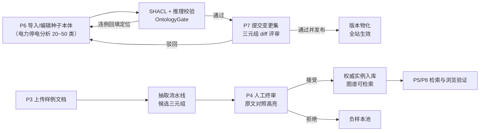
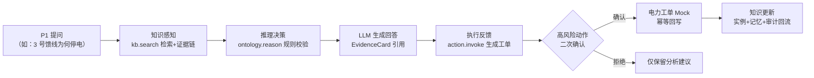
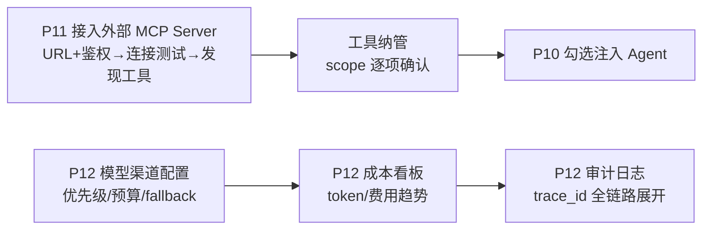

# 02 - PRD：产品需求文档（ontology-agent 平台 v1）

> 状态：v0.1 | 日期：2026-09-26 | 上游依据：[架构锚点 01](../architecture/01-总体架构与分层.md)（M0~M5 里程碑/PoC/部署分档）、[08-横切关注点与工程规范](../architecture/08-横切关注点与工程规范.md)（角色矩阵/治理档位/评估体系）、[frontend/02-信息架构与页面设计](../frontend/02-信息架构与页面设计.md)（P1~P12 页面/角色路由）、[研究整理/00-平台总体架构](../研究整理/00-平台总体架构.md)（核心闭环/设计宪法）

---

## 1. 产品概述与范围

### 1.1 产品是什么

ontology-agent 是以本体为语义基座的开源智能体平台：本体核心 + GraphRAG 知识库为 Agent 供给可信上下文与可校验规则，MCP 为能力出口打通业务闭环。产品灵魂是四段闭环：**知识感知 → 推理决策 → 执行反馈 → 知识更新**（研究整理 00 §2.2）。

### 1.2 v1 范围（= 锚点 M0~M5，发布为 v1.0）

| 阶段 | 里程碑 | 产品主题 |
| ---- | ---- | ---- |
| M0 骨架 | 目录 + compose lite 档一键起 | 装得起 |
| M1 网关+数据 | 鉴权/租户/审计 + PG 第一批表 | 站得住 |
| M2 语义层 wedge | 电力种子本体 + 建模/抽取/检索 | 有场景（wedge 打穿） |
| M3 Agent+记忆 | 对话编排 + L1/L2 记忆 | 能对话 |
| M4 MCP+回写 | MCP 出口 + 回写契约闭环 | 能行动 |
| M5 平台化 | 插件市场/A2A/治理三档/前端全量 | 成平台 |

### 1.3 非目标（v1 明确不做）

- 不做通用 workflow 编排器（定位见 [BRD §2.4](./01-BRD-商业需求文档.md)）；
- 不做模型训练/微调托管；
- 不做多租户 SaaS 运营（多租户横切设计保留，MVP 单租户验证，锚点 §7 wedge 裁决）；
- 不做重学术本体推理（OWL 严格推理按需外挂 Jena Fuseki/GraphDB，锚点 §3.2）；
- 插件市场/A2A/沙箱/审计冷归档延后到 M5，v1 内不做生态运营（评审 §6 P0 裁决）。

## 2. 用户角色与权限

### 2.1 角色定义（权威：[08 篇 §2.2](../architecture/08-横切关注点与工程规范.md)；路由对齐 [frontend/02 §1.1](../frontend/02-信息架构与页面设计.md)）

| 角色 | 中文别名 | 一句话职责 | 主要页面 |
| ---- | ---- | ---- | ---- |
| super_admin | 平台超级管理员 | 跨租户运维、全局模型网关 | P12 |
| admin | 租户管理员 | 用户/角色、模型渠道与成本、审计 | P11、P12 |
| ontologist | 知识工程师 | 本体建模、变更提交 | P6、P7 |
| curator | 业务专家 | 抽取终审、记忆升级审核、变更评审 | P4、P7、P9 |
| member | 开发者 | 对话、检索、图谱浏览、Agent 管理 | P1~P3、P5、P8、P10 |
| guest | 访客 | 仅公开入口只读 | — |

权限矩阵（R/C/U/D/A/P 六种动作 × 资源）以 08 篇 §2.2 为唯一权威，本 PRD 不重复定义；scope 模型 deny-by-default（08 篇 §2.3）。

### 2.2 治理档位（权威：[08 篇 §2.4](../architecture/08-横切关注点与工程规范.md)）

| 档位 | 审批链 | 高置信候选 | MVP 期状态 |
| ---- | ---- | ---- | ---- |
| solo | 提交人即审批人 | 自动通过（留痕、可回滚） | v0.3 起默认档；自动通道待 PoC ② 冻结前不开 |
| team | 单审批人 | 人工审批 | v1.0 全开 |
| enterprise | 双负责人 + 四眼原则 | 人工审批（抽样率按 PoC ②） | v1.0 全开（M5 出口条件） |

三档共同底线：自动通过留痕/可回滚/全程可追溯/OntologyGate 硬门禁不可跳过（08 篇 §2.4）。

## 3. 核心用户旅程

### 3.1 旅程一：知识工程师——建本体 → 抽取 → 终审 → 发布（对应治理流+知识流，frontend/02 §5.1/§5.2）

### 3.2 旅程二：业务用户——对话 → 证据 → 回写（锚点 §3.5 请求链路的产品视角）

### 3.3 旅程三：管理员——配 MCP / 看成本

### 3.4 旅程成功标志对照

| 旅程 | 主角（角色） | 成功标志 | 依赖的里程碑 |
| ---- | ---- | ---- | ---- |
| 建本体→抽取→终审→发布 | 知识工程师（ontologist）+ 业务专家（curator） | 一份文档进→候选实例→终审→图谱可检索，全程带出处 | M2 |
| 对话→证据→回写 | 业务用户（member） | 一次对话完成「感知→推理→执行→更新」闭环并留审计 | M3 + M4 |
| 配 MCP/看成本 | 管理员（admin） | 外部工具纳管可用；每笔 LLM/工具调用可归因到租户与 trace_id | M3 + M4 |

> 三条旅程即 [BRD §4.1](./01-BRD-商业需求文档.md) 北极星指标的可观测构成：旅程二完整发生一次 = 一个闭环任务。

## 4. 功能需求清单（FR）

### 4.0 优先级与追踪约定

- **P0** = wedge 竖线直接构成（M2~M4 出口条件），缺一不能演示闭环；
- **P1** = v1 必交付的平台底座与核心体验（M0/M1 前置件、M5 平台化主体）；
- **P2** = v1 内可裁剪/简化项（延后不砍）。

每条 FR 的「里程碑」以[锚点 §7](../architecture/01-总体架构与分层.md) 为权威，「页面」引用 [frontend/02](../frontend/02-信息架构与页面设计.md) 的 P1~P12 编号。

### 4.1 对话与任务（页面 P1/P2）

| 编号 | 需求 | 优先级 | 里程碑 | 页面 | 验收要点 |
| ---- | ---- | ---- | ---- | ---- | ---- |
| FR-CHAT-01 | SSE 流式对话：RUN/TEXT/TOOL 三族主干波事件消费与流式渲染、停止 | P0 | M3 | P1 | 首 token 流式呈现；停止即时生效；断线重连策略随网关待办冻结 |
| FR-CHAT-02 | 工具调用可视化：折叠时间线展示工具名/耗时/结果 | P0 | M3 | P1 | 与 TOOL 事件一一对应，可展开收起 |
| FR-CHAT-03 | 证据引用：EvidenceCard 展示来源文档/三元组/置信度，点击跳图谱 | P0 | M3 | P1 | 每条结论可溯源到分片与三元组（M3 出口「有引用」） |
| FR-CHAT-04 | 会话管理：列表/过滤/新建/删除 | P0 | M3 | P1 | 会话按租户隔离；删除留审计 |
| FR-CHAT-05 | 异步任务中心：抽取/导入/插件安装任务的状态/进度/时间线/失败日志 | P1 | M2 | P2 | 任务列表与事件时间线经 `GET /tasks`、`GET /tasks/{task_id}/events` 承载（api/01 §5.2，2026-09-26 评审修复F ★ 评审补录端点），SSE 实时推进；失败可查看日志 |
| FR-CHAT-06 | 对话↔图谱双向跳转：携带实体上下文预填新会话 | P1 | M5 | P1/P8 | 深链还原目标页过滤态 |

### 4.2 知识库（页面 P3/P4/P5）

| 编号 | 需求 | 优先级 | 里程碑 | 页面 | 验收要点 |
| ---- | ---- | ---- | ---- | ---- | ---- |
| FR-KB-01 | 文档上传与存储：Word/PDF/图片/表格入 MinIO，PG 存指针 | P0 | M2 | P3 | 大文本不进 PG（锚点 §3.2 存储纪律） |
| FR-KB-02 | 抽取流水线最小版：解析→切片→LLM 抽取→候选实例产出 | P0 | M2 | P3/P2 | 候选带来源分片与置信度；置信度校准经 PoC ② |
| FR-KB-03 | 分片预览：chunk 列表 + 原文/元数据对照 | P1 | M2 | P3 | 命中句可定位高亮 |
| FR-KB-04 | 候选实例人工终审：逐条/批量通过、编辑后接受、拒绝附原因 | P0 | M2 | P4 | 通过才入权威库；决策落审计（候选非成品门禁） |
| FR-KB-05 | 负样本回流：拒绝样本进负样本池反哺抽取评估 | P1 | M5 | P4 | 负样本可导出为评估集 |
| FR-KB-06 | 向量基线检索：默认 LazyGraphRAG/向量+BM25；完整 GraphRAG 索引按试点 ROI 开关 | P0 | M2 | P5 | 索引 token/时间成本经 PoC ③ 标定后定默认档 |
| FR-KB-07 | 检索三模式对比：local/global/drift | P1 | M2（local/global）、M3（drift） | P5 | local/global 随 M2 检索基线交付、drift 于 M3（2026-09-26 评审修复F：对齐锚点 M2 检索基线与 api/02 分波——RETRIEVAL_EVIDENCE 已入 M3 主干）；模式可切换；结果与证据链联动 |
| FR-KB-08 | 检索证据链可视化：结果与图谱子图 hover 联动 | P0 | M2 | P5 | 引用角标与图节点双向高亮 |
| FR-KB-09 | 文档生命周期管理：状态流转/删除/重新抽取 | P2 | M2 | P3 | 删除不可物理抹除审计线索 |

### 4.3 本体建模（页面 P6/P7/P8）

| 编号 | 需求 | 优先级 | 里程碑 | 页面 | 验收要点 |
| ---- | ---- | ---- | ---- | ---- | ---- |
| FR-ONTO-01 | 种子本体随平台交付：电力配电网停电分析精简版（20~50 类 OB2）+ 样例数据集 | P0 | M2 | P6 | 锚点 §7 钦定 M2 出口条件：开箱「改模板」而非从零建模 |
| FR-ONTO-02 | 可视化建模：类/属性/公理/规则四型资源画布编辑 | P0 | M2 | P6 | 拖拽建类、连线建关系、框选/缩放可用 |
| FR-ONTO-03 | 资源元数据表单：后端 JSON Schema 驱动，GB/T 48000.3 必填校验 | P0 | M2 | P6 | Schema 变更无需改前端代码 |
| FR-ONTO-04 | SHACL + 推理校验：违例回填并定位画布节点 | P0 | M2 | P6 | 校验是提交评审前置硬门禁（OntologyGate） |
| FR-ONTO-05 | 变更集草稿：changeset 增量保存与 diff 预览 | P0 | M2 | P6 | 草稿不污染已发布版本 |
| FR-ONTO-06 | 版本评审与发布：三元组级 diff、通过并发布/驳回、版本回滚 | P0 | M2 | P7 | 发布后 IRI 不可变；回滚二次确认+审计理由 |
| FR-ONTO-07 | 发布物化：TBox 经 n10s 物化 Neo4j，lite 档等效降级 | P0 | M2 | P7 | 发布后全站生效；lite 档功能验收标准不降 |
| FR-ONTO-08 | 图谱浏览器：实体搜索/邻域展开/路径查询 | P1 | M5 | P8 | 双击邻域展开；两实体路径查询可用 |
| FR-ONTO-09 | 术语对齐：跨本体/词汇表对齐建议 | P2 | M5+ | P6 | 对齐建议进审核队列，非直接生效 |

### 4.4 记忆（页面 P9）

| 编号 | 需求 | 优先级 | 里程碑 | 页面 | 验收要点 |
| ---- | ---- | ---- | ---- | ---- | ---- |
| FR-MEM-01 | L1 会话工作记忆：Redis 热数据读写 | P0 | M3 | P9 | Redis 不可用降级 PG 直读且显式标注（08 篇 §5） |
| FR-MEM-02 | 结构化 L2 会话摘要：沉淀与召回 | P0 | M3 | P9 | 引擎选型经 PoC ④ 裁决（mem0 vs Graphiti），裁决前引擎耦合段视为待定 |
| FR-MEM-03 | 记忆分层浏览与时间线：L1~L4 | P1 | M3 | P9 | 记忆全程不物理删除 |
| FR-MEM-04 | L2→L3 升级审核：curator 审核通过入组织记忆 | P1 | M5 | P9 | 默认不自动升级；审核留痕 |
| FR-MEM-05 | L3 组织级记忆：Graphiti 时序图（Neo4j） | P2 | M5 | P9 | Graphiti×Neo4j 社区版兼容经 PoC ④ 确认 |
| FR-MEM-06 | 记忆审计回放：沉淀轨迹可追溯 | P1 | M3 | P9 | 任一记忆可回放产生/升级全程 |

### 4.5 Agent 管理（页面 P10）

| 编号 | 需求 | 优先级 | 里程碑 | 页面 | 验收要点 |
| ---- | ---- | ---- | ---- | ---- | ---- |
| FR-AGENT-01 | Agent 注册与适配器配置：MVP 仅 builtin + claude | P0 | M3 | P10 | 适配器边界与锚点 §7 M3 裁决一致，不扩 |
| FR-AGENT-02 | 平台工具注入：kb.search / ontology.reason / action.invoke 勾选注入 | P0 | M3 | P10 | 注入即受 scope 约束（deny-by-default） |
| FR-AGENT-03 | 托管运行时插槽：任务下发/事件流回收 | P1 | M3 | P10 | 插槽状态可观测（运行/停止/异常） |
| FR-AGENT-04 | 运行历史与回放：跳 P1 续聊 / P2 任务 | P1 | M5 | P10 | 历史可深链还原 |
| FR-AGENT-05 | 扩展适配器（pi/nanobot 等）：优先 A2A/MCP 标准接入 | P2 | M5 | P10 | 不为长尾 harness 自研桥接（评审 C-P1） |

### 4.6 扩展中心（页面 P11）

| 编号 | 需求 | 优先级 | 里程碑 | 页面 | 验收要点 |
| ---- | ---- | ---- | ---- | ---- | ---- |
| FR-EXT-01 | 工具注册中心：内置/MCP/插件来源统一注册、scope、启停 | P1 | M4 | P11 | 工具调用统计可见 |
| FR-EXT-02 | 外部 MCP Server 接入：URL+鉴权→连接测试→发现工具→纳管 | P0 | M4 | P11 | 兼容 2025-06-18/2025-11-25 协议协商（锚点 §3.3） |
| FR-EXT-03 | 插件市场：浏览/搜索/安装向导（scope 强制确认） | P2 | M5 | P11 | scope 高危项 danger 标红，不确认不能安装 |
| FR-EXT-04 | 插件沙箱运行时 | P2 | M5 | P11 | 沙箱逃逸基础用例通过 |
| FR-EXT-05 | 插件上架审核：走统一 review_workflow | P2 | M5 | P11 | 候选非成品门禁同样适用于插件 |
| FR-EXT-06 | A2A 对接：Agent Card 发现 + 任务委托 | P2 | M5 | P11 | 外部 Agent 平台可互委托任务 |

### 4.7 业务回写 writeback（一等模块，锚点 §5 模块 12）

| 编号 | 需求 | 优先级 | 里程碑 | 页面 | 验收要点 |
| ---- | ---- | ---- | ---- | ---- | ---- |
| FR-WB-01 | MCP Server 出口：平台能力（检索/推理/记忆）暴露为 MCP 工具 | P0 | M4 | P11 | 外部 Agent 经 MCP 调平台能力（M4 出口条件） |
| FR-WB-02 | 回写契约定义：目标系统/动作/幂等键/补偿语义 | P0 | M4 | P11 | 契约版本化、可追溯 |
| FR-WB-03 | 首个垂直连接器：电力工单 Mock | P0 | M4 | P1/P2 | 对话内可触发工单动作并看到结果 |
| FR-WB-04 | 幂等与对账：idempotency_key 双落（PG+Redis）、对账报表 | P0 | M4 | P2 | 对账演练通过（M4 出口条件） |
| FR-WB-05 | 补偿与重放：失败补偿、Outbox 死信重放 | P0 | M4 | P2 | 补偿演练通过；Outbox 于 M4 引入（评审 F3 裁决） |
| FR-WB-06 | 高风险动作人工确认：action.invoke scope + 二次确认 | P0 | M4 | P1 | MCP annotations 仅作 UI 提示、不作授权（安全红线） |
| FR-WB-07 | 回写回流：执行结果更新本体实例与记忆 | P0 | M4 | P1（二次确认弹窗） | 四段闭环可演示（知识感知→推理→执行→更新）；页面映射补 P1（回写二次确认弹窗，承接 FR-WB-06，2026-09-26 评审修复F） |

### 4.8 系统管理（页面 P12）

| 编号 | 需求 | 优先级 | 里程碑 | 页面 | 验收要点 |
| ---- | ---- | ---- | ---- | ---- | ---- |
| FR-SYS-01 | 认证与会话：JWT 登录/刷新/登出 | P1 | M1 | /login | access 2h / refresh 14d；吊销黑名单 Redis |
| FR-SYS-02 | 租户与 RBAC：角色矩阵种子数据、菜单动态过滤 | P1 | M1 | P12 | MVP 单租户验证；多租户横切不拆除 |
| FR-SYS-03 | 治理档位配置：solo/team/enterprise 与审批链差异 | P1 | M5 | P12 | 档位变更进审计；自动通道阈值待 PoC ② 冻结 |
| FR-SYS-04 | 模型网关渠道管理：LiteLLM 多提供商/优先级/预算/fallback | P0 | M3 | P12 | fallback 模型过 structured-output 兼容矩阵（PoC ⑤） |
| FR-SYS-05 | 成本看板：token/费用趋势、按模型/租户/agent 归因 | P1 | M3 | P12 | 每次 LLM 调用可归因（trace_id 关联） |
| FR-SYS-06 | 审计日志：写操作与工具调用全留痕、trace_id 展开 | P1 | M1 | P12 | audit_logs 只追加，无更新/删除接口 |
| FR-SYS-07 | 预算管控：日预算 80% 预警/触顶降级 light | P1 | M3 | P12 | 触顶行为可租户级配置 |
| FR-SYS-08 | 租户管理（super_admin）：租户生命周期 | P2 | M5 | P12 | 跨租户运维隔离 |

### 4.9 统计

| 功能域 | 条数 | P0 | P1 | P2 |
| ---- | ---- | ---- | ---- | ---- |
| 对话与任务 | 6 | 4 | 2 | 0 |
| 知识库 | 9 | 5 | 3 | 1 |
| 本体建模 | 9 | 7 | 1 | 1 |
| 记忆 | 6 | 2 | 3 | 1 |
| Agent 管理 | 5 | 2 | 2 | 1 |
| 扩展中心 | 6 | 1 | 1 | 4 |
| 业务回写 | 7 | 7 | 0 | 0 |
| 系统管理 | 8 | 1 | 6 | 1 |
| **合计** | **56** | **29** | **18** | **9** |

## 5. 非功能需求（NFR）

> 依据[锚点](../architecture/01-总体架构与分层.md)横切约束与 [08 篇](../architecture/08-横切关注点与工程规范.md)；所有性能数字遵循评审批决「实测后冻结」（评审 §5.2 F5），未 PoC 前一律视为建议值。

| 类别 | 需求 | 依据/状态 |
| ---- | ---- | ---- |
| 性能 | SSE 首 token 流式；TTFT 按 3~5s 判超时（建议值） | 08 篇 §5；待实测冻结 |
| 性能 | 检索延迟：memory/context p99 ≤ 800ms（建议值），对话链路可降级轻检索 | 08 篇 §5；待实测冻结 |
| 性能 | OWL/SHACL 推理 SLA 与外挂引擎触发阈值 | PoC ① 冻结（M2 出口） |
| 性能 | 人工终审吞吐模型（条/人时） | PoC ② 校准产出（M2 出口） |
| 安全 | MCP tool annotations 为不可信元数据，仅作 UI 提示，不作授权 | 08 篇 §2.3 安全红线 |
| 安全 | API Key 仅存哈希；密钥类字段只存哈希与长度 | 08 篇 §2.0/§3 |
| 安全 | 高风险动作按合规存全量参数快照（信封加密） | 08 篇 §3 |
| 可用性 | 主对话链路永不因辅助依赖失败中断；降级三件套（日志/指标/显式标注） | 08 篇 §5 降级矩阵 |
| 可用性 | lite/full 双档部署，功能验收标准不降、性能档不同 | 锚点 §3.2 部署分档 |
| 可观测 | trace_id 贯穿 L1→L7；LLM/MCP/工具调用记录成本与延迟 | 锚点 §6.7 |
| 可观测 | 告警分级 P0/P1/P2 与值班通道 | 08 篇 §6 |
| 成本 | 日预算 80% 预警、触顶降级；月度成本四维归因；token 环比 >3x 异常检测 | 08 篇 §6 |
| 本地化 | 产品界面简体中文；TBox/SHACL/GraphRAG/MCP 等技术名词保留英文 | 08 篇 §9 术语规范 |
| 兼容性 | 现代浏览器内核（Chromium 系）；SSE 长连接场景显式支持 | frontend 工程约束 |
| 数据保留 | 审计在线热数据 90 天 + 冷归档 ≥3 年（合规租户只可调高） | 08 篇 §3 |

## 6. 需求追踪矩阵

追踪规则（PRD 是需求侧唯一事实源，编号不回收复用）：

1. **FR × 里程碑**：FR 表「里程碑」列与[锚点 §7](../architecture/01-总体架构与分层.md) 出口条件对齐；里程碑范围变更先改锚点、再同步本表；
2. **FR × 页面**：FR 表「页面」列与 [frontend/02 §2 路由表](../frontend/02-信息架构与页面设计.md) 对齐；新增/删除页面须同步受影响 FR；
3. **FR × 验收**：FR「验收要点」+ 锚点里程碑出口条件 + [08 篇 §7](../architecture/08-横切关注点与工程规范.md) 评估回归共同构成验收；
4. **变更传导**：需求变更先改本 PRD，再传导至 frontend/02（页面）与 architecture 各篇（工程）；反向（工程约束触发的需求调整）同样以 PRD 登记。

按功能域的汇总视图（明细见 §4 各表）：

| 功能域 | M1 | M2 | M3 | M4 | M5 |
| ---- | ---- | ---- | ---- | ---- | ---- |
| 对话与任务 | — | 1 | 4 | — | 1 |
| 知识库 | — | 8 | 1 | — | 1 |
| 本体建模 | — | 7 | — | — | 1 |
| 记忆 | — | — | 4 | — | 2 |
| Agent 管理 | — | — | 3 | — | 2 |
| 扩展中心 | — | — | — | 2 | 4 |
| 业务回写 | — | — | — | 7 | — |
| 系统管理 | 3 | — | 3 | — | 2 |

> 另有 1 条 M5+（FR-ONTO-09 术语对齐）不计入本表列。
> 2026-09-26 评审修复F：FR-KB-07 里程碑由 M5 调整为 M2（local/global）/ M3（drift），本表「知识库」行已同步（M2=8、M3=1、M5=1），以锚点 §7 为准。

## 7. 发布标准（里程碑 DoD）

对齐[锚点 §7](../architecture/01-总体架构与分层.md) 出口条件 + [08 篇 §7](../architecture/08-横切关注点与工程规范.md) 评估驱动：

| 版本 | 里程碑 | 锚点出口条件 | 产品侧 DoD 补充 |
| ---- | ---- | ---- | ---- |
| v0.1 | M0 | compose up 全绿（lite 档）；CI Python 3.11+ | 新用户按 README 30 分钟内一键起（BRD leading 指标） |
| v0.2 | M1 | 一条实体从路由到 PG 全层贯通 | 登录/JWT/审计中间件可用；FR-SYS-01/02/06 验收 |
| v0.3 | M2 | 建模→抽取→检索 demo 跑通；PoC ①②③ 完成并冻结结论 | 种子本体+样例数据集交付；golden QA 集随电力场景启动（08 篇 §7.1）；全部 P0 级 FR-ONTO/FR-KB 验收 |
| v0.4 | M3 | 可对话、有记忆、有引用；SSE 多副本验证通过；PoC ④⑤ 完成并裁决 | 全部 P0 级 FR-CHAT/FR-MEM/FR-AGENT/FR-SYS-04 验收；证据对话指标开始采集 |
| v0.5 | M4 | 外部 Agent 经 MCP 调平台能力；回写幂等/对账/补偿演练通过 | 北极星指标（周活跃闭环任务数）开始采集；全部 FR-WB 验收 |
| v1.0 | M5 | 按 docs/frontend 设计稿验收；治理三档全开 | 全部 P1 FR 验收；P2 项逐条给出「交付/延后」裁决；评估回归门禁（-2% 阈值建议值）纳入 CI |

变更强制回归（全里程碑通用）：模型/本体版本/检索参数/提示词任何变更，合并前必须跑评估集对比基线，主指标退化超阈值即阻断（08 篇 §7.2，阈值实测后冻结）。

发布工程配套（08 篇 §8.3）：分支 `develop` 日常开发、`master` 打 tag 发布，feature → develop 用 squash；提交遵循中文 Conventional Commits。版本号与里程碑绑定：v0.x 对应 M0~M4、v1.0 对应 M5（见[路线图 §1](./03-产品路线图.md)）。

## 8. 待办与开放问题

- [ ] FR 与 OpenAPI 契约的自动追踪（契约先行铁律落地后，用脚本校验 FR×页面×接口一致性）
- [ ] SSE 断线重连消息补偿策略冻结（与网关侧待办联动，影响 FR-CHAT-01 验收口径）
- [ ] P4 批量审核上限（暂定 200 条/批）与 review_workflow 对齐
- [ ] P9 L1 工作记忆对 member 的可见性与脱敏规则（frontend/02 待办联动）
- [ ] PoC ④ 裁决后回填 FR-MEM-02/05 的引擎选型与验收口径
- [ ] v1.0 前 P2 项（FR-ONTO-09/FR-AGENT-05 等）逐条裁决交付或延后并回填 §4.9 统计
- [ ] 北极星指标的采集埋点设计（M4 出口前完成）
