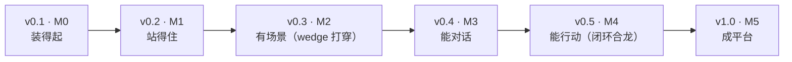
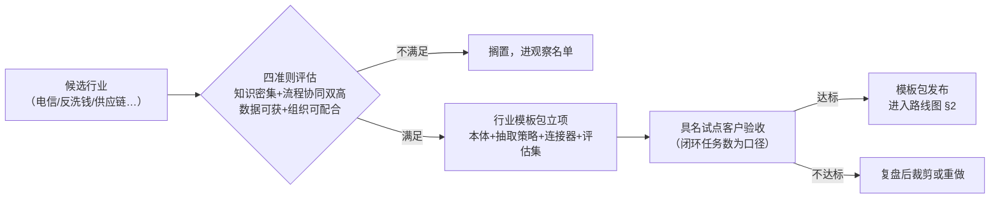

# 03 - 产品路线图

> 状态：v0.1 | 日期：2026-09-26 | 上游依据：[架构锚点 01](../architecture/01-总体架构与分层.md) §7（里程碑/出口条件/PoC）、[评审记录 2026-09-26](../architecture/评审-2026-09-26-多专家研讨与行业痛点批判.md) §5（wedge 裁决）、[研究整理/00](../研究整理/00-平台总体架构.md) §4（行业案例）、[研究整理/07](../研究整理/07-Harness-Agent解剖与本体骨架.md) §8/§10（试点行业待裁决项）、[PRD](./02-PRD-产品需求文档.md)

---

## 1. 版本节奏表（v0.x ↔ M0~M5）

节奏对齐[锚点 §7](../architecture/01-总体架构与分层.md)：先在单租户、单行业场景打穿「建本体→抽取→检索→MCP 出口→业务回写」一条竖线（wedge），再横向铺平台能力；插件市场/A2A/沙箱/审计冷归档**延后不砍**。

| 版本 | 里程碑 | 一句话主题 | 核心范围 | 出口条件（锚点 §7） |
| ---- | ---- | ---- | ---- | ---- |
| v0.1 | M0 骨架 | 装得起 | Monorepo 目录 + gateway/business 两份前置 README spec + docker-compose **lite 档**（PG+Redis+MinIO） | compose up 全绿；CI 升 Python 3.11+ |
| v0.2 | M1 网关+数据 | 站得住 | FastAPI 骨架、鉴权/租户/审计中间件、PG 第一批表（租户/用户/会话/任务/文档/本体版本） | 一条实体从路由到 PG 全层贯通 |
| v0.3 | M2 语义层 wedge | 有场景 | **种子本体（电力停电分析精简版）** + 本体 CRUD + SHACL + 向量基线检索（默认 LazyGraphRAG/向量+BM25）+ 抽取流水线最小版 | 建模→抽取→检索 demo 跑通；PoC ①②③ 完成并冻结结论 |
| v0.4 | M3 Agent+记忆 | 能对话 | 对话编排（SSE 主干波事件 RUN/TEXT/TOOL）、LiteLLM 接入、适配器仅 builtin+claude、L1+结构化 L2 记忆 | 可对话、有记忆、有引用；SSE 多副本验证通过；PoC ④⑤ 完成并裁决 |
| v0.5 | M4 MCP+回写 | 能行动 | MCP Server 出口（含 action.invoke）+ 外部 MCP 接入 + 业务回写契约与首个连接器（电力工单 Mock）+ Outbox 引入 | 外部 Agent 经 MCP 调平台能力；回写幂等/对账/补偿演练通过 |
| v1.0 | M5 平台化 | 成平台 | 插件市场+沙箱、A2A、pi/nanobot 适配器、L3 记忆（Graphiti）、治理 enterprise 档、前端全量 | 按 docs/frontend 设计稿验收；治理三档全开 |

各版本产品侧 DoD 细则见 [PRD §7](./02-PRD-产品需求文档.md)；每个里程碑同步受 PoC 出口条件约束（锚点 §7），**不完成不放行**：

| # | PoC | 裁决什么 | 出口里程碑 |
| ---- | ---- | ---- | ---- |
| ① | OWL 推理基准：rdflib+owlrl 在 1 万/10 万三元组的耗时与内存，对照外挂 Jena Fuseki | 推理 SLA 数字冻结；外挂触发阈值 | v0.3（M2） |
| ② | 抽取置信度校准：金标集（≥500 条）标定 LLM 自报置信度校准曲线 | 人工终审阈值与抽样率；终审吞吐模型（条/人时） | v0.3（M2） |
| ③ | 索引成本标定：LazyGraphRAG vs 完整 GraphRAG 的 token/时间 | 检索默认档；完整索引开关策略 | v0.3（M2） |
| ④ | L2 记忆引擎：mem0 vs Graphiti（质量/延迟/成本 + Graphiti×Neo4j 社区版兼容确认） | L2/L3 引擎选型 | v0.4（M3） |
| ⑤ | LLM structured-output 兼容矩阵：主模型 + 2 个 fallback 过 JSON Schema 抽取 | fallback 模型名单 | v0.4（M3） |

> 未 PoC 前相关设计段落标「待裁决」；PoC ② 的金标集与抽取精确率评估共用（08 篇 §7.1），PoC 结论直接决定 solo 档自动通道何时解锁（BRD §6 风险应对）。

## 2. 发布后路线（v1.0 之后）

| 方向 | 内容 | 优先级 | 触发信号 | 依据 |
| ---- | ---- | ---- | ---- | ---- |
| 插件生态运营 | 第三方供给引入、上架审核规模化、行为符合性门禁 | 中 | 社区出现自发的外部 MCP/插件接入需求 | M5 交付市场底座；生态运营是发布后事项（评审 D-P0：Dify 插件市场是数十人团队数年成果，不自欺） |
| L3/L4 记忆深化 | 组织记忆规模化、沉淀/遗忘机制调优、L4 知识级记忆 | 中 | 多租户/多用户场景上线，L3 数据量显形 | M5 交付 L3 基线（Graphiti）；研究整理 04 |
| 行业模板包 | 种子本体模式复制：每行业 = 本体 + 抽取策略 + 连接器 + 评估集四件套 | 高 | 第一个电力以外的具名试点客户出现 | BRD §7 商业模式 T2；电力模板是第一件 |
| 信创适配 | 图/向量存储国产备选位（TuGraph/NebulaGraph 等）评估 | 高 | 目标客户采购目录含信创要求 | 目标行业（电力/金融/政务）采购中信创目录是一票否决项（研究整理/07 §8；锚点 §3.2 评估点） |
| 服务化拆分演进 | 按锚点 §7 拆分触发条件（发布节奏/资源画像/故障隔离/吞吐上限），拆分序：MCP 网关→语义层→Agent 服务 | 低 | 触发条件命中其一 | 满足其一才拆，不为微服务而微服务 |

## 3. 场景扩展优先级

**钦定首个场景：电力配电网停电分析**（锚点 §7，依据[研究整理/00 §4](../研究整理/00-平台总体架构.md)「本体思维链」案例）。种子本体 + 样例数据集是 M2 出口条件，平台不允许「空工作台冷启动」。

候选行业评估准则（[研究整理/07 §8](../研究整理/07-Harness-Agent解剖与本体骨架.md)；与研究整理 00 §4 共性成功要素一致）：

1. **知识密集**：专家经验可结构化、文档语料充足；
2. **流程协同双高**：分析结论需要回到业务流程执行（有回写对象）；
3. **数据可获**：试点数据/样例可合法获得；
4. **组织可配合**：有具名试点客户配合验收。

准则的证据要求：

| 准则 | 评估证据 | 不达标典型 |
| ---- | ---- | ---- |
| 知识密集 | 有成体系文档/规程语料；可列出 20+ 候选类 | 口头经验为主、无文档 |
| 流程协同 | 存在可回写的业务系统/API（或可 Mock） | 只读分析型场景（纯 BI 替代） |
| 数据可获 | 样例数据集可脱敏/可合成 | 数据涉密且不可合成 |
| 组织可配合 | 具名试点客户 + 对接人 | 无真实用户、仅设想 |

候选行业初评（v1.0 后启动正式评估，案例来源研究整理 00 §4）：

| 行业 | 知识密集 | 流程协同 | 数据/组织 | 备注 |
| ---- | ---- | ---- | ---- | ---- |
| 电力配网停电分析（钦定） | 高 | 高 | 样例数据集随 M2 交付 | wedge 场景，种子本体先行 |
| 电信宽带退单 | 高 | 高 | 待评估 | 研究整理 00 案例：准确率 65%→90%+ |
| 银行反洗钱合规 | 高 | 高（强监管回写） | 合规门槛高 | 强合规：治理 enterprise 档 + 四眼原则天然对口 |
| 航空制造供应链 | 高 | 高 | 组织配合难 | 空客 A350（Palantir）先例 |

## 4. 开放决策点

### 4.1 试点行业变更（反洗钱 vs 电力）

- **现状**：[锚点 §7](../architecture/01-总体架构与分层.md) 已钦定电力配电网停电分析为首个行业场景；但并行线 [研究整理/07 §10](../研究整理/07-Harness-Agent解剖与本体骨架.md) 仍登记「**[用户裁决] 试点行业选择：反洗钱合规 vs 电力配网**」为开放项，两处尚未正式对齐。
- **变更窗口**：M2 启动前。种子本体、抽取策略、回写连接器、评估集均以场景为第一验收对象（锚点 §7），M2 之后变更成本极高。

| 影响面 | 电力（现钦定） | 若变更为反洗钱 |
| ---- | ---- | ---- |
| 种子本体与样例数据集 | 电力停电分析 20~50 类（M2 交付） | 全部重做：AML 本体 + 合规样例（数据获取门槛更高） |
| 首个回写连接器 | 电力工单 Mock（M4） | 改为合规报告/案例上报类连接器 |
| golden QA 评估集 | 电力场景分层构建（08 篇 §7.1） | 重建 |
| 治理默认档位 | solo 起步即可 | 天然要求 enterprise 档（四眼原则）前置 |
| 里程碑排期 | 现锚点 §7 不变 | M2/M4 出口条件改写，排期重估 |

裁决规则建议：按 §3 四准则打分 + 具名试点客户可获性；一旦裁决，同步回改锚点 §7 与研究整理 07 §10，保持单一事实源。裁决动作清单：

| 时点 | 动作 | 产出 |
| ---- | ---- | ---- |
| M2 启动前 | 用户对「反洗钱 vs 电力」作最终裁决 | 锚点 §7 场景段落定稿（或维持电力并关闭 07 篇开放项） |
| 裁决后 1 周内 | 回改受影响文档：锚点 §7、研究整理 07 §10、PRD FR-ONTO-01/FR-WB-03、本路线图 §3/§4.1 | 各处不再存在双处定义 |
| M2 期间 | 种子本体+样例数据集+评估集按裁决场景交付 | M2 出口条件验收 |

### 4.2 其他开放决策

| 决策点 | 现状 | 影响 |
| ---- | ---- | ---- |
| ~~双前端路线裁决~~ | 2026-09-26 已裁决：React/Apple 旧稿归档（docs/archive/），Vue+Onto Blue 为唯一路线 | 已关闭 |
| 商业化启动时点 | BRD §7 双轨制草案；T1 触发条件未定 | 影响云托管投入节奏与开源边界 |
| 北极星过渡口径 | 周活跃闭环任务数 M4 起可测 | M2/M3 期间以 leading 指标（终审吞吐/证据对话数）对外汇报 |

## 5. 待办与开放问题

- [ ] 试点行业裁决对齐：推动研究整理 07 §10 开放项与锚点 §7 钦定正式收敛（用户裁决）
- [ ] 行业评估打分卡：§3 四准则量化（评分维度/权重/及格线），v1.0 前定稿
- [ ] 电信宽带退单 / 银行反洗钱候选场景的种子本体可行性预研
- [ ] 与锚点 §7 工程待办联动：目录改名（services→services 等）、CI 升级，属 v0.1 前置
- [ ] 版本节奏与单人+AI 开发现实校准：每里程碑结束做一次排期复盘，偏差超 1 个版本即重排
- [ ] v1.0 后路线（§2）细化排期与投入估算（T1/T2 市场信号触发）
