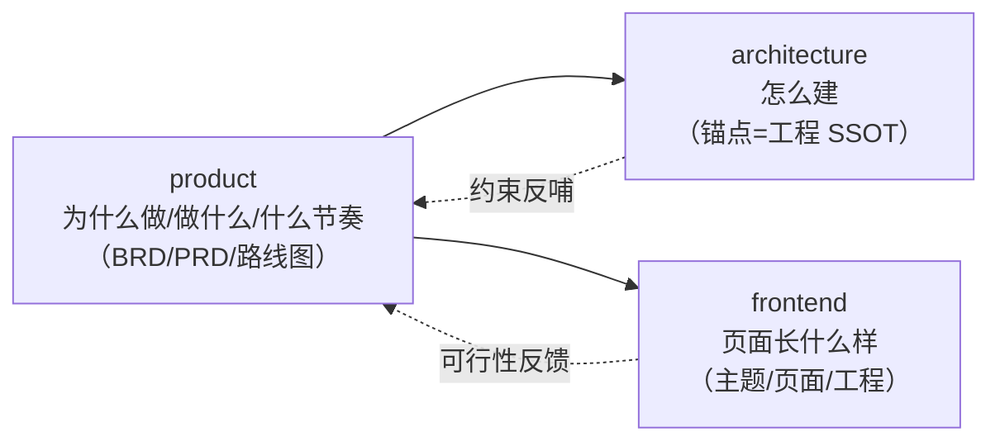

# product - 产品生命周期文档（需求侧）

> 状态：v0.1 | 日期：2026-09-26 | 本目录是 ontology-agent 平台**产品需求侧**文档的唯一归属：回答「为什么做、做什么、什么节奏做」。

## 文档索引

| 文档 | 状态 | 内容一句话 |
| ---- | ---- | ---- |
| [01-BRD-商业需求文档](./01-BRD-商业需求文档.md) | v0.1 | 市场机会/愿景定位/目标市场/北极星指标/壁垒/风险/商业模式 |
| [02-PRD-产品需求文档](./02-PRD-产品需求文档.md) | v0.1 | v1 范围（M0~M5）/角色与治理档位/用户旅程/56 条 FR/NFR/追踪矩阵/里程碑 DoD |
| [03-产品路线图](./03-产品路线图.md) | v0.1 | v0.x~v1.0 版本节奏/发布后路线/场景扩展优先级/开放决策点 |

## 与其他文档目录的关系

- **需求变更**：先改本目录（PRD 登记 FR），再传导至 `docs/frontend/02`（页面）与 `docs/architecture/`（工程）；本目录不复制工程细节，一律引用锚点。
- **架构变更**：先改 [01 锚点](../architecture/01-总体架构与分层.md) 再同步分篇（08 篇 §9 文档规范），涉及里程碑/场景/档位的变更须回改 PRD 与路线图以保持一致。
- 冲突裁决顺位：**锚点（工程事实）> PRD（需求事实）> 本 README（索引）**；里程碑、场景、治理档位、角色等以锚点与 08 篇为权威。

## 维护规则

1. 需求侧任何新增/变更（FR 增删、优先级调整、里程碑映射）必须先改 PRD，PRD 是需求侧唯一事实源，FR 编号只增不回收；
2. 每个里程碑验收后回填 PRD §4.9 统计与 §7 DoD 状态，路线图 §1 同步标记版本状态；
3. 开放问题解决后：从各篇「待办与开放问题」划销，并在受影响文档回改正文（不留双处定义）。
