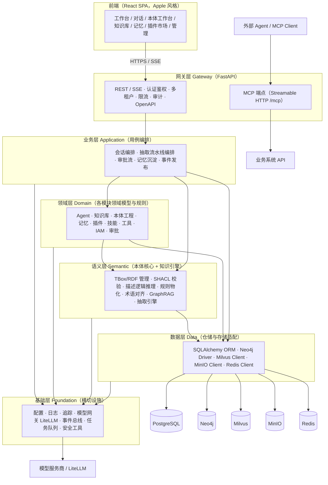
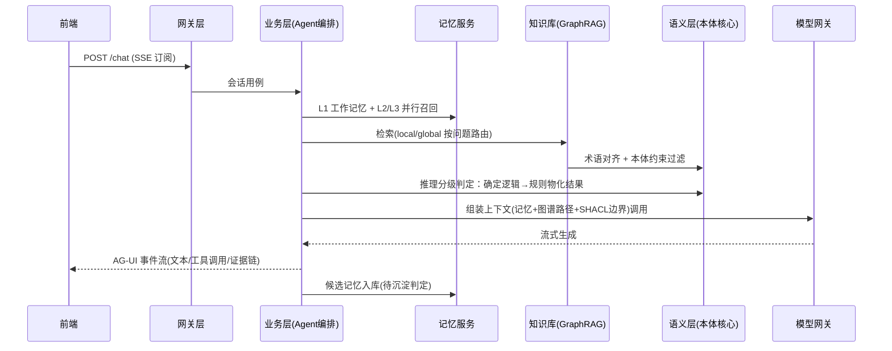
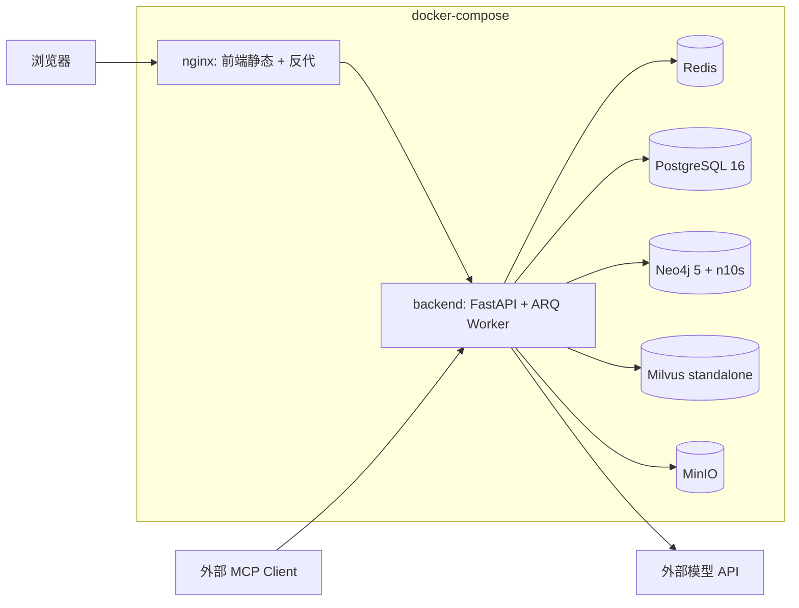

# 00 - 系统架构总览

> 状态：v1.0 待评审 | 日期：2026-09-26 | 上游依据：`docs/研究整理/00~06`
>
> 本文定稿五件事：分层架构、技术选型、核心服务清单、运行闭环、演进路线。

---

## 1. 平台定位（继承研究结论）

**ontology-agent** 是一个**以本体为语义基座的智能体平台**，对应研究文档的三向定位：

- **向上**：托管多种 agent 工具（平台原生 Agent 运行时 + nanobot / pi / openclaw / hermes / Claude Agent SDK 插槽），提供统一的会话、任务、模型接入与能力注入；
- **向中间**：以 **graphrag-ontology 知识库 + 本体推理核心**为语义中枢，为 Agent 提供可信业务上下文与可校验的逻辑约束；
- **向下**：以 **MCP** 为能力出口，把本体定义的对象、规则、行动暴露为可执行业务算子，打通"决策 → 执行 → 回流"闭环。

## 2. 分层架构



### 2.1 对口头方案的调整说明

| 口头方案 | 定稿 | 调整理由 |
| ---- | ---- | ---- |
| 网关层 / 领域层 / 语义层 / 业务层 / 数据层 / 基础层 | 网关层 → **业务层 → 领域层 →** 语义层 → 数据层 → 基础层 | 业务层放领域层之上（用例编排领域对象，依赖方向才顺）；语义层作为独立层沉到领域层之下——它不是某模块的私有逻辑，而是全平台的语义基座（本体核心 + 知识引擎），领域层的多个模块（本体工程、知识库、记忆 L4、工具语义标注）都调用它 |
| —— | **补充**：MCP 端点挂在网关层、业务动作独立审批模块 | 研究文档 05 篇：MCP 是战略组件；动作类工具必须过约束校验 + 人工确认，需要独立审批工作流支撑 |

依赖铁律：**只允许上层依赖下层，禁止反向**；跨层必经接口（领域层不得直接 import SQLAlchemy 模型，必须走仓储接口）。

## 3. 技术选型

| 层 | 定稿 | 备选（为何不选） | 理由 |
| ---- | ---- | ---- | ---- |
| 前端框架 | **React 18 + Vite + TypeScript** | Vue 3（同样主流，但 React 生态在图谱画布/AG-UI/SSE 组件上积累更深） | "最常用前端框架" = React；vite 冷启动快 |
| 前端组件 | **Tailwind CSS 4 + shadcn/ui 深度定制 Apple 主题** | Ant Design（组件全但视觉基因与 Apple 风格相悖，深度定制成本高于换皮） | shadcn/ui 是无头组件，主题令牌完全可控，Apple 风格可以做到"原生长相"；见 03 篇 |
| 图谱画布 | **React Flow**（本体工作台/图谱浏览） | AntV G6（超大图场景作 v2 备选） | React Flow 与 React 状态模型贴合，MIT 协议，主流度最高 |
| 状态管理 | **Zustand + TanStack Query** | Redux（模板代码重） | 服务端状态归 Query，本地状态归 Zustand，业界当前主流组合 |
| 动效 | **framer-motion** | CSS transition（简单场景够用，复杂编排不足） | Apple 风格的核心是动效质感 |
| 后端框架 | **FastAPI**（全栈 Python） | Node/TS（MCP TS SDK 成熟，但本体生态 rdflib/pySHACL/owlready2 全在 Python） | **回答研究文档 02/05 篇开放问题：语言栈统一为 Python**。本体核心是平台灵魂，rdflib + pySHACL + owlready2 无法替代；FastAPI 原生 SSE/WS + OpenAPI |
| ORM | **SQLAlchemy 2.0（async）+ Alembic** | Tortoise（生态弱）、SQLModel（薄封装，复杂查询受限） | 事实标准，asyncpg 驱动 |
| 模型网关 | **LiteLLM SDK 内嵌（v1）→ LiteLLM Proxy（规模化后）** | One-API（观测/预算/回退弱于 LiteLLM） | 研究 02 篇结论；v1 内嵌 SDK 减少部署组件，接口按 Proxy 形态设计以便平滑切换 |
| Agent 事件流 | **AG-UI 风格 SSE 事件**（16 事件语义作蓝本） | WebSocket（双向能力过剩，SSE + HTTP POST 足够且更好排障） | 研究 02 篇选型结论 |
| MCP | **官方 Python SDK（FastMCP），Streamable HTTP 远程 + stdio 本地**，兼容 2025-06-18 / 2025-11-25 能力协商 | —— | 研究 05 篇结论 |
| 规则引擎 | **v1：SPARQL CONSTRUCT 物化（rdflib 执行）+ pySHACL 约束校验 + owlready2/HermiT 描述逻辑推理** | Drools（Java 栈，引入即双语言）；GraphDB/Jena Fuseki（外挂服务，v2 规模化再上） | 推理分级的确定性一侧先用 RDF 生态原生能力闭环，接口抽象留好替换位 |
| 任务队列 | **ARQ（Redis 后端）** | Celery（同步模型与 FastAPI async 混用别扭、组件重） | 抽取流水线/记忆沉淀是长任务，async 原生优先 |
| 事件总线 | **Redis Streams**（v1） | Kafka（当前吞吐远未需要） | 事件闭环（行动回流/记忆沉淀触发）v1 规模够用；出站用 Outbox 模式保证可靠 |
| 部署 | **Docker Compose 单机（v1）→ k8s（规模化）** | —— | 最小够用 |

## 4. 核心服务清单（十模块 + 三补充）

用户点名的模块 + 按研究结论补充的模块。各模块详细设计落位：本体核心→07 篇、Agent 运行时→08 篇、MCP 网关与工具集→09 篇、插件与技能→10 篇、IAM/审批/安全→11 篇、基础层→12 篇、接口契约全集→13 篇、部署与运维→14 篇（知识库→04 篇、记忆→06 篇）：

| # | 模块 | 职责 | 研究依据 |
| ---- | ---- | ---- | ---- |
| 1 | **Agent 服务** | 平台原生 agent 运行时（agent loop、工具调用、上下文组装）+ 外部 agent 工具托管插槽；会话/任务状态机；AG-UI 事件流 | 01/02 篇 |
| 2 | **本体核心（语义层主体）** | TBox 建模（OB2 + GB/T 48000.3 元数据规范）、RDF 存储、SHACL 校验、DL 推理、规则物化、术语对齐、版本管理与变更评审 | 03 篇 |
| 3 | **知识库 graphrag-ontology** | 文档摄入 → 预处理 → LLM 批量抽取 → 术语对齐 → 校验 → 人工归档七步流水线；GraphRAG local/global/DRIFT 检索 | 03 篇 |
| 4 | **记忆服务** | L1 会话 / L2 用户 / L3 组织 / L4 本体知识四层；沉淀管线（抽取→冲突判定→分级写入）与并行召回；遗忘与审计 | 04 篇 |
| 5 | **MCP 网关** | 平台能力出口（MCP Server）、外部 MCP 接入（MCP Host）、业务 API → 语义标注工具映射、动作回流 | 05 篇 |
| 6 | **插件服务** | 插件市场（server.json 扩展格式、审核上架、签名）、插件运行时隔离（独立守护进程/沙箱） | 06 篇 |
| 7 | **工具集服务** | 工具注册中心（MCP/本地/业务 API 统一元数据）、按需 schema 分发（Tool Search）、调用观测 | 06 篇 |
| 8 | **技能（Skills）服务** | SKILL.md 资产库（对齐 agentskills.io 标准）：上传、版本、检索、按 agent 分发；与插件市场共用审核链 | 04/06 篇（程序记忆落点） |
| 9 | **IAM（租户/用户/权限）** | 租户隔离、用户/角色/RBAC、API Key（供 MCP 出口）、工具级 + 数据级授权 | 05/06 篇安全要求 |
| 10 | **模型网关（基础层）** | LiteLLM 统一接入、渠道与凭据管理、预算/限流/降级、成本记账、Claude 直连通道 | 02 篇 |
| 补1 | **审批中心** | 统一审批工作流：候选本体终审、记忆 L2→L3 升级、插件上架、高风险动作人工确认 | 03/04/05/06 篇共同要求 |
| 补2 | **审计与观测** | 全操作审计（谁在何时对什么做了什么）、调用链追踪（OpenTelemetry）、Token/成本归因 | 05 篇 |
| 补3 | **通知服务** | 审批待办、任务完成、异常事件的站内通知（v1 站内信，渠道集成 v2） | 撑起审批闭环 |

## 5. 核心运行闭环

### 5.1 一次问答（知识感知 → 推理决策）



### 5.2 一次行动闭环（OB2 逆向闭环）

```
事件(数据变化/用户指令) → 规则(规则物化命中/SHACL 校验) → 行动(本体行动类 → MCP tool)
  → 回写业务 API(经适配器) → 更新数据(本体实例 + 记忆 + 审计) ──→ 回到事件
```

高风险行动（支付/冻结/删除类）在"行动"节点前插入审批中心的二次确认，可按租户配置。

## 6. 部署拓扑（v1 单机 Compose）



存储容量、备份策略、k8s 迁移触发条件见 02 篇第 7 节。

## 7. 演进路线（里程碑）

| 里程碑 | 交付 | 验收标准 |
| ---- | ---- | ---- |
| **M1 骨架** | 六层目录骨架 + 网关层中间件 + PG/Redis 接入 + IAM 基础（登录/用户/角色）+ 前端脚手架（Apple 主题 + 布局 + 登录 + 工作台空页） | 登录到工作台全链路通；CI 绿 |
| **M2 本体核心** | 语义层 TBox/RDF/SHACL/版本管理 + 本体工作台前端（类树/属性/公理/推理面板）+ 审批中心雏形 | 符合 GB/T 48000.3 元数据表单；SHACL 校验与版本回滚可用 |
| **M3 知识库** | 七步抽取流水线（ARQ 异步）+ 抽取审核工作台 + GraphRAG local/global 检索 + 图谱浏览 | 一份 PDF 进→候选实例→终审→图谱可检索，全程带出处 |
| **M4 Agent + 记忆** | 平台原生 agent 运行时 + AG-UI 事件流 + 对话页 + 记忆四层（L1/L2 全量，L3/L4 骨架）+ 模型网关 | 对话中可见工具调用与证据链；会话结束产生 L2 候选记忆 |
| **M5 MCP + 插件** | 平台 MCP Server 出口 + 外部 MCP 接入 + 工具注册中心 + 插件市场（审核上架）+ Skills 库 | 外部 Claude/pi 经 MCP 调到平台检索与校验；业务 API→工具映射 PoC |

依赖关系：M2 是 M3/M4 的前提（语义约束先行）；M1→M5 顺序即风险递减顺序（最难的本体与抽取放在有完整人工门禁的前提下做）。

### 7.1 敏捷开发模式与交付纪律（全项目强制）

- **迭代模型**：M1~M5 五个里程碑，里程碑内按 1~2 周 sprint 迭代；每 sprint 末必须交付**可运行增量**并演示，禁止"整层开发完再联调"。
- **纵向切片优先**：每 sprint 打通一条最薄闭环（网关→业务→领域→语义→数据全链路，如 M2 首切片 = "建项目→存一版 Turtle→SHACL 校验通过→前端可见"），后续 sprint 横向铺面。
- **模块化交付**：模块边界即交付边界——每模块独立可测（领域层零框架依赖，单测全速跑）、独立可验收、独立可演示；模块间只经**接口 + 领域事件**协作，禁止跨模块 import 领域内部实现与 ORM 模型（01 篇 §1.1 各层禁令）。
- **分层依赖纪律的 CI 强制**：三层静态检查进流水线（依赖 arch 测试）——①分层依赖检查（import-linter contract：六层只许上层依赖下层）；②模块边界检查（domain 内跨模块 import 即红）；③架构回归测试（`tests/architecture/` 常驻）。检查不过 = CI 红 = 不许合并。
- **DoD（完成的定义）**：功能验收 + 测试绿 + 分层依赖检查绿 + 审计/权限落点确认 + 涉及决策变更的 ADR 已记录。每里程碑末按本篇 §7 验收标准 + 各篇 §验收场景做评审。

## 8. 风险登记

| 风险 | 等级 | 对策 |
| ---- | ---- | ---- |
| OWL 重推理性能（owlready2/HermiT 单机） | 中 | 推理分级控制调用频次；接口抽象留 GraphDB/Jena 替换位（03 篇存储选型已留） |
| Claude Agent SDK 专有条款与计费变动 | 中 | 托管插槽设计为可插拔，接入前法务确认（01 篇结论）；pi/nanobot 作 MIT 备选运行时 |
| 工具描述投毒 / prompt injection | 高 | 06 篇门禁：静态扫描 + LLM 审查双轨；annotations 不作授权依据 |
| LLM 抽取幻觉 | 高 | 设计宪法第 3 条：候选非成品 + 出处指针 + SHACL 门禁 |
| 单体膨胀 | 低 | 严格模块边界 + 仓储接口 + 事件总线；切分触发条件写入 02 篇第 7 节 |

## 9. 关键决策记录（ADR 摘要）

| # | 决策 | 状态 | 替代方案 |
| ---- | ---- | ---- | ---- |
| ADR-1 | 后端全栈 Python（FastAPI + 官方 MCP Python SDK） | 已定 | TS/Node 同栈（MCP TS SDK 成熟，但本体生态不可替代）——**关闭研究文档 02/05 篇开放问题** |
| ADR-2 | 模块化单体起步，不拆微服务 | 已定 | 按服务拆分（规模未到，拆分只增加运维面） |
| ADR-3 | 语义层独立成层（领域层之下） | 已定 | 本体逻辑并入领域层（会被多模块重复依赖，边界糊掉） |
| ADR-4 | 前端 shadcn/ui + Tailwind 定制 Apple 主题 | 已定 | Ant Design 深度定制（视觉基因冲突，改造成本更高） |
| ADR-5 | TBox 以版本化 Turtle 文件（MinIO）+ rdflib 内存图为准，PG 只存注册元数据 | 已定 | TBox 全存 Neo4j（n10s 属性图丢失 OWL 公理表达力） |
| ADR-6 | 规则 = SPARQL CONSTRUCT 模板（版本化），引擎可替换 | 已定 | Drools（Java 双栈）、外挂 Fuseki（v2 再上） |
| ADR-7 | 事件总线 v1 用 Redis Streams + Outbox | 已定 | Kafka（吞吐未需要） |
| ADR-8 | AG-UI 风格 SSE 作前端事件流 | 已定 | WebSocket（单向推送为主，SSE 更简单可排障） |
| ADR-9 | 对外协议三出（REST / MCP / `oa` CLI）一进（插件），单一事实源在工具注册中心 | 已定（05 篇） | 各协议独立实现能力（必然漂移） |
| ADR-10 | 插件二分：内置仅限 core-knowledge/ontology/memory/action 四个（随平台发版、进程内）；其余一律外置（沙箱 + 市场审核）；官方出品不进内核的为"官方认证外置" | 已定（05 篇） | 官方插件走内置快捷通道（腐蚀信任域） |
| ADR-11 | 插件新增 CLI-harness 第三轨；CLI-Anything（HKUDS）作官方认证外置插件接入，默认配置从严（出网白名单全拒起步、未分类命令一律审批、不预装 harness） | 已定（05 篇） | 逐个服务自研集成（成本高）；做成内置（违反 ADR-10） |
| ADR-12 | 记忆本体类型化：mem TBox + SHACL 门禁 + IRI 对齐 + 检索本体扩展 + 记忆反哺本体 | 已定（06 篇） | 向量+JSON（无 schema、无反哺）；全量 ABox 化（违反推理分级） |
| ADR-13 | "候选非成品"在记忆域分级落地：L2 低危静默写（三重保险），L3/L4 人工审 | 已定（06 篇） | 全部人工审（个人记忆不可行）；全部静默写（违反宪法第 3 条） |
| ADR-14 | 记忆后台任务双队列 + 空闲闸门：在线退让、LLM 预算分账、deadline 兜底 | 已定（06 篇） | 纯 cron 低峰批处理（空闲窗口浪费）；随会话实时沉淀（与在线争抢 LLM） |
