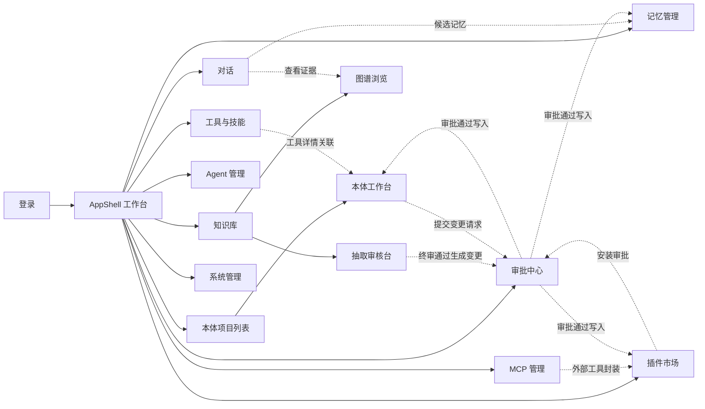

# 03 - 前端架构与 UI 设计规范（Apple 风格）

> 状态：v1.0 待评审 | 日期：2026-09-26
>
> 定稿三件事：**Apple 风格主题系统**（令牌先行，主题 → 脚手架 → 组件）、**页面清单与跳转关系**（UI 设计阶段必须定死的部分）、**核心页面的组件关联逻辑**。
>
> 本文是设计系统的事实定义；研发流程与质量门禁见 [22-前端工程规范与研发流程](./22-前端工程规范与研发流程.md)，AI 代理执行规则见 [23-前端VibeCoding规范](./23-前端VibeCoding规范.md)；**可视化设计稿**（HTML 画板，8 页面 + 组件库，可切亮暗）见 [docs/设计稿/ui-design-board.html](../设计稿/ui-design-board.html)。

---

## 1. 技术栈

| 项 | 定稿 | 说明 |
| ---- | ---- | ---- |
| 框架 | React 18 + TypeScript + Vite | 最主流组合 |
| 样式 | Tailwind CSS 4 | 原子化 + CSS 变量令牌，主题系统的载体 |
| 组件库 | shadcn/ui（无头组件，源码进仓库） | 按本文档令牌定制成 Apple 观感；不用 Ant Design（视觉基因冲突，ADR-4） |
| 图谱画布 | React Flow | 本体工作台 / 图谱浏览 |
| 图表 | ECharts（定制 Apple 主题） | 工作台统计、观测页 |
| 路由 | React Router 7 | 集中式路由配置（与 §4 路由表一一对应），全部页面支持深链 |
| 服务端状态 | TanStack Query | 一切 API 数据；SSE 单独封装 hook |
| 客户端状态 | Zustand | 主题、布局、编辑器草稿等 |
| 动效 | framer-motion | Apple 质感的关键：弹簧曲线、位移、模糊过渡 |
| 表单 | react-hook-form + zod | 本体元数据表单（GB/T 48000.3 十项元数据校验） |
| API 客户端 | openapi-typescript 生成 + 自封装 fetch | 契约来自 FastAPI OpenAPI，杜绝手写类型漂移 |
| i18n | 中文优先，文案集中在 `locales/zh-CN.ts` | 预留 en-US 目录 |

## 2. Apple 风格设计系统（主题定稿）

> 主题 = 设计令牌（Design Tokens）→ Tailwind 主题 → shadcn/ui 变量映射，三层贯通。组件只消费令牌，禁止硬编码颜色/圆角/阴影。

### 2.1 设计语言要点

- **材质（液态玻璃 Liquid Glass，2025 Apple 设计语言）**：大面积浅灰底 `#f5f5f7` 上的白色浮层；**控制/导航层用液态玻璃**——透镜式折射（`backdrop-filter: blur(24px) saturate(200%)` 高饱和保真，避免纯 blur 的"灰塑料感"）+ 顶部镜面高光（inset 白色 rim light）+ 底部内阴影 + 半透明渐变着色 + 1px 半透明描边；玻璃层随背后内容自适应亮暗。深色模式底 `#000`。
- **玻璃分两档**（对齐 Apple HIG）：**Regular**（较实，着色 60–72%，承载文字，用于侧边栏/顶栏/对话框/输入栏）与 **Clear**（较透，着色 30–40%，悬浮于内容/画布之上，用于画布工具条、验证条、悬浮控件）。
- **字体**：系统字体栈（SF Pro / 苹方 / 鸿蒙 / 雅黑降级链），大标题收紧字距，正文 15px 起步，层级靠字重与字号不靠颜色堆砌。
- **形状（同心几何）**：卡片连续大圆角（16–18px）、按钮胶囊形（CTA）/ 10px（常规）、输入框 10px；**嵌套圆角必须同心**（外 18 内 10，圆心一致，Apple Liquid Glass 几何规则）；分隔线用 0.5px 发丝线。
- **阴影**：极柔和双层阴影 + 玻璃层的 inset 高光/内阴影；hover 时轻微抬升。
- **颜色**：克制的单强调色（系统蓝），语义色（红/绿/橙）只用于状态；整体像 macOS 系统设置，不像后台管理系统。
- **动效**：一切进出场都有位移 + 透明度过渡（200–400ms），列表有 stagger，弹窗有弹簧缩放；玻璃控件状态切换用 **morphing 弹簧**（形状连续变形不跳变）；尊重 `prefers-reduced-motion` 与 `prefers-reduced-transparency`（后者玻璃退化为实底）。

### 2.2 颜色令牌（亮 / 暗成对）

| 令牌 | 亮色 | 暗色 | 用途 |
| ---- | ---- | ---- | ---- |
| `--bg` | `#f5f5f7` | `#000000` | 页面底 |
| `--surface` | `#ffffff` | `#1c1c1e` | 卡片 / 面板 |
| `--surface-2` | `#fbfbfd` | `#2c2c2e` | 次级面板 / 表格斑马纹 |
| `--material` | `rgba(255,255,255,.72)` + blur | `rgba(28,28,30,.72)` + blur | （兼容别名，逐步并入 glass 系） |
| `--glass-regular` | `rgba(255,255,255,.62)` | `rgba(28,28,30,.62)` | 液态玻璃 Regular 着色（侧边栏/顶栏/对话框/输入栏） |
| `--glass-clear` | `rgba(255,255,255,.38)` | `rgba(44,44,46,.38)` | 液态玻璃 Clear 着色（画布工具条/悬浮控件） |
| `--glass-tint` | `rgba(255,255,255,.28)` | `rgba(255,255,255,.08)` | 玻璃折射渐变着色（对角叠加） |
| `--glass-hi` | `rgba(255,255,255,.65)` | `rgba(255,255,255,.22)` | 顶部镜面高光（inset rim light） |
| `--glass-lo` | `rgba(0,0,0,.08)` | `rgba(0,0,0,.3)` | 底部内阴影 |
| `--glass-border` | `rgba(255,255,255,.55)` | `rgba(255,255,255,.14)` | 玻璃描边 |
| `--label` | `#1d1d1f` | `#f5f5f7` | 主文字 |
| `--label-2` | `#6e6e73` | `#a1a1a6` | 次文字 |
| `--label-3` | `#aeaeb2` | `#636366` | 占位 / 禁用 |
| `--separator` | `rgba(0,0,0,.08)` | `rgba(255,255,255,.12)` | 发丝线 |
| `--accent` | `#0071e3` | `#0a84ff` | 主操作 / 链接 / 选中 |
| `--accent-soft` | `rgba(0,113,227,.12)` | `rgba(10,132,255,.2)` | 选中底色 |
| `--green / --red / --orange` | `#34c759 / #ff3b30 / #ff9500` | `#30d158 / #ff453a / #ff9f0a` | 语义状态 |
| `--purple / --teal / --indigo` | `#af52de / #30b0c7 / #5856d6` | 暗色对应提亮 | 图谱节点分类色板 |

### 2.3 排版令牌

| 令牌 | 字号/行高 | 字重 | 用途 |
| ---- | ---- | ---- | ---- |
| `large-title` | 30/38 | 700 | 页面大标题（收紧 `letter-spacing: -0.5px`） |
| `title-2` | 22/28 | 600 | 区块标题 |
| `headline` | 17/24 | 600 | 卡片标题 / 列表主文字 |
| `body` | 15/24 | 400 | 正文 |
| `subheadline` | 13/18 | 400 | 辅助说明 |
| `caption` | 12/16 | 400 | 时间戳 / 徽标 |
| `mono` | 13/20 | 400 | IRI、SPARQL、 Turtle、日志（`SF Mono / JetBrains Mono`） |

### 2.4 其他令牌

- 圆角：`card 18 / panel 14 / control 10 / pill 999`
- 阴影：`shadow-card: 0 2px 8px rgba(0,0,0,.04), 0 8px 24px rgba(0,0,0,.06)`；`shadow-float`（弹层）加深一层
- 间距：4px 基数；页面栅格 `max-w-[1440px]`，内容区左右 32px
- 动效：`ease-apple: cubic-bezier(0.25, 0.1, 0.25, 1)`；`spring`（framer-motion `stiffness 300 / damping 30`）
- 断点与窗口适配：见 **§2.6 分辨率与窗口适配规范**（五档断点、三栏折叠优先级、高度/缩放/浏览器矩阵、视口测试矩阵）

### 2.5 令牌落地（`frontend/src/design-system/tokens/`，归并落位见 16 篇 §1）

```
design-system/
├── tokens/
│   ├── tokens.css        # :root 与 .dark 的 CSS 变量（上文全部令牌，唯一事实源）
│   ├── theme.ts          # Tailwind @theme 映射，导出 TS 常量（图表用）
│   └── shadcn-mapping.css # 令牌 → shadcn 变量（--background/--foreground/--primary…）
└── ui/                   # shadcn 定制基元（§3.1 清单；16 篇 L1）
```

暗色模式：class 策略 + Zustand 持久化，默认跟随系统；图表与 React Flow 节点样式全部从 `theme.ts` 取色。

### 2.6 分辨率与窗口适配规范（Responsive & Adaptive）

**适配策略**：Desktop-first 的企业工作台。设计基准 **1440×900**（设计稿画板即此档），最优区间 1280–1920；平板窗口（768–1023）保证全功能可用（布局重组）；手机（<768）只保证**浏览与轻交互**（审批、通知、对话、检索），建模/审核等专业工作流展示"请使用桌面端"引导卡——原生移动端 v1 不做（README 持续设计清单 #8 评估）。

**断点体系**（Tailwind 4 默认值，集中登记于 `theme.ts`）：

| 档 | 视口宽 | 布局形态 | 侧边栏 | 三栏页面行为 |
| ---- | ---- | ---- | ---- | ---- |
| `2xl` | ≥1536 | 内容区 `max-w 1440` 居中、两侧留白；图谱画布不受限满幅 | 展开 228px | 全部展开 |
| `xl`（基准） | 1280–1535 | 标准三栏/双栏 | 展开 228px | 全部展开 |
| `lg` | 1024–1279 | 栏距收紧（32→24） | **图标条 72px**（hover 浮出标签） | 右侧检查器/上下文面板改为**按钮呼出浮层** |
| `md` | 768–1023 | 双栏→单栏堆叠；表格横向滚动或卡片化 | **抽屉化**（遮罩 overlay，汉堡唤出） | 三栏变**单栏 + 顶部分段切换**（对话：会话/消息/上下文） |
| `sm` | <768 | 单列；统计卡 4→2→1；large-title 30→26 | 抽屉（默认收起） | 移动浏览形态；专业工作流出引导卡 |

**三栏折叠优先级**（先折谁，全平台一致，禁止各页自定义）：

- 对话页：会话列表（lg 图标化 → md 抽屉）→ 上下文面板（lg 浮层 → md 底部 Sheet）→ 消息流永在；
- 本体工作台：检查器（lg 浮出）→ 类树（md 抽屉）→ 图谱画布最后收缩（满幅自适应，React Flow 自带缩放平移）；
- 抽取审核台：候选队列（md 顶部下拉选择器）→ 原文/结构双栏（sm 堆叠）。

**高度与窗口**：

- 最小可用窗口 **1024×680**；视口高 <760 时 page-h 由 30px 收至 22px、统计卡转单行紧凑态；
- 固定层（topbar 52 / 对话输入栏 / 画布验证条）钉住，内容区独立滚动——玻璃层固定、内容滚过，正是液态玻璃材质的展示位。

**缩放与密度**：

- 全部以 CSS px 设计，必须支持系统缩放 100%/125%/150%（Windows 高频）——图标全 SVG、布局 flex/grid 弹性，侧边栏宽度等关键尺寸走令牌（`--sb-w`），禁止硬编码像素三栏；
- 触屏断点（md/sm）交互目标 ≥44×44px；v1 不做 compact 密度变体（最小够用）。

**浏览器支持矩阵**：Chrome/Edge ≥ 100、Firefox ≥ 100、Safari ≥ 16（`backdrop-filter` 全支持，液态玻璃无需降级路径）；不支持 IE/旧版内核。

**实现与验收**：

- 断点只允许 Tailwind 断点令牌与 `theme.ts` 登记，组件内禁止裸写 `@media` 数值；
- 组件级适配（随容器而非视口）用 **container query** 渐进增强，v1 仅统计卡与插件卡使用；
- 视觉回归增加**视口矩阵**：`1440 / 1280 / 1024 / 768 / 375` × 亮暗（与 22 篇 §4 合并进 CI）。

## 3. 组件策略（主题 → 脚手架 → 组件）

### 3.0 液态玻璃使用规则（全组件强制）

1. **玻璃只给控制/导航层**：侧边栏、顶栏、输入栏、悬浮工具条、Toast、Dialog/Sheet、玻璃按钮；**内容层一律实底**（卡片、表格、文档、表单、图谱节点）——保证可读性是玻璃材质的第一约束；
2. **玻璃不叠玻璃**：玻璃层上不再放玻璃子元素（Dialog 内表单区用实底面板）；
3. **两档选用**：承载文字的浮层用 Regular，悬浮于画布/媒体之上用 Clear；文字对比度不达标时升级为 Regular 或实底；
4. **实现分层**（CSS 原型见设计稿画板）：`backdrop-filter: blur(24px) saturate(200%)` + `--glass-tint` 对角渐变 + `inset 0 1px 0 var(--glass-hi)` 镜面高光 + `inset 0 -1px 1px var(--glass-lo)` + `1px var(--glass-border)` 描边；忠实折射（SVG feDisplacementMap）仅 Chromium 支持，v1 不引入；
5. **退化路径**：`prefers-reduced-transparency` 或不支持 backdrop-filter 时，玻璃令牌替换为对应实底（`--surface`），布局不变；
6. **同心圆角**：玻璃容器与其内部控件圆角同心（外 18 → 内 10）。

### 3.1 基元组件（shadcn/ui 定制，一次性完成 Apple 化）

Button（胶囊 CTA / 常规 / **液态玻璃**）、Input、Select、Dialog（液态玻璃面板 + 实底内容区 + 弹簧缩放）、Sheet（侧滑抽屉）、Tabs（macOS 分段控件样式）、Table（斑马纹 + 发丝线）、Toast（液态玻璃）、Tooltip、Command（⌘K 面板）、Form、Badge、Skeleton。

### 3.2 业务组件（由基元组装，全部消费令牌）

`GraphCanvas`（React Flow 封装：节点分类色、证据路径高亮、小地图）、`EvidenceChain`（出处指针 → 可展开引用卡）、`ApprovalCard`、`PipelineStepper`（七步流水线状态）、`MemoryLayerTabs`、`AxiomEditor`、`SkillMarkdownViewer`、`ToolSchemaCard`、`StatusDot`。

### 3.3 布局组件

`AppShell`（液态玻璃侧边栏 + 顶栏 + 内容区）、`PageHeader`（large-title + 操作区）、`SplitView`（列表/详情双栏，macOS 邮件式）、`InspectorPanel`（右侧检查器，可收起）。

规则：新页面**先查业务组件清单再写新组件**；任何组件不直接写颜色值。

## 4. 页面清单与路由表（UI 设计定稿）

| 路由 | 页面 | 一句话职责 |
| ---- | ---- | ---- |
| `/login` | 登录 | JWT 登录（v1 账号密码） |
| `/` | 工作台 | 最近会话、待审批数、流水线状态、快捷入口 |
| `/chat/:sessionId?` | 对话 | 会话列表 + 流式对话 + 上下文/证据面板 |
| `/ontology` | 本体项目列表 | 项目卡片（三档方案、命名空间、版本） |
| `/ontology/:projectId` | 本体工作台 | 类树 + 图谱画布 + 检查器 + 规则/公理 + 推理面板 + 版本 |
| `/kb` | 知识库 | 文档列表 + 上传 + 流水线状态 |
| `/kb/review` | 抽取审核台 | 候选实例队列（机器粗加工 → 人工终审） |
| `/kb/explore/:kbId` | 图谱浏览 | 全库图谱探索 + 检索测试台 |
| `/memory` | 记忆管理 | L1–L4 分层浏览 + 升级审批 + 时间线 |
| `/agents` | Agent 管理 | 插槽注册、实例、会话历史 |
| `/marketplace` | 插件市场 | 市场卡片、详情、安装审批 |
| `/tools` | 工具与技能 | 工具注册表 + Skills 库（SKILL.md 查看） |
| `/mcp` | MCP 管理 | 出口工具清单 + 外部 server 接入治理 |
| `/approvals` | 审批中心 | 四类审批统一待办/已办 |
| `/admin` | 系统管理 | 租户/用户/角色、模型渠道、存储与观测 |

### 4.1 页面跳转关系（导航图）



跳转规则：跨模块一律 `router.push` 带 query 回跳（如审核台跳工作台后返回保留筛选）；深链一律可直达（路由参数自包含）；Command 面板（⌘K）提供全局页面/本体类/工具搜索直达。

## 5. 核心页面组件关联逻辑（UI 设计必须定死的部分）

### 5.1 对话页 `/chat`

```
┌──────────┬───────────────────────────────┬────────────┐
│ 会话列表  │  消息流（气泡 + 工具卡 + 证据）  │ 上下文面板   │
│ (毛玻璃)  │  ┌─────────────────────────┐  │ ·召回的记忆  │
│ 搜索/新建 │  │ AgentRun 事件流渲染       │  │ ·检索的图谱  │
│          │  │ ToolCallCard(状态/结果)   │  │  路径(可跳)  │
│          │  │ EvidenceChain → 跳图谱    │  │ ·推理分级来源│
│          │  └─────────────────────────┘  │ ·引用文档    │
│          │  [输入框 + 模型/agent 选择]     │  (点击开抽屉)│
└──────────┴───────────────────────────────┴────────────┘
```

- 组件与状态：`SessionList`（Query 缓存 sessions）→ 选中写路由参数；`MessageStream` 订阅 `useSseAgUi(sessionId)`，按事件类型增量渲染；`ToolCallCard` 收 `TOOL_CALL_*` 事件显示参数/结果/耗时；`EvidenceChain` 点击 `source_ref` → 打开 `Sheet` 抽屉展示原文片段，或跳 `/kb/explore?focus={entity_iri}`。
- 关联逻辑：右侧 `ContextPanel` 展示本次回答的四类来源（L1/L2/L3 记忆、GraphRAG 路径、规则命中），每条可溯源——这是"可信上下文"卖点的前端呈现；输入框可切换 agent 插槽与模型渠道。

### 5.2 本体工作台 `/ontology/:projectId`

```
┌────────┬──────────────────────────────┬──────────────┐
│ 类树    │  GraphCanvas（React Flow）    │ InspectorPanel│
│ TBox    │  类/实例图，选中节点双向联动    │ ·8 项类元数据 │
│ 搜索    │  工具条：布局/过滤/聚焦子图     │ ·10 项属性元数据│
│ +新建类 │  Tab：图谱 | 公理/规则 | 版本  │ ·出处/历史    │
│         │  AxiomEditor | VersionDiff   │ [保存→变更请求]│
└────────┴──────────────────────────────┴──────────────┘
```

- 组件与状态：`ClassTree`（TBox 类层级，Zustand 存 `selectedIri`）；`GraphCanvas` 与类树双向联动（点树定位节点、点节点开 Inspector）；`InspectorPanel` 表单按 GB/T 48000.3 元数据八项/十项渲染，zod 校验 IRI/必填；`AxiomEditor`（SHACL shape / SPARQL CONSTRUCT 模板，mono 字体 + 语法高亮）；`ValidationPanel` 跑 SHACL/DL 推理，结果列表点击定位到问题节点；`VersionDiff` 左右对照 Turtle diff，`回滚`需走审批。
- 关联逻辑：编辑不直接写 TBox——保存生成 `ChangeRequest` 跳审批中心（设计宪法第 3 条）；`Tools` 页工具详情的"关联本体行动类"链接反跳本页并聚焦该类。

### 5.3 抽取审核台 `/kb/review`

- `ReviewQueue`（按 job/类型筛选的候选列表）→ `CandidateDetail`（左：原文出处高亮；右：抽取结构化结果）→ 批量 通过/驳回 → 通过的候选显示"进入终审/直接入库"由审批流配置决定；顶部 `PipelineStepper` 显示七步流水线整体进度。
- 关联逻辑：审核通过 → 投影任务写 Neo4j/Milvus（用户无感）；驳回 → 回到提取任务统计，可一键"重新抽取该分片"。

### 5.4 其余页面

- 记忆管理：`MemoryLayerTabs`（L1–L4）+ `Timeline`（Graphiti 式失效边可视化）+ `PromotionReview`（L2→L3 升级审批卡）。
- 插件市场：市场卡片（评分/安装数/权限 scope 徽标）→ 详情 Sheet（server.json、工具清单、权限声明）→ 安装（需审批的进审批中心）。
- 审批中心：`ApprovalCard` 按对象类型渲染不同详情（本体 diff / 记忆内容 / 插件清单 / 动作参数），通过/驳回 + 意见。
- 系统管理：SplitView 列表/详情模式，模型渠道表带预算与成本列。

## 6. 目录结构（frontend/）

```
frontend/src/
├── app/            # 路由表、AppShell、providers（Query/Theme/ErrorBoundary）
├── design-system/  # 设计系统 L0+L1（§2.5 令牌 + §3.1 基元；16 篇 §1）
├── components/
│   └── business/   # 业务组件（§3.2；基元归并至 design-system/ui）
├── features/       # 按页面域组织：chat / ontology / kb / memory / agents /
│                   # marketplace / tools / mcp / approvals / admin / dashboard
│   └── chat/       #   每个域：pages/ components/ hooks/ stores/(仅本域)
├── api/            # openapi 生成 client + 各域 query hooks + sse hook
├── stores/         # 全局 Zustand：auth / session / ui（theme、layout 归入 ui-store；editor-draft 在 features/<域>/stores/——16 篇 §2）
└── lib/            # utils、常量、错误码映射
```

## 7. 与后端契约

- OpenAPI → `openapi-typescript` 生成类型 → TanStack Query hooks 按 `queryKey` 规范（`[域, id, params]`）封装；变更用 mutation + 失效策略。
- SSE：`useSseAgUi(sessionId)` 统一解析 AG-UI 16 事件 → Zustand 会话内增量状态 → MessageStream 渲染；断线指数退避重连，重连后用 `last_event_id` 续传。
- 错误呈现：后端错误码 → `lib/errors.ts` 映射中文文案；SHACL 校验报告渲染为结构化问题列表（不是一坨红字）。
