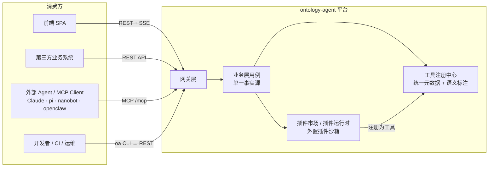
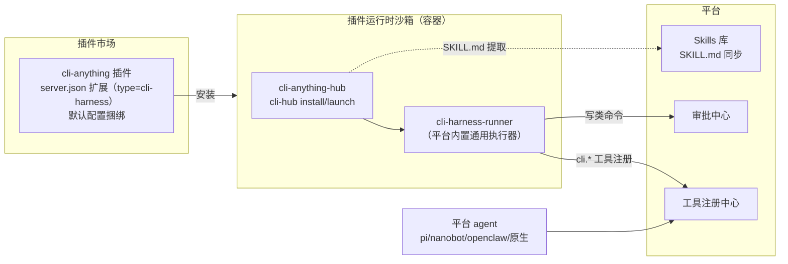

# 05 - 对外服务协议与插件边界

> 状态：v1.0 待评审 | 日期：2026-09-26 | 上游依据：01 篇 §3（API 规范）、研究 02 篇（Agent 协议）、05 篇（MCP）、06 篇（插件与工具集）
>
> 定稿四件事：平台**对外服务的四条通道**（接口 / MCP / CLI / 插件）各自的协议规范、四条通道的**边界铁律**、内置核心插件与外置插件的**判定边界**、**CLI-Anything 外置插件**的接入形态与默认配置。

---

## 1. 对外服务面总览：三出、一进

平台与外界的协议关系只有五个字：**三出、一进**。

- **三条出口**（平台能力出去，同一业务层的三张协议皮）：**REST API**（前端 + 第三方系统）、**MCP**（agent 生态互操作）、**CLI**（本机自动化 / CI / 运维 / 本地 agent）；
- **一条入口**（外部能力进来）：**插件**（MCP server / REST API / CLI-harness 三种资产形态）+ Skills 资产库（与插件市场共用分发渠道）。

### 1.1 消费方 × 通道矩阵（选通道先查这张表）

| 消费方 | 首选通道 | 备选 | 不提供 |
| ---- | ---- | ---- | ---- |
| 前端 SPA | REST `/api/v1` + SSE（AG-UI 事件流） | —— | —— |
| 第三方业务系统（服务端集成） | REST `/api/v1`（API Key） | MCP（若对方是 agent/LLM 系统） | CLI |
| 外部 Agent / MCP Client | MCP `/mcp` | REST（非 agent 系统） | SSE 直连 |
| 开发者终端 / CI 流水线 | `oa` CLI | REST | SSE |
| 平台内托管 agent（pi/nanobot/openclaw/Claude 插槽） | 工具注册中心直连（内部优化路径） | MCP 自调用（互操作测试） | —— |
| 想给平台加能力的外部开发者 | **插件市场**（外置插件上架） | —— | 改内核、直连数据库 |

### 1.2 四条通道的边界铁律（全项目强制）

1. **单一事实源**：REST / MCP / CLI 三条出口暴露的是**同一业务层用例**，由工具注册中心统一登记元数据与语义标注。不允许出现"CLI 能做而 API 不能做"的能力差；新增能力先落业务层 + 注册中心，三个出口自动获得。
2. **CLI 是 REST 的薄壳**：`oa` CLI 只做参数解析 + 调 REST + 渲染输出，禁止 CLI 直连数据层或绕过网关鉴权。
3. **MCP 不暴露管理面**：IAM、审批操作、插件上下架等管理能力只走 REST，MCP 出口仅暴露业务算子（`knowledge.* / ontology.* / memory.* / action.*`）。
4. **插件永远外挂**：任何插件（含官方出品）运行在插件运行时（独立守护进程/容器 + 出网白名单），不得 import 内核模块、不得直连五存储——数据访问只能经平台暴露的内部 API / MCP。
5. **annotations 不是授权**：MCP `annotations`（readOnlyHint 等）与 CLI `--help` 文案一样，均为不可信元数据；授权只认平台侧 scope + ACL（设计宪法第 5 条的协议面落点）。

---

## 2. REST API 协议（接口出口）

基础规范已在 01 篇 §3 定稿（URL 版本化、JWT/API Key、统一响应、cursor 分页、SSE、预签名上传、OpenAPI 自动文档），此处只补**对外部系统集成**的协议约束：

| 规范项 | 定稿 | 官方依据 |
| ---- | ---- | ---- |
| 契约格式 | OpenAPI 3.1（FastAPI 自动生成），对外发布前剥离管理面路由 | OpenAPI Specification 3.1 |
| 错误详情 | 统一响应体外，`detail` 字段对齐 RFC 9457（Problem Details）风格 | RFC 9457 |
| 幂等 | 动作类 POST（`action.invoke`、审批提交）支持 `Idempotency-Key` 头，网关去重窗口 24h | 行业惯例（Stripe 式） |
| 限流 | 响应头 `X-RateLimit-*`（Limit / Remaining / Reset），超限返回 429 + `Retry-After` | 行业惯例 |
| 变更策略 | `/api/v1` 冻结破坏性变更；破坏性演进开 `/api/v2`，v1 保留 ≥6 个月双跑 | 语义化版本思路 |
| 事件流边界 | SSE 仅用于会话/任务事件订阅；**不做**双向通道（WS 明确不引入，ADR-8） | —— |

**边界**：REST 面向"程序对程序"的确定性集成；凡是消费方是 LLM/agent 的，引导走 MCP（带语义标注与校验），不鼓励 agent 裸调 REST。

---

## 3. MCP 协议（agent 生态出口/入口）

协议基座沿用研究 05 篇结论 + 00 篇 ADR-1：官方 Python SDK（FastMCP）、Streamable HTTP 远程 + stdio 本地、兼容 2025-06-18 / 2025-11-25 能力协商（2026-07-28 版 Tasks 为 opt-in 扩展，不强依赖）。此处定协议细节：

### 3.1 出口（平台 = MCP Server）

| 协议项 | 定稿 |
| ---- | ---- |
| 端点 | `https://<host>/mcp`（Streamable HTTP，`Mcp-Session-Id` 维持会话）；单机本地部署支持 stdio 启动模式 |
| 鉴权 | HTTP 端点：`Authorization: Bearer <API Key>`（IAM 签发，租户隔离）；后续接 OAuth 2.1（MCP 官方 authorization 规范方向） |
| 工具命名 | `<域>.<动作>`：`knowledge.search / ontology.reason / ontology.validate / ontology.query / memory.read / memory.write / action.invoke`，跨租户命名空间一致 |
| 语义标注 | 工具 `_meta` 携带平台扩展字段 `x-ontology`（对应本体行动类 IRI、触发规则、所需 scope、数据分级）——平台区别于"裸工具堆"的关键；消费方可忽略，不影响标准客户端兼容 |
| resources | TBox 摘要、领域术语表、知识卡片（只读；resources 不做写入通道） |
| prompts | 领域任务模板（只读） |
| 授权 | scope + ACL（工具级 + 行级），服务端强制；`annotations` 仅 UI 提示（安全红线） |
| 审计 | 每次 tool call 留痕（调用方/租户/参数摘要/结果状态/耗时），trace_id 贯穿 |
| 限流 | 按租户 × 工具维度配额 |

### 3.2 入口（平台 = MCP Client/Host）

外部 MCP Server 注册 → `tools/list` 自动发现 → **默认不可信**，管理员审核开启 → 按 agent/用户授权可见性 → 失败熔断不阻塞主流程。外部工具进平台后与本地工具同表登记（工具注册中心），agent 侧视图一致。

**边界**：MCP 入口接入的外部工具，其能力对外**不再转发**（平台不做 MCP 代理/二级市场转售第三方工具）；要在市场流通必须走插件上架流程、以插件身份存在。

---

## 4. CLI 协议（平台自身 `oa` CLI，新增定稿）

平台提供官方 CLI `oa`（ontology-agent），Python + Click 实现，**只封装 REST API**。01 篇目录结构中落位 `tools/oa/`（独立发版为 `ontology-agent-cli` PyPI 包）。

### 4.1 命令空间

| 命令组 | 覆盖 | 对应 REST |
| ---- | ---- | ---- |
| `oa login/logout/whoami` | API Key 配置、连通性自检 | IAM |
| `oa ontology <init/validate/diff/publish/rollback>` | 本体版本工程流（脚本化建模） | ontologies |
| `oa kb <upload/status/list>` | 文档提交与抽取任务跟踪 | kb |
| `oa memory <search/export>` | 记忆检索与导出 | memory |
| `oa agent run` | 提交一次 agent 任务（非交互，输出事件摘要） | agents |
| `oa plugin <list/install/uninstall>` | 插件管理（管理员） | plugins |
| `oa tool <list/search/call>` | 工具注册中心查询与试调用 | tools |
| `oa approval <list/approve/reject>` | 审批待办处理 | approvals |
| `oa admin <tenant/quota>` | 租户与配额管理 | admin |

### 4.2 协议规范

| 规范项 | 定稿 |
| ---- | ---- |
| 输出 | 默认人类可读表格；`--output json`（机器消费，agent/CI 用）强制结构化输出 + UTF-8；`--output yaml` 可选 |
| 退出码 | `0` 成功；`1` 业务错误（服务端 3xxx/4xxx）；`2` 用法错误；`3` 认证/网络错误；`4` 部分失败（批量场景） |
| 自描述 | 每级命令 `--help` 完整（Click 自动生成）——**CLI 即文档**，与 CLI-Anything 的 agent-native 原则一致 |
| 配置 | `~/.oa/config.toml`（profile 多环境）+ 环境变量 `OA_ENDPOINT / OA_API_KEY / OA_OUTPUT` 覆盖；凭据不明文落日志 |
| 流式 | `oa agent run --follow` 拉取 SSE 并渲染为终端事件行 |
| 版本协商 | 启动时探测服务端 `/api/v1` 版本，不兼容时提示升级而非报错堆栈 |

**场景边界**：CI/CD（本体版本发布流水线、抽取任务提交）、运维脚本、本地 agent（pi/nanobot）经 shell 消费平台能力。**不做**：交互式 TUI（前端已覆盖）、大文件经 CLI 中转（走预签名直传）。

---

## 5. 插件协议：内置核心 vs 外置 的边界（定稿）

### 5.1 三种插件资产形态

06 篇已定 MCP 主轨 + REST 辅轨。本篇新增**第三轨：CLI-harness 插件**（承载 §6 的 CLI-Anything 及同类资产）：

| 轨道 | 资产形态 | 接入方式 | 适用 |
| ---- | ---- | ---- | ---- |
| 主轨 | MCP Server（`server.json` 扩展清单） | 插件运行时托管，Streamable HTTP / stdio | 标准互操作能力 |
| 辅轨 | REST API（OpenAPI 3.x 文档） | 平台自动转 MCP 工具 + 人工语义标注 | 已有业务 API |
| **三轨（新）** | **CLI-harness（Click 系 CLI + SKILL.md + 可选 HARNESS.md）** | 平台内置 `cli-harness-runner` 通用执行器包装为工具 | 桌面软件/本地服务/脚本生态的 agent 化 |
| 附带资产 | SKILL.md（agentskills.io 格式） | 不独立成插件，作为插件的**附属技能资产**同步进 Skills 库 | 程序记忆/使用说明 |

### 5.2 内置核心插件（官方第一方，随平台发版）

**只包含平台核心能力的封装**，代码在主仓 `backend/app/domain/…` 对应封装层，随平台同一版本节奏发布、同一签名信任域、**不走市场审核**（走内部回归 + 评审）：

| 内置插件 | 封装能力 |
| ---- | ---- |
| `core-knowledge` | GraphRAG 检索 / 知识卡片 |
| `core-ontology` | reason / validate / query |
| `core-memory` | 四层记忆读写（按授权） |
| `core-action` | 业务动作执行 + 回流（强审批绑定） |

特征：**默认安装、默认注册到工具注册中心、不可卸载（只可按租户停用）**；它们是平台的"官方第一方插件"，对外表现与普通插件一致（agent 视角无差别），但信任域最高。

### 5.3 外置插件（一切非内置）

含第三方社区插件与官方出品但不随核心发版的插件。统一走 06 篇 §4.4 上架流水线：`清单校验 → 自动门禁（schema/静态扫描/投毒检测/依赖审计）→ 人工审核（敏感类目）→ 签名上架 → 运行期监测`。运行时强制沙箱（独立容器 + 出网白名单 + 资源配额）。

### 5.4 边界判定表（遇到新插件先查这张表）

| 判定维度 | 内置核心插件 | 外置插件 |
| ---- | ---- | ---- |
| 代码归属 | 平台主仓 `backend/` 内 | 独立仓库/第三方，主仓无代码 |
| 信任域 | 平台签名（最高） | 发布者签名 + 平台审核背书 |
| 发版节奏 | 随平台版本 | 独立版本，市场分发 |
| 上架流程 | 内部评审 + 回归 | 完整市场审核流水线 |
| 运行位置 | 平台进程内（受 IAM 管束） | 插件运行时沙箱（容器隔离） |
| 数据访问 | 经领域服务 | 仅经平台内部 API/MCP，出网白名单 |
| 默认状态 | 默认安装注册 | 默认不装，按需安装 |
| 升级 | 平台统一升级 | 市场/`oa plugin` 独立升级 |
| 典型例子 | core-knowledge / core-ontology / core-memory / core-action | **CLI-Anything**、外部 MCP server、业务 REST 插件 |

**灰色地带裁定**：官方出品但不进内核的（如 CLI-Anything 默认配置、官方适配的行业插件）= **官方认证外置插件**（first-party certified）——信任域与审核流程按外置走，市场加"官方认证"标识。**裁定原则：凡需要随平台发版、依赖内核内部接口的，才有资格内置；否则一律外置。**

---

## 6. CLI-Anything 外置插件（官方认证，默认配置）

### 6.1 定位

接入 [HKUDS/CLI-Anything](https://github.com/HKUDS/CLI-Anything)（"Making ALL Software Agent-Native"，Apache-2.0，Python ≥3.10 / Click）：其 **CLI-Hub** 注册表（`pip install cli-anything-hub` → `cli-hub install/launch <name>`）提供社区构建的软件 CLI-harness（Blender/GIMP/Obsidian/n8n/Zotero/Exa 等 18+），每个 harness 自带 **SKILL.md**；其 7 阶段生成器（分析→设计→实现→测试→文档→发布，产出 Click CLI + REPL + JSON 输出）可为**没有现成 CLI 的服务现场生成 agent-native CLI**。

**解决的用户诉求**：遇到需要 CLI 化的服务，平台 agent 不必逐个开发集成——装 CLI-Hub 现成 harness，或用生成器现场产 CLI，直接进工具注册中心给 agent 用。

**插件属性**：`官方认证外置插件`。不进主仓代码树、不随平台发版、走市场审核、可 `oa plugin uninstall` 一键移除；平台侧只维护一个**通用执行器 + 默认配置**。

### 6.2 接入形态与数据流

- **工具投影**：每个已安装 harness 在工具注册中心投影为 `cli.<hub名>.run`（执行子命令）+ `cli.<hub名>.help`（自描述）；`cli.hub.search/install` 仅管理员可用。schema 按需下发（Tool Search），SKILL.md 全文经 Skills 库做渐进式披露，不塞进工具 schema。
- **两条使用路径**：
  1. **消费现成 CLI**：管理员/agent 经 `cli.hub.search` 发现 → `cli-hub install` → 候选注册 → 门禁通过后 agent 可用；
  2. **生成新 CLI**（服务 CLI 化）：在隔离构建容器中运行生成器插件（宿主为 pi/Claude Code 等插槽）→ 产出 CLI 进**候选区**（设计宪法第 3 条"候选非成品"）→ 审核（静态扫描 + 试运行 + 人工）→ 注册上架。

### 6.3 默认配置（随插件捆绑发布，租户可改）

| 配置项 | 默认值 | 说明 |
| ---- | ---- | ---- |
| `install_source` | PyPI `cli-anything-hub`（可配私有镜像） | 安装源白名单 |
| `execution` | 插件运行时独立容器；CPU 2 核 / 内存 2GB / 单命令超时 120s / 并发 4 | 资源配额 |
| `network` | 默认**全部拒绝**；放行 PyPI 镜像 + 各 harness 登记的必需端点（逐 CLI 声明） | 出网白名单，宁严勿松 |
| `output` | 强制 JSON 输出（等价 `--output json`）；超 64KB 截断并附截断标记 | agent 消费确定性 |
| `filesystem` | 仅工作目录 `/workspace/<harness>` 可写；禁符号链接逃逸（对齐上游 #304 的加固方向） | 路径安全 |
| `approval_policy` | 命令**未分类一律按"写类"处理，走审批中心二次确认**；管理员逐 harness 标记 read/write/dangerous 三级，read 类免审 | 默认低权限；CLI-harness 无 annotations 可依，故默认从严（边界铁律 5） |
| `skills_sync` | 开启：SKILL.md 自动同步 Skills 库，按 agent 分发 | 程序记忆落点 |
| `preinstalled` | **空**——不预装任何 harness；按需 `cli-hub install` | 最小够用 |
| `desktop_targets` | 禁用（Blender/GIMP 等需宿主桌面软件的 harness 默认标记不可用，v1 只放开 headless/API 类：Exa、n8n、Obsidian、Dify、WireMock 等） | 与服务器部署形态匹配 |
| `generator` | 构建容器出网仅限目标源码仓库 + PyPI；生成物必经候选审核 | CLI 化生产线的门禁 |

### 6.4 升级与退路

- 插件版本独立演进，跟随上游 release；`server.json` 的协议版本区间声明与平台 MCP 网关协商；
- 上游若变更分发方式（如 CLI-Hub 注册表格式），由平台侧 `cli-harness-runner` 适配层吸收，**不改内核**；
- 极端情况（上游停维护/安全事件）：下架插件即可，`core-*` 内置插件不受任何影响——这正是内置/外置边界的价值。

---

## 7. 一致性与演进

- **三出口一致性校验**（CI 门禁）：工具注册中心登记的每个能力，校验其 REST 路由 / MCP tool / `oa` 子命令三者签名同源（由同一用例 schema 生成），防漂移；
- **协议版本弃用策略**：REST v1（§2）、MCP 2025-06-18/2025-11-25（§3）、CLI `--output json` schema——弃用均提前两个小版本公告 + 响应头/日志警告；
- **开放问题（不入本篇定稿）**：OAuth 2.1 替代静态 API Key 的时点（跟 MCP 官方 authorization 规范稳定进度）；Webhook 出站订阅（v2）。

---

## 附：本篇新增的决策（并入 00 篇 ADR）

| # | 决策 | 替代方案 |
| ---- | ---- | ---- |
| ADR-9 | 对外协议 = REST + MCP + `oa` CLI 三出口、插件一入口，单一事实源在工具注册中心 | 各协议独立实现能力（必然漂移） |
| ADR-10 | 插件二分：内置仅限四大 core-*（随发版、进程内）；其余一律外置（沙箱 + 市场审核）；官方出品不进内核的为"官方认证外置" | 官方插件走内置快捷通道（腐蚀信任域） |
| ADR-11 | 新增 CLI-harness 插件第三轨；CLI-Anything 作官方认证外置插件接入，默认配置从严禁审批、不预装 harness | 逐个服务自研集成（成本高）；把 CLI-Anything 做成内置（违反 ADR-10） |
