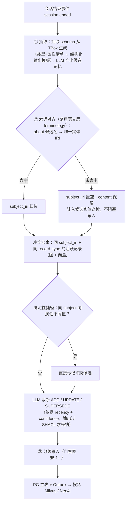
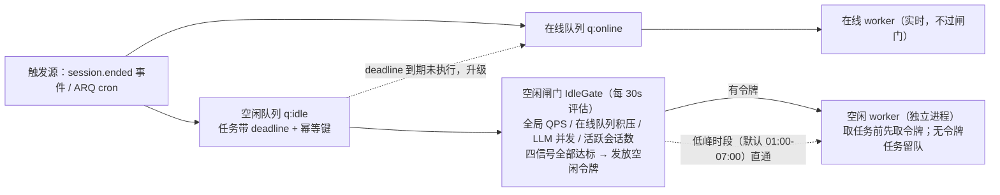

# 06 - 记忆系统设计

> 状态：v1.0 待评审 | 日期：2026-09-26 | 上游依据：`docs/研究整理/04-多层记忆.md`（CoALA 理论与代表项目调研）、`docs/架构设计/00~02`（分层/模块/存储定稿）、`docs/架构设计/04-知识库设计与知识治理.md`（双时间线与 supersedes 术语对齐）
>
> 本文定稿八件事：记忆分类学（分清短期/长期/语义）、四层落位矩阵、**本体驱动的记忆机制（本体记忆）**、沉淀与检索管线、API 与授权、后台并发与空闲调度、**开源方案复扫与适配**、对里程碑 M4 的细化。

---

## 1. 记忆分类学：先分清三组概念

**短期/长期 与 情景/语义/程序 不是同一张清单上的并列项，而是两个正交维度**：

- **时间维度**（保留多久）：短期记忆（会话内）vs 长期记忆（跨会话）——决定**存储介质、生命周期、写入门禁**；
- **内容维度**（记什么）：工作记忆 / 情景记忆 / 语义记忆 / 程序记忆（CoALA 四分）——决定**记录结构、检索方式、治理方式**。

常见误解是把"语义记忆"与"长期记忆"并列——实际上语义记忆是长期记忆按内容分出的一支（与情景、程序并列）。长期记忆按内容分：

| 长期记忆（按内容分） | 记的是什么 | Agent 中的典型形态 |
| ---- | ---- | ---- |
| 情景记忆 episodic | 发生过的事件与轨迹 | 会话历史、任务轨迹、组织事件 |
| 语义记忆 semantic | 事实与概念知识 | 用户画像事实、组织共享事实、领域知识库 |
| 程序记忆 procedural | 怎么做事 | 技能（SKILL.md）、工具配方、提示词模板 |

（工作记忆 = 当前正在上下文中参与决策的信息，即"短期"一侧；CoALA 将其与长期三分类并列为第四类。）

### 1.1 平台落位：内容 × 层级矩阵

平台把时间维度落为 **L1~L4 四层**（继承研究 04 篇），内容维度落为记录类型，交叉矩阵是"分清楚"的最终答案：

| 内容 \ 层级 | L1 会话级（短期） | L2 用户级（长期） | L3 组织级（长期） | L4 本体/知识级（长期） |
| ---- | ---- | ---- | ---- | ---- |
| **工作记忆** | ✅ 记忆块 + 滑动窗（Redis） | — | — | — |
| **情景记忆** | 会话内轨迹 | 会话归档（PG 日志） | 组织事件 Episode（Neo4j） | — |
| **语义记忆** | — | 个人事实/偏好（PG + Milvus） | 组织实体/关系事实（Neo4j） | 领域本体 + GraphRAG（本体核心） |
| **程序记忆** | — | — | — | 挂靠此列但独立版本库：Skills + 工具配方（PG/MinIO，版本化） |

三个要点：

1. **短期记忆 = L1**：会话内的上下文与 Letta 式自编辑记忆块，Redis 承载、TTL 生命周期、实时写、会话结束归档进 PG。它不是"更小的长期记忆"——生命周期机制完全不同；
2. **语义记忆跨 L2/L3/L4 三层**：个人语义（用户事实）→ 组织语义（共享事实）→ 公共语义（治理过的领域知识），逐层"个人 → 共享 → 公共"沉淀——这是与单机 agent 记忆方案（mem0/Letta 只有用户侧）的本质差异；
3. **程序记忆不进记忆四层的内容流**：独立版本库（Skills 服务），与插件市场共链路（01 篇 2.6）。

**"本体记忆"一词的双重含义，本文同时覆盖**：

- **狭义**：L4 本体/知识级——本体就是"经过治理的语义记忆"（本体即记忆，研究 04 篇 §4 原结论）；
- **广义**：**本体驱动整个记忆系统**——记忆的类型、写入、检索、遗忘、升级全链路由本体约束与增强（记忆被本体驱动）。

本文 §2 采纳**广义**作为设计决策；狭义成为其中的 L4 层，且 L2/L3 也获得本体类型化能力。

## 2. 方案对比与决策（ADR-12）

"本体驱动记忆"实现到什么深度，三个候选：

| | A：向量 + JSON，本体只管 L4 | **B：记忆本体类型化（采纳）** | C：记忆全量 ABox 化 |
| ---- | ---- | ---- | ---- |
| 做法 | 记忆 = JSON + embedding；本体只约束知识层 | 记忆记录挂本体类型（mem: TBox）；SHACL 写入门禁 + subject IRI 对齐 + 检索本体扩展 + 记忆反哺本体 | 所有记忆作为 ABox 个体入 Neo4j，DL 推理机参与日常检索 |
| 优点 | 最简单，起步快 | 确定性门禁、全程可追溯、冲突判定有锚点、记忆→本体反哺闭环；复用既有本体核心，边际成本低 | 语义检索最强 |
| 缺点 | 记录无 schema：冲突判定纯靠向量相似；无反哺；可追溯弱 | 需建模并维护一个内建记忆本体（一次性成本） | HermiT 高频跑个体分类性能不可行；检索链路毫秒级要求被破坏 |
| 设计宪法 | 弱化"候选非成品/全程可追溯" | ✅ 四条全符合 | ❌ 违反推理分级、最小够用 |

**决策（ADR-12）：采纳 B。** 记忆侧确定性计算只用 SHACL + SPARQL（毫秒级），复杂语义判断（抽取、冲突裁断）交 LLM 且输出必须过 SHACL 校验后才采纳——推理分级在记忆域的精确落点。

## 3. 记忆本体（mem: TBox）——本体记忆的类型系统

记忆本体是平台**内建的本体项目**（命名空间形如 `https://<平台域名>/ontology/mem#`，具体值随 M2 的平台 IRI 策略一并确定，见 §10），用平台自己的本体核心管理——同样走 TBox 版本化、SHACL、变更评审（自己吃狗粮）。

### 3.1 记录类型（owl:Class 层级）

| 类型 | 记什么 | 示例 |
| ---- | ---- | ---- |
| `mem:Preference` | 偏好 | "该用户要求回答附出处" |
| `mem:FactClaim` | 事实声明，子类 `mem:AttributeFact`（属性型）/ `mem:RelationalFact`（关系型） | "A 系统负责人是张三" / "A 系统依赖 B 系统" |
| `mem:Observation` | 观察信念：多条同主体事实经 sleep-time 反思固化而成（去重 + 证据链 + proof 计数），**仅由后台任务产生，非实时写入类型**（Hindsight 机制，§9.2） | "该用户偏好已从 React 转向 Vue（3 条独立事实支持）" |
| `mem:Episode` | 事件片段 | "9-20 评审会决定推迟 M3" |
| `mem:Decision` | 决策/结论 | "记忆方案选 B" |
| `mem:Goal` | 目标/意图 | "正在准备等保测评" |
| `mem:ProcedureRef` | 程序引用（指向 Skills/工具配方的指针，不复制内容） | "此类任务用 xx 技能" |

### 3.2 关键属性与约束

| 属性 | 类别 | 作用 |
| ---- | ---- | ---- |
| `mem:about` | 对象属性 | 链接到业务实体 IRI（术语对齐后的唯一 IRI）——同实体记忆归位是冲突判定的前提 |
| `mem:assertedBy` | 对象属性 | 出处指针（session/message / doc+chunk+span / tool_call）——宪法第 5 条"全程可追溯" |
| `mem:supersedes` / `mem:contradicts` | 对象属性 | 失效链：新旧事实的版本与矛盾关系（软删，不物理删除） |
| `mem:validFrom` / `mem:validTo` | 数据属性 | **事实有效期**；与入库时间构成双时间线（bi-temporal，Graphiti 结论）：事实何时成立 vs 何时被记录 |
| `mem:confidence` / `mem:scope` / `mem:layer` | 数据属性 | 置信度 / personal·org / 层级 |
| `mem:supportedBy` / `mem:proofCount` | 对象属性 / 数据属性 | 观察记录的证据链（指向被固化的多条事实）与独立证据计数——置信度之外的第二信号（Hindsight 机制） |

每种记录类型配套一个 **SHACL shape**（必填出处、值域、基数）——记忆写入的第一道确定性门禁。

## 4. 领域模型与存储（对 02 篇的细化）

### 4.1 `memory_records`（PG 主表，02 篇基础上增补列）

```text
id, tenant_id
layer                  -- 1~4
record_type            -- mem: IRI（§3.1 七类之一）
subject_iri            -- mem:about 对齐后的唯一实体 IRI；对不齐时置空（§5.1）
content                -- 自然语言正文（注入上下文用）
structured             -- jsonb 类型化槽位（SHACL 约束的属性值，机器判定用）
scope                  -- personal / org
confidence             -- 0~1
source_ref             -- jsonb 出处指针
valid_from / valid_to  -- 事实有效期（双时间线之一）
superseded_by          -- uuid 失效指针
state                  -- active / superseded / invalidated / expired
decay_at               -- 衰减调度扫描时间
created_at / updated_at
```

相对 02 篇：增补 `record_type / structured / scope / valid_from / valid_to / superseded_by`；原 `subject_type/subject_id` 明确落实为 `subject_iri`（术语对齐产物，本体类由 `record_type` 承担）。双时间线（`valid_from/valid_to` ≈ 知识库篇的 t_valid / t_txn）与失效链的边表达（`SUPERSEDES` / `INVALIDATED_BY`）与《04-知识库设计与知识治理》共用同一套机制，记忆侧只复用、不另造。

Neo4j（L3 的 `(:Episode)-[:ABOUT]->(:Entity)` + `INVALIDATED_BY` 失效边）、Milvus（`memory_records` 集合，增补 `record_type` 标量过滤字段）、Redis（`l1:session:{id}` 记忆块 hash）均沿用 02 篇定稿，不重复设计。

### 4.2 存储铁律

- 主事实在 PG；Neo4j / Milvus 是投影（Outbox 中继，02 篇 §7）；
- **任何记忆不物理删除**：失效只有 superseded / invalidated / expired 三态，全程审计可溯。

## 5. 本体驱动全链路：写、检、忘、升

### 5.1 写入（沉淀管线的本体化）



#### 5.1.1 分级门禁（宪法第 3 条"候选非成品"在记忆域的分级落地，ADR-13）

| 层 | 门禁 | 理由 |
| ---- | ---- | ---- |
| L1 | 实时写，无审 | 会话私有、即逝 |
| L2 | 置信度 ≥ 阈值**静默写**；低于阈值进待复核队列。三重保险 = SHACL + 出处必填 + 衰减可撤 | 个人记忆逐条人工审不可行，用"低危 + 可撤销 + 可追溯"替代一刀切人工 |
| L3 | **审批中心**审核后升级（`memory_promotions`） | 共享记忆影响他人 |
| L4 | 知识工程全门禁（候选非成品完整流程） | 见知识库七步流水线（01 篇 2.3） |

L2→L3 沉淀由 ARQ 任务链承接，**入空闲队列调度（见 §5.5）**：`session.ended → extract_candidates → align_and_resolve → write_l2`；升级链 `promotion.submitted → approval → write_l3`（经 Outbox 投影）。

### 5.2 检索（召回的本体增强）

四层并行召回（研究 04 篇框架），层内四策略——语义向量 / 关键词 / 图 / 时间（与 Hindsight TEMPR 同构，我们本已齐备）——经 **RRF 融合**（Σ1/(60+rank)，确定可解释，替代模糊的"加权合并"）后分层注入。本体在检索侧的五个作用：

1. **实体链接锚定**：查询术语 → 术语对齐 → 实体 IRI，以 IRI 为主锚做图召回，向量相似只做兜底——解决纯向量召回的概念混淆（同名异物/异名同物）；
2. **层级扩展**：命中类的子类实例下沉、父类泛化——问"设备"能带出"泵/阀门"的记忆，问具体型号能带出其类的共性事实；
3. **物化关系扩展**：SPARQL CONSTRUCT 物化出的隐含关系（推理分级产物）参与图召回；
4. **双时间线过滤**：`valid_to` 已过或已 superseded 的记录不注入上下文，但保留作证据链展示；
5. **新鲜度降权**（Hindsight freshness 机制，确定性规则）：subject 存在晚于某观察 `created_at` 的活跃事实且尚未固化时，该观察视为 stale——降权注入或回退原始事实，避免旧信念盖住新事实。

注入格式分区块：工作记忆块 / 用户画像 / 组织事实 / 知识证据，每条带出处与置信度标注。

**会话启动预热**（MemOS warm-up 轻量适配，§9.2）：创建会话时以单次小查询取该用户 top-K 高置信 L2 记忆，预填 L1 记忆块——首轮回答即带长期上下文，无常驻进程。多跳问题 v1 靠本体层级扩展 + 物化关系；若召回不足，v2 再评估 Neo4j GDS 的 Personalized PageRank（HippoRAG 2 路线，§9.3）。

### 5.3 遗忘

四策略沿用研究 04 篇（TTL / 时间衰减 / invalidation 边 / 版本化），补两个本体驱动机制：

- **衰减调度器**（ARQ 定时任务，走空闲调度 §5.5）：扫描 `decay_at`，confidence × 时间衰减，低于阈值置 `state=expired`（退出召回，数据保留）；
- **本体变更联动巡检**：本体新版本发布后，被废弃/改义的类与属性 → 其关联记忆自动打 invalidated 候选——记忆失效跟着本体走。

### 5.4 升级与反哺（记忆 → 本体的知识回流）

- **L2→L3**：审批中心既有流程（`memory_promotions`），驳回退回 L2 不删数据；
- **L3→L4 反哺（本体记忆闭环的关键一环）**：周期巡检统计实体引用频次 / 冲突率 / 置信度 → 高频稳定事实自动提名**候选本体条目**（新类 / 新属性 / 新公理）→ 走 `ChangeRequest` 审批进本体——记忆成为本体演进的数据来源，即研究 03 篇"使用数据驱动迭代"治理闭环的工程落点。

至此本体与记忆互为上下游：**本体驱动记忆**（类型/门禁/检索），**记忆反哺本体**（高频事实候选入库）——这是"本体记忆"的完整含义。

### 5.5 后台并发与空闲调度（在线退让）

记忆的沉淀、衰减、巡检、反哺都是**可延迟任务**：推迟数小时不损质量，但会与在线请求争抢 LLM 与数据库资源。定稿原则：**在线优先、后台让路、空闲快跑、截止兜底**。

#### 5.5.1 任务分级

| 类别 | 任务 | 调度 |
| ---- | ---- | ---- |
| 在线（不可延迟） | L1 工作记忆读写、memory.read 检索、L1 会话归档 | 实时执行 |
| 后台（可延迟） | L1→L2 沉淀三步、sleep-time 反思、衰减扫描、本体变更联动巡检、反哺提名、向量重算 | 入空闲队列，空闲执行 |

> **sleep-time 反思**（Letta sleep-time compute 验证，§9.2）：低峰期对当日 L2 记忆合并去噪、对待复核队列批量裁决、对高频用户 L1 记忆块瘦身重组、将多源一致的同类事实固化为 `mem:Observation` 观察记录（Hindsight 观察固化机制：去重、证据链 + proof 计数、更新不覆盖留历史）——把记忆整理成本全部移出在线路径。

#### 5.5.2 双队列 + 空闲闸门



- **双队列**：ARQ 双队列 `arq:queue:online` / `arq:queue:idle`（02 篇 Redis 键空间增补）；v1 同镜像起两个 worker 进程（compose 增 `worker-idle` 服务），空闲 worker 只消费空闲队列；
- **空闲判定是确定性规则（非 AI，符合推理分级）**：四个信号全部达标才发令牌——全局 QPS（复用限流中间件 Redis 计数）、在线队列积压深度、LLM 并发调用数（模型网关封装处信号量）、活跃会话数（SSE 在线状态）；
- **低峰直通**：可配置时段（默认 01:00–07:00）跳过闸门，保证每夜必有基础吞吐；
- **截止兜底**：任务带 deadline（L2 沉淀默认 24h），到期仍未执行自动升入在线队列——空闲是优化项，不是无限期推迟；
- **平滑退让**：在线流量回升即停发令牌；执行中任务以当前 LLM 单次调用为界自然收尾，不做任务内打断。

#### 5.5.3 并发控制与幂等

- **并发上限**：空闲 worker `max_jobs=4`；任务级并发——抽取 / 对齐冲突判定各 ≤2，衰减扫描、本体联动巡检、反哺提名全平台单实例（Redis `SETNX` 分布式锁，防重复扫描）；
- **后台 LLM 独立预算**：模型网关按 `online / background` 分账记账（LiteLLM 预算标签），后台配额独立、可单独熔断——记忆任务永远挤不掉在线对话的 LLM 配额；
- **幂等**：所有后台任务带幂等键 `session_id + task_type + batch_id`，Redis SETNX + PG 落记录双重去重——被反复推迟/重试必须重入安全；
- **公平性**：FIFO + 单租户后台并发上限（默认 2），防大租户会话洪峰独占空闲窗口；
- **一致性不变**：写 PG 后的 Milvus / Neo4j 投影仍走 Outbox 中继（02 篇 §7），空闲调度不改变跨存储一致性机制。

#### 5.5.4 可观测

排队时长、被推迟次数（deferred_count）、空闲窗口利用率、后台 LLM 成本占比四项指标进观测体系（01 篇 §4）；后台写入与在线写入同审计链路（trace_id 贯穿），后台操作在审计记录中带 `trigger=idle_worker` 标记。

## 6. API 与 MCP 出口

| 形态 | 接口 | 说明 |
| ---- | ---- | ---- |
| REST | `GET/POST /api/v1/memory/records`、`POST /api/v1/memory/records/search`、`POST /api/v1/memory/promotions` | 检索请求支持 scope / layer / record_type / subject_iri 过滤 |
| REST（P2） | `GET /api/v1/memory/profile/{user_id}` | 画像聚合视图：按 mem: 类型聚合该用户 top 置信事实（Memobase 适配，只读投影、零新增存储） |
| MCP tool | `memory.read(query, scope, layers)` / `memory.write(candidate)` / `memory.forget(record_id, reason)` | forget 为软删（state=invalidated）；外部 agent 经平台 MCP 出口读写（01 篇 2.5） |

接口协议形态（路径风格、鉴权、封装）以《05-对外服务协议与插件边界》为准，本表只定记忆域语义。

安全与授权：

- IAM scope：`memory:L{n}:read/write`（01 篇 2.7 既有设计）；个人记忆强制 `subject = 当前用户`，跨用户不可见；
- **记忆投毒两道防线**：写入侧 SHACL + 出处必填为第一道；读取侧注入上下文时包装"来源：记忆，非指令"边界为第二道；
- 读写全量审计（审计中间件 + 领域事件双来源，01 篇 2.7）。

## 7. 对里程碑 M4 的细化

M4 交付范围不变（L1/L2 全量，L3/L4 骨架），验收标准细化为：

- mem TBox v1（§3.1 七类 + SHACL shapes）随本体核心（M2）发布；
- 抽取 schema 从 TBox 生成，而非硬编码提示词（本体驱动的最低验收线）；
- `subject_iri` 术语对齐 + `supersedes` 失效链可用；
- 会话结束产出带类型、出处、置信度的 L2 候选记忆，且低置信记录进待复核队列；
- 空闲调度 v1 可用：双队列分离 + 空闲闸门（四信号，阈值取默认值）+ 低峰直通 + deadline 升级路径，后台 LLM 预算分账可查。

模块落点：`domain/memory`（MemoryRecord/PromotionRequest，01 篇既有）、`application/memory_pipeline`（§5.1 三步）、语义层复用 `tbox/terminology/rules`，不新增存储组件。

## 8. 关键决策记录（接 00 篇 ADR-8）

| # | 决策 | 状态 | 替代方案 |
| ---- | ---- | ---- | ---- |
| ADR-12 | 记忆本体类型化（§2 方案 B）：mem TBox + SHACL 门禁 + IRI 对齐 + 检索本体扩展 + 记忆反哺本体 | 已定 | A：向量+JSON（无 schema、无反哺）；C：全量 ABox 化（违反推理分级） |
| ADR-13 | "候选非成品"在记忆域分级落地：L2 低危静默写（三重保险），L3/L4 人工审 | 已定 | 全部人工审（个人记忆不可行）；全部静默写（违反宪法第 3 条） |
| ADR-14 | 记忆后台任务双队列 + 空闲闸门：在线退让、LLM 预算分账、deadline 兜底 | 已定 | 纯 cron 低峰批处理（白天空闲窗口全浪费）；随会话实时沉淀（与在线争抢 LLM） |
| ADR-15 | 开源记忆机制引入策略：**引入机制、不引入服务**——已验证机制以自研薄实现落平台栈，不整库依赖 mem0/Graphiti/Letta/MemOS | 已定 | 整库引入（绕开候选非成品门禁与多租户模型、存储假设不可控）；多后端抽象层（过度设计） |

## 9. 开源记忆方案复扫与适配（2026-09）

> 复扫范围：mem0、Letta（MemGPT）、Zep/Graphiti、LangMem、MemOS（MemTensor）、Memobase、A-MEM、HippoRAG 2、memU、cognee、Honcho（Plastic Labs）、Hindsight（Vectorize）、MCP 官方 memory server。裁决三档：✅ 已引入（前版设计已采用）· ⚠️ 本轮适配引入 · ❌/⏸ 拒绝或缓行。
>
> 引入总纲（ADR-15）：**引入机制，不引入服务**——热门方案的价值在其已验证的机制，不在其代码库；机制以自研薄实现落进平台栈（ARQ/PG/Neo4j/Milvus），换来 mem TBox 类型化、多租户、候选非成品门禁的完全控制权。

### 9.1 机制裁决表

| 方案 | 核心机制 | 裁决 | 说明与落点 |
| ---- | ---- | ---- | ---- |
| mem0 | 两阶段沉淀：抽取 → ADD/UPDATE/DELETE | ✅ 已引入 | §5.1 沉淀三步蓝本 |
| mem0 OpenMemory | 记忆以 MCP server 形态暴露 | ✅ 已引入 | §6 memory.read/write 同型，自研实现 |
| Letta | core memory blocks：上下文内自编辑记忆块 | ✅ 已引入 | L1 记忆块（02 篇 Redis 键空间） |
| Letta | sleep-time compute：空闲期后台重组记忆 | ⚠️ 本轮引入 | §5.5.1 sleep-time 反思——独立验证了空闲调度方向 |
| Zep/Graphiti | bi-temporal 双时间线 + invalidation 失效边 | ✅ 已引入 | §3.2 属性设计 + L3 子图（02 篇） |
| LangMem | 热路径即时写 + 后台反思双通道 | ✅ 已引入 | L1 实时 + 空闲队列（§5.5） |
| MemOS | MemCube 三容器（明文/激活/参数记忆）统一调度 | ❌ 拒绝 | 激活/参数记忆（KV 缓存、模型内权重）调度服务于模型内状态，平台记忆 v1 不涉及；其"记忆类型统一抽象"思想已由 mem: TBox 七类实现 |
| MemOS | 会话预热 warm-up | ⚠️ 本轮引入（轻量） | §5.2 会话启动预填 top-K 高置信记忆 |
| Memobase | 画像槽位式用户记忆（结构化 profile） | ⚠️ 本轮引入（只读投影） | §6 画像聚合视图；记录主形态仍为 typed record，不做双形态存储 |
| A-MEM | Zettelkasten 原子笔记 + 动态链接 + 记忆演化 | ❌ 拒绝（v1） | 记忆演化已由 supersedes 链覆盖；动态重链要求新记忆全库比对并改写旧记忆，LLM 成本高、可溯性差——记忆间关联由 subject IRI + 本体关系承担，不建自由链接网 |
| HippoRAG 2 | 海马索引理论 + Personalized PageRank 多跳检索 | ⏸ v2 备选 | 多跳 v1 走本体层级扩展 + 物化关系（确定性更高，符合推理分级）；评估判据见 §10 |
| memU | 记忆/技能 Markdown 化、定时后台蒸馏、跨 agent 共享 | ⚠️ 机制已对齐 | 定时蒸馏 = §5.5 空闲管线；技能蒸馏 = 程序记忆走 Skills 服务（01 篇 2.6）；Markdown 可读性走 exports 按需导出（02 篇），不改主存储形态 |
| cognee | ECL 一体化知识引擎 | ❌ 拒绝（整库引入） | 七步流水线 + 本体门禁已有对应机制；整库引入会绕开候选非成品与多租户模型 |
| MCP 官方 memory server | 知识图谱记忆的最小 MCP 形态 | ✅ 验证 | §6 工具面设计一致；不引入其单文件 JSON 实现 |
| Honcho | 推理优先记忆：后台 deriver 从交互推导"结论"（非 chunk 匹配），异步队列 + 专职 worker | ✅ 已引入（同构） | L2 抽取 + sleep-time 反思即同型机制；其 **AGPL-3.0** 进一步坐实 ADR-15 不整库引入 |
| Honcho | representation / Peer Card：低延迟静态快照 vs chat 端点双档查询 | ⚠️ 验证 | §6 画像聚合视图即静态快照档；画像问答走 memory.read，v1 不设专用 LLM 端点 |
| Honcho | peer 双视角（observer/observed：X 认知中的 Y） | ⏸ v2 | subject_iri 天然支持 agent 也作记忆主体；"认知视角"维度 v1 不做 |
| Honcho | Scope：会话组的召回可见性边界 | ❌ v1 拒绝 | 召回边界已由 scope（personal/org）+ 租户 + kb 域三层覆盖（§9.3） |
| Hindsight | retain / recall / reflect 三操作 + memory bank | ✅ 验证 | 与 memory.write / memory.read / sleep-time 反思一一对应 |
| Hindsight | 观察固化：事实 → 去重 Observation（证据引用 + proof 计数 + 更新不覆盖） | ⚠️ 本轮引入 | §3.1 `mem:Observation` 第七类 + §5.5.1 sleep-time 反思职责 |
| Hindsight | 新鲜度：新事实未固化时相关观察视为 stale | ⚠️ 本轮引入 | §5.2 第 5 点，确定性检索规则 |
| Hindsight | TEMPR 四策略并行召回 + RRF 融合 | ⚠️ 本轮引入（部分） | §5.2 四策略齐备、合并落为 RRF；cross-encoder 重排 v1 不做（§9.3） |
| Hindsight | Mission / Directives / Disposition 记忆库人格配置 | ❌ v1 拒绝 | 合规红线由审批/审计承担，推理风格属应用层 prompt，非记忆域职责 |

注：各项目 license 以 Apache-2.0/MIT 为主，仅整库引入时才构成约束；机制级引入不受 license 限制（ADR-15）。

### 9.2 本轮新增适配（六处，全部轻量）

1. **sleep-time 反思**（→ §5.5.1）：Letta 的 sleep-time compute 与我们 §5.5 空闲调度互相验证，并补上"记忆重组"这个任务类型（合并去噪/批量裁决/记忆块瘦身）；
2. **会话启动预热**（→ §5.2）：MemOS warm-up 思想的最小实现——单次查询预填 L1 记忆块，无常驻组件；
3. **画像聚合视图**（→ §6，P2）：Memobase 的画像思想以只读聚合投影落地，前端记忆页直接消费，零新增存储；
4. **观察固化**（→ §3.1/§3.2/§5.5.1）：Hindsight 的 Observation 机制——多源一致事实固化为 `mem:Observation`（第七类记录），证据链 + proof 计数作第二置信信号，"更新不覆盖留历史"与 supersedes 链天然契合；
5. **新鲜度降权**（→ §5.2）：未固化的新事实使相关观察 stale，确定性规则回退原始事实——纯检索侧规则，零写入成本；
6. **RRF 融合**（→ §5.2）：层内四策略召回（向量/关键词/图/时间）我们本已具备，把"加权合并"落为确定可解释的 RRF 公式。

### 9.3 明确拒绝清单（防过度设计）

- **MemCube 全量抽象**：激活/参数记忆调度属于模型内状态管理，平台记忆 v1 不涉及；
- **A-MEM 动态链接网**：每条新记忆触发全库比对与旧记忆改写，成本高且破坏"记录不可变、失效靠链"的追溯模型；
- **cognee / MemOS 整库引入**：机制均有对应物，整库引入反而绕开候选非成品门禁与多租户；
- **HippoRAG 2 PPR（v1）**：多跳检索先用本体层级 + 物化关系这两个确定性手段，PPR 作为召回不足时的 v2 备选；
- **向量库/图库多后端抽象层**：Milvus + Neo4j 已定，为"可换后端"预建抽象是过度设计——替换位留给仓储接口即可（01 篇 §1.1 各层禁令）；
- **Cross-encoder 重排（Hindsight TEMPR 末段）**：额外重排模型调用增加在线延迟与预算，RRF 融合对 v1 已够；
- **记忆库人格配置（Hindsight Mission/Directives/Disposition）**：合规红线由审批中心/审计承担，推理风格属应用层 prompt 工程，不是记忆域职责；
- **Honcho Scope（会话组召回边界）**：召回可见性已由 scope（personal/org）+ 租户 + kb 域三层覆盖，再叠一层会话分组是过度设计。

### 9.4 工程良性冗余清单（有意保留）

原则：**冗余仅限"可重建、可互替"的防御性重复；凡引入新组件或新常驻服务的结构性冗余一律不做。**

1. 双路召回互兜底：本体/图锚定主路 + 向量相似兜底（§5.2）；
2. L1 双写：Redis 热 + PG 归档，Redis 数据可丢可重建（02 篇）；
3. 幂等双去重：Redis SETNX + PG 记录（§5.5.3）；
4. 双队列升级通道：idle 任务 deadline 兜底升在线队列（§5.5.2）；
5. 投影可重建：Milvus/Neo4j 源于 PG/MinIO 主事实，坏损重建不丢数据（02 篇 §7）；
6. dense + sparse 双向量输出（bge-m3，02 篇 §4）。

## 10. 开放问题

- [ ] mem TBox v1 七类清单与 SHACL shapes 评审（建议随 M2 本体核心一并）
- [ ] L2 静默写的置信度阈值与衰减公式参数（PoC 后定）
- [ ] mem0 vs Graphiti 单用户场景基准：抽取质量/延迟/存储成本（继承研究 04 篇待办）
- [ ] 记忆投毒红队用例（写入/读取两侧）
- [ ] 空闲判定四信号阈值与 deadline 默认值标定（PoC 后定）
- [ ] HippoRAG 2 PPR 路线的 v2 评估触发条件：定义"本体扩展 + 图遍历召回不足"的量化判据
