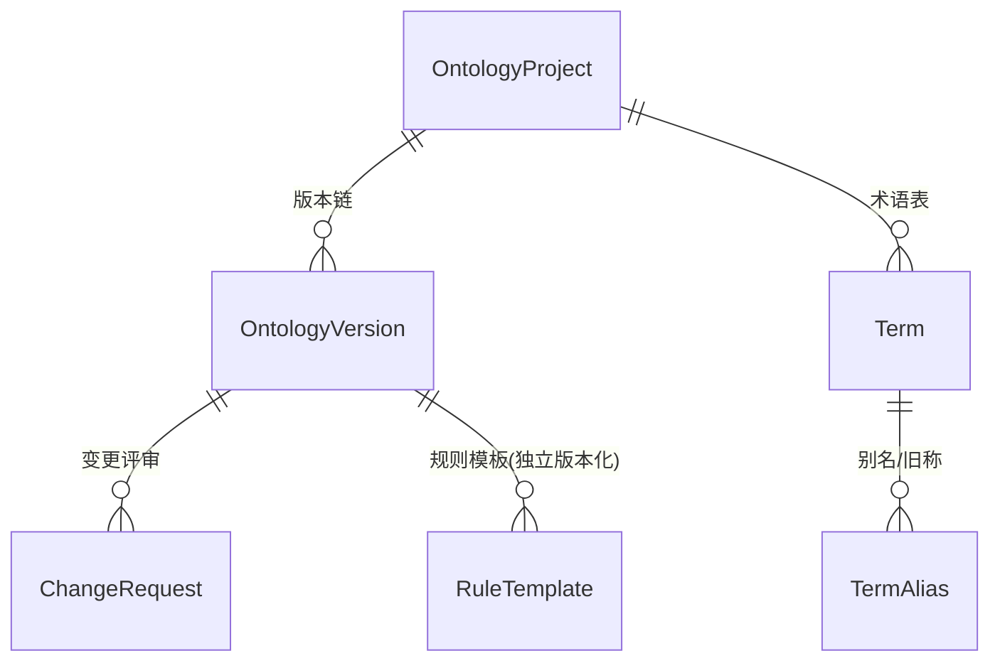
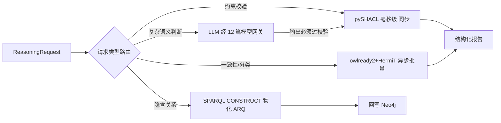

# 07 - 本体核心详细设计（语义层主体）

> 状态：v1.0 待评审 | 日期：2026-09-26 | 上游依据：01 篇 §2.2、研究 03 篇、GB/T 48000.3-2026、《本体智能研究报告 1.0》、《本地建模》五原则
>
> 本体核心是平台灵魂：TBox 建模、OB2/GB48000.3 映射、SHACL 校验、DL 推理、规则物化、术语对齐、版本治理。本篇定其领域模型、映射规范与实现设计。

---

## 1. 定位与边界

**管**：TBox 全生命周期（建模 → 校验 → 版本 → 发布 → 回滚）、推理分级路由、规则模板管理、术语对齐门禁。
**不管**：ABox 业务数据本身（归 Neo4j，由各业务模块经仓储写入，本模块只提供 Schema 约束与物化回写服务）、知识库抽取流水线（归 KB 模块，但抽取的 schema 约束由本模块提供）、记忆（归记忆服务，但 L4 本体知识就存在本模块）。

对外接口（消费方视角）：

| 消费方 | 接口 |
| ---- | ---- |
| REST `/api/v1/ontologies/*` | 前端本体工作台、CI（oa CLI） |
| MCP `ontology.reason/validate/query` | 外部 agent（05 篇 §3.1） |
| 内部 Protocol（Python） | KB 抽取（schema 约束）、记忆 L4、工具集（ActionRef 语义标注）、MCP 网关（resources: TBox 摘要/术语表） |

## 2. 领域模型与状态机

- `OntologyProject`：租户内本体工程（namespace IRI 前缀、默认语言、GB48000.3 领域分类）。
- `OntologyVersion`：不可变快照。状态机 `draft → reviewing（审批中心）→ active → deprecated`；发布后只读，修错走新版本。
- `ChangeRequest`：一次变更集（增/改/删的实体、属性、公理、规则），走审批中心（11 篇五类对象之一），`applied` 时生成新版本快照。
- `Term / TermAlias`：术语登记表，唯一性门禁的数据载体（对齐 04 篇 §8 消歧设计，`terms/term_aliases` 表结构以 04 篇 §9 修订清单为准）。
- `RuleTemplate`：**独立版本化的规则资源**（宪法：规则与对象解耦）——SPARQL CONSTRUCT 模板或 SHACL shape 引用，带优先级与调度策略。

## 3. OB2 / GB48000.3 → RDF 映射规范（核心表）

`semantic/modeling` 维护 Python 元数据模型（pydantic），与 RDF 双向无损转换；Turtle 是唯一持久真相，Python 模型是视图。

| OB2 要素 | GB48000.3 元数据 | RDF 落点 | 备注 |
| ---- | ---- | ---- | ---- |
| 对象 | 实体类型 8 项：IRI/Name/Label/Definition/属性集/SubclassOf/HasSubclass/EquivalentClass | `owl:Class`；`rdfs:label`（含语言标签）、`skos:definition`、`rdfs:subClassOf`、`owl:equivalentClass` | HasSubclass 由 SubclassOf 反推，不入库避免双向冗余 |
| 属性 | 属性 10 项：IRI/Name/Label/Definition/Domain/Range/TypeOfTerms/… | `owl:ObjectProperty` / `owl:DatatypeProperty`；`rdfs:domain/rdfs:range`；TypeOfTerms → 术语关联注解 | 数值/时间类 Range 附单位注解 `qudt:unit` |
| 行为 | 行动类：前置条件/状态流转/执行体 | 行动类 = `owl:Class`（`oa:Action` 子类），对象经 `oa:describesAction` 关联；前置条件 = SHACL property shape 或 SPARQL ASK 模板；状态流转 = 对象状态属性（`oa:hasState`）的值域图 | 行动类是 `action.invoke` MCP 工具与工具注册中心 ActionRef 的锚点（09 篇 §7） |
| 规则 | 独立资源 | `sh:NodeShape`（约束）或 SPARQL CONSTRUCT 模板（推导），独立 IRI + 独立版本 | 不嵌在类定义里；变更独立走 ChangeRequest |

**映射门禁**：双向转换必须通过 round-trip 测试（Turtle → 模型 → Turtle 逐 triple 等值）；GB48000.3 元数据表单（M2 前端）由 Python 模型直接生成 JSON Schema，前后端不另立字段清单。

## 4. 存储落地（细化 ADR-5）

- **TBox**：MinIO `tbox/{tenant}/{project}/{version}.ttl`（唯一持久真相）+ PG 注册元数据（`ontologies`、`ontology_versions`：id/project/version/status/minio_key/compat_level/created_by）+ rdflib 内存图服务（按 `(project, version)` LRU 缓存，容量按项目数配额，未命中回源 MinIO）。
- **ABox**：Neo4j。TBox 经 n10s 导入为节点类型约束；实例节点强制带 `ontology_version` 属性（04 篇兼容分级的前提）。ABox 写入前必须过本模块 `validate_against_tbox`（类型/属性白名单）。
- **物化回写**：SPARQL CONSTRUCT 产物 → n10s 批量写回属性图，写入带 `derived_by`（rule_template IRI + 版本）与 `derived_at`；重跑先删同 `derived_by` 旧边（幂等）。
- **术语表**：PG（对齐 04 篇 §9），本模块提供 `align/gate` 接口。

## 5. 推理分级路由器（宪法第 2 条代码落点）

- 路由是**显式白名单表**（请求 kind → 执行器），不是 LLM 判断——确定性优先。
- LLM 分支（仅低频复杂语义判断）：输出一律视为候选，过 SHACL/规则校验后才采纳，否则丢弃并记录（宪法第 2/3 条双落点）。
- DL 推理降级：单次推理超时 30s 即中止并告警（00 篇风险登记），返回"推理超时"结构化错误，不阻塞校验主流程。

## 6. 规则引擎 v1 细化（ADR-6 落地）

- `RuleTemplate` 字段：`iri / version / kind(construct|shape) / body_sparql / priority / schedule(on_change|nightly|manual) / status`。
- 调度：`on_change` 在 ChangeRequest applied 后增量执行受影响规则；`nightly` 并入 04 篇维护例程；全量物化支持断点续跑。
- 引擎可替换：语义层只暴露 `RuleEngine` Protocol（`materialize(graph, rules) -> delta`），v1 实现 = rdflib；外挂 Jena/GraphDB 是 v2 的另一个实现（00 篇风险对策）。

## 7. SHACL 校验服务

- shapes 图组装：项目 shapes + 行动类前置条件 shapes + 规则生成的 shapes，按版本拼装，缓存键 `(project, version, shape_set_hash)`。
- 报告结构化：`violations[]`（focusNode/path/message/severity/sourceShape），HTTP 层映射 4xxx 错误段（01 篇 §4：校验失败返回结构化报告，不吞成 500）；MCP 层作为 `ontology.validate` 结果体返回。
- 用途三处：TBox 发布门禁、ABox 写入门禁（n10s 前置）、LLM 产出门禁（§5）。

## 8. 术语对齐

- **入库门禁**（同步，毫秒级）：新术语先查 `terms` 精确匹配（含 alias），命中即拒绝并返回已有 IRI——保证"一义一词"。
- **近义合并候选**（异步）：新术语与既有术语做嵌入相似度 + 编辑距离双通道，阈值沿用 04 篇 §8（0.92/0.80），产出合并候选进审批中心。
- 旧称/别名永远保留为 `TermAlias`（04 篇"旧称也是 alias"），检索时可召回。

## 9. 版本与治理

- **快照与 diff**：ChangeRequest applied → 新 Turtle 快照写 MinIO + 结构化 diff（新增/删除/修改 triple 分组）存 PG（供前端 diff 视图与审批材料）。
- **兼容分级**：PATCH（改 label/注释）/ MINOR（增类/属性，不破坏既有实例）/ MAJOR（删改、Range 收紧）——判定规则与影响面迁移流程沿用 04 篇版本兼容设计；MAJOR 强制走影响面报告 + 审批。
- **回滚**：激活历史版本快照 = 生成指向旧快照的新版本（保持版本链单调，不物理回退），ABox 按 `ontology_version` 戳做迁移或双读过渡。
- **发布门禁**：SHACL 全量校验通过 + DL 一致性通过 + 术语唯一性通过，三者全绿才可 `active`。

## 10. 对外接口摘要

| 接口 | 内容 | 详见 |
| ---- | ---- | ---- |
| REST | `ontologies` 模块端点（项目/版本/diff/validate/publish/术语） | 13 篇 |
| MCP | `ontology.reason/validate/query` + resources（TBox 摘要、术语表） | 05 篇 §3.1、09 篇 |
| 内部 Protocol | `TBoxReader/Validator/RuleEngine/TerminologyGate` 四接口 | 本篇 §4~8 |

## 11. 测试与验收

- round-trip 映射测试、GB48000.3 元数据表单合规样例（用国标示例数据）；
- 推理分级：SHACL 校验 P95 < 50ms（1 万 triple 图）；HermiT 1 千类 TBox 一致性 < 60s；
- 验收场景：OB2 三要素各建一样例 → 行动类绑定 MCP 工具 → 规则物化产出隐含关系 → MAJOR 变更触发影响面审批 → 回滚演练（对应 00 篇 M2 里程碑验收）。
