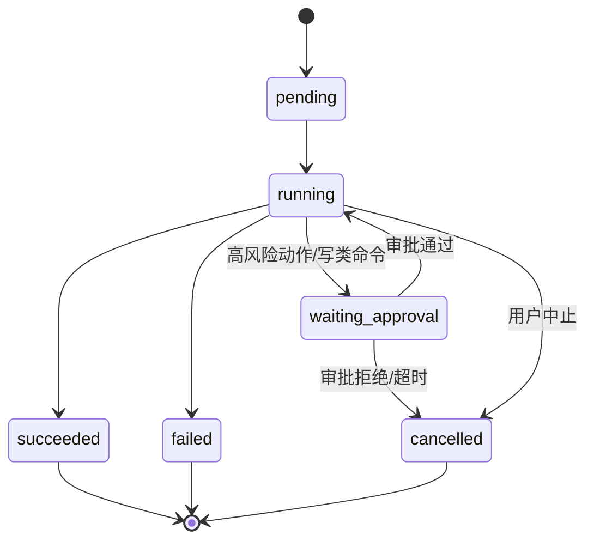
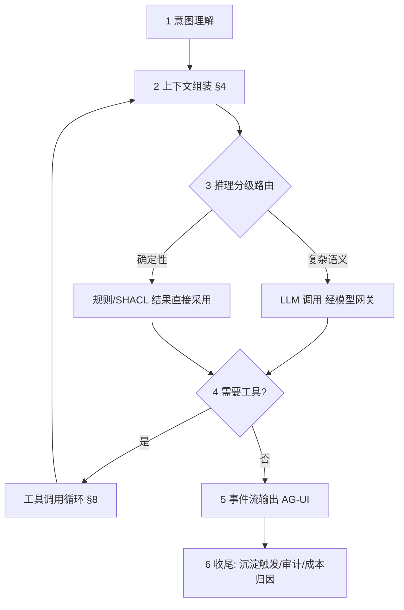

# 08 - Agent 运行时与会话协议设计

> 状态：v1.0 待评审 | 日期：2026-09-26 | 上游依据：01 篇 §2.1、研究 01/02 篇、00 篇 ADR-8
>
> 定稿四件事：会话/任务状态机、agent loop 六阶段与上下文组装预算、AG-UI 事件协议全集、外部 AgentSlot 统一协议。

---

## 1. 定位与边界

**管**：平台原生 agent 运行时（loop、上下文、工具循环、事件流）、外部 agent 托管插槽的统一适配、会话与任务生命周期。
**不管**：LLM 接入与成本（12 篇模型网关）、工具元数据与检索（09 篇工具集）、记忆的存储与沉淀管线（06 篇，本模块只做召回调用与触发）、审批的裁决（11 篇，本模块只做挂起与恢复）。

## 2. 领域模型与状态机

- `Session`：一次多轮对话。持有：参与者、agent 配置（模型/插槽/工具集授权）、上下文窗口引用（L1 工作记忆 + compaction 树）。
- `Task`：一次可观测的执行单元（一轮问答 / 一次行动）。状态机（全平台行动类任务共用）：

- `AgentSlot`：托管插槽配置（kind：`native / pi / nanobot / openclaw / claude-sdk`，连接参数，启停状态）；kind 对应适配器见 §6。
- `Message`：role（user/assistant/tool/system）+ 内容 + 事件引用；消息落 PG 会话日志（L1 载体，06 篇）。

## 3. Agent Loop（原生运行时六阶段）

- **终止条件**：答案产出、最大步数（默认 15，租户可调）、token 预算耗尽、用户中止。每步产出 AG-UI 事件，SSE 即时下发。
- LLM 输出中的结构化主张（实体/关系）视为候选——只进候选区（宪法第 3 条），不直接写图谱。

## 4. 上下文组装管线（预算制）

| 区 | 预算占比（默认，租户可调） | 内容来源 |
| ---- | ---- | ---- |
| 系统与安全约束 | 10% | 平台系统提示 + 输出边界声明 |
| 工具 schema | ≤15% | 工具集服务**摘要级**按需取（09 篇 Tool Search 两级分发） |
| 记忆 | 20% | L1 全量 + L2/L3 并行召回合并（06 篇四层召回） |
| 知识/图谱 | 30% | GraphRAG local/global/DRIFT 按问题路由（04 篇 §7 六路召回 RRF），附证据路径 |
| 历史对话 | 20% | 最近 N 轮原文 + 更早 compaction 摘要（§7） |
| 余量缓冲 | 5% | 防截断 |

- 组装顺序固定（约束 → 工具 → 记忆 → 知识 → 历史），每区超预算时按区内相关度截断，**知识区截断必须保留出处指针**（宪法第 5 条）。
- 行动类任务额外注入 SHACL 边界（该行动类的前置条件与状态流转摘要，来自 07 篇 §7）——"带着约束去决策"。

## 5. AG-UI 事件协议（ADR-8 落地全集）

传输：`GET /api/v1/sessions/{id}/events`（SSE）。帧格式：`event: <type>` + `data: <json>`；`data` 统一信封：`{"taskId", "seq", "ts", "payload"}`，`seq` 会话内单调递增（断线重连 `Last-Event-ID` 续传，网关从 Redis 会话事件流补发）。

| # | 事件 | payload 要点 |
| ---- | ---- | ---- |
| 1 | `RUN_STARTED` | taskId、agent 配置摘要 |
| 2 | `RUN_FINISHED` | 终态、用量（token/成本/步数） |
| 3 | `RUN_ERROR` | 错误码（13 篇 3xxx）、可重试标志 |
| 4 | `TEXT_MESSAGE_START` | messageId、role |
| 5 | `TEXT_MESSAGE_CONTENT` | 增量 delta（流式） |
| 6 | `TEXT_MESSAGE_END` | — |
| 7 | `THINKING_START` / `THINKING_CONTENT` / `THINKING_END` | 推理摘要流（默认脱敏开关，租户可关） |
| 8 | `TOOL_CALL_START` | toolName、callId、语义标注摘要（ActionRef） |
| 9 | `TOOL_CALL_ARGS` | 参数 JSON（增量） |
| 10 | `TOOL_CALL_END` | — |
| 11 | `TOOL_CALL_RESULT` | 结果摘要、审批状态（若挂起） |
| 12 | `STATE_SNAPSHOT` | 会话状态全量（结构化业务字段） |
| 13 | `STATE_DELTA` | JSON Patch 增量 |
| 14 | `APPROVAL_REQUIRED` | approvalId、审批对象摘要（waiting_approval 联动 11 篇） |
| 15 | `CUSTOM` | 平台扩展（保留） |
| 16 | `MESSAGES_SNAPSHOT` | 全量消息快照（重连对账用） |

> 事件语义以 AG-UI 协议为蓝本裁剪扩展（新增 `APPROVAL_REQUIRED`），与 01 篇 §2.1 "16 事件"对应。前端 openapi-typescript 类型 + SSE 客户端统一封装（03 篇）。

## 6. AgentSlot 统一协议与适配器

统一接口：`run(task: Task, context: ContextBundle) -> EventStream[AGUIEvent]`；适配器把各异构事件归一化为 §5 事件集：

| kind | 传输 | 归一化要点 | 状态 |
| ---- | ---- | ---- | ---- |
| `native` | 进程内 | 原生即本协议 | M4 |
| `pi` | RPC + JSON 流 | 工具调用事件映射 `TOOL_CALL_*`；JSONL 树复用作 compaction | M4 |
| `nanobot` | OpenAI 兼容 API | chunk → `TEXT_MESSAGE_CONTENT`；function call → `TOOL_CALL_*` | M4 |
| `openclaw` | 容器化网关 | 整网关部署于沙箱网（14 篇），事件经网关转发 | M5 |
| `claude-sdk` | Agent SDK | 专有条款与计费：法务确认前默认**停用**（00 篇风险登记），启停为租户级开关 | 默认停 |

外部插槽收到的平台能力统一经工具集注入（不直连存储）；插槽自身注册为工具提供方（09 篇 §3）。

## 7. 上下文压缩（compaction）

- 触发：历史区占用 > 阈值（默认 85% 预算）。
- 策略：保留最近 N 轮（默认 3）原文 + 更早内容生成结构化摘要（决策/实体/未决问题三段式），摘要带出处指针回链原始消息（宪法第 5 条）。
- 结构：会话维护 compaction 树（参考 pi 的 JSONL 树），分支可回溯——用户改写问题时可从历史分叉恢复，不做物理截断。

## 8. 工具调用循环与审批挂起

- schema 获取：循环内工具 schema 两级取（摘要级常驻 → 命中后取全 schema，09 篇 §4），防上下文爆炸。
- 并行策略：只读工具可并行（声明依据是平台侧 scope 标注，**不是** MCP annotations——05 篇铁律 5）；写类工具串行。
- 审批挂起：工具调用被 PDP 判定需审批（11 篇）→ Task 转 `waiting_approval` → 发 `APPROVAL_REQUIRED` 事件 → 审批中心裁决 → `approved` 后从挂起点恢复（工具调用与参数已持久化，恢复不重放 LLM）。

## 9. 与平台的集成点

| 集成 | 方式 |
| ---- | ---- |
| 记忆 | 组装期调用四层召回；会话结束发 `memory.settle` 事件触发沉淀管线（06 篇），产出进候选区 |
| 知识库 | 检索路由 local/global/DRIFT（04 篇），回答附证据路径事件（`CUSTOM`） |
| 审批 | `APPROVAL_REQUIRED` ↔ 审批中心（11 篇），前端审批中心页处理 |
| 模型网关 | 全部 LLM 调用经 12 篇（成本记账带 session/task 归因） |
| 审计 | 任务终态 + 工具调用全量留痕（11 篇） |

## 10. 端点

`POST /api/v1/sessions`、`POST /api/v1/sessions/{id}/messages`（触发一轮 Task）、`GET /api/v1/sessions/{id}/events`（SSE）、`POST /api/v1/tasks/{id}/cancel`、`GET /api/v1/tasks/{id}`——完整契约见 13 篇。

## 11. 测试与验收

- 事件流：断线重连续传（Last-Event-ID）、`seq` 单调性、16 事件 schema 校验；
- 挂起恢复：高风险工具挂起 → 审批 → 恢复 → 回流审计全链路；
- 验收场景（00 篇 M4）：对话中可见工具调用与证据链；会话结束产生 L2 候选记忆；插槽归一化测试（pi/nanobot 各一条真实任务回放）。
