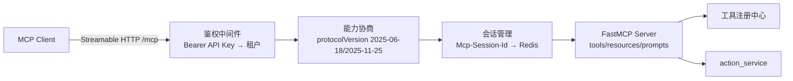
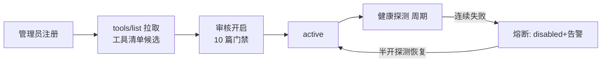
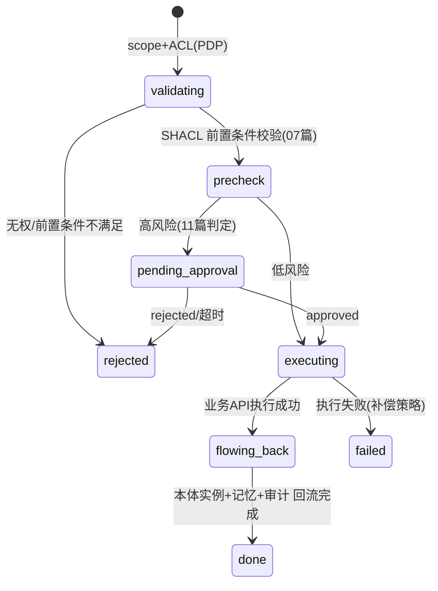

# 09 - MCP 网关与工具集详细设计

> 状态：v1.0 待评审 | 日期：2026-09-26 | 上游依据：05 篇 §3（协议规范）、研究 05/06 篇
>
> 05 篇定协议与边界，本篇定模块内部实现：MCP 端点实现、工具注册中心元数据模型、Tool Search 两级分发、外部 MCP Host、业务 API 适配、`action.invoke` 行动闭环状态机。

---

## 1. 定位与边界

**MCP 网关**（网关层 `mcp_endpoint` + 应用层 `action_service`）：平台 MCP Server 出口的运行实现、外部 MCP Server 接入托管、业务动作执行与回流。
**工具集服务**：全平台工具的**统一注册中心**——四类提供方（内置 core-* / 外部 MCP / REST 适配 / CLI-harness）同表登记、schema 分发、调用观测。

**不管**：插件的上架审核与沙箱（10 篇）、协议格式本身（05 篇）、审批裁决（11 篇）。外部 MCP 插件经 10 篇审核上架后，其运行时托管与工具登记落在本模块。

## 2. mcp_endpoint 实现



- **挂载**：FastMCP app 以 ASGI 方式挂到 FastAPI `/mcp`，复用网关中间件链（请求 ID、审计、限流）；MCP 鉴权独立于 JWT——只认 IAM 签发的 API Key（11 篇），scope 即授权边界。
- **会话**：`Mcp-Session-Id` → Redis（TTL 30min 滑动）；客户端断线重连凭会话头恢复，无状态副作用不丢。
- **能力协商**：按客户端声明版本返回；客户端声明高于平台支持版本时按平台最新版协商（向后兼容原则）；Tasks（2026-07-28 扩展）不强依赖，`action.invoke` 长任务用平台自身任务模型（08 篇 Task）+ SSE 替代。
- **stdio 模式**：单机/CI 场景 `oa mcp serve --stdio` 本地起（走同注册中心，鉴权用本机 profile 的 API Key）——`oa` CLI 的运维子命令之一（05 篇 §4.1）。
- **管理面禁入**：网关白名单只挂 `knowledge.* ontology.* memory.* action.*` 与 resources/prompts（05 篇铁律 3），路由表代码级固化，新增管理工具必须改白名单 + 评审。

## 3. 工具注册中心：ToolDef 元数据模型

四类提供方同表（06 篇研究结论的平台落点）：

| 字段组 | 字段 | 说明 |
| ---- | ---- | ---- |
| 标识 | `tool_iri`（平台唯一）、`name`（`域.动作`，跨协议一致——ADR-9 单一事实源）、`provider_type`（core/mcp/rest/cli）、`provider_id` | cli 类 name = `cli.<hub名>.<run\|help>`（05 篇 §6.2） |
| 描述 | `description`、`summary`（≤120 字，摘要级下发用） | 投毒检测对象（10 篇门禁） |
| 契约 | `input_schema / output_schema`（JSON Schema）、`annotations`（**不可信区**，仅 UI 提示） | 05 篇铁律 5 |
| 语义标注 | `action_ref`（本体行动类 IRI，07 篇 §3）、`trigger_rules`、`data_class`（公开/内部/敏感） | 平台区别于裸工具堆的字段；core 与 rest 类必填，mcp/cli 类审核时补标 |
| 授权 | `scopes[]`（调用所需权限）、`visibility`（租户/角色/agent 维度） | PDP 判定输入（11 篇） |
| 状态 | `status`：`candidate → active → disabled / deprecated`、`health`（最近探测结果） | candidate 不可被 agent 检索到 |
| 观测 | 调用统计（次数/成功率/P95 延迟/成本），反哺市场排序 | 10 篇 |

`ToolBinding`：提供方连接信息（MCP endpoint/凭据引用、REST 域名、CLI harness 执行器参数），凭据只存引用（11 篇密钥管理）。

## 4. Tool Search：两级 schema 分发

- **摘要级**：`name + summary + scopes` 全量（授权可见范围内）注入 system 区（08 篇预算表 15%），1k~2k token 封顶；超限按观测分排序截断。
- **全 schema 级**：agent 决定用某工具时经 `tools.resolve(name)` 取全 schema（平台内调用，不经 LLM 上下文反复传输）。
- 检索辅助：`tools.search(关键词/语义)` = Milvus 向量 + 关键词混合（复用 04 篇混合检索设施），供 agent 与 `oa tool search` 使用。
- 缓存：schema 按 `(tool_iri, version)` 缓存（Redis），工具升级即失效。

## 5. MCP Host：外部 MCP Server 接入



- 治理：外部工具注册进中心时 `status=candidate`，审核通过才对 agent 可见；可见性按租户/角色/agent 三维授权。
- 失败隔离：熔断期间 agent 检索不到该工具（不是调用时报错）——不阻塞主流程；恢复半开探测自动回切。
- 凭据托管：外部 server 的鉴权凭据加密存储（11 篇），运行时注入。
- 转发禁令：外部工具不再被平台作为 MCP server 二次暴露（05 篇 §3.2 边界）。

## 6. 业务 API 适配管线（OpenAPI → 工具）

```
导入 OpenAPI 3.x → 解析 operation → 逐 operation 生成工具候选(candidate)
  → 参数/响应 schema 规范化 → 人工语义标注(action_ref/data_class/scopes)
  → 审批(高风险类目) → active 注册
```

- 适配器职责：鉴权注入（凭据引用）、参数映射、重试与超时策略（按 operation 配置）。
- 默认全部 `candidate`：没有语义标注的业务工具不允许 active（语义标注是行动闭环的锚点，缺了就无法回流）。

## 7. `action.invoke` 行动闭环状态机



- **回流是 done 的必要条件**：执行成功但回流失败 → 任务置 `degraded` 并进重试队列（Outbox 同款思路），不允许"业务已改、本体不知"。
- 失败补偿：按业务适配器的补偿配置（逆操作或人工工单），补偿动作同样过审批。
- 全程留痕：参数摘要、SHACL 前置结果、审批单、执行响应、回流凭证，一次 `action.invoke` 一条审计链（11 篇）。

## 8. 观测与限流

- 限流：Redis 令牌桶，键 `tenant × tool`，配额管理台可调；MCP 与 REST 同一配额池（同一能力同一预算）。
- 观测：调用记录写 PG（分区），聚合指标出日/时报表；`core-*` 工具同样被观测（自用也要可归因）。

## 9. 测试与验收

- 协议兼容：官方 MCP inspector 跑通 tools/resources/prompts；2025-06-18 与 2025-11-25 两版客户端协商回归；
- 熔断演练：kill 外部 server → 工具自动不可见 → 恢复回切；
- 闭环验收（00 篇 M5）：外部 Claude/pi 经 MCP 调通 `knowledge.search` 与 `ontology.validate`；一个 OpenAPI 导入业务 API 走完 candidate → 标注 → 审批 → 调用 → 回流全链路。
