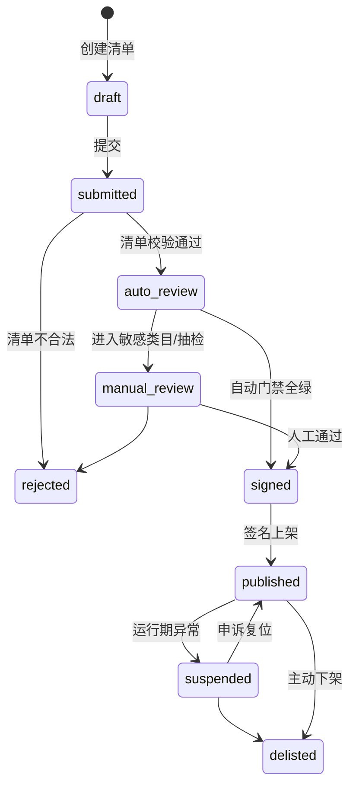
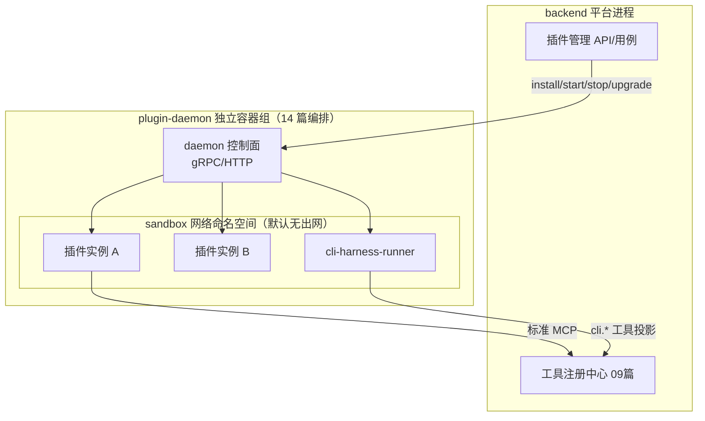

# 10 - 插件运行时与技能市场详细设计

> 状态：v1.0 待评审 | 日期：2026-09-26 | 上游依据：05 篇 §5/§6（边界与 CLI-Anything）、06 篇研究、Dify plugin-daemon 模式
>
> 05 篇定"内置 vs 外置"边界判定与三轨资产形态，本篇定实现：清单 schema、签名、plugin-daemon、沙箱、审核流水线、市场 API、Skills 服务、CLI-harness runner。

---

## 1. 定位与边界

**管**：插件（外置）从提交到下架的全生命周期、插件运行时隔离、技能（SKILL.md）资产库、市场前端支撑。
**不管**：插件注册为工具后的调用与观测（09 篇工具集）、MCP 协议实现（09 篇）、内置 core-* 的业务实现（各自模块，本篇只定其寄居方式 §11）。

## 2. 领域模型与状态机

`Plugin / PluginVersion / ReviewRecord / Scope`（领域层 `plugin/ marketplace/`）：



- `PluginVersion` 不可变；升级 = 新版本重新走状态机（自动门禁可增量）。
- `Scope`：声明式权限（资源:动作，对齐 11 篇 Permission 词汇表），安装时用户确认，运行时 PDP 按此裁剪。

## 3. server.json 平台扩展 schema

对齐官方 MCP Registry `server.json` 并做平台扩展（未来可互操作）：

```json
{
  "$schema": "https://cdn.ontology-agent.dev/schemas/plugin-manifest-v1.json",
  "name": "example/connector",
  "displayName": "示例连接器",
  "description": "…",
  "version": "1.2.0",
  "transport": { "type": "streamable-http", "url": "https://…", "headers": {} },
  "compat": { "mcpProtocolVersions": ["2025-06-18", "2025-11-25"], "platform": ">=1.0" },
  "x-oa": {
    "track": "mcp",                          // mcp | rest | cli-harness（05 篇三轨）
    "category": "connector",                 // connector | tool-suite | skill-pack | cli-harness
    "sensitivity": "normal",                 // normal | sensitive（进人工审核）
    "scopes": ["kb:read", "memory:read"],
    "dataClass": "internal",                 // 公开|内部|敏感
    "network": { "egress": ["api.example.com:443"] },   // 出网白名单，缺省=全拒
    "rest": { "openapiUrl": "…/openapi.json" },          // track=rest
    "cliHarness": {                          // track=cli-harness（05 篇 §6）
      "hubName": "obsidian", "entry": "cli-hub launch obsidian",
      "commandClass": { "default": "write", "overrides": { "search*": "read" } },
      "skillRefs": ["skills/obsidian.md"]
    },
    "skillRefs": [],                         // 附属 SKILL.md 资产（同步进 Skills 库）
    "publisher": { "id": "…", "keyId": "…" }
  }
}
```

校验：JSON Schema 严格模式（未知字段拒绝）；`track` 决定门禁分支。

## 4. 签名机制

- 算法：Ed25519。两级签名：**发布者签名**（manifest 摘要 + 包摘要）→ **平台签**（审核通过后对"发布者签名 + 清单"再签，即认证背书）。
- 验签时机：安装时、每次启动时（plugin-daemon 验证后才拉起进程）；验签失败 → 拒启 + 告警 + 状态置 `suspended`。
- 密钥轮换：publisher keyId 支持多钥并存，轮换窗口期内旧钥验签仍通过。

## 5. plugin-daemon 架构与生命周期



- 生命周期：`install（验签→落盘 MinIO 包仓库）→ provision（建沙箱配置/注入 secrets）→ start / stop → upgrade（蓝替：新版本起 → 健康检查过 → 切工具注册指向 → 旧版停）→ uninstall（回收沙箱与工具注册）`。
- 健康：插件进程心跳（30s），连续 3 次缺失 → 自动 stop + `suspended` + 工单；工具调用熔断由 09 篇 MCP Host 同款机制兜底。
- 与平台通信：插件只经标准 MCP（或 rest/cli 轨道适配层）对外提供能力，**无**平台内部接口可调——内核零信任插件（05 篇铁律 4）。

## 6. 沙箱规范

| 维度 | v1 基线 | 升级位 |
| ---- | ---- | ---- |
| 计算 | Docker 容器 + cgroups 配额（默认 CPU 2 / 内存 2GB，05 篇默认配置） | gVisor（`sensitivity=sensitive` 类目强制） |
| 网络 | sandbox 网默认无出网；白名单经专用 egress 代理（域名:端口逐条声明，即 manifest `network.egress`） | 出网全审计日志 |
| 文件 | 每实例独立 workspace 卷；根文件系统只读 | 敏感类目加密卷 |
| secrets | daemon 启动时 env 注入，不落盘、不进日志 | KMS 集成 |
| 观测 | 实例级资源/网络/重启计数指标（14 篇告警） | — |

## 7. 审核流水线实现（05/06 篇五步落点）

| 步骤 | 检查项 | 实现 |
| ---- | ---- | ---- |
| 清单校验 | JSON Schema、版本语义化、transport 可达性、compat 区间与平台网关匹配 | ARQ 任务，秒级 |
| 自动门禁 | schema 合法性；静态扫描（bandit/semgrep 规则集）；**工具描述投毒检测**（description/schema 与实际行为一致性：LLM 审查 + 已知投毒模式规则库双轨）；依赖审计（pip-audit/npm audit） | ARQ 流水线，分钟级；任一红项即 rejected |
| 人工审核 | `sensitivity=sensitive`（涉数据出境、金融、系统管理类）或自动门禁低置信抽检（10%） | 审批中心（11 篇插件上架对象），审核要点 checklist |
| 签名 | §4 两级签 | daemon 发布服务 |
| 运行期监测 | 行为基线（出网目标/调用量/资源）偏离 → 自动 `suspended` + 工单；市场评分与故障率反馈 | 事件订阅（12 篇事件总线） |

## 8. 市场 API 与前端

- API：市场浏览/搜索/详情（13 篇 `plugins-marketplace` 端点组）+ 安装/启停/升级/卸载（`oa plugin` 同源）。
- 前端（03 篇插件市场页）：市场列表/详情/我的安装三视图；审批状态对开发者以"提交记录"视图呈现。
- 观测分排序：成功率、调用趋势、故障率（09 篇观测数据）进市场卡片。

## 9. Skills 服务（程序记忆版本库）

- 模型：`Skill / SkillVersion`；SKILL.md 为格式标准（agentskills.io 兼容：frontmatter `name / description / version / compatibility`，正文渐进式披露）。
- 来源三处：插件附属（manifest `skillRefs`，随插件签名）、独立上传（走同一审核链）、CLI-harness 提取（05 篇 §6.2）。
- 分发：按 agent 配置授权注入（08 篇上下文组装"技能区"，与工具摘要同预算池）；检索 = 向量 + 标签。
- 与记忆打通：Skill 即程序记忆（06 篇），检索命中即注入；会话中验证有效的使用片段可提候选技能（候选非成品）。

## 10. cli-harness-runner（细化 05 篇 §6）

- 定位：daemon 内**通用执行器**，非 CLI-Anything 专用——任何 `track=cli-harness` 插件复用。
- 执行流程：`解析命令 → 命令分类匹配（manifest commandClass，default 兜底）→ read 直行 / write|dangerous 提交审批（05 篇默认从严）→ 沙箱内执行（超时 120s/并发 4/输出强制 JSON/超 64KB 截断标记）→ 结果归一化 → 审计`。
- 工具投影：`cli.<hub名>.run{command, args}` + `cli.<hub名>.help{}`；SKILL.md 全文经 Skills 库按需注入（不塞 schema）。
- workspace 隔离：每 harness 独立子目录、禁符号链接逃逸；上游加固方向（如 CLI-Anything #304）由 runner 的路径规范化统一兜底，不依赖单个上游的自觉。

## 11. 内置 core-* 插件的寄居方式

- core-knowledge/ontology/memory/action：`provider_type=core`，进程内实现，同一张 ToolDef 注册表、同样带语义标注与 scopes——**对 agent 视角与外置插件无差别**（05 篇 §5.2）。
- 差异仅在：免签名免市场流程、随平台发版、不可卸载（可按租户停用）；`Plugin` 表中以 `builtin` 标记存在，用于统一管理界面展示。

## 12. 测试与验收

- 签名链：篡改 manifest 任一字节 → 启动拒绝；
- 沙箱逃逸演练：出网白名单外目标全拒、文件越界全拒、资源超限被杀且不影响邻插件；
- 投毒门禁：构造 description 与行为不一致样例库（≥20 例），双轨检测召回率验收；
- CLI-harness 全链路（00 篇 M5）：装一个 hub CLI → 命令分类 → write 命令走审批 → JSON 结果回流 → SKILL.md 注入生效；
- 蓝替升级：插件升级期间工具调用零失败（新版本健康后才切流）。
