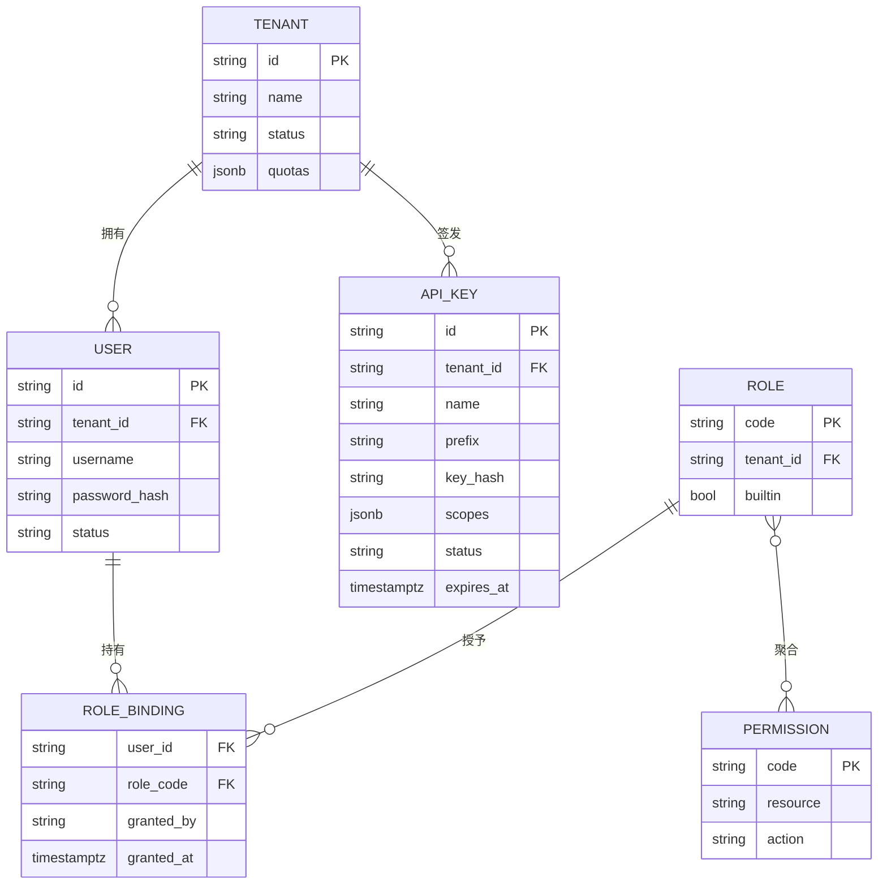
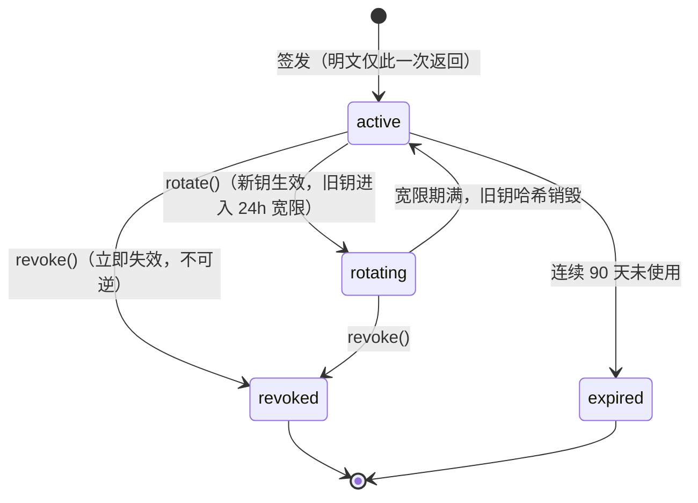
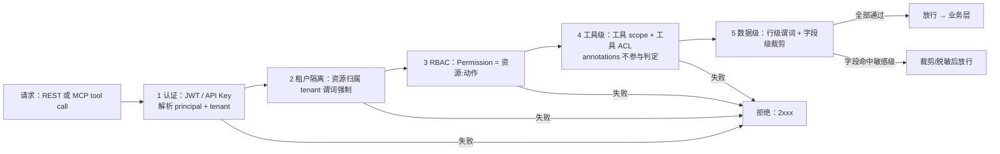
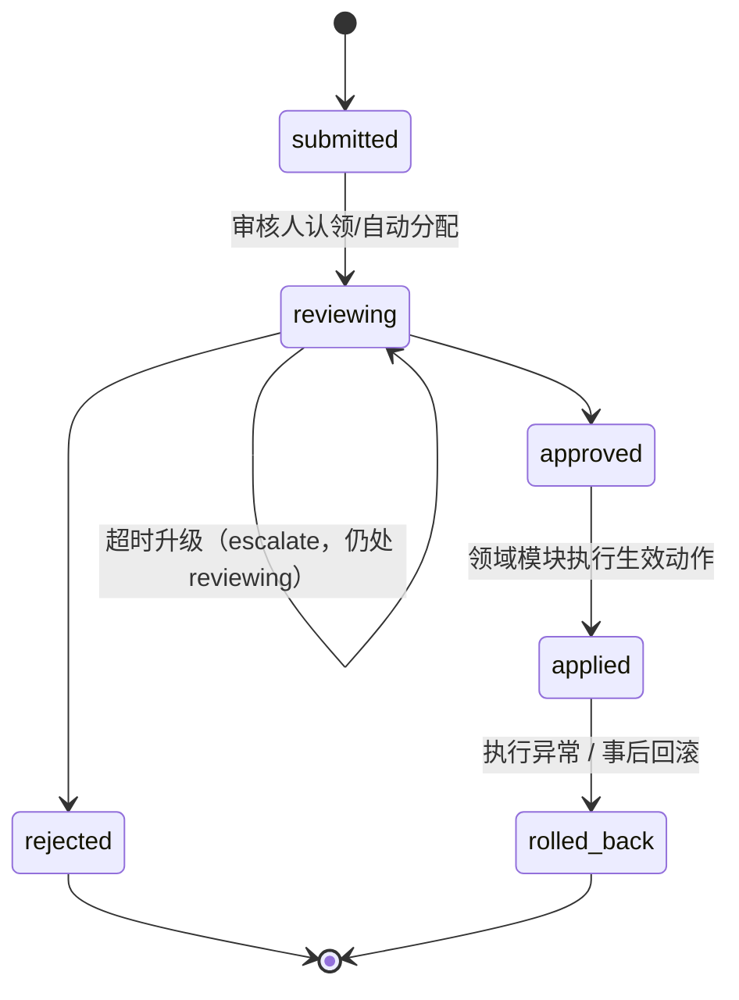

# 11 - IAM、审批与安全设计

> 状态：v1.0 待评审 | 日期：2026-09-26 | 上游依据：01 篇 §2.7、05 篇、研究 05/06 篇安全要求
>
> 定稿四块横切模块（IAM / 审批中心 / 审计 / 通知）的领域模型与协作，以及集中式授权判定（PDP）、五类审批对象、威胁模型与凭据管理。

---

## 1. 模块定位与边界

| 模块 | 职责 | 明确不做 |
| ---- | ---- | ---- |
| IAM | 租户隔离、用户/角色/权限（RBAC）、API Key 签发校验、集中授权判定策略（PDP） | 不做行级/字段级规则本身（各领域模块声明规则，PDP 只执行）；不做插件沙箱（插件运行时职责，05 篇）；不做审计存储 |
| 审批中心 | 统一审批状态机、待办分发、超时升级，复用于五类对象（§6） | 不做专业审核能力（SHACL 校验/插件扫描门禁在各域完成后只送结论）；不做生效执行（applied 由各领域模块执行） |
| 审计 | AuditEvent 采集（双来源）、存储、查询/导出 | 不做告警规则引擎（异常检测 v2）；不做运行日志（结构化日志归 foundation/logging） |
| 通知 | 审批待办、任务完成、异常事件的站内信（PG + Redis 推送，01 篇 §2.7） | 不做渠道集成（企业微信/钉钉/飞书 v2）；v1 用固定模板，不做模板引擎 |

## 2. 领域模型

链路：`Tenant → User → RoleBinding → Role → Permission`；Permission = `资源:动作`（如 `ontology:write`、`memory:L3:read`、`kb:candidate:review`）；API Key 为租户级服务凭据，scope 是其权限子集（不超过签发者权限）。

- Permission 全局字典（只读，`GET /api/v1/permissions`）；角色分内置五枚（§3，随版本迁移）+ 租户自定义角色。
- RoleBinding 变更走审计快照（谁在何时把什么角色授给了谁）。
- ApiKey 归属租户而非个人，签发者权限是 scope 上限；scope 用 Permission 码的子集表达。

## 3. 角色 × 权限矩阵（内置五角色）

| 资源:动作 | 租户管理员 | 知识工程师 | 业务用户 | 审计员 | 服务账号（API Key） |
| ---- | ---- | ---- | ---- | ---- | ---- |
| tenant:manage / user:manage | ✅ | ❌ | ❌ | ❌ | ❌ |
| apikey:manage | ✅ | ❌ | ❌ | ❌ | ——（自身即 Key） |
| ontology:read | ✅ | ✅ | ✅ | ✅ | 按 scope（默认 ✅） |
| ontology:write | ❌ | ✅ | ❌ | ❌ | 按 scope（默认 ❌） |
| ontology:publish / rollback | ❌ | ✅ | ❌ | ❌ | ❌ |
| kb:read / kb:write | ❌ | ✅ | read ✅ / write ❌ | read ✅ | 按 scope（默认 read） |
| kb:candidate:review | ❌ | ✅ | ❌ | ❌ | ❌ |
| memory:read（L1/L2 本人） | ✅ | ✅ | ✅ | ❌ | 按 scope |
| memory:L3:read | ✅ | ✅ | ✅ | ❌ | 按 scope |
| memory:promotion:submit（L2→L3） | ❌ | ✅ | ✅（本人记忆） | ❌ | ❌ |
| session:* / agent:run | ✅ | ✅ | ✅ | ❌ | 按 scope |
| tool:read / tool:call | read ✅ / call ✅ | ✅ | read ✅ / call ✅ | read ✅ | 按 scope |
| tool:manage / openapi-import | ✅ | ✅ | ❌ | ❌ | ❌ |
| plugin:read / install / manage | 全部 | install ✅ / manage ❌ | read + install（市场白名单） | read | ❌ |
| plugin:publish（上架提交） | ✅ | ✅ | ❌ | ❌ | ❌ |
| approval:decide | ✅ | 本域单据 ✅ | ❌ | 只读 | ❌ |
| audit:read / audit:export | read ✅ / export ❌ | ❌ | ❌ | ✅ | ❌ |
| platform:admin（跨租户） | ❌ | ❌ | ❌ | ❌ | ❌（平台管理员独立账号体系） |

原则：管理员不默认获得业务写权限（审计员全只读、不可自我审批）；服务账号一律白名单 scope 起步。

## 4. 认证设计

| 凭据 | 定稿 |
| ---- | ---- |
| SPA JWT | access token 15 min（`Authorization: Bearer`）；refresh token 7 d，httpOnly + Secure + SameSite=Strict cookie 承载，仅 `/api/v1/auth/refresh` 可消费；每次刷新轮换 refresh，旧件立即作废（重放即触发全家吊销） |
| API Key | 前缀 `oa_`，`oa_` + 32 字节随机串；服务端只存 SHA-256 哈希 + 前 8 位明文前缀（列表识别用）；明文仅签发响应返回一次；请求统一走 `Authorization: Bearer oa_...`（MCP 出口同款，05 篇 §3.1） |
| 密码 | Argon2id 哈希；登录失败限速（同账号 5 次/10 min 锁定） |

### 4.1 API Key 生命周期状态机

签发必须绑定 scope 集合与可选 `expires_at`；轮换/吊销走审计；CI 场景建议配 `expires_at ≤ 90d`。

### 4.2 OAuth 2.1 演进位

v1 不做。`foundation/security` 的令牌校验留接口抽象（`TokenVerifier` 协议），后续按 MCP 官方 authorization 规范方向接 OAuth 2.1（05 篇 §7 开放问题已列时点待定）；届时 API Key 保留为机器对机器的低权凭据。

## 5. 授权判定流程（集中式 PDP）

判定逻辑收敛在 `domain/iam/授权判定策略` 一处，**网关 REST 中间件与 MCP 出口（`mcp_endpoint`）共用同一 PDP**（05 篇边界铁律：MCP 不暴露管理面、annotations 不是授权——判定只认平台 scope + ACL）。

| 步 | 判定内容 | 失败错误码 |
| ---- | ---- | ---- |
| 1 认证 | 凭据有效性与 principal 解析 | 2001~2006 |
| 2 租户隔离 | 请求租户 = 资源租户；所有查询强制携带租户谓词 | 2009 |
| 3 RBAC | RoleBinding → Permission 集合，deny 优先 | 2008 |
| 4 工具级 | 目标工具是否在 principal 的工具 ACL 内；MCP 工具另验 `x-ontology` 标注的所需 scope | 2007 |
| 5 数据级 | 行级：owner/部门谓词（记忆 L1/L2 仅本人等）；字段级：敏感字段脱敏/裁剪 | 2008 / 裁剪 |

## 6. 审批中心：一个状态机，五类对象

状态机（01 篇 §2.7 + 04 篇 §4.2）：`submitted → reviewing → approved/rejected → applied/rolled_back`。

### 6.1 五类对象的审核要点

| object_type | 触发来源 | 审核要点 | 生效动作（applied） |
| ---- | ---- | ---- | ---- |
| `ontology_change` | 本体工作台 publish；L3→L4 记忆反哺提名（06 篇 §5.4） | SHACL 报告通过；diff 影响面（ABox 迁移评估）；术语唯一性门禁；GB/T 48000.3 元数据完整 | 新版本 Turtle 快照激活 |
| `memory_promotion` | 沉淀管线 `promotion.submitted`（L2→L3，06 篇 §5.1.1） | 出处必填；mem TBox SHACL 校验；敏感度/隐私判定；置信度与佐证数 | 写 Neo4j L3，驳回退回 L2 不删数据 |
| `plugin_listing` | 插件市场提交（含 CLI-harness 生成物候选区，05 篇 §6.2） | 清单校验结论；静态扫描/投毒检测/依赖审计报告；权限 scope 申请合理性；敏感类目必须人工 | 平台签名 + 上架 |
| `action_confirm` | action_service 规则命中高风险动作；CLI-harness 未分类命令（05 篇 §6.3） | 目标资源与参数摘要；前置条件（本体行动类）校验；租户审批策略匹配 | 执行 MCP 调用并强制回流（本体实例 + 记忆 + 审计） |
| `conflict_ticket` | 知识冲突分诊 T2 且 \|Δscore\| < 0.25（04 篇 §4.2） | 并排展示两事实原文出处与评分明细；人工点选胜者 / 判 T3 限定共存 / 判待定 | 败者封口 + SUPERSEDES 边（该类无回滚语义，状态止于 applied） |

### 6.2 API 端点与超时升级

- 端点（详情见 13 篇）：`GET /api/v1/approvals`、`GET /api/v1/approvals/{id}`、`POST /api/v1/approvals/{id}/approve|reject|rollback`、`GET /api/v1/approvals/{id}/timeline`。提交入口在各领域模块经 `approval_service` 应用服务发起，不设跨域统一 create 端点（防绕过各域前置校验）；人工决策类操作只走 REST（05 篇铁律 3）。
- 超时升级：每类对象配 SLA（建议初值：action_confirm 30 min、memory_promotion 48 h、ontology_change / conflict_ticket 72 h、plugin_listing 5 个工作日）；`reviewing` 超时 → 升级至备用审核人/租户管理员，并经通知服务推送；`action_confirm` 超时**默认拒绝**（fail-closed）。
- 通知联动：`submitted`（待办）、超时升级、终态（approved/rejected/applied/rolled_back）均产生站内信；审批决策写入审计（含 reason）。

## 7. 审计设计

| 项 | 定稿 |
| ---- | ---- |
| AuditEvent schema | `event_id, tenant_id, actor_id, actor_type(user/api_key/agent/system), occurred_at, action, resource_type, resource_iri, before(JSONB), after(JSONB), result(ok/deny), trace_id, source(gateway/domain_event), ip, user_agent` |
| 双来源 | ① 网关审计中间件：全部 HTTP/MCP 请求（方法/路径/状态/耗时，01 篇 §1 middleware）；② 领域事件：业务语义动作经 Outbox 消费投影（状态机流转、审批决策、记忆升级）。两来源以 trace_id 关联（01 篇 §4） |
| 存储 | PG `audit_logs` 按月 RANGE 分区；**append-only**：应用账号仅 INSERT/SELECT，不授 UPDATE/DELETE；在线保留 12 个月后归档 MinIO（保留年限=开放问题） |
| 快照 | 敏感操作（用户/角色/权限/配额/本体发布/插件上架/审批决策/配置变更）必须带 before/after 快照；deny 也留痕（含缺失权限码） |
| MCP tool call | 按 05 篇 §3.1 留痕：调用方/租户/参数摘要/结果状态/耗时，trace_id 贯穿；参数摘要做脱敏（§9） |

## 8. 威胁模型与对策

| 威胁 | 典型场景 | 缓解措施 | 落点模块 |
| ---- | ---- | ---- | ---- |
| prompt injection | 检索内容/工具结果内嵌恶意指令劫持 agent | 指令与数据分区注入并标注来源；工具结果不回灌为系统指令；复杂语义判断的 LLM 输出必过 SHACL/规则校验才采纳；证据链带出处可溯 | Agent 运行时、GraphRAG、语义层 |
| 工具描述投毒 | MCP `tools/list` 或插件清单描述中藏诱导文本 | 上架门禁静态扫描 + LLM 审查双轨（00 篇风险登记）；外部 server 默认不可信、审核开启；描述变更触发重审；annotations 仅 UI 提示 | 插件上架流水线、MCP Host、工具注册中心 |
| 越权访问 | 跨租户读取、绕过 RBAC 直调工具、打管理面 | PDP 五步集中判定（§5）；租户谓词强制；MCP 不暴露管理面（铁律 3）；管理面路由从对外 OpenAPI 剥离 | IAM PDP、网关中间件、mcp_endpoint |
| 数据泄露 | 日志/导出/LLM 上下文携带敏感数据；文档链接外传 | 凭据与出处指针日志脱敏（04 篇出处指针加密）；字段级权限裁剪；预签名 URL 限时；导出走 `memory:export`/`audit:export` 权限并审计 | foundation/logging、IAM、kb、memory |
| 供应链攻击 | 依赖投毒、插件包/CLI-harness 携带恶意代码 | 依赖审计（pip-audit 类）+ 锁定文件；发布签名验证；安装源白名单（05 篇 §6.3）；沙箱出网白名单默认全拒；生成物必经候选审核 | 插件上架流水线、插件运行时、CI |
| 记忆投毒 | 会话内容诱导写入 L2/L3，污染他人上下文 | L2 三重保险（SHACL + 出处必填 + 衰减可撤）；L3 审批门禁；本体变更联动巡检打 invalidated；红队用例（06 篇开放问题，安全侧承接见 §10） | 记忆沉淀管线、审批中心 |

## 9. 密钥与凭据管理

| 项 | 定稿 |
| ---- | ---- |
| 外部系统凭据 | 业务 API 插件 token、LLM 渠道 key 等以 Fernet 对称加密落 PG；主密钥来自环境变量 `OA_MASTER_KEY`（v1），KMS 对接为 v2 演进位；密文带密钥版本号支持主密钥轮换 |
| 凭据不入日志 | foundation/logging 脱敏过滤器（键名模式 + `oa_`/`sk-` 前缀识别 + 密文字段标记）；异常栈对外不透出原始错误；CLI 侧凭据只落 `~/.oa/config.toml`（权限 600）与环境变量（05 篇 §4.2） |
| 插件 secrets 注入 | 租户级/插件级 secret 由平台在**启动沙箱时以环境变量注入容器**，不写入 `server.json`、不进入工具参数与输出流；插件申请 secret 须在清单声明并经上架审核；MCP 出口凭据由调用方自持（平台只校验不代存第三方凭据） |
| 用量边界 | 服务账号 scope 即凭据权限上限（§2）；高危 scope（`action:*`、`plugin:manage`）签发需租户管理员二次确认并审计 |

## 10. 开放问题

- [ ] OAuth 2.1 接入时点与 API Key 退役节奏（跟 MCP 官方 authorization 规范，05 篇已列）
- [ ] 审计日志在线保留时长、归档介质与合规年限（等保/行业要求确认后定）
- [ ] 记忆投毒红队用例集（写入侧 + 读取侧，承接 06 篇开放问题）
- [ ] 字段级权限的数据分级标签体系（是否引入 L0~L3 敏感级并与记忆分层对齐）
- [ ] 审批 SLA 与超时升级初值标定（上线前按租户规模校准）
- [ ] `OA_MASTER_KEY` 的运维保障（轮换演练、泄露应急）与 KMS 对接时点
