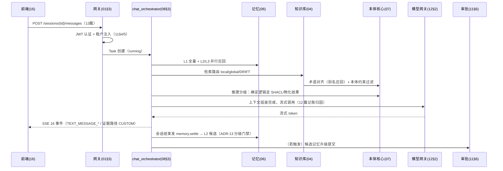

# 19 - 端到端场景走查设计（设计一致性闸门）

> 状态：v1.0 待评审 | 日期：2026-09-26 | 上游依据：04~14 篇全量
>
> 目的：用四个核心闭环把各篇接口**串起来走一遍**，逐一检查每个箭头上的接口、数据、权限、审计是否在对应篇有定义——设计内部的断点在本篇暴露并记录修复。每轮设计变更后复跑走查清单。

---

## 1. 走查方法

- 每个场景拆成带编号的步（S-A-01…），每步标注：**调用方 → 被调方（篇.节）**；
- 四项检查位：接口是否已定义（13 篇）/ 数据是否落位（02/04/06/07 篇）/ 权限是否可判（11 篇 PDP）/ 留痕是否覆盖（11 篇审计）；
- 断点记入 §6 修复记录；修不动进开放问题的，必须给出临时护栏。

## 2. 场景 A：一次知识问答（记忆感知 → 推理决策）



走查要点：SSE 断线重连补发（08§5 ↔ 16§3）；LLM 结构化主张只进候选区不写图（宪法 3）；每步 trace_id 贯穿（12§5）。**本轮结论：无断点。**

## 3. 场景 B：一次高风险行动闭环（OB2 逆向闭环）

```
S-B-01 规则/事件命中行动类 → action_service（09§7 validating）
S-B-02 PDP 五步判定：scope+ACL → 无权即 rejected（11§5）
S-B-03 SHACL 前置条件校验（07§7）→ 不满足 rejected（结构化报告，4xxx）
S-B-04 高风险判定（11§6）→ 审批中心工单 → Task waiting_approval（08§8）
S-B-05 前端 APPROVAL_REQUIRED 事件（08§5）→ 审批中心页裁决（16§4 路由）
S-B-06 approved → 恢复执行：业务适配器调外部 API（09§6 凭据引用注入，11§9 加密）
S-B-07 结果回流：写本体实例（07§4）+ 记忆（06）+ 审计（11§7）→ 三者全成才 done
S-B-08 回流失败 → degraded + 重试队列（09§7 Outbox 同款）
```

走查要点：审批拒绝后不可重放执行（08§8 持久化调用单）；annotations 不参与 S-B-02 判定（05 篇铁律 5）。**本轮结论：无断点；S-B-07 的"三者全成才 done"需在 action_service 代码级用补偿事务表达（进 17 篇 E2E 断言）。**

## 4. 场景 C：一份 PDF 从入库到可检索

```
S-C-01 oa kb upload（05§4/13 篇）→ MinIO 预签名直传（01§3）
S-C-02 七步流水线启动（04§3，ARQ 双队列 + 空闲闸门，ADR-14）
S-C-03 预处理：扫描件 OCR → 分片 → 四类抽取（18§2 模板，出处指针必填）
S-C-04 产出 → Candidate 候选区（宪法 3）+ 术语对齐门禁（07§8 唯一性 + 近义候选）
S-C-05 一致性/约束校验（07§5/§7）→ 红项回炉重抽
S-C-06 人工归档审批（11§6）→ 终审通过写 Neo4j ABox + Milvus 索引（04§2 层级）
S-C-07 新旧冲突 → T1 自动 supersedes / T2 冲突工单（第五类审批，04§4）
S-C-08 nightly 维护例程（04§5，ARQ）→ 重编译/重验
```

走查要点：全程进度事件经 12§3 事件总线推送前端；S-C-06 前图谱不可检索（候选隔离）。**本轮结论：无断点。**

## 5. 场景 D：外部 agent 消费 + CLI-harness 审批（跨边界）

```
S-D-01 外部 Claude 携 API Key → /mcp（09§2 鉴权/协商/会话）
S-D-02 knowledge.search + ontology.validate 调用（05§3.1 语义标注随 _meta 返回）
S-D-03 限流命中 → 429 + Retry-After（09§8 与 REST 同配额池）
S-D-04 平台内 agent 发起 cli.obsidian.run 写类命令（10§10）
S-D-05 runner 命令分类 write → 审批（05§6.3 默认从严）→ 用户确认 → 沙箱执行（14§1 sandbox 网 + egress 代理）
S-D-06 JSON 输出截断/归一 → 审计 → 工具观测计数（09§8）
```

走查要点：外部工具 schema 按需下发（09§4 两级）；MCP 熔断期间工具不可见（09§5）。**本轮结论：无断点。**

## 6. 断点修复记录

| 轮次 | 发现 | 处置 |
| ---- | ---- | ---- |
| 2026-09-26 首轮 | 06 篇 ADR-9/10/11 与 05 篇撞号 | 重排 ADR-12/13/14，00 篇总表补齐（已修） |
| 2026-09-26 首轮 | 02 篇 `stream:events` vs 12 篇分域命名 | 统一 `oa:events:{domain}`（已修） |
| 2026-09-26 首轮 | 01 篇审批"四类"旧表述 | 改五类（已修） |
| 2026-09-26 首轮 | S-B-07 补偿事务未在代码级定义 | 进 17 篇 E2E 断言 + 09 篇 action_service 实现要求（跟踪） |
| 2026-09-26 二轮 | 15 篇 CI 目录误写 `.gitea/`（仓库实为 Gitee Go） | 改 `.workflow/`（已修） |
| 2026-09-26 二轮 | 契约测试阶段：15 篇 nightly vs 17 篇合并必过 | 定稿"合并跑增量、nightly 全量"，两篇同步（已修） |
| 2026-09-26 二轮 | 03 篇 `theme/` 路径与 16 篇 `design-system/` 不一致 | 03 篇回写归并落位（已修） |
| 2026-09-26 二轮 | 抽取任务排队（online）与 LLM 记账维度混用 | 12 篇任务表注明解耦：记账记 background（已修） |
| 2026-09-26 二轮 | 编辑距离通道阈值未定义；REST P95 / LLM 首 token 预算缺值 | 留 17/18 篇开放问题，由持续设计清单 #1（M2 前性能预算篇）收口 |

## 7. 复跑触发条件

任一篇发生**接口签名、状态机、权限词汇**级变更时，本篇走查清单必须复跑并在 §6 追加记录——这是"持续设计"的闸门：设计不是一次成稿，而是每次变更都过一遍闭环。
