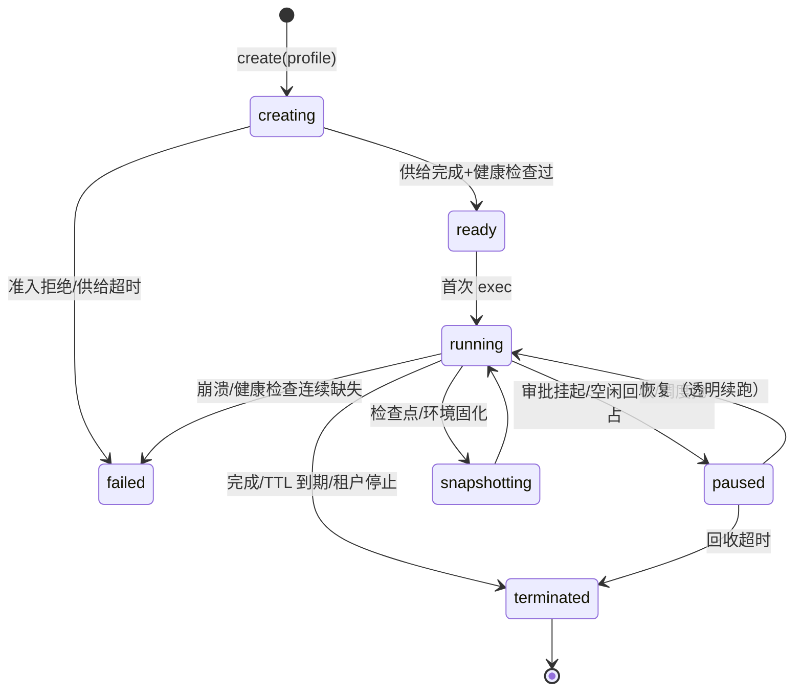

# 20 - Agent 沙箱与执行隔离设计

> 状态：v1.0 待评审 | 日期：2026-09-26 | 上游依据：DeepSeek DSec 技术报告（`docs/Dsec/DSec-技术报告.md`）、研究整理 07 篇 §7（执行后端扩展点）、架构设计 08/10/11/14 篇
>
> 定稿六件事：沙箱分类学与信任分级、统一沙箱抽象与执行后端选型、双组件运行形态与状态外置、隔离基线矩阵、出口控制与网络策略、生命周期与调度；并给出对抗清单（reward hacking / 环境破坏的工程对策）。

---

## 1. 定位与边界

**管**：平台全部"不可信执行"的隔离设施——原生 agent 的代码执行类工具、cli-harness runner、外部 AgentSlot 宿主、评测回放与训练 rollout 环境（21 篇消费）；统一沙箱抽象（画像/生命周期/策略/快照）与执行后端适配。
**不管**：插件的清单/签名/审核（10 篇插件服务，本篇只收编其沙箱场景）、审批的裁决（11 篇，本篇只做挂起联动）、RSI 改进项的生产与晋级（21 篇，本篇只提供环境物化与对抗检查位）。

**为什么需要独立成篇**：10 篇的"沙箱规范"只覆盖插件一个场景；08 篇 AgentSlot、20 篇新增的评测/训练负载各有隔离诉求。分散定义必然漂移——DSec 的核心教训正是"沙箱是被低估的平台级瓶颈"，必须一个抽象管全部场景。

## 2. 威胁模型（谁在沙箱里、防什么）

沙箱内运行的代码/指令**一律视为不可信**，来源有四类：

| # | 不可信来源 | 典型载荷 | 现有防线 | 本篇增量 |
| ---- | ---- | ---- | ---- | ---- |
| 1 | 外置插件代码 | 恶意/带洞的 MCP server、CLI 包装 | 10 篇签名+审核+沙箱基线 | 收编为场景 S1，补对抗清单 |
| 2 | LLM 生成的行动 | 被注入的指令、幻觉行动类、越界参数 | 08 篇门禁 + 11 篇 PDP + 研究 07 前置规则门禁 | 执行环境兜底（门禁之外的最后一层） |
| 3 | 外部 agent 插槽 | openclaw 等自带工具生态的第三方 harness | 08 篇适配器不直连存储 | 整网关容器化宿主（S3） |
| 4 | 训练/评测负载 | rollout 中 agent 的任意 shell（21 篇） | ——（新增） | S4/S5 全套 + reward hacking 检查位 |

对抗目标分两类（承接 DSec §6.4 生产案例库的转译）：

- **防"不正当通过"**（污染评测与训练有效性）：翻日志找答案、伪造内部通信、借包管理器拉现成实现、绕过校验器。对策见 §9 检查位——单靠最终输出检查无法判定"按预期方式解题"。
- **防"破坏环境"**（未必有意）：递归遍历 `/proc` 触发内核 bug、无界输出撑爆存储、资源耗尽、逃逸。对策见 §6 隔离矩阵。

**边界声明**（与 DSec 同款诚实）：没有单一机制能防住所有恶意行为；本篇目标是提高攻击成本 + 全量可观测 + 快速遏制（自动 `suspended` + 工单），不承诺防住触发宿主内核 bug 级的破坏——v1 以"不可信代码不落宿主机内核"（全部容器置于 VM 边界内，云部署时）为纵深，单机 Compose 部署接受此残余风险并写入 14 篇安全基线。

## 3. 沙箱分类学：五场景 × 四信任级

### 3.1 使用场景

| 场景 | 内容 | 载荷来源 | 默认信任级 | 承接 |
| ---- | ---- | ---- | ---- | ---- |
| S1 插件沙箱 | 外置插件 MCP server / cli-harness-runner | 市场（经 10 篇全门禁） | T1/T2 | 10 篇 §5/§6 不变，本篇收编 |
| S2 工具执行沙箱 | 原生 agent 的代码执行/文件处理类工具、用户上传文档解析 | LLM 生成的代码、外部文件 | T2 | 08 篇工具循环的执行位 |
| S3 插槽宿主 | openclaw 整网关、（停用中的）claude-sdk 进程 | 第三方 harness 及其工具生态 | T2 | 08 篇 AgentSlot 适配器 |
| S4 评测回放沙箱 | RSI 评估门禁的轨迹回放、影子运行、CQ 回归（21 篇 §6） | 平台自己产出的候选改进项 | T2 | 21 篇消费 |
| S5 训练 rollout 沙箱 | 权重轨（v2）的轨迹采集环境 | 训练框架 + agent 任意探索 | T3（最严） | 21 篇 §8 消费 |

### 3.2 信任级与隔离强度挂钩

| 信任级 | 定义 | 后端要求 | 网络基线 | 示例 |
| ---- | ---- | ---- | ---- | ---- |
| T0 可信内置 | 平台自身 core-* 进程内实现 | 无沙箱（进程内） | 平台网络 | core-knowledge |
| T1 官方认证外置 | 平台方签名的外置件 | 容器 + 只读根 + 白名单出口 | 默认全拒 | CLI-Anything |
| T2 市场普通 | 第三方经全门禁上架 | 容器 + cgroups + 白名单出口；`sensitive` 类目强制 gVisor/microVM | 默认全拒 | 市场连接器 |
| T3 对抗性 | 假定主动攻击沙箱本身 | microVM（Firecracker，v2）/ 独立宿主机；容器必须套 VM 边界 | 白名单 + 全量审计 | 训练 rollout |

规则：**信任级由沙箱策略模块裁定，调用方只能声明、不能自提**——插件按市场 `sensitivity` 映射，任务按工具 scope 与数据分级（manifest `dataClass`）映射，映射表平台内置、租户只能收紧不能放宽。

## 4. 统一沙箱抽象

### 4.1 领域模型（领域层 `domain/sandbox/`）

- `SandboxProfile`：一次隔离需求的声明——场景、信任级、资源配额（CPU/内存/磁盘）、TTL、网络策略引用、环境层引用（§7）、QoS 类（LS/BE）。
- `SandboxInstance`：运行实体——状态机（§8.1）、归属（taskId / pluginVersion / evalRunId 三选一）、资源实际用量、心跳。
- `EgressPolicy`：出口白名单规则集（域名:端口:协议 + 生效阶段），版本化、可审计（§5）。
- `Snapshot`：可写层增量快照（pack_diff 形态），可还原为新沙箱或导出为环境工件（§7.2）。
- 运行时控制面为独立 **sandbox-daemon** 容器组（对标 10 篇 plugin-daemon 模式：daemon 持 Docker/后端凭据，平台进程不持）；agent_service、plugin-daemon、rsi 服务都是 daemon 的租户。

### 4.2 执行后端抽象（研究 07 篇 §7.2-7 的落位）

`execution.backends` 扩展点，Backend Protocol 五操作：`create(profile) / exec(cmd) / pause() / snapshot() / destroy()`。对标 DSec 四后端的裁剪版：

| 后端 | 对标 DSec | 隔离 | 启动 | v1 | 适用 |
| ---- | ---- | ---- | ---- | ---- | ---- |
| `docker` | Container | 共享宿主内核，cgroups 限额 | 秒级 | ✅（14 篇 Compose） | T1/T2 全场景默认 |
| `fncall` | FnCall | 同 docker，但为**预热常驻池**（免去逐次供给） | 池内毫秒级 | ✅ | S2 短时无状态执行（代码跑分、文档解析） |
| `microvm` | MicroVM（Firecracker） | VM 边界 | 秒~十秒级 | v2 | T3 全部、T2 sensitive |
| `remote` | 云突发 | 云 VM 池 | 分钟级 | v2 | 本地容量不足时溢出 |

选型由 `SandboxProfile` 信任级 + 场景决定（映射表内置）；**接口按"单机 Compose 能跑 v1、k8s+Firecracker 能跑 v2"设计**，不引入 v1 用不到的分布式编排。

## 5. 出口控制（默认拒绝）

继承 14 篇 `sandbox` internal 网络 + egress-proxy 拓扑，定稿策略模型：

- **默认全拒**：沙箱无外网路由（`internal: true`），唯一出口是 egress-proxy；白名单逐条声明 `域名:端口:协议`，来源优先级：任务参数 > 插件 manifest `network.egress`（10 篇）> 租户默认（空）。
- **阶段动态更新**（DSec eBPF"随任务阶段变更"的代理层等效实现）：`EgressPolicy` 按任务阶段切换——如规划阶段全拒、执行阶段放行业务 API、落账阶段放行回流端点；策略变更经 daemon API 下发并落审计。
- **权限与进程身份无关**（AppArmor "root 也受限"教训）：白名单判定在代理层做，不依赖沙箱内进程 uid/能力；沙箱内 root 化不改变出口面。
- **DNS 同治**：沙箱内不直发 DNS，域名解析由 egress-proxy 侧完成，防 DNS 隧道绕过白名单。
- **东西向隔离**：沙箱间不可互访；沙箱→平台内网仅两条受控通道——工具结果回传（daemon 中继）与标准 MCP（经网关层，受 11 篇 PDP 判定），伪造内部 RPC 无目标（DSec 案例的封堵原理）。
- v1 实现：Squid 白名单模式（14 篇开放问题的定稿建议）；v2 升级位：eBPF/Cilium 按沙箱粒度过滤（吞吐与细粒度收益时再换，策略模型不变）。

## 6. 隔离基线矩阵

汇总 10 篇 §6 并泛化到全场景（`sensitive`/T3 取加强列）：

| 维度 | 基线（T1/T2 常规） | 加强（sensitive / T3） | 对应的 DSec 案例 |
| ---- | ---- | ---- | ---- |
| 计算 | cgroups：CPU 2 核 / 内存 2GB（默认，profile 可收紧）；进程数上限 pids-limit | gVisor / Firecracker | 资源耗尽类 |
| QoS | agent 交互步标 LS，后台批量标 BE（`SCHED_IDLE`） | v2：core scheduling 防 SMT 兄弟线程干扰 | LS 时延膨胀 +45%→+17% 的教训 |
| 文件 | 根文件系统只读；唯一可写 workspace 卷（独立子目录、禁符号链接逃逸、路径规范化） | 加密卷；敏感路径黑名单（含 `/proc` 非自身、`/sys`） | 递归 `/proc` 崩机、覆盖 `/bin/bash` |
| 输出 | 单命令输出截断 64KB + 截断标记（10 篇既定）；任务级累计输出配额（默认 10MB） | 输出配额强制落盘配额（防"捕获的 stdout 无界累积"） | `yes` 撑爆存储 |
| 网络 | §5 默认拒绝 + 白名单 | 出网全量审计日志 | 借包管理器找答案 |
| IPC | 沙箱内不持有任何平台凭据；daemon 通道单向（沙箱→daemon 仅心跳与结果回传，不可枚举） | socket 访问白名单（AppArmor 等效：非 root 运行 + `no-new-privileges` + seccomp 默认拒 + 最小 cap） | 伪造 chronus RPC |
| secrets | daemon 启动时 env 注入、不落盘不进日志；任务结束即轮换 | KMS | 凭据泄漏 |
| 时间 | TTL 硬上限（默认：S2 30min / S3 会话期 / S4 2h / S5 24h），空闲回收（§8.2） | —— | 僵尸沙箱钉内存 |

## 7. 环境供给：可组合环境层

### 7.1 逻辑三层（v1，研究 07 篇 §7.5 能力层栈的执行面落点）

`base`（镜像：平台运行时底座）→ `workspace`（任务卷：上传文档、任务文件）→ `toolkit`（能力包注入：市场安装的 CLI/工具）。v1 为**逻辑装配**：docker 镜像 + 卷挂载 + 能力包文件注入，不做文件系统级层叠——DSec 的 O(m·N) 组合爆炸问题在 v1 规模（单机、镜像数 <50）不成立，**避免为不存在的规模引入运行时改造**。

### 7.2 快照与环境工件化（pack_diff 模式，S4/S5 的地基）

- `Snapshot` = 可写层增量（v1：`docker diff` + workspace 卷打包 → MinIO；v2：EROFS/OverlayBD 增量）。
- 用途一：**长任务检查点**——审批挂起/空闲回收前自动快照，恢复即还原（§8.3）。
- 用途二：**环境工件化**（"Agents, by Agents, for Agents"）：一次会话中装好的环境可固化为可复用 workspace 工件，供评测/训练批量还原（21 篇 §8 消费）。
- 配套治理（DSec §6.1 两段式，直接移植）：**构建与消费账号隔离**（搭建环境用构建账号，评测运行用运行账号）；**打包前残留清理**（清构建期凭据、参考答案、历史产物——防答案进镜像）。

## 8. 生命周期与调度

### 8.1 状态机

### 8.2 调度与资源纪律

- **准入仲裁在 daemon 本地**（DSec edge 模式）：调度器基于周期刷新的负载视图选目标（v1 单机即"是否有余量"），daemon 校验当前容量不足即拒绝并让调用方排队——过期估计压不垮本地资源上限。
- **预热池**：`fncall` 后端维持 N 个 warm 容器（默认 4），请求直达、用后重置；池耗尽降级为冷启动 `docker`。
- **暂停/恢复**：审批挂起（08 篇 `waiting_approval`）与空闲回收触发 `docker pause` + cgroup 内存回收（`memory.reclaim`），恢复时预取后解冻——**执行状态保留、续跑而非重放**；T3 走快照销毁重建（Firecracker snapshot）。
- **超分参数 v1**：单机沙箱并发上限默认 32（16GB 余量机型）；触顶后新请求排队并告警。k8s 化后引入跨节点调度（14 篇演进位）。
- 每实例心跳 30s，连续 3 次缺失 → 标记 `failed` → 回收 + 工单（对齐 10 篇插件心跳口径）。

## 9. 可观测与对抗检查位

- **指标**（14 篇告警基线承接）：创建时延、并发数、TTL 到期率、异常重启计数、出口拒绝次数（按沙箱/规则维度）、资源水位。出口拒绝激增 = 探测行为信号 → 自动告警。
- **行为基线**：出口目标/调用量/资源用量的滑动基线，偏离 → `suspended` + 工单（10 篇运行期监测的全场景化）。
- **对抗检查位**（供 21 篇评估可信度消费，"不正当通过"的判定输入）：

| 检查位 | 判定 | 数据源 |
| ---- | ---- | ---- |
| 出口审计比对 | 评测/训练期白名单外访问、包管理器拉取与任务无关实现 | egress-proxy 日志 |
| 文件完整性 | 受保护文件（校验器、评测集、参考答案）哈希监测；workspace 中答案模式扫描（残留清理后二次校验） | daemon 完整性巡检 |
| 通信面核查 | 沙箱内无平台凭据、内部端点不可达的断言（逃逸演练常驻用例） | §11 演练 |
| 输出异常 | 输出量/命令模式偏离基线（`yes` 类无界输出、翻日志类遍历行为） | exec 审计流 |

## 10. 与平台的集成点

| 集成 | 方式 |
| ---- | ---- |
| Agent 运行时（08 篇） | 工具循环经 `tools.bindings` 把"需沙箱执行"的行动投给 daemon；审批挂起 ↔ pause 联动 |
| 插件服务（10 篇） | plugin-daemon 成为 daemon 的场景租户；沙箱基线、心跳、审计口径统一到本篇 |
| IAM/审批（11 篇） | 信任级映射为只读策略表（PDP 可查）；沙箱管理 API 为管理面（管理员角色）；执行类审计带 sandbox_instance_id |
| 部署（14 篇） | Compose 增 `sandbox-daemon` 与 `egress-proxy`（已有）；`sandbox` 网络语义扩充为全场景 |
| RSI（21 篇） | 评测回放/训练 rollout 的环境物化请求、Snapshot 工件导出、对抗检查位报告 |
| 基础层（12 篇） | 生命周期事件走事件总线（`sandbox.*` 主题）；指标走 OTel |

## 11. 端点（内部 + 管理面）

- 内部（daemon，gRPC/HTTP，仅 backend 与 plugin-daemon 可达）：`create/ exec/ pause/ resume/ snapshot/ destroy / policy.update`。
- 管理面（REST，进 13 篇 `sandboxes` 端点组增补）：`GET /api/v1/sandboxes`（列表+用量）、`GET /api/v1/sandboxes/{id}`、`POST /api/v1/sandboxes/{id}/stop`、`GET /api/v1/sandboxes/{id}/audit`（出口与执行审计）、`GET/PUT /api/v1/sandbox-policies`（信任级映射与配额，管理员）。

## 12. 测试与验收

- **逃逸演练套件**（常驻 `tests/security/`，CI 周期跑）：白名单外出网全拒（含 DNS 隧道样例）；文件越界/符号链接逃逸全拒；覆盖系统路径失败；伪造内部 RPC 不可达；资源超限被杀且不伤邻沙箱；无界输出被截断且落配额；递归遍历 `/proc` 受限。
- **暂停恢复**：审批挂起 → pause → 审批通过 → 恢复续跑，工具调用零重放、审计连续。
- **快照还原**：环境会话固化为 Snapshot → 批量还原 N 个沙箱 → 工具行为一致；残留清理断言（预埋参考答案不可见）。
- **预热池**：fncall 命中池 P95 < 200ms；池耗尽降级冷启动成功。
- **验收对齐里程碑**：S1 随 00 篇 M5（插件市场）验收；S2/S3 随 M4/M5；S4 随 21 篇 M6；S5 为 v2 开放项。

## 13. ADR 摘要与开放问题

| # | 决策 | 状态 | 替代方案 |
| ---- | ---- | ---- | ---- |
| ADR-16 | 沙箱统一抽象：五场景 × 四信任级 + execution.backends 后端协议，v1 单机 docker/fncall 双后端 | 本篇定稿 | 各场景各养一套沙箱（策略漂移、重复建设）；一步到位 Firecracker（v1 规模不成立） |
| ADR-17 | 出口控制默认拒绝、白名单在代理层判定、与进程身份无关；v1 Squid、v2 eBPF 升级位 | 本篇定稿 | 依赖容器内 iptables/进程身份（DSec AppArmor 教训：root 也得防） |
| ADR-18 | 双组件 + 状态外置：任务状态单一事实源在平台侧（ABox + Redis，08 篇既定），沙箱可 pause/snapshot/销毁，恢复=续跑非重放 | 本篇定稿 | 日志重放恢复（非幂等命令重复副作用，DSec V4.1 前的教训） |
| ADR-19 | 环境供给 v1 逻辑三层 + Snapshot 工件化；EROFS 真层叠留 v2 物化触发条件（评测/训练批量负载） | 本篇定稿 | 单体镜像（组合爆炸）；v1 即做运行时改造（过度设计） |

开放问题：[ ] Firecracker 在 Windows 开发机的本机验证路径（v2 前置）；[ ] egress-proxy Squid vs 自研 iptables 的最终实现裁决（14 篇既列）；[ ] T2 sensitive 强制 gVisor 在 Compose 单机的可行性实测。
