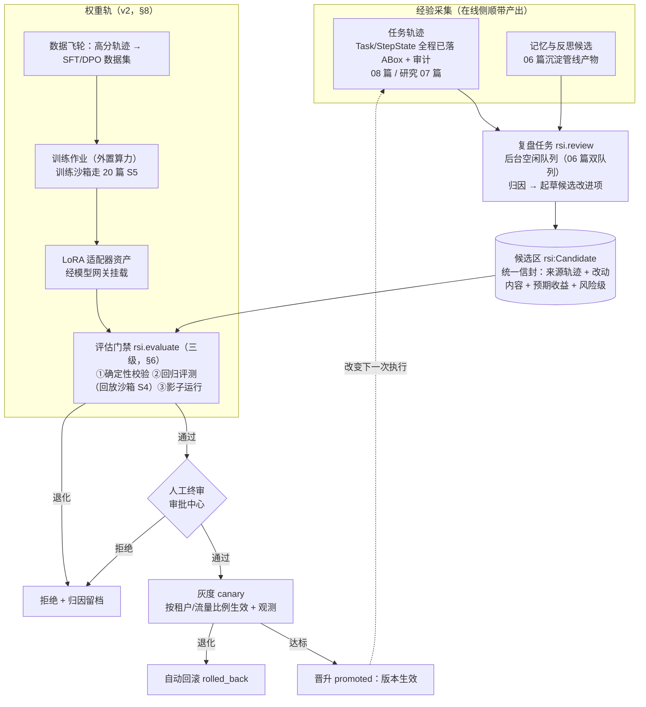
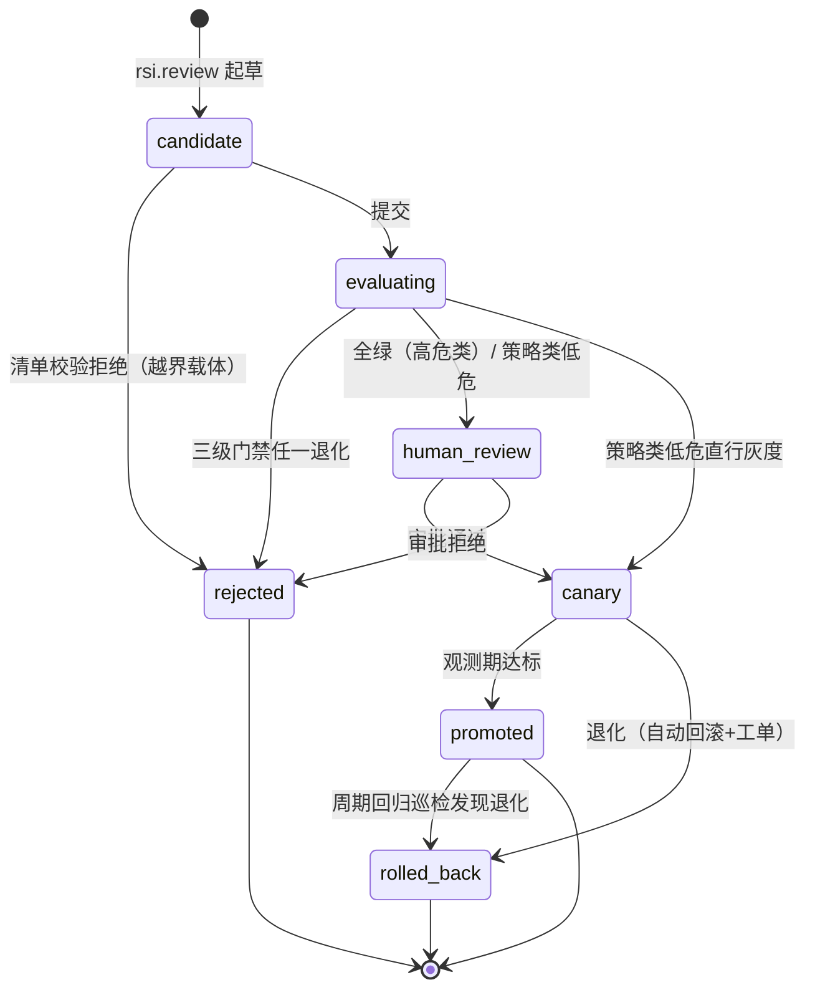

# 21 - RSI 自进化与训练机制设计

> 状态：v1.0 待评审 | 日期：2026-09-26 | 上游依据：项目定位 ontology-**rsi**-harness、hermes-agent 学习循环（研究整理 01 篇 §3）、DSec 技术报告 §6（rollout / 奖励 / reward hacking）、架构设计 06/07/08/10/20 篇、设计宪法
>
> 定稿五件事：RSI 双轨总体架构（程序性 / 权重）、经验采集与归因、五类改进项与晋级管线、三级评估门禁、权重训练轨（v2）；并划定 RSI 安全红线（递归有界、评估器隔离、人工终审）。

---

## 1. 定位与边界

**RSI（Recursive Self-Improvement）的本平台定义**：agent 系统**从自身运行经验中系统性地产出改进项，经确定性评估与人工门禁后安全生效，使后续任务表现可度量提升**的受控闭环。"递归"的含义是改进项作用于平台自身的能力供给（技能/规则/提示词/上下文策略/本体/模型适配器），从而改变下一次执行——**不是**让 agent 自由修改自己的代码或内核。

**管**：任务复盘与经验归因、候选改进项的生产与生命周期、评估门禁（回归/影子）、灰度发布与回滚、训练数据飞轮与权重轨（v2）。
**不管**：记忆的日常沉淀管线（06 篇，本篇是其产物的一个**消费方**）、技能库与市场的存储与审核实现（10 篇，本篇的改进项经它的通道上架）、沙箱实现（20 篇）、审批裁决（11 篇）、模型接入（12 篇）。

## 2. 总原则（设计宪法在自进化域的延伸）

1. **候选非成品适用于一切自产出**：RSI 产出的技能、规则、提示词、本体概念、模型适配器全部进候选区，无一生效豁免（宪法第 3 条——自改进恰恰是最不能豁免的场景）。
2. **评估器确定性 + 隔离**：判定"改进是否有效"依靠确定性校验器与冻结的回归评测集（SHACL/规则/SuccessCriterion/CQ 断言），不靠 LLM 自评；**评估器与评测集本身不在 RSI 可修改白名单内**（§9 红线 3）。
3. **推理分级约束 RSI 自身**：能用确定性信号（门禁拦截率、任务成功率、步数/成本）度量的不用 LLM 判断；LLM 只做归因分析与改进项起草，产物过规则校验。
4. **递归有界**：改进项只能落在 §5 的五类白名单载体上；每周期改进项数量与预算有硬上限；不允许的递归（改代码、改内核契约、改权限）在清单校验层直接拒绝。
5. **全程可追溯**：每个生效的改进项回链其来源轨迹（trace_id）→ 评估运行（evalRunId）→ 审批记录 → 灰度观测，可一键回滚（宪法第 5 条）。

## 3. 双轨总体架构

**程序性 RSI（v1，改"软件"）**：改进落在提示词、技能文档、规则模板、策略参数、本体候选——零训练成本、即时生效、可解释，M6 交付完整闭环。
**权重 RSI（v2，改"参数"）**：程序性收益递减后启动，走数据飞轮 → 外置训练 → 适配器资产化；**环境物化协议（20 篇 S5）先行，训练算力后置**。

## 4. 经验采集与归因（数据从哪来）

### 4.1 采集（零额外埋点）

执行侧已把一切落账：任务/步骤全程在 ABox（`task:Task/Step` + StepState）、工具调用与门禁拦截在审计、成本在模型网关记账、记忆候选在 06 篇沉淀管线。RSI **只读这些既有事实**，不新增在线链路埋点。

### 4.2 复盘任务（`rsi.review`，后台空闲队列）

- 触发：任务终态事件（`succeeded` 全量抽样 + `failed`/升级人工的全量）、每周期定时巡检；执行在 `arq:queue:idle`（06 篇 §5.5 既有机制，LLM 预算分账沿用）。
- 归因分类（直接复用研究 07 篇 §6.5 失效模式表，保证与执行侧同词汇）：

| 轨迹形态 | 归因 | 改进项指向 |
| ---- | ---- | ---- |
| 成功且成本达标 | 可复用模式 | 候选技能（把路径写成 SKILL.md）/ 候选规则（把判断固化为模板） |
| 反复同型失败 | 幻觉行动类 / 参数不合规 | 候选规则模板（前置门禁补规则）、候选提示词（输出约束） |
| 循环不收敛 / 反复修复 | 规划或上下文缺陷 | 候选上下文策略（预算配比、召回路由）、候选规划策略 |
| 未对齐实体集中出现 | 世界模型盲区 | 候选本体概念（→ 07 篇 ChangeRequest） |
| 高频确定链路仍走 LLM | 分级漏判 | 候选规则（新增 SPARQL CONSTRUCT 模板，下次零 token） |

- 产出统一信封 `rsi:Candidate`：`{type, target, patch|content, source_trace_ids, expected_gain, risk_level, eval_plan}`；LLM 起草（提示词模板归 18 篇治理，新增 `rsi-review` 一类），结构化字段过 JSON Schema 校验。

## 5. 五类改进项（白名单载体）

| # | 类型 | 载体与生效位置 | 通道 | 审批要求 |
| ---- | ---- | ---- | ---- | ---- |
| 1 | 候选技能 | SKILL.md → 10 篇 Skills 库候选区 | 复用技能审核链 | 人工（市场门禁） |
| 2 | 候选规则/校验器 | SPARQL CONSTRUCT 模板 / SHACL shape → 07 篇 `ChangeRequest` | 本体版本治理 | **必须人工**（国标底线：规则人工把关） |
| 3 | 候选提示词 | 18 篇提示词版本库（patch 语义） | 提示词灰度机制 | 人工 |
| 4 | 候选上下文/召回策略 | 08 篇预算配比与 04 篇召回路由的参数版本 | 策略版本化 | 低危可灰度直行，退化自动回滚 |
| 5 | 候选本体概念 | 未对齐实体提名 → 06 篇 §5.4 L3→L4 反哺通道 | 记忆反哺 + ChangeRequest | **必须人工**（宪法：候选本体人工终审） |

清单校验铁律：`type ∉ 五类` 或 `target` 指向权限/审批/沙箱策略/评估器/平台代码 → **直接拒绝并记安全审计**（这是"递归有界"的机械执行点，不依赖模型自觉）。

## 6. 评估门禁（三级，`rsi.evaluate`）

| 级 | 名称 | 机制 | 判定 |
| ---- | ---- | ---- | ---- |
| ① | 确定性校验 | 改动内容过 SHACL/JSON Schema/规则静态检查（毫秒级） | 硬门槛 |
| ② | 回归评测 | **评测集 = 能力问题（CQ）转化断言 + 失败案例库 + 抽样历史轨迹回放**：在 20 篇 S4 回放沙箱中以候选改进项运行既有 `task:Task` 实例，断言 SuccessCriterion、对比步数/token/门禁拦截率 | 通过率不得低于基线；单项退化 >5% 即拒 |
| ③ | 影子运行 | 高风险类（规则/本体/提示词）在影子配置上对**新到任务**并行求值，不出结果只比指标（观测一个完整周期） | 指标不劣于现行 |

- **评测集治理**：CQ 断言库与失败案例库**版本冻结、人工维护**（研究 07 篇 §4 痛点 8 的机制化：建模产出的 CQ 天然是回归测试）；评测集变更走独立审批，与被评估的改进项**永远不同源**（防"自己出题自己考"）。
- **回放可信度**：回放判定消费 20 篇 §9 对抗检查位——出口审计异常、完整性破坏、答案泄漏任一命中即判"不正当通过"，评估作废并记安全事件。
- 评估运行本身是资源型任务：批量回放在空闲队列执行（S4 沙箱 TTL 2h，20 篇）；影子运行只叠加推理成本，按 06 篇 LLM 预算分账。

## 7. 晋级管线（状态机与灰度）

- **版本与回滚**：五类载体全部版本化（技能版本、本体版本、提示词版本、策略版本），`promoted` 即把工具注册/上下文组装的指向切到新版本；回滚 = 指向切回，秒级，不动数据（07 篇版本治理同款语义）。
- **灰度单位**：v1 按租户（平台自有租户先吃狗粮）→ v2 按流量比例；观测指标同 §6-②（成功率/步数/成本/拦截率），观测期默认 7 天或 ≥100 个任务。
- **变更预算**：每周期（默认 7 天）进入灰度的改进项 ≤ 5 项、rsi.review LLM 预算封顶（复用 06 篇分账口径）——防止自进化流量淹没平台与制造不可归因的复合变更。

## 8. 权重训练轨（v2）

**触发条件**（满足其二再立项，避免过早优化）：①程序性 RSI 连续两个周期收益递减（同类归因的改进项通过率与增益下降）；②高分轨迹存量达标（默认 ≥1 万条可验证成功轨迹）；③出现需要专属模型的垂直域租户需求。

- **数据飞轮**：`succeeded` 且 SuccessCriterion 全通过、成本达标、对抗检查位零告警的轨迹 → 脱敏（租户数据清洗，个保法合规引 14 篇合规设计项）→ SFT 数据集；成功/失败对 → DPO 偏好对。数据集是**资产**：版本化、审批入库、可追溯每条样本的 trace_id。
- **奖励信号 = verifier in the loop**（推理分级在训练域的直接应用）：奖励 = SuccessCriterion 谓词通过 + SHACL 校验通过 + 规则命中率 + 成本惩罚的组合，**全部确定性可计算；禁止 LLM-as-judge 单独决定奖励**（DSec reward hacking 案例库的直接对策：可被钻营的软奖励必然被钻营）。
- **训练基建**：rollout 沙箱按 20 篇 S5（T3、microVM、pack_diff 环境工件、构建/运行账号隔离、残留清理）；rollout 状态外置（重连续跑）；训练算力**外置**（租用云 GPU / 离线批次），平台不自建 GPU 集群——DSec 式自建基础设施是 DeepSeek 规模的答案，不是本平台 v2 的；我们复用其**协议设计**（环境物化、快照、恢复），算力对接开源 RL 框架（veRL/slime 级）作为外部作业。
- **适配器资产化**：训练产出 LoRA 适配器 → 经模型网关（12 篇 LiteLLM）挂载为渠道变体 → **走与程序性改进完全相同的晋级管线**（三级评估 + 人工 + 灰度 + 回滚），不设"训练直通上线"通道。

## 9. RSI 安全红线（治理）

| # | 红线 | 机械执行点 |
| ---- | ---- | ---- |
| 1 | RSI 不得触碰权限、审批、IAM、沙箱策略、出口白名单 | §5 清单校验拒绝 + 安全审计 |
| 2 | RSI 不得修改平台代码、扩展点契约、插件内核 | 改进项载体限于五类非代码资产（SKILL.md/模板/参数/提示词/本体条目） |
| 3 | **评估器隔离**：回归评测集、评估逻辑、对抗检查位不在 RSI 可写范围；评测集变更与改进项变更不同源、不同审批人 | 评测集仓库独立权限（11 篇审计员式角色）；变更独立审批对象类型 |
| 4 | 高危载体（规则/本体/提示词/适配器）必须人工终审，不可配置豁免 | §7 状态机 hard-code |
| 5 | 递归深度有界：改进项只能生产"下一轮执行的输入"，不允许生产"改进机制本身的修改" | 载体白名单即闭环定义 |
| 6 | 全局 kill switch：平台级/租户级 RSI 开关，关闭即停止 rsi.review 起草与 canary 推进（已 promoted 项需人工回滚） | 配置分层（12 篇）+ 管理端点 |

与记忆投毒防线的关系：RSI 的输入包含记忆与轨迹，若上游被投毒，RSI 会放大污染——因此 **rsi.review 的归因输入只取经 SHACL 门禁入库的数据 + 审计原始事实**，不取自由文本记忆；候选技能仍走 10 篇投毒检测双轨（06 篇两道防线的第三道应用）。

## 10. 与平台的集成点

| 集成 | 方式 |
| ---- | ---- |
| Agent 运行时（08 篇） | 只读任务轨迹与审计；生效的策略/提示词版本经上下文组装器装载 |
| 记忆（06 篇） | 消费反思候选与反哺提名；rsi.review 挂空闲队列、预算分账同口径 |
| 本体核心（07 篇） | 候选规则/概念走 ChangeRequest 与版本治理；CQ 库为回归评测集来源 |
| 技能与市场（10 篇） | 候选技能经 Skills 库候选区上架；投毒检测复用 |
| 沙箱（20 篇） | S4 回放/影子环境、S5 训练环境物化；对抗检查位消费 |
| 审批中心（11 篇） | 新增审批对象 `rsi_promotion`（候选改进项人工终审）与 `eval_suite_change`（评测集变更） |
| 模型网关（12 篇） | v2 LoRA 适配器挂载为渠道变体；rsi.review LLM 调用记账归因 `module=rsi` |

## 11. 后台任务与端点

ARQ 任务注册（12 篇 §4 表增补，全部 idle 队列）：`rsi.review`（复盘起草，终态事件触发/周期巡检，超时 30min）、`rsi.evaluate`（三级评估编排，超时 4h）、`rsi.canary-watch`（灰度观测与自动回滚判定，周期 1h）；单实例锁防重复扫描（06 篇同款 SETNX）。

REST 端点（13 篇 `rsi` 端点组增补，约 12 个）：`GET /api/v1/rsi/candidates`（列表/过滤）、`GET /api/v1/rsi/candidates/{id}`、`POST /api/v1/rsi/candidates/{id}/evaluate`、`GET /api/v1/rsi/eval-runs/{id}`（评估报告：三级结论 + 对抗检查位）、`POST /api/v1/rsi/candidates/{id}/promote|reject`、`GET /api/v1/rsi/promotions`（灰度观测面板数据）、`POST /api/v1/rsi/promotions/{id}/rollback`、`GET/PUT /api/v1/rsi/config`（开关/预算/白名单，管理员）。CLI 同源（`oa rsi …`，13 篇命令树增补）。

## 12. 里程碑对齐与验收

| 里程碑 | 交付 | 验收标准 |
| ---- | ---- | ---- |
| M4（随既有） | 轨迹/审计/成本落账完备（rsi 的数据地基，不新增交付） | 08 篇既定验收外推：任一任务可回放出 StepState 全程 |
| M5（随既有） | `rsi.review` 雏形：失败轨迹复盘 → 候选技能进 Skills 候选区 → 人工上架 | 一条真实失败轨迹产出一条候选技能并被人工采纳；来源 trace 可回链 |
| **M6（新增，建议）** | 程序性 RSI 完整闭环：五类载体候选 → 三级评估（含回放沙箱 S4）→ 审批 → 灰度 → 回滚；kill switch；评测集冻结治理 | 规则类改进项经回放评测证明"同型任务步数/成本下降且回归集零退化"后灰度生效；人为注入退化改进项被自动回滚 |
| v2 开放 | 权重轨：数据飞轮 → 外置训练 → 适配器资产化走同一晋级管线 | 适配器在回归集上不退化方可灰度；训练期 reward hacking 检查位零漏报（注入样例） |

> M6 为本篇对 00 篇 §7 演进路线的**增量提案**（M5 后、按需启动），列入对账清单待路线裁决时合并——不改动既定 M1~M5。

## 13. ADR 摘要与开放问题

| # | 决策 | 状态 | 替代方案 |
| ---- | ---- | ---- | ---- |
| ADR-20 | RSI 双轨制：v1 程序性（五类非代码载体）完整闭环，v2 权重轨复用同一晋级管线 | 本篇定稿 | 直接上权重训练（数据与评估地基未备，风险不可控）；不做 RSI（违背项目定位，经验不沉淀） |
| ADR-21 | 奖励与评估只用确定性信号（SuccessCriterion/SHACL/规则/回归集），评估器与评测集隔离且人工维护 | 本篇定稿 | LLM-as-judge 定优劣（可被钻营，DSec 案例库直接反例） |
| ADR-22 | 改进项晋级统一走"候选 → 三级评估 → 人工（高危）→ 灰度 → 可回滚"，技能/本体/提示词/适配器同一条管线 | 本篇定稿 | 各载体各建发布机制（口径漂移、审计断裂） |

开放问题：[ ] CQ→回归断言的自动转化率与人工补齐流程；[ ] 影子运行的样本量下限（指标置信度）；[ ] rsi.review 归因的规则命中率阈值调参（研究 07 篇开放问题"确定性判定"在复盘侧的对应）；[ ] v2 训练框架选型（veRL vs slime）与外置算力对接协议；[ ] DPO 偏好对的失败轨迹脱敏规范（与合规设计项合并裁决）。
