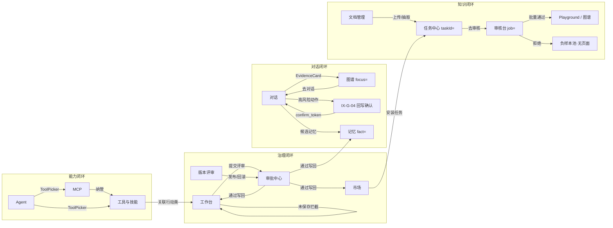

# 26 - 前端页面交互态详细设计（Tab 子视图 / 弹窗 / 抽屉 / 跳转闭环）

> 状态：v1.0 | 日期：2026-09-26 | 定位：**页面主视图之上"交互态层"的权威**——Tab 子视图内容、弹窗、抽屉、向导、菜单、命令面板、二次确认与页面间跳转关系。
> 上游依据：[03 篇 §4 路由与导航图](03-前端架构与UI设计规范.md)（React 版路由权威）、[frontend/02 篇 P1~P12 逐页设计](../frontend/02-信息架构与页面设计.md)（交互语义权威）、[api/01 端点登记册](../api/01-REST-API契约.md)（操作唯一事实源）、[24 篇组件库](24-前端组件库扩充与外部样式借鉴.md)（基元层）。
> 物理载体：**画板 [docs/设计稿/interactions/](../设计稿/interactions/)**（8 个 HTML，画框 id = 本篇矩阵编号）。主视图画板 = [ui-pages.html](../设计稿/ui-pages.html)（26 框，不重复）。
> 设计宪法对齐：LLM 产物一律候选非成品（弹窗含审核语义）；全程可追溯（二次确认带审计理由、导出走任务中心）；玻璃只给控制层（弹窗遮罩用玻璃 Clear 档、弹窗卡片本体实底）。

---

## 1. 范围与分类

### 1.1 设计对象六类

| 类型 | 标识 | 玻璃档位 | 典型宽度 | 关闭方式 |
| ---- | ---- | ---- | ---- | ---- |
| Modal 弹窗 | modal | 遮罩组件库标准 `.modal-mask`（40% + blur）；卡片实底 | 480~640px（表单）/ 720px（对照） | 取消/Esc/遮罩点击（危险确认除外） |
| Drawer 抽屉 | drawer | 右滑入 380~640px；本体实底 + `.ov-dim` | 右侧覆盖 | 关闭按钮/Esc |
| Popover 悬浮卡 | popover | 玻璃 or 实底均见画板（实底为稳态推荐） | 280~360px | 点击外部/Esc |
| Tab 子视图 | tabs | 内容层实底 | 页内 | 点击切换（深链 `?tab=` 可达） |
| Wizard 向导 | wizard | Modal 容器 + steps 步骤条 | 640~720px | 上一步/下一步/取消（强制步骤不可跳过） |
| Menu 菜单 | menu | 实底 `.menu`（对齐组件库 00F 标准） | 按内容 | 点击外部/Esc |

### 1.2 编号规则与画板映射

编号 `IX-{域}-{序号}`，与画板文件对应：

| 画板文件 | 域 | 覆盖编号 |
| ---- | ---- | ---- |
| `ix-01-global.html` | 全局层 + 个人设置 | IX-G、IX-SET |
| `ix-02-converse.html` | 对话 / 任务 / 轨迹回放 | IX-CHT、IX-TSK、IX-TRAJ |
| `ix-03-kb.html` | 知识库 / 抽取审核 / Playground | IX-KB、IX-REV、IX-PG |
| `ix-04-onto.html` | 本体项目列表 / 本体工作台 | IX-OL、IX-ON |
| `ix-05-governance.html` | 版本与评审 / 图谱浏览 | IX-VR、IX-EX |
| `ix-06-platform.html` | 记忆 / Agent 管理 | IX-MEM、IX-AGT |
| `ix-07-extensions.html` | 插件市场 / 工具与技能 / MCP | IX-MKT、IX-TLS、IX-MCP |
| `ix-08-admin.html` | 审批中心 / 系统管理 | IX-APR、IX-ADM |

### 1.3 通用交互铁律（全矩阵强制）

1. **危险操作双确认**：删除、回滚、发布、渠道删除等 → 确认弹窗内输入确认或理由必填（危险按钮 danger 实底），并在文案中写明不可逆后果与审计留痕；
2. **操作必有端点**：矩阵中每个按钮/动作都标注 api/01 §5 分组支撑，禁止发明无源功能；纯前端态（如过滤、排序）标注"本地态"；
3. **跳转带深链**：跨页跳转一律带 query 回跳参数（`?doc=`、`?entity=`、`?tab=`），目标页负责还原过滤态（02 篇 §5 规则）；
4. **三态齐备**：弹窗内列表/图表遵循 p-empty-skel 基准（空态/骨架/错误）；
5. **快捷键**：审核台 J/K/N、全局 ⌘K、Esc 关闭；快捷键帮助面板 `?` 唤起；
6. **候选非成品**：一切"通过/入库/发布"类操作都来自审核语义（审批中心/评审流），弹窗文案不得出现"直接生效"（除非该档治理配置允许并显式标注）。

---

## 2. 全局交互层（IX-G，宿主 AppHeader/AppShell）

| 编号 | 名称 | 类型 | 触发点 | 内容构成 | 操作与端点 | 跳转/联动 |
| ---- | ---- | ---- | ---- | ---- | ---- | ---- |
| IX-G-01 | ⌘K 全局命令面板 | Modal（cmdk） | ⌘K / 顶栏搜索框点击 | 搜索输入框（默认聚焦）+ 四分组结果：页面直达 / 本体类（跳工作台定位）/ 实体·文档（跳图谱/知识库）/ 工具·插件（跳工具页、市场）；每项含类型徽标 + 面包屑 + 关键字高亮；键盘 ↑↓ 选择、↵ 跳转 | 搜索聚合：api/01 §5.4 kb graph/search + 各列表 query（防抖 300ms，本地缓存） | 四类目标深链直达 |
| IX-G-02 | 通知中心面板 | Popover（360px） | 顶栏铃铛（未读数徽标） | Tab：全部/待办/任务；通知行 = 类型图标 + 标题 + 摘要 + 相对时间 + 未读点；底部「全部标记已读」「通知偏好设置」 | api/01 §5.2 tasks 事件 + 审批待办计数（§5.3/§5.6/§5.7 汇聚） | 任务类→`/tasks?taskId=`；审批类→`/approvals?id=`；抽屉内点击行即跳 |
| IX-G-03 | 用户菜单 | Menu | 顶栏头像 | 资料、个人设置、切换主题（亮/暗/跟随系统）、切换租户（super_admin 多租户）、API Key 管理（跳设置）、登出（二次确认） | api/01 §5.9 auth（登出 revoke；租户切换换 token） | 设置→`/settings`；登出→`/login` |
| IX-G-04 | 高风险动作二次确认（回写 confirm_token）★ | Modal（560px，danger 强调） | Agent 对话中触发高风险 `action.invoke`（02 篇 P1 交互流 FR-WB-06） | ①动作名 + 目标系统徽标；②参数快照表（key/value mono 字体，长值折叠）；③风险等级条（高=danger）+ 命中的守护规则列表；④「我已知晓该操作将写入业务系统」勾选；⑤取消 / 确认执行（60s 倒计时，超时失效） | api/01 §5.8 writeback 台账（confirm 换取 confirm_token；MCP annotations 仅 UI 提示不作授权） | 取消→工具调用终止并留审计；确认→回对话流继续渲染执行结果 |
| IX-G-05 | 快捷键帮助 | Modal（480px） | `?` 键 / 帮助入口 | 全局快捷键分组表：导航（⌘K/G 然后 1-9）/ 对话（⌘↵ 发送）/ 审核台（J/K/N/A）；每行 kbd 徽标 | 本地静态 | — |
| IX-G-06 | 会话过期/401 统一处理 | Modal（400px） | 任意 API 返回 401 | 「登录已过期」+ 重新登录按钮（携带回跳 URL） | api/01 §5.9 auth | →`/login?next=` |

## 3. 个人设置 `/settings`（IX-SET，宿主画框 p-settings）

| 编号 | 名称 | 类型 | 触发点 | 内容构成 | 操作与端点 | 跳转/联动 |
| ---- | ---- | ---- | ---- | ---- | ---- | ---- |
| IX-SET-01 | 资料 Tab | Tab 视图 | 左侧设置导航「资料」 | 头像上传（圆形裁剪预览）+ 姓名/邮箱/部门（邮箱只读）+ 语言/时区选择；保存按钮（脏态才可点） | api/01 §5.9 auth 用户自更新 | — |
| IX-SET-02 | 安全 Tab（2FA） | Tab 视图 + Wizard | 「安全」 | 两步验证状态卡：未启用→「启用 2FA」向导（①扫码/密钥 ②输入 6 位验证码 ③备份码展示一次性「复制/下载」）；已启用→「查看备份码（重新生成需密码）」「停用（需密码+验证码）」 | api/01 §5.9 auth 2FA 三端点 | 登录页 2FA 输入态对应 IX-G-06 场景 |
| IX-SET-03 | API Key 管理 | Tab 视图 + Modal | 「API Key」 | Key 列表（名称/前缀 sk-…abcd/创建时间/最后使用/状态）；「新建 Key」弹窗：名称+权限范围（读写）→ **创建成功态弹窗只显示完整 Key 一次**（复制按钮 + 警示文案）；吊销→危险确认 | api/01 §5.8 admin api-keys（登记册实际归属；§5.9 为认证通道） | — |
| IX-SET-04 | 通知偏好 / 会话设备 | Tab 视图 ×2 | 「通知」「设备」 | 通知：事件类型开关矩阵（任务完成/审批待办/记忆升级/系统公告 × 站内/邮件）；设备：登录设备列表（设备名/位置/最近活跃/当前标记）+ 「下线」确认 | api/01 §5.9 auth 偏好与 sessions 设备端点 | — |

## 4. 对话 / 任务 / 轨迹（IX-CHT / IX-TSK / IX-TRAJ）

### 4.1 对话 `/chat/:sessionId`（宿主 p-chat）

| 编号 | 名称 | 类型 | 触发点 | 内容构成 | 操作与端点 | 跳转/联动 |
| ---- | ---- | ---- | ---- | ---- | ---- | ---- |
| IX-CHT-01 | 会话项菜单 | Menu | 会话列表项 `⋯` | 置顶/取消置顶、重命名（行内输入态）、导出 Markdown、删除（危险确认：删除会话及其消息与证据引用） | api/01 §5.2 sessions CRUD | — |
| IX-CHT-02 | 新对话配置 | Modal（520px） | 「＋新对话」 | Agent 插槽选择卡（运行中优先+状态徽标）、模型渠道下拉（含成本档提示）、开场提示词（可选）、知识库绑定多选 | api/01 §5.1 agents 列表 + §5.2 sessions 创建 | 创建→进入 `/chat/:newId` |
| IX-CHT-03 | 证据原文抽屉（EvidenceCard → Sheet） | Drawer（480px） | 点击消息流内 EvidenceCard / 引用角标 | 原文片段（命中句高亮）+ 出处三元组表（mono）+ 置信度徽标 + 来源文档元数据；底部「在图谱中查看」 | api/01 §5.4 kb 检索 source_ref | →`/kb/explore?focus={entity_iri}` |
| IX-CHT-04 | 上下文面板溯源 Popover | Popover（320px） | 右侧 ContextPanel 四类来源条目点击 | 来源类型徽标（L1/L2/L3 记忆 · GraphRAG 路径 · 规则命中）+ 内容摘要 + 命中得分 + 「查看全部」 | api/01 §5.5 memory + §5.4 kb | 记忆类→`/memory?fact=`；图谱类→抽屉 IX-CHT-03 |
| IX-CHT-05 | 工具调用详情 | Popover/展开态 | ToolCallTimeline 行点击 | 参数快照（mono JSON 折叠/展开）+ 结果摘要 + 耗时 + trace_id（点击复制）+ 风险动作标记（→ 若为高风险回写，展示 IX-G-04 入口说明） | api/01 §5.8 writeback 台账查询 | trace_id → `/admin?tab=audit&trace=` |
| IX-CHT-06 | 停止生成确认 | Menu（轻确认） | 流式中「⏹停止」 | 无弹窗：单击即停（Apple 式低摩擦），流终止并保留已生成部分，消息尾追加「已手动停止」标记 | api/01 §5.2 sessions 停止端点 | — |
| IX-CHT-07 | 重新生成/编辑消息 | Menu | 助手消息悬停操作条 | 重新生成（携带相同上下文，旧回答折叠保留可展开对比）、复制、引用（插入输入框）、反馈（👍/👎 + 原因可选） | api/01 §5.2 sessions 重发 | — |

### 4.2 任务中心 `/tasks`（宿主 p-tasks）

| 编号 | 名称 | 类型 | 触发点 | 内容构成 | 操作与端点 | 跳转/联动 |
| ---- | ---- | ---- | ---- | ---- | ---- | ---- |
| IX-TSK-01 | 任务详情抽屉 | Drawer（520px） | 点击任务行 / 通知深链 `?taskId=` | 头部：任务名+类型徽标+状态；**PipelineSteps 全宽步骤条**（七步，当前步脉冲）；SSE 事件时间线（实时推进，seq 对账）；元数据 kv（发起人/目标/创建时间）；底部操作区（按状态 contextual：重试/取消/去审核/查看日志） | api/01 §5.2 tasks 详情 + `tasks/{id}/events` SSE | 抽取完成→「去审核」`/kb/review?job=`；导入类→目标本体页 |
| IX-TSK-02 | 任务日志抽屉 | Drawer（二级，覆盖 IX-TSK-01 上层） | 详情抽屉「查看日志」 | mono 日志流（自动滚底 + 「跟随」开关 + 级别过滤 err/warn/info + 搜索框 + 复制全部） | api/01 §5.2 tasks logs | — |
| IX-TSK-03 | 失败重试确认 | Modal（440px） | 失败任务「重试」 | 失败原因摘要（错误码+消息，对齐 api/01 §4 错误体）+ 重试范围选择（仅失败步骤 / 从头执行）+ 确认 | api/01 §5.2 tasks retry | 重试→详情抽屉时间线刷新 |
| IX-TSK-04 | 取消任务确认 | Modal（420px） | 运行中任务「取消」 | 影响说明（已投入进度作废、产生 Token 成本计入台账）+ 理由必填 | api/01 §5.2 tasks cancel | — |

### 4.3 轨迹回放 `/chat/:sessionId/trajectory`（宿主 p-trajectory）

| 编号 | 名称 | 类型 | 触发点 | 内容构成 | 操作与端点 | 跳转/联动 |
| ---- | ---- | ---- | ---- | ---- | ---- | ---- |
| IX-TRAJ-01 | 事件详情弹层 | Popover（360px） | 树形事件流节点点击 | 事件类型徽标 + seq + 时间戳 + payload JSON（mono 折叠）+ 关联工具调用/成本标注 + 「跳到消息流对应位置」 | api/01 §5.2 sessions 轨迹端点 | →`/chat/:id`（定位该消息） |
| IX-TRAJ-02 | 分叉恢复确认 | Modal（480px） | 树形事件流「从此事件恢复」 | 说明：将创建新分支、后续事件不丢失（树形保留）+ 新分支命名 + 确认 | api/01 §5.2 sessions 分支端点 | 恢复→回对话页（分支态） |

## 5. 知识库三页（IX-KB / IX-REV / IX-PG）

### 5.1 文档管理 `/kb`（宿主 p-kb）

| 编号 | 名称 | 类型 | 触发点 | 内容构成 | 操作与端点 | 跳转/联动 |
| ---- | ---- | ---- | ---- | ---- | ---- | ---- |
| IX-KB-01 | 上传文档弹窗 | Modal（600px） | 「⬆ 上传文档」 | 拖拽区（拖入高亮 + 点击选择）→ 多文件队列（文件名/大小/格式徽标/移除）；解析选项折叠区：切片策略（段落/语义/固定长度）、抽取开关、目标知识库；底部「上传并抽取」（汇总大小校验） | api/01 §5.4 kb documents 登记 → 建抽取任务（§5.2） | 提交→任务中心可见进度 + 行内流水线推进 |
| IX-KB-02 | 分片预览抽屉 | Drawer（640px 双栏） | 行「预览」 | 左：分片列表（序号+首行摘要+token 数，当前高亮）；右：分片原文（命中词高亮）+ 元数据（页码/位置/嵌入模型/向量 id 掩码）+ 上一片/下一片 | api/01 §5.4 kb /chunks | — |
| IX-KB-03 | 删除文档确认 | Modal（danger） | 行「删除」 | 文档名 + 级联影响警告（将删除 N 个分片、M 个候选、图谱引用计数）+ 输入文档名确认 | api/01 §5.4 kb documents delete | — |
| IX-KB-04 | 重新抽取确认 | Modal（440px） | 行「抽取」（⚠待抽取/失败态） | 抽取范围（全文/仅失败分片）+ 说明（生成新任务，进度在任务中心）+ 确认 | api/01 §5.4 kb 抽取触发 | →任务中心 |

### 5.2 抽取审核 `/kb/review`（宿主 p-review）

| 编号 | 名称 | 类型 | 触发点 | 内容构成 | 操作与端点 | 跳转/联动 |
| ---- | ---- | ---- | ---- | ---- | ---- | ---- |
| IX-REV-01 | 编辑后接受弹窗 | Modal（680px 双栏） | 「✎ 编辑后接受」 | 左：原文对照（命中句高亮，只读）；右：三元组编辑表单（主语只读/谓词下拉按本体类约束过滤/宾语输入+类联想）；底部「修订说明」（可选）+「提交并进入复审」 | api/01 §5.4 kb review decision(edit) | 修订→回到队列（标记“已修订”徽标） |
| IX-REV-02 | 拒绝原因弹窗 | Modal（480px） | 「✕ 拒绝」（单条或批量） | 原因单选（实体错误/关系错误/来源不符/重复/其他）+ 备注框 + 提示「拒绝样本进入负样本池反哺抽取」 | api/01 §5.4 kb review decision(reject) | — |
| IX-REV-03 | 批量决策确认 | Modal（480px） | 勾选后「✓批量通过」 | 已选 N 条摘要列表（前 5 展开+折叠余量）+ 按类型小计 + 入库影响（写入 Neo4j 数量预估）+ 确认（快捷键 ↵） | api/01 §5.4 kb review batch-decision | 完成→Toast + 队列刷新 +「图谱可检索」深链 |
| IX-REV-04 | 快捷键提示条 | 面板态 | 审核台常驻底部 | `J 通过 · K 拒绝 · N 跳过 · A 编辑后接受 · ↵ 批量确认`（kbd 徽标；输入框聚焦时自动屏蔽） | 本地态 | — |
| IX-REV-05 | 重抽该分片 | Menu/轻确认 | 驳回详情「重新抽取该分片」 | 范围（该候选来源分片）+ 说明（负样本同步标记）+ 确认 | api/01 §5.4 kb 重抽端点 | →任务中心 |

### 5.3 检索 Playground `/kb/playground`（宿主 p-playground）

| 编号 | 名称 | 类型 | 触发点 | 内容构成 | 操作与端点 | 跳转/联动 |
| ---- | ---- | ---- | ---- | ---- | ---- | ---- |
| IX-PG-01 | 引用角标悬浮预览 | Popover（320px） | 答案摘要中 [1][2] 悬停 | 引用来源卡：文档·分片定位 + 原文摘录（高亮）+ 得分 + 模式徽标（Local/Global/Drift） | api/01 §5.4 kb /kb/search 返回引用 | 点击→固定打开 IX-CHT-03 同款抽屉 |
| IX-PG-02 | 三模式对比说明 | Popover | 模式分段控件旁 ⓘ | Local=实体邻域 / Global=社区摘要 / Drift=混合；各配 мини 示意图 + 适用场景一句 | 静态说明（OntRAG §5 语义） | — |
| IX-PG-03 | 检索历史 | Drawer（420px） | 「历史」按钮 | 查询列表（问题+模式徽标+时间+耗时）+ 点击回填重跑 + 清空确认 | 本地缓存 + api/01 检索 | — |

## 6. 本体两页（IX-OL / IX-ON）

### 6.1 本体项目列表 `/ontology`（宿主 p-onto-list）

| 编号 | 名称 | 类型 | 触发点 | 内容构成 | 操作与端点 | 跳转/联动 |
| ---- | ---- | ---- | ---- | ---- | ---- | ---- |
| IX-OL-01 | 新建本体项目 | Wizard（3 步 640px） | 「＋新建项目」 | ①基本信息：名称/命名空间 IRI（格式校验 zod）/描述；②方案选择：轻量/标准/重型三卡（含适用场景与容量说明，对齐 ontology 02）；③确认：摘要 + 初始化模板（空项目/导入 Turtle） | api/01 §5.3 ontology 创建 | 完成→`/ontology/:projectId` |
| IX-OL-02 | 导入 Turtle 弹窗 | Modal（560px） | 项目卡「导入」/向导第③步 | 拖拽 .ttl 上传 + 目标版本（新建 v1.0 / 追加草稿）+ 导入选项（跳过已有类/全量覆盖）+ 预校验结果区（语法错误行号定位） | api/01 §5.3 ontology 导入 | 提交→任务中心导入任务 |

### 6.2 本体工作台 `/ontology/:projectId`（宿主 p-onto，★最核心）

| 编号 | 名称 | 类型 | 触发点 | 内容构成 | 操作与端点 | 跳转/联动 |
| ---- | ---- | ---- | ---- | ---- | ---- | ---- |
| IX-ON-01 | 新建类/属性/规则弹窗 | Modal（560px） | 左树 Tab 内「＋」/画布右键菜单 | 类型随所在 Tab：类（名称/IRI 自动生成可改/父类多选树/抽象标记）；属性（定义域/值域/类型/基数约束）；规则（SPARQL CONSTRUCT 模板编辑器 mono+高亮+模板下拉）；GB/T 48000.3 必填校验错误就地显示 | api/01 §5.3 ontology 资源 CRUD（changeset 增量暂存） | 创建→画布新节点入场动画 |
| IX-ON-02 | 连线（关系）编辑弹窗 | Modal（520px） | 画布拖拽连线释放 | 谓词选择（按两端类兼容性过滤的下拉+搜索）+ 基数（min/max）+ 约束附加（关联 SHACL shape）+ 双向确认开关 | api/01 §5.3 ontology 关系 CRUD | — |
| IX-ON-03 | 左树四 Tab 内容视图 | Tab 视图 ×4 | 类/属性/公理/规则 Tab | 类树：层级树+搜索过滤+拖拽把手；属性：按定义域分组列表；公理：SHACL shape 列表（违反数徽标）；规则：CONSTRUCT 模板列表（启用开关）；每行悬停「定位画布」按钮 | api/01 §5.3 ontology 各资源列表 | 点击→画布聚焦节点（双向联动） |
| IX-ON-04 | 检查器属性表单 | 面板态（右栏 320px） | 画布/树选中节点 | JsonSchemaForm 按 GB/T 48000.3 渲染：类 8 项/属性 10 项元数据 + 出处（来源文档链接）+ 修订历史迷你时间线；脏态「应用修改」+「还原」；zod 校验错误就地显示 | api/01 §5.3 ontology 元数据更新 | — |
| IX-ON-05 | 校验面板三 Tab | Tab 视图 ×3（底部可折叠 220px） | 保存草稿后自动跑 | SHACL 违例列表（⛔ 图标+违例路径+原因+「定位」）；推理结果（新隐含三元组列表 + 差异徽标）；变更预览（本 changeset 增删改三元组三色列表）；点击「定位」→画布节点闪烁高亮 | api/01 §5.3 ontology 校验端点（§6.3 SHACL） | — |
| IX-ON-06 | 提交评审弹窗 | Modal（560px） | 「提交评审」 | changeset 摘要（+N/−M/~K 三色计数）+ 变更说明（必填）+ 目标评审人选择（curator 列表）+ 校验状态卡（全绿才可提交，违例阻断并列出） | api/01 §5.3 changesets submit（五动词） | 提交→`/approvals`（审批中心出现卡片）+ 工作台转只读锁定态 |
| IX-ON-07 | 未保存离开拦截 | Modal（400px） | 有脏 changeset 时切换页面/版本 | 「有未保存的修改」+ 保存草稿 / 放弃修改 / 取消 三选 | api/01 §5.3 changesets 草稿 | — |
| IX-ON-08 | 公理编辑器（AxiomEditor 深层） | Tab 视图（?tab=axioms，宿主 p-axiom-diff 已有主视图） | 左树「公理」Tab | shape 模板库下拉 + mono 编辑器（SHACL Turtle 语法高亮+行号）+ 「试校验」即时结果条（通过绿/违例红并列出违规节点）+ 保存为草稿 | api/01 §5.3 ontology 校验（§6.3） | — |

## 7. 版本与评审 / 图谱浏览（IX-VR / IX-EX）

### 7.1 版本与评审 `/ontology/:projectId/versions`（宿主 p-versions）

| 编号 | 名称 | 类型 | 触发点 | 内容构成 | 操作与端点 | 跳转/联动 |
| ---- | ---- | ---- | ---- | ---- | ---- | ---- |
| IX-VR-01 | 版本对比选择器 | Modal（520px） | 「对比」 | 左右双列版本选择（时间线式，已发布可选，当前版默认右侧）+ 差异预览计数（+N/−M/~K）+「开始对比」 | api/01 §5.3 changesets diff | →Diff 视图（p-axiom-diff 模式） |
| IX-VR-02 | 三元组 diff 逐条决策 | 面板态（Diff 行内） | DiffViewer 每行 | +绿/−红/~黄底色行 + 每行「接受/拒绝」按钮 + 顶部批量栏（全部接受/全部拒绝/剩余计数）+ 决策后行灰化打勾 | api/01 §5.3 changesets review 决策 | — |
| IX-VR-03 | 通过并发布确认 | Modal（560px） | 评审操作「✓通过并发布」 | 发布摘要（changeset 计数+影响类目 top5）+ 发布说明（必填）+ **物化进度步骤条**（变更写入→SHACL 复检→Neo4j 物化→Milvus 同步→完成，SSE 推进）+ 完成后「查看图谱」 | api/01 §5.3 changesets publish（§6.4 状态迁移） | 完成→版本 +1 全站生效 + 通知 |
| IX-VR-04 | 驳回弹窗 | Modal（480px） | 「✕驳回」 | 驳回意见（必填，textarea）+ 驳回类型（需修改/需讨论/超范围）+ 提交后 changeset 回到提交人 | api/01 §5.3 changesets reject | →提交人通知 + 工作台解锁 |
| IX-VR-05 | 回滚确认 | Modal（danger，560px） | 版本时间线「回滚到此版本」 | 当前版→目标版对照摘要 + 回滚影响（数据不丢失，生成逆向 changeset 走评审）+ **审计理由必填** + 二次确认（输入 ROLLBACK） | api/01 §5.3 changesets rollback | 提交→审批中心出现回滚请求 |

### 7.2 图谱浏览 `/kb/explore/:kbId`（宿主 p-explore）

| 编号 | 名称 | 类型 | 触发点 | 内容构成 | 操作与端点 | 跳转/联动 |
| ---- | ---- | ---- | ---- | ---- | ---- | ---- |
| IX-EX-01 | 实体详情抽屉 | Drawer（400px） | 单击节点 | 实体名+类型徽标+IRI（复制）；属性表；来源文档列表（点击开原文抽屉）；关联证据计数；底部「去对话」（携带实体上下文）+「在 Playground 检索」 | api/01 §5.4 kb graph/search 实体详情 | →`/chat/new?entity=`、`/kb/playground?q=` |
| IX-EX-02 | 路径查询弹窗 | Modal（560px） | 「两实体路径查询」 | 起点/终点实体搜索选择器（联想下拉）+ 最大跳数滑块（1-4）+ 关系类型过滤多选 + 查询结果：路径列表（每条可高亮到画布） | api/01 §5.4 kb /kb/graph/path | 选中路径→画布高亮路径动画 |
| IX-EX-03 | 邻域展开过滤 | Popover | 双击节点展开时 ⚙ | 关系类型勾选（按当前邻域动态列出+计数）+ 展开深度（1 跳/2 跳）+「应用」 | api/01 §5.4 kb /kb/graph/neighborhood | — |
| IX-EX-04 | 深链定位高亮 | 面板态 | `?focus={entity_iri}` 进入 | 目标节点脉冲高亮 2s + 画布自动平移居中 + 顶部提示条「已定位：{实体名}」（可关闭） | 路由参数还原（02 篇 §5 规则） | — |

## 8. 记忆 / Agent（IX-MEM / IX-AGT）

### 8.1 记忆管理 `/memory`（宿主 p-memory）

| 编号 | 名称 | 类型 | 触发点 | 内容构成 | 操作与端点 | 跳转/联动 |
| ---- | ---- | ---- | ---- | ---- | ---- | ---- |
| IX-MEM-01 | 升级审核对照弹窗 | Modal（720px 双栏） | 候选记忆「升级审核」（L2→L3） | 左：候选记忆卡（摘要/来源会话/置信度/已复用次数）；右：原文对照（会话消息片段高亮）+ 沉淀轨迹迷你时间线；底部「通过并入 L3」（写入 Neo4j 时序图）/「拒绝」（原因） | api/01 §5.5 memory facts 审核端点 | 通过→时间线留痕 + Toast |
| IX-MEM-02 | 记忆条目详情抽屉 | Drawer（480px） | 条目点击 | 完整内容 + 层级徽标 + 来源会话（跳转对话定位）+ **时间线全宽**（产生→摘要→升级→失效事件，失效边红色）+ 引用计数（哪些回答引用过）+「失效」（danger 确认：理由必填） | api/01 §5.5 memory timeline + invalidate | →`/chat/:sessionId`（定位消息） |
| IX-MEM-03 | L1 工作记忆只读视图 | Tab 视图（L1 层） | LayerTabs 切到 L1 | 热数据卡（会话 id/键值摘要/TTL 倒计时条）+ 顶部提示「L1 为会话内临时记忆，脱敏展示，不可编辑」+ TTL 排序 | api/01 §5.5 memory facts（L1 只读） | — |

### 8.2 Agent 管理 `/agents`（宿主 p-agents）

| 编号 | 名称 | 类型 | 触发点 | 内容构成 | 操作与端点 | 跳转/联动 |
| ---- | ---- | ---- | ---- | ---- | ---- | ---- |
| IX-AGT-01 | 注册 Agent 向导 | Wizard（3 步 680px） | 「＋注册 Agent」 | ①适配器选择：nanobot/openclaw/hermes/自定义 卡片（来源徽标+能力摘要）；②接入参数：JsonSchemaForm 按适配器 Schema 渲染（endpoint/token/超时）+ 「连接测试」按钮（进行/成功/失败三态）；③工具注入：ToolPicker 嵌入（见 IX-AGT-03）+ 汇总确认 | api/01 §5.1 agents 注册 + 连接测试 | 完成→卡片列表新实例（状态·已停止） |
| IX-AGT-02 | Agent 详情四 Tab | Tab 视图 ×4 | 卡片点击进详情 | 基本信息（状态/版本/描述/编辑）；工具配置（ToolPicker 只读+「调整」入口）；适配器（参数表脱敏 + 测试连接）；运行历史（会话列表「继续对话」→P1 / 任务列表→P2，双 Tab） | api/01 §5.1 agents CRUD + §5.2 sessions?agent= | 运行历史→`/chat/:sid`、`/tasks?agent=` |
| IX-AGT-03 | ToolPicker 工具勾选 | Modal（600px 双栏） | 向导③/详情「调整」 | 左：工具树（平台内置/插件/已纳管 MCP 三组，复选，组头全选）；右：选中摘要 + 冲突/依赖提示（如插件 A 依赖工具 B 自动勾选）+ scope 高危徽标 | api/01 §5.6 tools + §5.7 mcp 工具发现 | — |
| IX-AGT-04 | 启停确认 | Modal（440px） | 卡片「停止/启动」 | 停止：影响说明（N 个进行中会话将被终止/不再接收新消息）+ 确认；启动：健康自检进度（适配器连通→工具可用→就绪） | api/01 §5.1 agents 启停端点 | — |

## 9. 扩展中心三页（IX-MKT / IX-TLS / IX-MCP）

### 9.1 插件市场 `/marketplace`（宿主 p-market）

| 编号 | 名称 | 类型 | 触发点 | 内容构成 | 操作与端点 | 跳转/联动 |
| ---- | ---- | ---- | ---- | ---- | ---- | ---- |
| IX-MKT-01 | 插件详情抽屉 | Drawer（520px） | 市场卡片点击 | 图标+名称+开发者+评分；Tab 内：README 渲染 / 版本列表（semver+更新日志）/ 权限清单（scope 分组，高危 danger 徽标）；底部「安装」（admin 可见，member 显示「联系管理员」） | api/01 §5.6 plugins 详情 | 安装→IX-MKT-02 |
| IX-MKT-02 | 安装向导 | Wizard（3 步 640px） | 「安装」 | ①版本选择（最新推荐+历史）；②**scope 逐项确认**（每项一行：scope 名+说明+读写徽标，高危项 danger 底+须单独勾选「我已了解」才能下一步——强制步骤不可跳过）；③安装确认（生成安装任务→任务中心，进度流水线） | api/01 §5.6 plugins install（§6.7 插件安装） | 提交→`/tasks?job=` |
| IX-MKT-03 | 上架申请 | Modal（560px） | 「上架新插件」 | 上传插件包（拖拽）+ 元数据表单（名称/分类/README）+ 说明「上架需走 review_workflow 审核」 | api/01 §5.6 plugins 上架提交 | 提交→审批中心 |

### 9.2 工具与技能 `/tools`（宿主 p-tools）

| 编号 | 名称 | 类型 | 触发点 | 内容构成 | 操作与端点 | 跳转/联动 |
| ---- | ---- | ---- | ---- | ---- | ---- | ---- |
| IX-TLS-01 | 工具详情抽屉 | Drawer（480px） | 工具行点击 | 输入/输出 Schema（JsonSchemaForm 只读预览，示例值折叠）+ 调用统计（30 天次数/成功率/平均耗时 mini 图）+ 来源徽标（内置/MCP/插件）+ **「关联本体行动类」链接（反跳工作台聚焦该类）** | api/01 §5.6 tools 详情 + 统计 | →`/ontology/:id?focus=` |
| IX-TLS-02 | 注册工具弹窗 | Modal（560px） | 「＋注册工具」 | 名称/描述/类型（HTTP 工具封装）+ endpoint+鉴权方式 + 输入输出 Schema JSON 编辑器（试运行面板：示例参数→实际调用→结果） | api/01 §5.6 tools 注册 | — |
| IX-TLS-03 | 技能 SKILL.md 查看抽屉 | Drawer（520px） | Skills 库行点击 | SKILL.md 渲染（frontmatter 元数据卡+正文 Markdown）+ 版本/依赖 +「在 Agent 中启用」（→IX-AGT-03 ToolPicker 预选该技能） | api/01 §5.6 skills 读取 | — |

### 9.3 MCP 管理 `/mcp`（宿主 p-mcp）

| 编号 | 名称 | 类型 | 触发点 | 内容构成 | 操作与端点 | 跳转/联动 |
| ---- | ---- | ---- | ---- | ---- | ---- | ---- |
| IX-MCP-01 | 接入向导 | Wizard（3 步 680px） | 「＋接入 Server」 | ①连接配置：名称+传输方式（Streamable HTTP/stdio 分段选择）+ URL/命令 + 鉴权（Bearer/Basic 表单）；②**连接测试与发现**：测试按钮（进行中脉冲/成功列出工具清单/失败错误诊断）+ 工具清单勾选纳管（全选默认开）；③确认摘要（Server 信息+纳管工具数） | api/01 §5.7 mcp 接入/发现 | 完成→列表新行（健康·未知→首次探活） |
| IX-MCP-02 | Server 详情抽屉 | Drawer（480px） | Server 行点击 | 连接信息（传输/URL 脱敏/鉴权方式）+ 健康状态卡（最近探活时间/延迟/连续失败次数）+ 纳管工具列表（启停开关+跳 IX-TLS-01 详情）+ 编辑连接/移除 | api/01 §5.7 mcp 详情/工具启停 | — |
| IX-MCP-03 | 移除确认 | Modal（danger） | 「移除 Server」 | 级联影响（N 个工具将从工具注册中心移除、M 个 Agent 注用提示清单）+ 输入 Server 名确认 | api/01 §5.7 mcp 移除 | — |

## 10. 审批中心 / 系统管理（IX-APR / IX-ADM）

### 10.1 审批中心 `/approvals`（宿主 p-approve，五类对象）

| 编号 | 名称 | 类型 | 触发点 | 内容构成 | 操作与端点 | 跳转/联动 |
| ---- | ---- | ---- | ---- | ---- | ---- | ---- |
| IX-APR-01 | 审批对象详情弹窗 | Modal（720px） | 审批卡片点击 | 对象类型徽标（变更发布/抽取终审/插件安装/MCP 接入/记忆升级 五类）+ 摘要区（类型化渲染：changeset 计数/候选样例/scope 清单/工具清单/记忆对照——**内嵌对应域的只读视图**）+ 提交人/时间 + 审批链时间线；底部「通过」（说明可选）+「驳回」（意见必填） | api/01 §5.3/5.4/5.5/5.6/5.7 各审批端点（经 review_workflow） | 通过→按类型写回对应域 + 通知提交人 |
| IX-APR-02 | 批量审批确认 | Modal（480px） | 列表勾选「批量通过」 | 仅允许同类型批量 + 已选摘要 + 逐项风险提示（高危类不可批量，禁用并说明）+ 确认 | 同上 batch 端点 | — |

### 10.2 系统管理 `/admin`（宿主 p-admin + p-auditlog + p-analytics + p-roles）

| 编号 | 名称 | 类型 | 触发点 | 内容构成 | 操作与端点 | 跳转/联动 |
| ---- | ---- | ---- | ---- | ---- | ---- | ---- |
| IX-ADM-01 | 邀请成员弹窗 | Modal（520px） | 用户 Tab「＋邀请成员」 | 邮箱多输入（chip 化，批量粘贴解析）+ 角色选择（五角色下拉，默认 member）+ 附言（可选）+ 已存在账号检测提示 | api/01 §5.8 admin 用户邀请 | 发送→列表「已邀请」态 |
| IX-ADM-02 | 用户编辑/停用 | Modal（520px / danger 440px） | 行「编辑/停用」 | 编辑：角色调整（变更影响提示：将失去/获得哪些菜单）+ 部门；停用：影响（会话保留、立即下线）+ 输入用户名确认 | api/01 §5.8 admin 用户 CRUD | — |
| IX-ADM-03 | 租户创建 | Modal（520px） | 租户 Tab「＋新建租户」 | 名称/命名空间/管理员初始账号（生成一次性密码显示一次）/ 治理档位（solo/team/enterprise 三档选择卡） | api/01 §5.8 admin 租户 CRUD | — |
| IX-ADM-04 | 角色权限矩阵编辑 | 面板态+确认 | 角色 Tab 权限格勾选 | RBAC 矩阵（角色×权限点）：勾选即时乐观更新 + 底部变更摘要条（+N/−M 权限点 + 影响用户数）+「保存」/「还原」；保存后提示「菜单与路由即时生效」 | api/01 §5.8 admin 角色矩阵 | — |
| IX-ADM-05 | 模型渠道接入弹窗 | Modal（600px） | 模型 Tab「＋接入渠道」 | 提供商选择卡 + 模型 id/密钥（脱敏显示）/优先级/预算上限 + **连通性测试区**（进行中脉冲→成功：列出可用模型与配额/失败：诊断建议）；成功才可保存 | api/01 §5.8 admin models 渠道 CRUD + 测试 | — |
| IX-ADM-06 | 渠道删除确认 | Modal（danger） | 渠道行「删除」 | 级联影响（引用该渠道的 Agent 插槽列表 + 近 30 天用量）+ 迁移建议下拉（默认渠道切到）+ 输入渠道名确认 | api/01 §5.8 admin models 删除 | — |
| IX-ADM-07 | 审计 trace 展开 | 行展开态 | 审计行 trace_id 点击 | 行下展开全链路面板：请求时间线（网关→权限→工具调用→LLM 调用各级耗时瀑布）+ 关联成本（Token/费用）+ 关联 writeback 台账行 +「复制 trace_id」 | api/01 §5.8 admin audit-logs + writeback 台账（§6.5） | 「查看对话」→轨迹回放页 |
| IX-ADM-08 | 审计导出 | Modal（440px） | 「导出」 | 范围选择（时间区间/操作者/动作类型筛选继承当前过滤态）+ 格式（CSV/JSON）+ 说明「导出走异步任务，完成后通知」 | api/01 §5.8 admin 导出→§5.2 任务中心 | →`/tasks?job=` |

---

## 11. Tab 子视图路由深链总表

页面内 Tab 一律深链可达（还原过滤态），汇总：

| 页面 | Tab 参数 | 子视图 |
| ---- | ---- | ---- |
| `/ontology/:projectId` | `?tab=graph / axioms / rules / versions` | 图谱画布 / 公理·规则编辑（IX-ON-08）/ 版本 |
| `/agents/:agentId` | `?tab=info / tools / adapter / history` | IX-AGT-02 四视图 |
| `/admin` | `?tab=users / roles / models / audit / analytics` | 用户角色/模型/审计（p-auditlog）/分析（p-analytics） |
| `/settings` | `?tab=profile / security / keys / notify / devices` | IX-SET-01~04 |
| `/memory` | `?layer=L1 / L2 / L3 / L4` | IX-MEM-03 等四层视图 |
| `/tasks` | `?taskId=` | 详情抽屉深链 |
| `/kb/review` | `?job= & type=` | 队列还原过滤 |

## 12. 跳转关系总图（交互态层视角）

## 13. 验收基准

1. **画板**：8 文件全部通过 visual-judge 逐框验收（亮/暗双主题，暗色独立验收面）；画框 id 与本篇编号一致；
2. **覆盖**：本篇矩阵 80 项交互态全部有画框（每项一框，双态条目在框内并列呈现）；
3. **合规**：无 emoji、无硬编码色值（令牌/sprite 之外）、图标全部 sprite 引用、每框 `frame-head` 含编号+触发点+跳转 chips；
4. **文档回链**：ui-pages.html README 与 ui-audit.md 增补交互态层索引。

## 14. 开放问题（承接 02 篇 §6，新增）

- [ ] IX-G-04 回写确认的 60s 倒时时长与 confirm_token TTL 对齐（待 api/01 §6.5 回填）；
- [ ] IX-REV 批量上限 200 条/批与 review_workflow 对齐后落入画框文案；
- [ ] IX-MEM-03 L1 脱敏展示规则待权限矩阵评审定稿；
- [ ] IX-MKT-02 scope 高危清单来源（MCP annotations + 平台静态清单双轨）待 09/10 篇对齐。
