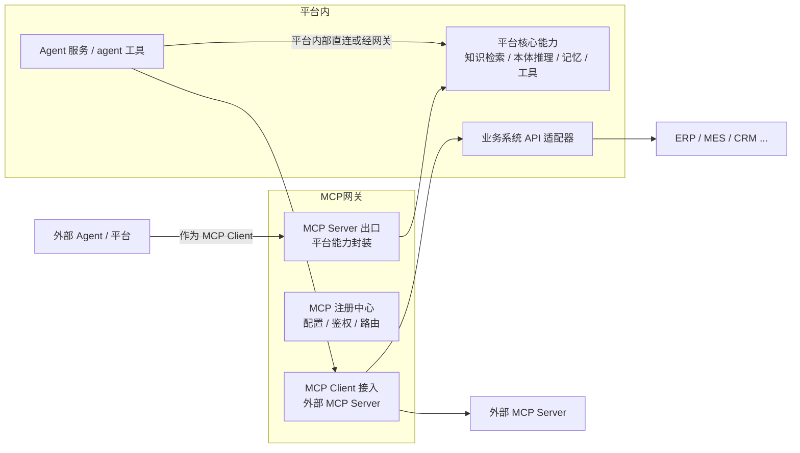

# 05 - MCP 平台能力（能力出口 + 外部接入 + 业务系统集成）

> 状态：v0.1 草案 | 依据：《本体智能研究报告 1.0》、MCP 协议规范、平台需求
>
> MCP 网关是平台的**战略组件**而非可选项：Palantir（Ontology MCP）、微软（Fabric IQ 经 MCP 开放）、Google（全线服务默认 MCP）三家头部厂商已把 MCP 做成本体对外服务的事实互操作接口。

---

## 1. 双向定位



| 方向 | 形态 | 说明 |
| ---- | ---- | ---- |
| **能力出口** | 平台作为一个（或多个）MCP Server | 把知识检索、本体推理、记忆读写、业务动作等封装为 MCP tools/resources/prompts，供平台内 agent 工具与**外部 Agent 系统调用**——这是"本体即服务"的落点 |
| **能力接入** | 平台作为 MCP Client/Host | Agent 可配置接入外部 MCP Server（官方注册表或私有部署），扩展平台外能力 |
| **业务系统集成** | 业务 API → MCP tool 映射 | 把 ERP/CRM 等业务系统接口（REST/API）适配为带语义标注的可执行工具，供 Agent 决策后调用，形成行动闭环 |

---

## 2. 能力出口：平台 MCP Server 设计

### 2.1 暴露哪些能力（初版清单）

| MCP 能力类型 | 暴露内容 | 对应平台服务 |
| ---- | ---- | ---- |
| tools | `knowledge.search`（GraphRAG local/global 检索） | 知识库 |
| tools | `ontology.reason`（一致性校验/隐含推理）、`ontology.validate`（SHACL 校验） | 本体核心 |
| tools | `ontology.query`（本体 SPARQL/Cypher 查询） | 本体核心 |
| tools | `memory.read / memory.write`（按层授权） | 记忆服务 |
| tools | `action.invoke`（业务动作，来自本体"行动/约束逻辑"类，经权限校验后回写业务系统） | MCP 网关 × 业务适配 |
| resources | 本体模式（TBox 摘要）、领域术语表、知识卡片 | 本体核心 |
| prompts | 领域任务模板（如"基于本体的思维链：获取对象→提取数据→计算指标"） | 知识库 |

> 设计要点：**动作类 tool 必须携带本体语义标注**（对应哪个业务对象、触发哪条规则、需要什么权限），这是平台区别于"裸 MCP 工具堆"的地方——外部 Agent 调用平台时拿到的是"可理解、可校验"的业务算子，而非无语义的 HTTP 接口。

### 2.2 安全与治理

- **鉴权**：API Key / OAuth2；外部 Agent 按 tenant 隔离；
- **授权**：工具级 + 数据级（行级/字段级）权限，动作类工具需二次确认策略（human-in-the-loop 可配置）；
- **审计**：所有 tool 调用留痕（调用方、参数、结果、耗时），与本体行动层的权限控制对齐；
- **限流**：按租户/工具维度限流配额。

---

## 3. 能力接入：外部 MCP Server 管理

- **注册**：管理员配置外部 MCP Server（stdio / HTTP transport、连接参数、凭据托管）；
- **发现**：工具清单自动拉取（MCP `tools/list`），展示给 Agent 与管理员；
- **治理**：外部工具默认"不可信"，需审核开启；按 agent 工具/用户维度授权可见性；
- **失败隔离**：外部 MCP 不可用时熔断降级，不阻塞 Agent 主流程。

> 参考生态：MCP 官方 servers 仓库、mcp.so、Smithery 等注册表可作为外部 MCP 的发现来源。

---

## 4. 业务系统集成

**映射模式**（行动层的核心）：

```
业务系统 API → 适配器（鉴权/参数映射/重试） → MCP tool 注册（带本体语义标注） → Agent 调用
     ↑                                                                        │
     └──────────────── 执行结果回流（更新本体实例 + 记忆） ←────────────────────┘
```

- 适配方式：OpenAPI/Swagger 导入自动生成工具描述 + 人工补充语义标注（对应本体对象/行动类）；
- 高风险动作（支付、冻结、删除类）必须绑定本体"约束逻辑"校验 + 人工审批开关；
- 每个业务工具的调用结果**必须回流**：写回本体实例状态（行动闭环的"更新数据"一环）与记忆服务。

---

## 5. 与其他服务的关系

- **Agent 服务**：平台托管的 agent 工具优先经 MCP 网关获取平台能力（也可内部直连优化性能）；
- **本体核心**：MCP 出口暴露的每个动作/工具都应在本体中注册（行动类实体），实现"规则约束 + 动作执行"一体；
- **插件服务**：外部 MCP Server 可封装为平台插件上架插件市场（05 与 06 的衔接点）；
- **工具集服务**：MCP tools 与本地 tools 统一进工具注册中心，Agent 侧视图一致。

---

## 6. MCP 规范要点与待办

**规范版本跟踪**（详见 [02 篇](./02-Agent服务与协议.md)）：
- 2025-06-18：Streamable HTTP 取代旧 HTTP+SSE 远程传输（stdio 仍为本地标准传输）——平台网关的远程传输以此为准；
- 2025-11-25：引入 Tasks 长任务能力、URL-based elicitation；
- 当前 latest 2026-07-28：Tasks 转为 opt-in 扩展——网关实现需兼容 2025-06-18 / 2025-11-25 两版能力协商。

**安全红线**：工具的 `annotations`（readOnlyHint 等）属不可信元数据，**不能作为授权依据**——权限判断只认平台侧的 scope 声明与 ACL。

剩余待办：
- [ ] 平台 MCP Server 技术栈（Python FastMCP / TypeScript SDK）与 Agent 服务同栈决策
- [ ] 业务系统首个集成目标（哪个 ERP/CRM）与 OpenAPI 导入 PoC
