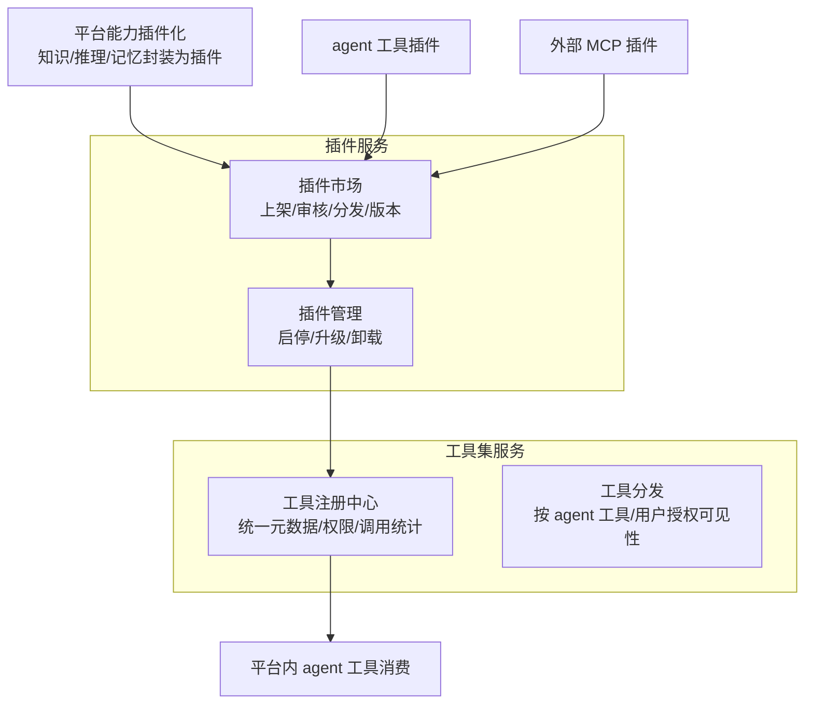

# 06 - 插件与工具集（插件市场 + 工具注册管理）

> 状态：v0.1 | 调研时间：2026-09 | 依据：MCP Registry 规范、Dify/Coze/LangChain Hub 官方资料、安全研究
>
> 工具集服务管"单件"（工具的注册/元数据/权限），插件服务管"商品"（打包、上架、分发、生命周期）。

---

## 1. 两个服务的关系



用户需求对应：

| 需求 | 承载 |
|---|---|
| 为 agent 提供插件市场 | 插件服务（市场 + 管理） |
| 管理 agent 工具插件 | 插件服务·插件管理 → 工具集·注册中心 |
| 平台能力通过插件被 agent 工具接入 | 平台能力插件化（P1，与 [05-MCP](./05-MCP平台能力.md) 出口衔接） |
| 为 agent 工具提供工具、管理注册 agent 工具 | 工具集服务 |

## 2. 产业参照

| 平台 | 机制要点 | 可借鉴 |
|---|---|---|
| **OpenAI GPTs / Actions**（历史） | 插件 = `ai-plugin.json` + **OpenAPI schema** 描述 REST API；演化为 GPT Actions | "OpenAPI 即工具描述"的行业惯例 |
| **Dify** | 1.0 起插件系统解耦为独立组件 **dify-plugin-daemon**（应用与外部世界的安全桥梁，运行时隔离）；**Marketplace** 分发模型/工具/Agent 策略/扩展五类插件；独立 **sandbox 容器**执行代码 | 插件运行时与主应用解耦 + 沙箱隔离 |
| **Coze（扣子）** | 插件商店（官方/个人）；自定义插件 = 已有 API 经参数配置封装（鉴权/入参出参），测试后发布 | 低门槛"API → 插件"封装流程 |
| **LangChain Hub** | prompt 集合共享平台（smith.langchain.com），程序化上传/拉取 | prompt/技能类资产的分发形态 |
| **MCP Registry 生态** | 官方 Registry（`server.json` 元数据，基础设施定位）；**Smithery**（≈MCP 界 Docker Hub，7000+ servers，发布者所有权验证）；mcp.so、Glama、PulseMCP 为目录 | `server.json` 元数据规范 + 所有权验证 |

## 3. 工具注册的元数据标准

- **Function calling schema**（OpenAI 风格）：`name + description + parameters(JSON Schema)`——最小工具描述，事实标准；
- **MCP tool manifest**：`name`、`description`、`inputSchema`（JSON Schema）、`annotations`（readOnlyHint、destructiveHint、idempotentHint 等提示性注解——**规范明确 annotations 属不可信元数据，不能作为授权依据**）；
- **OpenAPI 3.x**：GPT Actions/Dify/Coze 用于把 REST API 批量转工具；
- **工程问题**：工具多时 schema 占上下文（案例：12 个 MCP server ≈14k tokens）→ 需 **Tool Search / 按需加载 schema**；
- **安全面**：工具 description/inputSchema 是 **prompt injection 与工具投毒**的攻击载体（arXiv《When MCP Servers Attack》2025-09 等）——审核与隔离必须前置。

## 4. 平台设计方案

### 4.1 插件格式——MCP 为主轨

- **主轨**：插件即 MCP Server（远程优先 Streamable HTTP，本地支持 stdio）；元数据对齐官方 **`server.json`** 并做平台扩展：分类/标签、版本、变更日志、**所需权限 scope**、签名、兼容协议版本区间；
- **辅轨**：REST API 插件——提交 OpenAPI 3.x 文档，平台自动转换为 MCP 工具/function calling schema（继承 GPT Actions/Dify/Coze 惯例）；
- **提示词/技能类资产**：参考 LangChain Hub 单独分区（SKILL.md 格式，与主流 agent 工具的技能体系兼容，见 01 篇）。

### 4.2 运行时隔离——参考 Dify plugin-daemon 模式

- 插件运行时与主应用**解耦为独立守护进程/容器**；
- 代码执行型插件进独立 sandbox（容器 + 网络策略；高安全要求可上 gVisor/Firecracker 级隔离，按威胁模型选择）；
- 全程出网白名单与资源配额。

### 4.3 权限模型

- 声明式 scope（读写哪些资源/数据类别）+ 调用时用户确认；
- **annotations 仅作 UI 提示、不作授权判断**（MCP 官方安全原则）；
- 宿主在调用任意工具前获得显式同意；高风险动作走 [05 篇](./05-MCP平台能力.md) 的二次确认策略。

### 4.4 审核上架流程

```
提交（server.json + 清单校验）
  → 自动化门禁（schema 合法性、版本协商测试、静态扫描、工具描述投毒检测、依赖审计）
  → 人工审核（敏感类目）
  → 发布者所有权验证 + 平台签名（参考 Smithery 与 A2A 签名卡思路）
  → 上架
  → 运行期持续监测（行为异常下架）
```

平台内部 Registry 直接复用/兼容官方 MCP Registry 的 `server.json` 规范，未来可与其互操作。

### 4.5 工具集服务设计

- **统一注册中心**：MCP tools、本地 tools、业务系统 API 适配工具统一登记（名称/描述/schema/提供方/语义标注——业务工具关联本体"行动"类，见 [03 篇](./03-知识库与本体核心.md)）；
- **分发**：按 agent 工具/用户/租户维度授权可见性；Tool Search 按需下发 schema 防止上下文爆炸；
- **观测**：调用统计、成功率、延迟、成本归因——反哺插件市场的排序与下架决策；
- **agent 工具注册**：平台托管的 agent 工具（claude/pi/nanobot 等）本身也注册为一类"工具提供方"，其暴露的能力经同一注册中心管理。

## 5. 待办与开放问题

- [ ] 插件清单格式定稿（server.json 扩展字段评审）
- [ ] 沙箱方案选型（Docker 网络策略 vs gVisor/Firecracker）威胁模型分析
- [ ] 工具描述投毒检测的具体实现（静态规则 + LLM 审查双轨）PoC
