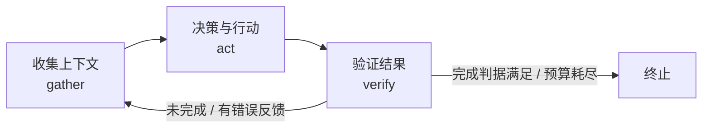
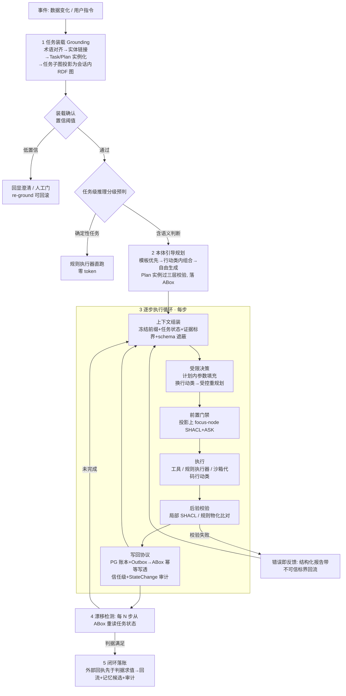

# 07 - Harness Agent 解剖与本体骨架

> ⚠ 2026-09-26 重锚定：文中「架构设计 00/01 篇」指已归档的 React 路线旧稿（docs/archive/架构设计-React路线-2026-09/），仅作历史参照；现行架构权威为 [docs/architecture/01](../architecture/01-总体架构与分层.md)，本文增量设计（任务本体九类/四通道能力层/写回跨库协议等）的合入清单登记在 [docs/代办任务/](../代办任务/README.md)。

> 状态：v0.2 评审修订版 | 日期：2026-09-26 | 评审记录：[_qa/07-多专家评审与工程头脑风暴](./_qa/07-多专家评审与工程头脑风暴.md)（五专家评审，9 项 P0 中 8 项已在本版落实，试点行业选择待用户裁决） | 依据：Anthropic 工程博客（Building Effective Agents / Effective Context Engineering）、Manus 上下文工程博客、SWE-agent（ACI）、DeepSeek DSec 技术报告（../Dsec/DSec-技术报告.md）、01 篇五工具调研、架构设计 00/01 篇
>
> 本文回答四个问题：**harness agent 到底是什么**（核心模块、核心机制、工程痛点）；**为什么 ontology 是 harness 的骨架**而不是挂在旁边的知识库；**任务执行中 agent 如何"按 ontology 行事"**——本体原生 agent loop 的运行时设计；**能力层如何可插拔**——新能力经插件直接接入、不动 harness 内核。
>
> **v0.1 → v0.2 修订摘要**（响应评审 P0/P1）：① 门禁落**任务级 RDF 投影**（解决 Neo4j 无 SPARQL 的求值载体）；② ABox 事实分**信任级**、外部回执先于判据求值（解决判据自证）；③ 写回**跨库协议**（PG 账本 + Outbox + 幂等写透，裁决双主）；④ 规划/循环分工重定义（计划内参数填充 + 受控重规划）+ **计划模板优先**；⑤ 新增**沙箱代码行动类**自由执行通道；⑥ 装载确认与 re-ground 回滚；⑦ 任务本体扩至 **9 类**（增 Plan/dependsOn/FailureMode/StateChange/Executor 与信任级）；⑧ 门禁基线平台所有不可短路；⑨ v1 出口控制降级承诺；⑩ KV-cache 方案改为遮蔽式并给绝对预算；⑪ 新增威胁模型一节；⑫ 行业落地三机制（具名客户验收 / M3 拆独立计费产品 / 信创备选位）。

---

## 1. 定位澄清：什么是 harness agent

### 1.1 模型 ≠ Agent

LLM 本身只是一个**无状态、概率性的文本函数**：没有手（不能执行任何操作）、没有时钟（不知道当下）、没有账本（不知道花销与进度）、每次调用即一次独立求值。把模型变成能干活的执行体，靠的是包在外面的整套工程装置——**harness**（挽具/支架，取自测试工程 test harness 一词：把动力传导到实际负载上的装置）。

```
Agent = 模型（概率推理引擎） + harness（感知 / 行动 / 记忆 / 约束的确定性执行体）
```

01 篇调研的五个工具全部是 harness 形态：Claude Code 是官方 harness，pi 是极简可编程 harness，nanobot/openclaw/hermes 各自是带网关与记忆的 harness。它们差异只在侧重点（渠道、扩展机制、模型接入），**主干是同一个**。

### 1.2 平台视角（本文的立场）

- 平台的"平台原生 agent 运行时"（架构设计 01 篇 2.1）= **自研一个 harness**；
- 被托管的 nanobot / pi / claude / openclaw / hermes = **别人的 harness**，经插槽协议统一收编；
- 平台整体 = **harness 的宿主 + 语义基座**：给每一个 harness（自研与外来）供给本体、知识、记忆、工具。

"我们的 agent 首先是 harness agent、核心骨架是 ontology"的确切含义：**自研 harness 的循环、上下文、工具、校验都以本体为结构基准**（§5.1 将其展开为感知/行动/验证/触发四个运转面）——本体不是检索语料（RAG 素材），而是 harness 得以立起来的骨架。这是与"本体 + RAG 问答"路线的本质区别。

### 1.3 workflow 与 agent 的边界

Anthropic《Building Effective Agents》的建构块：以 **augmented LLM**（模型 + 检索/工具/记忆）为原子，组合出五种 workflow 模式（链式/路由/并行/编排者-工作者/评估者-优化者）；**agent**（模型动态自主决定过程）只在开放性问题下使用。

平台的立场是推理分级（00 篇设计原则 3）在 agent 形态上的延伸：**能用 workflow 的不用 agent loop**。本体正是把任务切成两段的那个工具——确定性步骤走规则执行器（workflow），语义判断步骤才进 LLM 循环（agent）。见 §6.2。

---

## 2. Harness 解剖：一条主干循环 + 六个核心模块

### 2.1 主干循环（agent loop）

Claude Code 官方表述：**gather context → take action → verify work → repeat**。每圈从环境读反馈、做一次决策、执行一次行动、用验证结果修正下一步，直到完成判据满足、预算耗尽或被权限阻塞。



循环本身很简单，工程含量全在**每一圈的质量**上：喂给模型什么上下文、给它哪些工具可选、错误如何回流、何时压缩、何时升级人工。

### 2.2 六个核心模块

| # | 模块 | 职责 | 关键机制 | 典型失效模式 | 平台落点（架构设计 01 篇） |
| ---- | ---- | ---- | ---- | ---- | ---- |
| 1 | **上下文引擎** | 组装/维护每圈喂给模型的窗口 | 系统提示词"恰当高度"；compaction（摘要重启窗口）；结构化笔记（NOTES/todo 外置状态）；just-in-time 按需检索 | 上下文腐烂（context rot）：越长召回越差 | agent_service 上下文组装器 + L1 记忆 |
| 2 | **工具系统（ACI）** | 模型与环境之间的接口层 | schema 按需下发（Tool Search）；命名空间防混淆；**错误信息为模型设计**（返回可操作的修复线索而非静默失败） | 工具描述含糊/过载 → 选错工具 | 工具集服务 + MCP 网关 |
| 3 | **权限与安全门** | 控制哪些行动可自动执行 | allowlist / 需审批两级模式；沙箱边界；**所有外部输入（工具结果、证据、记忆、错误回流）统一视为不可信**（防注入） | 高危动作误执行；间接注入 | IAM + 审批中心 + 06 篇门禁 |
| 4 | **子代理编排** | 并行与上下文隔离 | orchestrator-workers；子代理用干净窗口探索，只回传**结构化 Artifact**（防千字摘要丢精确 ID/数值） | 主代理窗口被探索垃圾撑爆 | agent_service AgentSlot 协议 |
| 5 | **记忆与技能** | 跨圈、跨会话的状态与程序性知识 | 分层记忆（会话→用户→组织）；SKILL.md 程序记忆；hooks 生命周期注入 | 经验不沉淀，每次从零开始 | 记忆服务四层 + 技能服务 |
| 6 | **事件流与可观测** | 过程外显与事后归因 | AG-UI 式 SSE 事件流；trace_id 贯穿；token/成本记账 | 黑盒不可排障、成本失控 | 网关 SSE + 审计与观测 |

**要点**：这六个模块中，1/2 决定下限（每圈决策质量），3/4 决定安全边界，5 决定长期价值，6 决定可运维性。平台已定稿架构对六个落点都有承接——本文补的是把它们**钉在骨架上**的方式（§5、§6）。

---

## 3. 核心机制（五条工程规律）

解剖之外，harness 设计有五条被反复验证的机制层规律：

1. **上下文是有限资源**。Anthropic 提出 attention budget：窗口越长召回越差（context rot），目标是"最小高信号 token 集"。因此：提示词取恰当高度（既不教条也不含糊）、few-shot 用典型样本而非穷举、数据 just-in-time 拉取（存轻量标识符，用时再取）——而不是预载一切。

2. **KV-cache 效率是隐性成本线**。Manus 的实测教训：提示词前缀必须稳定（prompt 随时间戳漂移会让缓存全灭）；上下文 append-only；需要"隐藏"工具时用 logits 遮蔽（masking）而不是增删工具定义（那会动前缀、废掉缓存）。上下文组装器的实现顺序必须按"稳定→易变"排列，工具选择用**遮蔽而非增删**（§6.3 落实）。

3. **工具即接口（ACI）**。SWE-agent 的核心发现：为模型设计的接口质量与模型能力同等重要。工具描述是写给模型读的 API 文档；schema 精确、命名不冲突、**错误响应自带修复指引**（"文件已被外部修改，请重读后再编辑"而不是裸抛异常）。

4. **验证器在环（verifier in the loop）是最大杠杆**。模型是概率的，但**校验可以是确定的**：编译器、测试、SHACL、规则引擎都是零幻觉的裁判。harness 的高级形态 = 每个行动后面站着一个确定性校验器，把"概率输出"逐圈拉回"合法状态"。这是本体推理分级（03 篇 2.3）在 harness 中的真正位置——**不是锦上添花的问答增强，而是每圈的裁判**。但裁判本身必须防篡改（门禁基线平台所有、事实分信任级，见 §6.7）。

5. **控制平面与数据平面分离**。模型属于数据平面（概率、会漂移）；harness 属于控制平面（状态机、预算、权限、重试、终止判定——确定性策略）。铁律：**策略永远不交给模型**。模型可以说"我想删除这个文件"，能不能删是权限门的事；模型说"任务完成了"，完没完成是完成判据（可校验谓词）说了算——且判据只认**外部系统回执**，不认 agent 自己写的状态（§6.7 威胁 1）。

---

## 4. 工程核心痛点 → 为什么需要 ontology

通用 harness 对下列痛点都有缓解手段，但几乎全是"软"的（提示词、笔记、压缩、自觉）。ontology 提供的是"硬"的（类型、公理、可校验状态）——这就是骨架的含义。

| # | 痛点 | 表现 | 通用 harness 的缓解 | 本体骨架的增量贡献 |
| ---- | ---- | ---- | ---- | ---- |
| 1 | 上下文膨胀与衰减 | 长会话召回率下降、中间内容被"遗忘" | compaction、子代理隔离、just-in-time 检索 | **TBox 摘要替代全量文档**：领域知识压成结构化短摘要注入，细节按需经 GraphRAG 拉取 |
| 2 | 长程目标漂移 | 20 步后忘记最初目标、自说自话宣布完成 | todo 清单、笔记复述（recitation） | **任务状态外置为 ABox 实例**：状态与完成判据是本体对象，每 N 步重读校验，不依赖对话历史 |
| 3 | 工具选择错误率高 | 工具一多就选错、参数瞎填 | schema 精简、Tool Search 按需下发 | **行为类语义注册表**：工具按本体行动类归组，按当前步骤的行动类裁剪候选集（遮蔽式，§6.3）；参数受属性域约束 |
| 4 | 幻觉与不可验证输出 | 编造事实、编造流程步骤 | 提示词约束、RAG 出处 | **SHACL/DL 确定性校验**：每个产物是本体实例，过不了 shape 就不成立；结论附图谱证据路径 |
| 5 | 错误级联 | 一步错步步错，回收成本高 | 重试、checkpoint、人为中断 | **规则前置门禁**：非法状态转移在执行前被投影上的 ASK/SHACL 拦截，错误发生在"便宜"的位置 |
| 6 | 经验不沉淀 | 换个会话从零开始 | 记忆、skills | **本体 = 组织级语义记忆的骨架**（L4）：沉淀的记忆挂在本体节点上，可推理、可对齐，而非自由文本堆 |
| 7 | 权限粒度粗 | 只有"允许/禁止用这个工具" | 审批模式、沙箱 | **规则类 = 策略的语义载体**："冻结账户"类行动的前置条件直接写在规则里，权限随语义走 |
| 8 | 评估困难 | agent 上线前没法系统测 | 人工 eval、轨迹回放 | **能力问题（CQ）+ 轨迹级评测 + 故障注入用例**三层评测集：CQ 验本体可表达性，轨迹验行为面（门禁拒绝/预算耗尽/漂移），DSec 式故障用例验对抗面 |
| 9 | 成本与延迟 | 每步都过 LLM，慢且贵 | 缓存、模型路由、批处理 | **步级推理分级**：确定性步骤由规则执行器直跑，零 token；LLM 只处理语义判断步（§6.2-5） |

一句话总结：通用 harness 让 agent "看起来在干活"，本体骨架让每一步**可校验、可回放、可审计、可恢复**——四个"可"全部来自"状态与行动被形式化成了本体实例"。

---

## 5. 骨架：ontology 如何做

### 5.1 核心论点：本体是 harness 的三个面（+一个触发器）

OB2（对象/行为/规则 + 事件串联）映射到 harness 的运转面，**一一对应**：

| OB2 要素 | harness 的面 | 作用 | 存储/表达（对齐已定稿 ADR） |
| ---- | ---- | ---- | ---- |
| **对象 Object** | 感知面（世界模型） | agent 可感知、可操作的状态空间；ABox 就是 agent 的"现实"；**事实分信任级**（§5.2） | ABox 实例（Neo4j）+ 会话内 RDF 投影（§6.2-3） |
| **行为 Behavior** | 行动面（动作空间） | 工具/行动的语义注册表；**工具是本体行动类的实现**，MCP tool 只是绑定；行动类带 **executionMode**（readOnly / stateful / externalWrite / code）与 **deterministic** 标注（门禁强度与分级路由的依据） | 行动类 + 语义标注（工具集服务） |
| **规则 Rule** | 验证面（约束面） | 前置条件（事前门禁）+ 后置条件/不变式（事后校验）+ 权限策略 | SHACL shapes + SPARQL CONSTRUCT 规则模板（打在会话投影上） |
| **事件 Event** | 触发器（循环的起点） | 什么时候开工：数据变化、用户指令、定时 | 事件总线（Redis Streams + Outbox） |

关键断言：**harness 的每一圈都踩在本体上**——感知时读对象（世界模型），行动时选行为（动作空间），验证时查规则（约束面），启动与回流走事件（触发器）。没有本体，这四个面退化为自由文本和口头约定。

工具与行动类的关系要特别注意：不是"给每个 MCP 工具贴个标签"，而是**先有行动类（业务语义：退款、冻结、派单），再绑定工具实现**（某个业务系统 API / MCP tool）。工具下线换实现，行动类不变——这解决了 harness 最疼的"工具集一变，prompt 和流程全要重写"。executionMode 同时是安全分类学：readOnly 步零审批、externalWrite 步强制审批（§6.4），解决了 v0.1"查询与冻结同级"的分类缺失。

### 5.2 任务本体（Task Ontology，v0.2 九类）

研究 03 篇回答了"**业务世界**长什么样"（标准、订单、设备……），harness 还需要"**任务世界**长什么样"。以下九类随语义层作为**平台标准本体模块**交付，不随行业变：

| 类 | 关键属性/关系 | 对应 harness 机制 |
| ---- | ---- | ---- |
| `task:Task` | 目标（CQ 形式）、输入、状态、预算（max_steps / max_tokens / deadline——判据含 SLA 就必须有期限属性）、所属会话 | 任务状态机、漂移检测的锚点 |
| `task:Plan` | 版本、状态（active / superseded）、失效语义、模板来源（沿用/组合/自由生成） | 计划可版本化、可整体校验、重规划后旧计划归属明确 |
| `task:Step` | **dependsOn**（对象属性，构成 DAG 而非线性序）、绑定行动类、输入/输出产物、状态、序 | 规划单元；并行派发依据；subagent 派发单元 |
| `task:Precondition` / `task:Postcondition` | SPARQL ASK（打在会话投影上）/ SHACL shape 引用（**带版本号**，本体升级可迁移） | 事前门禁 / 事后校验（§3 规律 4） |
| `task:SuccessCriterion` | 终止谓词；**schema 级强制：只能引用 externally_verified 事实**（§6.7 威胁 1） | 终止判定——由 harness 求值，不由模型宣称 |
| `task:Artifact` | 产物本体实例 + 出处指针（doc_id + chunk_id + span）+ **信任级** | 可追溯；对齐"候选非成品 + 出处指针"底线 |
| `task:FailureMode` | 失败类型、重试计数、**补偿行动类绑定**（重试超限后的回滚路径） | 失败降级；补偿闭环 |
| `task:StateChange` | 审计元类：主体类型（model / rule_engine / human）+ 主体 ID + 决策 ID + **能力包版本** + 时间 | 任取一条 ABox 变更可归因（评审提问 9）；回放调试的元数据 |
| `task:Executor` | 执行者绑定：平台循环 / subagent / 规则执行器 / 审批人 / 能力包 | 并行派发与人工接管的执行语义 |

**信任级（贯穿全设计的概念）**：ABox 中影响判据的事实分两级——`externally_verified`（业务系统回执、回调、双向核对写入，写入主体非 agent 循环）与 `agent_attested`（agent 从工具结果转写的中间状态）。SHACL 强制：SuccessCriterion 的谓词图只能 touching externally_verified 节点；业务回执**先于**判据求值写入（§6.2-6）。

对 GB/T 48000.3 的关系（修正 v0.1 表述）：国标附录 A 的八/十项元数据是**标准域表单模板**，任务本体的执行语义元数据（查询文本、shape 版本引用、状态机公理）国标无对应——因此任务是"**元数据表单沿用 + 任务域自建 delta**"，不是"同构"。

### 5.3 建模顺序与命名空间

- 业务本体按 03 篇六步实战（领域理解 → 概念层级 → 属性关系 → 业务公理 → 评审 → 推理测试），三档方案按需选；
- 任务本体不参与行业建模，随平台内置；两套本体按国标第 9 章扩展原则**分命名空间隔离**（如 `ex: 业务` / `task: 平台`），互不污染；
- 建模的完成标志不是"概念齐了"，而是**能力问题可以被 SPARQL/DL 表达并求值**——CQ 同时是建模验收标准、回归评测集的骨架（行为面评测另加轨迹级与故障注入用例，§4-8）。

---

## 6. 执行设计：本体原生 agent loop（运行时）

### 6.1 阶段总览



（顶层级为五阶段；循环内的步级推理分级路由见 §6.2-5，不单列为顶层阶段。）

### 6.2 各阶段设计

**1）任务装载（Grounding）+ 装载确认**。任务文本 → 术语对齐（terminology 模块，租户内执行）→ 实体链接到 TBox → 实例化 `task:Task`（含预算与 SuccessCriterion）→ **任务子图投影**：抽取任务相关 TBox 子图 + 相关规则/shapes，构建会话内 rdflib 投影图（门禁的求值载体，见第 3 步）。随即做**任务级推理分级预判**：整个任务命中既有规则/固定流程（如"查欠费→停机"链路）则由规则执行器直跑，不进 LLM 循环。

**装载确认（解决"装载即判决"）**：对齐/链接是概率产物，而判据建立在它之上——错误目标会被"确定性"地执行到底。防线：① 实体链接置信度低于阈值（起步 0.8）→ 回显"我理解的任务"请用户确认（前端一次点击，不是自由文本）；② 任何时刻支持 re-ground：重对齐后生成新 Plan 版本、旧 Plan 置 superseded，已执行步按 §6.4 恢复语义对账；③ 判据最小化原则：SuccessCriterion 引用的事实越少越好，建模评审时把"判据审查"作为门禁。

**2）本体引导规划（三档策略 + 三层校验）**。规划收敛为三档，按优先级递减：

| 档 | 触发 | 产物 | 说明 |
| ---- | ---- | ---- | ---- |
| **模板匹配** | 任务模式命中**计划模板库**（已验证计划的固化复用，DSec pack_diff 精神） | 模板实例化 + 参数化 | 零生成成本，通过率≈1；模板库随运营增长——经验→规则的通道（§6.2-6） |
| **行动类内组合** | 无模板命中 | 在相关行动类集合内做排序/组合/参数化 | 生成空间受限，通过率可控；LLM 的主要工作档 |
| **自由生成**（兜底） | 长尾任务 | 自由 Step 图 + 沙箱代码行动类 | 配额受限（每任务至多 1 个自由生成计划），产物必须过三层校验 |

计划落为 `task:Plan` 实例（v0.2 含 `dependsOn` DAG），**三层校验**（修正 v0.1"整体过 SHACL"的过 claim——无环、产消匹配等超出 SHACL 邻域局部性）：
1. **节点层**：每步行动类存在、参数域、基数——SHACL（毫秒级）；
2. **图层**：DAG 无环（SPARQL property path）、跨步产物产消匹配、互斥与顺序约束——SPARQL 图结构约束；
3. **语义层**：前置/后置类不相交、整体一致性——DL 推理（低频，规划期一次）。

校验通过的计划才有资格执行。DAG 中无依赖的 Step 并行派发 subagent（编排结构来自计划图），并行语义见 §6.4。**放弃阈值**：规划修复循环上限 2 轮，仍未通过 → 转人工/模板；首轮通过率与修复轮数是 M4 的实测指标（§10）。

**3）逐步执行循环**（核心伪代码，v0.2 重定义规划/循环分工与门禁载体）：

```python
while not eval_success_criterion(task) and budget.ok(task):     # 判据只认 externally_verified
    ctx = assemble_context(
        frozen_prefix,             # 宪法 + TBox 摘要(装载时冻结, 任务级常量, 缓存断点1)
        plan_and_schemas,          # 计划图 + 行动类 schema(计划期冻结; 候选集用遮蔽限定, 不增删定义)
        task_state_from_abox,      # 任务状态(ABox 实时读)
        evidence_marked,           # GraphRAG 证据路径(带出处 + 不可信标界)
    )                              # 顺序: 稳定→易变; 绝对预算见 §6.3
    decision = llm(ctx)            # 受限决策: 计划内参数填充
    # 模型要求偏离计划(换行动类/插步) → 受控重规划通道:
    #   新子图重过三层校验 → 新 Plan 版本 → 审批(偏离已验证计划默认需审批)
    if not rule_gate(decision):    # 前置门禁: 会话投影上 focus-node SHACL + SPARQL ASK, 毫秒级
        decision = repair(decision, structured_error)   # 错误即反馈, 回流重决策, 上限 2 轮
    result = execute(decision)     # 工具 / 规则执行器 / 沙箱代码行动类
    report = validate(result)      # 后验: 投影上局部 SHACL + 物化比对
    if report.has_error:
        result = repair(result, report)  # 重试有上限 → FailureMode 补偿行动类
    commit(result)                 # 写回协议(见下): PG 账本 → Outbox → ABox 幂等写透
    if step_no % N == 0 or after_failure_or_branch:
        re_ground(task)            # 漂移检测(§6.2-4), N 起步 5, 自适应
```

**门禁求值载体（任务级 RDF 投影，解决 P0-①）**：Neo4j 无 SPARQL 端点、rdflib 内存图没有 ABox——因此门禁不打在 ABox 存储上，而打在**装载时构建的会话内投影图**上：任务相关 TBox 子图 + 激活 shapes + 当前任务 ABox 子图的内存合并图。每步门禁只做 **focus-node 局部校验**（毫秒级成立条件：投影图千级三元组 + 激活 shape 数十以内，M4 PoC 实测）；全图 SHACL 与 DL 一致性只在**规划期与检查点**跑（低频批量，对齐 03 篇推理分级）。投影与 ABox 的同步由写回协议保证。

**写回协议（跨库一致性，解决 P0-②，裁决双主）**：
- **主本裁决**：`ABox = 任务执行状态的语义主本`（判据求值、漂移检测、崩溃恢复读它）；`PG = 审计与恢复账本`（每步结果快照 + 工具原始输出指针 + StateChange 归因）。PG 中的 Task 领域对象（架构设计 01 篇 2.1）**降级为注册元数据**（归属、租户、会话），不承载执行状态。
- **协议**：① 步结果先落 PG（同事务：步快照 + 审计 + Outbox 事件）；② Outbox 驱动 ABox 写透，幂等键 `(task_id, step_no)`，失败可重放；③ 判据求值前强校验 ABox 与 PG 账本步数一致，不一致挂起对账；④ parallel 步按计划 DAG 拓扑序下发 AG-UI 事件，写回按对象级**写意图锁**串行化互斥行动类（TOCTOU 防线——互斥声明来自本体规则，运行时执行）。
- **每次写回携带**：信任级标注（externalWrite 类行动必须等业务回执才能写 externally_verified）、StateChange 归因元组（主体/决策 ID/能力包版本）。

**4）漂移检测（recitation 的本体版）**。任务状态、已完成步骤、判据余量全部在 ABox，每 N 步重新拉取注入（N 起步 5；失败或分支后强制触发）。附带收益：进程崩溃后从 PG 账本对账 ABox 恢复——`validated` 步跳过、`executing` 步按账本**复用记录结果**而非重放（非幂等动作不重复副作用，补全 DSec 的另一半），工具原始输出按步落 PG/MinIO 供回放调试（§6.4）。

**5）步级推理分级路由**。判定依据 = 行动类的 `deterministic` 标注 + 模板精确匹配（含参数约束闭包）：命中者规则执行器直跑，零 token；失配**保守回退 LLM**（宁可多花 token，不可误路由——语义步被规则执行是硬错误）。误路由率是语义层巡检指标。该判定是循环内每步的分支条件（评审指出其不可延期），标注质量纳入本体建模评审。

**6）闭环落账（求值顺序反转，解决判据自证的时序面）**。执行完成 → **externalWrite 类行动的业务回执先写入 ABox（externally_verified）** → 判据求值（只读 externally_verified 事实）→ 通过后才算任务成功 → 结果回流业务 API（OB2 逆向闭环）→ 产出 L2 记忆候选 → 审计归档。**运营闭环（遥测驱动晋级）**：记录每类决策的"规则可判定率"，高频 LLM 决策模式固化为计划模板/规则模板**候选**（人工终审）——模板库增长即经验沉淀，也是冷启动后规则化率自动上升的机制。

### 6.3 每步的上下文预算（v0.2：绝对 token 数，128k 窗口起步值，需实测调参）

| 序 | 区块 | 内容 | 预算 | 稳定性（KV-cache） |
| ---- | ---- | ---- | ---- | ---- |
| 1 | 领域宪法 + 系统提示 | 角色红线、输出规范 | ~2k | 稳定（缓存断点 1） |
| 2 | TBox 摘要 | **任务相关子图抽取 + 自然语言化**（非 Turtle 原文——三元组语法 token 密度高且模型理解差）；装载时**冻结为任务级常量** | ~4k | 稳定（缓存断点 2） |
| 3 | 计划图 + 行动类 schema | 计划图序列化 + 当前可选行动类 schema；**候选集用遮蔽/tool_choice 限定，不增删 schema 定义**（遵守 §3 规律 2） | ~6k | 计划期稳定（缓存断点 3） |
| 4 | 任务状态 | Task/Step 当前实例（自然语言化） | ~2k | 每步变化 |
| 5 | 证据 | GraphRAG 图谱路径 + 出处，**带不可信标界** | ~8k | 每步变化 |
| 6 | 对话与工具结果余量 | 本圈反馈、错误报告（同样标界） | ~8k | 最易变 |

合计工作集 ~30k（128k 窗口的 23%），余量给 compaction 缓冲。**命中预期**：断点 1-3 跨步全命中（~12k），4-6 每步重算——v0.1 按行动类每步换 schema 的方案废除（每次换类打穿后半段缓存，与自引 Manus 教训矛盾）。

### 6.4 状态机、审批语义与恢复

- **Task 状态机**沿用架构设计 01 篇，下沉 **StepState**：`planned → gated → executing → waiting_approval → validated → failed(可修复/终态)`。状态迁移受任务本体规则约束（非法迁移被投影上的 SHACL 拒绝）。
- **审批语义（补全 v0.1 缺口）**：进入 `waiting_approval` 时**暂停预算计时**；**批准对象 = 行动类 + 参数哈希 + 计划图版本**（批准后参数不可替换，换参数重新审批）；超时转 `suspended`（挂起≠失败，人到场后恢复续跑）；同质门禁（同行动类+同参数模式）**聚合审批**防批准疲劳。externalWrite 类行动强制过此路径（readOnly/stateful 按租户配置）。
- **恢复语义**（崩溃/抢占后）：从 PG 账本对账 ABox；`validated` 步跳过；`executing` 步复用账本记录结果（非幂等动作**复用不重放**）；`waiting_approval/suspended` 恢复等待。**回放调试器**：状态在 ABox + 事件流在 SSE + StateChange 归因 ⇒ 任意任务可时间旅行重放，排障/评测/审计同一套机制。
- **AG-UI 事件映射**：装载→`RUN_STARTED`、规划→`STATE_DELTA`（计划图）、每步→`TOOL_CALL_*`、门禁拦截/校验失败→`STATE_DELTA`（附结构化报告）、审批→状态事件、终止→`RUN_FINISHED`。事件按 DAG 拓扑序下发。

### 6.5 失败模式与降级（v0.2 扩充）

| 失败模式 | 表现 | harness 响应 |
| ---- | ---- | ---- |
| 幻觉行动类 | 模型选了不存在的行动 | 行动类来自 TBox 枚举 + 术语对齐，未对齐实体直接拒（不猜） |
| 参数不合规 | 越界/类型错 | 前置门禁拦截，结构化 SHACL 报告（带标界）回流修复 |
| **装载错误** | 对齐/链接错 → 目标错 | 装载确认（置信阈值 + 回显）+ re-ground 回滚（§6.2-1） |
| **判据操纵** | agent 写"合法"状态骗判据 | 信任级 + 判据只认 externally_verified + 回执先于求值（§6.7-1） |
| **注入** | 证据/记忆/技能/错误回流携带指令 | 统一不可信标界 + task: 命名空间对外只读（§6.7-3/5） |
| 计划不可行 | 执行中步被证明走不通 | 受控重规划：子图重校验 → 新 Plan 版本 → 默认审批 |
| 循环不收敛 | 反复修复同一错误 | 预算/步数上限 → FailureMode 补偿行动类 → 升级审批中心 |
| 本体盲区 | 任务涉及未覆盖概念 | 自由生成档 + 沙箱代码行动类兜底；新概念走知识沉淀候选（候选非成品） |
| 上下文溢出 | 窗口逼近上限 | compaction + 子代理隔离（§2.2 模块 1/4） |

### 6.6 走查示例（电信宽带退单，00 篇行业案例）

事件"用户投诉退单超时" → 装载：对齐"退单/超时"到 TBox，实例化 Task（判据：**业务系统回执**"退单完成且 SLA 达标"），投影构建，置信通过 → 预判：原因查明属语义判断，进循环 → 规划：模板库无命中，行动类内组合生成 Step DAG = 调取工单(查询类) → 定位卡点(语义) → 执行补救行动类(externalWrite，过审批，批准绑定参数哈希) → 循环：调工单步 deterministic 直跑零 token；定位卡点步 LLM 读图谱证据链（带标界）；补救步前置门禁在投影上查"账户状态允许补救" → 落账：补救执行 → **业务回执写入（externally_verified）** → 判据求值通过 → 回流 + L3 记忆候选（卡点原因模式 → 计划模板候选）。

### 6.7 威胁模型与防线（v0.2 新增）

评审指出 v0.1 引了 DSec 恶意行为案例库却没有转化为防线。逐条对应：

| # | 威胁 | 攻击链 | 防线 |
| ---- | ---- | ---- | ---- |
| 1 | **判据自证** | agent（或经注入的指令）写"形状合规"的状态三元组骗过判据——SHACL 约束形状不约束真假 | 事实信任级；SuccessCriterion schema 级只可引用 externally_verified；业务回执先于判据求值（§5.2/§6.2-6） |
| 2 | **校验器私有化** | 恶意能力包提供恒真 gates.pre / 恒过 gates.post | **门禁基线平台所有、不可短路**：信任级判定、判据合法性、行动类枚举校验为内核硬编码；能力包 gate **只增不替**；gates/reasoning 类能力默认禁用、平台复核签名后才可启用（§7.4） |
| 3 | **间接注入** | 知识文档/网页带指令经 GraphRAG 证据块进上下文 | 上下文组装器对证据/记忆/技能/错误回流**统一不可信标界**（分隔、指令层级声明、扫描、截断）；证据块只作数据不作指令 |
| 4 | L1 技能诱导 | 纯提示词技能写"校验失败时直接置 validated" | L1 审核增加"与状态机/判据交互"专项检查；技能无写路径（提示层无代码） |
| 5 | 旁路写 | 外部 MCP `memory.write` 直写 task 命名空间绕开循环 | `task:` 命名空间对平台 MCP 出口**只读**；写路径仅循环 write_back（带 StateChange 归因） |
| 6 | 供应链后门 | 能力包标注与实现不符（规则包故意放松前置） | 行为符合性夹具：由本体公理自动生成正反例测试，上架门禁自动验证语义（§7.4）；知识工程师抽审；IRI 版本迁移策略 |
| 7 | 判据钻营变体（DSec §6.4 类） | 用非常规手段满足判据字面而偏离意图（沙箱代码行动类尤其） | code 类 executionMode 出口最严（默认无网）+ 判据最小化 + 异常轨迹告警 + 回放审计 |

---

## 7. 能力层可插拔设计（参照 DeepSeek DSec/DSH）

> 需求：harness 六模块中除主干循环外的一切"能力"都要可插拔——以后开发任何新能力，经插件或其他通道直接接入，**不动 harness 内核**。

### 7.1 DSec 的三个可移植模式

| DSec 模式（报告出处） | 内容 | 移植到本平台 |
| ---- | ---- | ---- |
| **可组合环境层**（§5.1） | base / workspace / toolkit 是生命周期各自独立的版本化层，沙箱创建时按需叠加（overlayfs 栈）；单体镜像方案的升级成本 O(m·N) 降为 O(m) | 能力不是打进 harness 的单体特性，而是**独立版本化的工件**，按租户/任务组装；升级一个能力不重建整个 harness |
| **agent sandbox + worker container 双组件**（§6.2） | scaffold（DeepSeek Harness）与 scaffold 无关的控制层分离，rollout 状态放持久组件作单一事实源，被抢占后"重连续跑"替代"日志重放" | harness 内核要小，能力外置；任务状态外置 ABox + PG 账本（§6.2-3 写回协议）就是这个"单一事实源"——内核可重启、可替换，状态不丢 |
| **默认拒绝的出口控制**（§6.5、§11-4） | 每沙箱 eBPF 程序按域名/IP/端口白名单过滤、随任务阶段动态更新；AppArmor 对沙箱内 root 同样生效 | 插件（不可信代码）的权限模型**独立于进程身份**：v1 以"容器默认无网 + 宿主白名单代理"近似，eBPF 级语义 v2（§7.5 降级承诺） |

### 7.2 能力清单：什么算"能力"

| # | 能力类别 | 例子 | 循环挂载点 | 现有承载 |
| ---- | ---- | ---- | ---- | ---- |
| 1 | 行动实现（工具） | 查询/退款工具、业务 API | 执行阶段 tools.bindings | 工具集 + MCP（已可插拔） |
| 2 | 规则与校验器 | 行业规则包、SHACL shape 包、自定义 verifier | gates.pre / gates.post | 语义层 rules/validation（内置）→ 接口化后可插；**基线门禁平台所有，包 gate 只增不替**（§7.4） |
| 3 | 上下文供给器 | GraphRAG、记忆召回、TBox 摘要、外部数据源 | context.providers | 语义层（内置）→ 供给器接口化；平台侧租户 scoping 后注入 |
| 4 | 规划策略 | 计划模板库、CQ 驱动规划 | planning.strategies | prompts + 任务本体 |
| 5 | 记忆策略 | 沉淀判定、衰减、召回权重 | memory.policies | 记忆服务（升级 L2→L3 的隐私门禁**不外包**给插件） |
| 6 | 推理引擎 | SPARQL 物化、pySHACL、外挂 Fuseki/Drools | reasoning.engines | 语义层 reasoning（ADR-6 已留替换位）；默认禁用、平台复核 |
| 7 | 执行后端 | 本地进程、容器、microVM、远程沙箱 | 执行阶段的沙箱选择 | v1 Docker Compose；v2 参照 DSec 四后端按任务选型 |
| 8 | 模型渠道 | LiteLLM channel | 模型网关 | 已可插拔 |
| 9 | 技能 | SKILL.md | 提示层注入 | 技能服务（已可插拔） |
| 10 | 事件汇/通知 | 站内信、钉钉、webhook | event.sinks | 通知服务（已可插拔） |

其中 1/8/9/10 在已定稿架构里已经可插拔；**本节真正新增的是 2/3/4/5/6/7 的接口化**——它们目前是语义层与 agent_service 的内部实现，要升级为命名扩展点。

### 7.3 四条接入通道（由轻到重）

| 通道 | 载体 | 适合 | 信任要求 |
| ---- | ---- | ---- | ---- |
| **L0 MCP 工具** | 独立 MCP server | 纯工具能力 | 审核注册（06 篇门禁） |
| **L1 技能** | SKILL.md | 程序性知识（纯提示层，无代码） | 审核上架 + 判据/状态机交互专项（§6.7-4） |
| **L2 能力包 Capability Pack** | server.json 扩展格式：一个包捆绑**工具 + 规则包 + 上下文供给器 + 校验器 + 技能** | 复合领域能力（如"冷链合规包"） | 市场全门禁 + 行为符合性夹具 + 运行期沙箱隔离 + 出口白名单；**gates/reasoning 项默认禁用待平台复核** |
| **L3 内置扩展点** | 平台原生 Python 扩展 API（`register_tool / register_gate / register_context_provider / on(event)`，对标 pi extensions） | 高性能、深集成的能力 | 平台开发者，随版本发布 |

L0/L1 已在架构内；**L2 能力包是本节的核心增量**——市场只卖"工具"太薄，领域能力天然是成套的；L3 保证平台自身演进时内核不腐化。

### 7.4 循环扩展点契约

§6 的执行循环展开为**命名扩展点**，每个扩展点 = 稳定接口（Python Protocol）+ 语义标注 + 清单声明 + 权限 scope + **租户上下文参数**（平台侧校验，插件不得自取——多租户 scoping 契约）：

| 扩展点 | 循环阶段 | 接口语义 |
| ---- | ---- | ---- |
| `context.providers` | 上下文组装 | `(task, step, tenant) -> ContextBlock`，带预算、稳定性标记与**不可信标界** |
| `planning.strategies` | 规划 | `(task, tenant) -> 计划图候选`，产物仍过三层校验 |
| `gates.pre` | 前置门禁 | `(decision) -> GateReport`，投影上毫秒级；**平台基线门禁不可短路，包 gate 只增不替** |
| `tools.bindings` | 执行 | 行动类 → 实现（MCP/本地/规则执行器/沙箱） |
| `gates.post` | 后验 | `(result) -> ValidationReport`，结构化错误供"错误即反馈"回流；同样只增不替 |
| `reasoning.engines` | 分级路由确定性一侧 | 规则物化/约束校验引擎，可替换（ADR-6） |
| `memory.policies` | 沉淀与召回 | 候选判定/衰减/权重策略；**L2→L3 升级门禁不外包** |
| `event.sinks` | 闭环落账 | 领域事件的订阅出口 |

三条铁律（v0.2 修订）：

1. **内核最小化 + 基线不可短路**：循环只认扩展点接口，不 import 任何具体能力；但信任级判定、判据合法性、行动类枚举校验等**安全基线是内核硬编码**，任何通道的能力都只能叠加、不能替换或绕过。
2. **无语义标注不上架，标注必须机器验证**：能力包里每一项必须标注绑定的本体元素（行动类/规则类/概念类）；标注正确性不靠人眼——上架门禁跑**行为符合性夹具**（由本体公理自动生成正反例，验证规则包/gate 语义与标注一致），夹具不过不发签名。
3. **接入即治理**：四条通道进来的能力统一走工具注册中心 + 审批中心，复用 06 篇门禁（清单校验 → 静态扫描/投毒检测 → 夹具符合性 → 敏感类目人工审核 → 签名上架 → 运行期监测）。

### 7.5 组装模型与出口控制（v0.2 降级承诺）

- **能力层栈**（DSec 层叠的移植）：`harness 内核（base）→ 平台标准能力层（任务本体、内置工具、语义层能力）→ 租户能力层（市场安装的能力包）→ 任务级 toolkit（Task 实例按本体引用声明的能力集）`。组装时机在任务装载阶段；**装载时解析并 pin 全部能力包版本**（运行中任务不受市场升级/禁用影响，禁用仅对新任务生效；同一行动类多实现按优先级 + 审批裁决）。
- **与 DSec 的差异声明**：DSec 的层叠物化在文件系统（EROFS/overlayfs）；我们的层是**逻辑装配**（注册表视图 + 按需 schema 下发 + 容器编排），不需要动容器运行时。只有当平台承接"评测/训练型"负载、需要物化任务执行环境时，才引入真实的镜像层叠加（DSec 四后端 + 按需加载，v2 评估）。
- **出口控制（v1 降级承诺，解决评审 P1）**：v1 Compose 单机没有 DSec 的 eBPF 执行点，因此 v1 承诺为——L0/L2 不可信容器**默认完全无网**（`network: none`），数据经宿主侧白名单代理显式传递；确需出网的包逐个人工放行**静态 IP/域名**；"白名单代理 + 阶段策略下发"机制就绪是 **L2 能力包市场开放的前置门禁**（机制就绪前 L2 通道只对平台方签名的包开放）。eBPF 级"任务级、可动态变更、默认拒绝"语义列为 v2。权限判定只认平台 scope + ACL，与容器内进程身份无关（AppArmor 教训）。

---

## 8. 对已定稿架构的对账（增量清单，v0.2）

| 文档 | 位置 | 增补 |
| ---- | ---- | ---- |
| 架构设计 01 篇 | 2.1 Agent 服务 | agent loop 各阶段定义为**命名扩展点**（§7.4），内核只认接口不 import 具体能力，安全基线硬编码不可短路；**PG Task 领域对象降级为注册元数据，执行状态主本在 ABox**（§6.2-3 写回协议）；PG 账本表（步快照 + 工具原始输出指针）加入数据设计；上下文组装器按 §6.3 冻结前缀 + 遮蔽式 schema |
| 架构设计 01 篇 | 2.2 本体核心 modeling | 任务本体**九类**（Task/Plan/Step/Precondition/Postcondition/SuccessCriterion/Artifact/FailureMode/StateChange/Executor）作为**平台标准本体模块**随语义层交付（元数据表单沿用国标 + 任务域自建 delta）；行动类增加 executionMode + deterministic 标注；命名空间与业务本体隔离 |
| 架构设计 01 篇 | 2.6 插件/技能/工具集 | `server.json` 扩展为**能力包清单**：捆绑工具 + 规则包 + 供给器 + 校验器 + 技能，全部带本体语义标注；上架门禁增加**行为符合性夹具**；gates/reasoning 类默认禁用待平台复核；工具注册中心增加扩展点注册表 |
| 架构设计 00 篇 | §7 M2 验收 | 增补：任务本体九类落 Turtle + SHACL；门禁投影 PoC（focus-node 校验 <10ms 目标）通过 |
| 架构设计 00 篇 | §7 M3 验收 | 增补："一份 PDF 进→候选实例→终审→图谱可检索，全程带出处"之外，**"带证据链的合规问答"作为首个可独立计费交付物**拆出（含对"RAG+Dify 基线"的对照记分卡），不等待 M5 完整闭环 |
| 架构设计 00 篇 | §7 M4 验收 | 增补：任务以 Task 实例装载（含装载确认）、计划过三层校验、写回协议跨库一致可演示、漂移检测与崩溃恢复可演示、**首轮计划通过率/修复轮数/门禁延迟实测数**入验收报告 |
| 架构设计 00 篇 | §7 全部里程碑 | 增补：M2 起每个里程碑验收须回答"**具名试点客户**用它解决了什么"——试点行业待裁决（候选：反洗钱合规 / 电力配网；选域准则：知识密集 + 流程协同双高 + 数据可获 + 组织可配合） |
| 架构设计 00 篇 | §3 技术选型 | 增补：图/向量存储的仓储接口补**国产备选位**（TuGraph 等）评估项——目标行业（电力/金融/政务）采购中信创目录是一票否决项，采购前复核 |
| 研究 03 篇 | §2.2 | 补两条：工具与行动类的关系 = 行动类先行、工具是实现绑定；行动类带 executionMode/deterministic 标注 |

## 9. 参考资料

- Anthropic, [Building Effective Agents](https://www.anthropic.com/research/building-effective-agents)（建构块与五种 workflow 模式、workflow vs agent 边界）
- Anthropic, [Effective Context Engineering for AI Agents](https://www.anthropic.com/engineering/effective-context-engineering-for-ai-agents)（attention budget / context rot / compaction / 结构化笔记 / 子代理隔离 / just-in-time 检索）
- Anthropic, Claude Code Best Practices（gather → act → verify → repeat 循环表述）
- Manus, [Context Engineering for AI Agents: Lessons from Building Manus](https://manus.im/blog/Context-Engineering-for-AI-Agents-Lessons-from-Building-Manus)（KV-cache 前缀稳定、append-only、工具 masking、文件系统即上下文、recitation）
- Yang et al., [SWE-agent: Agent-Computer Interfaces](https://arxiv.org/abs/2405.15793)（ACI：接口质量与模型能力同等重要）
- 仓库内：[DeepSeek DSec 技术报告](../Dsec/DSec-技术报告.md)（可组合环境层、agent sandbox + worker 双组件、默认拒绝出口控制、恶意行为案例库——§7 三个模式与 §6.7 威胁模型的出处；DeepSeek Harness/DSH 论文 arXiv 2608.25512 为其 harness 形态的一手参照）
- 仓库内：[01-Agent工具调研](./01-Agent工具调研.md)（五 harness 形态学）、[03-知识库与本体核心](./03-知识库与本体核心.md)（OB2/国标/推理分级）、[架构设计 00/01](../架构设计/00-系统架构总览.md)（落点对账）、[_qa/07 评审记录](./_qa/07-多专家评审与工程头脑风暴.md)（本版修订依据）

## 10. 待办与开放问题（v0.2）

**已由本版解决（自 v0.1 划销）**：判据信任级、门禁求值载体、写回跨库协议、规划/循环分工、自由执行通道、装载确认、Plan/dependsOn、门禁基线、KV-cache 方案、审批语义、恢复语义、不可信标界、威胁模型、并发控制、热插拔 pin、租户 scoping、上下文绝对预算、三层校验、GB/T 表述修正。

**仍开放（按优先级）**：

- [ ] **[用户裁决] 试点行业选择**：反洗钱合规 vs 电力配网（准则见 §8）；裁决后 M2-M5 验收标准改写为"具名客户解决了什么"
- [ ] 任务本体 v0.2 **Turtle 草案**（九类 + SHACL shapes + 状态机约束 + 信任级 schema 强制），语义层 `modeling` 首个标准模块
- [ ] **任务级 RDF 投影 PoC**：投影构建耗时 + focus-node SHACL/ASK 步内延迟实测（目标 <10ms）
- [ ] **首轮计划通过率实测**：模板/组合/自由生成三档分别测通过率与修复轮数，定放弃阈值
- [ ] **行为符合性夹具生成器**：由本体公理自动生成正反例的机制设计（L2 上架门禁的前置件）
- [ ] 上下文预算默认值实测（缓存断点命中率、compaction 触发分布）与 N/修复上限调参
- [ ] 步级推理分级路由的 deterministic 标注规范与误路由率指标
- [ ] AG-UI 事件到"计划—门禁—执行—校验"四段的可视化映射细化（与前端规范对齐）
- [ ] 五个外部 harness 插槽的"本体注入深度"评估（pi 扩展 / Claude SDK hooks / nanobot 技能）
- [ ] 未对齐实体的知识沉淀候选与记忆服务 L4 的衔接（避免双轨）
- [ ] 能力包清单 v0.1（能力类型 / 本体语义标注 / 权限 scope / 出口白名单 / 阶段策略）
- [ ] 循环扩展点 Python Protocol 定义与扩展点注册中心实现（§7.4 八个接口）
- [ ] 对照记分卡 + ROI 计算器设计（交付方法论组件，支撑 M3 独立计费产品）
